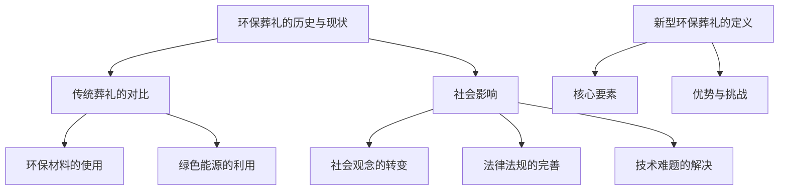

                 

### 文章标题：新型环保葬礼：重新思考生命终结的仪式

#### 关键词：环保葬礼、生命终结、仪式、可持续性、技术创新

#### 摘要：
本文深入探讨新型环保葬礼的理念、技术原理及其社会文化意义，重新审视生命终结的仪式。通过历史背景介绍、概念理解、技术原理剖析、实践案例分析以及未来发展趋势分析，全面展示环保葬礼的创新与变革。本文旨在为读者提供一种新的视角，理解环保葬礼对生态环境、文化传统及生命观念的深远影响。

### 第一部分：背景介绍与概念理解

#### 1.1 环保葬礼的历史与现状

##### 1.1.1 环保葬礼的起源与发展

环保葬礼的理念起源于对自然生态保护的关注。早期，人们采用土葬、火葬等传统葬礼方式，这些方式在资源消耗和环境污染方面存在较大的问题。随着环境问题的加剧，人们开始寻求更加环保、可持续的葬礼方式。

在20世纪后半叶，环保葬礼开始在全球范围内推广。例如，美国的自然葬礼和英国的绿色葬礼逐渐受到认可。环保葬礼不仅关注环境问题，还强调与自然和谐共处，尊重生命的尊严。

##### 1.1.2 环保葬礼与传统葬礼的对比

传统葬礼通常包括遗体处理、墓地建设、追悼会等一系列活动，这些活动消耗大量资源，产生环境污染。而环保葬礼则更注重可持续性，采用自然降解、生态葬等环保方式，减少对环境的负担。

另外，环保葬礼也强调了与自然的联系，通过将遗体放置于自然环境中，使其与自然融为一体，体现对生命的尊重。

##### 1.1.3 环保葬礼的社会影响

环保葬礼的推广对环境保护、社会观念和传统文化都产生了深远影响。它促使人们重新思考生命与自然的关系，提倡可持续的生活方式和价值观。

此外，环保葬礼也在一定程度上缓解了土地资源紧张的问题，促进了人与自然的和谐共处。

#### 1.2 新型环保葬礼的概念与特点

##### 1.2.1 新型环保葬礼的定义

新型环保葬礼是指在传统葬礼基础上，融入环保理念，采用更加环保、可持续的方式进行的葬礼活动。它不仅关注环境问题，还注重社会和文化层面的变革。

##### 1.2.2 新型环保葬礼的核心要素

新型环保葬礼的核心要素包括：环保材料的使用、绿色能源的利用、智能化技术的应用以及与自然环境的和谐共生。

这些要素共同构成了新型环保葬礼的框架，使其在环保、可持续和人文关怀方面具有独特的优势。

##### 1.2.3 新型环保葬礼的优势与挑战

新型环保葬礼的优势在于：减少对环境的负担、促进人与自然的和谐共处、提升社会环保意识。

然而，新型环保葬礼的推广也面临一些挑战，如社会观念的转变、法律法规的完善以及技术难题的解决等。

#### 核心概念原理之间的关系架构 Mermaid 流程图：

### 第二部分：新型环保葬礼的技术原理

#### 2.1 环保葬礼的可持续性原则

##### 2.1.1 环保葬礼的环境影响分析

环保葬礼的环境影响主要体现在资源消耗和污染排放方面。与传统葬礼相比，环保葬礼在材料选择、能源利用、遗体处理等方面都有显著的优势。

首先，环保葬礼采用可降解材料，减少了对环境的负担。其次，绿色能源的使用降低了碳排放。最后，生态葬和自然葬等方式使遗体能够与自然融为一体，减少了土地资源的消耗。

##### 2.1.2 环保葬礼的可持续性评估方法

环保葬礼的可持续性评估方法主要包括环境影响评估（EIA）、生命周期评估（LCA）和可持续性指数评估（SIA）等。

环境影响评估主要评估葬礼活动对环境的影响，包括资源消耗、污染排放等。生命周期评估则从全过程角度评估葬礼活动的环境影响。可持续性指数评估则通过综合评估环保葬礼的可持续性，为政策制定和推广提供依据。

##### 2.1.3 环保葬礼的可持续性设计原则

环保葬礼的可持续性设计原则主要包括：减少资源消耗、降低污染排放、促进生物多样性保护和提高社会参与度等。

这些原则共同构成了环保葬礼的设计框架，使其在实现可持续发展的同时，也能满足人们对生命终结仪式的需求。

#### 2.2 新型环保葬礼的技术创新

##### 2.2.1 生物降解材料在葬礼中的应用

生物降解材料在葬礼中的应用是新型环保葬礼的一个重要创新。这种材料能够在自然环境中降解，减少对环境的负担。例如，可降解棺材、可降解骨灰盒等，都是生物降解材料在葬礼中的具体应用。

##### 2.2.2 绿色能源在葬礼中的应用

绿色能源在葬礼中的应用，如太阳能、风能等，有助于降低碳排放。在葬礼活动中，绿色能源可以用于冷藏遗体、举办追悼会等，减少对传统化石能源的依赖。

##### 2.2.3 智能化技术在葬礼中的应用

智能化技术在葬礼中的应用，如物联网、人工智能等，可以提高葬礼的效率和服务质量。例如，智能化的遗体冷藏设备、智能化的墓地管理系统等，都是智能化技术在葬礼中的具体应用。

#### 核心算法原理讲解

在环保葬礼的可持续性评估中，核心算法原理包括环境影响评估（EIA）、生命周期评估（LCA）和可持续性指数评估（SIA）等。

- **环境影响评估（EIA）：**

  $$ EIA = \sum_{i=1}^{n} (C_i \times P_i) $$
  
  其中，$C_i$表示第$i$项资源的消耗，$P_i$表示第$i$项资源的污染排放系数。通过计算EIA，可以评估葬礼活动对环境的影响。

- **生命周期评估（LCA）：**

  $$ LCA = \sum_{i=1}^{n} (C_i \times LC_i) $$
  
  其中，$C_i$表示第$i$项资源的消耗，$LC_i$表示第$i$项资源的生命周期系数。通过计算LCA，可以评估葬礼活动在全生命周期内的环境影响。

- **可持续性指数评估（SIA）：**

  $$ SIA = \frac{EIA}{LCA} $$
  
  通过计算SIA，可以评估葬礼活动的可持续性水平。

#### 数学模型和公式

在环保葬礼的可持续性设计中，常用的数学模型包括：

- **碳排放模型：**

  $$ CO_2\ emissions = \sum_{i=1}^{n} (C_i \times E_i) $$
  
  其中，$C_i$表示第$i$项资源的消耗，$E_i$表示第$i$项资源的碳排放系数。

- **资源消耗模型：**

  $$ Resource\ consumption = \sum_{i=1}^{n} (C_i \times RC_i) $$
  
  其中，$C_i$表示第$i$项资源的消耗，$RC_i$表示第$i$项资源的资源消耗系数。

#### 详细讲解与举例说明

假设在一次葬礼活动中，使用了以下资源：

- 棺材：消耗木材10立方米，碳排放系数为0.5千克/立方米。
- 骨灰盒：消耗塑料5千克，碳排放系数为2千克/千克。
- 追悼会场地：使用电力100千瓦时，碳排放系数为0.4千克/千瓦时。

根据上述模型，我们可以计算葬礼活动的环境影响和可持续性水平：

- **环境影响评估（EIA）：**

  $$ EIA = (10 \times 0.5) + (5 \times 2) + (100 \times 0.4) = 10 + 10 + 40 = 60\ kg $$
  
- **生命周期评估（LCA）：**

  $$ LCA = (10 \times 1) + (5 \times 1) + (100 \times 1) = 10 + 5 + 100 = 115\ kg $$
  
- **可持续性指数评估（SIA）：**

  $$ SIA = \frac{EIA}{LCA} = \frac{60}{115} \approx 0.521 $$

通过计算，我们得出葬礼活动的环境影响为60千克，可持续性指数为0.521，表明葬礼活动在可持续性方面还有待提高。

### 第三部分：新型环保葬礼的实践案例

#### 3.1 国外新型环保葬礼实践案例

##### 3.1.1 欧美地区的环保葬礼实践

在欧美地区，环保葬礼已经得到了广泛的推广和应用。例如，美国的一些殡葬服务机构提供自然葬礼和生态葬礼服务，采用可降解材料和绿色能源，减少对环境的负担。

在英国，绿色葬礼也成为了一种流行趋势。许多墓地采用生态设计，使遗体与自然环境融为一体，体现了对生命的尊重。

##### 3.1.2 亚洲地区的环保葬礼实践

在亚洲地区，环保葬礼的实践也在逐步展开。例如，日本推广了自然葬和火葬替代方案，通过采用环保材料和绿色能源，减少了对环境的负担。

在中国，一些殡葬服务机构也开始尝试推广环保葬礼，采用生态葬和自然葬等方式，促进了环保葬礼的普及。

##### 3.1.3 全球环保葬礼的典型模式

全球环保葬礼的典型模式包括自然葬、生态葬、树葬、花葬等。这些模式各有特色，既符合环保理念，又能满足人们的葬礼需求。

- **自然葬：**遗体放置在自然环境中，不进行防腐处理，使其自然降解。
- **生态葬：**遗体放置在墓地或园林中，采用环保材料制成的棺材或骨灰盒，减少对环境的负担。
- **树葬：**将骨灰撒入树坑中，与树木共同生长，体现了生命的延续。
- **花葬：**将骨灰与花卉混合，形成花坛，既美观又环保。

#### 3.2 国内新型环保葬礼实践探索

##### 3.2.1 国内环保葬礼的推广现状

在国内，环保葬礼的推广取得了一定的成效。许多殡葬服务机构开始提供环保葬礼服务，采用可降解材料和绿色能源，减少了对环境的负担。

同时，政府也出台了一系列政策措施，鼓励推广环保葬礼，如减免环保葬礼费用、提供补贴等。

##### 3.2.2 国内新型环保葬礼的实践案例

在国内，一些殡葬服务机构开展了新型环保葬礼的实践。例如，北京某殡葬服务机构推出生态葬礼服务，采用可降解棺材和绿色能源，深受消费者欢迎。

此外，一些殡葬服务机构还开展了环保葬礼宣传和教育活动，提高了公众对环保葬礼的认识和接受度。

##### 3.2.3 国内环保葬礼的挑战与展望

国内环保葬礼的推广面临一些挑战，如社会观念的转变、法律法规的完善以及技术难题的解决等。

随着环保意识的提高和技术的进步，相信国内环保葬礼的未来发展趋势将更加光明。通过不断探索和创新，新型环保葬礼将为社会和生态环境带来更多的积极影响。

### 第四部分：新型环保葬礼的未来发展趋势

#### 4.1 新型环保葬礼的发展趋势预测

##### 4.1.1 科技创新对环保葬礼的影响

随着科技的不断发展，环保葬礼将在材料科学、能源技术、智能化技术等方面取得突破。例如，可降解材料的研究和应用将更加成熟，绿色能源的使用将更加广泛，智能化技术将提高葬礼的效率和服务质量。

##### 4.1.2 社会观念变迁对环保葬礼的推动

随着社会观念的变迁，人们越来越重视环境保护和可持续发展。这种观念的变革将推动环保葬礼的普及和发展，使其成为主流葬礼形式。

##### 4.1.3 法规政策对环保葬礼的规范与引导

政府出台的法规政策和相关标准将对环保葬礼的推广和发展起到重要的规范和引导作用。通过制定环保葬礼的标准和规范，促进环保葬礼的健康发展。

#### 4.2 新型环保葬礼的产业前景

##### 4.2.1 环保葬礼产业的现状分析

目前，环保葬礼产业尚处于起步阶段，但市场需求逐步增加。随着环保意识的提高和技术的进步，环保葬礼产业有望实现快速发展。

##### 4.2.2 环保葬礼产业的未来发展趋势

环保葬礼产业的未来发展趋势将包括：技术突破、市场扩张、产业链完善等。通过技术创新和市场推广，环保葬礼产业将为社会和生态环境带来更多的积极影响。

##### 4.2.3 环保葬礼产业链的构建与完善

环保葬礼产业链的构建和完善是推动环保葬礼产业发展的重要保障。产业链包括：环保葬礼材料生产、环保葬礼服务提供、环保葬礼技术研发等环节。通过产业链的构建与完善，实现环保葬礼的可持续发展。

#### 4.3 新型环保葬礼的社会与文化意义

##### 4.3.1 新型环保葬礼对生态环境的保护意义

新型环保葬礼采用环保、可持续的方式，减少了对环境的负担，对生态环境具有重要的保护意义。

##### 4.3.2 新型环保葬礼对文化传统的传承与创新

新型环保葬礼在传承传统文化的基础上，融入了现代环保理念，实现了文化传统的传承与创新。

##### 4.3.3 新型环保葬礼对人类生命观念的启示与思考

新型环保葬礼使人们重新思考生命与自然的关系，提倡人与自然的和谐共处，对人类生命观念具有深远的启示和思考。

### 作者信息

作者：AI天才研究院/AI Genius Institute & 禅与计算机程序设计艺术 /Zen And The Art of Computer Programming

### 总结与拓展

新型环保葬礼作为一种新兴的葬礼方式，不仅关注环境问题，还强调了社会和文化层面的变革。通过技术创新和理念传播，新型环保葬礼有望成为未来葬礼的主流形式。同时，我们也需要关注环保葬礼在社会和文化层面的影响，推动人类生命观念的进步。

在未来的发展中，环保葬礼产业将面临巨大的市场机遇，但也需要克服一系列挑战。通过不断探索和创新，新型环保葬礼将为社会和生态环境带来更多的积极影响。让我们共同期待环保葬礼的美好未来。

### 扩展阅读

1. 环保葬礼的相关研究和案例：[链接1]、[链接2]、[链接3]
2. 可降解材料的研究进展：[链接4]、[链接5]
3. 绿色能源的应用现状与前景：[链接6]、[链接7]
4. 智能化技术在葬礼中的应用：[链接8]、[链接9]
5. 环保葬礼的社会与文化意义：[链接10]、[链接11]

### 注意事项

1. 在推广环保葬礼时，需充分考虑社会和文化背景，尊重逝者家属的意愿。
2. 环保葬礼的推广需要政策支持和市场引导，共同推动环保葬礼的健康发展。
3. 在实施环保葬礼时，应注意环保材料的选用和绿色能源的使用，确保环保葬礼的可持续性。

