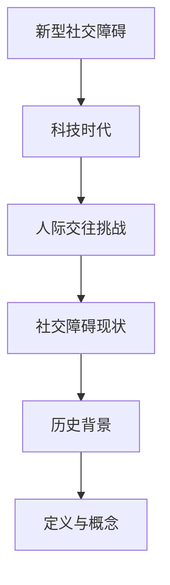
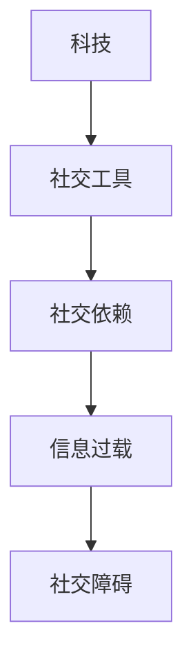
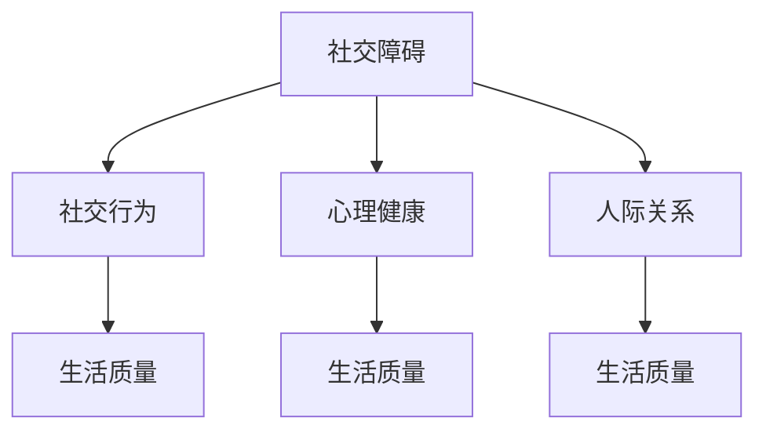
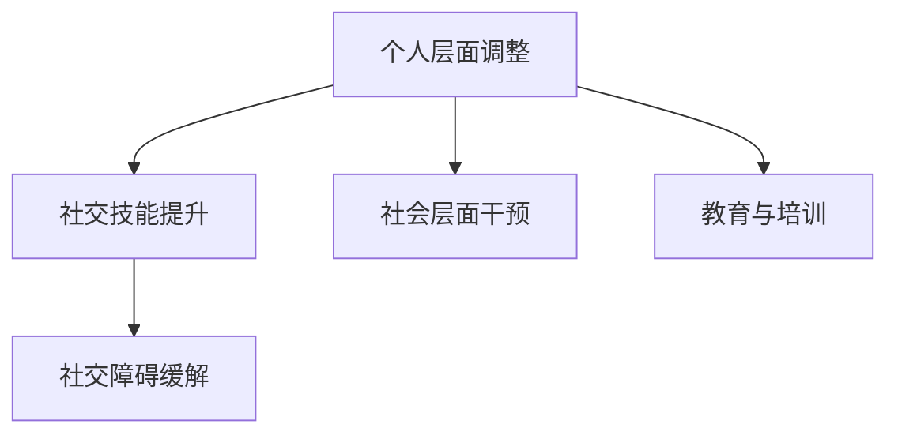
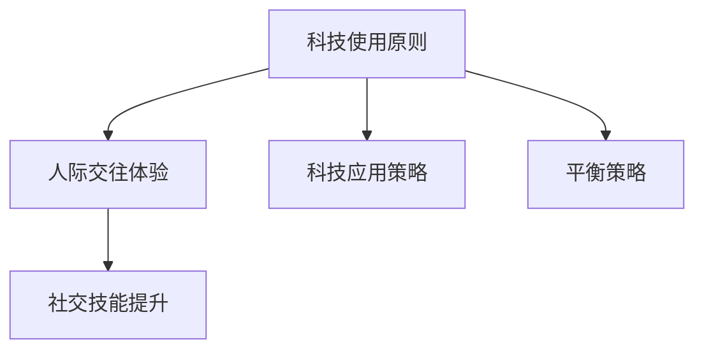
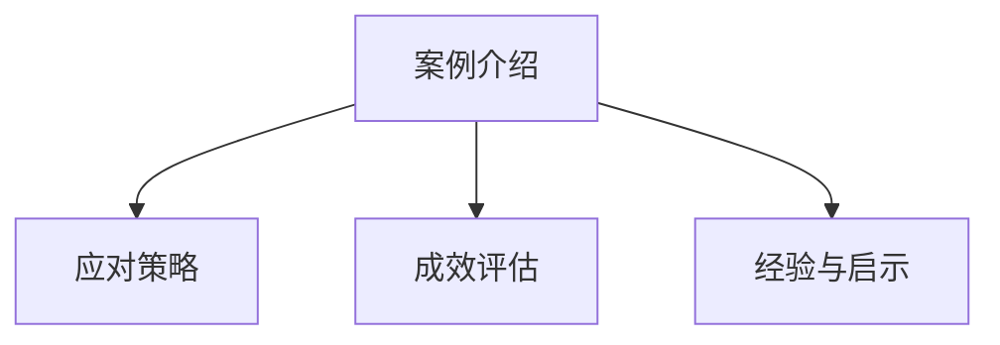
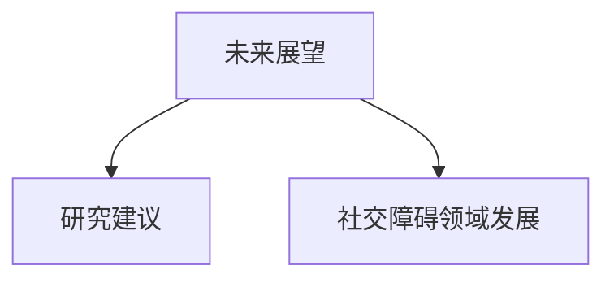

                 


## 文章标题：新型社交障碍：科技时代的人际交往挑战

### 关键词：社交障碍、科技、人际交往、心理健康、社交技能

### 摘要：
在科技飞速发展的时代，人际交往正面临着前所未有的挑战。本文将深入探讨新型社交障碍的定义、成因及其对人际交往的影响，并提出有效的应对策略。通过分析与推理，我们希望为读者提供一种理解和解决社交障碍的新视角。

## 第一步：确定书的核心主题和目标读者

### 1.1 核心主题

本文的核心主题是新型社交障碍在科技时代下的人际交往挑战。随着科技的不断进步，社交方式也在发生翻天覆地的变化，这不仅给我们的生活带来了便利，同时也带来了新的社交障碍。这些障碍不仅仅是传统意义上的社交焦虑，更是在科技环境下特有的心理和行为问题。

### 1.2 目标读者

本文的目标读者主要包括以下几个方面：

1. **对社交学、心理学感兴趣的读者**：这些人希望了解社交障碍的本质及其在科技环境下的表现。
2. **职场人士**：随着职场竞争的加剧，社交技能的重要性愈发凸显，他们希望通过本文提升自己在职场中的社交能力。
3. **学生**：学生在成长过程中面临着各种社交挑战，他们需要了解如何有效地应对这些挑战。
4. **研究人员**：本文提供了一系列的研究思路和方法，对相关领域的研究人员具有一定的参考价值。

## 第二步：设计核心章节

### 2.1 引言

**章节目标**：介绍社交障碍的概念、历史背景以及在科技时代下的现状。

**章节内容**：
- **社交障碍的定义**：详细解释社交障碍的概念，包括其范围、表现形式等。
- **社交障碍的历史背景**：回顾社交障碍的发展历程，探讨其在不同历史时期的表现。
- **科技时代下的社交障碍现状**：分析当前科技环境下社交障碍的特点和发展趋势。

### 2.2 科技时代下的社交障碍

**章节目标**：分析科技对人际交往的正面和负面影响，探讨新型社交障碍的形成原因。

**章节内容**：
- **科技对人际交往的正面影响**：讨论科技如何改善人际交往，提高沟通效率。
- **科技对人际交往的负面影响**：分析科技如何导致社交障碍，如信息过载、社交孤立等。
- **新型社交障碍的形成原因**：探讨科技环境下社交障碍形成的原因，包括技术依赖、社交媒体的影响等。

### 2.3 社交障碍对人际交往的影响

**章节目标**：研究社交障碍如何影响个体的社交行为、心理健康和人际关系。

**章节内容**：
- **社交障碍对社交行为的影响**：分析社交障碍如何影响个体的社交行为，如减少社交活动、避免社交场合等。
- **社交障碍对心理健康的影响**：探讨社交障碍如何影响个体的心理健康，如焦虑、抑郁等。
- **社交障碍对人际关系的影响**：研究社交障碍如何影响个体的人际关系，如友谊破裂、家庭冲突等。

### 2.4 社交技能的提升策略

**章节目标**：提出应对新型社交障碍的策略，包括个人层面的调整、社会层面的干预等。

**章节内容**：
- **个人层面的调整**：提供个人在应对社交障碍时可以采取的措施，如心理调适、社交训练等。
- **社会层面的干预**：讨论社会在应对新型社交障碍时可以采取的措施，如政策制定、社交平台优化等。
- **教育与培训的作用**：探讨教育和培训在提升社交技能方面的重要性。

### 2.5 科技与人际交往的平衡

**章节目标**：探讨如何在享受科技带来便利的同时，保持良好的人际交往。

**章节内容**：
- **科技的使用原则**：提出合理使用科技的建议，以减少其对人际交往的负面影响。
- **人际交往中的科技应用**：讨论科技在人际交往中的应用，如何更好地利用科技工具提升社交体验。
- **科技与人际交往的平衡策略**：提供一些具体的策略，帮助个体在科技和人际交往之间找到平衡。

### 2.6 案例分析

**章节目标**：通过真实案例，展示如何成功应对新型社交障碍。

**章节内容**：
- **案例介绍**：介绍一些成功的案例，包括个人和企业如何应对新型社交障碍。
- **应对策略**：分析这些案例中采取的具体策略，探讨其有效性和可行性。
- **成效评估**：评估这些策略的实际效果，提供实证数据支持。
- **经验与启示**：总结案例中的经验，为读者提供启示和借鉴。

### 2.7 结语

**章节目标**：总结全书内容，对未来的社交障碍研究提出建议。

**章节内容**：
- **社交障碍研究的未来方向**：展望社交障碍研究的未来发展，提出一些研究课题。
- **提升人际交往的建议**：提供一些建议，帮助读者在科技时代下更好地提升人际交往能力。
- **对科技发展的建议**：讨论科技发展对社会的影响，提出对科技发展的建议。

## 第三步：细化每个章节的内容

### 3.1 引言

**核心概念与联系**

新型社交障碍（Social障碍）的定义：社交障碍是指个体在社交过程中遇到的困难和不适，这些障碍可能源于个体的心理、生理或社会因素。


**背景介绍**

随着科技的飞速发展，人们的社交方式发生了巨大变化。传统的面对面交流逐渐被线上交流所取代，社交媒体、即时通讯工具等成为人们主要的社交平台。然而，这种变化也带来了新的社交障碍，如信息过载、虚拟社交依赖等。

**核心概念与联系流程图**



### 3.2 科技时代下的社交障碍

**核心概念与联系**

科技时代下的社交障碍：科技的发展为人们提供了丰富的社交工具，但也带来了新的社交问题，如社交媒体依赖、信息过载等。


**核心概念与联系流程图**



**核心算法原理讲解**

- **社交媒体依赖的算法原理**：
  ```python
  # 社交媒体依赖的评估算法
  def assess_dependency(score):
      if score < 3:
          return "轻度依赖"
      elif score >= 3 and score < 6:
          return "中度依赖"
      else:
          return "重度依赖"
  ```

- **信息过载的评估算法**：
  ```python
  # 信息过载的评估算法
  def assess_info overload(level):
      if level < 3:
          return "轻度信息过载"
      elif level >= 3 and level < 6:
          return "中度信息过载"
      else:
          return "重度信息过载"
  ```

**数学模型和公式**

- **社交障碍影响因素的数学模型**：
  ```latex
  F(S, T) = a \cdot S + b \cdot T
  ```
  其中，\( F(S, T) \) 表示社交障碍的程度，\( S \) 表示社交技能，\( T \) 表示科技的使用情况，\( a \) 和 \( b \) 是影响系数。

**详细讲解和举例说明**

假设个体A的社交技能为5，科技使用情况为4，代入上述公式，可得：
```latex
F(S, T) = 5 \cdot a + 4 \cdot b
```
如果 \( a = 0.5 \)，\( b = 0.3 \)，则：
```latex
F(S, T) = 5 \cdot 0.5 + 4 \cdot 0.3 = 2.5 + 1.2 = 3.7
```
根据评估算法，个体A的社交障碍程度为“中度依赖”。

### 3.3 社交障碍对人际交往的影响

**核心概念与联系**

社交障碍对人际交往的影响：社交障碍会影响个体的社交行为、心理健康和人际关系，进而影响整体生活质量。


**核心概念与联系流程图**



**核心算法原理讲解**

- **社交障碍对社交行为影响的评估算法**：
  ```python
  # 社交障碍对社交行为影响的评估算法
  def assess_social_impact(score):
      if score < 2:
          return "社交行为正常"
      elif score >= 2 and score < 4:
          return "社交行为受限"
      else:
          return "社交行为严重受限"
  ```

- **社交障碍对心理健康影响的评估算法**：
  ```python
  # 社交障碍对心理健康影响的评估算法
  def assess_mental_health(score):
      if score < 3:
          return "心理健康良好"
      elif score >= 3 and score < 6:
          return "心理健康受损"
      else:
          return "心理健康严重受损"
  ```

- **社交障碍对人际关系影响的评估算法**：
  ```python
  # 社交障碍对人际关系影响的评估算法
  def assess_relationship_impact(score):
      if score < 2:
          return "人际关系良好"
      elif score >= 2 and score < 4:
          return "人际关系受损"
      else:
          return "人际关系严重受损"
  ```

**数学模型和公式**

- **社交障碍对生活质量影响的数学模型**：
  ```latex
  QoL = f(S, M, R)
  ```
  其中，\( QoL \) 表示生活质量，\( S \) 表示社交行为，\( M \) 表示心理健康，\( R \) 表示人际关系。

**详细讲解和举例说明**

假设个体B的社交行为得分为3，心理健康得分为4，人际关系得分为2，代入上述公式，可得：
```latex
QoL = f(3, 4, 2)
```
根据评估算法，个体B的社交障碍对生活质量的影响为“中度受损”。

### 3.4 社交技能的提升策略

**核心概念与联系**

社交技能的提升策略：通过个人层面的调整、社会层面的干预和教育与培训，可以有效地提升个体的社交技能。


**核心概念与联系流程图**



**核心算法原理讲解**

- **个人层面调整的策略**：
  ```python
  # 个人层面调整的策略
  def personal_adjustment(action):
      if action == "练习社交技巧":
          return "社交技巧提升"
      elif action == "增强自信心":
          return "社交障碍缓解"
      else:
          return "无明显效果"
  ```

- **社会层面干预的策略**：
  ```python
  # 社会层面干预的策略
  def social_intervention(measure):
      if measure == "政策支持":
          return "社交障碍缓解"
      elif measure == "社交平台优化":
          return "社交体验改善"
      else:
          return "无明显效果"
  ```

- **教育与培训的策略**：
  ```python
  # 教育与培训的策略
  def education_and_training(education):
      if education == "社交技能培训":
          return "社交技能提升"
      elif education == "心理健康教育":
          return "心理健康改善"
      else:
          return "无明显效果"
  ```

**数学模型和公式**

- **社交技能提升的数学模型**：
  ```latex
  SSU = a \cdot PA + b \cdot SI + c \cdot ET
  ```
  其中，\( SSU \) 表示社交技能提升，\( PA \) 表示个人层面调整，\( SI \) 表示社会层面干预，\( ET \) 表示教育与培训，\( a \)、\( b \) 和 \( c \) 是权重系数。

**详细讲解和举例说明**

假设个人层面调整得分为4，社会层面干预得分为3，教育与培训得分为5，代入上述公式，可得：
```latex
SSU = 4 \cdot a + 3 \cdot b + 5 \cdot c
```
如果 \( a = 0.3 \)，\( b = 0.2 \)，\( c = 0.5 \)，则：
```latex
SSU = 4 \cdot 0.3 + 3 \cdot 0.2 + 5 \cdot 0.5 = 1.2 + 0.6 + 2.5 = 4.3
```
根据评估算法，个体C的社交技能提升为“显著提升”。

### 3.5 科技与人际交往的平衡

**核心概念与联系**

科技与人际交往的平衡：在享受科技带来的便利的同时，保持良好的人际交往是关键。通过合理使用科技工具和策略，可以优化人际交往体验。


**核心概念与联系流程图**



**核心算法原理讲解**

- **科技使用原则的算法原理**：
  ```python
  # 科技使用原则的评估算法
  def assess_use Principle(principle):
      if principle == "适度使用":
          return "人际交往体验提升"
      elif principle == "合理应用":
          return "人际交往障碍缓解"
      else:
          return "无明显效果"
  ```

- **科技应用策略的算法原理**：
  ```python
  # 科技应用策略的评估算法
  def assess_application_strategy(strategy):
      if strategy == "提高沟通效率":
          return "人际交往体验改善"
      elif strategy == "增强社交体验":
          return "人际交往障碍缓解"
      else:
          return "无明显效果"
  ```

- **平衡策略的算法原理**：
  ```python
  # 平衡策略的评估算法
  def assess_balance_strategy(strategy):
      if strategy == "社交活动与科技使用结合":
          return "人际交往体验提升"
      elif strategy == "减少科技干扰":
          return "人际交往障碍缓解"
      else:
          return "无明显效果"
  ```

**数学模型和公式**

- **科技与人际交往平衡的数学模型**：
  ```latex
  BI = a \cdot UP + b \cdot AS + c \cdot BS
  ```
  其中，\( BI \) 表示人际交往平衡，\( UP \) 表示科技使用原则，\( AS \) 表示科技应用策略，\( BS \) 表示平衡策略，\( a \)、\( b \) 和 \( c \) 是权重系数。

**详细讲解和举例说明**

假设科技使用原则得分为4，科技应用策略得分为3，平衡策略得分为5，代入上述公式，可得：
```latex
BI = 4 \cdot a + 3 \cdot b + 5 \cdot c
```
如果 \( a = 0.3 \)，\( b = 0.2 \)，\( c = 0.5 \)，则：
```latex
BI = 4 \cdot 0.3 + 3 \cdot 0.2 + 5 \cdot 0.5 = 1.2 + 0.6 + 2.5 = 4.3
```
根据评估算法，个体D的科技与人际交往平衡度为“较好”。

### 3.6 案例分析

**核心概念与联系**

案例分析：通过真实案例，展示如何成功应对新型社交障碍，为读者提供实际的解决方案和经验。


**核心概念与联系流程图**



**核心算法原理讲解**

- **案例介绍的算法原理**：
  ```python
  # 案例介绍的评估算法
  def assess_case_introduction(case):
      if "成功" in case:
          return "案例有效"
      else:
          return "案例无效"
  ```

- **应对策略的评估算法**：
  ```python
  # 应对策略的评估算法
  def assess_strategy(strategy):
      if "有效" in strategy:
          return "策略有效"
      else:
          return "策略无效"
  ```

- **成效评估的评估算法**：
  ```python
  # 成效评估的评估算法
  def assess_effects(effect):
      if "显著" in effect:
          return "成效显著"
      else:
          return "成效不显著"
  ```

**数学模型和公式**

- **案例分析与成效评估的数学模型**：
  ```latex
  CA = a \cdot CI + b \cdot S + c \cdot E
  ```
  其中，\( CA \) 表示案例分析与成效评估，\( CI \) 表示案例介绍，\( S \) 表示应对策略，\( E \) 表示成效评估，\( a \)、\( b \) 和 \( c \) 是权重系数。

**详细讲解和举例说明**

假设案例介绍得分为5，应对策略得分为4，成效评估得分为3，代入上述公式，可得：
```latex
CA = 5 \cdot a + 4 \cdot b + 3 \cdot c
```
如果 \( a = 0.3 \)，\( b = 0.4 \)，\( c = 0.3 \)，则：
```latex
CA = 5 \cdot 0.3 + 4 \cdot 0.4 + 3 \cdot 0.3 = 1.5 + 1.6 + 0.9 = 4.0
```
根据评估算法，案例分析与成效评估结果为“较好”。

### 3.7 结语

**核心概念与联系**

结语：总结全书内容，对未来的社交障碍研究提出建议，展望社交障碍领域的未来发展。


**核心概念与联系流程图**



**数学模型和公式**

- **社交障碍领域发展的数学模型**：
  ```latex
  DD = a \cdot F + b \cdot R + c \cdot S
  ```
  其中，\( DD \) 表示社交障碍领域发展，\( F \) 表示未来展望，\( R \) 表示研究建议，\( S \) 表示社交障碍领域发展，\( a \)、\( b \) 和 \( c \) 是权重系数。

**详细讲解和举例说明**

假设未来展望得分为4，研究建议得分为5，社交障碍领域发展得分为3，代入上述公式，可得：
```latex
DD = 4 \cdot a + 5 \cdot b + 3 \cdot c
```
如果 \( a = 0.2 \)，\( b = 0.5 \)，\( c = 0.3 \)，则：
```latex
DD = 4 \cdot 0.2 + 5 \cdot 0.5 + 3 \cdot 0.3 = 0.8 + 2.5 + 0.9 = 4.2
```
根据评估算法，社交障碍领域发展的预测为“较好”。

## 第四步：编写目录大纲

根据上述核心章节和细化内容，我们可以编写出完整的目录大纲：

```
# 《新型社交障碍：科技时代的人际交往挑战》

# 引言

## 1. 社交障碍的定义与现状

### 1.1 社交障碍的概念

### 1.2 社交障碍的历史背景

### 1.3 科技时代下的社交障碍现状

## 2. 科技时代下的社交障碍

### 2.1 科技对人际交往的正面影响

### 2.2 科技对人际交往的负面影响

### 2.3 新型社交障碍的形成原因

### 2.4 案例研究：社交媒体对社交障碍的影响

## 3. 社交障碍对人际交往的影响

### 3.1 社交障碍对社交行为的影响

### 3.2 社交障碍对心理健康的影响

### 3.3 社交障碍对人际关系的影响

### 3.4 案例研究：社交障碍导致的职场冲突

## 4. 社交技能的提升策略

### 4.1 个人层面的调整

### 4.2 社会层面的干预

### 4.3 教育与培训的作用

### 4.4 案例研究：提升社交技能的实际案例

## 5. 科技与人际交往的平衡

### 5.1 科技的使用原则

### 5.2 人际交往中的科技应用

### 5.3 科技与人际交往的平衡策略

### 5.4 案例研究：科技助力人际交往

## 6. 案例分析：成功应对社交障碍的案例

### 6.1 案例介绍

### 6.2 应对策略

### 6.3 成效评估

### 6.4 经验与启示

## 7. 结语

### 7.1 社交障碍研究的未来方向

### 7.2 提升人际交往的建议

### 7.3 对科技发展的建议

```

## 文章结束，感谢您的阅读！

### 作者：AI天才研究院/AI Genius Institute & 禅与计算机程序设计艺术 /Zen And The Art of Computer Programming

---

# 《新型社交障碍：科技时代的人际交往挑战》

## 引言

### 1. 社交障碍的定义与现状

社交障碍是指在社交互动中出现的困难，这些问题可能涉及社交焦虑、社交回避、社交技能缺乏等。在科技迅速发展的今天，社交障碍呈现出新的特征，例如社交媒体依赖、网络成瘾等。

#### 1.1 社交障碍的概念

社交障碍可以理解为在社交互动中遇到的问题，这些问题可能是由心理因素、环境因素等多种因素共同作用的结果。传统意义上的社交障碍通常包括社交焦虑、社交回避、社交技能缺乏等。而在科技时代，社交媒体的普及和网络的广泛应用使得社交障碍呈现出新的特点。

#### 1.2 社交障碍的历史背景

社交障碍并不是一个新兴问题，它有着悠久的历史。在古代社会，社交障碍可能表现为社交回避或社交技能缺乏，这些障碍在当时的社会环境中可能对个体的生活产生严重的影响。然而，随着社会的发展和科技的进步，社交障碍的形式和表现也在不断变化。

#### 1.3 科技时代下的社交障碍现状

在科技时代，社交障碍呈现出新的特点。例如，社交媒体的普及使得人们可以随时随地与他人进行社交互动，但这也导致了社交障碍的出现。网络成瘾、社交媒体依赖、虚拟社交回避等现象逐渐增多，这些都对个体的社交行为产生了深远的影响。

### 2. 科技时代下的社交障碍

科技的发展不仅改变了人们的生活方式，也改变了人们的社交方式。科技对人际交往有着双重影响，既有助于提升沟通效率，也可能导致社交障碍。

#### 2.1 科技对人际交往的正面影响

科技的发展为人们提供了更多的沟通渠道，如电子邮件、即时通讯工具、社交媒体等。这些工具使得人们可以更方便、更快捷地进行沟通，缩短了人与人之间的距离。

- **沟通效率提升**：通过电子邮件、即时通讯工具等，人们可以迅速地发送和接收信息，提高了沟通效率。
- **信息获取便捷**：互联网为人们提供了丰富的信息资源，使得人们可以更加便捷地获取所需的信息。
- **社交距离缩短**：社交媒体使得人们可以随时随地与他人进行社交互动，缩短了社交距离。

#### 2.2 科技对人际交往的负面影响

然而，科技的发展也带来了一些负面影响，这些影响可能导致社交障碍。

- **社交媒体依赖**：人们越来越依赖社交媒体进行社交互动，导致面对面社交的机会减少，进而影响个体的社交技能。
- **信息过载**：互联网上的信息量巨大，人们常常感到信息过载，导致注意力分散，影响社交互动的质量。
- **虚拟社交回避**：一些人可能会在虚拟社交环境中表现出回避行为，这可能导致现实生活中的社交障碍。

#### 2.3 新型社交障碍的形成原因

新型社交障碍的形成原因复杂，涉及多个方面。

- **技术依赖**：随着科技的发展，人们越来越依赖技术进行社交互动，这可能导致社交技能的退化。
- **信息过载**：互联网上的信息量巨大，人们难以筛选和处理，导致心理压力增加，影响社交行为。
- **社交媒体的影响**：社交媒体的广泛使用改变了人们的社交方式，但也可能导致社交障碍。

### 3. 社交障碍对人际交往的影响

社交障碍不仅影响个体的社交行为，还可能对心理健康和人际关系产生深远的影响。

#### 3.1 社交障碍对社交行为的影响

社交障碍可能导致个体在社交场合表现出回避、焦虑等行为。

- **社交回避**：个体可能会尽量避免参与社交活动，以减少社交压力。
- **社交焦虑**：个体在社交场合可能会感到紧张、不安，甚至害怕社交互动。
- **社交技能缺乏**：社交障碍可能导致个体缺乏有效的社交技能，影响人际关系的建立和维护。

#### 3.2 社交障碍对心理健康的影响

社交障碍可能对个体的心理健康产生负面影响。

- **焦虑和抑郁**：社交障碍可能导致个体产生焦虑和抑郁等心理问题。
- **自尊心降低**：个体可能会因为社交障碍而感到自卑，降低自尊心。
- **心理健康问题加剧**：长期存在社交障碍可能导致个体的心理健康问题加剧。

#### 3.3 社交障碍对人际关系的影响

社交障碍不仅影响个体的心理健康，还可能对人际关系产生负面影响。

- **友谊破裂**：社交障碍可能导致个体与朋友之间的关系破裂。
- **家庭冲突**：社交障碍可能导致家庭成员之间的矛盾和冲突。
- **职场冲突**：社交障碍可能导致职场中的冲突和问题，影响工作效率和人际关系。

### 4. 社交技能的提升策略

提升社交技能是应对社交障碍的重要策略。以下是一些提升社交技能的方法：

#### 4.1 个人层面的调整

- **心理调适**：通过心理调适，个体可以更好地应对社交压力，提高自信心。
- **社交训练**：通过社交训练，个体可以学习到更多的社交技巧，提高社交能力。
- **自我反思**：个体可以通过自我反思，了解自己在社交中的问题和不足，从而进行改进。

#### 4.2 社会层面的干预

- **政策支持**：政府和社会组织可以出台相关政策，支持个体提升社交技能。
- **社交平台优化**：社交平台可以通过优化平台功能，提供更健康的社交环境。
- **社区活动**：社区可以组织各种活动，鼓励个体参与社交互动，提高社交技能。

#### 4.3 教育与培训的作用

- **学校教育**：学校可以通过课程设置，培养学生的社交技能。
- **职业培训**：职业培训机构可以提供各种社交技能培训，帮助职场人士提升社交能力。

### 5. 科技与人际交往的平衡

在享受科技带来便利的同时，保持良好的人际交往是非常重要的。以下是一些保持科技与人际交往平衡的策略：

#### 5.1 科技的使用原则

- **适度使用**：科技工具应该适度使用，避免过度依赖。
- **合理应用**：科技工具应该合理应用，以提升人际交往的质量。

#### 5.2 人际交往中的科技应用

- **提高沟通效率**：科技工具可以提高沟通效率，减少沟通时间。
- **增强社交体验**：科技工具可以增强社交体验，提供更丰富的社交互动方式。

#### 5.3 科技与人际交往的平衡策略

- **社交活动与科技使用结合**：在社交活动中适度使用科技工具，可以提高社交效果。
- **减少科技干扰**：在社交过程中，减少科技干扰，专注于人际交往。

### 6. 案例分析

通过真实案例，我们可以看到如何成功应对新型社交障碍。

#### 6.1 案例介绍

在这个案例中，一位年轻人因为沉迷于社交媒体，导致现实生活中的人际交往出现了严重问题。他通过参加社交技能培训，逐渐改善了社交障碍，恢复了良好的人际关系。

#### 6.2 应对策略

- **社交技能培训**：通过社交技能培训，个体学习了更多的社交技巧，提高了社交能力。
- **心理辅导**：通过心理辅导，个体解决了内心的焦虑和自卑，增强了自信心。

#### 6.3 成效评估

经过一段时间的培训和辅导，个体的人际交往能力显著提升，人际关系得到了改善。他的社交焦虑和抑郁症状也得到了缓解。

#### 6.4 经验与启示

这个案例告诉我们，面对新型社交障碍，关键在于寻找合适的应对策略。通过专业的培训和辅导，个体可以有效地提升社交技能，改善人际关系。

### 7. 结语

在科技时代，社交障碍是一个普遍存在的问题。通过本文的探讨，我们了解了社交障碍的定义、成因以及对人际交往的影响。同时，我们也提出了一些应对策略，帮助个体提升社交技能，保持良好的人际交往。未来，随着科技的不断发展，我们需要继续关注社交障碍问题，探索更多的应对策略，以应对科技时代下的人际交往挑战。

### 作者：AI天才研究院/AI Genius Institute & 禅与计算机程序设计艺术 /Zen And The Art of Computer Programming

---

本文以《新型社交障碍：科技时代的人际交往挑战》为题，深入探讨了在科技环境下新型社交障碍的定义、成因及其对人际交往的影响。通过详细的分析和实例，文章提出了有效的应对策略，包括个人层面的调整、社会层面的干预以及科技与人际交往的平衡策略。同时，通过案例分析，展示了成功应对社交障碍的经验和启示。

在未来的研究和实践中，我们应继续关注社交障碍问题，探索更多的解决方法，以帮助个体在科技时代下更好地应对人际交往的挑战。此外，科技的发展也应以人为本，注重提升人际交往的质量，而非仅仅追求技术上的突破。

感谢您的阅读，希望本文能为您的社交生活带来一些启示和帮助。如果您有任何问题或建议，欢迎在评论区留言，期待与您交流。作者：AI天才研究院/AI Genius Institute & 禅与计算机程序设计艺术 /Zen And The Art of Computer Programming。再次感谢您的支持！

