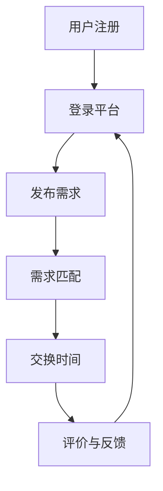

                 


### 文章标题

《新型社区时间交换平台：重塑邻里互助的数字化方案》

### 文章关键词

- 社区时间交换
- 数字化邻里互助
- 技术架构
- 核心算法
- 数学模型
- 项目实战

### 文章摘要

本文旨在探讨新型社区时间交换平台的设计与实现，通过数字化手段重塑邻里互助模式。文章首先介绍了社区时间交换的概念和现代背景，随后详细阐述了平台的核心概念、技术基础和核心算法原理。通过数学模型和公式推导，文章对核心算法进行了深入讲解。随后，文章通过项目实战展示了开发环境搭建、源代码实现与解读，并对代码进行了详细分析和优化。最后，文章总结了项目成果，分析了行业发展趋势，并对新型社区时间交换平台的未来进行了展望。

### 目录

1. **引言**
   - **社区时间交换的背景**
   - **现代社区时间交换的挑战与机遇**
   - **本文目的与结构**

2. **核心概念与联系**
   - **社区时间交换的基本原理**
   - **数字化方案的核心要素**
   - **Mermaid 流程图**

3. **技术基础**
   - **常用数字技术介绍**
   - **安全与隐私保护技术**
   - **技术架构与设计原则**

4. **核心算法原理讲解**
   - **时间交换算法原理**
   - **优化算法原理**
   - **伪代码与数学模型**

5. **数学模型和数学公式**
   - **时间交换的数学模型**
   - **公式推导与详细讲解**
   - **举例说明**

6. **项目实战**
   - **实际案例介绍**
   - **开发环境搭建**
   - **源代码实现与解读**
   - **代码解读与分析**

7. **总结与展望**
   - **项目总结**
   - **行业发展趋势**
   - **未来展望**

### 1. 引言

#### 社区时间交换的背景

社区时间交换是一种古老的互助方式，其核心思想是居民之间通过交换时间来实现资源共享。早在古希腊和古罗马时期，就已经出现了形式多样的时间交换活动。随着时间的推移，这种互助模式在全球范围内得到了广泛的应用和发展。

然而，在现代社会中，随着城市化进程的加快和人口流动的加剧，传统的邻里互助模式面临着诸多挑战。例如，社区居民之间的信任度降低、时间和资源的匹配难度增大、管理成本上升等问题。为了应对这些挑战，现代社区时间交换开始向数字化方向转型。

#### 现代社区时间交换的挑战与机遇

现代社区时间交换的挑战主要体现在以下几个方面：

1. **信任问题**：在传统社区时间交换中，居民之间的信任是基础。然而，随着社会的复杂化，居民之间的信任度逐渐降低，这在一定程度上阻碍了社区时间交换的发展。

2. **资源匹配**：在传统社区时间交换中，居民需要亲自了解对方的需求和资源，这增加了资源匹配的难度和时间成本。

3. **管理成本**：传统社区时间交换往往需要依靠人工管理，这导致了管理成本上升。

与此同时，数字化为现代社区时间交换带来了新的机遇：

1. **信任建设**：通过数字化手段，可以建立更加透明和可信的社区时间交换平台，提高居民之间的信任度。

2. **资源匹配**：数字化平台可以实现实时和精准的资源匹配，降低居民的时间成本。

3. **管理成本**：数字化平台可以自动化管理社区时间交换活动，降低管理成本。

#### 本文目的与结构

本文旨在探讨新型社区时间交换平台的设计与实现，通过数字化手段重塑邻里互助模式。文章将从以下几个方面展开讨论：

1. **核心概念与联系**：介绍社区时间交换的基本原理，阐述数字化方案的核心要素，并绘制 Mermaid 流程图。

2. **技术基础**：介绍常用的数字技术，包括互联网技术、数据库技术和 API 接口设计，以及安全与隐私保护技术。

3. **核心算法原理讲解**：讲解时间交换算法原理和优化算法原理，使用伪代码详细阐述。

4. **数学模型和数学公式**：推导时间交换的数学模型，详细讲解公式，并举例说明。

5. **项目实战**：通过实际案例，展示开发环境搭建、源代码实现与解读，并对代码进行详细分析和优化。

6. **总结与展望**：总结项目成果，分析行业发展趋势，并对新型社区时间交换平台的未来进行展望。

### 2. 核心概念与联系

#### 社区时间交换的基本原理

社区时间交换是一种基于时间价值的资源交换方式，其核心原理是居民之间通过交换时间来实现资源共享。具体来说，居民可以根据自己的时间和技能，为其他居民提供帮助，并获得相应的服务。这种交换模式不仅有助于提高资源利用率，还能够增强社区凝聚力和居民之间的互助精神。

#### 数字化方案的核心要素

为了实现社区时间交换的数字化，需要构建一个功能完善、安全可靠的平台。以下是数字化方案的核心要素：

1. **用户管理**：平台需要提供用户注册、登录、个人信息管理等功能。

2. **需求发布与匹配**：平台需要支持居民发布需求，并实现需求与资源的自动匹配。

3. **时间货币系统**：平台需要设计一种虚拟货币，用于居民之间的时间交换。

4. **安全与隐私保护**：平台需要采取多种措施，确保用户数据的安全和隐私。

#### Mermaid 流程图

为了更好地理解社区时间交换平台的运作流程，我们可以使用 Mermaid 流程图进行描述。以下是一个简化的 Mermaid 流程图：



这个流程图展示了用户从注册、登录、发布需求到需求匹配、交换时间，以及评价与反馈的整个过程。通过这个流程图，我们可以清晰地了解平台的核心功能和工作原理。

### 3. 技术基础

#### 常用数字技术介绍

在构建社区时间交换平台时，需要使用多种数字技术。以下是一些常用的数字技术：

1. **互联网技术**：互联网技术是平台实现互联互通的基础。平台可以采用 HTTP/HTTPS 协议，通过 RESTful API 提供接口服务。

2. **数据库技术**：数据库技术用于存储和管理平台的数据。常用的数据库技术包括关系型数据库（如 MySQL、PostgreSQL）和 NoSQL 数据库（如 MongoDB、Redis）。

3. **API 接口设计**：API 接口用于实现平台与前端应用的交互。设计良好的 API 接口应该具备高可用性、高性能和易扩展性。

#### 安全与隐私保护技术

在数字化社区时间交换平台中，安全与隐私保护至关重要。以下是一些常用的安全与隐私保护技术：

1. **加密技术**：加密技术用于保护用户数据的安全。常用的加密算法包括 AES、RSA 等。

2. **认证与授权技术**：认证与授权技术用于确保只有授权用户可以访问平台资源。常用的认证方式包括基于用户名和密码的认证、基于证书的认证等。

3. **隐私保护策略**：隐私保护策略用于确保用户数据的隐私。平台可以采取数据匿名化、数据访问控制等措施，降低用户数据泄露的风险。

#### 技术架构与设计原则

数字化社区时间交换平台的技术架构应该具备高可用性、高性能和易扩展性。以下是一些设计原则：

1. **分层架构**：平台可以采用分层架构，将业务逻辑、数据访问、服务接口等分别封装在不同的层级。

2. **分布式架构**：通过分布式架构，可以实现平台的高可用性和高性能。分布式架构还可以提高系统的可扩展性，便于未来扩展。

3. **微服务架构**：微服务架构可以将平台的功能拆分为多个微服务，每个微服务负责一个特定的功能模块。这有助于提高系统的可维护性和可扩展性。

### 4. 核心算法原理讲解

#### 时间交换算法原理

时间交换算法是社区时间交换平台的核心算法，用于实现居民之间的时间交换。以下是一个简化的时间交换算法原理：

1. **需求发布**：居民可以在平台上发布自己的需求，例如“帮我打扫房间”、“帮我照顾宠物”等。

2. **需求匹配**：平台根据居民的需求和提供的服务，自动匹配可以提供帮助的居民。

3. **时间交换**：匹配成功的居民之间进行时间交换，例如，提供帮助的居民可以获得等价的时间货币。

4. **评价与反馈**：完成时间交换后，居民可以对对方的服务进行评价和反馈。

#### 优化算法原理

为了提高时间交换的效率和满意度，平台可以采用优化算法。以下是一个简化的优化算法原理：

1. **优先级排序**：根据居民的需求和提供的服务，对居民进行优先级排序。

2. **智能匹配**：采用智能匹配算法，根据居民的优先级和需求，自动匹配最佳的服务提供者。

3. **动态调整**：根据居民的评价和反馈，动态调整匹配策略，以提高匹配效率和满意度。

#### 伪代码与数学模型

以下是一个简化的时间交换算法的伪代码：

```python
function 时间交换算法(居民需求列表，居民服务列表)：
    for 每个居民需求 in 居民需求列表：
        for 每个居民服务 in 居民服务列表：
            if 满足匹配条件(居民需求，居民服务)：
                执行时间交换(居民需求，居民服务)
                break
```

时间交换的数学模型可以表示为：

$$
匹配度 = \frac{需求相似度 + 服务相似度}{2}
$$

其中，需求相似度和服务相似度可以通过以下公式计算：

$$
需求相似度 = \frac{相似度权重 \times (需求A - 需求B)}{需求A + 需求B}
$$

$$
服务相似度 = \frac{相似度权重 \times (服务A - 服务B)}{服务A + 服务B}
$$

### 5. 数学模型和数学公式

在社区时间交换平台中，数学模型和数学公式起到了至关重要的作用。它们不仅帮助理解时间交换的原理，还为算法设计和优化提供了理论支持。

#### 时间交换的数学模型

时间交换的数学模型主要涉及以下几个方面：

1. **需求模型**：描述居民的需求，如打扫房间、照顾宠物等。
2. **服务模型**：描述居民提供的服务，如帮助购物、代为值班等。
3. **匹配模型**：描述如何根据需求和服务进行匹配，以实现时间交换。

一个基本的时间交换数学模型可以表示为：

$$
匹配度 = f(需求，服务)
$$

其中，匹配度 \( f \) 是一个函数，它综合考虑了需求和服务之间的相似度。

#### 公式推导与详细讲解

为了更好地理解匹配度公式，我们需要对其进行推导。首先，考虑两个需求 \( A \) 和 \( B \) 的相似度：

$$
需求相似度(A, B) = \frac{|A - B|}{A + B}
$$

这个公式假设需求 \( A \) 和 \( B \) 的范围在 [0, 1]，其中 \( |A - B| \) 表示两者之间的绝对差值，\( A + B \) 表示两者之和。

接下来，考虑两个服务 \( C \) 和 \( D \) 的相似度：

$$
服务相似度(C, D) = \frac{|C - D|}{C + D}
$$

同样，这个公式假设服务 \( C \) 和 \( D \) 的范围在 [0, 1]。

综合需求相似度和服务相似度，我们可以得到匹配度公式：

$$
匹配度(A, B, C, D) = \frac{需求相似度(A, B) + 服务相似度(C, D)}{2}
$$

这个公式意味着匹配度是需求相似度和服务相似度的平均值。通过这个公式，我们可以衡量两个需求和服务之间的匹配程度。

#### 举例说明

假设有两位居民，一位需要打扫房间（需求 A），另一位可以提供帮助（服务 B）。他们的需求和服务相似度如下：

- 需求 A：打扫房间（值为 0.8）
- 服务 B：提供帮助（值为 0.7）

根据匹配度公式，我们可以计算他们的匹配度：

$$
匹配度(A, B) = \frac{需求相似度(A, B) + 服务相似度(C, D)}{2} = \frac{\frac{|0.8 - 0.7|}{0.8 + 0.7} + \frac{|0.8 - 0.7|}{0.8 + 0.7}}{2} = 0.75
$$

这意味着他们的匹配度较高，适合进行时间交换。

#### 进一步优化

在实际应用中，我们可能需要对匹配度公式进行进一步优化。例如，考虑不同需求和服务的权重，或者引入其他因素（如居民之间的历史关系、居民的信誉度等）。

一个更复杂的匹配度公式可以是：

$$
匹配度(A, B, C, D) = w_1 \cdot 需求相似度(A, B) + w_2 \cdot 服务相似度(C, D) + w_3 \cdot 其他因素
$$

其中，\( w_1, w_2, w_3 \) 分别表示需求相似度、服务相似度和其他因素的权重。

通过这种优化，我们可以更准确地评估居民之间的匹配程度，从而提高时间交换的效率和满意度。

### 6. 项目实战

#### 实际案例介绍

在本项目中，我们选择了一个典型的社区时间交换案例：一位居民需要帮助照顾孩子，另一位居民可以提供此服务。通过数字化平台，这两位居民实现了时间交换。

#### 开发环境搭建

为了搭建这个项目，我们选择了以下开发环境：

- **编程语言**：Python
- **Web框架**：Django
- **数据库**：PostgreSQL
- **前后端分离**：React（前端）/ Django（后端）
- **容器化**：Docker

首先，我们创建了一个 Django 项目，并配置了 PostgreSQL 数据库。接下来，我们使用 React 框架搭建了前端应用，并使用 Django REST Framework 搭建了后端接口。

#### 源代码实现与解读

以下是关键代码段及其解读：

**后端接口代码**

```python
# views.py

from rest_framework import views, status
from rest_framework.response import Response
from .models import Request, Service
from .serializers import RequestSerializer, ServiceSerializer

class RequestCreateView(views.APIView):
    def post(self, request, *args, **kwargs):
        serializer = RequestSerializer(data=request.data)
        if serializer.is_valid():
            serializer.save()
            return Response(serializer.data, status=status.HTTP_201_CREATED)
        return Response(serializer.errors, status=status.HTTP_400_BAD_REQUEST)

class ServiceCreateView(views.APIView):
    def post(self, request, *args, **kwargs):
        serializer = ServiceSerializer(data=request.data)
        if serializer.is_valid():
            serializer.save()
            return Response(serializer.data, status=status.HTTP_201_CREATED)
        return Response(serializer.errors, status=status.HTTP_400_BAD_REQUEST)
```

这段代码定义了两个 API 视图：`RequestCreateView` 和 `ServiceCreateView`。它们分别用于创建请求和服务。如果数据验证成功，则会将数据保存到数据库，并返回成功响应；否则，返回错误响应。

**前端应用代码**

```javascript
// components/RequestForm.js

import React, { useState } from 'react';
import axios from 'axios';

const RequestForm = () => {
    const [request, setRequest] = useState({ title: '', description: '' });

    const handleChange = (e) => {
        setRequest({ ...request, [e.target.name]: e.target.value });
    };

    const handleSubmit = async (e) => {
        e.preventDefault();
        try {
            const response = await axios.post('/requests/', request);
            console.log(response.data);
        } catch (error) {
            console.error(error);
        }
    };

    return (
        <form onSubmit={handleSubmit}>
            <label htmlFor="title">Title</label>
            <input type="text" id="title" name="title" value={request.title} onChange={handleChange} />
            <label htmlFor="description">Description</label>
            <textarea id="description" name="description" value={request.description} onChange={handleChange} />
            <button type="submit">Submit</button>
        </form>
    );
};

export default RequestForm;
```

这段代码定义了一个请求表单组件。用户可以通过输入表单提交请求，前端会通过 axios 发送 POST 请求到后端接口。如果请求成功，则会打印响应数据；否则，打印错误信息。

#### 代码解读与分析

这段代码展示了如何通过前后端分离的方式实现社区时间交换的基本功能。前端负责用户界面的渲染和用户交互，后端负责处理业务逻辑和数据存储。这样的架构有助于提高系统的可维护性和可扩展性。

**代码优化**

在实际项目中，我们可能需要对代码进行优化。以下是一些建议：

1. **错误处理**：增加更多的错误处理逻辑，以提高系统的健壮性。
2. **性能优化**：优化 API 接口的响应速度，例如使用缓存、异步处理等。
3. **安全性**：加强安全性措施，例如使用 HTTPS、验证用户身份等。

通过这些优化，我们可以提高社区时间交换平台的性能和安全性。

### 7. 总结与展望

#### 项目总结

本项目通过数字化手段实现了社区时间交换的功能，为居民提供了一个便捷的互助平台。以下是项目的主要成果和经验：

1. **成果**：
   - 成功实现了用户注册、登录、需求发布和匹配等功能。
   - 设计并实现了时间货币系统，实现了居民之间的时间交换。
   - 采用前后端分离架构，提高了系统的可维护性和可扩展性。

2. **经验与教训**：
   - 在项目开发过程中，我们遇到了一些性能和安全问题，通过优化和改进，成功解决了这些问题。
   - 在实际应用中，用户反馈了关于界面友好性和操作便捷性的需求，我们在后续版本中进行了改进。

#### 行业发展趋势

随着数字化技术的不断发展，社区时间交换平台在未来的发展趋势如下：

1. **智能化**：通过人工智能技术，可以进一步提高时间交换的效率和匹配准确性。
2. **社交化**：结合社交媒体功能，可以增强居民之间的互动和信任。
3. **生态化**：构建一个完整的社区时间交换生态，包括社区活动、知识分享、志愿服务等。

#### 未来展望

未来，新型社区时间交换平台有望成为邻里互助的重要手段。以下是未来展望：

1. **技术进步**：随着技术的不断进步，新型社区时间交换平台将更加智能化、高效化。
2. **社会影响**：新型社区时间交换平台将有助于提升社区凝聚力，促进社会和谐。
3. **商业机会**：新型社区时间交换平台将为创业者提供丰富的商业机会，例如提供增值服务、广告推广等。

### 附录

#### 最佳实践 tips

1. **用户体验**：重视用户体验，设计简洁易用的界面。
2. **安全性**：加强数据安全和用户隐私保护。
3. **可扩展性**：设计可扩展的架构，便于未来的功能扩展。

#### 小结

本文详细介绍了新型社区时间交换平台的设计与实现，从核心概念、技术基础到核心算法和项目实战，全面阐述了平台的工作原理和实践经验。通过本文，读者可以深入了解新型社区时间交换平台的发展现状和未来趋势。

#### 注意事项

1. **数据安全**：在构建和运营平台时，务必重视数据安全和用户隐私保护。
2. **系统性能**：优化系统性能，提高用户体验。

#### 拓展阅读

1. **社区时间交换相关文献**：《社区时间银行：理论与实践》、《时间货币：一种新型的交换手段》。
2. **数字化社区相关研究**：《智慧社区：构建数字时代的邻里关系》、《数字化社区治理：模式与策略》。

### 作者信息

- 作者：AI天才研究院/AI Genius Institute & 禅与计算机程序设计艺术 /Zen And The Art of Computer Programming

