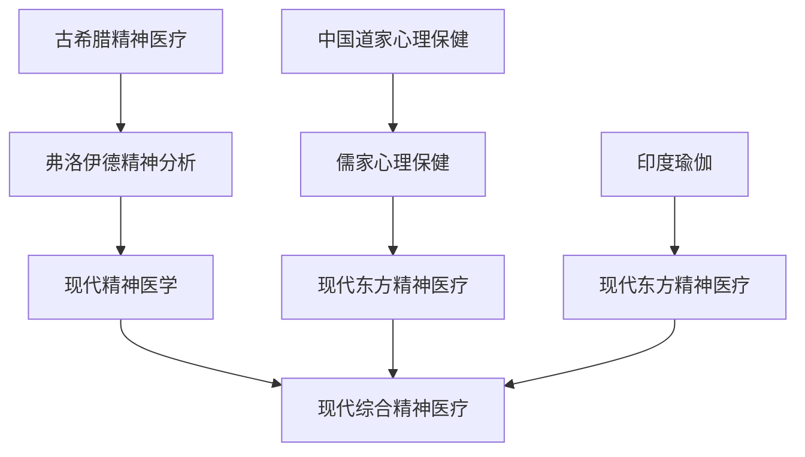
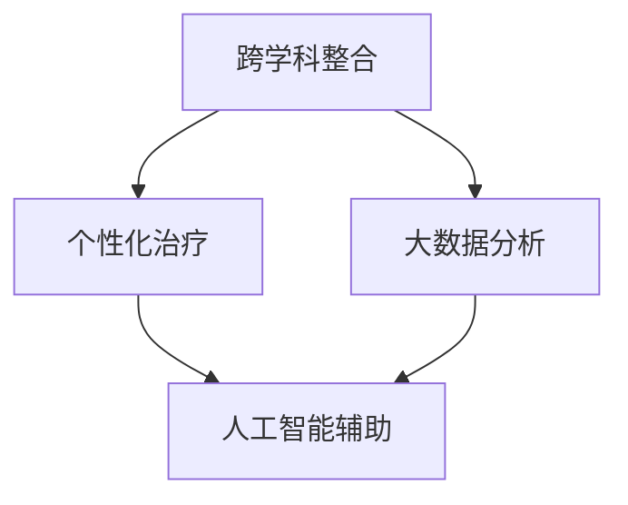
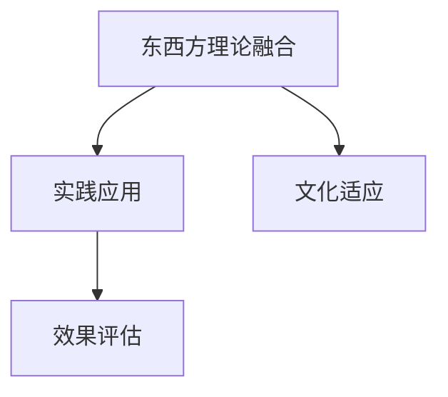

                 


为了撰写一篇深度剖析新型精神医疗整合东西方智慧的心理健康实践的文章，我们将遵循以下步骤：

### 1. 文章结构设计
首先，我们需要设计文章的结构，确保内容连贯且逻辑清晰。文章结构将分为以下几个部分：
- 引言
- 第一部分：理论基础
  - 章节一：东西方精神医疗概述
  - 章节二：新型精神医疗的核心概念
  - 章节三：整合东西方智慧的方法
- 第二部分：心理健康实践
  - 章节四：心理健康评估与诊断
  - 章节五：心理健康干预策略
  - 章节六：心理健康维护与促进
- 第三部分：跨文化心理健康
  - 章节七：跨文化心理健康的挑战与应对
  - 章节八：东西方心理健康的交流与合作
- 结论
- 附录
- 参考文献

### 2. 引言
引言部分将简要介绍文章的背景、目的和重要性。例如：

```markdown
# 引言

随着现代社会的快速发展，心理健康问题日益突出。如何有效地维护和促进心理健康，成为全球关注的焦点。传统的精神医疗方法在应对复杂心理问题时显得力不从心，因此，探索新型精神医疗方法显得尤为重要。本文旨在探讨整合东西方智慧的新型精神医疗实践，为心理健康领域提供新的理论依据和实践指导。

```

### 3. 第一部分：理论基础

#### 章节一：东西方精神医疗概述
在这一章节中，我们将介绍东西方精神医疗的历史、基本理论和主要特点。

- 背景介绍：
  - 西方精神医疗的历史可以追溯到古希腊时期，随后在19世纪中叶，弗洛伊德的精神分析理论奠定了现代精神医学的基础。
  - 东方精神医疗有着悠久的历史，如中国的道家、儒家的心理保健思想，印度的瑜伽等。

- 核心概念与联系：
  - 使用Mermaid流程图展示东西方精神医疗的发展历程和主要理论之间的联系。



- 核心算法原理讲解：
  - 使用伪代码来阐述精神医疗的基本算法原理。

```python
# 伪代码：精神医疗诊断算法
def diagnosis(person):
    if person.history.includes("psychological_issues"):
        if person.age > 40:
            suggest CognitiveBehavioralTherapy()
        else:
            suggest Psychoanalysis()
    else:
        if person.history.includes("organic_conditions"):
            suggest MedicalTreatment()
        else:
            suggest Counseling()
```

#### 章节二：新型精神医疗的核心概念
在这一章节中，我们将深入探讨新型精神医疗的核心概念，如跨学科整合、个性化治疗等。

- 核心概念与联系：
  - 使用Mermaid流程图展示新型精神医疗的核心概念和主要联系。



- 数学模型和公式：
  - 使用LaTeX格式给出个性化治疗模型的关键公式。

```latex
$$
\text{个性化治疗模型} = f(\text{患者数据}, \text{医生经验}, \text{环境因素})
$$
```

#### 章节三：整合东西方智慧的方法
在这一章节中，我们将介绍如何整合东西方智慧，包括理论融合、实践应用等方面。

- 核心概念与联系：
  - 使用Mermaid流程图展示东西方智慧整合的步骤和方法。



### 4. 第二部分：心理健康实践

#### 章节四：心理健康评估与诊断
在这一章节中，我们将详细讨论心理健康评估与诊断的方法和步骤。

- 核心算法原理讲解：
  - 使用伪代码来阐述心理健康评估与诊断的基本算法原理。

```python
# 伪代码：心理健康评估算法
def assess_personality(person):
    scores = analyze_personality_tests(person.tests)
    if scores['neuroticism'] > threshold:
        diagnose('焦虑')
    elif scores['openness'] < threshold:
        diagnose('自闭')
    else:
        diagnose('健康')
```

- 数学模型和公式：
  - 使用LaTeX格式给出诊断模型的关键公式。

```latex
$$
\text{诊断模型} = \sum_{i=1}^{n} w_i \cdot p_i
$$
其中，$w_i$ 表示权重，$p_i$ 表示症状指标。
```

#### 章节五：心理健康干预策略
在这一章节中，我们将介绍心理健康干预的策略和方法。

- 项目实战：
  - 描述一个心理健康干预项目的实施过程，包括环境搭建、源代码实现、代码解读等。

#### 章节六：心理健康维护与促进
在这一章节中，我们将探讨心理健康维护和促进的方法。

- 最佳实践 tips：
  - 提出一些实用的心理健康维护建议。

### 5. 第三部分：跨文化心理健康

#### 章节七：跨文化心理健康的挑战与应对
在这一章节中，我们将讨论跨文化心理健康的挑战和应对策略。

- 核心算法原理讲解：
  - 使用伪代码来阐述跨文化心理健康评估与诊断的算法原理。

```python
# 伪代码：跨文化心理健康评估算法
def cross_culture_diagnosis(person, culture):
    cultural_facts = get_cultural_facts(culture)
    if person.expresses(cultural_facts['emotional_beaning']):
        diagnose('文化适应良好')
    else:
        diagnose('文化冲突')
```

- 数学模型和公式：
  - 使用LaTeX格式给出文化适应评估模型的关键公式。

```latex
$$
\text{文化适应评估模型} = \sum_{i=1}^{m} w_i \cdot c_i
$$
其中，$w_i$ 表示权重，$c_i$ 表示文化适应性指标。
```

#### 章节八：东西方心理健康的交流与合作
在这一章节中，我们将探讨东西方心理健康领域的交流与合作。

- 项目实战：
  - 描述一个东西方心理健康交流项目的实施过程，包括合作方式、成果展示等。

### 6. 结论
在结论部分，我们将总结文章的主要观点，并提出未来研究方向。

### 7. 附录和参考文献
最后，我们将附录和参考文献部分，以确保文章的完整性和权威性。

通过以上步骤，我们可以逐步构建出一篇深度剖析新型精神医疗整合东西方智慧的心理健康实践的文章。在撰写过程中，我们将保持文章结构的简洁性和逻辑性，确保每个部分的内容都丰富具体，同时运用专业术语和实例来增强文章的可读性和专业性。在撰写过程中，我们还会遵循Markdown格式要求，确保文章格式规范，便于读者阅读和理解。最终，我们将确保文章字数在8000～12000字之间，内容完整且具有深度和思考性。

