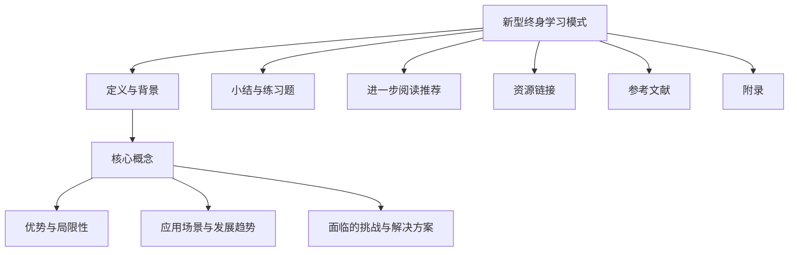

                 

# 新型终身学习模式：在变化中保持知识更新

> 关键词：终身学习，知识更新，学习模式，算法，认知，技术创新

> 摘要：随着科技的飞速发展，传统的一次性教育模式已经难以满足现代社会的需求。本文将深入探讨一种新型的终身学习模式，分析其定义、核心概念、算法原理以及应用场景。通过详细的分析和推理，我们希望能够为读者提供一种在快速变化的环境中保持知识更新的有效方法，同时探讨未来终身学习模式的发展趋势和面临的挑战。

## 第1章 新型终身学习模式概述

### 1.1 新型终身学习模式的定义与背景

#### 1.1.1 什么是新型终身学习模式？

新型终身学习模式是指一种持续的、动态的、以学习者为中心的学习模式。它不仅强调知识的获取，更注重知识的运用和更新。这种模式的核心在于通过不断的自我学习、实践和反思，使学习者在整个生命周期中保持知识的更新和能力的提升。

#### 1.1.2 传统学习模式与新型终身学习模式的区别

传统学习模式通常是一次性的，以学校教育为主，学习结束后，知识便不再更新。而新型终身学习模式则是持续的，不仅包括学校教育，还包括职场教育、自我教育等多个方面，强调学习的全生命周期。

#### 1.1.3 新型终身学习模式的发展背景

随着信息化、全球化、智能化的深入发展，知识更新速度加快，传统的一次性教育模式已经难以适应社会的需求。新型终身学习模式正是在这样的背景下应运而生，旨在为学习者提供一种更为灵活、高效、持续的学习方式。

### 1.2 新型终身学习模式的核心概念

#### 1.2.1 终身学习的概念

终身学习是指一个人在一生中不断学习、实践、反思、创新的过程。它不仅仅是为了获取知识，更重要的是通过学习来提升自我能力，适应社会变化。

#### 1.2.2 模式转型的驱动因素

模式转型的驱动因素主要包括技术进步、社会变革、个人需求等。技术进步使得学习方式更加多样化、便捷化；社会变革带来了更多的学习需求和机会；个人需求则体现在对自我发展和职业规划的追求。

#### 1.2.3 新型终身学习模式的特征

新型终身学习模式具有以下几个特征：

1. **以学习者为中心**：强调学习者的主动性和个性化需求。
2. **持续性与动态性**：学习不是一次性的，而是持续的、动态的。
3. **跨领域、跨学科**：学习内容不再局限于某个领域或学科，而是更加广泛和综合。
4. **实践与反思相结合**：学习不仅仅是知识的获取，更重要的是通过实践和反思来提升自我能力。

#### 1.2.4 新型终身学习模式的优势

1. **提高学习效率**：通过个性化的学习策略，提高学习效率。
2. **适应社会变化**：通过持续的学习，使学习者能够更好地适应社会变化。
3. **促进全面发展**：不仅提升知识水平，还提升综合素质。

#### 1.2.5 新型终身学习模式的局限性

1. **资源与时间限制**：学习者可能面临资源和时间的限制。
2. **学习效果难以评估**：由于学习方式的多样性，学习效果难以统一评估。

#### 1.2.6 新型终身学习模式的应用场景

1. **职业教育**：针对职场人士的持续学习需求。
2. **高等教育**：结合学术研究和职业实践。
3. **个人学习**：满足个人兴趣和职业发展需求。

#### 1.2.7 新型终身学习模式的发展趋势

1. **数字化**：随着信息技术的进步，学习方式将更加数字化、智能化。
2. **多元化**：学习内容和方式将更加多元化、个性化。
3. **全球化**：学习将不再受地域限制，实现全球范围内的资源共享。

#### 1.2.8 新型终身学习模式面临的挑战

1. **知识更新速度加快**：需要学习者具备更强的学习能力。
2. **学习资源分配不均**：需要解决资源分配不均的问题。
3. **学习效果评估**：需要建立科学、有效的学习效果评估体系。

#### 1.2.9 解决挑战的策略与建议

1. **加强学习资源建设**：政府、企业、学校等应加强学习资源的建设，提供多样化的学习资源。
2. **构建学习平台**：建立终身学习平台，提供在线学习、实践、评估等功能。
3. **政策支持**：政府应出台相关政策，鼓励和支持终身学习。

### 1.3 小结

新型终身学习模式是一种以学习者为中心、持续、动态的学习模式，它能够更好地适应社会变化和个体需求。然而，它也面临一些挑战，如资源分配不均、学习效果评估等。解决这些挑战需要政府、企业、学校等各方的共同努力。

### 1.4 练习题

1. 请简要说明新型终身学习模式与传统学习模式的区别。
2. 请分析新型终身学习模式的优势和局限性。
3. 请谈谈你对新型终身学习模式发展趋势的看法。

### 1.5 进一步阅读推荐

1. 《终身学习：个人成长的革命》作者：[保罗·雷恩斯](https://book.douban.com/author/1070714/)
2. 《学习与认知》作者：[乔治·米勒](https://book.douban.com/author/1057922/)
3. 《智能时代》作者：[阿尔文·托夫勒](https://book.douban.com/author/1030977/)

### 1.6 资源链接

1. 国家开放大学：[http://www.open.ac.cn/](http://www.open.ac.cn/)
2. 中国大学MOOC：[https://www.icourse163.org/](https://www.icourse163.org/)
3. Coursera：[https://www.coursera.org/](https://www.coursera.org/)

### 1.7 参考文献

1. 雷恩斯，保罗.《终身学习：个人成长的革命》[M]. 北京：中信出版社，2016.
2. 米勒，乔治.《学习与认知》[M]. 北京：北京大学出版社，2018.
3. 托夫勒，阿尔文.《智能时代》[M]. 北京：机械工业出版社，2017.

### 1.8 附录

1. 新型终身学习模式框架图
2. 新型终身学习模式应用场景示例

### 1.9 Mermaid 流程图

## 第2章 核心概念与联系

### 2.1 核心概念详解

#### 2.1.1 学习行为分析

##### 2.1.1.1 学习行为概述

学习行为是指个体通过感知、理解、记忆、应用、创新等过程来获取知识和技能的行为。学习行为不仅包括传统的课堂学习，还包括自主学习、实践学习、合作学习等多种形式。

##### 2.1.1.2 学习行为的特征

学习行为的特征主要包括：

1. **个体性**：学习行为是每个个体根据自身需求和环境进行的。
2. **多样性**：学习行为的形式和内容非常多样，包括知识学习、技能学习、情感学习等。
3. **持续性**：学习行为是一个持续的过程，不仅仅局限于某个特定阶段。

##### 2.1.1.3 学习行为的分类

学习行为可以根据不同的标准进行分类，常见的分类方法包括：

1. **按学习内容分类**：可分为知识学习、技能学习和情感学习。
2. **按学习形式分类**：可分为自主学习、实践学习、合作学习等。
3. **按学习目标分类**：可分为认知学习、技能学习和情感学习。

##### 2.1.1.4 学习行为的模式

学习行为的模式是指学习者在不同情境下表现出的学习行为特征。学习行为的模式主要包括：

1. **主动学习模式**：学习者主动寻求学习机会，积极参与学习活动。
2. **被动学习模式**：学习者被动接受学习内容，缺乏主动学习意识。
3. **混合学习模式**：学习者结合主动学习和被动学习，根据学习需求和情境灵活调整学习行为。

#### 2.1.2 学习策略

##### 2.1.2.1 学习策略的定义

学习策略是指学习者为了提高学习效果而采取的一系列方法和步骤。学习策略包括认知策略、元认知策略、资源管理策略等。

##### 2.1.2.2 常见学习策略

常见的学习策略包括：

1. **预习策略**：在学习新知识之前，提前预习，了解基本概念和内容。
2. **复习策略**：在学习过程中，定期复习所学知识，巩固记忆。
3. **总结策略**：在学习结束后，对所学知识进行总结，形成知识体系。
4. **提问策略**：在学习过程中，主动提问，解决问题，提高学习效果。

##### 2.1.2.3 学习策略的选择与调整

学习策略的选择和调整应考虑以下几个方面：

1. **学习目标**：根据学习目标选择合适的学习策略。
2. **学习内容**：根据学习内容的难度和复杂性选择学习策略。
3. **学习环境**：根据学习环境的特点选择合适的学习策略。
4. **个人特点**：根据个人的学习风格和特点选择合适的学习策略。

#### 2.1.3 学习效果评估

##### 2.1.3.1 学习效果评估的意义

学习效果评估是学习过程的重要组成部分，其意义主要体现在以下几个方面：

1. **了解学习效果**：评估可以帮助学习者了解自己的学习成果，明确学习效果。
2. **改进学习方法**：评估结果可以帮助学习者发现学习中的问题，改进学习方法。
3. **指导学习决策**：评估结果可以为学习者提供学习决策的依据，指导下一步的学习。

##### 2.1.3.2 学习效果评估的方法

学习效果评估的方法主要包括：

1. **测验**：通过书面测验、口头测验等方式评估学习效果。
2. **观察**：通过观察学习者在学习过程中的表现评估学习效果。
3. **自我评估**：通过自我评估表、学习日志等方式评估学习效果。
4. **专家评估**：通过专家的评估，为学习效果提供权威意见。

##### 2.1.3.3 学习效果评估的工具

学习效果评估的工具主要包括：

1. **学习管理系统**：通过学习管理系统记录学习过程和效果，提供评估数据。
2. **在线测验平台**：通过在线测验平台进行测验，评估学习效果。
3. **数据分析工具**：通过数据分析工具对学习效果进行定量分析。

#### 2.1.4 学习与认知

##### 2.1.4.1 学习与认知的关系

学习与认知是密切相关的。学习是认知的基础，认知是学习的核心。学习过程中的感知、理解、记忆、应用、创新等过程都是认知活动。

##### 2.1.4.2 认知理论对学习的影响

认知理论对学习的影响主要体现在以下几个方面：

1. **学习策略的选择**：认知理论指导学习者选择合适的学习策略，提高学习效果。
2. **学习过程的设计**：认知理论指导教育者和设计师设计适合学习者的学习过程。
3. **学习环境的建设**：认知理论指导教育者和设计师建设有利于认知发展的学习环境。

##### 2.1.4.3 认知负荷理论与学习效果

认知负荷理论认为，学习者在学习过程中会承受一定的认知负荷。认知负荷过高会影响学习效果，而认知负荷过低则可能导致学习效率下降。因此，合理控制认知负荷是提高学习效果的重要途径。

#### 2.1.5 学习环境

##### 2.1.5.1 学习环境的特点

学习环境是指学习者进行学习活动的场所和条件。学习环境的特点包括：

1. **多样性**：学习环境可以是实体环境，如教室、实验室等，也可以是虚拟环境，如在线学习平台、虚拟现实等。
2. **互动性**：学习环境应能够支持学习者之间的互动，促进知识的交流与共享。
3. **适应性**：学习环境应能够根据学习者的需求和特点进行适应性调整。

##### 2.1.5.2 学习环境的设计原则

学习环境的设计原则主要包括：

1. **以人为本**：设计学习环境应充分考虑学习者的需求和特点，提供个性化的学习支持。
2. **互动性**：设计学习环境应支持学习者之间的互动，促进知识的交流与共享。
3. **适应性**：设计学习环境应能够根据学习者的需求和特点进行适应性调整。
4. **安全性**：设计学习环境应确保学习者的信息安全，防止信息泄露。

##### 2.1.5.3 学习环境的优化策略

学习环境的优化策略主要包括：

1. **资源整合**：整合学习资源，提供多样化的学习支持。
2. **技术支持**：利用现代信息技术，提高学习环境的互动性和适应性。
3. **环境监测**：对学习环境进行监测，及时发现问题并进行调整。
4. **激励机制**：建立激励机制，鼓励学习者积极参与学习活动。

#### 2.1.6 学习社区

##### 2.1.6.1 学习社区的定义

学习社区是指一群有共同学习目标和学习需求的人组成的互动群体。学习社区的特点包括：

1. **共同目标**：学习社区成员有共同的学习目标，相互支持和激励。
2. **互动交流**：学习社区成员之间有频繁的互动和交流，分享知识和经验。
3. **协作学习**：学习社区成员通过协作学习，共同完成任务和项目。

##### 2.1.6.2 学习社区的类型

学习社区的类型主要包括：

1. **线上学习社区**：通过互联网进行交流和协作的学习社区。
2. **线下学习社区**：通过实体场所进行交流和协作的学习社区。
3. **混合型学习社区**：线上和线下相结合的学习社区。

##### 2.1.6.3 学习社区的优势

学习社区的优势主要包括：

1. **资源共享**：学习社区成员可以共享知识和资源，提高学习效率。
2. **协作学习**：学习社区成员可以协作学习，共同完成任务和项目。
3. **互动交流**：学习社区成员可以互动交流，分享经验和见解。
4. **激励机制**：学习社区可以建立激励机制，鼓励成员积极参与学习活动。

##### 2.1.6.4 学习社区的管理与维护

学习社区的管理与维护主要包括：

1. **社区规则**：制定社区规则，规范成员的行为和交流。
2. **互动管理**：管理互动交流，维护社区秩序。
3. **资源更新**：定期更新学习资源，保持学习社区的内容丰富。
4. **激励机制**：建立激励机制，鼓励成员积极参与学习活动。

#### 2.1.7 学习管理

##### 2.1.7.1 学习管理的概念

学习管理是指对学习过程进行规划、组织、实施和监督的一系列活动。学习管理的目的是提高学习效果，实现学习目标。

##### 2.1.7.2 学习管理的内容

学习管理的内容主要包括：

1. **学习计划**：制定学习计划，明确学习目标和时间安排。
2. **学习资源管理**：管理学习资源，确保资源的有效利用。
3. **学习过程监督**：监督学习过程，确保学习目标的实现。
4. **学习效果评估**：评估学习效果，改进学习方法和策略。

##### 2.1.7.3 学习管理的实践

学习管理的实践主要包括：

1. **个体学习管理**：个体根据自身需求和特点进行学习管理，制定学习计划，管理学习资源，进行学习效果评估。
2. **团队学习管理**：团队根据共同学习目标和需求进行学习管理，制定学习计划，管理学习资源，进行学习效果评估。
3. **组织学习管理**：组织根据整体学习目标和需求进行学习管理，制定学习计划，管理学习资源，进行学习效果评估。

#### 2.1.8 学习与创新

##### 2.1.8.1 学习与创新的关系

学习与创新是相互促进的关系。学习是创新的基础，创新是学习的动力。通过学习，个体可以获取新的知识和技能，为创新提供基础；而创新则可以激发学习的热情和动力，推动学习的深入。

##### 2.1.8.2 创新的学习策略

创新的学

