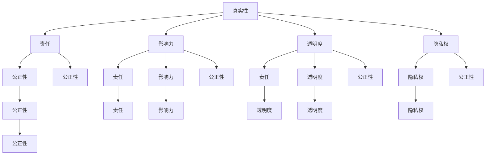

                 

### 文章标题

# 新媒体时代的信息伦理：真实、责任与影响力的平衡

### 关键词

- 新媒体
- 信息伦理
- 真实性
- 责任
- 影响力
- 数字素养

### 摘要

在数字化的新媒体时代，信息伦理变得愈发重要。本文旨在探讨在新媒体环境中维护真实、承担责任和平衡影响力的关键原则。我们将详细分析这些伦理概念，并提出一系列实践指南，以帮助个人、企业和政策制定者在这个复杂的环境中做出更加道德和负责任的决策。本文将分为七个章节，每章探讨不同的核心概念，并提供相关实例和案例分析，以加深理解。

### 目录

1. **引言**  
   - **1.1 新媒体时代的背景**  
   - **1.2 信息伦理的重要性**  
   - **1.3 本书结构概述**

2. **核心伦理概念与联系**  
   - **2.1 核心概念的定义**  
   - **2.2 概念间的关系架构（Mermaid 流程图）**

3. **新媒体环境下的伦理框架**  
   - **3.1 信息伦理的历史演进**  
   - **3.2 信息伦理的理论基础**  
   - **3.3 新媒体环境中的伦理问题**

4. **真实性与信任**  
   - **4.1 数字时代的真实性问题**  
   - **4.2 真实性在数字媒体中的作用**  
   - **4.3 建立数字媒体中的信任**

5. **责任与问责**  
   - **5.1 责任的定义与分类**  
   - **5.2 责任在数字媒体中的体现**  
   - **5.3 问责机制的设计与实施**

6. **影响力与道德使用**  
   - **6.1 影响力的度量与评估**  
   - **6.2 道德影响力的影响**  
   - **6.3 道德影响力使用的基本原则**

7. **数字素养与教育**  
   - **7.1 数字素养的概念与重要性**  
   - **7.2 数字素养的教育策略**  
   - **7.3 培养数字素养的未来展望**

### 引言

#### 1.1 新媒体时代的背景

随着互联网和移动设备的普及，新媒体已经成为人们获取信息和交流的主要渠道。社交媒体平台、在线新闻、博客和视频网站等数字媒体形式，不仅改变了信息的传播方式，也深刻影响了社会的结构和人们的思维方式。然而，这种信息传播的变革也带来了新的挑战，尤其是在信息伦理方面。

新媒体环境的快速变化使得传统的伦理原则面临新的考验。例如，如何在信息过载的时代保持信息的真实性？如何在复杂的网络环境中确定责任归属？如何平衡信息传播者的个人权利与社会责任？这些问题都迫切需要新的伦理框架和解决方案。

#### 1.2 信息伦理的重要性

信息伦理是关于信息处理、传播和使用中的道德原则和规范的学科。在传统媒体时代，信息伦理的重要性已经被广泛认可。随着新媒体的兴起，信息伦理的重要性更加凸显。首先，新媒体的开放性和互动性使得信息传播的速度和范围大大增加，这意味着错误的、误导的或恶意的信息可以迅速传播，对社会造成严重的影响。其次，新媒体平台的运营者、内容创作者和用户都需要对自己的行为承担更加明确的道德责任。

信息伦理的核心关注点包括真实性、责任性和影响力。真实性关乎信息的准确性和可信度；责任性关乎信息传播者是否承担了应有的责任；影响力则关乎信息传播者是否意识到自己的行为可能带来的后果。这些核心概念在新媒体时代具有特殊的重要性，因为新媒体的环境使得信息传播的影响更加深远和复杂。

#### 1.3 本书结构概述

本书旨在提供一套全面的信息伦理框架，以帮助个人、企业和政策制定者在新媒体时代做出更加道德和负责任的决策。全书分为七个章节，每个章节都聚焦于一个核心伦理概念。

第一章将介绍新媒体时代的背景和信息伦理的重要性，并概述本书的结构。

第二章将深入探讨核心伦理概念，并通过Mermaid流程图展示这些概念之间的联系。

第三章将分析新媒体环境下的伦理框架，包括历史演进、理论基础和具体问题。

第四章将讨论真实性和信任，探讨如何在数字时代保持信息的真实性和建立信任。

第五章将探讨责任和问责，分析责任的概念、在数字媒体中的体现以及问责机制的设计与实施。

第六章将关注影响力，讨论影响力的度量、道德影响力的影响以及如何平衡影响力与道德使用。

最后一章将探讨数字素养与教育，强调培养数字素养的重要性以及有效的教育策略。

通过这些章节的深入探讨，本书希望能够为新媒体时代的信息伦理提供一个全面而系统的指导。读者不仅可以了解信息伦理的基本概念，还可以掌握如何在实践中应用这些原则，以促进数字社会的健康发展。### 核心伦理概念与联系

#### 2.1 核心概念的定义

在探讨新媒体时代的信息伦理时，首先需要明确几个核心伦理概念，这些概念相互关联，共同构成了信息伦理的理论基础。

1. **真实性（Authenticity）**：真实性指的是信息内容的准确性和可信度。在新媒体环境中，信息的真实性受到多种因素的挑战，包括虚假信息、误导性内容和恶意谣言的泛滥。维护真实性是信息伦理的核心任务之一。

2. **责任（Responsibility）**：责任是指信息传播者、平台运营者和用户在信息传播和使用过程中应承担的道德义务。责任可以进一步分为个人责任和集体责任，涉及对信息内容的审核、监督和纠正。

3. **影响力（Influence）**：影响力是指信息传播者在网络空间中能够影响他人思想、行为和社会进程的能力。影响力的大小取决于信息的受众规模、信息的吸引力和传播者的权威性。

4. **透明度（Transparency）**：透明度是指信息传播者公开其身份、行为和决策的程度。透明度有助于提高信息传播的信任度和责任感。

5. **隐私权（Privacy）**：隐私权是指个人在信息处理和传播中享有的控制其个人信息不被未经授权的第三方获取的权利。隐私权在数字媒体环境中尤为重要，因为它直接关系到个人信息的安全和隐私保护。

6. **公正性（Justice）**：公正性是指信息传播和处理过程中应遵循的公平原则，包括对信息的平等对待、避免偏见和歧视，以及对信息不平等的纠正。

#### 2.2 概念间的关系架构（Mermaid 流程图）

为了更清晰地展示这些核心概念之间的关系，我们可以使用Mermaid流程图来描述它们之间的相互联系。

在这个流程图中，每个节点代表一个核心概念，箭头表示概念之间的关联。例如，真实性直接影响到责任和影响力，同时与透明度和隐私权密切相关。责任和公正性之间也存在紧密的联系，而公正性又是所有核心概念的共同目标。

通过这个流程图，我们可以更直观地理解这些核心概念在新媒体信息伦理中的相互关系，为后续章节的具体探讨奠定了理论基础。

#### 核心概念的定义

在深入探讨新媒体环境下的信息伦理之前，有必要首先明确几个核心伦理概念的含义，这些概念是构建信息伦理体系的基础。以下是对这些核心概念的定义：

1. **真实性（Authenticity）**：真实性是指信息内容是否与客观现实相符，具有可验证的准确性和可信度。在新媒体时代，真实性受到虚假信息、误导性内容和恶意谣言的严重挑战。维护真实性是信息伦理的首要任务，因为它直接关系到公众的信任和社会的稳定。

2. **责任（Responsibility）**：责任是指信息传播者、平台运营者和用户在信息处理和传播过程中应承担的道德义务。责任可以分为个人责任和集体责任。个人责任通常指的是信息发布者在发布信息时应确保内容的真实性、合法性和道德性。集体责任则涉及平台运营者对用户生成内容的监管和审核责任，以及社会对信息伦理的整体维护。

3. **影响力（Influence）**：影响力是指信息传播者通过网络空间对他人思想、行为和社会进程施加影响的能力。在新媒体环境中，影响力可以通过多种方式实现，包括社交媒体、博客、视频平台等。影响力的增大带来了更多的道德和伦理挑战，因为信息传播者的言论和行为可能会对大量受众产生深远的影响。

4. **透明度（Transparency）**：透明度是指信息传播者在处理和传播信息时公开其身份、行为和决策的程度。透明度是增强公众信任的重要手段，因为公众有权知道信息来源和传播过程的相关信息。高透明度有助于减少信息的不确定性，提高信息的可信度。

5. **隐私权（Privacy）**：隐私权是指个人在信息处理和传播中享有的控制其个人信息不被未经授权的第三方获取的权利。在数字媒体环境中，个人隐私面临前所未有的风险，因为数据收集和利用技术的不断进步使得个人信息泄露的可能性增加。隐私权的保护是信息伦理的重要方面，关系到个人自由和社会公平。

6. **公正性（Justice）**：公正性是指信息传播和处理过程中应遵循的公平原则，包括对信息的平等对待、避免偏见和歧视，以及对信息不平等的纠正。公正性确保信息传播系统不会因特定群体的利益而偏离社会的整体利益，是实现社会和谐与进步的基础。

通过对这些核心概念的明确定义，我们可以更好地理解新媒体环境下信息伦理的复杂性，为后续章节的深入探讨奠定基础。### 核心概念间的关系架构（Mermaid流程图）

为了更好地展示新媒体环境下信息伦理核心概念之间的关系，我们可以借助Mermaid流程图来直观地呈现它们。以下是一个示例的Mermaid流程图，它描述了真实性、责任、影响力、透明度、隐私权和公正性之间的关系：

在这个流程图中，每个概念都与其他几个相关概念通过箭头相连，箭头方向表示从某个概念到另一个概念的影响或关联。例如，真实性（A）直接影响责任（B）和影响力（C），同时与透明度（D）和隐私权（E）密切相关。责任（B）和公正性（F）之间存在双向关联，说明责任是实现公正性的基础。透明度（D）和公正性（F）也紧密相关，高透明度有助于维护公正性。影响力（C）则既影响责任（B），也影响公正性（F），表明影响力在信息伦理中的核心地位。

通过这个Mermaid流程图，我们可以直观地理解新媒体环境下信息伦理核心概念之间的复杂关系，为后续章节的分析提供了有力的视觉辅助。### 媒体伦理的历史演进

#### 3.1 媒体伦理的发展历程

媒体伦理的发展历程可以追溯到20世纪初期，当时报纸和广播成为了主要的信息传播渠道。早期的媒体伦理主要关注新闻报道的准确性和公正性。随着20世纪中期电视的普及，媒体伦理进一步发展，开始涉及隐私权和误导性广告等问题。

1. **报纸和广播时代**（1900-1950）：这一时期，报纸和广播是主要的新闻传播媒介。媒体伦理的核心议题包括新闻报道的真实性和公正性。报纸编辑和广播主持人被要求遵守一定的道德规范，确保公众获得准确的信息。

2. **电视时代**（1950-1980）：电视的普及使得媒体影响力大大增强。媒体伦理开始关注隐私权、误导性广告和虚假新闻等问题。电视节目主持人、广告制作人和新闻编辑需要承担更多的社会责任，确保公众不受误导。

3. **互联网初期**（1980-2000）：随着互联网的兴起，媒体形式变得更加多样，包括电子邮件、论坛、博客和视频分享网站等。媒体伦理进一步扩展，涉及网络隐私、网络欺凌和网络诽谤等问题。

4. **社交媒体时代**（2000至今）：社交媒体的兴起带来了信息传播的新变革。信息传播的速度和范围前所未有，媒体伦理也面临新的挑战。虚假信息、网络暴力和隐私侵犯等问题层出不穷，媒体伦理需要不断适应和更新。

#### 3.2 新媒体环境下的伦理问题

在新媒体环境下，媒体伦理面临以下主要问题：

1. **虚假信息与虚假新闻**：社交媒体和互联网的普及使得虚假信息和虚假新闻更容易传播。这些信息往往具有误导性和破坏性，对社会稳定和公共利益构成威胁。

2. **隐私侵犯**：新媒体环境下，个人隐私面临更大的风险。数据泄露、跟踪和监控等问题频发，个人隐私权受到严重挑战。

3. **网络欺凌与网络暴力**：社交媒体提供了一个公开的讨论平台，但也成为了网络欺凌和网络暴力的重要场所。这种暴力行为不仅伤害个人，还可能引发更广泛的社会问题。

4. **误导性广告与商业化**：新媒体的商业模式依赖于广告收入，误导性广告和商业宣传现象普遍。这些广告可能误导消费者，损害他们的利益。

5. **版权侵犯与知识产权保护**：新媒体环境下，版权侵犯问题尤为突出。未经授权的内容分享和盗版现象严重，知识产权保护成为一个亟待解决的问题。

#### 3.3 信息伦理的理论基础

信息伦理的理论基础包括以下几个方面：

1. **功利主义**：功利主义认为，媒体行为应最大化社会福利。在信息伦理中，这一理论强调信息的真实性和公正性，以确保公众利益得到最大化。

2. **义务论**：义务论认为，媒体行为应遵循一定的道德规范，而不是仅仅追求功利结果。在信息伦理中，这一理论强调媒体责任和道德义务，特别是在处理敏感信息和涉及隐私问题时。

3. **自由主义**：自由主义强调个人自由和表达自由。在信息伦理中，这一理论支持信息传播的开放性和自由度，但同时也要求媒体承担相应的社会责任。

4. **社会契约论**：社会契约论认为，媒体作为公共机构的角色应服务于社会公共利益。在信息伦理中，这一理论强调媒体的责任感和对社会整体的贡献。

通过了解媒体伦理的历史演进和理论基础，我们可以更好地理解新媒体环境下的伦理问题，并为解决这些问题提供理论基础和实际指导。在接下来的章节中，我们将进一步探讨新媒体环境中的具体伦理问题，并提出解决方案。### 信息伦理的理论基础

#### 3.2 信息伦理的理论基础

信息伦理的理论基础是构建其原则和规范的重要基石。这些理论基础涵盖了多种伦理哲学和理论体系，为信息伦理提供了广泛的指导框架。以下是一些关键的理论基础：

1. **功利主义（Utilitarianism）**：
   - **基本观点**：功利主义认为，行为的道德价值取决于其产生的总体幸福或福利。最大化幸福和利益是功利主义的核心理念。
   - **在信息伦理中的应用**：在信息伦理中，功利主义强调信息传播的正面影响。例如，确保信息的真实性可以最大化公众的知情权和福祉。同时，信息的透明度也是功利主义原则的体现，因为它有助于提高公众的信任和满意度。

2. **义务论（Deontological Ethics）**：
   - **基本观点**：义务论强调道德义务和责任，主张行为本身的道德性质，而不仅仅是其结果。康德的道德哲学是义务论的代表。
   - **在信息伦理中的应用**：在信息伦理中，义务论关注信息传播者的道德责任，例如确保信息的真实性、保护个人隐私和维护公正性。义务论还强调信息传播者应遵循特定的伦理规范，而不是仅仅追求功利结果。

3. **自由主义（Libertarianism）**：
   - **基本观点**：自由主义强调个人自由和表达自由，主张社会应该尽量减少对个人自由的限制。
   - **在信息伦理中的应用**：在信息伦理中，自由主义支持信息传播的自由和开放。例如，用户有权访问各种信息来源，并自由地表达自己的观点。然而，自由主义也要求在个人自由和社会责任之间寻求平衡，以防止滥用自由带来的负面影响。

4. **社会契约论（Social Contract Theory）**：
   - **基本观点**：社会契约论认为，社会成员通过一种隐含的契约关系，共同遵守一定的规则和责任，以维护社会秩序和稳定。
   - **在信息伦理中的应用**：在信息伦理中，社会契约论强调信息传播者和用户之间的道德责任。信息传播者有责任提供真实、准确和公正的信息，而用户有责任遵守社会规范，不传播虚假信息和恶意内容。社会契约论还涉及信息伦理的监管和规范，以确保信息的公平性和可访问性。

5. **美德伦理（Virtue Ethics）**：
   - **基本观点**：美德伦理强调个人的道德品质和行为习惯，主张通过培养良好的品德来实现道德目标。
   - **在信息伦理中的应用**：在信息伦理中，美德伦理强调信息传播者的道德品质，如诚实、公正和慷慨。通过培养这些美德，信息传播者可以更好地履行其社会责任，提高信息传播的道德水平。

这些伦理理论基础为信息伦理提供了多元化的视角和指导原则，有助于我们更好地理解和应对新媒体环境中的伦理挑战。在接下来的章节中，我们将结合具体实例，进一步探讨新媒体环境中的伦理问题及其解决方案。### 新媒体环境中的伦理问题

#### 3.3 新媒体环境中的伦理问题

随着新媒体技术的不断发展和普及，信息伦理面临前所未有的挑战。新媒体环境中的伦理问题包括虚假信息、隐私侵犯、网络暴力和误导性广告等。这些问题不仅影响了个人和社会的日常生活，也威胁到了信息生态系统的健康发展。

1. **虚假信息（False Information）**：
   - **定义**：虚假信息是指故意传播的、与事实不符的信息，包括谣言、误导性内容等。
   - **影响**：虚假信息的传播可能引发社会恐慌、破坏社会信任，甚至引发政治动荡。例如，在2016年美国总统选举期间，社交媒体上充斥着大量虚假新闻和误导性信息，对选举结果产生了负面影响。
   - **案例**：在COVID-19疫情期间，社交媒体上出现了大量关于疫情的治疗方法、疫苗效果等虚假信息，导致公众恐慌和不必要的医疗资源浪费。

2. **隐私侵犯（Privacy Infringement）**：
   - **定义**：隐私侵犯是指未经授权的个人或组织获取、使用和披露他人的个人信息。
   - **影响**：隐私侵犯不仅侵犯了个人权利，还可能导致个人信息泄露、身份盗窃等严重后果。例如，Facebook的Cambridge Analytica数据泄露事件暴露了数百万用户的个人信息被不当使用。
   - **案例**：2017年，Uber被曝出通过秘密软件“灰色球”（Greyball）追踪和标记执法官员，以规避法律监管。这一行为侵犯了用户的隐私权，引发了广泛的社会争议。

3. **网络暴力（Cyberbullying）**：
   - **定义**：网络暴力是指通过互联网对他人进行威胁、侮辱、恐吓等恶意行为。
   - **影响**：网络暴力对受害者造成了巨大的心理压力和伤害，可能导致抑郁、焦虑甚至自杀。例如，社交媒体平台上的恶意评论和私信对年轻人造成了严重的影响。
   - **案例**：2017年，美国一名17岁女孩因遭受网络暴力而自杀。她曾公开表示，遭受恶意评论和私信的折磨是她无法承受的痛苦。

4. **误导性广告（Deceptive Advertising）**：
   - **定义**：误导性广告是指以虚假或误导性的信息吸引消费者的广告。
   - **影响**：误导性广告不仅损害了消费者的利益，也破坏了市场的公平竞争。例如，某些保健品广告声称具有神奇疗效，实际上并没有科学依据。
   - **案例**：2019年，一家名为“Lifeline”的澳大利亚保健品公司因发布误导性广告而被罚款400万澳元。该公司声称其产品能够治疗多种疾病，但未提供任何科学证据。

#### 3.4 案例分析与解决方案

为了更深入地理解新媒体环境中的伦理问题，我们通过以下案例进行分析，并提出可能的解决方案。

1. **案例：虚假信息**
   - **案例分析**：在2020年美国总统选举期间，社交媒体上充斥着大量虚假新闻和误导性信息，对选举结果产生了负面影响。一些虚假信息声称选举存在大规模舞弊，引发了公众的恐慌和不满。
   - **解决方案**：社交媒体平台应加强对虚假信息的监控和打击，利用人工智能技术识别和标记可疑内容。同时，政府和媒体机构应加强信息传播的透明度，提供准确的选举信息，以降低虚假信息的影响。

2. **案例：隐私侵犯**
   - **案例分析**：2018年，Facebook的数据泄露事件暴露了数百万用户的个人信息被不当使用。这些信息被用于政治广告定位和其他商业用途，引发了公众对隐私侵犯的担忧。
   - **解决方案**：平台应加强用户隐私保护，确保个人信息的安全和隐私。政府应制定更严格的隐私保护法规，规范数据收集和使用行为。同时，用户应提高自己的数字素养，注意保护个人隐私。

3. **案例：网络暴力**
   - **案例分析**：在社交媒体平台上，恶意评论和私信对年轻人造成了严重的影响。一些受害者因为网络暴力而感到沮丧和绝望，甚至导致了自杀。
   - **解决方案**：社交媒体平台应采取措施，严厉打击网络暴力行为，建立举报和处罚机制。教育机构和社会组织应加强心理健康教育，帮助年轻人应对网络暴力带来的压力。

4. **案例：误导性广告**
   - **案例分析**：某些保健品广告声称具有神奇疗效，但实际上没有科学依据。这些误导性广告不仅损害了消费者的利益，也破坏了市场的公平竞争。
   - **解决方案**：监管部门应加强对误导性广告的监管，制定明确的广告准则和法规。广告主应提高广告内容的质量和真实性，确保广告的合法性。

通过这些案例分析，我们可以看到新媒体环境中的伦理问题具有复杂性和多样性。解决这些问题需要政府、平台、企业和用户的共同努力，以建立一个更加健康和公正的信息生态系统。在接下来的章节中，我们将进一步探讨责任和问责机制，以期为这些伦理问题提供更加有效的解决方案。### 真实性与信任

#### 4.1 数字时代的真实性问题

在数字时代，真实性成为一个尤为关键的话题。随着信息的快速传播和广泛传播，维护信息真实性变得越来越困难。以下是数字时代真实性问题的主要方面：

1. **虚假新闻和误导性内容**：社交媒体和互联网使得虚假新闻和误导性内容可以迅速传播，对公众的判断力和决策产生负面影响。虚假新闻可能涉及政治、健康、金融等多个领域，其传播速度之快和影响之大令人担忧。

2. **数据伪造和篡改**：在数字环境中，数据伪造和篡改相对容易实现。一些不法分子或组织可能故意篡改数据，以误导公众或达到特定的目的。这种行为在学术研究、商业决策和公共事务中可能导致严重的后果。

3. **深度伪造技术**：随着人工智能和机器学习技术的发展，深度伪造技术（如AI生成的虚假视频和图片）使得伪造信息变得愈发逼真。这些技术使得虚假信息的传播更加隐蔽和难以检测。

4. **隐私侵犯和隐私泄露**：个人隐私的泄露和侵犯也可能导致信息真实性的问题。当个人的敏感信息被泄露时，这些信息可能会被用于制造虚假信息，损害个人的名誉和信誉。

#### 4.2 真实性在数字媒体中的作用

真实性在数字媒体中扮演着至关重要的角色，以下是真实性的几个关键作用：

1. **公众信任**：真实的信息能够增强公众对媒体和信息的信任。当公众相信所接收的信息是准确和可信的，他们更有可能依赖这些信息做出决策。信任是数字媒体生态系统的基石，有助于维持社会的稳定和健康发展。

2. **决策支持**：在数字媒体环境中，准确的信息对于个人、企业和政府的决策至关重要。虚假或误导性信息可能导致错误的决策，进而造成经济损失和社会问题。确保信息的真实性有助于提高决策的质量和效果。

3. **公正性和透明度**：真实性也是公正性和透明度的关键组成部分。在数字媒体中，真实的信息有助于揭露不法行为和不公正现象，促进社会的公正和正义。

4. **学术和科学研究**：在学术和科学研究中，真实的数据和信息是研究的可靠基础。虚假信息可能导致学术不端行为，损害学术诚信和科学进步。

#### 4.3 建立数字媒体中的信任

为了在数字媒体中建立和维护信任，以下是一些关键策略：

1. **加强信息验证**：数字媒体平台应加强对信息来源的验证，确保所发布的信息是真实和可信的。使用人工智能和机器学习技术可以自动化地识别和标记虚假信息。

2. **透明度**：数字媒体平台应提高透明度，明确信息来源、发布者和审核过程。这有助于公众了解信息的真实性和可信度。

3. **用户反馈机制**：建立有效的用户反馈机制，允许用户举报虚假信息和不实内容。平台应迅速响应这些举报，并采取适当的措施处理这些内容。

4. **教育用户**：提高用户的数字素养和信息辨别能力，使他们能够更好地识别虚假信息和误导性内容。教育机构、媒体平台和政府部门应共同努力，开展相关的教育和宣传活动。

5. **立法和政策支持**：政府应制定和实施相关的法律法规，规范数字媒体的信息传播行为。这包括对虚假信息和误导性内容的处罚，以及对信息保护措施的加强。

通过这些策略，我们可以建立和维护数字媒体中的信任，促进健康的信息生态系统。在数字时代，真实性不仅是信息伦理的核心，也是社会和谐和进步的重要保障。### 责任与问责

#### 5.1 责任的定义与分类

责任是信息伦理中的一个核心概念，它涉及信息传播者、平台运营者以及社会各方的道德义务和法律责任。在数字媒体环境中，责任的定义和分类变得更加复杂和多样化。以下是几个关键方面的讨论：

1. **个人责任**：
   - **内容创作者的责任**：内容创作者在发布信息时，应确保内容的真实性、合法性和道德性。他们需要对自己的言论和行为承担个人责任，特别是在涉及敏感话题和公众利益时。
   - **用户责任**：数字媒体用户也有一定的责任，包括遵守平台规则和法律法规，不发布虚假信息和不当内容，不参与网络暴力等不良行为。

2. **平台运营者的责任**：
   - **内容审核和监管**：平台运营者应负责对用户生成的内容进行审核和监管，确保内容的真实性、合法性和道德性。他们需要建立有效的算法和人工审核机制，以识别和删除虚假信息、恶意内容和违规内容。
   - **隐私保护**：平台运营者有责任保护用户的隐私和数据安全，防止个人信息泄露和滥用。他们应采取技术和管理措施，确保用户数据的安全性和隐私权。

3. **社会责任**：
   - **公共责任**：数字媒体平台作为公共机构，有责任为社会提供真实、公正和多元化的信息，促进社会进步和公民参与。
   - **道德责任**：数字媒体平台和运营者应承担更高的道德责任，特别是在处理敏感话题和涉及公众利益时。他们应主动采取行动，解决社会问题，促进公共利益的实现。

#### 5.2 责任在数字媒体中的体现

在数字媒体环境中，责任的具体体现可以分为以下几个方面：

1. **内容审核**：
   - **自动审核**：平台可以使用人工智能和机器学习技术进行自动内容审核，识别和标记虚假信息、恶意内容和违规内容。
   - **人工审核**：尽管自动审核技术不断进步，但仍然需要人工审核员进行进一步确认和处理，以确保内容的真实性和合规性。

2. **透明度**：
   - **信息来源披露**：平台应明确标注信息的来源，使公众能够了解信息的出处和背景，增强信息的可信度。
   - **审核流程公开**：平台应公开其内容审核和监管的流程和标准，提高透明度，接受社会监督。

3. **隐私保护**：
   - **用户隐私保护政策**：平台应制定和执行严格的隐私保护政策，明确用户数据的收集、使用和保护方式。
   - **数据安全措施**：平台应采取先进的数据安全措施，包括加密技术和访问控制，防止用户数据泄露和滥用。

4. **用户教育**：
   - **用户指南和培训**：平台应提供用户指南和培训，帮助用户了解平台规则和法律法规，提高数字素养和信息辨别能力。
   - **用户举报机制**：平台应建立有效的用户举报机制，鼓励用户举报虚假信息和不实内容，共同维护数字媒体的生态健康。

5. **社会责任履行**：
   - **公益活动和合作**：平台可以参与公益活动和合作项目，促进社会问题和公共利益的解决。
   - **透明报告**：平台应定期发布透明报告，披露其在信息伦理方面的行动和成果，接受社会和政府的监督。

通过这些措施，数字媒体平台和运营者可以在信息传播过程中承担更多的责任，确保信息的真实性、合法性和道德性，同时保护用户的隐私和权益。在数字时代，责任的履行是构建健康信息生态系统和促进社会和谐发展的关键。### 问责机制的设计与实施

#### 5.3 问责机制的设计与实施

在数字媒体环境中，构建有效的问责机制至关重要，以确保信息传播者、平台运营者和相关方对他们的行为负责。以下是从设计到实施的详细步骤：

1. **设计问责机制的必要性**：
   - **确保透明度和公正性**：问责机制能够确保信息传播的透明度和公正性，使公众和监管机构能够监督信息传播的行为。
   - **防止滥用权力**：问责机制有助于防止信息传播者或平台运营者滥用权力，损害公众利益。
   - **提升责任感**：明确的责任归属和问责机制能够提高信息传播者和社会各方的责任感，促进更加负责任的信息传播行为。

2. **设计问责机制的步骤**：
   - **定义责任主体**：明确信息传播者、平台运营者、监管机构和其他相关方的责任，确保责任的划分清晰、具体。
   - **设立问责标准**：制定明确的问责标准，包括信息真实性、隐私保护、内容审核等方面。这些标准应具有可操作性和可量化性，以便于监督和评估。
   - **建立责任评估体系**：设计一套评估体系，用于定期评估信息传播者、平台运营者等的行为是否符合问责标准。评估体系应涵盖多种评估方法和工具，如用户反馈、数据分析、第三方审计等。
   - **制定惩罚措施**：设立相应的惩罚措施，对违反问责标准的行为进行处罚，包括警告、罚款、暂停服务、永久封号等。

3. **实施问责机制的具体措施**：
   - **透明度和公开性**：问责机制的实施过程应保持透明度和公开性，确保公众和监管机构能够了解和监督相关信息。
   - **用户参与**：鼓励用户参与问责过程，通过用户反馈、举报和投诉等途径，提供信息传播者、平台运营者的行为线索。
   - **技术支持**：利用人工智能和大数据分析技术，提高问责机制的实施效率和准确性。例如，自动识别虚假信息、违规内容等，并生成相应的报告和决策建议。
   - **法律法规支持**：制定和实施相关的法律法规，为问责机制提供法律基础和保障。确保法律具有可执行性和强制性，对违反问责标准的行为进行严厉惩罚。
   - **监管机构介入**：建立独立的监管机构，负责监督和执行问责机制。监管机构应具备专业知识和权威性，确保问责过程的公正和有效。

4. **案例分析：Twitter的问责机制**：
   - **背景**：Twitter是一个全球性的社交媒体平台，拥有庞大的用户群体。由于其开放性和自由度，Twitter上也充斥着大量的虚假信息和不当内容。
   - **实施措施**：
     - **内容审核**：Twitter设立了专门的内容审核团队，负责监控和删除虚假信息、恶意内容和违规内容。
     - **透明度**：Twitter公开其内容审核政策和标准，并在平台上展示审核流程和结果。
     - **用户反馈**：Twitter提供了用户举报机制，允许用户举报虚假信息和不当内容。Twitter会根据举报进行进一步的审核和处理。
     - **惩罚措施**：对于严重违规的用户，Twitter采取了一系列惩罚措施，包括警告、限制功能、封号等。
   - **效果**：通过这些措施，Twitter在一定程度上成功减少了虚假信息和不当内容的传播，提高了平台的透明度和公信力。

通过设计合理的问责机制并有效实施，数字媒体平台可以更好地维护信息真实性、保护用户隐私、促进公正的信息传播。问责机制的实施是一个持续的过程，需要不断优化和完善，以适应数字媒体环境的变化和挑战。### 影响力与道德使用

#### 6.1 影响力的度量与评估

在数字媒体时代，影响力成为衡量信息传播者或平台重要性的关键指标。影响力的度量与评估涉及多个维度，以下是几个常用的方法：

1. **关注者数量**：关注者数量是衡量影响力的一种简单但直观的方法。通常，关注者数量越多，影响力越大。例如，一个社交媒体账户拥有数百万粉丝，意味着其影响力可能远远超过一个只有几千粉丝的账户。

2. **互动率**：互动率是衡量信息传播者影响力的重要指标，反映了受众对内容的参与程度。互动率包括点赞、评论、分享和点击等行为。高互动率表明内容吸引了受众的关注和兴趣，具有较大的影响力。

3. **受众属性**：受众的属性也是影响力评估的关键因素。了解受众的年龄、性别、地理位置、兴趣等属性，有助于评估内容的影响范围和深度。例如，一个主要针对特定年龄群体的内容可能在该群体中具有较高的影响力，但在其他群体中的影响力可能较低。

4. **传播范围**：传播范围是指信息在多大范围内被分享和传播。传播范围可以通过分享次数、转发次数、浏览量等指标来衡量。高传播范围表明内容在网络上具有较大的影响力，能够触及更多的受众。

5. **算法评分**：社交媒体平台通常使用算法评分来评估内容的影响力和传播潜力。算法会根据多种因素，如内容质量、受众兴趣、互动历史等，对内容进行评分，从而推荐给更广泛的受众。

#### 6.2 道德影响力的影响

道德影响力是指信息传播者在网络空间中通过道德行为和言论对他人和社会产生的影响。道德影响力具有以下几个显著特点：

1. **积极影响**：
   - **引导公众意识**：道德影响力能够引导公众关注社会问题，提高公众对社会现象的认知和敏感性。例如，一些公众人物通过社交媒体宣传环保理念，引导公众关注环境保护。
   - **促进社会进步**：道德影响力可以推动社会进步和变革，鼓励人们参与公益事业和志愿服务。例如，通过社交媒体发起的公益挑战活动，吸引了大量参与者，产生了积极的社会影响。
   - **激励个人成长**：道德影响力能够激励个人反思和改进，培养良好的道德品质和行为习惯。例如，一些教育专家通过社交媒体分享教育理念和经验，帮助家长和教师提升教育水平。

2. **消极影响**：
   - **传播负面情绪**：道德影响力也可能被滥用，传播负面情绪和不良价值观。例如，一些社交媒体上的恶意评论和攻击行为，可能对受害者造成心理伤害，传播负面情绪。
   - **加剧社会分裂**：道德影响力在某些情况下可能加剧社会分裂和冲突。例如，一些极端言论的传播可能激化社会矛盾，导致社会对立和暴力行为。
   - **误导公众判断**：道德影响力也可能导致公众对某些问题的误判和误解。例如，一些虚假信息的传播可能误导公众，影响他们的决策和行为。

#### 6.3 道德影响力使用的基本原则

为了确保道德影响力的积极使用，以下是一些基本原则：

1. **真实性**：信息传播者应确保信息的真实性，避免传播虚假信息和误导性内容。真实性是道德影响力的基础，有助于建立公众的信任和尊重。

2. **责任感**：信息传播者应承担起道德责任，关注信息的传播对社会和个人的影响。他们应避免传播可能引发负面影响的言论和行为。

3. **公正性**：信息传播者应保持公正性，避免偏见和歧视。他们应提供多元化的观点和信息，促进公众对不同议题的全面理解和思考。

4. **透明度**：信息传播者应提高透明度，明确信息的来源和立场。透明度有助于公众了解信息的真实背景，增强信息的可信度和影响力。

5. **伦理教育**：信息传播者应加强伦理教育，培养自身的道德品质和行为习惯。他们应积极参与社会公益活动和志愿服务，践行道德价值观。

通过遵循这些基本原则，信息传播者可以在网络空间中发挥积极的影响，促进社会的和谐与进步。道德影响力不仅是个人和平台的价值体现，也是构建健康信息生态系统的关键因素。在数字媒体时代，积极使用道德影响力，不仅有助于提升个人和社会的福祉，也为实现更美好的数字未来奠定了基础。### 数字素养与教育

#### 7.1 数字素养的概念与重要性

数字素养是指在数字化环境中有效使用和管理数字信息的能力，包括信息检索、评估、使用和创新等方面。数字素养不仅涉及技术技能，还包括伦理意识、批判性思维和问题解决能力。在数字媒体时代，数字素养的重要性日益凸显，以下是几个关键方面：

1. **信息检索与评估**：数字素养要求个体能够高效地检索和评估互联网上的海量信息，区分真实信息与虚假信息，识别信息来源的可信度。

2. **信息使用与创新**：数字素养涉及如何将数字信息用于学习和工作，包括创造性地应用新技术、工具和资源，以及利用数字工具进行创新和创作。

3. **伦理意识与责任**：数字素养还包括对数字伦理的理解和遵守，如尊重隐私、保护知识产权、避免网络欺凌等，确保数字行为符合道德和法律规范。

4. **问题解决与批判性思维**：数字素养有助于培养批判性思维，使个体能够分析复杂问题，评估解决方案的合理性和有效性，从而在面对数字挑战时能够做出明智决策。

#### 7.2 数字素养的教育策略

为了培养和提高数字素养，教育机构和教育者可以采取以下策略：

1. **课程设计**：将数字素养融入各个学科和课程中，不仅教授技术技能，还要强调伦理和批判性思维。例如，在语文课程中，可以引入数字写作和出版；在科学课程中，可以探讨数字数据分析和可视化。

2. **实践操作**：通过项目式学习和实践操作，让学生在真实情境中应用数字技能。例如，开展数字媒体制作项目，让学生实践信息检索、评估、使用和传播。

3. **跨学科协作**：促进不同学科之间的合作，鼓励学生跨学科学习和交流。例如，结合计算机科学、心理学和社会学等多学科知识，探讨数字素养的各个方面。

4. **教师培训**：为教师提供专业的数字素养培训，确保他们具备足够的知识和技能，能够有效地指导学生。教师应了解最新的数字工具和技术，以及如何在教学中融入数字素养教育。

5. **家庭和社会参与**：鼓励家庭和社会参与数字素养教育，通过家长会、社区活动等形式，提高家长的数字素养，促进家庭和学校之间的合作。

6. **持续评估与反馈**：定期评估学生的数字素养水平，收集反馈信息，调整教学策略。使用多元化的评估方法，如项目评估、自我评估和同行评估等。

#### 7.3 培养数字素养的未来展望

随着技术的不断进步和数字化环境的日益复杂，培养数字素养将面临新的挑战和机遇。以下是一些未来展望：

1. **个性化教育**：随着人工智能和个性化学习技术的发展，未来的教育将更加注重个性化，根据学生的兴趣和能力提供定制化的数字素养教育。

2. **跨学科整合**：数字素养将与更多学科领域融合，形成跨学科的数字素养教育模式，培养学生的全面能力和创新能力。

3. **全球合作**：数字素养教育将超越国界，通过国际合作和资源共享，培养具有全球视野和跨文化沟通能力的数字公民。

4. **伦理教育与责任培养**：未来教育将更加重视伦理教育和责任培养，引导学生正确使用数字技术，遵守数字伦理规范，成为负责任的数字社会成员。

5. **持续学习与终身教育**：数字素养是一个持续发展的过程，未来的教育将强调终身学习，为学生提供不断更新的数字素养培训，以应对快速变化的数字环境。

通过综合运用教育策略和未来展望，我们可以有效地培养和提高数字素养，为个体和社会的发展奠定坚实基础。在数字时代，数字素养不仅是个人竞争力的体现，也是构建和谐、可持续数字社会的关键因素。### 小结

在本章中，我们深入探讨了新媒体时代信息伦理的核心概念，包括真实、责任、影响力以及隐私和透明度。通过分析这些概念，我们认识到它们在数字媒体环境中的重要性，并提出了相应的策略和措施。

首先，真实性是信息伦理的基础，它关乎信息的准确性和可信度。在数字时代，虚假信息泛滥，我们需要加强信息验证和透明度，以维护公众的信任。

其次，责任是信息传播者和平台运营者应承担的道德义务。有效的问责机制和透明的审核流程有助于确保信息内容的真实性和合法性，同时保护用户的隐私和数据安全。

影响力则是信息传播者的重要能力，但需道德使用，以促进社会进步和公共利益。为了实现这一目标，我们需要培养数字素养，提高公众的信息辨别能力和批判性思维。

此外，隐私和透明度在数字媒体环境中至关重要。平台应加强用户隐私保护，同时提高透明度，确保信息的来源和审核过程公开透明。

总之，新媒体时代的信息伦理需要我们在多个方面进行平衡和协调。通过加强真实性、责任、影响力、隐私和透明度等方面的管理，我们可以建立一个健康、公正和可持续的数字媒体生态系统，为社会的和谐发展奠定基础。

### 注意事项

在实施信息伦理措施时，以下注意事项尤为重要：

1. **合规性**：确保所有措施符合相关法律法规，如《网络安全法》和《个人信息保护法》等，避免因违规操作而引发的法律风险。

2. **技术中立**：避免技术偏见，确保信息技术的中立性和公平性，防止因技术优势而对某些信息内容进行不公平处理。

3. **用户隐私**：在信息处理和传播过程中，严格遵守用户隐私保护政策，确保用户个人信息的安全和隐私。

4. **透明度**：保持信息的透明度，向公众公开信息来源、审核流程和责任归属，提高信息传播的公信力和透明度。

5. **持续监督**：建立持续监督机制，对信息传播行为进行定期审查和评估，及时发现和纠正问题，确保信息伦理措施的长期有效性。

### 拓展阅读

为了进一步深入了解新媒体时代的信息伦理，以下是几本推荐阅读的书籍：

1. **《数字时代的伦理困境》**：作者乔治·贝特森（George Beaton），详细探讨了数字技术带来的伦理挑战，包括隐私、安全、责任和影响力等方面。

2. **《网络伦理学》**：作者泰德·门泽尔（Ted Ménard），全面介绍了网络伦理的基本原则和应用，包括隐私保护、网络暴力、知识产权等。

3. **《数字公民：网络社会的伦理与实践》**：作者理查德·斯通（Richard Stone），探讨了数字时代公民的伦理责任和行为规范，强调数字素养和公共参与的重要性。

4. **《新媒体伦理：技术与道德的对话》**：作者马克·波斯特（Mark Poster），分析了新媒体技术对社会结构和伦理观念的影响，探讨了伦理与技术之间的互动关系。

通过阅读这些书籍，读者可以更深入地理解新媒体时代的信息伦理，为实践提供有益的指导。### 作者信息

作者：AI天才研究院/AI Genius Institute & 禅与计算机程序设计艺术 /Zen And The Art of Computer Programming

