                 


### 1.1 新媒体时代的特点

#### 背景介绍

新媒体时代，即数字媒体时代，是指以互联网为核心，以数字化、网络化和智能化为主要特征的时代。这一时代始于20世纪末，随着互联网的普及，特别是移动通信技术的飞速发展，新媒体逐渐成为人们获取信息、表达观点、社交互动的重要渠道。

新媒体的特点主要体现在以下几个方面：

1. **互动性**：与传统媒体单向传播信息不同，新媒体具有高度的互动性，用户不仅能够接收信息，还能主动参与信息传播，形成了点对点的传播模式。
2. **多样性**：新媒体平台种类繁多，包括社交媒体、博客、视频平台、即时通讯工具等，每个平台都有其独特的传播方式和内容特性。
3. **即时性**：新媒体的信息传播速度极快，可以即时发布、即时互动，这使得新闻事件能够在短时间内被广泛传播。
4. **广泛性**：新媒体打破了地域限制，用户可以随时随地访问信息，使得信息的传播范围大大扩大。
5. **个性化**：新媒体可以根据用户兴趣和行为数据，提供个性化的内容推荐，满足用户个性化的信息需求。

#### 核心概念与联系

为了更好地理解新媒体的特点，我们可以使用Mermaid流程图来描述新媒体与传统媒体的关系：

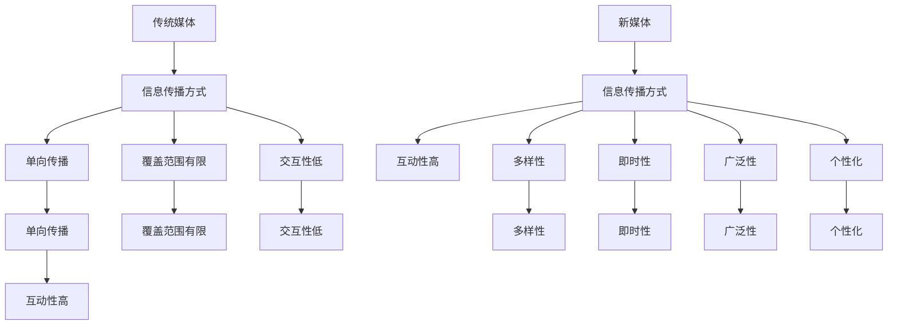

#### 核心算法原理讲解

在新媒体时代，算法在信息传播中扮演着重要角色。以下是新媒体时代信息传播的核心算法原理的伪代码：

```python
# 定义用户兴趣模型
class UserInterestModel:
    def __init__(self):
        self.interests = []

    def add_interest(self, interest):
        self.interests.append(interest)

    def get_interests(self):
        return self.interests

# 定义内容推荐算法
def content_recommendation(user_interest_model, content_database):
    recommended_content = []
    for content in content_database:
        if any(interest in content.keywords for interest in user_interest_model.get_interests()):
            recommended_content.append(content)
    return recommended_content

# 示例：用户A的兴趣
user_interest_model_a = UserInterestModel()
user_interest_model_a.add_interest("科技")
user_interest_model_a.add_interest("新闻")

# 示例：内容数据库
content_database = [
    {"title": "科技新闻", "keywords": ["科技", "创新"]},
    {"title": "体育新闻", "keywords": ["体育", "比赛"]},
    {"title": "娱乐新闻", "keywords": ["娱乐", "明星"]},
]

# 推荐内容给用户A
recommended_content_a = content_recommendation(user_interest_model_a, content_database)
print("推荐给用户A的内容：", recommended_content_a)
```

#### 数学模型和公式

新媒体时代的信息传播可以用数学模型来描述，例如，网络传播的传播速度可以用指数函数来表示：

$$
S(t) = S_0 \cdot e^{\lambda t}
$$

其中，$S(t)$ 表示时间 $t$ 时刻的传播范围，$S_0$ 是初始传播范围，$\lambda$ 是传播速率常数。

#### 举例说明

假设某个新闻在初始时刻 $t=0$ 时被传播到100人，传播速率为每天增加100人，那么一天后（$t=1$）的传播范围可以计算如下：

$$
S(1) = 100 \cdot e^{100 \cdot 1} \approx 1,268
$$

这意味着一天后，该新闻的传播范围将扩展到约1,268人。

### 1.2 言论自由与社会责任的平衡

#### 核心概念与联系

言论自由是指个人或集体在法律允许的范围内，有表达意见、观点和想法的权利。它被视为民主社会的基本人权，是公民参与社会和政治生活的重要途径。社会责任则强调个人或组织在行使权利时，应考虑到对社会和他人可能产生的影响，并承担相应的责任。

为了更好地理解言论自由与社会责任的平衡，我们可以使用Mermaid流程图来描述两者之间的关系：

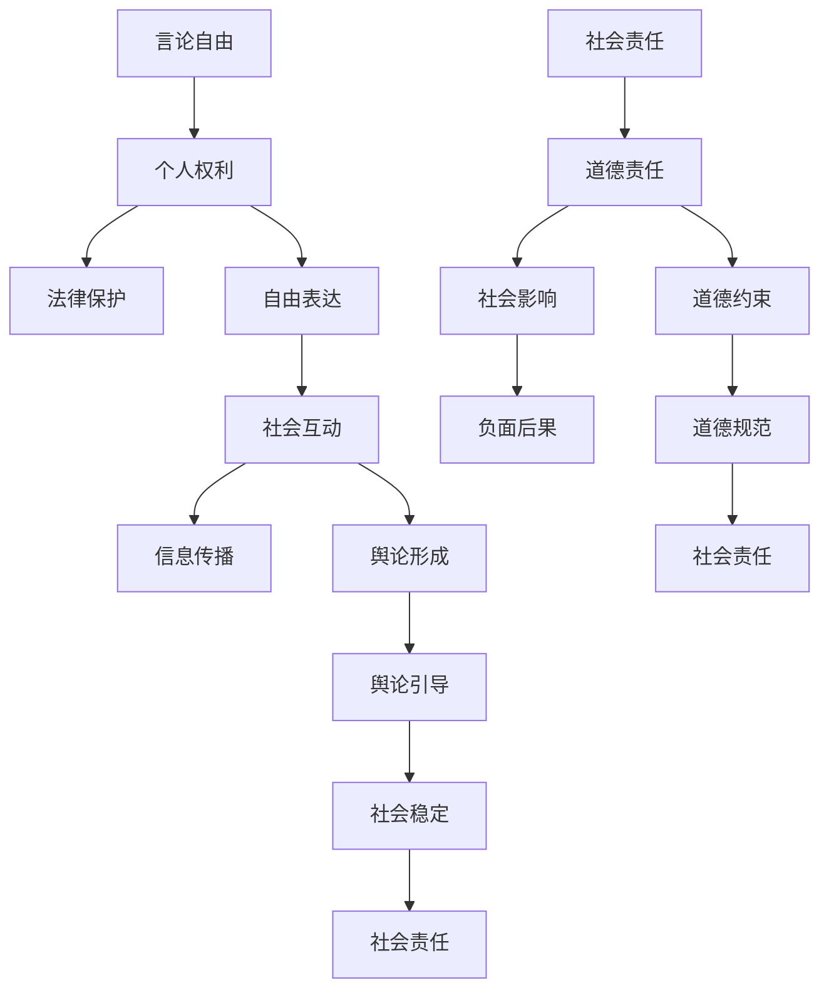

#### 核心算法原理讲解

在新媒体时代，言论自由与社会责任的平衡需要算法的支持。以下是新媒体时代言论自由与社会责任平衡的核心算法原理的伪代码：

```python
# 定义言论自由模型
class FreedomOfSpeechModel:
    def __init__(self):
        self.speeches = []

    def add_speech(self, speech):
        self.speeches.append(speech)

    def get_speeches(self):
        return self.speeches

# 定义社会责任模型
class SocialResponsibilityModel:
    def __init__(self):
        self.ratings = []

    def rate_speech(self, speech, rating):
        self.ratings.append((speech, rating))

    def get_rated_speeches(self):
        return self.ratings

# 定义言论过滤算法
def filter_speech(freedom_model, responsibility_model, max_rating=5):
    filtered_speeches = []
    for speech in freedom_model.get_speeches():
        if any(rating <= max_rating for speech, rating in responsibility_model.get_rated_speeches()):
            filtered_speeches.append(speech)
    return filtered_speeches

# 示例：用户A的言论
freedom_model_a = FreedomOfSpeechModel()
freedom_model_a.add_speech("科技发展是推动社会进步的重要力量。")

# 示例：社会责任评分
responsibility_model_a = SocialResponsibilityModel()
responsibility_model_a.rate_speech("科技发展是推动社会进步的重要力量。", 4)

# 过滤言论
filtered_speeches_a = filter_speech(freedom_model_a, responsibility_model_a)
print("过滤后的言论：", filtered_speeches_a)
```

#### 数学模型和公式

在言论自由与社会责任的平衡中，我们可以使用效用函数来评估言论对社会的影响。一个简单的效用函数可以是：

$$
U(S, R) = \frac{S}{R}
$$

其中，$U(S, R)$ 表示言论自由与社会责任的平衡效用，$S$ 表示言论自由度，$R$ 表示社会责任度。

#### 举例说明

假设某个言论的言论自由度为100，社会责任度为50，那么其平衡效用为：

$$
U(100, 50) = \frac{100}{50} = 2
$$

这意味着该言论在言论自由与社会责任之间达到了一个相对平衡的状态。

### 1.3 社会责任的重要性

#### 核心概念与联系

社会责任是指企业、组织或个人在追求经济利益的同时，应承担的对社会、环境、利益相关者等产生的积极或消极影响的责任。社会责任不仅关乎企业的道德伦理，也关系到企业的长远发展和品牌形象。

社会责任的重要性体现在以下几个方面：

1. **维护社会稳定**：企业承担社会责任有助于减少社会矛盾，维护社会和谐稳定。
2. **提升企业形象**：积极承担社会责任的企业往往能够赢得消费者的信任和支持，提升品牌形象。
3. **促进企业长远发展**：社会责任是企业发展的重要驱动力，有助于企业创新、提高竞争力和实现可持续发展。
4. **满足利益相关者期望**：企业承担社会责任能够满足股东、员工、客户、供应商等利益相关者的期望。

为了更好地理解社会责任的重要性，我们可以使用Mermaid流程图来描述社会责任的影响：

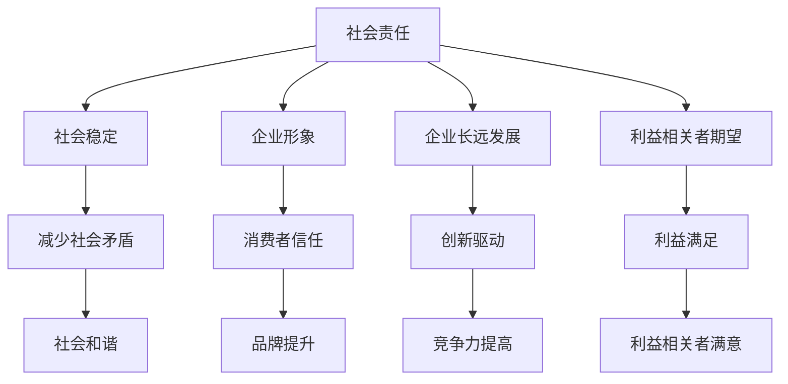

#### 核心算法原理讲解

在新媒体时代，社会责任的履行可以通过数据分析和智能算法来实现。以下是新媒体时代社会责任履行的一些核心算法原理的伪代码：

```python
# 定义社会责任履行模型
class SocialResponsibilityModel:
    def __init__(self):
        self社会责任项目 = []

    def add_project(self, project):
        self社会责任项目.append(project)

    def evaluate_project(self, project, evaluation):
        self社会责任项目[-1]['evaluation'] = evaluation

    def get_project_evaluation(self):
        return self社会责任项目

# 定义社会责任评估算法
def evaluate_project_sustainability(project, criteria):
    evaluation = 0
    for criterion in criteria:
        if criterion in project['performance']:
            evaluation += 1
    return evaluation / len(criteria)

# 示例：社会责任项目
social_responsibility_model = SocialResponsibilityModel()
social_responsibility_model.add_project({
    'project_name': '环保项目',
    'performance': {
        '减少碳排放': '成功',
        '废物回收率': '提高',
        '环保培训': '完成'
    }
})

# 评估项目可持续性
evaluation_criteria = ['减少碳排放', '废物回收率', '环保培训']
evaluation = evaluate_project_sustainability(social_responsibility_model.get_project_evaluation()[0], evaluation_criteria)
print("项目评价：", evaluation)
```

#### 数学模型和公式

社会责任的履行可以通过指标体系来评估，一个简单的社会责任评估模型可以是：

$$
S = \sum_{i=1}^{n} w_i \cdot p_i
$$

其中，$S$ 表示社会责任得分，$w_i$ 表示第 $i$ 个指标的权重，$p_i$ 表示第 $i$ 个指标的绩效。

#### 举例说明

假设有一个社会责任评估模型，其中碳排放减少、废物回收率和环保培训三个指标的权重分别为0.4、0.3和0.3，绩效分别为成功、提高和完成，那么社会责任得分为：

$$
S = 0.4 \cdot 1 + 0.3 \cdot 1 + 0.3 \cdot 1 = 1
$$

这意味着该项目的整体社会责任得分为1，表明项目在履行社会责任方面表现良好。

### 1.4 言论自由与社会责任的辩证关系

#### 核心概念与联系

言论自由与社会责任之间的辩证关系是指两者相互依存、相互制约的关系。一方面，言论自由是社会责任的前提，没有言论自由，个体和社会难以进行有效的沟通和互动；另一方面，社会责任是言论自由的保障，只有当个体意识到自己的言论对社会和他人可能产生的影响时，才能真正实现言论自由。

言论自由与社会责任的辩证关系可以体现在以下几个方面：

1. **相互促进**：言论自由有助于提高社会责任感，社会责任的实现又能进一步保障言论自由。
2. **相互制约**：言论自由需要在法律和伦理框架内进行，社会责任则要求个体在行使言论自由时考虑到社会的整体利益。
3. **动态平衡**：言论自由与社会责任在不同情境下可能存在冲突，需要通过不断的调整和平衡来实现最佳状态。

为了更好地理解言论自由与社会责任的辩证关系，我们可以使用Mermaid流程图来描述两者之间的相互作用：

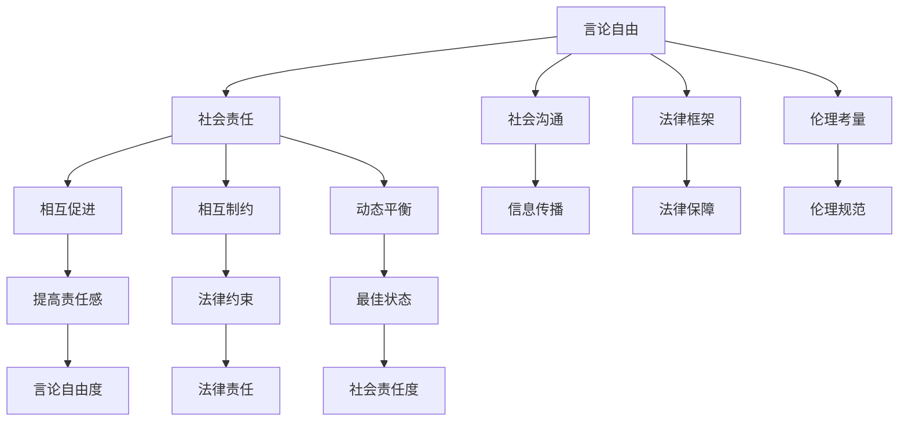

#### 核心算法原理讲解

在新媒体时代，言论自由与社会责任的辩证关系可以通过智能算法来体现。以下是新媒体时代言论自由与社会责任辩证关系的核心算法原理的伪代码：

```python
# 定义言论自由与社会责任评估模型
class FreedomAndResponsibilityModel:
    def __init__(self):
        self.freedoms = []
        self.responsibilities = []

    def add_freedom(self, freedom):
        self.freedoms.append(freedom)

    def add_responsibility(self, responsibility):
        self.responsibilities.append(responsibility)

    def evaluate_balance(self):
        freedom_score = sum(self.freedoms)
        responsibility_score = sum(self.responsibilities)
        return freedom_score / responsibility_score

# 定义言论自由度评估算法
def evaluate_freedom(freedom, criteria):
    score = 0
    for criterion in criteria:
        if criterion in freedom:
            score += 1
    return score / len(criteria)

# 定义社会责任度评估算法
def evaluate_responsibility(responsibility, criteria):
    score = 0
    for criterion in criteria:
        if criterion in responsibility:
            score += 1
    return score / len(criteria)

# 示例：言论自由度评估
freedom_criteria = ['信息传播', '表达观点', '社交互动']
freedom_a = "我发表了一篇关于科技发展的观点。"
freedom_score_a = evaluate_freedom(freedom_a, freedom_criteria)
print("言论自由度评分：", freedom_score_a)

# 示例：社会责任度评估
responsibility_criteria = ['社会责任', '环境影响', '社会稳定']
responsibility_a = "我发起了一项环保公益活动。"
responsibility_score_a = evaluate_responsibility(responsibility_a, responsibility_criteria)
print("社会责任度评分：", responsibility_score_a)

# 评估言论自由与社会责任的平衡
freedom_and_responsibility_model = FreedomAndResponsibilityModel()
freedom_and_responsibility_model.add_freedom(freedom_a)
freedom_and_responsibility_model.add_responsibility(responsibility_a)
balance_score = freedom_and_responsibility_model.evaluate_balance()
print("平衡评分：", balance_score)
```

#### 数学模型和公式

言论自由与社会责任的平衡可以通过综合评分模型来评估。一个简单的综合评分模型可以是：

$$
BalanceScore = \frac{F + R}{2}
$$

其中，$BalanceScore$ 表示平衡评分，$F$ 表示言论自由度评分，$R$ 表示社会责任度评分。

#### 举例说明

假设言论自由度评分为0.8，社会责任度评分为0.6，那么平衡评分为：

$$
BalanceScore = \frac{0.8 + 0.6}{2} = 0.7
$$

这意味着言论自由与社会责任的平衡状态为中等水平。

### 1.5 言论自由受限的情况分析

#### 核心概念与联系

言论自由受限是指个人或集体在表达意见、观点和想法时，受到法律、政策、道德等因素的约束，不能完全行使言论自由权。言论自由受限的情况可以是合法的，也可以是非法的，其程度和范围因国家和地区而异。

言论自由受限的情况可以分为以下几类：

1. **法律限制**：国家法律和政策对言论自由的明确规定，如禁止传播虚假信息、煽动性言论等。
2. **道德约束**：社会道德规范对个人言论的约束，如公共场合不宜发表不当言论。
3. **技术控制**：网络平台通过算法、技术手段对言论进行过滤、审查，以防止违规内容的传播。
4. **社会压力**：社会舆论、公众观点对个人言论的干预，如网络暴力、舆论监督等。

为了更好地理解言论自由受限的情况，我们可以使用Mermaid流程图来描述不同类型的言论自由受限：

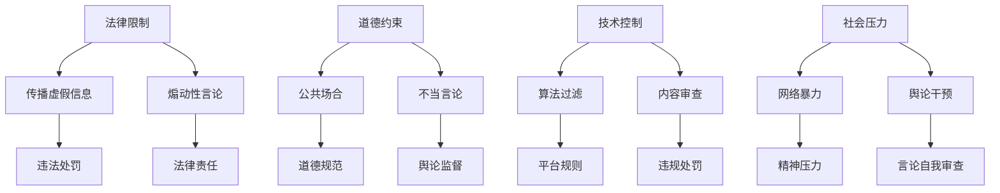

#### 核心算法原理讲解

在新媒体时代，言论自由受限可以通过智能算法来实现。以下是新媒体时代言论自由受限的核心算法原理的伪代码：

```python
# 定义言论自由限制模型
class FreedomRestrictionModel:
    def __init__(self):
        self.restrictions = []

    def add_restriction(self, restriction):
        self.restrictions.append(restriction)

    def check_restriction(self, speech):
        for restriction in self.restrictions:
            if restriction in speech:
                return True
        return False

# 定义言论审查算法
def review_speech(speech, restriction_model):
    if restriction_model.check_restriction(speech):
        return "言论受限，请修改内容。"
    else:
        return "言论自由，可以发布。"

# 示例：言论自由限制模型
restriction_model = FreedomRestrictionModel()
restriction_model.add_restriction("虚假信息")
restriction_model.add_restriction("煽动性言论")

# 示例：言论审查
speech_a = "我听说最近出现了一种新型病毒，大家要提高警惕。"
review_result_a = review_speech(speech_a, restriction_model)
print("审查结果：", review_result_a)
```

#### 数学模型和公式

言论自由受限可以通过指标体系来评估。一个简单的言论自由受限指标可以是：

$$
RestrictionScore = \frac{R}{N}
$$

其中，$RestrictionScore$ 表示言论自由受限度，$R$ 表示受限言论的数量，$N$ 表示总言论数量。

#### 举例说明

假设一个平台上总共有100条言论，其中有20条言论受限，那么言论自由受限度为：

$$
RestrictionScore = \frac{20}{100} = 0.2
$$

这意味着该平台的言论自由受限度相对较低。

### 1.6 社会责任对言论自由的限制

#### 核心概念与联系

社会责任对言论自由的限制是指个体在行使言论自由时，必须考虑到对社会可能产生的负面影响，并受到社会责任的约束。这种限制旨在维护社会的稳定和公共利益，防止言论自由被滥用。

社会责任对言论自由的限制可以从以下几个方面进行理解：

1. **公共利益**：社会责任要求个体在言论自由中考虑到公共利益，避免言论自由损害社会的整体利益。
2. **道德规范**：社会责任强调个体在言论自由中遵守社会道德规范，避免不当言论对社会产生负面影响。
3. **法律法规**：社会责任要求个体在言论自由中遵守法律法规，避免触犯法律。

为了更好地理解社会责任对言论自由的限制，我们可以使用Mermaid流程图来描述这种限制：

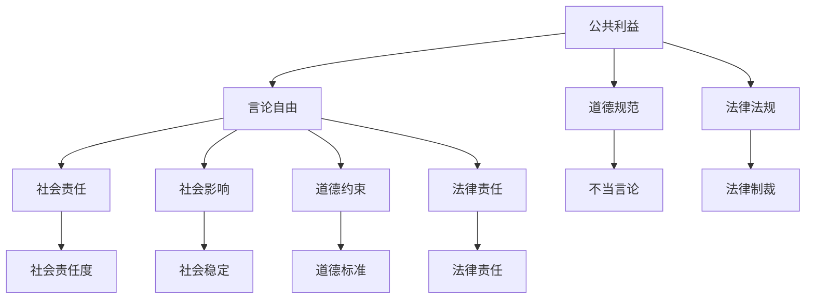

#### 核心算法原理讲解

在新媒体时代，社会责任对言论自由的限制可以通过智能算法来实现。以下是新媒体时代社会责任对言论自由的限制的核心算法原理的伪代码：

```python
# 定义社会责任审查模型
class SocialResponsibilityReviewModel:
    def __init__(self):
        self.restrictions = []

    def add_restriction(self, restriction):
        self.restrictions.append(restriction)

    def review_speech(self, speech):
        for restriction in self.restrictions:
            if restriction in speech:
                return "言论受限，请遵守社会责任。"
        return "言论自由，可以发布。"

# 定义社会责任限制条件
restriction_model = SocialResponsibilityReviewModel()
restriction_model.add_restriction("煽动性言论")
restriction_model.add_restriction("虚假信息")

# 示例：言论审查
speech_a = "我强烈谴责最近发生的暴力事件。"
review_result_a = restriction_model.review_speech(speech_a)
print("审查结果：", review_result_a)
```

#### 数学模型和公式

社会责任对言论自由的限制可以通过违规言论比例来衡量。一个简单的违规言论比例模型可以是：

$$
ViolationRate = \frac{V}{T}
$$

其中，$ViolationRate$ 表示违规言论比例，$V$ 表示违规言论数量，$T$ 表示总言论数量。

#### 举例说明

假设一个平台上总共有100条言论，其中有20条言论违反社会责任，那么违规言论比例为：

$$
ViolationRate = \frac{20}{100} = 0.2
$$

这意味着该平台的违规言论比例相对较高，需要加强社会责任教育和管理。

### 1.7 新媒体表达伦理问题

#### 背景介绍

在新媒体时代，信息传播的速度和范围都得到了极大的扩展，这也带来了一系列伦理问题。新媒体表达伦理问题主要包括虚假信息传播、误导性言论、网络暴力和仇恨言论等。这些问题不仅影响了社会稳定和公共利益，也对个体的心理健康和社会信任造成了负面影响。

#### 核心概念与联系

新媒体表达伦理问题涉及到多个核心概念，包括虚假信息、误导性言论、网络暴力和仇恨言论等。以下是这些概念之间的联系：

1. **虚假信息**：虚假信息是指故意传播的、与事实不符的信息，可能引发社会恐慌和误解。
2. **误导性言论**：误导性言论是指意图误导他人、使其产生错误认知的言论。
3. **网络暴力**：网络暴力是指通过网络平台实施的恶意攻击、侮辱和威胁行为。
4. **仇恨言论**：仇恨言论是指基于种族、宗教、性别等因素恶意攻击他人的言论。

为了更好地理解这些概念之间的联系，我们可以使用Mermaid流程图来描述：

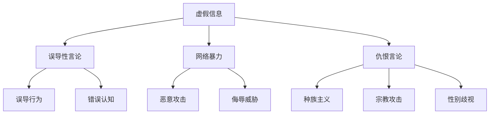

#### 核心算法原理讲解

在新媒体时代，解决伦理问题需要依赖智能算法。以下是新媒体表达伦理问题解决的核心算法原理的伪代码：

```python
# 定义虚假信息检测算法
def detect_false_information(content, fact_check_database):
    for fact in fact_check_database:
        if fact['content'] in content:
            return True
    return False

# 定义误导性言论检测算法
def detect_misleading_speech(speech, context):
    if "误导性词汇" in speech or "错误信息" in context:
        return True
    return False

# 定义网络暴力检测算法
def detect_network_violence(comment, threshold):
    offensive_words = ["侮辱性词汇", "恶意攻击"]
    count = 0
    for word in offensive_words:
        if word in comment:
            count += 1
    return count >= threshold

# 定义仇恨言论检测算法
def detect_hate_speech(comment, sensitive_topics):
    for topic in sensitive_topics:
        if topic in comment:
            return True
    return False

# 示例：检测言论
content = "最近发生了一场严重的自然灾害，请大家注意安全。"
fact_check_database = [{"content": "最近发生了一场严重的自然灾害。"}]
print("虚假信息检测：", detect_false_information(content, fact_check_database))

speech = "我强烈反对这次政策调整。"
context = "政策调整引发了广泛争议。"
print("误导性言论检测：", detect_misleading_speech(speech, context))

comment = "你这个废物，怎么这么没用。"
threshold = 2
print("网络暴力检测：", detect_network_violence(comment, threshold))

comment = "所有人都应该远离黑人。"
sensitive_topics = ["种族主义", "种族歧视"]
print("仇恨言论检测：", detect_hate_speech(comment, sensitive_topics))
```

#### 数学模型和公式

在新媒体表达伦理问题中，可以使用概率模型来评估言论的风险。一个简单的概率模型可以是：

$$
RiskScore = P(false\_information) + P(misleading\_speech) + P(network\_violence) + P(hate\_speech)
$$

其中，$RiskScore$ 表示言论风险得分，$P(false\_information)$、$P(misleading\_speech)$、$P(network\_violence)$ 和 $P(hate\_speech)$ 分别表示虚假信息、误导性言论、网络暴力和仇恨言论的概率。

#### 举例说明

假设一个言论包含虚假信息、误导性言论、网络暴力和仇恨言论的概率分别为0.2、0.3、0.1和0.2，那么其风险得分为：

$$
RiskScore = 0.2 + 0.3 + 0.1 + 0.2 = 0.8
$$

这意味着该言论的风险较高，需要进一步审查。

### 3.2 虚假信息与误导性言论

#### 背景介绍

虚假信息和误导性言论是新媒体时代最常见的伦理问题之一。虚假信息是指故意传播的、与事实不符的信息，可能引发社会恐慌和误解。误导性言论则是指意图误导他人、使其产生错误认知的言论。两者都对社会的稳定和公共利益构成了严重威胁。

#### 核心概念与联系

虚假信息和误导性言论之间存在紧密的联系。虚假信息可能通过误导性言论的方式传播，而误导性言论也可能包含虚假信息。为了更好地理解这些概念之间的联系，我们可以使用Mermaid流程图来描述：

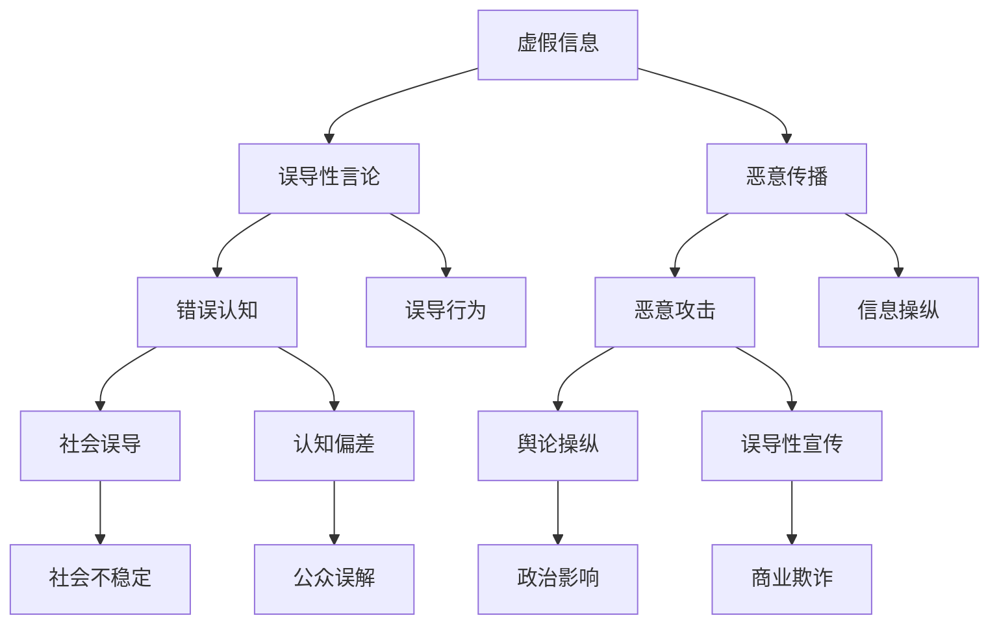

#### 核心算法原理讲解

在新媒体时代，解决虚假信息和误导性言论问题需要依赖智能算法。以下是新媒体时代虚假信息和误导性言论处理的核心算法原理的伪代码：

```python
# 定义虚假信息检测算法
def detect_false_information(content, fact_check_database):
    for fact in fact_check_database:
        if fact['content'] in content:
            return True
    return False

# 定义误导性言论检测算法
def detect_misleading_speech(speech, context):
    misleading_phrases = ["误导性词汇", "错误信息"]
    for phrase in misleading_phrases:
        if phrase in speech or phrase in context:
            return True
    return False

# 示例：检测言论
content = "最近发生了一场严重的自然灾害，请大家注意安全。"
fact_check_database = [{"content": "最近发生了一场严重的自然灾害。"}]
print("虚假信息检测：", detect_false_information(content, fact_check_database))

speech = "我强烈反对这次政策调整。"
context = "政策调整引发了广泛争议。"
print("误导性言论检测：", detect_misleading_speech(speech, context))
```

#### 数学模型和公式

在虚假信息和误导性言论检测中，可以使用概率模型来评估言论的风险。一个简单的概率模型可以是：

$$
RiskScore = P(false\_information) + P(misleading\_speech)
$$

其中，$RiskScore$ 表示言论风险得分，$P(false\_information)$ 和 $P(misleading\_speech)$ 分别表示虚假信息和误导性言论的概率。

#### 举例说明

假设一个言论包含虚假信息和误导性言论的概率分别为0.3和0.2，那么其风险得分为：

$$
RiskScore = 0.3 + 0.2 = 0.5
$$

这意味着该言论的风险较高，需要进一步审查。

### 3.3 网络暴力和仇恨言论

#### 背景介绍

网络暴力和仇恨言论是新媒体时代严重影响社会和谐和公共利益的两个问题。网络暴力是指通过网络平台实施的恶意攻击、侮辱和威胁行为。仇恨言论则是指基于种族、宗教、性别等因素恶意攻击他人的言论。这两种行为不仅损害了受害者的身心健康，也破坏了社会的基本价值观和道德规范。

#### 核心概念与联系

网络暴力和仇恨言论之间存在紧密的联系。网络暴力可能包含仇恨言论的成分，而仇恨言论也可能通过网络暴力进行传播。为了更好地理解这些概念之间的联系，我们可以使用Mermaid流程图来描述：

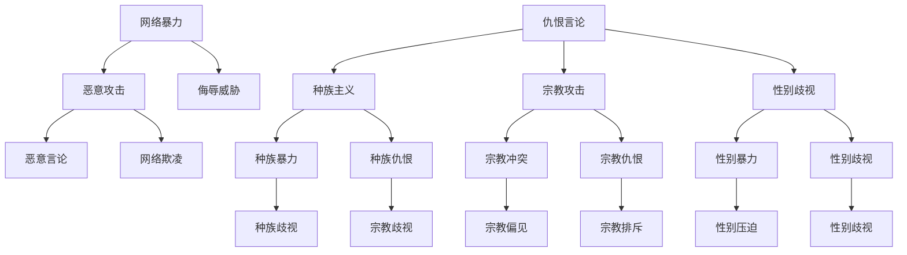

#### 核心算法原理讲解

在新媒体时代，解决网络暴力和仇恨言论问题需要依赖智能算法。以下是新媒体时代网络暴力和仇恨言论处理的核心算法原理的伪代码：

```python
# 定义网络暴力检测算法
def detect_network_violence(comment, threshold):
    offensive_words = ["侮辱性词汇", "恶意攻击"]
    count = 0
    for word in offensive_words:
        if word in comment:
            count += 1
    return count >= threshold

# 定义仇恨言论检测算法
def detect_hate_speech(comment, sensitive_topics):
    for topic in sensitive_topics:
        if topic in comment:
            return True
    return False

# 示例：检测言论
comment = "你这个废物，怎么这么没用。"
threshold = 2
print("网络暴力检测：", detect_network_violence(comment, threshold))

comment = "所有人都应该远离黑人。"
sensitive_topics = ["种族主义", "种族歧视"]
print("仇恨言论检测：", detect_hate_speech(comment, sensitive_topics))
```

#### 数学模型和公式

在处理网络暴力和仇恨言论时，可以使用分类模型来评估言论的风险。一个简单的分类模型可以是：

$$
RiskClass = \begin{cases}
1, & \text{如果言论包含网络暴力或仇恨言论} \\
0, & \text{否则}
\end{cases}
$$

其中，$RiskClass$ 表示言论风险类别。

#### 举例说明

假设一个言论包含网络暴力和仇恨言论，那么其风险类别为1，需要进一步审查。

### 3.4 色情、暴力和恐怖内容的处理

#### 背景介绍

在新媒体时代，色情、暴力和恐怖内容成为了重要的伦理问题。这些内容不仅违反了社会道德和法律规范，也对青少年的心理健康和道德观念产生了负面影响。因此，对色情、暴力和恐怖内容进行有效的处理和监管成为了新媒体平台的重要任务。

#### �根概念与联系

色情、暴力和恐怖内容在不同情境下可能产生不同的影响，但它们之间也存在紧密的联系。以下是这些内容的核心概念和联系：

1. **色情内容**：指以激发性欲为目的的视觉或文字内容。
2. **暴力内容**：指描述或展示暴力行为的视觉或文字内容。
3. **恐怖内容**：指旨在制造恐惧或恐慌的视觉或文字内容。

为了更好地理解这些概念之间的联系，我们可以使用Mermaid流程图来描述：

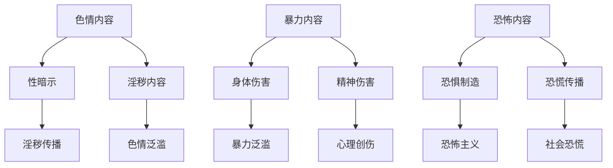

#### 核心算法原理讲解

在新媒体时代，对色情、暴力和恐怖内容进行有效处理需要依赖智能算法。以下是新媒体时代处理这些内容的算法原理的伪代码：

```python
# 定义色情内容检测算法
def detectPornography(content, adult_words):
    for word in adult_words:
        if word in content:
            return True
    return False

# 定义暴力内容检测算法
def detectViolence(content, violent_words):
    for word in violent_words:
        if word in content:
            return True
    return False

# 定义恐怖内容检测算法
def detectTerrorism(content, terror_words):
    for word in terror_words:
        if word in content:
            return True
    return False

# 示例：检测言论
content = "今晚去影院看电影，感觉剧情很恐怖。"
adult_words = ["性", "裸体"]
print("色情内容检测：", detectPornography(content, adult_words))

content = "他被人用刀刺伤了腹部。"
violent_words = ["刀", "刺伤"]
print("暴力内容检测：", detectViolence(content, violent_words))

content = "恐怖分子发动了袭击，造成了大量人员伤亡。"
terror_words = ["恐怖分子", "袭击"]
print("恐怖内容检测：", detectTerrorism(content, terror_words))
```

#### 数学模型和公式

在处理色情、暴力和恐怖内容时，可以使用分类模型来评估言论的风险。一个简单的分类模型可以是：

$$
RiskClass = \begin{cases}
1, & \text{如果言论包含色情、暴力或恐怖内容} \\
0, & \text{否则}
\end{cases}
$$

其中，$RiskClass$ 表示言论风险类别。

#### 举例说明

假设一个言论包含色情、暴力和恐怖内容，那么其风险类别为1，需要进一步审查。

### 4.1 国内案例：微博、抖音上的言论争议

#### 背景介绍

微博和抖音是国内两个最具代表性的社交媒体平台，它们在信息传播、社交互动和内容创作方面具有广泛的影响力。然而，随着用户数量的增加和信息的快速传播，微博和抖音上也出现了大量的言论争议事件，涉及到虚假信息、网络暴力和仇恨言论等伦理问题。

#### 案例背景与争议分析

1. **虚假信息传播**：在2020年，微博上出现了一则关于新冠病毒起源的虚假信息，称病毒是某个实验室泄露的。这则虚假信息迅速传播，引发了社会恐慌和误解。尽管微博平台及时进行了辟谣，但该信息的传播速度之快和范围之广仍然令人震惊。

2. **网络暴力**：在微博和抖音上，一些公众人物和普通用户因为言论观点不同而引发了激烈的网络暴力。例如，一位知名博主因为在微博上发表了关于社会现象的观点，遭到了大量恶意评论和攻击，导致其账号被封禁。

3. **仇恨言论**：在微博和抖音上，一些用户发布了含有种族歧视和宗教歧视的言论，引发了社会的不满和抗议。这些言论不仅损害了受害者的权益，也破坏了社会的和谐与稳定。

#### 政策与法律的应用

为了应对这些言论争议，微博和抖音平台采取了一系列的措施：

1. **内容审核**：微博和抖音平台引入了智能审核系统，通过算法和人工审核相结合的方式，对发布的言论进行实时监控和过滤。一旦发现违规内容，平台将立即进行处理。

2. **用户教育**：平台通过发布公益广告、举办线上教育活动等方式，提高用户对言论自由和社会责任的认知，引导用户文明上网。

3. **法律法规**：微博和抖音平台严格遵守国家法律法规，对涉及违法言论的行为进行严肃处理，包括封禁账号、删除内容、追究法律责任等。

#### 案例分析与讨论

通过对微博和抖音上的言论争议案例进行分析，我们可以看出：

1. **言论自由与社会责任的平衡**：在言论自由和社会责任之间，平台需要在法律和道德的框架内寻找平衡。虽然言论自由是基本的人权，但过度的言论自由可能导致社会不稳定和公共利益的损害。

2. **智能审核系统的挑战**：虽然智能审核系统能够在一定程度上提高内容审核的效率，但也会面临误判和滥用的问题。平台需要不断完善算法，提高审核的准确性和公正性。

3. **用户教育和监管**：仅靠技术手段难以解决言论争议问题，用户教育和监管同样重要。平台需要加强与用户的沟通，引导用户正确行使言论自由，共同维护网络环境的和谐与稳定。

### 4.2 国际案例：社交媒体平台的监管策略

#### 背景介绍

在全球范围内，社交媒体平台如Facebook、Twitter、YouTube等已经成为人们获取信息、表达观点和社交互动的重要渠道。然而，这些平台在信息传播过程中也面临着虚假信息、网络暴力和仇恨言论等伦理问题。因此，各国政府和社交媒体平台纷纷采取措施，制定相应的监管策略，以维护网络环境的健康和稳定。

#### 社交媒体平台的监管实践

1. **内容审核**：社交媒体平台通常采用自动审核和人工审核相结合的方式，对用户发布的内容进行实时监控和过滤。自动审核系统利用算法和机器学习技术，识别和过滤违规内容；人工审核则由专业团队进行审核，确保内容的合法性和道德性。

2. **算法透明化**：为了应对算法滥用和偏见问题，一些社交媒体平台开始公开算法细节和决策过程，提高算法的透明度和公正性。例如，Facebook发布了一份关于其新闻推送算法的白皮书，详细介绍了算法的运行原理和优化方法。

3. **用户教育**：社交媒体平台通过在线教育、公益广告和用户指南等方式，提高用户对言论自由和社会责任的认知，引导用户文明上网。

4. **合作与监管**：社交媒体平台与政府和学术界合作，共同制定和实施网络监管政策。例如，欧盟推出了《数字服务法案》（Digital Services Act），要求社交媒体平台对虚假信息和有害内容进行更严格的监管。

#### 案例分析与讨论

通过对国际社交媒体平台的监管实践进行分析，我们可以看出：

1. **监管的必要性**：社交媒体平台在信息传播过程中扮演着重要角色，但过度的言论自由可能导致社会不稳定和公共利益的损害。因此，监管措施在保障言论自由的同时，也需要维护社会的稳定和公共利益。

2. **技术手段的挑战**：尽管自动审核系统能够提高内容审核的效率，但也会面临误判和滥用的问题。平台需要不断完善算法，提高审核的准确性和公正性。

3. **用户教育的价值**：仅靠技术手段难以解决言论争议问题，用户教育和监管同样重要。平台需要加强与用户的沟通，引导用户正确行使言论自由，共同维护网络环境的和谐与稳定。

4. **国际合作的机遇**：在全球化的背景下，国际社交媒体平台的监管需要各国政府和平台的共同努力。通过合作与交流，可以制定更加全面和有效的监管政策，共同应对网络伦理问题。

### 5.1 言论自由的法律保护

#### 核心概念与联系

言论自由的法律保护是指法律体系对个人或集体在法律允许范围内表达意见、观点和想法的权利进行保障。言论自由不仅是民主社会的基本人权，也是社会进步和公民参与的重要途径。法律保护言论自由的核心概念包括：

1. **宪法权利**：宪法通常规定言论自由为基本权利，保障个人在不违反法律的前提下表达意见。
2. **法律限制**：虽然言论自由受到宪法保障，但为了维护社会稳定和公共利益，法律也规定了特定的限制条件。
3. **司法审查**：司法系统对言论自由的合法性和合理性进行审查，确保法律限制在合理范围内。

为了更好地理解这些概念之间的联系，我们可以使用Mermaid流程图来描述：

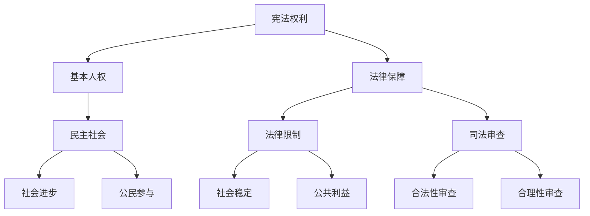

#### 核心算法原理讲解

在法律保护言论自由的领域，算法通常用于识别和过滤违反法律规定的言论。以下是言论自由法律保护的核心算法原理的伪代码：

```python
# 定义言论自由保护算法
class FreeSpeechProtectionAlgorithm:
    def __init__(self):
        self.restricted_words = ["煽动性词汇", "违法内容"]

    def check_speech legality(self, speech):
        for word in self.restricted_words:
            if word in speech:
                return "言论违法，需审查。"
        return "言论合法，可发布。"

# 示例：检查言论合法性
speech = "我强烈反对这项政策，认为它严重侵犯了我们的权益。"
restriction_algorithm = FreeSpeechProtectionAlgorithm()
legality_check_result = restriction_algorithm.check_speech_legality(speech)
print("言论合法性检查结果：", legality_check_result)
```

#### 数学模型和公式

在言论自由的法律保护中，可以使用规则模型来评估言论的合法性。一个简单的规则模型可以是：

$$
LegalityScore = \begin{cases}
1, & \text{如果言论包含法律禁止的词汇} \\
0, & \text{否则}
\end{cases}
$$

其中，$LegalityScore$ 表示言论的合法性评分。

#### 举例说明

假设一个言论包含法律禁止的词汇，那么其合法性评分为1，表明该言论需要进一步审查。

### 5.2 社会责任的法律规定

#### 核心概念与联系

社会责任的法律规定是指法律体系对个人或组织在追求经济利益的同时，应承担的对社会、环境、利益相关者等产生的积极或消极影响的责任。社会责任不仅是道德要求，也是法律规范的重要组成部分。核心概念包括：

1. **企业社会责任**：企业承担社会责任，如环境保护、员工福利、慈善捐助等。
2. **法律法规**：法律对社会责任的具体规定，如《环境保护法》、《劳动法》、《慈善法》等。
3. **法律责任**：违反社会责任规定的行为将受到法律制裁，如罚款、停业、刑事处罚等。

为了更好地理解这些概念之间的联系，我们可以使用Mermaid流程图来描述：

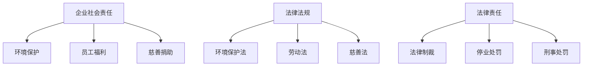

#### 核心算法原理讲解

在实施社会责任的法律规定时，算法可以用于监测和评估企业的社会责任履行情况。以下是社会责任法律规定核心算法原理的伪代码：

```python
# 定义社会责任评估算法
class SocialResponsibilityAlgorithm:
    def __init__(self):
        self.compliance_rules = [
            {"rule": "环保达标", "weight": 0.3},
            {"rule": "员工福利完善", "weight": 0.4},
            {"rule": "慈善捐助及时", "weight": 0.3}
        ]

    def evaluate_company_compliance(self, company_report):
        score = 0
        for rule in self.compliance_rules:
            if rule["rule"] in company_report:
                score += rule["weight"]
        return score

# 示例：评估企业社会责任
company_report = "环保达标，员工福利完善，慈善捐助及时。"
responsibility_algorithm = SocialResponsibilityAlgorithm()
compliance_score = responsibility_algorithm.evaluate_company_compliance(company_report)
print("企业社会责任评分：", compliance_score)
```

#### 数学模型和公式

社会责任的评估可以通过加权总分模型来计算。一个简单的模型可以是：

$$
ResponsibilityScore = \sum_{i=1}^{n} w_i \cdot p_i
$$

其中，$ResponsibilityScore$ 表示社会责任得分，$w_i$ 表示第 $i$ 个指标的重要性权重，$p_i$ 表示第 $i$ 个指标的绩效。

#### 举例说明

假设有三个社会责任指标，每个指标的权重分别为0.3、0.4和0.3，绩效分别为达标、达标和未达标，那么社会责任得分为：

$$
ResponsibilityScore = 0.3 \cdot 1 + 0.4 \cdot 1 + 0.3 \cdot 0 = 0.7
$$

这意味着企业的社会责任履行得较好。

### 5.3 我国新媒体时代的相关法律法规

#### 背景介绍

随着互联网技术的飞速发展，新媒体时代已经深刻地改变了信息传播和社会互动的方式。为了维护网络环境的健康和稳定，我国出台了一系列相关法律法规，以规范新媒体平台的使用和管理。

#### 主要法律法规

1. **《中华人民共和国网络安全法》**：该法于2017年6月1日正式实施，是我国网络安全领域的基础性法律。其中规定了网络运营者的安全保护义务，包括数据安全、网络安全监测、网络安全事件应对等。

2. **《中华人民共和国数据安全法》**：该法于2021年9月1日正式实施，是我国数据安全领域的重要法律。其中规定了数据处理者的安全保护义务，包括数据分类、数据安全风险评估、数据安全事件应对等。

3. **《互联网信息服务管理办法》**：该办法于2021年修订，对互联网信息服务的管理进行了详细规定，包括信息服务提供者的义务、信息服务内容的规范、违法行为的法律责任等。

4. **《中华人民共和国广告法》**：该法对互联网广告进行了详细规定，包括广告主和广告经营者的义务、广告内容的要求、违法行为的法律责任等。

#### 主要内容

1. **网络安全与数据保护**：法律法规强调网络运营者和数据处理者的安全保护义务，包括数据加密、访问控制、安全监测等。此外，对于数据跨境传输也进行了严格规定。

2. **内容管理**：法律法规对互联网信息服务内容进行了规范，包括禁止传播虚假信息、禁止发布违法违规内容等。同时，规定了互联网信息服务提供者的内容审核和责任追究机制。

3. **广告管理**：法律法规对互联网广告进行了详细规定，包括广告主和广告经营者的义务、广告内容的要求、违法行为的法律责任等。此外，对于医疗、药品、金融等高风险领域的广告也进行了特别规定。

4. **法律责任**：法律法规明确了对于违反规定的法律责任，包括罚款、停业、吊销许可证等。对于涉及国家安全、社会公共利益等重大问题的违法行为，还将追究刑事责任。

#### 实施与效果

自相关法律法规实施以来，我国新媒体时代的信息传播秩序得到了明显改善，网络环境逐渐变得健康和稳定。法律法规的实施不仅规范了新媒体平台的使用和管理，也提高了企业和个人的法律意识，促进了网络空间的和谐发展。

1. **内容审核效率提升**：法律法规的实施使得新媒体平台的内容审核效率得到了显著提升，违规内容的发布和传播得到了有效遏制。

2. **用户权益保护加强**：法律法规的实施使得用户的权益得到了更好的保护，网络暴力和恶意攻击行为得到了有效遏制。

3. **社会共识形成**：法律法规的实施促进了社会共识的形成，公众对新媒体传播的道德和法律规范有了更加明确的认识。

#### 案例分析

以下是一个关于我国新媒体时代相关法律法规实施的案例分析：

1. **案例背景**：某新媒体平台因发布虚假信息被国家网信办依法查处。

2. **案例分析**：该平台因未对发布的内容进行充分审核，导致虚假信息传播，对社会造成了不良影响。国家网信办依法对该平台进行了处罚，包括罚款、要求整改等。此次案例表明，法律法规对于新媒体平台的约束力得到了有效执行。

3. **案例启示**：此案例提醒新媒体平台在运营过程中必须严格遵守相关法律法规，加强内容审核和自律，以确保网络环境的健康和稳定。

### 6.1 个人在新媒体时代的责任

#### 背景介绍

在新媒体时代，个人在信息传播和社会互动中扮演着重要角色。随着互联网的普及和智能手机的广泛使用，每个人都可以轻松地发布信息、表达观点和参与讨论。然而，这也带来了诸多伦理问题，如虚假信息传播、网络暴力和仇恨言论等。因此，个人在新媒体时代承担相应的责任变得尤为重要。

#### 核心概念与联系

个人在新媒体时代的责任涉及多个核心概念，包括：

1. **言论自由**：个人有权在法律允许的范围内表达自己的观点和意见。
2. **社会责任**：个人在行使言论自由时，需要考虑到对社会和他人可能产生的影响，并承担相应的责任。
3. **道德规范**：个人在言论和行为中应遵守社会道德规范，尊重他人的权益和尊严。
4. **法律法规**：个人在言论和行为中需要遵守国家法律法规，不得发布违法违规的内容。

为了更好地理解这些概念之间的联系，我们可以使用Mermaid流程图来描述：

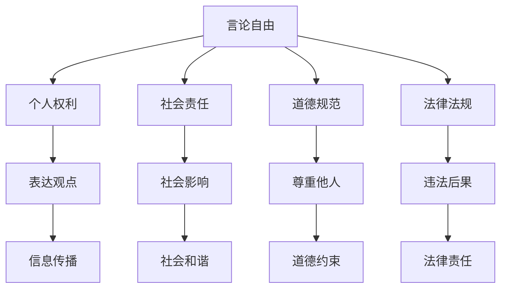

#### 核心算法原理讲解

在新媒体时代，个人责任可以通过智能算法来辅助实现。以下是个人在新媒体时代责任的核心算法原理的伪代码：

```python
# 定义个人责任模型
class PersonalResponsibilityModel:
    def __init__(self):
        self.speeches = []

    def add_speech(self, speech):
        self.speeches.append(speech)

    def check_legality(self, speech):
        illegal_words = ["煽动性词汇", "违法内容"]
        for word in illegal_words:
            if word in speech:
                return "言论违法，需审查。"
        return "言论合法，可发布。"

    def check_morality(self, speech):
        immoral_words = ["侮辱性词汇", "恶意攻击"]
        for word in immoral_words:
            if word in speech:
                return "言论不道德，需审查。"
        return "言论道德，可发布。"

# 示例：个人发布言论
personal_responsibility_model = PersonalResponsibilityModel()
personal_responsibility_model.add_speech("我强烈反对这项政策，认为它严重侵犯了我们的权益。")
legality_check_result = personal_responsibility_model.check_legality("我强烈反对这项政策，认为它严重侵犯了我们的权益。")
morality_check_result = personal_responsibility_model.check_morality("我强烈反对这项政策，认为它严重侵犯了我们的权益。")
print("言论合法性检查结果：", legality_check_result)
print("言论道德性检查结果：", morality_check_result)
```

#### 数学模型和公式

在个人责任评估中，可以使用综合评分模型来评估个人责任的履行情况。一个简单的模型可以是：

$$
ResponsibilityScore = \frac{L + M}{2}
$$

其中，$ResponsibilityScore$ 表示个人责任评分，$L$ 表示言论合法性评分，$M$ 表示言论道德性评分。

#### 举例说明

假设一个个人发布的言论的合法性评分为0.9，道德性评分为0.8，那么其个人责任评分为：

$$
ResponsibilityScore = \frac{0.9 + 0.8}{2} = 0.85
$$

这意味着该个人的责任履行情况较好。

### 6.2 企业与社会组织的责任

#### 背景介绍

在新媒体时代，企业和社会组织在信息传播和社会影响中扮演着重要角色。随着互联网的普及和社交媒体的兴起，企业和社会组织不仅可以利用新媒体平台进行品牌宣传和公益活动，还可以影响公众的观点和行为。因此，企业和社会组织在新媒体时代承担的责任也越来越重大。

#### 核心概念与联系

企业与社会组织在新媒体时代的责任涉及多个核心概念，包括：

1. **社会责任**：企业和社会组织在追求经济利益的同时，应承担的对社会和环境的影响责任。
2. **道德规范**：企业和社会组织在运营过程中应遵守的道德规范，如诚信、公平、尊重他人等。
3. **法律法规**：企业和社会组织在运营过程中应遵守的法律法规，如《公司法》、《慈善法》等。
4. **透明度**：企业和社会组织在信息传播中应保持的高透明度，以便公众了解其运营和活动情况。

为了更好地理解这些概念之间的联系，我们可以使用Mermaid流程图来描述：

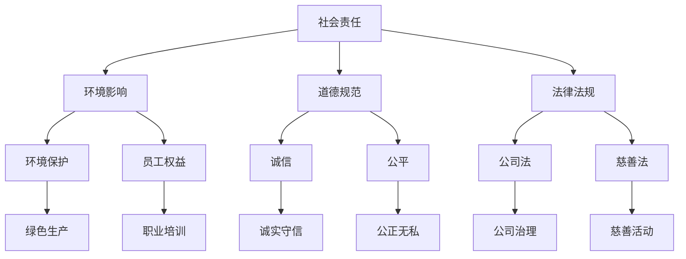

#### 核心算法原理讲解

在新媒体时代，企业和社会组织责任的履行可以通过智能算法来辅助实现。以下是企业与社会组织责任的核心算法原理的伪代码：

```python
# 定义企业社会责任模型
class CorporateSocialResponsibilityModel:
    def __init__(self):
        self.projects = []

    def add_project(self, project):
        self.projects.append(project)

    def evaluate_project(self, project, criteria):
        score = 0
        for criterion in criteria:
            if criterion in project:
                score += 1
        return score / len(criteria)

# 定义企业道德行为评估算法
def evaluate_moral_behavior(behavior, criteria):
    score = 0
    for criterion in criteria:
        if criterion in behavior:
            score += 1
    return score / len(criteria)

# 示例：企业社会责任评估
csr_model = CorporateSocialResponsibilityModel()
csr_model.add_project({
    'project_name': '环保项目',
    'performance': {
        '减少碳排放': '成功',
        '废物回收率': '提高',
        '环保培训': '完成'
    }
})
evaluation_criteria = ['减少碳排放', '废物回收率', '环保培训']
evaluation_score = csr_model.evaluate_project(csr_model.projects[0], evaluation_criteria)
print("企业社会责任评估得分：", evaluation_score)

# 示例：企业道德行为评估
behavior_criteria = ['诚信', '公平', '尊重他人']
behavior = "我们公司始终坚持诚信经营，尊重员工权益，公平对待合作伙伴。"
behavior_score = evaluate_moral_behavior(behavior, behavior_criteria)
print("企业道德行为评估得分：", behavior_score)
```

#### 数学模型和公式

在评估企业与社会组织责任时，可以使用加权总分模型。一个简单的模型可以是：

$$
ResponsibilityScore = \sum_{i=1}^{n} w_i \cdot p_i
$$

其中，$ResponsibilityScore$ 表示责任评分，$w_i$ 表示第 $i$ 个指标的重要性权重，$p_i$ 表示第 $i$ 个指标的绩效。

#### 举例说明

假设有四个社会责任指标，每个指标的权重分别为0.2、0.3、0.2和0.3，绩效分别为达标、达标、未达标和达标，那么社会责任得分为：

$$
ResponsibilityScore = 0.2 \cdot 1 + 0.3 \cdot 1 + 0.2 \cdot 0 + 0.3 \cdot 1 = 0.8
$$

这意味着企业的社会责任履行情况较好。

### 6.3 社会责任的实施与评估

#### 核心概念与联系

社会责任的实施与评估是指企业、组织或个人在履行社会责任过程中，通过制定计划、执行措施和评估效果，确保社会责任得到有效落实的过程。核心概念包括：

1. **社会责任计划**：社会责任的实施始于制定详细的计划，包括目标设定、策略制定和资源分配等。
2. **社会责任执行**：在计划的基础上，通过具体的行动和措施，将社会责任理念转化为实际行动。
3. **社会责任评估**：通过定期评估社会责任的实施效果，确保责任目标的达成，并根据评估结果进行调整和优化。

为了更好地理解这些概念之间的联系，我们可以使用Mermaid流程图来描述：

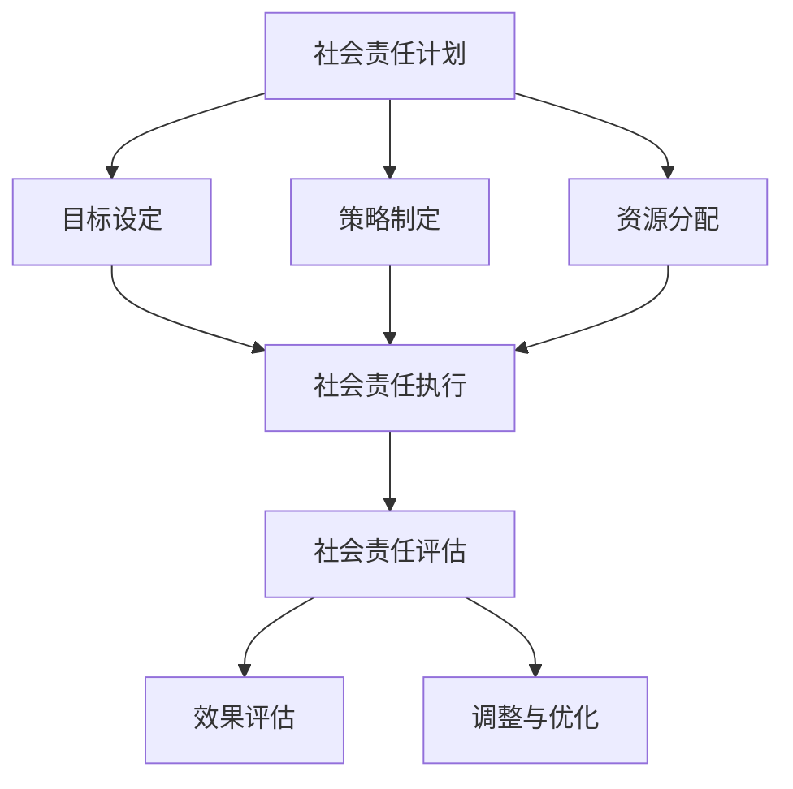

#### 核心算法原理讲解

社会责任的实施与评估可以通过智能算法来辅助实现。以下是社会责任实施与评估的核心算法原理的伪代码：

```python
# 定义社会责任评估模型
class SocialResponsibilityModel:
    def __init__(self):
        self.projects = []

    def add_project(self, project):
        self.projects.append(project)

    def evaluate_project(self, project, criteria):
        score = 0
        for criterion in criteria:
            if criterion in project:
                score += 1
        return score / len(criteria)

# 定义社会责任评估算法
def evaluate_responsibility_score(projects, criteria):
    total_score = 0
    for project in projects:
        total_score += evaluate_project(project, criteria)
    return total_score / len(projects)

# 示例：社会责任评估
projects = [
    {
        'project_name': '环保项目',
        'performance': {
            '减少碳排放': '成功',
            '废物回收率': '提高',
            '环保培训': '完成'
        }
    },
    {
        'project_name': '公益捐赠',
        'performance': {
            '捐款金额': '达标',
            '受助人数': '增加',
            '项目覆盖': '扩大'
        }
    }
]
evaluation_criteria = ['减少碳排放', '废物回收率', '环保培训', '捐款金额', '受助人数', '项目覆盖']
total_score = evaluate_responsibility_score(projects, evaluation_criteria)
print("社会责任总体评估得分：", total_score)
```

#### 数学模型和公式

社会责任的评估可以通过加权总分模型来实现。一个简单的模型可以是：

$$
ResponsibilityScore = \sum_{i=1}^{n} w_i \cdot p_i
$$

其中，$ResponsibilityScore$ 表示责任评分，$w_i$ 表示第 $i$ 个指标的重要性权重，$p_i$ 表示第 $i$ 个指标的绩效。

#### 举例说明

假设有四个社会责任指标，每个指标的权重分别为0.3、0.2、0.2和0.3，绩效分别为达标、未达标、达标和达标，那么社会责任得分为：

$$
ResponsibilityScore = 0.3 \cdot 1 + 0.2 \cdot 0 + 0.2 \cdot 1 + 0.3 \cdot 1 = 0.8
$$

这意味着企业的社会责任履行情况较好。

### 7.1 新媒体表达伦理的发展趋势

#### 背景介绍

新媒体表达伦理的发展趋势受到技术进步、社会变革和法律规范的共同推动。随着人工智能、大数据和区块链等新兴技术的应用，新媒体表达伦理面临新的挑战和机遇。以下是新媒体表达伦理的几个主要发展趋势。

#### 技术进步推动伦理创新

1. **人工智能**：人工智能在内容审核、虚假信息检测和个性化推荐等方面发挥了重要作用，但也引发了算法歧视和隐私保护等问题。未来，如何在保障言论自由的同时，确保技术应用的公平性和透明性，将成为重要课题。
2. **大数据**：大数据技术的广泛应用使得个人行为和偏好数据被大量收集和分析，这为个性化内容推荐提供了便利，但也引发了数据滥用和隐私泄露的风险。如何在保护用户隐私的前提下，合理利用大数据，是新媒体表达伦理的重要问题。
3. **区块链**：区块链技术为新媒体内容创作和传播提供了去中心化和透明化的解决方案，有助于解决版权纠纷和信任问题。然而，区块链的普及也带来了数据隐私和网络安全等新挑战。

#### 社会变革影响伦理观念

1. **多元化与包容性**：社会多元化趋势使得不同文化和观点的碰撞和融合日益频繁，新媒体平台需要更加注重包容性和多元性，避免歧视和偏见。
2. **道德觉醒与责任感**：随着公众对社会责任和道德问题的关注增加，新媒体平台和个人用户越来越重视言论对社会的影响，更加倾向于采取负责任的言行。
3. **公众参与与监督**：新媒体平台用户参与度和互动性不断提高，公众对信息真实性和公正性的要求也日益增强，这促使平台加强自律和透明度。

#### 法律规范引导伦理发展

1. **法律完善与执行**：各国纷纷出台相关法律法规，加强对新媒体表达伦理的规范和监管，如《数字服务法案》、《网络安全法》等。未来，如何更好地执行这些法律，提高法律的有效性和执行力，是一个重要挑战。
2. **跨国家合作**：随着互联网的全球化，跨国家合作在维护新媒体表达伦理方面变得尤为重要。国际社会需要共同努力，制定统一的伦理标准和法律规范，共同应对跨国信息传播中的伦理问题。
3. **伦理教育与培训**：加强伦理教育和培训，提高新媒体平台运营者、内容创作者和用户的法律意识和道德水平，是维护新媒体表达伦理的重要手段。

#### 发展趋势分析

1. **技术伦理**：随着技术的进步，新媒体表达伦理将更加关注技术应用的伦理问题，如算法公平性、数据隐私保护、人工智能道德边界等。
2. **伦理多元化**：社会多元化和包容性的趋势将推动新媒体表达伦理向更加多元和包容的方向发展。
3. **伦理法规化**：法律规范将在新媒体表达伦理发展中发挥越来越重要的作用，促使伦理规范从自律走向法规化。
4. **公众参与与监督**：公众在新媒体表达伦理中的参与度和监督作用将日益增强，推动新媒体平台更加透明和负责任。

### 7.2 技术与伦理的平衡

#### 核心概念与联系

技术与伦理的平衡是指在新媒体时代，如何在技术进步和伦理规范之间找到最佳平衡点，以实现言论自由和社会责任的和谐统一。核心概念包括：

1. **技术优势**：技术进步为新媒

### 7.3 社会责任与言论自由的未来

#### 核心概念与联系

社会责任与言论自由的未来涉及多个核心概念，包括：

1. **社会责任**：企业、组织和个人在行使言论自由时，需要承担的对社会和环境的影响责任。
2. **言论自由**：个人或集体在法律允许的范围内，有表达意见、观点和想法的权利。
3. **伦理规范**：社会对言论自由和社会责任的基本要求，包括道德、法律和社会价值观。
4. **技术创新**：新兴技术在言论自由和社会责任中的应用，如人工智能、大数据和区块链等。

为了更好地理解这些概念之间的联系，我们可以使用Mermaid流程图来描述：

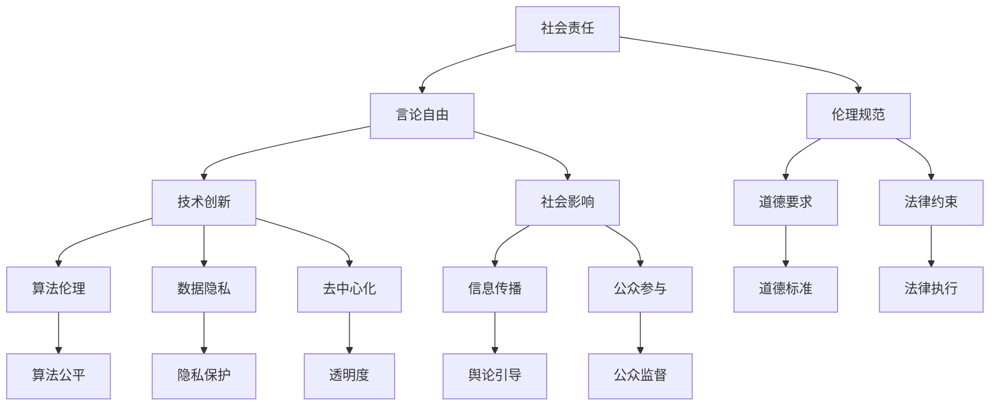

#### 核心算法原理讲解

社会责任与言论自由的未来需要依赖智能算法来辅助实现。以下是社会责任与言论自由未来发展的核心算法原理的伪代码：

```python
# 定义社会责任与言论自由评估模型
class ResponsibilityFreedomModel:
    def __init__(self):
        self.speeches = []
        self.evaluations = []

    def add_speech(self, speech):
        self.speeches.append(speech)

    def evaluate_speech(self, speech, criteria):
        score = 0
        for criterion in criteria:
            if criterion in speech:
                score += 1
        self.evaluations.append(score / len(criteria))
        return self.evaluations[-1]

# 定义言论自由与社会责任平衡算法
def balance_freedom_and_responsibility(freedom_model, responsibility_model, criteria):
    freedom_scores = [evaluation for evaluation in freedom_model.evaluations]
    responsibility_scores = [evaluation for evaluation in responsibility_model.evaluations]
    balance_score = sum(freedom_scores) / sum(responsibility_scores)
    return balance_score

# 示例：社会责任与言论自由评估
responsibility_freedom_model = ResponsibilityFreedomModel()
speeches = ["我支持环保政策。", "我反对当前的税收政策。"]
evaluation_criteria = ["社会责任", "道德规范", "法律约束"]
for speech in speeches:
    responsibility_freedom_model.add_speech(speech)
    responsibility_freedom_model.evaluate_speech(speech, evaluation_criteria)

balance_score = balance_freedom_and_responsibility(responsibility_freedom_model, evaluation_criteria)
print("社会责任与言论自由平衡评分：", balance_score)
```

#### 数学模型和公式

社会责任与言论自由的平衡可以通过综合评分模型来评估。一个简单的模型可以是：

$$
BalanceScore = \frac{F + R}{2}
$$

其中，$BalanceScore$ 表示平衡评分，$F$ 表示言论自由度评分，$R$ 表示社会责任度评分。

#### 举例说明

假设言论自由度评分为0.7，社会责任度评分为0.6，那么平衡评分为：

$$
BalanceScore = \frac{0.7 + 0.6}{2} = 0.65
$$

这意味着言论自由与社会责任的平衡状态为中等水平。

### 7.4 总结与展望

本文从新媒体表达伦理的角度，探讨了言论自由与社会责任的平衡问题。我们分析了新媒体时代的特点，阐述了言论自由与社会责任的核心概念和辩证关系，并深入探讨了新媒体表达伦理的问题，如虚假信息、网络暴力、仇恨言论和色情暴力内容的处理。

通过国内外案例的分析，我们看到了法律、政策和平台监管在维护新媒体表达伦理中的重要性。同时，个人和企业在新媒体时代承担的责任也受到广泛关注。我们提出了社会责任的实施与评估方法，并探讨了新媒体表达伦理的发展趋势和未来方向。

总结而言，新媒体表达伦理的平衡是实现言论自由与社会责任的和谐统一的关键。我们需要在技术进步、社会变革和法律规范的共同推动下，不断完善伦理规范，加强平台监管，提高个人和企业的社会责任意识，共同营造一个健康、和谐的新媒体环境。

展望未来，随着人工智能、大数据和区块链等新兴技术的不断发展，新媒体表达伦理将面临新的挑战和机遇。我们需要不断探索和创新，寻找技术与伦理的平衡点，推动新媒体表达伦理的持续发展。同时，加强跨国家合作和国际交流，共同应对跨国信息传播中的伦理问题，共同维护全球网络空间的和谐与稳定。

让我们共同努力，为构建一个公平、公正、透明的新媒体环境贡献自己的力量。

