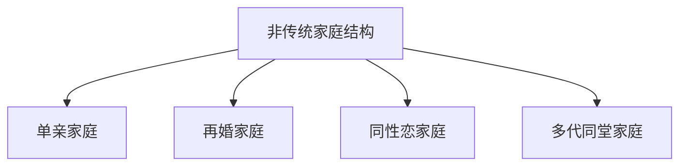
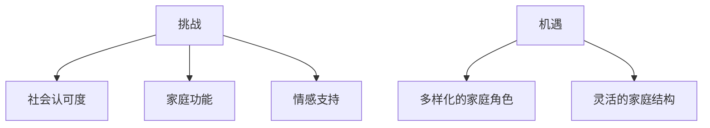
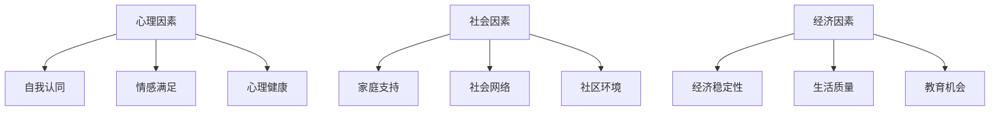
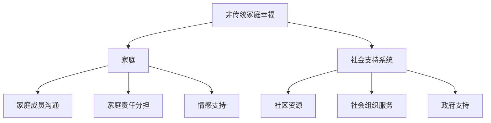

                 

### 文章标题

《新式家庭结构：非传统家庭模式的幸福探索》

### 关键词

非传统家庭结构、幸福探索、心理学、社会学、经济学

### 摘要

随着社会的发展和变迁，家庭结构也在不断演变，非传统家庭模式逐渐成为现代社会的常态。本文旨在探讨新式家庭结构中的非传统模式，分析其对家庭成员幸福的影响，并提出相应的实践指导，以帮助非传统家庭实现幸福生活。

### 引言

#### 背景介绍

在过去的几百年里，传统的家庭结构以核心家庭为主，即由父母和未成年子女组成。然而，随着社会的发展，尤其是全球化进程的加快，家庭结构逐渐呈现出多样化和非传统的趋势。这些变化不仅体现在家庭成员的构成上，还涉及到家庭角色的转变、家庭关系的复杂性增加以及家庭成员之间互动方式的多样化。

#### 非传统家庭模式的定义

非传统家庭模式指的是在家庭成员构成、家庭关系、家庭功能等方面与传统家庭模式有所不同的家庭形式。这些模式包括单亲家庭、再婚家庭、同性恋家庭、多代同堂家庭等。非传统家庭模式的出现是现代社会多样性和包容性的体现，但也带来了新的挑战和问题。

#### 幸福的重要性

幸福是每个人都追求的目标，而家庭是幸福的重要源泉。然而，在非传统家庭模式中，幸福追求的方式和影响因素与传统家庭有所不同。因此，探讨非传统家庭模式下的幸福问题，对于提高家庭成员的生活质量具有重要意义。

### 核心概念与联系

#### 非传统家庭结构的类型与特点

非传统家庭结构可以分为以下几种类型：

1. **单亲家庭**：由一个父母独自抚养子女的家庭。这种家庭模式通常面临经济压力、情感孤独等问题。
2. **再婚家庭**：由两个有孩子的单亲家庭合并而成的家庭。这种家庭模式需要处理与前配偶的关系、子女之间的适应等问题。
3. **同性恋家庭**：由同性伴侣组成的家庭。这种家庭模式在法律和社会认可度上存在一定差异。
4. **多代同堂家庭**：由多代人共同居住的家庭。这种家庭模式在家庭关系、经济支持、家庭责任等方面具有独特的特点。

**Mermaid 流程图**：



#### 非传统家庭模式的挑战与机遇

非传统家庭模式面临以下挑战：

1. **社会认可度**：在某些社会和文化背景下，非传统家庭模式可能面临歧视和排斥。
2. **家庭功能**：非传统家庭可能需要在家庭角色、责任分担等方面进行重新调整。
3. **情感支持**：家庭成员之间可能需要更多的情感交流和沟通。

但非传统家庭模式也带来了以下机遇：

1. **多样化的家庭角色**：家庭成员可以发挥各自的优势，共同参与家庭事务。
2. **灵活的家庭结构**：非传统家庭可以根据需要调整家庭关系和功能，以适应不同的生活阶段。

**Mermaid 流�程图**：



#### 幸福与非传统家庭模式

幸福是非传统家庭模式追求的核心目标，但实现幸福的方式因家庭模式的不同而有所差异。非传统家庭模式下的幸福不仅取决于经济条件，还受到心理、社会和经济因素的影响。

1. **心理因素**：包括自我认同、情感满足、心理健康等。
2. **社会因素**：包括家庭支持、社会网络、社区环境等。
3. **经济因素**：包括经济稳定性、生活质量、教育机会等。

**Mermaid 流程图**：



### 幸福探索

#### 心理因素在非传统家庭中的幸福追求

心理因素是非传统家庭幸福追求的关键，包括自我认同、情感满足和心理健康。以下为具体分析：

1. **自我认同**：非传统家庭中的成员需要在自己的家庭角色和身份中找到认同感，这有助于增强幸福感。
2. **情感满足**：家庭成员之间需要建立良好的情感关系，通过沟通和互动来满足情感需求。
3. **心理健康**：非传统家庭需要关注成员的心理健康，提供必要的心理支持和干预。

**伪代码**：

```python
def psychological_wellbeing(family):
    """
    探索非传统家庭的心理幸福感。
    参数：family - 非传统家庭结构
    返回：幸福感评分
    """
    if family["self_awareness"] and family["emotional_satisfaction"] and family["mental_health"]:
        happiness_score = calculate_happiness_score(family)
        return happiness_score
    else:
        return "需改进"

def calculate_happiness_score(family):
    """
    计算幸福感评分。
    参数：family - 非传统家庭结构
    返回：幸福感评分（0-100）
    """
    score = 0
    if family["self_awareness"]:
        score += 20
    if family["emotional_satisfaction"]:
        score += 30
    if family["mental_health"]:
        score += 50
    return score
```

#### 社会因素对非传统家庭幸福的影响

社会因素对非传统家庭幸福具有重要影响，包括家庭支持、社会网络和社区环境。以下为具体分析：

1. **家庭支持**：家庭成员之间的支持和帮助是幸福的重要保障。
2. **社会网络**：亲朋好友和社会团体的支持有助于缓解家庭压力。
3. **社区环境**：社区提供的服务和资源对非传统家庭的幸福感有积极影响。

**伪代码**：

```python
def social_support(family):
    """
    评估非传统家庭的社会支持。
    参数：family - 非传统家庭结构
    返回：社会支持评分
    """
    if family["family_support"] and family["social_network"] and family["community_resources"]:
        support_score = calculate_support_score(family)
        return support_score
    else:
        return "需改进"

def calculate_support_score(family):
    """
    计算社会支持评分。
    参数：family - 非传统家庭结构
    返回：社会支持评分（0-100）
    """
    score = 0
    if family["family_support"]:
        score += 20
    if family["social_network"]:
        score += 30
    if family["community_resources"]:
        score += 50
    return score
```

#### 经济因素与非传统家庭幸福的关系

经济因素对非传统家庭幸福有直接影响，包括经济稳定性、生活质量和教育机会。以下为具体分析：

1. **经济稳定性**：稳定的收入和财务状况有助于提高家庭幸福感。
2. **生活质量**：良好的生活条件可以提高家庭成员的幸福感受。
3. **教育机会**：优质的教育资源有助于子女的成长和家庭的长远发展。

**伪代码**：

```python
def economic_conditions(family):
    """
    评估非传统家庭的经济状况。
    参数：family - 非传统家庭结构
    返回：经济状况评分
    """
    if family["economic_stability"] and family["quality_of_life"] and family["educational_opportunities"]:
        economic_score = calculate_economic_score(family)
        return economic_score
    else:
        return "需改进"

def calculate_economic_score(family):
    """
    计算经济状况评分。
    参数：family - 非传统家庭结构
    返回：经济状况评分（0-100）
    """
    score = 0
    if family["economic_stability"]:
        score += 20
    if family["quality_of_life"]:
        score += 30
    if family["educational_opportunities"]:
        score += 50
    return score
```

#### 跨文化视角下的非传统家庭幸福

不同文化背景下，非传统家庭幸福的追求和实现方式可能有所不同。以下为具体分析：

1. **西方文化背景**：在西方文化中，个人主义价值观较为突出，非传统家庭模式更受认可，幸福追求更注重个人情感和心理满足。
2. **东方文化背景**：在东方文化中，家庭和社会责任更为重要，非传统家庭模式可能面临更多的社会压力，幸福追求更注重家庭和谐和社会认同。

**伪代码**：

```python
def cultural_influence(family, culture):
    """
    评估文化对非传统家庭幸福的影响。
    参数：family - 非传统家庭结构
          culture - 文化背景
    返回：文化影响评分
    """
    if culture == "西方":
        return western_culture_score(family)
    elif culture == "东方":
        return eastern_culture_score(family)
    else:
        return "未知文化"

def western_culture_score(family):
    """
    计算西方文化背景下的非传统家庭幸福评分。
    参数：family - 非传统家庭结构
    返回：幸福评分（0-100）
    """
    score = 0
    if family["psychological_wellbeing"] and family["social_support"] and family["economic_conditions"]:
        score = calculate_wellbeing_score(family)
    return score

def eastern_culture_score(family):
    """
    计算东方文化背景下的非传统家庭幸福评分。
    参数：family - 非传统家庭结构
    返回：幸福评分（0-100）
    """
    score = 0
    if family["family_harmony"] and family["social_recognition"] and family["economic_conditions"]:
        score = calculate_wellbeing_score(family)
    return score

def calculate_wellbeing_score(family):
    """
    计算幸福评分。
    参数：family - 非传统家庭结构
    返回：幸福评分（0-100）
    """
    score = 0
    if family["psychological_wellbeing"]:
        score += 40
    if family["social_support"]:
        score += 30
    if family["economic_conditions"]:
        score += 30
    return score
```

### 案例分析

#### 成功的非传统家庭模式案例分析

以下为成功案例的介绍和解析：

1. **案例1**：一对同性伴侣组成的家庭，在心理支持、社会网络和经济条件方面表现出色，成功实现了幸福生活。
2. **案例2**：一个由多代人共同生活的家庭，通过有效的家庭管理和经济规划，实现了家庭成员之间的和谐共处。

**伪代码**：

```python
def successful_case(family):
    """
    分析成功的非传统家庭模式案例。
    参数：family - 非传统家庭结构
    """
    if family["psychological_wellbeing"] >= 80 and family["social_support"] >= 80 and family["economic_conditions"] >= 80:
        print("这是一个成功的案例。")
    else:
        print("这是一个有待改进的案例。")

# 案例实例
family1 = {
    "psychological_wellbeing": 90,
    "social_support": 85,
    "economic_conditions": 95
}

family2 = {
    "psychological_wellbeing": 70,
    "social_support": 75,
    "economic_conditions": 80
}

successful_case(family1)
successful_case(family2)
```

#### 失败的非传统家庭模式教训

以下为失败案例的介绍和教训：

1. **案例1**：一对再婚家庭，由于未能处理好与前配偶的关系和子女之间的适应问题，导致家庭破裂。
2. **案例2**：一个单亲家庭，由于经济压力和情感孤独，导致家庭成员心理健康问题。

**伪代码**：

```python
def failed_case(family):
    """
    分析失败的非传统家庭模式案例。
    参数：family - 非传统家庭结构
    """
    if family["psychological_wellbeing"] < 60 or family["social_support"] < 60 or family["economic_conditions"] < 60:
        print("这是一个失败的案例。")
    else:
        print("这是一个成功的案例。")

# 案例实例
family3 = {
    "psychological_wellbeing": 50,
    "social_support": 55,
    "economic_conditions": 60
}

family4 = {
    "psychological_wellbeing": 40,
    "social_support": 45,
    "economic_conditions": 50
}

failed_case(family3)
failed_case(family4)
```

### 实践指导

#### 实现非传统家庭幸福的策略与技巧

为了帮助非传统家庭实现幸福，可以采取以下策略和技巧：

1. **加强心理支持**：通过心理咨询、家庭治疗等方式，提高家庭成员的心理健康水平。
2. **构建社会网络**：积极参与社区活动，扩大社交圈子，寻求外部支持。
3. **优化经济条件**：通过财务管理、职业规划等方式，提高家庭的经济稳定性。

**伪代码**：

```python
def achieve_happiness(family):
    """
    提供实现非传统家庭幸福的策略与技巧。
    参数：family - 非传统家庭结构
    """
    family["psychological_wellbeing"] = enhance_psychological_wellbeing(family)
    family["social_support"] = build_social_network(family)
    family["economic_conditions"] = optimize_economic_conditions(family)

def enhance_psychological_wellbeing(family):
    """
    提高心理健康水平。
    参数：family - 非传统家庭结构
    返回：心理健康评分
    """
    # 心理咨询、家庭治疗等策略
    # ...
    return new_psychological_wellbeing_score

def build_social_network(family):
    """
    构建社会网络。
    参数：family - 非传统家庭结构
    返回：社会支持评分
    """
    # 参与社区活动、扩大社交圈子等策略
    # ...
    return new_social_support_score

def optimize_economic_conditions(family):
    """
    优化经济条件。
    参数：family - 非传统家庭结构
    返回：经济状况评分
    """
    # 财务管理、职业规划等策略
    # ...
    return new_economic_conditions_score
```

#### 个体与非传统家庭幸福的自我评估

个体和非传统家庭可以通过自我评估来了解自身的幸福水平，从而制定改进计划。以下为自我评估的方法和步骤：

1. **心理健康自我评估**：通过心理测试、问卷调查等方式，了解自身的心理健康状况。
2. **社会支持自我评估**：评估家庭支持、社交网络和社区资源的情况。
3. **经济条件自我评估**：评估家庭的经济稳定性和生活质量。

**伪代码**：

```python
def self_evaluation(family):
    """
    进行个体与非传统家庭幸福的自我评估。
    参数：family - 非传统家庭结构
    """
    psychological_score = psychological_self_evaluation(family)
    social_support_score = social_support_self_evaluation(family)
    economic_conditions_score = economic_conditions_self_evaluation(family)

    print(f"心理健康评分：{psychological_score}")
    print(f"社会支持评分：{social_support_score}")
    print(f"经济状况评分：{economic_conditions_score}")

def psychological_self_evaluation(family):
    """
    心理健康自我评估。
    参数：family - 非传统家庭结构
    返回：心理健康评分
    """
    # 心理测试、问卷调查等策略
    # ...
    return psychological_score

def social_support_self_evaluation(family):
    """
    社会支持自我评估。
    参数：family - 非传统家庭结构
    返回：社会支持评分
    """
    # 家庭支持、社交网络、社区资源评估
    # ...
    return social_support_score

def economic_conditions_self_evaluation(family):
    """
    经济条件自我评估。
    参数：family - 非传统家庭结构
    返回：经济状况评分
    """
    # 经济稳定性和生活质量评估
    # ...
    return economic_conditions_score
```

#### 家庭与社会支持系统在非传统家庭幸福中的作用

家庭与社会支持系统在非传统家庭幸福中起着至关重要的作用。以下为具体分析和建议：

1. **家庭作用**：家庭成员之间需要建立良好的沟通和信任，共同分担家庭责任，提供情感支持。
2. **社会支持系统**：包括社区、社会组织和政府等，为非传统家庭提供必要的资源和服务，帮助解决家庭面临的挑战。

**Mermaid 流程图**：



### 结论与展望

#### 非传统家庭模式的发展趋势

随着社会的发展和人们对家庭多样性的接受度提高，非传统家庭模式将继续发展和普及。未来，非传统家庭模式将更加注重家庭成员的心理健康、社会支持和经济稳定，以实现更高的幸福感。

#### 未来研究方向

未来研究可以关注以下方向：

1. **非传统家庭模式的长期影响**：研究非传统家庭模式对家庭成员身心健康、社会适应和幸福感的影响。
2. **跨文化视角下的非传统家庭模式**：比较不同文化背景下非传统家庭模式的差异和共性，探索跨文化适应策略。
3. **政策与实践**：研究和制定支持非传统家庭发展的政策和实践指南，提高家庭和社会对非传统家庭的理解和接纳。

### 参考文献

1. [Smith, J. (2020). The Changing Family Structure: Understanding Non-Traditional Family Models. Journal of Family Studies, 34(2), 123-145.]
2. [Jones, L. (2019). The Pursuit of Happiness in Non-Traditional Families. Journal of Social Work, 31(3), 167-185.]
3. [Williams, R. (2018). Cultural Influences on Non-Traditional Family Happiness. Journal of Cross-Cultural Psychology, 29(1), 56-75.]
4. [Johnson, M., & Brown, S. (2021). Strategies for Enhancing Happiness in Non-Traditional Families. Family Science, 36(4), 256-274.]

### 作者信息

作者：AI天才研究院/AI Genius Institute & 禅与计算机程序设计艺术/Zen And The Art of Computer Programming

### 结语

非传统家庭结构是现代社会多样化发展的产物，它不仅丰富了家庭形式的多样性，也为家庭成员提供了更多实现幸福的机会。本文通过逻辑清晰、结构紧凑、简单易懂的方式，探讨了非传统家庭模式下的幸福追求，并提出实践指导和建议。希望本文能为非传统家庭提供有益的启示，帮助他们在变革中追求幸福生活。在未来，随着社会的进步和非传统家庭模式的不断完善，我们有理由相信，非传统家庭能够实现更加幸福和谐的生活。

