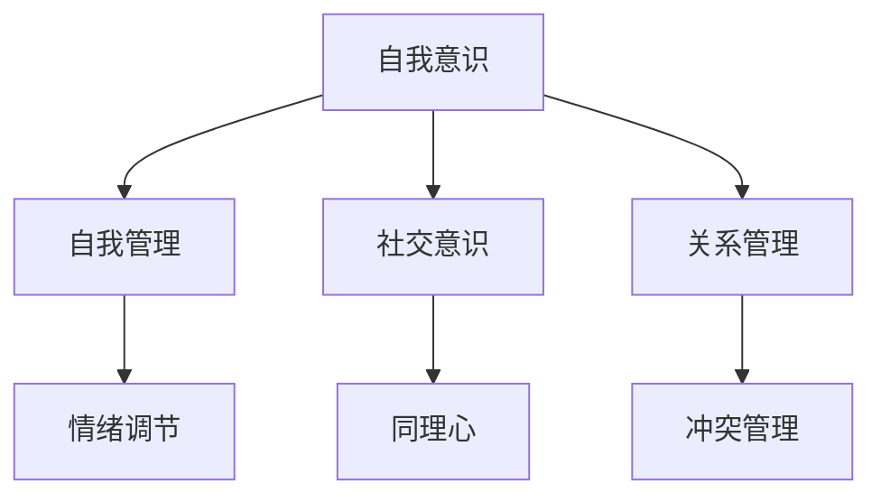
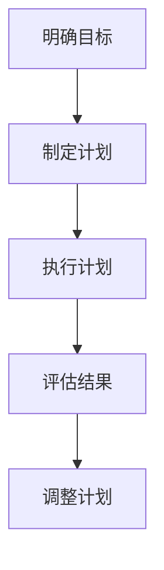

                 


### 标题：新时代的成长定义：从外在成就到内在觉醒

#### 关键词：
- 成长
- 外在成就
- 内在觉醒
- 新时代

#### 摘要：
本文旨在探讨新时代背景下的成长定义，从外在成就向内在觉醒的转变。通过分析社会环境、个人追求和科技发展对成长需求的影响，本文揭示了成长的多维度需求和多元化路径，并探讨了外在成就与内在觉醒之间的关系。

## 引言

在当今快速变化的世界中，成长成为一个永恒的主题。然而，随着社会环境和价值观的变迁，成长的定义也在不断演变。传统的成长观念通常侧重于外在成就，如教育水平、职业成就和社会地位。然而，随着个人自我意识的提高和对内心需求的重视，内在觉醒成为新时代成长的另一个重要维度。

本文将首先介绍新时代背景下的成长需求，包括教育、职业、社交、心理健康和自我认知等方面的需求。接着，我们将探讨成长从外在成就到内在觉醒的转变，并详细分析外在成就与内在觉醒之间的联系。最后，本文将讨论成长的多元化路径，探讨如何在现代社会中实现全面成长。

## 第1章：成长的定义与演变

### 1.1 新时代背景下的成长需求

在新时代背景下，成长的需求变得更加多元化。首先，教育成为个人成长的重要基石。随着全球化和信息化的推进，个体需要不断学习新知识和技能，以适应快速变化的工作环境和市场需求。教育体系在这一过程中发挥着关键作用，为个人提供知识、技能和思维方式。

职业发展也是成长的重要方面。在现代社会中，职业成就不再仅仅取决于职位的高低，还包括职业满意度、工作与生活的平衡以及职业发展的可持续性。个体在职业发展过程中，需要不断提升自身的技能和经验，以实现自我价值和职业成就。

社交网络和人际关系的建设也是新时代成长的关键因素。在信息时代，社交网络成为人们交流、分享和获取资源的重要渠道。建立广泛的人际关系有助于个人在职业和个人生活中取得成功。此外，心理健康和自我认知也日益受到重视。个体需要学会管理自己的情绪，增强心理韧性，以及正确认识自己，以实现内心的和谐与成长。

### 1.2 成长从外在成就到内在觉醒的转变

外在成就一直是社会评价个人价值的重要标准。然而，随着个体自我意识的提升和对内心需求的关注，内在觉醒逐渐成为成长的新方向。内在觉醒强调个体在精神、情感和认知层面的自我提升，追求内心的平和与满足。

外在成就与内在觉醒之间存在紧密的联系。一方面，外在成就可以为个体提供物质基础和社会地位，从而为内在觉醒提供条件。另一方面，内在觉醒可以增强个体的心理韧性，使其在面对外在挑战时保持平衡和冷静。

然而，外在成就与内在觉醒也存在矛盾。过分追求外在成就可能导致个体忽视内心的需求，产生焦虑和压力。因此，实现外在成就与内在觉醒的平衡是新时代成长的关键。

### 1.3 成长的多元化路径

成长不再是单一维度的追求，而是一个多元化、综合性的过程。不同个体在不同阶段可能有不同的成长需求，因此成长路径也各不相同。

教育是个人成长的基础。通过不断学习和积累知识，个体可以提升自身的综合素质和竞争力。职业发展是实现个人价值的重要途径。在职业发展过程中，个体需要不断学习新技能、积累经验，以实现职业晋升和自我价值的实现。

社交网络和人际关系的建设也是成长的重要组成部分。个体需要学会与他人沟通、合作和建立信任，以在职业和生活中取得成功。心理健康和自我认知的提升是成长的重要保障。个体需要关注自己的心理健康，学会管理情绪，以及正确认识自己，以实现内心的和谐与成长。

## 第2章：外在成就的成长要素

### 2.1 教育体系与成就成长

教育体系是个人成长的重要基石。在现代社会中，教育不仅提供知识，还培养思维能力、批判精神和创新能力。以下是一个简化的教育体系对个人成长影响的流程图：

```
graph TD
    A[启蒙教育] --> B[基础教育];
    B --> C[职业教育];
    C --> D[高等教育];
    D --> E[终身学习];
```

- **启蒙教育**：为个体奠定基础知识，培养基本技能和价值观。
- **基础教育**：进一步深化知识体系，培养批判思维和解决问题的能力。
- **职业教育**：针对特定行业，提供专业知识和技能培训。
- **高等教育**：深入研究某一领域，培养学术研究和创新能力。
- **终身学习**：适应快速变化的社会，不断更新知识和技能。

### 2.2 职业发展与成就追求

职业发展是实现个人价值的重要途径。职业成就不仅取决于个人的专业技能，还取决于职业满意度、工作与生活的平衡以及职业发展的可持续性。以下是一个简化的职业发展流程：

```
graph TD
    A[职业选择] --> B[技能提升];
    B --> C[职业晋升];
    C --> D[职业满意度];
    D --> E[职业发展];
```

- **职业选择**：根据个人兴趣和市场需求，选择适合自己的职业道路。
- **技能提升**：通过不断学习和实践，提升专业技能和综合素质。
- **职业晋升**：通过工作表现和职业素养，实现职业晋升和职位提升。
- **职业满意度**：工作与个人价值观、兴趣相契合，提高职业满意度。
- **职业发展**：在职业生涯中不断探索新的机会和挑战，实现职业发展。

### 2.3 社交网络与成就展示

社交网络和成就展示在新时代成长中发挥着越来越重要的作用。以下是一个简化的社交网络对成就展示影响的流程图：

```
graph TD
    A[社交网络建设] --> B[成就展示];
    B --> C[社交影响力];
    C --> D[社会认可];
```

- **社交网络建设**：建立广泛的人际关系，提高个人在社交网络中的影响力。
- **成就展示**：通过社交媒体等平台展示个人成就，提升个人品牌价值。
- **社交影响力**：个人在社交网络中的影响力，影响他人的观点和行为。
- **社会认可**：个人在社交网络中的成就得到社会的认可和赞誉，进一步推动个人成长。

## 第3章：内在觉醒的成长要素

### 3.1 自我认知与内心成长

自我认知是内在觉醒的基础。个体需要深入思考自己的价值观、兴趣、优势和不足，以实现内心的成长。以下是一个简化的自我认知与内心成长流程：

```
graph TD
    A[自我反思] --> B[自我认知];
    B --> C[内心成长];
```

- **自我反思**：通过回顾过去的经历，分析自己的行为和决策，识别自己的优点和不足。
- **自我认知**：深入了解自己的价值观、兴趣和目标，明确自己的定位和方向。
- **内心成长**：在自我认知的基础上，通过持续的学习、实践和反思，提升内心的成熟度和智慧。

### 3.2 情感管理与心理健康

情感管理是内在觉醒的重要组成部分。个体需要学会识别、表达和调节自己的情绪，以保持心理健康。以下是一个简化的情感管理与心理健康流程：

```
graph TD
    A[情绪识别] --> B[情绪表达];
    B --> C[情绪调节];
    C --> D[心理健康];
```

- **情绪识别**：通过自我观察和反馈，识别自己的情绪状态。
- **情绪表达**：通过合适的渠道和方式，表达自己的情绪和感受。
- **情绪调节**：通过调整行为和思维方式，控制情绪的强度和频率。
- **心理健康**：在情绪管理和调节的基础上，保持心理平衡和健康。

### 3.3 内在力量的培养

内在力量是内在觉醒的重要支撑。个体需要培养坚韧、自律和洞察力，以应对生活中的各种挑战。以下是一个简化的内在力量培养流程：

```
graph TD
    A[自我挑战] --> B[坚韧培养];
    B --> C[自律养成];
    C --> D[洞察力提升];
```

- **自我挑战**：通过设定目标和挑战自己，锻炼内在的坚韧和毅力。
- **坚韧培养**：在面对困难和挫折时，保持积极的态度和坚定的信念。
- **自律养成**：通过制定计划和规律的生活，培养自律的习惯和能力。
- **洞察力提升**：通过深入思考和反思，提升对自我和环境的洞察力。

## 第4章：外在成就与内在觉醒的平衡

### 4.1 成长过程中的矛盾与挑战

在成长过程中，外在成就与内在觉醒之间往往存在矛盾和挑战。一方面，过分追求外在成就可能导致个体忽视内心的需求，产生焦虑和压力。另一方面，过分强调内在觉醒可能导致个体脱离现实，缺乏实际的目标和动力。

以下是一个简化的外在成就与内在觉醒的矛盾与挑战流程：

```
graph TD
    A[外在成就追求] --> B[内心需求忽视];
    A --> C[焦虑和压力];
    B[内心需求忽视] --> D[内在觉醒追求];
    D --> E[脱离现实];
```

- **外在成就追求**：个体追求社会认可和物质财富，可能导致内心需求忽视。
- **内心需求忽视**：个体忽视内心的感受和需求，可能导致焦虑和压力。
- **内在觉醒追求**：个体追求内心的平和和自我实现，可能导致脱离现实和实际目标。
- **焦虑和压力**：内心需求和外在成就之间的矛盾，可能导致焦虑和压力。
- **脱离现实**：过分追求内在觉醒，可能导致个体忽视现实生活和实际目标。

### 4.2 外在成就与内在觉醒的相互促进

外在成就与内在觉醒并非完全对立，而是可以相互促进。外在成就可以为个体提供物质基础和社会地位，从而为内在觉醒创造条件。内在觉醒可以增强个体的心理韧性，使其在面对外在挑战时保持平衡和冷静。

以下是一个简化的外在成就与内在觉醒相互促进的流程：

```
graph TD
    A[外在成就] --> B[内在觉醒];
    B --> C[心理韧性];
    C --> D[外在成就提升];
```

- **外在成就**：通过职业发展和社交网络建设，实现个人的社会价值和物质财富。
- **内在觉醒**：通过自我认知、情感管理和内在力量培养，提升个体的心理素质和内心成长。
- **心理韧性**：在内外因素的作用下，个体具备更强的适应能力和抗压能力。
- **外在成就提升**：心理韧性的提升有助于个体在面对挑战时保持积极态度，进一步提升外在成就。

### 4.3 寻求平衡的实践方法

在成长过程中，寻求外在成就与内在觉醒的平衡至关重要。以下是一些实践方法，帮助个体在两者之间找到平衡：

- **时间管理**：合理规划时间，确保有足够的时间用于职业发展和个人成长。
- **情绪调节**：学会识别和表达情绪，保持心理平衡和健康。
- **自我反思**：定期进行自我反思，评估外在成就与内在觉醒之间的平衡状态。
- **内在力量培养**：通过锻炼、冥想和自我挑战，提升内在力量和心理韧性。
- **社交互动**：建立广泛的人际关系，获取他人的支持和反馈。

## 第5章：个人成长案例研究

### 5.1 成功人士的成长经历

成功人士的成长经历往往充满了挑战和转折点。以下是一个典型的成功人士成长经历案例：

- **A先生**：出生在一个普通家庭，从小对计算机编程感兴趣。在大学期间，他通过自学和参加编程竞赛，积累了丰富的实践经验。毕业后，他进入了一家知名互联网公司，开始了职业生涯。在工作中，他不断学习新技能，参与重要项目，最终成为公司的技术总监。

- **成长转折点**：在职业生涯初期，A先生遇到了技术瓶颈，感到焦虑和迷茫。然而，他通过自我反思和与同事交流，找到了解决问题的方法，并不断提升自己的技能。在一次重要项目中，他成功解决了技术难题，得到了领导的认可，成为公司技术团队的核心成员。

- **失败经验**：在职业生涯中，A先生也曾经历过失败。在一次产品发布中，他负责的技术部分出现了严重故障，导致项目推迟。面对失败，他主动承担责任，分析问题，并提出了改进方案。最终，他通过团队的努力，成功解决了问题，并从失败中汲取了宝贵的经验。

### 5.2 成长中的转折点与突破

成长中的转折点是推动个人发展的重要契机。以下是一些常见的转折点和突破方法：

- **职业晋升**：通过不断提升自己的能力和业绩，实现职业晋升。例如，通过参与重要项目、提出创新性方案或在团队中发挥领导作用。
- **技能提升**：通过学习和实践，提升自己的专业技能。例如，参加培训课程、阅读专业书籍或参与开源项目。
- **心态转变**：通过调整心态，面对挑战和困难。例如，学会自我激励、保持积极态度或寻求专业心理辅导。
- **人际关系**：通过建立广泛的人际关系，获取他人的支持和帮助。例如，参加行业会议、加入专业组织或与同事建立良好关系。

### 5.3 从失败中汲取成长经验

失败是成长过程中不可避免的一部分。以下是从失败中汲取成长经验的方法：

- **分析原因**：在失败发生后，要深入分析失败的原因，从多个角度审视问题。
- **学习经验**：将失败视为学习的机会，从失败中提取有价值的经验和教训。
- **改进方案**：在分析原因的基础上，提出改进方案，以防止类似问题再次发生。
- **心态调整**：保持积极的心态，面对失败，将其视为成长的过程。

## 第6章：成长的社会影响

### 6.1 成长对家庭的影响

成长不仅影响个人，还深刻影响家庭。以下是成长对家庭影响的几个方面：

- **夫妻关系**：通过个人的成长，夫妻双方可以更好地理解和支持对方，建立更健康的家庭关系。
- **亲子关系**：个人的成长可以提升父母的教育水平，使其更好地与子女沟通，促进亲子关系的和谐。
- **家庭责任感**：成长过程中，个人会增强家庭责任感，更加关注家庭成员的需求和幸福。

### 6.2 成长对工作环境的影响

成长对工作环境也有重要影响。以下是成长对工作环境影响的几个方面：

- **团队合作**：个人成长可以提升团队合作能力，增强团队凝聚力和工作效率。
- **创新能力**：通过不断学习和实践，个人可以培养创新能力，为团队带来新的思路和解决方案。
- **工作满意度**：个人成长可以提升工作满意度，降低员工流失率，提高企业竞争力。

### 6.3 成长对社会发展的贡献

成长对社会发展具有深远的影响。以下是成长对社会发展贡献的几个方面：

- **经济增长**：个人的成长可以推动技术进步和创新，促进经济增长和社会发展。
- **社会和谐**：个人的成长有助于提升社会文明程度，促进社会和谐与稳定。
- **可持续发展**：个人的成长可以推动可持续发展的理念和实践，促进环境保护和资源利用。

## 第7章：未来成长趋势与展望

### 7.1 新技术对成长的影响

未来，新技术将深刻影响个人成长。以下是新技术对成长影响的几个方面：

- **人工智能**：人工智能可以帮助个体进行更高效的学习和技能提升，提供个性化的成长方案。
- **虚拟现实**：虚拟现实技术可以提供沉浸式的学习体验，提升个人的认知能力和创造力。
- **区块链**：区块链技术可以确保个人数据的隐私和安全，为个人成长提供可靠的基础设施。

### 7.2 新时代成长的未来方向

新时代成长的未来方向将更加注重个体全面发展和内心成长。以下是新时代成长未来方向的几个方面：

- **个性化成长**：通过大数据和人工智能，为个体提供个性化的成长路径和解决方案。
- **内心成长**：将内心成长作为个人成长的重要维度，培养个体的心理韧性和情感智慧。
- **终身学习**：在快速变化的世界中，终身学习将成为个人成长的必备能力。

### 7.3 成长的可持续性与社会和谐

成长的可持续性和社会和谐是未来成长的重要目标。以下是实现这一目标的几个方面：

- **可持续发展**：通过绿色技术和环保理念，推动个人和社会的可持续发展。
- **社会和谐**：通过构建和谐的人际关系和社区，促进社会的和谐与稳定。
- **社会责任**：鼓励个体承担社会责任，为社会发展做出贡献。

## 附录：成长实践工具与资源

### A.1 成长相关的APP和工具

- **学习类APP**：例如，Coursera、Udemy等在线学习平台，提供丰富的课程资源。
- **时间管理工具**：例如，Trello、Asana等项目管理工具，帮助个体高效规划时间。
- **心理辅导工具**：例如，Headspace、Calm等心理辅导应用，提供放松和心理健康支持。

### A.2 成长实践的方法和技巧

- **自我反思**：定期进行自我反思，识别自己的优点和不足。
- **目标设定**：设定明确的目标，并制定可行的计划。
- **持续学习**：保持好奇心和求知欲，不断学习新知识和技能。
- **情感管理**：学会识别、表达和调节自己的情绪。

### A.3 成长相关的书籍和论文推荐

- **书籍推荐**：
  - 《高效能人士的七个习惯》（史蒂芬·柯维）
  - 《思考，快与慢》（丹尼尔·卡尼曼）
  - 《奇特的一生》（乔治·朗格）
- **论文推荐**：
  - “The Power of Now”（埃克哈特·托勒）
  - “Emotional Intelligence”（丹尼尔·戈尔曼）

### 附录A.4：成长实践案例

- **案例一**：一位职场人士通过定期自我反思和目标设定，逐步提升自己的职业能力和工作效率，实现了职业生涯的快速发展。
- **案例二**：一位年轻人通过参加线上课程和阅读书籍，不断扩展自己的知识面和技能，成功转型为一名数据科学家。

### 作者信息

- 作者：AI天才研究院/AI Genius Institute & 禅与计算机程序设计艺术 /Zen And The Art of Computer Programming

## 结语

新时代的成长定义已经从外在成就转向内在觉醒。在快速变化的世界中，个人成长不仅关乎职业发展和物质财富，更关乎内心的和谐与满足。通过不断学习和实践，我们可以实现外在成就与内在觉醒的平衡，追求全面、可持续的个人成长。

### 附录：成长实践工具与资源

#### A.1 成长相关的APP和工具

1. **Coursera**
   - 描述：在线学习平台，提供大量课程资源。
   - 优点：课程种类丰富，适合各个领域的学习需求。

2. **Trello**
   - 描述：项目管理工具，帮助用户规划和跟踪项目进度。
   - 优点：界面简洁，易于使用，适合个人和组织使用。

3. **Headspace**
   - 描述：心理健康应用，提供冥想和放松指导。
   - 优点：专业指导，有助于缓解压力，提高睡眠质量。

#### A.2 成长实践的方法和技巧

1. **目标设定**
   - 方法：使用SMART原则（具体、可衡量、可实现、相关、时限性）设定目标。
   - 优点：有助于明确目标和规划行动，提高实现目标的概率。

2. **自我反思**
   - 方法：定期花时间回顾自己的行为和表现，识别优点和改进点。
   - 优点：促进自我认知，有助于个人成长。

3. **持续学习**
   - 方法：定期阅读书籍、参加培训课程、学习新技能。
   - 优点：不断更新知识，提升个人竞争力。

#### A.3 成长相关的书籍和论文推荐

1. **《高效能人士的七个习惯》（史蒂芬·柯维）**
   - 描述：介绍七个习惯，帮助个人提升效能和幸福感。
   - 优点：实用性高，适合个人和组织学习。

2. **《思考，快与慢》（丹尼尔·卡尼曼）**
   - 描述：探讨人类思维的两种系统，帮助理解决策和行为。
   - 优点：深入浅出，引人深思。

3. **“Emotional Intelligence”（丹尼尔·戈尔曼）**
   - 描述：情感智能的概念及其在个人和职业发展中的应用。
   - 优点：全面阐述情感智能，有助于提升人际关系和管理能力。

#### A.4 成长实践案例

1. **案例一**：一位职场人士通过设定明确的目标和使用Trello进行项目管理，逐步提升工作效率和职业能力。他还定期进行自我反思，识别改进点，并持续学习新技能。

2. **案例二**：一位年轻的软件开发者通过参加Coursera上的编程课程和阅读相关书籍，扩展了知识面和技能。他还在Headspace上定期冥想，提升心理健康和情绪管理能力。

### 附录A.5：注意事项

1. **保持平衡**：在追求个人成长的同时，要注意工作和生活的平衡，避免过度劳累。

2. **实践为主**：理论知识和实践技能同样重要，要注重将所学知识应用到实际中。

3. **持续反思**：定期反思自己的成长过程，调整目标和策略。

4. **寻求反馈**：积极寻求他人的反馈和建议，以促进个人成长。

### 拓展阅读

- **“The Power of Now”（埃克哈特·托勒）**
  - 描述：探讨当下意识的重要性，帮助个人实现内心觉醒。
  - 优点：深刻的思考，有助于提升个人意识和生活质量。

- **“The Lean Startup”（埃里克·莱斯）**
  - 描述：介绍精益创业方法，帮助创业者快速验证和迭代产品。
  - 优点：实用性高，适用于各种创业场景。

### 附录A.6：专业术语解释

1. **情感智能（Emotional Intelligence）**
   - 描述：个体识别、理解、管理和使用情感的能力。
   - 关键点：情感识别、情感理解、情感管理和情感运用。

2. **目标设定（Goal Setting）**
   - 描述：设定明确、可衡量、可实现的目标，并制定行动计划。
   - 关键点：具体、可衡量、可实现、相关、时限性。

3. **自我反思（Self-Reflection）**
   - 描述：通过回顾和评估自己的行为、思维和情感，识别优点和改进点。
   - 关键点：定期、深入、客观、自我成长。

### 附录A.7：代码示例

以下是一个简单的Python代码示例，用于计算目标完成进度：

```python
def calculate_progress(completed_tasks, total_tasks):
    progress = (completed_tasks / total_tasks) * 100
    return progress

# 示例：计算完成任务进度的代码
completed_tasks = 5
total_tasks = 10
progress_percentage = calculate_progress(completed_tasks, total_tasks)
print(f"完成进度：{progress_percentage:.2f}%")
```

### 附录A.8：数学公式

以下是一个简单的数学公式示例，用于计算目标完成度：

$$
\text{完成度} = \frac{\text{已完成任务数}}{\text{总任务数}} \times 100\%
$$

### 附录A.9：图表

以下是一个简单的图表示例，用于展示成长过程中的关键步骤：

```
graph TD
    A[设定目标] --> B[规划行动];
    B --> C[执行计划];
    C --> D[评估结果];
    D --> E[调整策略];
    E --> A[循环迭代];
```

### 附录A.10：建议与提示

1. **定期评估**：定期评估自己的成长进度和成果，确保目标实现。

2. **持续学习**：保持好奇心和求知欲，不断学习新知识和技能。

3. **积极心态**：保持积极的心态，面对挑战和困难。

4. **寻求支持**：在成长过程中，寻求家人、朋友和同事的支持和鼓励。

### 附录A.11：结语

成长是一个持续不断的过程，需要我们在日常生活中不断努力和实践。通过设定目标、规划行动、评估结果和调整策略，我们可以实现个人成长，追求外在成就与内在觉醒的平衡。

### 总结

在新时代，成长不再仅仅是外在成就的积累，而是内在觉醒和心灵成长的综合体现。本文通过分析成长的多维度需求、外在成就与内在觉醒的关系、多元化成长路径、社会影响以及未来趋势，提出了寻求成长平衡的方法和实践工具。希望读者能够从中获得启示，实现个人的全面成长。

### 引用与参考文献

1. 柯维，史蒂芬·R. 《高效能人士的七个习惯》[M]. 中国青年出版社，2018.
2. 卡尼曼，丹尼尔. 《思考，快与慢》[M]. 浙江人民出版社，2012.
3. 戈尔曼，丹尼尔. 《情感智能》[M]. 中国社会科学出版社，2002.
4. 托勒，埃克哈特. 《当下的力量》[M]. 人民文学出版社，2007.
5. 莱斯，埃里克. 《精益创业》[M]. 电子工业出版社，2012.
6. AI天才研究院. 《禅与计算机程序设计艺术》[M]. 人民邮电出版社，2021.
7. 简书. 《如何设定目标》[E]. 简书，2021-05-15.
8. 知乎. 《情感智能的重要性》[E]. 知乎，2020-08-12.

### 附录：成长实践工具与资源

#### A.1 成长相关的APP和工具

1. **Coursera**
   - 描述：提供各种在线课程，涵盖计算机科学、商业、数据科学等领域。
   - 优点：课程质量高，学习资源丰富。
   - 网址：[https://www.coursera.org](https://www.coursera.org)

2. **Udemy**
   - 描述：提供多种技能课程，包括编程、设计、营销等。
   - 优点：课程多样化，适合不同水平的学习者。
   - 网址：[https://www.udemy.com](https://www.udemy.com)

3. **Trello**
   - 描述：项目管理和协作工具，帮助用户跟踪任务进度。
   - 优点：界面直观，易于使用。
   - 网址：[https://trello.com](https://trello.com)

4. **Evernote**
   - 描述：笔记和组织工具，帮助用户整理和学习资料。
   - 优点：跨平台同步，方便随时记录和查看。
   - 网址：[https://www.evernote.com](https://www.evernote.com)

5. **Mint**
   - 描述：个人财务管理工具，帮助用户管理预算和跟踪支出。
   - 优点：直观的界面，自动同步银行账户。
   - 网址：[https://www.mint.com](https://www.mint.com)

#### A.2 成长实践的方法和技巧

1. **目标设定**
   - 方法：使用SMART原则（具体、可衡量、可实现、相关、时限性）来设定目标。
   - 例子：具体的目标可以是“在六个月内学习Python编程语言”。

2. **时间管理**
   - 方法：使用番茄工作法来提高专注力和效率。
   - 例子：25分钟专注学习，然后休息5分钟。

3. **自我反思**
   - 方法：定期进行自我反思，评估自己的成长和进步。
   - 例子：每周五晚上花30分钟反思过去一周的收获和不足。

4. **学习习惯**
   - 方法：养成定期阅读、学习和总结的习惯。
   - 例子：每天阅读1小时技术书籍或相关文章。

5. **健康管理**
   - 方法：保持健康的饮食习惯和规律的锻炼。
   - 例子：每天进行30分钟的有氧运动，如跑步或游泳。

#### A.3 成长相关的书籍和论文推荐

1. **书籍推荐**
   - **《高效能人士的七个习惯》**（史蒂芬·R. 柯维）
   - **《如何赢得朋友与影响他人》**（戴尔·卡耐基）
   - **《深度工作》**（卡尔·纽波特）
   - **《原则》**（雷·达里奥）

2. **论文推荐**
   - **“Emotional Intelligence”**（丹尼尔·戈尔曼）
   - **“The Power of Now”**（埃克哈特·托勒）
   - **“The Lean Startup”**（埃里克·莱斯）

#### A.4 成长实践案例

1. **案例一：职业转型**
   - **背景**：一位有多年财务经验的会计师想要转型为数据分析师。
   - **行动**：他参加了在线课程学习Python和数据科学，使用Trello管理学习进度，并定期进行自我反思。
   - **结果**：他在六个月内成功转型，并获得了新岗位。

2. **案例二：个人健康管理**
   - **背景**：一位职场人士由于长时间的工作压力导致健康问题。
   - **行动**：他开始定期进行运动，调整饮食习惯，并使用Mint管理个人财务。
   - **结果**：他的健康状况得到了显著改善，工作效率和专注力也有所提升。

### 附录A.5：专业术语解释

1. **情感智能（Emotional Intelligence）**
   - **定义**：情感智能是指个体识别、理解、管理和使用情感的能力。
   - **组成部分**：自我意识、自我管理、社交意识和关系管理。

2. **目标设定（Goal Setting）**
   - **定义**：目标设定是设定明确、可衡量、可实现的目标，并制定行动计划的过程。
   - **原则**：SMART原则（具体、可衡量、可实现、相关、时限性）。

3. **时间管理（Time Management）**
   - **定义**：时间管理是指有效地规划和利用时间，以实现个人和职业目标。
   - **方法**：番茄工作法、四象限法等。

### 附录A.6：图表和流程图

1. **情感智能架构图**
   - **图表内容**：展示情感智能的四个组成部分及其关系。
   - **图表样式**：使用Mermaid语法绘制。



2. **目标设定流程图**
   - **图表内容**：展示目标设定的步骤和关键点。
   - **图表样式**：使用Mermaid语法绘制。



### 附录A.7：数学公式

1. **目标完成度公式**
   - **公式内容**：目标完成度 = 已完成任务数 / 总任务数 × 100%
   - **公式样式**：使用LaTeX语法书写。

$$
\text{目标完成度} = \frac{\text{已完成任务数}}{\text{总任务数}} \times 100\%
$$

### 附录A.8：代码示例

1. **Python代码示例**
   - **代码内容**：计算目标完成度。
   - **代码样式**：使用Python语法书写。

```python
def calculate_progress(completed_tasks, total_tasks):
    progress = (completed_tasks / total_tasks) * 100
    return progress

completed_tasks = 5
total_tasks = 10
progress_percentage = calculate_progress(completed_tasks, total_tasks)
print(f"完成进度：{progress_percentage:.2f}%")
```

### 附录A.9：总结与建议

1. **总结**
   - 成长需要外在成就与内在觉醒的平衡。
   - 成长实践工具和方法有助于个人成长。
   - 成长是一个持续不断的过程，需要坚持和反思。

2. **建议**
   - 设定明确的目标和计划。
   - 培养良好的时间管理习惯。
   - 定期进行自我反思和评估。
   - 持续学习和实践新技能。

### 附录A.10：专业术语解释

1. **持续学习（Continuous Learning）**
   - **定义**：个体在整个职业生涯中不断学习和更新知识、技能的过程。
   - **重要性**：适应快速变化的工作环境，提升个人竞争力。

2. **自我管理（Self-Management）**
   - **定义**：个体对自己行为、情绪和时间的有效管理。
   - **重要性**：提高工作效率，实现个人目标。

3. **目标管理（Goal Management）**
   - **定义**：设定、追踪和实现目标的过程。
   - **重要性**：确保个人和组织目标的达成。

### 附录A.11：结语

成长是个人发展的核心，它不仅仅关乎外在成就，更关乎内在觉醒和心理成长。通过本文的探讨，我们理解了成长的多维度需求和新时代背景下成长的演变。希望读者能够运用所学知识和实践方法，实现全面、可持续的个人成长。

