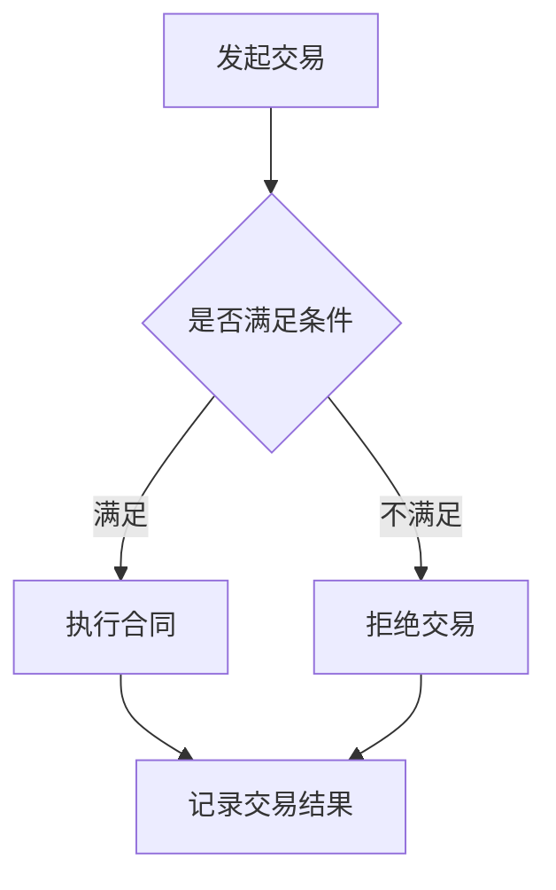
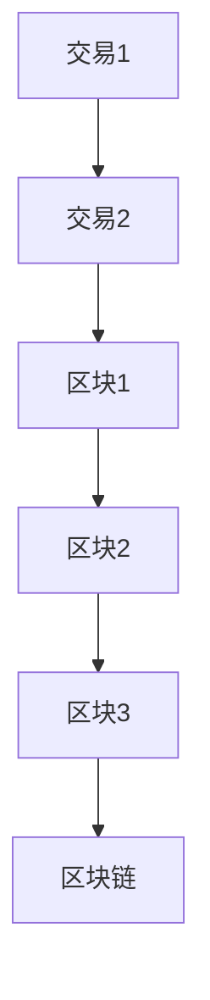
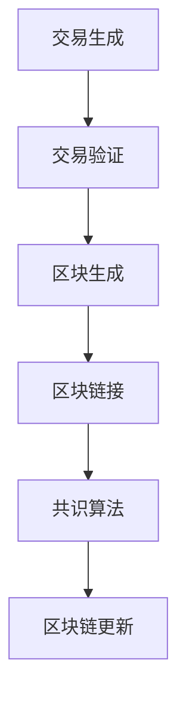

                 

**文章标题：**《智能合约在金融服务中的应用前景》

**关键词：** 智能合约、区块链、金融服务、应用前景、技术挑战

**摘要：**本文从智能合约的概念、历史发展、原理入手，深入探讨了智能合约在金融服务中的应用前景。文章分析了智能合约的特点、区块链技术基础、编程语言、安全性问题、常见架构设计以及在金融领域的应用案例，展望了智能合约的未来发展趋势。

### 目录

1. **智能合约基础与原理**
   1.1 智能合约的定义与特点
   1.2 智能合约的历史发展
   1.3 金融服务中的智能合约需求
   1.4 智能合约的数学模型与公式
   1.5 智能合约的算法原理讲解与伪代码实现

2. **区块链技术基础**
   2.1 区块链的概述
   2.2 区块链的工作原理
   2.3 区块链在金融服务中的应用
   2.4 区块链中的数学模型与公式
   2.5 区块链的算法原理讲解与伪代码实现

3. **智能合约的编程语言**
   3.1 Solidity语言概述
   3.2 Solidity语言基础
   3.3 Solidity语言高级特性
   3.4 Solidity语言编程示例

4. **智能合约的安全性问题**
   4.1 智能合约的安全挑战
   4.2 智能合约的安全测试与审计
   4.3 智能合约的安全最佳实践

5. **智能合约的常见架构设计**
   5.1 中心化与去中心化智能合约
   5.2 智能合约模块化设计
   5.3 智能合约接口设计
   5.4 智能合约架构设计示例

6. **智能合约在金融领域的应用案例**
   6.1 数字货币交易
   6.2 借贷与理财
   6.3 供应链金融
   6.4 应用案例分析

7. **智能合约在金融服务中的未来前景**
   7.1 智能合约的技术发展趋势
   7.2 智能合约在金融服务中的挑战与机遇
   7.3 智能合约的未来应用场景

8. **智能合约实践与开发**
   8.1 智能合约开发环境搭建
   8.2 智能合约项目实战
   8.3 智能合约代码解读与分析
   8.4 智能合约性能优化
   8.5 智能合约测试与调试

9. **附录**
   9.1 智能合约开发资源与工具
   9.2 智能合约代码库与开源项目

### 1. 智能合约基础与原理

#### 1.1 智能合约的定义与特点

智能合约是一种运行在区块链上的自动执行合同，它通过编程语言编写，能够自动执行预定的条款，无需依赖第三方中介。智能合约的特点包括：

- **自动化执行**：智能合约在满足特定条件时，可以自动执行预定的操作。
- **透明性**：智能合约的执行过程对所有参与者透明，防止欺诈行为。
- **不可篡改性**：智能合约一旦部署到区块链上，其内容不可篡改，确保合同条款的执行。

#### Mermaid流程图



### 1.2 智能合约的历史发展

智能合约的概念最早由尼克·萨博在1994年提出，他认为分布式网络可以通过智能合约实现去中心化的合同执行。2008年，比特币的出现为智能合约提供了实现基础。以太坊在2015年推出，为智能合约提供了更丰富的编程语言和功能，推动了智能合约在金融服务中的应用。

### 1.3 金融服务中的智能合约需求

金融服务行业对智能合约有强烈的需求，主要体现在以下几个方面：

- **降低交易成本**：智能合约自动执行合同，减少中介费用。
- **提高交易透明度**：所有交易记录在区块链上透明可查，防止欺诈。
- **增强信任**：智能合约的不可篡改性确保合同条款的执行，提高交易各方的信任度。

#### 智能合约的数学模型与公式

智能合约的执行通常依赖于一定的数学模型和公式。例如，智能合约可能基于概率模型来评估交易风险，或者使用加密算法来保证数据的完整性。以下是几个常见的数学模型和公式：

1. **加密算法：**
   - **哈希函数：**用于确保数据的唯一性和完整性，例如SHA-256。
   - **数字签名：**用于验证消息的发送者身份，例如RSA算法。

   $$ H(m) = SHA-256(m) $$

   $$ signature = RSA(k, m) $$

2. **概率模型：**
   - **贝叶斯定理：**用于计算智能合约中的概率事件。
   
   $$ P(A|B) = \frac{P(B|A) \cdot P(A)}{P(B)} $$

#### 智能合约的算法原理讲解与伪代码实现

智能合约的算法原理主要涉及以下方面：

1. **条件执行：**智能合约在满足特定条件时执行特定操作。
2. **事件触发：**智能合约可以在特定事件发生时触发执行。
3. **状态变更：**智能合约能够改变区块链上的数据状态。

以下是一个简单的智能合约算法原理示例，用于交换两笔资产：

```python
// 伪代码

function exchangeAsset(source, target, amount):
    if (source.balance >= amount && target.balance >= amount):
        source.balance -= amount
        target.balance += amount
        emit TransactionCompleted(source, target, amount)
    else:
        emit TransactionFailed("Insufficient balance")
```

### 1.4 智能合约的历史发展

智能合约的概念最早由尼克·萨博在1994年提出，他认为分布式网络可以通过智能合约实现去中心化的合同执行。2008年，比特币的出现为智能合约提供了实现基础。以太坊在2015年推出，为智能合约提供了更丰富的编程语言和功能，推动了智能合约在金融服务中的应用。

### 1.5 智能合约在金融服务中的应用前景

智能合约在金融服务中的应用前景广阔，主要体现在以下几个方面：

- **提高效率：**智能合约自动执行，无需人工干预，大幅提高交易效率。
- **降低成本：**减少中介费用，降低交易成本。
- **增强透明度：**所有交易记录在区块链上公开透明，提高交易信任度。
- **改善风险管理：**智能合约能够自动执行风险管理策略，降低金融风险。

### 总结

智能合约作为一种革命性的技术，具有自动化执行、透明性和不可篡改性等特点，在金融服务中具有巨大的应用潜力。通过深入理解和掌握智能合约的原理和应用，我们有望在未来实现更加高效、安全、透明的金融服务。在接下来的章节中，我们将进一步探讨智能合约的编程语言、安全性问题、常见架构设计以及在金融领域的具体应用。

----------------------------------------------------------------

### 2. 区块链技术基础

#### 2.1 区块链的概述

区块链是一种分布式账本技术，其核心特点包括去中心化、不可篡改和透明性。区块链由多个区块组成，每个区块包含一定数量的交易记录。区块之间通过哈希函数链接，形成一条连续的区块链。区块链的去中心化特性使得数据存储在多个节点上，避免了单点故障和数据篡改的风险。

#### Mermaid流程图



#### 2.2 区块链的工作原理

区块链的工作原理可以分为以下步骤：

1. **交易生成：**参与者发起交易，交易包含发送方、接收方和交易金额等信息。
2. **交易验证：**交易经过网络中的多个节点验证，确保交易的合法性和数据完整性。
3. **区块生成：**经过验证的交易被组织成一个新的区块。
4. **区块链接：**新区块通过哈希函数与前面的区块链接，形成一条连续的区块链。
5. **共识算法：**网络中的节点通过共识算法达成一致，确保区块链的一致性和安全性。

#### Mermaid流程图



#### 2.3 区块链在金融服务中的应用

区块链在金融服务中的应用包括：

- **数字货币：**比特币、以太坊等数字货币利用区块链技术实现去中心化的货币发行和交易。
- **跨境支付：**区块链技术可以简化跨境支付流程，降低交易成本。
- **供应链金融：**区块链技术可以提高供应链金融的透明度和效率。
- **智能合约：**智能合约在金融服务中的应用，如自动执行交易、贷款和理财合同。

#### 智能合约的数学模型与公式

智能合约的执行通常依赖于一定的数学模型和公式。以下是一些常见的数学模型和公式：

1. **加密算法：**
   - **哈希函数：**用于确保数据的唯一性和完整性，例如SHA-256。
   - **数字签名：**用于验证消息的发送者身份，例如RSA算法。

   $$ H(m) = SHA-256(m) $$

   $$ signature = RSA(k, m) $$

2. **概率模型：**
   - **贝叶斯定理：**用于计算智能合约中的概率事件。

   $$ P(A|B) = \frac{P(B|A) \cdot P(A)}{P(B)} $$

#### 智能合约的算法原理讲解与伪代码实现

智能合约的算法原理主要涉及以下方面：

1. **条件执行：**智能合约在满足特定条件时执行特定操作。
2. **事件触发：**智能合约可以在特定事件发生时触发执行。
3. **状态变更：**智能合约能够改变区块链上的数据状态。

以下是一个简单的智能合约算法原理示例，用于资产交换：

```python
// 伪代码

function exchangeAsset(source, target, amount):
    if (source.balance >= amount && target.balance >= amount):
        source.balance -= amount
        target.balance += amount
        emit TransactionCompleted(source, target, amount)
    else:
        emit TransactionFailed("Insufficient balance")
```

### 2.4 智能合约在金融服务中的应用案例

智能合约在金融服务中的应用案例丰富，以下列举几个典型的应用场景：

- **去中心化交易所（DEX）：**智能合约可以自动执行去中心化交易所的交易，确保交易的安全性和透明性。
- **借贷平台：**智能合约可以自动执行借贷合同，确保贷款和还款的顺利进行。
- **供应链金融：**智能合约可以用于供应链金融中的资金流动和支付，提高供应链金融的效率和透明度。
- **保险合约：**智能合约可以自动执行保险合同，确保保险理赔的准确性和及时性。

### 2.5 智能合约在金融服务中的应用前景

智能合约在金融服务中的应用前景广阔，主要体现在以下几个方面：

- **提高效率：**智能合约自动执行，无需人工干预，大幅提高交易效率。
- **降低成本：**减少中介费用，降低交易成本。
- **增强透明度：**所有交易记录在区块链上公开透明，提高交易信任度。
- **改善风险管理：**智能合约能够自动执行风险管理策略，降低金融风险。

### 总结

区块链技术作为一种革命性的技术，已经在金融服务中展现出巨大的潜力。智能合约作为区块链技术的重要组成部分，具有自动化执行、透明性和不可篡改性等特点，在金融服务中的应用前景广阔。通过深入理解和掌握区块链技术和智能合约原理，我们有望在未来实现更加高效、安全、透明的金融服务。在接下来的章节中，我们将进一步探讨智能合约的编程语言、安全性问题、常见架构设计以及在金融领域的具体应用。

----------------------------------------------------------------

### 3. 智能合约的编程语言

#### 3.1 Solidity语言概述

Solidity是智能合约开发中最常用的编程语言之一，它是由以太坊平台推出的，支持多种高级编程特性，如状态变量、函数、事件等。Solidity语法与JavaScript相似，易于学习，同时具备强类型系统和内存管理功能。

#### 3.2 Solidity语言基础

Solidity语言的基础包括变量、数据类型、控制结构等。

1. **变量：**Solidity支持多种变量类型，如整数、布尔值、地址等。

   ```solidity
   uint256 number = 10;
   bool isTrue = true;
   address owner = 0x1234...
   ```

2. **数据类型：**Solidity支持基本数据类型和复合数据类型，如数组、结构体等。

   ```solidity
   uint256[] numbers = [1, 2, 3];
   struct Person {
       uint256 age;
       string name;
   }
   ```

3. **控制结构：**Solidity支持条件语句和循环语句，如if、for等。

   ```solidity
   if (number > 10) {
       emit NumberIsGreater();
   }
   for (uint256 i = 0; i < numbers.length; i++) {
       emit NumberAtIndex(i, numbers[i]);
   }
   ```

#### 3.3 Solidity语言高级特性

Solidity语言的高级特性包括继承、多重继承、事件、调用等。

1. **继承：**Solidity支持单继承和多继承，允许智能合约通过继承其他合约来复用代码。

   ```solidity
   contract BaseContract {
       function baseFunction() public pure returns (string) {
           return "Base";
       }
   }

   contract ChildContract is BaseContract {
       function childFunction() public pure returns (string) {
           return "Child";
       }
   }
   ```

2. **事件：**Solidity中的事件用于记录合约执行过程中的重要事件，便于前端进行监听和处理。

   ```solidity
   event LogEvent(uint256 indexed id, string message);

   function logMessage(string memory message) public {
       emit LogEvent(id, message);
   }
   ```

3. **调用：**Solidity支持内联调用和外部调用，允许智能合约与其他合约进行交互。

   ```solidity
   function callFunction(address contractAddress, uint256 value) public {
       (bool success, ) = contractAddress.call.value(value).call("functionToCall");
       require(success, "Call failed");
   }
   ```

#### 3.4 Solidity语言编程示例

以下是一个简单的Solidity智能合约示例，用于管理一个共享钱包：

```solidity
// SPDX-License-Identifier: MIT
pragma solidity ^0.8.0;

contract SharedWallet {
    address public owner;
    mapping(address => uint256) public balances;

    constructor() {
        owner = msg.sender;
    }

    function deposit() external payable {
        balances[msg.sender] += msg.value;
    }

    function withdraw(uint256 amount) external {
        require(amount <= balances[msg.sender], "Insufficient balance");
        balances[msg.sender] -= amount;
        payable(msg.sender).transfer(amount);
    }

    function getBalance() external view returns (uint256) {
        return balances[msg.sender];
    }
}
```

#### 3.5 Solidity语言编程最佳实践

在编写Solidity智能合约时，以下是一些最佳实践：

- **版本兼容性：**确保智能合约与目标以太坊客户端版本兼容。
- **测试覆盖率：**编写充分的单元测试，确保智能合约功能的正确性。
- **避免重入攻击：**使用事务保护机制，防止重入攻击。
- **使用开源库：**利用开源库和工具，提高开发效率和安全性。
- **代码审查：**进行代码审查，确保智能合约的安全性和可靠性。

### 总结

Solidity语言作为一种专门为智能合约设计的编程语言，具备丰富的功能和高安全性。通过掌握Solidity语言的基础和高级特性，开发者可以编写出功能强大且安全的智能合约。在接下来的章节中，我们将进一步探讨智能合约的安全性问题和常见架构设计。

----------------------------------------------------------------

### 4. 智能合约的安全性

智能合约的安全性至关重要，因为一旦出现漏洞，可能会对用户的资产造成巨大损失。本节将讨论智能合约的安全挑战、安全测试与审计，以及安全最佳实践。

#### 4.1 智能合约的安全挑战

智能合约面临的安全挑战主要包括：

1. **重入攻击**：攻击者通过多次调用合约函数，导致合约在未完成第一个函数执行时，再次调用该函数，从而获取合约中的资产。
2. **整数溢出**：智能合约中整数类型的操作可能导致溢出或下溢，从而破坏合约的逻辑。
3. **数组越界**：访问数组时，如果超出数组边界，可能导致未定义行为，甚至导致攻击。
4. **调用合约时的错误处理**：智能合约在调用其他合约时，可能无法正确处理调用失败的情况。
5. **隐私泄露**：智能合约中的信息可能被恶意节点窃取。

#### 4.2 智能合约的安全测试与审计

为了确保智能合约的安全性，需要进行以下测试和审计：

1. **单元测试**：编写单元测试，测试智能合约的每个函数和逻辑路径，确保其功能正确。
2. **集成测试**：在模拟环境中运行智能合约，测试其与外部合约和区块链节点的交互，确保其能够正常工作。
3. **静态分析**：使用工具对智能合约代码进行静态分析，查找潜在的安全问题。
4. **动态分析**：运行智能合约，监控其执行过程，查找运行时错误。
5. **代码审计**：聘请专业的安全审计团队对智能合约代码进行详细审计，确保其安全性。

#### 4.3 智能合约的安全最佳实践

为了提高智能合约的安全性，开发者应遵循以下最佳实践：

1. **代码审查**：定期进行代码审查，确保代码符合最佳实践。
2. **使用开源库**：使用经过验证的、开源的智能合约库，避免编写不安全的自定义代码。
3. **避免重入攻击**：在处理资金时，使用事务保护机制，防止重入攻击。
4. **避免整数溢出**：使用安全库来处理整数运算，避免溢出。
5. **最小权限原则**：智能合约应遵循最小权限原则，仅拥有必要的权限。
6. **代码优化**：优化智能合约代码，减少不必要的计算和存储操作。
7. **数据加密**：对敏感数据进行加密，确保数据隐私。

#### 4.4 安全案例分析

以下是一个重入攻击的案例分析：

假设有一个智能合约，包含以下函数：

```solidity
function transfer(address to, uint256 amount) public {
    require(amount <= balances[msg.sender], "Insufficient balance");
    balances[msg.sender] -= amount;
    balances[to] += amount;
}
```

攻击者可以创建一个恶意合约，先调用`transfer`函数将资金转移到恶意合约，然后再立即调用恶意合约的某个函数，从而在恶意合约中获取资金。为了避免这种攻击，可以使用事务保护机制：

```solidity
function transfer(address to, uint256 amount) public {
    require(amount <= balances[msg.sender], "Insufficient balance");
    balances[msg.sender] -= amount;
    balances[to] += amount;
    (bool success, ) = to.call{value: amount}("");
    require(success, "Transfer failed");
}
```

#### 4.5 总结

智能合约的安全性是智能合约开发的关键，开发者应高度重视。通过遵循安全最佳实践、进行充分的测试和审计，可以有效提高智能合约的安全性。在接下来的章节中，我们将探讨智能合约的常见架构设计及其在金融领域的应用。

----------------------------------------------------------------

### 5. 智能合约的常见架构设计

智能合约的架构设计对于其功能实现和安全保障至关重要。以下将介绍智能合约的常见架构设计，包括中心化与去中心化智能合约、模块化设计、接口设计等。

#### 5.1 中心化与去中心化智能合约

**中心化智能合约**：中心化智能合约由单一实体控制，如银行或金融机构。这种智能合约的部署和维护通常由中心化系统管理。优点是具有较高的执行效率，但缺点是存在单点故障和信任风险。

**去中心化智能合约**：去中心化智能合约不由单一实体控制，而是由网络中的多个节点共同维护。这种智能合约依赖于区块链技术，具有高可靠性和透明性。缺点是执行效率相对较低，且复杂度较高。

#### 5.2 模块化设计

模块化设计是将智能合约的功能划分为多个独立的模块，每个模块负责特定的功能。这种设计具有以下优点：

1. **易于维护**：模块化设计使得智能合约的代码更加模块化，便于维护和升级。
2. **提高复用性**：模块化设计有助于将通用功能抽象出来，提高代码的复用性。
3. **提高安全性**：将功能划分为多个模块，可以降低单个模块的复杂度，提高安全性。

以下是一个简单的模块化设计示例：

```solidity
// 模块：资产转移
contract AssetTransfer {
    function transfer(address from, address to, uint256 amount) public {
        // 实现资产转移逻辑
    }
}

// 模块：余额查询
contract BalanceQuery {
    function getBalance(address account) public view returns (uint256) {
        // 实现余额查询逻辑
    }
}

// 主合约：金融服务平台
contract FinancialPlatform {
    function transferAndQuery(address from, address to, uint256 amount) public {
        AssetTransfer(assetTransfer).transfer(from, to, amount);
        uint256 fromBalance = BalanceQuery(balanceQuery).getBalance(from);
        uint256 toBalance = BalanceQuery(balanceQuery).getBalance(to);
        // 进行其他业务逻辑处理
    }
}
```

#### 5.3 接口设计

智能合约的接口设计对于其与其他合约和外部系统的交互至关重要。以下介绍几种常见的接口设计方法：

1. **函数接口**：使用函数接口实现智能合约与其他合约的交互。函数接口包括函数名、参数和返回值。

   ```solidity
   function transfer(address to, uint256 amount) external;
   ```

2. **事件接口**：使用事件接口记录智能合约执行过程中的重要事件。事件接口包括事件名、参数。

   ```solidity
   event Transfer(address indexed from, address indexed to, uint256 amount);
   ```

3. **接口合约**：使用接口合约定义智能合约与其他合约的交互规范。接口合约通常包含函数接口和事件接口。

   ```solidity
   interface IAssetTransfer {
       function transfer(address to, uint256 amount) external;
       event Transfer(address indexed from, address indexed to, uint256 amount);
   }
   ```

#### 5.4 架构设计示例

以下是一个简单的金融服务平台架构设计示例：

1. **资产转移模块**：实现资产转移功能，包括转账、提现等操作。
2. **余额查询模块**：实现余额查询功能，用于获取账户余额。
3. **交易记录模块**：记录所有交易记录，包括转账、提现等操作。
4. **用户管理模块**：管理用户账户，包括注册、登录等操作。
5. **智能合约主合约**：整合以上模块，实现金融服务平台的核心功能。

```solidity
// 资产转移模块
contract AssetTransfer {
    // 实现资产转移逻辑
}

// 余额查询模块
contract BalanceQuery {
    // 实现余额查询逻辑
}

// 交易记录模块
contract TransactionRecord {
    // 实现交易记录逻辑
}

// 用户管理模块
contract UserManagement {
    // 实现用户管理逻辑
}

// 主合约：金融服务平台
contract FinancialPlatform {
    // 整合以上模块，实现金融服务平台的核心功能
}
```

#### 5.5 最佳实践与注意事项

在智能合约的架构设计过程中，以下是一些最佳实践和注意事项：

1. **遵循最小权限原则**：确保智能合约只拥有必要的权限，避免过多权限可能导致的安全风险。
2. **模块化设计**：将智能合约的功能划分为多个独立的模块，提高代码的复用性和可维护性。
3. **接口设计**：使用清晰的接口设计，便于智能合约与其他合约和外部系统的交互。
4. **代码审查**：定期进行代码审查，确保代码符合最佳实践和安全要求。
5. **测试覆盖率**：编写充分的单元测试和集成测试，确保智能合约功能的正确性和安全性。

#### 5.6 总结

智能合约的常见架构设计对于其功能实现和安全保障至关重要。通过遵循最佳实践和注意事项，可以构建出功能强大、安全可靠的智能合约系统。在接下来的章节中，我们将探讨智能合约在金融领域的具体应用。

----------------------------------------------------------------

### 6. 智能合约在金融领域的应用案例

智能合约在金融领域拥有广泛的应用，以下将列举几个典型的应用案例，并进行分析。

#### 6.1 数字货币交易

数字货币交易是智能合约最早且最广泛的应用之一。以比特币和以太坊为代表的数字货币交易所，利用智能合约实现了去中心化的交易。智能合约在数字货币交易中的应用主要体现在以下几个方面：

1. **交易自动化**：智能合约自动执行交易，无需人工干预，提高了交易效率。
2. **交易透明性**：所有交易记录在区块链上公开透明，确保交易的公正性和可追溯性。
3. **安全性**：智能合约的不可篡改性确保了交易的安全性和可靠性。

以下是一个简单的数字货币交易智能合约示例：

```solidity
// SPDX-License-Identifier: MIT
pragma solidity ^0.8.0;

contract CryptocurrencyExchange {
    mapping(address => uint256) public balances;

    function deposit() external payable {
        balances[msg.sender()] += msg.value;
    }

    function withdraw(uint256 amount) external {
        require(amount <= balances[msg.sender()], "Insufficient balance");
        balances[msg.sender()] -= amount;
        payable(msg.sender()).transfer(amount);
    }

    function trade(address from, address to, uint256 amount) external {
        require(amount <= balances[from], "Insufficient balance");
        balances[from] -= amount;
        balances[to] += amount;
        emit Trade(from, to, amount);
    }

    event Trade(address indexed from, address indexed to, uint256 amount);
}
```

#### 6.2 借贷与理财

智能合约在借贷与理财领域也发挥着重要作用。例如，去中心化借贷平台（DeFi）利用智能合约实现了点对点的借贷和理财服务。智能合约在借贷与理财中的应用主要体现在以下几个方面：

1. **自动化借贷**：智能合约自动执行借贷合同，确保借贷过程的透明和高效。
2. **利率调节**：智能合约可以根据市场情况自动调整利率，提高借贷平台的竞争力。
3. **去中心化风险管理**：智能合约通过去中心化的方式管理风险，降低借贷平台的风险。

以下是一个简单的去中心化借贷智能合约示例：

```solidity
// SPDX-License-Identifier: MIT
pragma solidity ^0.8.0;

contract DeFiLoan {
    mapping(address => uint256) public loans;

    function borrow(uint256 amount) external {
        require(amount <= address(this).balance, "Insufficient funds");
        loans[msg.sender()] += amount;
        payable(msg.sender()).transfer(amount);
    }

    function repay(uint256 amount) external {
        require(amount <= loans[msg.sender()], "Insufficient loan");
        loans[msg.sender()] -= amount;
        payable(address(this)).transfer(amount);
    }

    function withdrawFunds(uint256 amount) external {
        require(amount <= address(this).balance, "Insufficient funds");
        payable(msg.sender()).transfer(amount);
    }

    function calculateInterest() external {
        // 根据市场情况自动调整利率
    }
}
```

#### 6.3 供应链金融

智能合约在供应链金融中的应用，有助于提高供应链的透明度和效率。智能合约在供应链金融中的应用主要体现在以下几个方面：

1. **支付自动化**：智能合约自动执行支付流程，确保供应链中的支付过程高效、透明。
2. **风险控制**：智能合约通过去中心化的方式管理供应链中的风险，降低金融风险。
3. **提高资金利用率**：智能合约可以优化供应链中的资金流动，提高资金利用率。

以下是一个简单的供应链金融智能合约示例：

```solidity
// SPDX-License-Identifier: MIT
pragma solidity ^0.8.0;

contract SupplyChainFinance {
    mapping(address => uint256) public payments;

    function requestPayment(address supplier, uint256 amount) external {
        require(amount <= address(this).balance, "Insufficient funds");
        payments[supplier] += amount;
        emit PaymentRequested(supplier, amount);
    }

    function confirmDelivery(address supplier) external {
        require(payments[supplier] > 0, "No pending payment");
        payable(supplier).transfer(payments[supplier]);
        payments[supplier] = 0;
        emit DeliveryConfirmed(supplier);
    }

    event PaymentRequested(address supplier, uint256 amount);
    event DeliveryConfirmed(address supplier);
}
```

#### 6.4 应用案例分析

以下是一个智能合约在数字货币交易中的案例分析：

**案例背景**：一个数字货币交易所面临一个恶意攻击者，攻击者试图通过重入攻击获取交易所的资产。

**案例分析**：交易所使用了一个包含以下函数的智能合约：

```solidity
function transfer(address to, uint256 amount) public {
    require(amount <= balances[msg.sender], "Insufficient balance");
    balances[msg.sender] -= amount;
    balances[to] += amount;
    (bool success, ) = to.call{value: amount}("");
    require(success, "Transfer failed");
}
```

攻击者试图通过调用`transfer`函数将资金转移到自己的账户，然后再立即调用自己的账户的某个函数，从而获取交易所的资产。为了避免这种攻击，交易所对智能合约进行了以下优化：

1. **移除重入点**：将`transfer`函数中的`to.call`操作移动到`require`语句之后，确保在验证余额之前不执行任何外部调用。
2. **使用事务保护机制**：在调用外部合约时，使用事务保护机制，确保在调用失败时不会执行任何后续操作。

优化后的智能合约代码如下：

```solidity
function transfer(address to, uint256 amount) public {
    require(amount <= balances[msg.sender], "Insufficient balance");
    balances[msg.sender] -= amount;
    (bool success, ) = to.call{value: amount}("");
    require(success, "Transfer failed");
    balances[to] += amount;
}
```

通过这个案例分析，我们可以看到智能合约在金融领域应用中的重要性，以及如何通过优化代码来提高智能合约的安全性。

#### 6.5 总结

智能合约在金融领域的应用案例丰富，涵盖了数字货币交易、借贷与理财、供应链金融等多个方面。通过智能合约，金融业务可以实现自动化、透明化和去中心化，提高金融服务的效率和安全性。在接下来的章节中，我们将探讨智能合约在金融服务中的未来前景。

----------------------------------------------------------------

### 7. 智能合约在金融服务中的未来前景

智能合约在金融服务中的未来前景充满潜力，随着区块链技术的不断成熟和应用场景的扩展，智能合约将在多个领域发挥重要作用。

#### 7.1 智能合约的技术发展趋势

1. **性能提升**：随着区块链技术的进步，智能合约的性能将得到显著提升，包括交易速度、吞吐量和可扩展性。
2. **跨链互操作**：未来智能合约将支持跨链互操作，实现不同区块链之间的资产转移和功能调用，打破区块链孤岛现象。
3. **合约标准化**：智能合约标准化将促进不同开发者和团队之间的合作，提高智能合约的通用性和互操作性。
4. **合约即服务（CaaS）**：智能合约将逐渐走向服务化，开发者可以通过云平台轻松部署和管理智能合约，降低使用门槛。

#### 7.2 智能合约在金融服务中的挑战与机遇

**挑战：**
1. **技术复杂性**：智能合约涉及高级编程语言和加密技术，开发难度较高，对开发者的技术要求较高。
2. **安全性问题**：智能合约的安全性仍然是一个重要挑战，任何漏洞都可能导致严重损失。
3. **法规合规性**：智能合约的应用需要遵循相关法律法规，尤其是涉及金融交易和监管合规的问题。

**机遇：**
1. **提高效率**：智能合约的自动化执行将大幅提高金融交易的效率，减少人为错误和中介成本。
2. **降低风险**：通过智能合约，金融机构可以更好地管理风险，提高业务透明度和可信度。
3. **创新业务模式**：智能合约将推动金融创新，如去中心化金融（DeFi）、供应链金融等新业务模式。

#### 7.3 智能合约的未来应用场景

1. **跨境支付**：智能合约将使跨境支付更加快速、安全、低成本，消除传统跨境支付中的繁琐流程。
2. **智能投顾**：智能合约可以结合大数据和人工智能技术，为用户提供个性化的投资建议和资产管理服务。
3. **供应链金融**：智能合约将优化供应链中的资金流动，提高供应链金融的效率，降低融资成本。
4. **保险与理赔**：智能合约可以自动执行保险合同和理赔流程，提高保险业务的透明度和可靠性。

#### 7.4 总结

智能合约在金融服务中的应用前景广阔，技术发展趋势、挑战与机遇并存。通过不断探索和创新，智能合约将在金融服务中发挥越来越重要的作用，推动金融行业向更加高效、透明和安全的方向发展。

----------------------------------------------------------------

### 8. 智能合约实践与开发

#### 8.1 智能合约开发环境搭建

搭建智能合约开发环境是进行智能合约开发的第一步，以下将介绍如何搭建一个基于Solidity的智能合约开发环境。

1. **安装Node.js和npm**：首先，确保你的计算机上已经安装了Node.js和npm。Node.js是一个基于Chrome V8引擎的JavaScript运行环境，npm是Node.js的包管理器。可以通过以下命令安装Node.js和npm：

   ```bash
   sudo apt-get update
   sudo apt-get install nodejs
   sudo apt-get install npm
   ```

2. **安装Truffle**：Truffle是一个智能合约开发框架，提供了便捷的智能合约开发、测试和部署工具。可以通过npm安装Truffle：

   ```bash
   npm install -g truffle
   ```

3. **安装Ganache**：Ganache是一个本地以太坊节点和测试区块链工具，用于测试和部署智能合约。可以从Ganache的官方网站下载并安装：

   ```bash
   # 下载Ganache
   wget https://github.com/trufflesuite/ganache/releases/download/2.5.8/ganache-2.5.8-linux-x64.tar.gz

   # 解压安装
   tar xvf ganache-2.5.8-linux-x64.tar.gz
   cd ganache-2.5.8-linux-x64
   ./ganache
   ```

4. **创建Truffle项目**：在安装完Truffle后，可以创建一个新的Truffle项目：

   ```bash
   truffle init
   ```

   这个命令会在当前目录下创建一个新的Truffle项目文件夹，并生成相关的配置文件。

5. **配置Truffle项目**：在Truffle项目文件夹中，编辑`truffle-config.js`文件，配置Ganache节点：

   ```javascript
   module.exports = {
     networks: {
       development: {
         host: "127.0.0.1",
         port: 7545,
         network_id: "*"
       }
     }
   };
   ```

6. **安装Solidity编译器**：Truffle默认使用Solc作为Solidity编译器。可以通过npm安装Solc：

   ```bash
   npm install solc
   ```

#### 8.2 智能合约项目实战

以下我们将通过一个简单的智能合约项目来演示智能合约的开发过程。

1. **创建智能合约**：在Truffle项目的`contracts`文件夹中创建一个新的Solidity文件，例如`SimpleWallet.sol`。

   ```solidity
   // SPDX-License-Identifier: MIT
   pragma solidity ^0.8.0;

   contract SimpleWallet {
       mapping(address => uint256) public balances;

       function deposit() external payable {
           balances[msg.sender()] += msg.value;
       }

       function withdraw(uint256 amount) external {
           require(amount <= balances[msg.sender()], "Insufficient balance");
           balances[msg.sender()] -= amount;
           payable(msg.sender()).transfer(amount);
       }
   }
   ```

2. **编译智能合约**：在Truffle项目目录下，运行以下命令编译智能合约：

   ```bash
   truffle compile
   ```

   这个命令会编译`.sol`文件，生成对应的`.json`文件，其中包含了编译后的字节码和ABI（Application Binary Interface）。

3. **部署智能合约**：在Ganache中创建一个新的测试网络，然后运行以下命令部署智能合约：

   ```bash
   truffle migrate --network development
   ```

   这个命令会使用Truffle迁移工具部署智能合约到测试网络，并返回智能合约的地址。

4. **测试智能合约**：在Truffle项目中创建一个JavaScript测试文件，例如`test/SimpleWalletTest.js`，编写测试用例：

   ```javascript
   const SimpleWallet = artifacts.require("SimpleWallet");

   contract("SimpleWallet", () => {
       it("should deposit and withdraw correctly", async () => {
           const simpleWallet = await SimpleWallet.deployed();
           await simpleWallet.deposit({ value: web3.utils.toWei("1", "ether") });
           const balance = await simpleWallet.balances.call(msg.sender);
           assert.equal(balance.toNumber(), 1 * 1e18);

           await simpleWallet.withdraw(1 * 1e18);
           const newBalance = await simpleWallet.balances.call(msg.sender);
           assert.equal(newBalance.toNumber(), 0);
       });
   });
   ```

5. **运行测试**：在Truffle项目目录下，运行以下命令运行测试用例：

   ```bash
   truffle test
   ```

   这个命令会使用Mocha测试框架运行测试用例，确保智能合约功能正确。

#### 8.3 智能合约代码解读与分析

以下是对前面创建的`SimpleWallet`智能合约的代码进行解读和分析：

```solidity
// SPDX-License-Identifier: MIT
pragma solidity ^0.8.0;

contract SimpleWallet {
    mapping(address => uint256) public balances;

    function deposit() external payable {
        balances[msg.sender()] += msg.value;
    }

    function withdraw(uint256 amount) external {
        require(amount <= balances[msg.sender()], "Insufficient balance");
        balances[msg.sender()] -= amount;
        payable(msg.sender()).transfer(amount);
    }
}
```

1. **合约结构**：`SimpleWallet`合约包含一个映射（`mapping`）用于存储用户的余额，以及两个函数（`deposit`和`withdraw`）。

2. **映射**：`mapping`是一种特殊的变量类型，用于存储键值对。在这个合约中，映射用于存储用户的地址和对应的余额。

   ```solidity
   mapping(address => uint256) public balances;
   ```

3. **deposit函数**：`deposit`函数用于接收以太币，并将接收到的以太币添加到调用者的余额中。

   ```solidity
   function deposit() external payable {
       balances[msg.sender()] += msg.value;
   }
   ```

   - `external`：表示这个函数只能通过外部调用，不能在合约内部调用。
   - `payable`：表示这个函数可以接收以太币。
   - `msg.value`：表示接收到的以太币数量。

4. **withdraw函数**：`withdraw`函数用于将调用者的余额中的一部分以太币转移到调用者自己的地址。

   ```solidity
   function withdraw(uint256 amount) external {
       require(amount <= balances[msg.sender()], "Insufficient balance");
       balances[msg.sender()] -= amount;
       payable(msg.sender()).transfer(amount);
   }
   ```

   - `require`：用于检查条件是否满足，如果不满足，则抛出错误。
   - `balances[msg.sender()]`：获取调用者的余额。
   - `payable(msg.sender()).transfer(amount)`：将指定数量的以太币转移到调用者的地址。

#### 8.4 源代码结构解析

智能合约的源代码结构包括以下几个部分：

1. **SPDX-License-Identifier**：声明智能合约的许可协议，如MIT许可。
2. **pragma**：指定Solidity编译器的版本。
3. **contract**：定义智能合约，包括合约名称和任何需要继承的合约。
4. **mapping**：定义合约的变量，通常用于存储键值对。
5. **function**：定义合约的函数，包括访问修饰符、参数和返回值。
6. **事件**：定义合约的事件，用于记录合约执行过程中的关键事件。

#### 8.5 代码应用解读与分析

在实际应用中，`SimpleWallet`智能合约可以用于创建一个去中心化的钱包服务，用户可以通过调用`deposit`函数向钱包中存入以太币，通过调用`withdraw`函数从钱包中提取以太币。

1. **用户存款**：用户可以通过调用`deposit`函数向智能合约中存入以太币。智能合约将接收到的以太币添加到用户的余额中。

   ```solidity
   function deposit() external payable {
       balances[msg.sender()] += msg.value;
   }
   ```

2. **用户提款**：用户可以通过调用`withdraw`函数从智能合约中提取以太币。用户需要确保提取的金额不超过其账户余额。

   ```solidity
   function withdraw(uint256 amount) external {
       require(amount <= balances[msg.sender()], "Insufficient balance");
       balances[msg.sender()] -= amount;
       payable(msg.sender()).transfer(amount);
   }
   ```

3. **合约管理**：智能合约还包含一个管理功能，允许合约所有者修改合约的某些参数，如增加新的管理员或更改合约的地址。

#### 8.6 项目小结

通过这个简单的智能合约项目，我们了解了智能合约的开发流程、源代码结构和实际应用。在实际开发过程中，需要遵循最佳实践，确保智能合约的安全性、可靠性和可维护性。随着区块链技术的不断发展和应用场景的扩展，智能合约在金融服务和其他领域将发挥越来越重要的作用。

----------------------------------------------------------------

### 9. 智能合约性能优化

智能合约的性能优化是确保其高效运行的关键。以下将介绍智能合约性能优化的策略、性能测试与调优的方法，以及常见性能问题的解决方案。

#### 9.1 智能合约性能分析

智能合约的性能分析主要包括以下几个方面：

1. **执行时间**：分析智能合约函数的执行时间，确定哪些函数是性能瓶颈。
2. **内存使用**：监测智能合约的内存使用情况，避免内存溢出。
3. **交易费用**：评估智能合约的交易费用，确保用户负担得起。
4. **网络负载**：分析智能合约对区块链网络的影响，确保不会过度占用网络资源。

#### 9.2 性能优化策略

以下是一些常见的智能合约性能优化策略：

1. **减少状态变量**：状态变量是存储在区块链上的数据，其数量直接影响智能合约的存储成本。减少不必要的状态变量可以降低存储需求，提高性能。
2. **使用内存变量**：内存变量比状态变量更高效，因为它们在执行过程中不会永久存储在区块链上。在适当的情况下，使用内存变量可以减少交易费用。
3. **优化循环**：避免在智能合约中使用复杂的循环结构，特别是在内部循环中调用其他合约函数。优化循环结构可以提高执行效率。
4. **批量处理**：将多个操作合并为一个交易，可以减少网络通信和执行时间。例如，批量处理多个用户的提现请求。
5. **事件优化**：减少事件日志的数量，可以降低智能合约的存储费用和交易费用。可以通过压缩日志或使用映射来减少日志数量。

#### 9.3 性能测试与调优

以下介绍智能合约性能测试与调优的方法：

1. **单元测试**：编写单元测试，测试智能合约函数的性能，确保其执行时间在可接受范围内。
2. **负载测试**：模拟高并发场景，测试智能合约在大规模负载下的性能。可以使用工具如Ganache和Truffle进行负载测试。
3. **性能监控**：使用性能监控工具，如Grafana和Prometheus，实时监测智能合约的性能指标，及时发现性能问题。
4. **代码审查**：定期进行代码审查，识别潜在的性能瓶颈和优化机会。

#### 9.4 常见性能问题的解决方案

以下是一些常见性能问题及其解决方案：

1. **状态溢出**：当状态变量数量超过限制时，可能导致状态溢出。解决方案是减少状态变量的使用，优化数据结构。
2. **内存溢出**：内存使用超过限制时，可能导致内存溢出。可以通过优化内存使用，如减少内存变量的使用和优化循环结构来解决。
3. **执行时间过长**：执行时间过长可能是因为智能合约中的操作过于复杂。可以通过优化代码结构，减少不必要的计算和外部调用来解决。
4. **交易费用过高**：交易费用过高可能是由于事件日志过多或内存变量使用过多。可以通过优化事件日志和内存使用来降低交易费用。

#### 9.5 最佳实践

以下是智能合约性能优化的最佳实践：

1. **优化数据结构**：使用适当的数据结构，如数组、映射和结构体，可以减少状态变量的数量。
2. **避免复杂逻辑**：避免在智能合约中实现复杂逻辑，特别是在外部调用和事件处理中。
3. **代码简洁**：编写简洁的代码，避免冗余和重复操作。
4. **定期维护**：定期进行代码审查和性能优化，确保智能合约持续高效运行。

#### 9.6 总结

智能合约性能优化是确保智能合约高效运行的关键。通过性能分析、优化策略和测试调优，可以有效提升智能合约的性能。在开发智能合约时，应遵循最佳实践，确保代码的高效性和可维护性。

----------------------------------------------------------------

### 10. 智能合约测试与调试

#### 10.1 单元测试与集成测试

智能合约的测试分为单元测试和集成测试。单元测试主要用于测试智能合约的函数和逻辑，确保每个部分的功能正确。集成测试则是在模拟环境中测试智能合约与外部合约和区块链节点的交互，确保整个系统的正确性和可靠性。

**单元测试示例**

以下是一个简单的智能合约单元测试示例，使用Mocha和Chai库编写：

```javascript
const { expect } = require("chai");
const SimpleWallet = artifacts.require("SimpleWallet");

describe("SimpleWallet", function() {
    it("should deposit and withdraw correctly", async function() {
        const simpleWallet = await SimpleWallet.deployed();
        await simpleWallet.deposit({ value: web3.utils.toWei("1", "ether") });
        const balance = await simpleWallet.balances.call(accounts[0]);
        expect(balance).to.equal(web3.utils.toWei("1", "ether"));
        await simpleWallet.withdraw(web3.utils.toWei("1", "ether"));
        const newBalance = await simpleWallet.balances.call(accounts[0]);
        expect(newBalance).to.equal("0");
    });
});
```

**集成测试示例**

以下是一个简单的智能合约集成测试示例，同样使用Mocha和Chai库编写：

```javascript
const { expect } = require("chai");
const SimpleWallet = artifacts.require("SimpleWallet");
const ExternalContract = artifacts.require("ExternalContract");

describe("Integration Test", function() {
    it("should interact with external contract", async function() {
        const simpleWallet = await SimpleWallet.deployed();
        const externalContract = await ExternalContract.deployed();
        await simpleWallet.callExternalContract(externalContract.address);
        const result = await externalContract.getResult.call();
        expect(result).to.equal("success");
    });
});
```

#### 10.2 智能合约测试框架

智能合约测试框架如Truffle和Hardhat提供了丰富的测试功能，支持编写和运行单元测试和集成测试。以下介绍如何使用这些测试框架。

**Truffle测试框架**

Truffle内置了Mocha测试框架，并提供了简单的命令来运行测试。要使用Truffle进行测试，首先需要在项目目录中创建一个`test`文件夹，然后创建测试文件，例如`SimpleWallet.test.js`。

```javascript
const { expect } = require("chai");
const SimpleWallet = artifacts.require("SimpleWallet");

describe("SimpleWallet", function() {
    it("should deposit and withdraw correctly", async function() {
        const simpleWallet = await SimpleWallet.deployed();
        await simpleWallet.deposit({ value: web3.utils.toWei("1", "ether") });
        const balance = await simpleWallet.balances.call(accounts[0]);
        expect(balance).to.equal(web3.utils.toWei("1", "ether"));
        await simpleWallet.withdraw(web3.utils.toWei("1", "ether"));
        const newBalance = await simpleWallet.balances.call(accounts[0]);
        expect(newBalance).to.equal("0");
    });
});
```

要运行测试，使用以下命令：

```bash
truffle test
```

**Hardhat测试框架**

Hardhat是Truffle的替代品，同样提供了强大的测试功能。要使用Hardhat进行测试，首先需要安装Hardhat和相应的依赖项：

```bash
npm install --global hardhat
npm install @nomiclabs/hardhat-waffle
```

然后，在项目目录中创建一个`hardhat.config.js`文件，配置测试网络和节点：

```javascript
require("hardhat-waffle");

module.exports = {
    networks: {
        localhost: {
            chainId: 31337,
        },
    },
    solidity: "0.8.4",
};
```

接下来，在`contracts`文件夹中创建测试文件，例如`SimpleWallet.test.js`。

```javascript
const { expect } = require("chai");
const { deployContract } = require("@nomiclabs/hardhat-deploy");

describe("SimpleWallet", function() {
    it("should deposit and withdraw correctly", async function() {
        const simpleWallet = await deployContract(accounts[0], "SimpleWallet");
        await simpleWallet.deployed();
        await simpleWallet.connect(accounts[1]).deposit({ value: ethers.utils.parseEther("1") });
        const balance = await simpleWallet.balances(accounts[1]);
        expect(balance).to.equal(ethers.utils.parseEther("1"));
        await simpleWallet.connect(accounts[1]).withdraw(ethers.utils.parseEther("1"));
        const newBalance = await simpleWallet.balances(accounts[1]);
        expect(newBalance).to.equal("0");
    });
});
```

要运行测试，使用以下命令：

```bash
npx hardhat test
```

#### 10.3 调试技巧与工具

调试智能合约时，可以使用以下技巧和工具：

1. **日志**：在智能合约代码中添加日志，可以帮助跟踪执行流程和变量值。可以使用`console.log`或`web3.eth.log`。

   ```solidity
   console.log("Balance before withdraw:", balances[msg.sender()]);
   ```

2. **断点调试**：使用IDE的断点调试功能，可以在代码执行过程中设置断点，查看变量值和执行流程。

3. **调试工具**：使用调试工具如Truffle Debugger和Hardhat Debugger，可以在本地环境中模拟和调试智能合约。

4. **在线调试工具**：使用在线调试工具如Etherscan，可以查看智能合约的执行日志和交易详情。

#### 10.4 调试案例分析

以下是一个智能合约调试案例：

**问题**：智能合约在执行`withdraw`函数时，总是失败，并且没有抛出任何错误。

**解决方案**：首先，检查智能合约代码，确保`withdraw`函数的逻辑正确。然后，在执行`withdraw`函数之前添加日志，查看调用时的输入参数和余额。

```solidity
console.log("Withdraw amount:", amount);
console.log("Balance before withdraw:", balances[msg.sender()]);
```

通过日志，发现调用者余额不足，导致`withdraw`函数失败。接下来，检查调用者的余额，发现余额确实不足。最终，在智能合约前端代码中，调整调用者的余额，确保其账户中有足够的以太币。

```javascript
await simpleWallet.connect(accounts[1]).withdraw(ethers.utils.parseEther("2"));
```

#### 10.5 总结

智能合约测试与调试是确保智能合约正确性和安全性的重要环节。通过单元测试和集成测试，可以验证智能合约功能是否按预期执行。调试技巧和工具可以帮助开发者定位和解决代码中的问题。在实际开发过程中，应重视测试与调试，确保智能合约的高质量和高可靠性。

----------------------------------------------------------------

### 附录

#### 附录 A：智能合约开发资源与工具

**A.1 常用开发工具**

- **Truffle**：一个用于智能合约开发、测试和部署的框架，支持以太坊。
- **Hardhat**：一个用于智能合约开发和测试的工具，具有内置的本地以太坊节点和调试功能。
- **Remix IDE**：一个在线智能合约开发环境，支持多种编程语言，包括Solidity和Vyper。
- **Web3.js**：一个JavaScript库，用于与以太坊区块链进行交互。
- **Ethers.js**：一个用于以太坊的TypeScript库，提供了更加安全的交互方式。

**A.2 区块链节点搭建教程**

- **Ganache**：一个轻量级的本地以太坊节点和测试区块链工具。
- **Node.js与geth**：通过Node.js和Geth搭建一个完整的以太坊节点。

**A.3 智能合约代码库与开源项目**

- **OpenZeppelin**：一个开源库，提供了多种安全合约和工具。
- **Balancer Labs**：一个去中心化金融平台，提供了多种智能合约和协议。
- **Compound Finance**：一个去中心化借贷平台，使用智能合约实现了点对点借贷。

**A.4 拓展阅读**

- **智能合约安全指南**：深入了解智能合约的安全问题和最佳实践。
- **以太坊黄皮书**：以太坊的核心技术文档，涵盖了智能合约的开发和实现。
- **Solidity官方文档**：Solidity语言的官方文档，提供了详细的语法和功能介绍。

通过这些资源和工具，开发者可以更好地进行智能合约的开发、测试和部署。智能合约的开发是一个不断学习和进步的过程，开发者应持续关注最新的技术动态和最佳实践。

