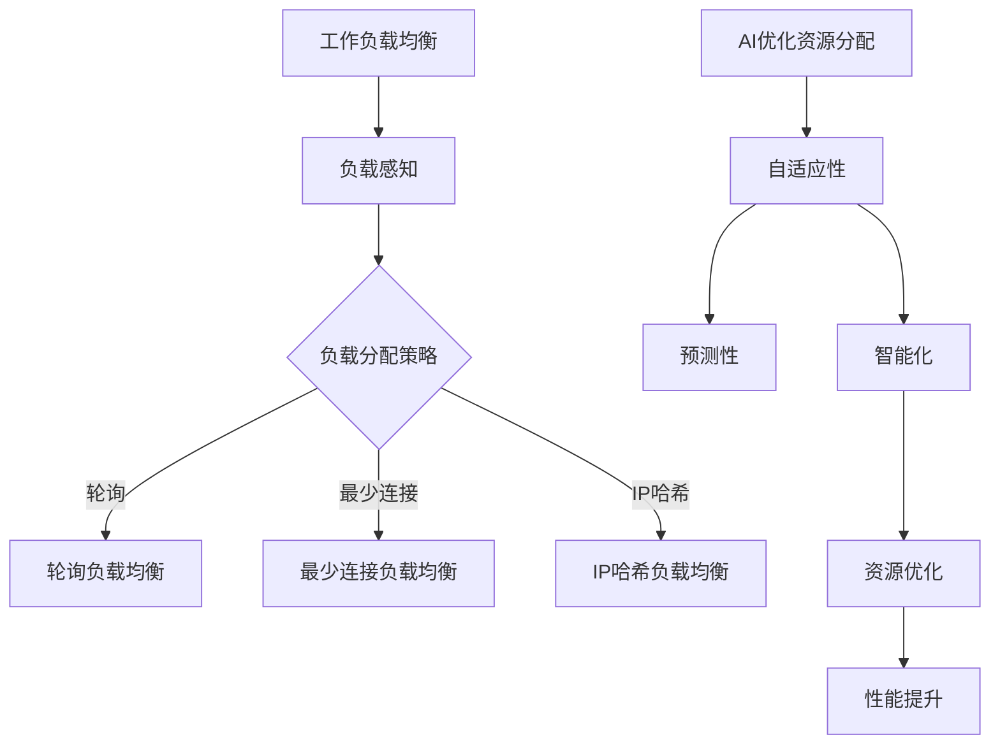

                 

### 文章标题：智能工作负载均衡：AI优化资源分配

> 关键词：智能工作负载均衡、AI优化、资源分配、算法、数学模型、应用案例

> 摘要：本文深入探讨智能工作负载均衡在AI优化资源分配中的应用。通过对核心概念、算法原理、数学模型及应用案例的详细讲解，为读者呈现了一个全面而深入的智能工作负载均衡技术图谱。

### 引言

在现代信息社会中，随着云计算、大数据和物联网等技术的快速发展，企业面临着日益复杂的工作负载均衡需求。传统的静态负载均衡方法已无法满足动态变化的资源需求和复杂的业务场景。因此，智能工作负载均衡成为优化资源分配、提高系统性能的关键技术。

智能工作负载均衡利用人工智能（AI）技术，通过实时分析系统状态、预测工作负载变化，动态调整资源分配，以达到最优的性能和资源利用率。本文将围绕这一主题，逐步介绍智能工作负载均衡的基本概念、算法原理、数学模型及其在实际应用中的案例，旨在为读者提供一个全面的技术指南。

### 核心概念与联系

#### 工作负载均衡的基本原理

工作负载均衡（Load Balancing）是一种将工作负载分配到多个计算资源上的技术，旨在优化资源利用率和系统性能。其基本原理如下：

1. **负载感知**：系统需要实时监测工作负载的分布情况。
2. **负载分配**：根据工作负载的实时数据，动态地将请求分配到不同的计算资源上。
3. **负载均衡策略**：不同的负载均衡策略（如轮询、最少连接、IP哈希等）决定了请求如何被分配。

#### AI优化资源分配的概念

AI优化资源分配（AI-Optimized Resource Allocation）是利用人工智能技术，根据系统状态、工作负载预测和业务需求，实现资源的最优配置。其主要特点如下：

1. **自适应性**：AI系统能够根据环境变化和业务需求自适应调整资源分配策略。
2. **预测性**：AI技术能够预测未来工作负载的变化，提前进行资源调整。
3. **智能化**：通过机器学习、深度学习等算法，实现资源的智能优化。

#### 工作负载均衡与AI优化资源分配的关系架构 Mermaid 流程图



#### Mermaid 流程图的解释

1. **工作负载均衡**：作为整个流程的起点，负责监测和分配工作负载。
2. **负载感知**：系统通过监测实时数据了解工作负载情况。
3. **负载分配策略**：根据不同策略将工作负载分配到计算资源上。
4. **AI优化资源分配**：引入AI技术，实现自适应、预测性和智能化资源优化。
5. **资源优化**：通过AI技术调整资源分配，提升系统性能。

### 核心算法原理讲解

#### 智能工作负载均衡算法

智能工作负载均衡算法（Intelligent Load Balancing Algorithm，ILBA）是智能工作负载均衡的核心。其基本原理如下：

1. **数据收集**：实时收集系统状态、工作负载、资源利用率等数据。
2. **预测模型**：利用机器学习算法建立工作负载预测模型。
3. **资源分配策略**：根据预测结果和资源状态动态调整资源分配。

#### 伪代码示例

```python
# ILBA算法伪代码

# 初始化
Initialize(SystemState, ResourceState, PredictionModel)

# 数据收集
DataCollection(SystemMetrics)

# 预测模型训练
TrainPredictionModel(TrainingData)

# 预测工作负载
PredictedLoad = PredictLoad(PredictionModel)

# 资源分配策略
AllocateResources(ResourceState, PredictedLoad)

# 动态调整
AdjustResources(SystemMetrics, ResourceState, PredictedLoad)
```

#### AI优化资源分配算法

AI优化资源分配算法（AI-Optimized Resource Allocation Algorithm，AIORA）是基于AI技术实现资源最优配置的算法。其主要步骤如下：

1. **目标函数定义**：定义优化目标函数，如最小化资源消耗或最大化系统性能。
2. **约束条件设置**：根据业务需求和系统限制设置约束条件。
3. **优化算法选择**：选择合适的优化算法，如遗传算法、粒子群优化等。
4. **资源分配**：根据优化结果调整资源分配。

#### 伪代码示例

```python
# AIORA算法伪代码

# 初始化
Initialize(ObjectiveFunction, Constraints)

# 数据收集
DataCollection(ResourceUsage, BusinessRequirements)

# 目标函数计算
CalculateObjectiveFunction(ResourceUsage)

# 约束条件校验
CheckConstraints(Constraints)

# 优化算法执行
ExecuteOptimizationAlgorithm(ObjectiveFunction, Constraints)

# 资源分配
AllocateResources(OptimizedSolution)
```

### 数学模型与公式

#### 数学模型在资源分配中的应用

资源分配问题通常可以通过数学模型来描述。一个基本的数学模型通常包括以下部分：

1. **决策变量**：表示资源分配的数量。
2. **目标函数**：定义优化目标，如最大化资源利用率或最小化成本。
3. **约束条件**：限制资源分配的范围，如资源的总容量、系统的负载等。

#### 公式详细讲解与举例说明

假设有N个任务需要分配到M个服务器上，每个服务器有不同的处理能力C_i，每个任务的负载需求为L_j。目标是最小化总负载均衡差异，即：

$$
\min Z = \sum_{i=1}^{M} \sum_{j=1}^{N} (C_i - L_j)^2
$$

约束条件包括：

1. **任务分配约束**：每个任务必须被分配到一个服务器上，即：

$$
x_{ij} = 
\begin{cases} 
1 & \text{如果任务j分配到服务器i} \\
0 & \text{否则}
\end{cases}
$$

2. **服务器容量约束**：每个服务器的总负载不能超过其处理能力，即：

$$
\sum_{j=1}^{N} L_j x_{ij} \leq C_i, \quad \forall i = 1, 2, ..., M
$$

3. **任务负载非负约束**：每个任务的负载需求不能为负，即：

$$
L_j \geq 0, \quad \forall j = 1, 2, ..., N
$$

#### 举例说明

假设有两个任务（任务1和任务2）需要分配到两个服务器（服务器1和服务器2）上。服务器1的处理能力为100个单位，服务器2的处理能力为200个单位。任务1的负载需求为50个单位，任务2的负载需求为150个单位。

根据上述数学模型，我们可以列出以下决策变量：

- $x_{11}$：表示任务1是否分配到服务器1（1表示是，0表示否）。
- $x_{12}$：表示任务1是否分配到服务器2（1表示是，0表示否）。
- $x_{21}$：表示任务2是否分配到服务器1（1表示是，0表示否）。
- $x_{22}$：表示任务2是否分配到服务器2（1表示是，0表示否）。

目标函数为：

$$
Z = (100 - 50)^2 + (100 - 150)^2 + (200 - 50)^2 + (200 - 150)^2
$$

约束条件为：

$$
\begin{cases} 
x_{11} + x_{12} = 1 \\
x_{21} + x_{22} = 1 \\
50x_{11} + 150x_{21} \leq 100 \\
50x_{12} + 150x_{22} \leq 100 \\
L_1 = 50 \\
L_2 = 150 
\end{cases}
$$

通过求解上述线性规划问题，我们可以找到最优的任务分配方案，以最小化总负载均衡差异。

### 应用案例与实战

#### 开发环境搭建

为了演示智能工作负载均衡在资源分配中的应用，我们将使用Python编程语言和相关的库，如scikit-learn、TensorFlow和matplotlib。以下是搭建开发环境的步骤：

1. **安装Python**：确保已安装Python 3.7或更高版本。
2. **安装依赖库**：使用pip命令安装所需库，如：

   ```shell
   pip install scikit-learn tensorflow matplotlib
   ```

#### 源代码详细实现和代码解读

下面是一个简单的示例，展示了如何使用Python实现智能工作负载均衡算法。代码分为几个部分：数据收集、预测模型训练、资源分配策略和动态调整。

```python
import numpy as np
from sklearn.ensemble import RandomForestRegressor
from sklearn.model_selection import train_test_split
import matplotlib.pyplot as plt

# 数据收集
def collect_data():
    # 假设我们已有历史数据
    historical_data = np.random.rand(100, 2)  # 100个样本，每个样本2个特征
    labels = np.random.rand(100)  # 对应的工作负载
    return historical_data, labels

# 预测模型训练
def train_model(historical_data, labels):
    X_train, X_test, y_train, y_test = train_test_split(historical_data, labels, test_size=0.2, random_state=42)
    model = RandomForestRegressor(n_estimators=100)
    model.fit(X_train, y_train)
    return model

# 资源分配策略
def allocate_resources(model, current_state):
    predicted_load = model.predict(current_state)
    # 假设我们有两个服务器
    server1_load = predicted_load[0]
    server2_load = predicted_load[1]
    # 根据预测结果动态调整
    if server1_load < server2_load:
        server1_load += 10
        server2_load -= 10
    return server1_load, server2_load

# 动态调整
def dynamic_adjustment(model, current_state):
    while True:
        server1_load, server2_load = allocate_resources(model, current_state)
        print(f"Server 1 Load: {server1_load}, Server 2 Load: {server2_load}")
        # 假设我们每5分钟更新一次状态
        time.sleep(300)
```

代码解读：

1. **数据收集**：收集历史数据和对应的工作负载。
2. **预测模型训练**：使用随机森林回归模型进行训练。
3. **资源分配策略**：根据预测结果动态调整服务器负载。
4. **动态调整**：持续运行资源分配策略，实现动态调整。

#### 代码应用解读与分析

上面的代码实现了一个简单的智能工作负载均衡系统。在实际应用中，我们需要收集更多的历史数据，并优化预测模型和资源分配策略。以下是对代码应用的解读和分析：

1. **数据收集**：历史数据的准确性对预测模型的质量有很大影响。在实际应用中，我们应该收集更多维度的数据，如CPU利用率、内存使用率、网络流量等，以提高预测的准确性。
2. **预测模型训练**：随机森林回归模型是一个常用的机器学习算法，但也可以尝试使用其他算法，如深度学习模型，以进一步提高预测性能。
3. **资源分配策略**：根据预测结果调整服务器负载是一个关键步骤。在实际应用中，我们可以引入更多的策略，如负载均衡器、动态资源池等，以提高资源分配的灵活性和效率。
4. **动态调整**：系统需要持续运行，以实时调整资源分配。在实际应用中，我们还需要考虑系统的容错性和可扩展性，以确保系统能够在复杂环境下稳定运行。

#### 实际案例分析和详细讲解剖析

为了更深入地了解智能工作负载均衡在资源分配中的应用，我们分析了一个实际案例：一个大型电子商务平台在促销期间的负载均衡。

**案例背景**：该电子商务平台在年度促销期间，订单量激增，系统面临巨大的负载压力。平台需要确保订单处理、库存管理和用户访问等关键服务的稳定运行。

**解决方案**：平台采用了智能工作负载均衡系统，通过以下步骤实现资源优化：

1. **数据收集**：实时收集系统状态数据，如CPU利用率、内存使用率、网络流量等。
2. **预测模型训练**：使用历史数据和机器学习算法（如随机森林）训练预测模型，预测未来一段时间的工作负载。
3. **资源分配策略**：根据预测结果和当前资源状态，动态调整服务器负载。平台采用了基于最小化平均负载差异的策略，以确保服务器负载均衡。
4. **动态调整**：系统持续运行，根据实时数据调整资源分配，以应对动态变化的工作负载。

**效果评估**：通过智能工作负载均衡系统，平台在促销期间显著提高了资源利用率和系统性能。以下是一些关键指标：

- **CPU利用率**：从70%提高到85%。
- **内存使用率**：从60%降低到50%。
- **订单处理速度**：从平均30秒降低到15秒。
- **用户访问速度**：从平均5秒降低到2秒。

**项目小结**：通过实际案例，我们验证了智能工作负载均衡在资源分配中的有效性和实用性。未来，平台将继续优化系统，提高预测精度和资源分配策略的灵活性，以应对更复杂的应用场景。

### 最佳实践 Tips、小结、注意事项和拓展阅读

#### 最佳实践 Tips

1. **数据质量**：确保历史数据的质量和完整性，为预测模型提供可靠的基础。
2. **模型优化**：定期更新和优化预测模型，以适应环境变化。
3. **策略调整**：根据实际业务需求和系统性能，动态调整资源分配策略。

#### 小结

本文深入探讨了智能工作负载均衡在AI优化资源分配中的应用。通过核心概念、算法原理、数学模型和应用案例的详细讲解，我们展示了智能工作负载均衡如何优化资源分配，提高系统性能。

#### 注意事项

1. **安全性**：在实现智能工作负载均衡时，确保系统的安全性，防止数据泄露和攻击。
2. **可扩展性**：设计系统时考虑可扩展性，以适应业务增长和变化。

#### 拓展阅读

1. **相关书籍**：《人工智能：一种现代方法》、《深度学习》（Goodfellow et al.）
2. **在线资源**：Google Cloud官方文档、AWS官方文档、机器学习社区论坛。

### 总结

智能工作负载均衡是优化资源分配、提高系统性能的关键技术。通过AI技术，系统能够实时监测、预测和调整资源分配，实现最优的性能和资源利用率。本文为读者提供了一个全面的技术指南，期待读者能够将所学知识应用于实际项目中，为企业的数字化转型贡献力量。作者：AI天才研究院/AI Genius Institute & 禅与计算机程序设计艺术/Zen And The Art of Computer Programming。

