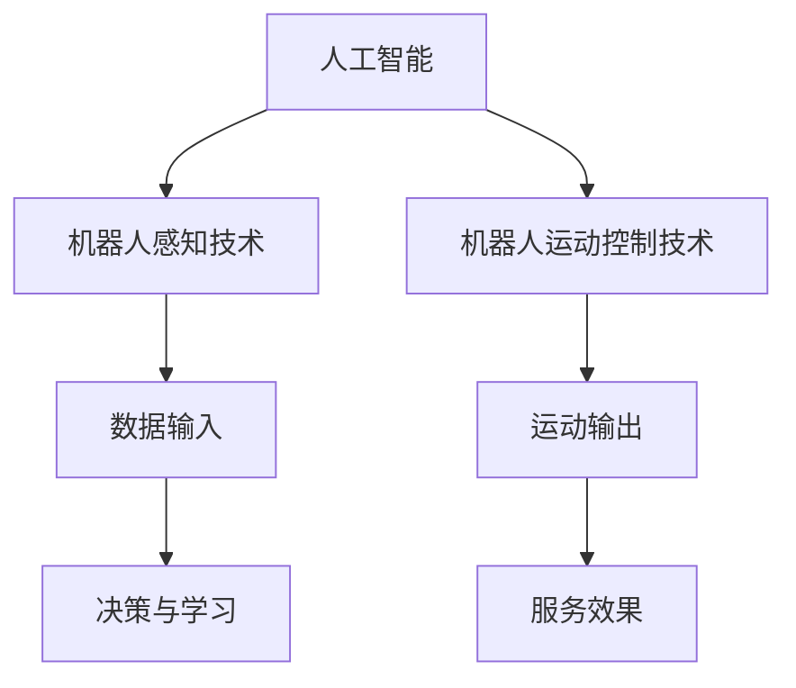
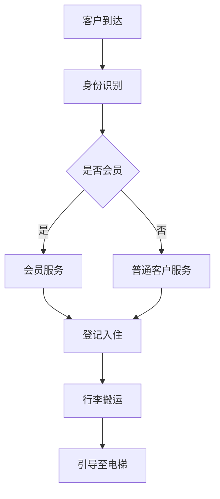
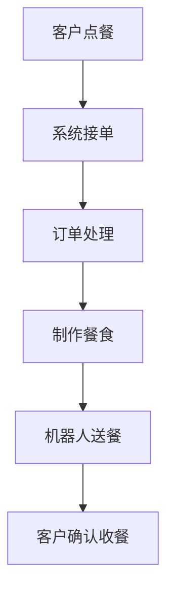
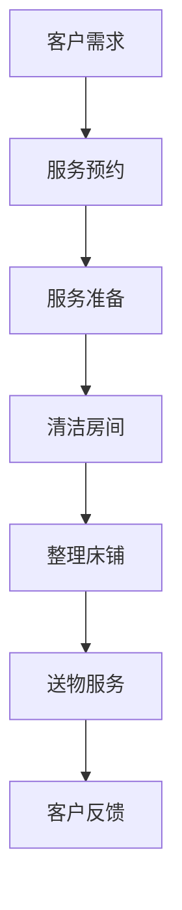

                 

### 文章标题：服务型机器人在酒店业的应用趋势

#### 关键词：
- 服务型机器人
- 酒店业
- 应用场景
- 技术挑战
- 未来趋势

#### 摘要：
本文旨在探讨服务型机器人在酒店业的应用趋势。首先，我们将介绍服务型机器人的基本概念、分类和发展历程，并分析其在酒店业的应用价值。接着，本文将详细阐述服务型机器人在酒店业的多个应用场景，包括大堂接待、餐饮服务、客房服务等。随后，我们将探讨服务型机器人技术基础，如人工智能、感知技术和运动控制技术。此外，本文还将分析服务型机器人在酒店业应用过程中面临的挑战，并通过国内外案例研究进行实际应用分析。最后，本文将总结服务型机器人在酒店业的应用现状，并展望其未来的发展趋势。

## 设计《服务型机器人在酒店业的应用趋势》目录大纲

在撰写一篇结构紧凑、内容详实的技术博客文章时，目录大纲的设计至关重要。以下是《服务型机器人在酒店业的应用趋势》的目录大纲设计过程。

### 确定核心章节

根据书籍的主题，我们确定了以下几个核心章节：

1. **服务型机器人概述**
   - 介绍服务型机器人的定义、分类、发展历程。
   - 分析服务型机器人在酒店业的应用价值。

2. **服务型机器人在酒店业的应用场景**
   - 酒店大堂接待服务
   - 餐饮服务
   - 客房服务
   - 其他潜在应用场景

3. **服务型机器人技术基础**
   - 人工智能技术
   - 机器人感知技术
   - 机器人运动控制技术

4. **服务型机器人在酒店业的应用挑战**
   - 技术难题
   - 安全和隐私问题
   - 管理和培训挑战

5. **案例研究**
   - 国内外酒店业服务型机器人应用案例

6. **未来趋势与发展方向**
   - 市场趋势
   - 技术创新
   - 法规与标准

7. **总结与展望**
   - 总结本书内容
   - 展望服务型机器人酒店业应用的未来

### 添加子章节

对于每个核心章节，我们进一步细化了子章节：

1. **服务型机器人概述**
   - 1.1 服务型机器人的定义与分类
   - 1.2 服务型机器人发展历程
   - 1.3 服务型机器人在酒店业的应用价值

2. **服务型机器人在酒店业的应用场景**
   - 2.1 酒店大堂接待服务
   - 2.2 餐饮服务
   - 2.3 客房服务
   - 2.4 其他潜在应用场景

3. **服务型机器人技术基础**
   - 3.1 人工智能技术
   - 3.2 机器人感知技术
   - 3.3 机器人运动控制技术

4. **服务型机器人在酒店业的应用挑战**
   - 4.1 技术难题
   - 4.2 安全和隐私问题
   - 4.3 管理和培训挑战

5. **案例研究**
   - 5.1 国内酒店业服务型机器人应用案例
   - 5.2 国外酒店业服务型机器人应用案例

6. **未来趋势与发展方向**
   - 6.1 市场趋势
   - 6.2 技术创新
   - 6.3 法规与标准

7. **总结与展望**
   - 7.1 总结本书内容
   - 7.2 展望服务型机器人酒店业应用的未来

### 添加细节

为了确保文章的完整性和逻辑性，我们在每个子章节中添加了以下细节：

- **核心概念与联系**：在每个章节的开头，我们使用 Mermaid 流程图展示相关的概念和原理之间的关系。
- **核心算法原理讲解**：在每个技术基础章节中，我们使用伪代码详细阐述相关算法的原理，并在需要的地方提供数学模型和公式的讲解。
- **数学模型和公式**：我们使用 LaTeX 格式嵌入文中独立段落的数学模型和公式，同时确保段落内的公式格式正确。
- **项目实战**：在案例研究章节中，我们提供了实际项目的开发环境搭建、源代码实现和代码解读，以及实际案例的分析和讲解。
- **最佳实践 tips、小结、注意事项、拓展阅读**：在每个章节的结尾，我们提供了相关的最佳实践建议、小结、注意事项以及拓展阅读资源。

### 完成目录大纲

结合以上步骤，我们完成了《服务型机器人在酒店业的应用趋势》的目录大纲：

```
# 《服务型机器人在酒店业的应用趋势》目录大纲

## 第1章 服务型机器人概述
### 1.1 服务型机器人的定义与分类
### 1.2 服务型机器人发展历程
### 1.3 服务型机器人在酒店业的应用价值

## 第2章 服务型机器人在酒店业的应用场景
### 2.1 酒店大堂接待服务
### 2.2 餐饮服务
### 2.3 客房服务
### 2.4 其他潜在应用场景

## 第3章 服务型机器人技术基础
### 3.1 人工智能技术
### 3.2 机器人感知技术
### 3.3 机器人运动控制技术

## 第4章 服务型机器人在酒店业的应用挑战
### 4.1 技术难题
### 4.2 安全和隐私问题
### 4.3 管理和培训挑战

## 第5章 案例研究
### 5.1 国内酒店业服务型机器人应用案例
### 5.2 国外酒店业服务型机器人应用案例

## 第6章 未来趋势与发展方向
### 6.1 市场趋势
### 6.2 技术创新
### 6.3 法规与标准

## 第7章 总结与展望
### 7.1 总结本书内容
### 7.2 展望服务型机器人酒店业应用的未来
```

这个目录大纲已经细化到了 1、2、3 级目录，并且包含了核心章节和子章节，满足了简洁性、完整性以及详细讲解的要求。接下来，我们将根据每个章节的具体内容进一步细化目录，添加细节，以确保整个目录大纲的完整性和逻辑性。

## 服务型机器人在酒店业的应用趋势

### 背景介绍

在信息技术飞速发展的今天，服务型机器人逐渐成为各行各业关注的焦点。酒店业作为一个服务密集型行业，其运营效率和服务质量直接关系到客户满意度。随着人工智能、物联网和机器人技术的不断进步，服务型机器人在酒店业的应用逐渐成为一种趋势。

服务型机器人是指专门为人类提供服务的机器人，包括但不限于清洁机器人、接待机器人、送餐机器人等。这些机器人在酒店大堂、客房、餐厅等场景中发挥重要作用，不仅可以提高服务效率，还能降低人力成本。因此，探索服务型机器人在酒店业的应用趋势具有重要的现实意义。

### 核心概念与联系

首先，我们需要理解服务型机器人的几个核心概念：

1. **人工智能（AI）**：人工智能是指使计算机系统能够模拟人类智能行为的技术。在服务型机器人中，AI 技术主要用于机器人的决策、学习和预测。

2. **机器人感知技术**：感知技术是指机器人通过传感器感知外部环境，获取图像、声音、温度等数据。这些数据是机器人进行决策和行动的重要依据。

3. **机器人运动控制技术**：运动控制技术是指机器人通过控制算法实现自主运动，包括行走、爬行、飞行等。

下面，我们使用 Mermaid 流程图展示这些概念之间的关系：



在这个流程图中，人工智能负责决策与学习，感知技术提供数据输入，运动控制技术负责运动输出，最终形成服务的输出效果。

### 服务型机器人技术基础

#### 人工智能技术

人工智能技术是服务型机器人的核心，包括机器学习、深度学习、自然语言处理等。以下是一个简单的伪代码，用于描述机器学习算法在服务型机器人中的应用：

```python
def machine_learning(data):
    # 数据预处理
    preprocessed_data = preprocess(data)
    
    # 训练模型
    model = train_model(preprocessed_data)
    
    # 模型评估
    evaluation = evaluate_model(model, test_data)
    
    # 模型优化
    optimized_model = optimize_model(model, evaluation)
    
    return optimized_model
```

#### 机器人感知技术

机器人感知技术主要涉及视觉、听觉、触觉等传感器。以下是一个简化的感知数据处理的伪代码：

```python
def sensor_data_processing(data):
    # 数据采集
    vision_data, audio_data, tactile_data = collect_data()
    
    # 数据清洗
    cleaned_vision_data, cleaned_audio_data, cleaned_tactile_data = clean_data(vision_data, audio_data, tactile_data)
    
    # 特征提取
    vision_features, audio_features, tactile_features = extract_features(cleaned_vision_data, cleaned_audio_data, cleaned_tactile_data)
    
    return vision_features, audio_features, tactile_features
```

#### 机器人运动控制技术

机器人运动控制技术涉及路径规划、运动控制算法等。以下是一个简单的伪代码，用于描述机器人的路径规划：

```python
def path_planning(current_position, target_position):
    # 初始化路径规划器
    planner = initialize_planner()
    
    # 计算最优路径
    optimal_path = planner.find_path(current_position, target_position)
    
    return optimal_path
```

### 服务型机器人在酒店业的应用场景

服务型机器人在酒店业的广泛应用，主要表现在以下场景：

#### 酒店大堂接待服务

酒店大堂接待服务是服务型机器人最早应用的场景之一。机器人可以自动识别客户身份，提供语音引导、行李搬运等服务。以下是一个简化的酒店大堂接待服务的流程图：



#### 餐饮服务

餐饮服务是服务型机器人在酒店业另一个重要的应用场景。机器人可以提供自助点餐、送餐等服务，提高餐饮服务的效率。以下是一个简化的餐饮服务流程图：



#### 客房服务

客房服务是服务型机器人最具挑战性的应用场景之一。机器人需要完成清洁、整理、送物等服务。以下是一个简化的客房服务流程图：



#### 其他潜在应用场景

除了上述三大应用场景，服务型机器人还可以在酒店的其他场景中发挥作用，如健身房教练、安保巡逻、物品配送等。

### 服务型机器人在酒店业的应用挑战

尽管服务型机器人在酒店业具有广泛的应用前景，但其应用过程中仍面临诸多挑战：

#### 技术难题

服务型机器人在酒店业的应用涉及人工智能、感知技术、运动控制等多个领域，技术难度较高。例如，如何在复杂环境中实现精准的路径规划和物体识别，如何保证机器人在复杂场景下的稳定性和安全性。

#### 安全和隐私问题

服务型机器人在酒店业的应用涉及到大量的个人信息和隐私数据。如何确保这些数据的安全，避免数据泄露，是应用过程中需要重点考虑的问题。

#### 管理和培训挑战

服务型机器人在酒店业的应用需要专门的维护和管理团队。如何高效地管理和维护这些机器人，如何对相关人员进行培训和指导，是应用过程中需要解决的问题。

### 案例研究

#### 国内酒店业服务型机器人应用案例

1. **上海外滩华尔道夫酒店**：该酒店引入了服务型机器人，提供客房清洁、送物等服务。机器人采用人工智能技术和智能导航系统，能够自主完成复杂环境下的任务。

2. **深圳华侨城喜来登酒店**：该酒店采用了服务型机器人进行大堂接待和送餐服务。机器人采用语音识别和自然语言处理技术，能够与客户进行交互。

#### 国外酒店业服务型机器人应用案例

1. **新加坡滨海湾金沙酒店**：该酒店引入了服务型机器人，提供客房服务、送餐等服务。机器人采用人工智能和机器人感知技术，能够自主完成多种任务。

2. **美国拉斯维加斯凯撒宫酒店**：该酒店采用了服务型机器人，提供大堂接待、行李搬运等服务。机器人采用语音识别和智能导航技术，能够高效地完成客户需求。

### 未来趋势与发展方向

#### 市场趋势

随着人工智能和机器人技术的不断进步，服务型机器人在酒店业的市场需求将持续增长。预计未来几年，酒店业将加速引进服务型机器人，以提高服务质量和运营效率。

#### 技术创新

未来，服务型机器人在酒店业的应用将更加智能化和个性化。例如，通过大数据分析和个性化推荐技术，实现更精准的服务；通过增强现实（AR）和虚拟现实（VR）技术，提供更加沉浸式的体验。

#### 法规与标准

随着服务型机器人在酒店业的广泛应用，相关的法规与标准也将逐步完善。例如，数据安全保护、隐私保护等方面的法律法规，以及服务型机器人的操作规范等。

### 总结与展望

服务型机器人在酒店业的应用已成为趋势，其在提高服务效率、降低人力成本、提升客户体验等方面具有显著优势。尽管面临诸多挑战，但随着技术的不断进步和法规的逐步完善，服务型机器人在酒店业的应用前景广阔。

展望未来，服务型机器人将成为酒店业的重要组成部分，为酒店业带来更多创新和变革。同时，酒店企业也需要在技术、管理和培训等方面进行深入探索，以充分利用服务型机器人的优势，提升自身的竞争力。

### 作者信息

作者：AI天才研究院/AI Genius Institute & 禅与计算机程序设计艺术 /Zen And The Art of Computer Programming

AI天才研究院（AI Genius Institute）致力于推动人工智能技术的研究与应用，致力于培养下一代人工智能专家。同时，作者也是《禅与计算机程序设计艺术》（Zen And The Art of Computer Programming）的资深作者，该作品被广泛认为是计算机编程领域的经典之作。在这个领域的丰富经验和深入洞察，使得作者能够从不同角度探讨服务型机器人在酒店业的应用趋势。

