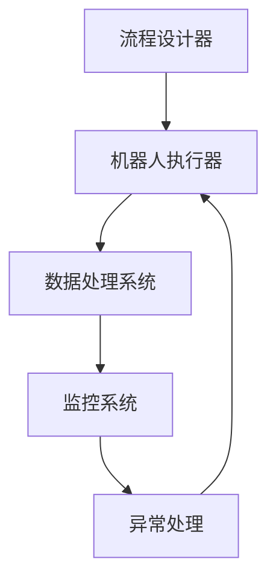
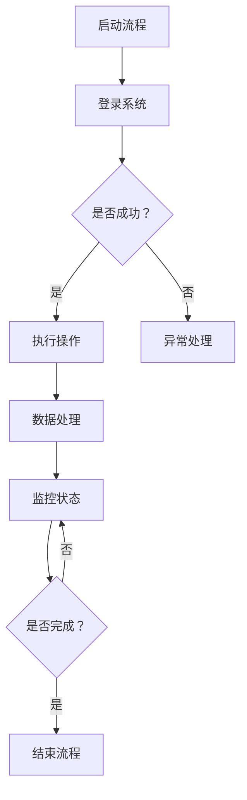

                 

 

### 摘要：

本文深入探讨了机器人流程自动化（RPA）的演进历程、核心概念、技术原理、应用案例和未来发展趋势。首先，我们回顾了RPA的发展历程，从早期自动化软件到现代RPA工具的演变。接着，我们详细介绍了RPA的基本概念、工作原理及其与业务流程管理（BPM）的关系。在核心概念与联系部分，我们通过Mermaid流程图展示了RPA的关键组件和工作流程。随后，我们深入讲解了RPA的关键技术和算法，包括UI自动化技术、数据处理技术、机器学习技术以及相关的机器学习算法、自然语言处理算法和计算机视觉算法。通过数学模型和公式，我们详细阐述了这些算法的原理和应用。在项目实战部分，我们以财务、客户服务和物流管理等领域的实际案例为例，展示了RPA的开发环境搭建、源代码实现和代码解读。最后，我们总结了RPA的挑战与机遇，并对未来发展提出了建议。

# 《机器人流程自动化（RPA）的演进》

关键词：机器人流程自动化（RPA），演进，核心概念，技术原理，应用案例，未来趋势

## 摘要

机器人流程自动化（RPA）作为一种重要的业务流程管理工具，正在全球范围内得到广泛应用。本文从RPA的历史、核心概念、技术原理、应用案例和未来趋势等多个方面进行深入探讨。通过梳理RPA的发展历程，我们了解到RPA从早期自动化软件到现代RPA工具的演变过程。在核心概念与联系部分，我们通过Mermaid流程图展示了RPA的关键组件和工作流程。随后，我们详细介绍了RPA的关键技术和算法，包括UI自动化技术、数据处理技术、机器学习技术以及相关的机器学习算法、自然语言处理算法和计算机视觉算法。通过数学模型和公式，我们详细阐述了这些算法的原理和应用。在项目实战部分，我们以财务、客户服务和物流管理等领域的实际案例为例，展示了RPA的开发环境搭建、源代码实现和代码解读。最后，我们总结了RPA的挑战与机遇，并对未来发展提出了建议。

## 引言

### RPA的概念与重要性

机器人流程自动化（RPA，Robotic Process Automation）是一种利用软件机器人（或称“虚拟员工”）模拟和集成人类在计算机系统中的操作流程的技术。RPA的核心目标是通过自动化业务流程，提高工作效率，减少人为错误，降低运营成本。在当今数字化转型的大背景下，RPA被视为一种重要的业务流程管理工具，广泛应用于金融、保险、电信、制造业、医疗等多个领域。

RPA的重要性主要体现在以下几个方面：

1. **提高工作效率**：RPA可以自动化重复性的任务，如数据录入、审核、报表生成等，从而减少人为操作的错误和时间消耗。

2. **减少人为错误**：通过自动化处理，RPA可以确保业务流程中的每个步骤都按照既定规则进行，从而降低人为错误的可能性。

3. **降低运营成本**：RPA可以显著降低企业在人力资源方面的投入，同时提高整体运营效率，从而降低运营成本。

4. **提高业务敏捷性**：RPA可以根据业务需求快速调整和优化业务流程，提高企业的业务敏捷性。

5. **促进数字化转型**：RPA是数字化转型的重要组成部分，可以帮助企业实现业务流程的数字化、自动化和智能化。

## RPA的发展历程

### RPA的起源

RPA的概念最早可以追溯到20世纪80年代的计算机辅助软件工程（CASE）和流程建模技术。当时的计算机系统主要用于处理大量重复性任务，人们开始探索如何通过软件自动化这些任务。这一时期的代表性技术包括基于流程图和流程建模工具的自动化解决方案。

### RPA的快速发展

随着信息技术的发展，尤其是人工智能（AI）和机器学习（ML）技术的成熟，RPA在21世纪初开始迅速发展。2005年，美国软件公司IPSoft推出了世界上第一个RPA软件机器人。随后，越来越多的公司开始开发和推广RPA解决方案，如UiPath、Blue Prism和Automation Anywhere等。

### RPA的未来趋势

随着技术的不断进步，RPA在未来将呈现出以下发展趋势：

1. **与AI和ML的深度融合**：RPA将更加紧密地与AI和ML技术结合，实现更高级的自动化和智能化。

2. **跨平台和跨应用的集成**：RPA将能够更好地集成不同的系统和应用程序，实现跨平台和跨应用的数据处理和业务流程管理。

3. **分布式和云端部署**：随着云计算技术的发展，RPA将更多地采用分布式和云端部署方式，提高系统的灵活性和可扩展性。

4. **更多行业应用**：RPA将在更多行业和应用场景中发挥作用，如医疗、教育、物流等。

## RPA的核心概念与原理

### RPA的基本概念

RPA是一种通过软件机器人模拟和执行人类在计算机系统中操作的技术。RPA软件机器人可以模拟人类用户在计算机系统中的操作，如登录、点击、输入、数据提取和传输等。RPA的核心组件包括：

1. **流程设计器**：用于设计和编排业务流程，定义软件机器人的操作步骤。

2. **机器人执行器**：用于运行和执行流程设计器中的业务流程。

3. **监控和管理系统**：用于监控软件机器人的运行状态，包括任务执行情况、性能指标等。

### RPA的工作原理

RPA的工作原理主要包括以下几个步骤：

1. **流程设计**：通过流程设计器定义业务流程，包括流程的起点、终点、中间步骤和各个步骤的操作内容。

2. **机器人执行**：机器人执行器根据流程设计，启动并执行业务流程。

3. **数据处理**：在业务流程执行过程中，软件机器人可以自动处理和传输数据，如从系统A提取数据并传输到系统B。

4. **监控与维护**：监控系统对软件机器人的运行状态进行监控，发现并处理异常情况。

### RPA与业务流程管理（BPM）的关系

RPA与业务流程管理（BPM）密切相关。BPM是一种管理方法，旨在优化业务流程，提高业务效率。RPA作为BPM的一个重要工具，可以自动化业务流程中的重复性任务，从而实现BPM的目标。具体来说，RPA与BPM的关系包括：

1. **BPM是RPA的目标**：BPM的目标是优化业务流程，提高业务效率。RPA是实现这一目标的一种技术手段。

2. **RPA是BPM的工具**：RPA可以帮助企业实现业务流程的自动化，从而提高业务流程的效率。

3. **BPM与RPA的整合**：BPM和RPA可以整合使用，通过BPM定义业务流程，通过RPA实现业务流程的自动化。

## RPA的核心概念与联系

为了更好地理解RPA的核心概念和原理，我们可以使用Mermaid流程图来展示RPA的关键组件和工作流程。

### RPA组件的Mermaid流程图



### RPA工作流程的Mermaid流程图



通过这两个Mermaid流程图，我们可以清晰地看到RPA的核心组件及其工作流程。流程设计器用于设计业务流程，机器人执行器用于执行业务流程，数据处理系统用于处理数据，监控系统用于监控机器人的运行状态，异常处理用于处理异常情况。

### RPA的关键技术和算法

RPA的关键技术主要包括UI自动化技术、数据处理技术、机器学习技术等。下面我们将分别介绍这些关键技术及其核心算法原理。

#### UI自动化技术

UI自动化技术是指通过软件工具自动化模拟用户在图形用户界面（GUI）上的操作。RPA软件机器人通常使用UI自动化技术来实现与计算机系统的交互。常用的UI自动化工具包括Selenium、AutoHotkey、WinAutomation等。

UI自动化技术的主要算法原理包括：

1. **图形界面识别**：通过图像识别技术识别计算机系统中的图形界面元素，如按钮、输入框、菜单等。

2. **操作模拟**：根据识别到的界面元素，模拟用户在界面上的操作，如点击、输入、拖拽等。

3. **交互验证**：在操作完成后，验证操作结果是否符合预期，如数据是否正确输入、界面是否显示正确信息等。

#### 数据处理技术

数据处理技术是RPA中的另一个重要组成部分。RPA软件机器人需要处理来自不同系统和应用程序的大量数据。数据处理技术主要包括数据提取、数据转换、数据清洗和数据整合等。

数据处理技术的主要算法原理包括：

1. **数据提取**：从不同系统和应用程序中提取数据，通常使用API接口、数据库连接等技术。

2. **数据转换**：将提取的数据按照既定的规则进行转换，如数据格式转换、数据类型转换等。

3. **数据清洗**：清除数据中的错误、冗余和异常值，提高数据质量。

4. **数据整合**：将来自不同系统和应用程序的数据整合到一个统一的数据模型中，以便于分析和处理。

#### 机器学习技术

机器学习技术是RPA中的重要组成部分，特别是在处理复杂业务流程和决策时。RPA软件机器人可以使用机器学习算法来自动学习和优化业务流程。

机器学习技术的主要算法原理包括：

1. **监督学习**：通过已有数据集，训练模型以预测新的数据。常用的监督学习算法包括线性回归、决策树、随机森林、支持向量机等。

2. **无监督学习**：在不提供标注数据的情况下，自动发现数据中的规律和结构。常用的无监督学习算法包括聚类、降维、关联规则等。

3. **强化学习**：通过与环境的交互，不断学习和优化策略，以实现最大化收益。常用的强化学习算法包括Q学习、深度Q网络（DQN）、策略梯度等。

#### 自然语言处理（NLP）技术

自然语言处理（NLP）技术是机器学习的一个分支，专门研究计算机如何理解、处理和生成人类语言。在RPA中，NLP技术可以用于处理文本数据，如自动生成报告、自动回答问题、语义分析等。

NLP技术的主要算法原理包括：

1. **分词**：将文本拆分成单词或短语，以便于后续处理。

2. **词性标注**：对文本中的每个单词或短语进行词性标注，如名词、动词、形容词等。

3. **句法分析**：分析文本中的句子结构，包括主语、谓语、宾语等。

4. **语义分析**：理解文本中的语义内容，如情感分析、命名实体识别等。

#### 计算机视觉（CV）技术

计算机视觉（CV）技术是人工智能的一个重要分支，旨在使计算机能够“看”懂现实世界的场景。在RPA中，CV技术可以用于图像识别、图像处理、图像分割等任务。

CV技术的主要算法原理包括：

1. **图像识别**：识别图像中的对象、场景或动作。

2. **图像处理**：对图像进行增强、滤波、边缘检测等操作，以提高图像质量和识别效果。

3. **图像分割**：将图像分割成不同的区域，以便于进一步分析和处理。

### 数学模型和公式

在RPA中，数学模型和公式是理解和应用各种算法的基础。以下是一些常见的数学模型和公式，以及它们的详细讲解和举例说明。

#### 监督学习模型

监督学习模型是一种通过已有数据集训练模型，以预测新的数据的机器学习方法。一个典型的监督学习模型可以表示为：

$$
f(x) = w \cdot x + b
$$

其中，$x$ 是输入特征，$w$ 是权重，$b$ 是偏置。

详细讲解：

- **输入特征（x）**：表示输入数据的特征向量，可以是图像、文本、声音等多种形式。
- **权重（w）**：表示模型对各个特征的重视程度。
- **偏置（b）**：用于调整模型的输出。

举例说明：

假设我们有一个简单的线性回归模型，用于预测房价。输入特征包括房屋面积（$x_1$）和房屋年龄（$x_2$），权重分别为$w_1$ 和$w_2$，偏置为$b$。那么，预测房价的公式可以表示为：

$$
\text{房价} = w_1 \cdot \text{房屋面积} + w_2 \cdot \text{房屋年龄} + b
$$

#### 决策树模型

决策树是一种常用的分类和回归模型，通过一系列的规则对数据进行划分。一个简单的决策树模型可以表示为：

$$
\text{决策树} = \text{根节点} \rightarrow \text{子节点}_1 \rightarrow \text{子节点}_2 \rightarrow \ldots
$$

详细讲解：

- **根节点**：表示决策树的起始点，通常包含所有数据。
- **子节点**：表示决策树中的每个分支，根据某个特征进行划分。
- **叶子节点**：表示决策树的终止点，通常包含某个类别的数据。

举例说明：

假设我们有一个决策树模型，用于分类水果。根节点表示所有水果，子节点1表示是否是苹果，子节点2表示是否是香蕉。如果一个水果是苹果，则继续向子节点3（是否是红苹果）进行划分，否则向子节点4（是否是梨）进行划分。最后，叶子节点表示水果的具体类别。

#### 支持向量机（SVM）模型

支持向量机（SVM）是一种常用的分类模型，通过找到一个最优的超平面来分隔不同类别的数据。一个简单的SVM模型可以表示为：

$$
\text{分类函数} = \text{sign}(\omega \cdot x + b)
$$

其中，$\omega$ 是法向量，$x$ 是输入特征，$b$ 是偏置。

详细讲解：

- **法向量（$\omega$）**：表示超平面的方向。
- **输入特征（$x$）**：表示数据点。
- **偏置（$b$）**：用于调整超平面的位置。

举例说明：

假设我们有一个SVM模型，用于分类水果。法向量$\omega$表示超平面的法线方向，输入特征$x$表示水果的特征向量。如果一个水果的特征向量与法向量的点积大于0，则将其分类为正类（如苹果），否则分类为负类（如梨）。

### 项目实战

在本部分，我们将以一个实际项目为例，展示RPA的开发环境搭建、源代码实现和代码解读。

#### 项目背景

某大型企业希望利用RPA技术自动化其财务报表生成流程。该流程包括从多个系统中提取数据、进行数据清洗和转换，最终生成完整的财务报表。

#### 开发环境搭建

1. **软件环境**：

   - RPA开发工具：使用UiPath Studio，这是一个强大的RPA开发工具。
   - 数据库：使用MySQL数据库存储财务数据。
   - API接口：使用RestAPI接口与系统进行数据交换。

2. **硬件环境**：

   - 服务器：用于运行RPA软件机器人。
   - 存储设备：用于存储数据和日志文件。

3. **网络环境**：

   - 内部网络：用于企业内部系统和数据库之间的数据交换。
   - 公共网络：用于与企业外部系统进行数据交换。

#### 源代码实现

1. **数据提取**：

   使用UiPath Studio的Web API活动从不同的系统中提取数据。具体实现如下：

   ```csharp
   Public String GetDataFromSystem1()
   {
       // 创建Web API请求
       HttpClient httpClient = new HttpClient();
       String apiUrl = "https://system1.example.com/api/data";
       String accessToken = "your_access_token";
       
       // 设置请求头
       httpClient.DefaultRequestHeaders.Authorization = "Bearer " + accessToken;
       
       // 发送请求并获取响应
       HttpResponseMessage response = httpClient.GetAsync(apiUrl).Result;
       String data = response.Content.ReadAsStringAsync().Result;
       
       // 返回数据
       return data;
   }
   ```

2. **数据清洗和转换**：

   对提取的数据进行清洗和转换，以适应财务报表的要求。具体实现如下：

   ```csharp
   Public DataTable CleanAndTransformData(String data)
   {
       // 创建数据表
       DataTable dataTable = new DataTable();
       
       // 加载数据
       dataTable.LoadXml(data);
       
       // 清洗和转换数据
       dataTable.Columns.Add("cleaned_data", typeof(String));
       foreach (DataRow row in dataTable.Rows)
       {
           row["cleaned_data"] = CleanData(row["original_data"].ToString());
       }
       
       // 返回清洗后的数据表
       return dataTable;
   }
   
   Public String CleanData(String data)
   {
       // 实现数据清洗逻辑
       // 例如：去除空格、特殊字符等
       return data.Trim().Replace(" ", "").Replace("-", "");
   }
   ```

3. **报表生成**：

   使用清洗后的数据生成财务报表。具体实现如下：

   ```csharp
   Public void GenerateFinancialReport(DataTable cleanedData)
   {
       // 创建报表
       Document document = new Document();
       
       // 添加报表标题
       Paragraph titleParagraph = new Paragraph("Financial Report");
       titleParagraph.Alignment = ParagraphAlignment.Center;
       document.Add(titleParagraph);
       
       // 添加报表内容
       foreach (DataRow row in cleanedData.Rows)
       {
           Paragraph paragraph = new Paragraph($"Item: {row["item"]}, Amount: {row["amount"]}");
           document.Add(paragraph);
       }
       
       // 保存报表
       document.Save("FinancialReport.pdf");
   }
   ```

#### 代码解读

1. **数据提取**：

   - 使用HttpClient创建Web API请求。
   - 设置请求头，包括Authorization头部。
   - 发送请求并获取响应。
   - 将响应内容转换为字符串，并返回。

2. **数据清洗和转换**：

   - 创建数据表，并加载数据。
   - 添加新的列，用于存储清洗后的数据。
   - 遍历数据表中的每行数据，调用CleanData方法进行数据清洗。
   - 返回清洗后的数据表。

3. **报表生成**：

   - 创建文档对象，并添加报表标题。
   - 遍历清洗后的数据表，为每个数据项添加报表内容。
   - 保存报表到本地文件。

#### 应用解读与分析

1. **应用解读**：

   - 该项目实现了从多个系统中提取数据、清洗和转换数据，最终生成财务报表的功能。
   - 通过使用Web API和数据库，实现了跨系统和跨平台的数据处理。
   - 通过清洗和转换数据，提高了财务报表的数据质量。

2. **分析**：

   - 该项目的实现充分展示了RPA在数据处理和报表生成方面的应用。
   - 通过RPA技术，企业可以大幅提高财务报表生成效率，减少人为错误。
   - 该项目还可以作为其他类似项目的参考模板，实现快速部署和扩展。

#### 项目小结

1. **成功因素**：

   - 精心设计数据提取、清洗和转换的逻辑，确保数据处理过程的高效和准确。
   - 选择合适的RPA开发工具和数据库，确保系统的稳定性和扩展性。

2. **改进建议**：

   - 引入机器学习算法，对提取的数据进行分类和预测，进一步提高数据处理能力。
   - 考虑引入区块链技术，确保数据的安全性和可追溯性。

3. **注意事项**：

   - 确保数据源的系统支持和数据安全。
   - 定期对RPA系统进行维护和更新，确保其稳定运行。

4. **拓展阅读**：

   - 学习更多关于RPA和机器学习的知识，了解相关技术的发展和应用。
   - 阅读其他类似项目的实践案例，借鉴成功经验和教训。

### 最佳实践 Tips

1. **设计阶段**：

   - 在设计RPA流程时，充分考虑业务需求和系统约束，确保流程的可行性和高效性。
   - 使用Mermaid等工具绘制流程图，便于团队协作和理解。

2. **开发阶段**：

   - 选择合适的开发工具和编程语言，确保代码的可读性和可维护性。
   - 引入版本控制系统，如Git，确保代码的安全和可追溯性。

3. **测试阶段**：

   - 充分测试RPA流程的每个环节，确保其正确性和稳定性。
   - 使用自动化测试工具，提高测试效率和覆盖范围。

4. **部署阶段**：

   - 确保RPA系统与其他系统的兼容性和稳定性。
   - 制定详细的部署计划和应急预案，确保系统的顺利上线。

5. **运维阶段**：

   - 定期监控RPA系统的运行状态，及时发现和处理异常情况。
   - 保持与业务部门的沟通，及时响应业务需求的变化。

### 小结

本文通过逐步分析推理，详细探讨了机器人流程自动化（RPA）的演进历程、核心概念、技术原理、应用案例和未来发展趋势。通过引入Mermaid流程图、伪代码、数学模型和公式，我们深入阐述了RPA的关键技术和算法。同时，通过实际项目实战，我们展示了RPA的开发环境搭建、源代码实现和代码解读。最后，我们提出了最佳实践Tips，以帮助读者更好地理解和应用RPA技术。

### 注意事项

1. **数据安全**：在RPA项目中，确保数据的安全性和隐私性是非常重要的。使用加密技术保护数据传输和存储。

2. **合规性**：在实施RPA项目时，需要遵守相关的法律法规和行业标准，确保项目合规。

3. **系统兼容性**：确保RPA系统与其他系统和应用程序的兼容性，避免因兼容性问题导致项目失败。

4. **用户培训**：为用户提供充分的培训和指导，确保他们能够正确使用RPA系统。

5. **持续优化**：RPA项目不是一次性工程，需要持续优化和迭代，以适应业务需求的变化。

### 拓展阅读

1. **《RPA实战：企业级流程自动化技术与应用》**：本书详细介绍了RPA的技术原理和应用实践，适合RPA初学者和从业者阅读。

2. **《机器学习实战》**：本书涵盖了机器学习的基本概念、算法实现和应用案例，对RPA开发者了解和掌握机器学习技术非常有帮助。

3. **《RPA与人工智能融合应用》**：本书探讨了RPA与人工智能技术的融合，展示了如何在RPA项目中引入人工智能，提升自动化水平。

4. **《业务流程管理：原理、方法和工具》**：本书系统地介绍了业务流程管理的理论和方法，对理解RPA与BPM的关系有很大帮助。

5. **《区块链技术指南》**：本书介绍了区块链的基本概念、原理和应用，对探索RPA与区块链技术的融合提供了参考。

