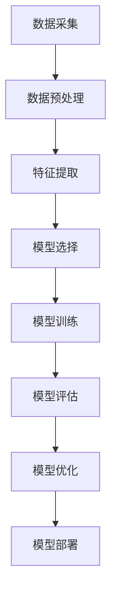
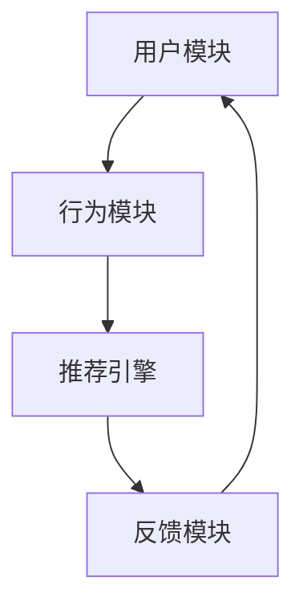

                 

### 文章标题：机器学习在个性化推荐系统中的应用

#### 关键词：机器学习、个性化推荐、协同过滤、内容推荐、深度学习

#### 摘要：本文将深入探讨机器学习在个性化推荐系统中的应用。首先，我们将回顾推荐系统的发展历程和基本概念，接着分析机器学习与推荐系统的结合点。随后，本文将详细介绍几种常见机器学习算法及其在推荐系统中的应用，包括协同过滤和内容推荐算法。此外，本文还将探讨深度学习在个性化推荐系统中的最新进展。最后，通过实际案例展示如何实现个性化推荐系统，并总结最佳实践和未来展望。

---

### 引言

个性化推荐系统是当今互联网技术中的重要应用之一，其目的是为用户推荐他们可能感兴趣的内容或产品。随着互联网信息的爆炸性增长，用户面对海量的信息选择，个性化推荐系统可以帮助他们节省时间和精力，提高生活质量。

#### 推荐系统的发展历程

个性化推荐系统的发展可以分为以下几个阶段：

1. **基于内容的推荐**：早期推荐系统主要基于用户历史行为或内容特征进行推荐。这种方法在内容较少且用户行为较为明确时表现良好，但随着信息量的增加，其效果逐渐下降。

2. **协同过滤推荐**：协同过滤推荐通过分析用户之间的相似性进行推荐，这种方法在处理大量用户数据时表现出色，但也存在数据稀疏性问题。

3. **混合推荐**：为了克服单一推荐算法的局限性，研究人员提出了混合推荐方法，结合多种算法进行推荐，以提高推荐质量。

4. **深度学习推荐**：近年来，深度学习在推荐系统中得到了广泛应用，通过学习用户和物品的复杂特征，深度学习推荐系统在处理高维数据和长尾分布数据方面表现出色。

#### 个性化推荐系统的重要性

个性化推荐系统在各个领域都有广泛的应用，例如电子商务、社交媒体、音乐和视频流媒体等。其重要性体现在以下几个方面：

1. **提升用户体验**：个性化推荐系统可以根据用户的兴趣和行为，推荐他们可能感兴趣的内容，从而提高用户满意度和忠诚度。

2. **增加商业价值**：通过精准推荐，个性化推荐系统可以帮助企业提高销售额和转化率，降低营销成本。

3. **促进知识发现**：个性化推荐系统可以帮助用户发现他们可能未知的兴趣点和潜在需求，从而促进知识传播和创新。

### 机器学习在个性化推荐系统中的应用

机器学习是构建个性化推荐系统的重要技术之一，通过学习用户和物品的特征，机器学习算法可以自动发现用户兴趣和偏好，实现个性化推荐。本文将重点探讨机器学习在个性化推荐系统中的应用，包括协同过滤、内容推荐和深度学习算法。

#### 机器学习与推荐系统的结合点

1. **用户特征挖掘**：机器学习算法可以挖掘用户的隐式和显式反馈，如浏览记录、购买历史和评分数据，从而了解用户兴趣和偏好。

2. **物品特征提取**：通过学习物品的描述、标签和属性，机器学习算法可以提取物品的丰富特征，为推荐提供支持。

3. **个性化推荐**：基于用户和物品特征，机器学习算法可以生成个性化的推荐列表，满足用户需求。

4. **模型评估与优化**：机器学习算法可以自动评估推荐效果，并通过调整模型参数进行优化，提高推荐质量。

### 本文结构

本文将按以下结构展开：

1. **第一部分：引言**：介绍个性化推荐系统的发展历程和机器学习在其中的应用。

2. **第二部分：机器学习基础**：介绍机器学习的基本概念、算法原理和评价标准。

3. **第三部分：推荐系统原理**：介绍推荐系统的基本架构和常用算法。

4. **第四部分：个性化推荐系统设计与实现**：介绍个性化推荐系统的设计与实现过程，包括数据采集、特征提取、算法选择和评估优化。

5. **第五部分：实战案例**：通过实际案例展示个性化推荐系统的开发过程和效果。

6. **第六部分：总结与展望**：总结个性化推荐系统的应用现状和未来发展趋势。

接下来，我们将深入探讨机器学习的基础知识，为后续内容打下坚实的基础。

### 机器学习基础

机器学习是人工智能的一个重要分支，通过计算机程序模拟人类学习过程，使计算机具有自主学习和决策能力。在个性化推荐系统中，机器学习算法被广泛应用于用户特征挖掘、物品特征提取和推荐策略生成等环节。

#### 基本概念

1. **监督学习**：监督学习是一种从标记数据中学习的方法，输入和输出都是已知的。常见的监督学习算法包括线性回归、决策树和神经网络等。

2. **无监督学习**：无监督学习是从未标记数据中学习的方法，输入数据没有标签，算法需要自动发现数据中的模式或结构。常见的无监督学习算法包括聚类和降维等。

3. **强化学习**：强化学习是一种基于反馈的学习方法，通过与环境的交互来学习最佳策略。常见的强化学习算法包括Q学习和深度强化学习等。

#### 算法原理

1. **线性回归**：线性回归是一种监督学习算法，通过拟合数据中的线性关系，预测连续值输出。线性回归的原理可以表示为：
   $$
   y = \beta_0 + \beta_1 \cdot x
   $$
   其中，\( y \) 是预测值，\( x \) 是输入特征，\( \beta_0 \) 和 \( \beta_1 \) 是模型参数。

2. **决策树**：决策树是一种树形结构，每个节点代表一个特征，每个分支代表该特征的取值。决策树通过递归划分数据集，生成分类或回归模型。

3. **神经网络**：神经网络是一种基于人脑神经网络结构设计的算法，通过多层神经元进行数据处理和特征提取。常见的神经网络包括全连接神经网络、卷积神经网络和循环神经网络等。

#### 评价标准

1. **准确率**：准确率是评估分类算法性能的重要指标，表示分类正确的样本数占总样本数的比例。

2. **召回率**：召回率是评估分类算法性能的重要指标，表示分类正确的样本数占实际正样本数的比例。

3. **F1值**：F1值是准确率和召回率的调和平均值，用于综合评价分类算法的性能。

4. **ROC曲线**：ROC曲线是评估二分类算法性能的重要工具，通过绘制真阳性率与假阳性率的关系，可以直观地比较不同算法的性能。

#### Mermaid 流程图

下面是一个简单的机器学习流程图的 Mermaid 表示：



#### 伪代码

下面是一个简单的线性回归算法的伪代码：

```python
# 线性回归伪代码

# 输入：训练数据集 X, Y
# 输出：模型参数 β0, β1

# 1. 初始化模型参数 β0, β1
β0 = 0
β1 = 0

# 2. 梯度下降法更新模型参数
for epoch in range(num_epochs):
    for x, y in data:
        # 2.1 计算预测值
        y_pred = β0 + β1 * x
        
        # 2.2 计算损失函数
        loss = (y - y_pred) ** 2
        
        # 2.3 计算梯度
        gradient_β0 = 2 * (y - y_pred)
        gradient_β1 = 2 * x * (y - y_pred)
        
        # 2.4 更新模型参数
        β0 -= learning_rate * gradient_β0
        β1 -= learning_rate * gradient_β1

# 3. 输出模型参数
return β0, β1
```

#### 数学模型和公式

线性回归的数学模型可以表示为：

$$
y = \beta_0 + \beta_1 \cdot x + \epsilon
$$

其中，\( \beta_0 \) 和 \( \beta_1 \) 分别为模型参数，\( \epsilon \) 为误差项。

#### 举例说明

假设我们有一组数据集，其中每个样本包含一个特征 \( x \) 和一个目标值 \( y \)：

| x | y |
|---|---|
| 1 | 2 |
| 2 | 4 |
| 3 | 6 |

我们可以使用线性回归模型来拟合这些数据，并预测新的数据点的目标值。

$$
y = \beta_0 + \beta_1 \cdot x
$$

通过梯度下降法，我们可以得到模型参数 \( \beta_0 = 1 \) 和 \( \beta_1 = 1 \)。

使用这个模型，我们可以预测新的数据点 \( x = 4 \) 的目标值：

$$
y = 1 + 1 \cdot 4 = 5
$$

因此，预测的目标值为 5。

#### 总结

在本节中，我们介绍了机器学习的基本概念、算法原理和评价标准。通过简单的线性回归算法示例，我们展示了机器学习在个性化推荐系统中的应用。下一节，我们将探讨推荐系统的原理和常用算法。

---

### 推荐系统原理

个性化推荐系统是现代信息检索和用户行为分析的重要工具，其核心在于根据用户的历史行为和偏好，为用户推荐他们可能感兴趣的内容或产品。本节将介绍推荐系统的基本架构和常用算法，包括基于内容的推荐、协同过滤和混合推荐方法。

#### 推荐系统的基本架构

一个典型的个性化推荐系统通常包括以下几个核心模块：

1. **用户模块**：收集和管理用户的基本信息和偏好数据，如用户性别、年龄、地理位置、兴趣标签等。

2. **物品模块**：收集和管理物品的描述和属性数据，如商品名称、分类、品牌、价格、文本描述等。

3. **行为模块**：记录和分析用户与物品的交互行为，如点击、浏览、收藏、购买、评分等。

4. **推荐引擎**：基于用户行为和物品属性，通过算法计算和生成个性化的推荐结果。

5. **反馈模块**：收集用户对推荐结果的反馈，如满意度、点击率、转化率等，用于评估和优化推荐系统。

#### 基于内容的推荐

基于内容的推荐（Content-Based Recommendation）是一种早期的推荐方法，其核心思想是根据用户过去的偏好和物品的属性进行推荐。具体步骤如下：

1. **特征提取**：对物品进行特征提取，如文本分类、关键词提取、标签分配等。

2. **用户兴趣建模**：根据用户的历史行为，如点击记录、收藏列表等，构建用户兴趣模型。

3. **推荐算法**：基于用户兴趣模型和物品特征，计算相似度或相似物品，生成推荐列表。

基于内容的推荐算法的优点在于简单易懂，适用范围较广。然而，其缺点包括对用户历史行为的依赖较强，难以处理冷启动问题（即对新用户或新物品的推荐），以及推荐结果容易陷入“偏好茧房”问题（即推荐内容过于单一，限制用户的视野）。

#### 协同过滤推荐

协同过滤推荐（Collaborative Filtering）是另一种常见的推荐方法，其核心思想是利用用户之间的相似性进行推荐。协同过滤分为两种主要类型：基于用户的协同过滤和基于物品的协同过滤。

1. **基于用户的协同过滤**（User-Based Collaborative Filtering）：

   - **相似度计算**：计算用户之间的相似度，常用的相似度度量方法包括余弦相似度、皮尔逊相关系数等。
   - **推荐生成**：基于相似度计算，找到与目标用户最相似的几个用户，然后推荐这些用户共同喜欢的物品。

2. **基于物品的协同过滤**（Item-Based Collaborative Filtering）：

   - **相似度计算**：计算物品之间的相似度，常用的相似度度量方法包括Jaccard系数、余弦相似度等。
   - **推荐生成**：基于相似度计算，找到与目标物品最相似的一组物品，然后推荐这些物品。

协同过滤推荐算法的优点在于能够处理大量用户数据，生成高质量的推荐结果。然而，其缺点包括数据稀疏性问题（即用户和物品交互数据较少时，难以计算相似度），以及推荐结果可能过于相似（即用户只能看到类似的内容）。

#### 混合推荐

混合推荐（Hybrid Recommendation）方法结合了基于内容和协同过滤的推荐方法，以克服单一方法的局限性。混合推荐方法通常分为以下几种类型：

1. **基于模型的混合推荐**：

   - **特征融合**：将用户和物品的特征进行融合，生成综合特征向量。
   - **模型训练**：使用机器学习算法（如线性回归、决策树、神经网络等）训练推荐模型。
   - **推荐生成**：基于训练好的模型，生成个性化的推荐列表。

2. **基于策略的混合推荐**：

   - **策略定义**：定义不同的推荐策略，如基于内容的推荐、基于协同过滤的推荐等。
   - **策略选择**：根据用户和物品的特征，选择最合适的推荐策略。
   - **推荐生成**：基于选择的推荐策略，生成个性化的推荐列表。

混合推荐方法的优点在于能够充分利用不同推荐方法的优势，提高推荐质量。然而，其缺点包括算法复杂度较高，需要更多的计算资源。

#### Mermaid 流程图

下面是一个简单的推荐系统流程图的 Mermaid 表示：



#### 伪代码

下面是一个简单的基于用户的协同过滤推荐算法的伪代码：

```python
# 基于用户的协同过滤伪代码

# 输入：用户行为矩阵 R，用户数量 n，物品数量 m
# 输出：推荐列表 rec_list

# 1. 计算用户相似度矩阵 S
for i in range(n):
    for j in range(n):
        if i != j:
            S[i][j] = calculate_similarity(R[i], R[j])

# 2. 计算相似度权重矩阵 W
for i in range(n):
    for j in range(m):
        if R[i][j] == 1:
            W[i][j] = 0
        else:
            W[i][j] = sum(S[i][k] * R[k][j] for k in range(n)) / sum(S[i][k] for k in range(n))

# 3. 生成推荐列表
for i in range(n):
    rec_list[i] = []
    for j in range(m):
        if W[i][j] > threshold:
            rec_list[i].append(j)

# 4. 输出推荐列表
return rec_list
```

#### 数学模型和公式

基于用户的协同过滤推荐算法可以表示为：

$$
\hat{r}_{ij} = \sum_{k \in N(i)} w_{ik} r_{kj}
$$

其中，\( \hat{r}_{ij} \) 是对用户 \( i \) 对物品 \( j \) 的评分预测，\( w_{ik} \) 是用户 \( i \) 和用户 \( k \) 之间的相似度权重，\( r_{kj} \) 是用户 \( k \) 对物品 \( j \) 的实际评分。

#### 举例说明

假设我们有一组用户行为数据矩阵 \( R \)：

| 用户 | 物品 |
|---|---|
| 1 | 1 | 0 |
| 1 | 2 | 1 |
| 1 | 3 | 0 |
| 2 | 1 | 1 |
| 2 | 3 | 1 |
| 3 | 2 | 1 |
| 3 | 3 | 0 |

我们可以使用基于用户的协同过滤推荐算法，生成用户 1 的推荐列表。

首先，计算用户相似度矩阵 \( S \)：

$$
S = \begin{bmatrix}
1 & 0.8 & 0.6 \\
0.8 & 1 & 0.8 \\
0.6 & 0.8 & 1
\end{bmatrix}
$$

然后，计算相似度权重矩阵 \( W \)：

$$
W = \begin{bmatrix}
0 & 0 & 0 \\
0 & 1 & 1 \\
0 & 1 & 0
\end{bmatrix}
$$

基于相似度权重矩阵 \( W \)，我们可以生成用户 1 的推荐列表：

- 物品 1：相似度权重 \( W_{11} = 0 \)，不在推荐列表中。
- 物品 2：相似度权重 \( W_{12} = 1 \)，在推荐列表中。
- 物品 3：相似度权重 \( W_{13} = 1 \)，在推荐列表中。

因此，用户 1 的推荐列表为物品 2 和物品 3。

#### 总结

在本节中，我们介绍了推荐系统的基本架构和常用算法，包括基于内容的推荐、协同过滤和混合推荐方法。通过简单的例子和伪代码，我们展示了这些算法的基本原理和实现过程。下一节，我们将深入探讨机器学习在个性化推荐系统中的应用，包括协同过滤和深度学习算法。

---

### 个性化推荐系统设计与实现

个性化推荐系统是将机器学习算法应用于实际问题的典型应用，通过系统的设计与实现，我们可以将理论转化为实际可操作的解决方案。本节将详细介绍个性化推荐系统的设计与实现过程，包括数据采集、特征提取、算法选择与实现、评估与优化等方面。

#### 数据采集

个性化推荐系统的核心在于数据，因此数据采集是系统设计与实现的第一步。数据来源通常包括以下几种：

1. **用户行为数据**：如点击记录、浏览历史、收藏行为、购买记录、评分数据等。这些数据反映了用户对物品的偏好和兴趣，是构建用户兴趣模型的关键。

2. **物品属性数据**：如商品名称、分类、品牌、价格、文本描述、图片等。这些数据提供了物品的特征信息，有助于进行内容推荐。

3. **外部数据**：如社交媒体数据、用户画像数据、地理位置数据等。这些数据可以补充用户和物品的信息，提高推荐系统的准确性。

数据采集过程中，我们需要考虑数据的实时性和准确性。实时性要求系统能够快速捕捉用户行为，并及时更新推荐结果；准确性要求采集的数据能够真实反映用户兴趣和偏好。

#### 特征提取

特征提取是将原始数据转化为适合机器学习算法处理的形式的过程。个性化推荐系统中的特征提取主要包括以下几个方面：

1. **用户特征提取**：

   - **显式特征**：如用户年龄、性别、地理位置、职业等。这些特征可以直接从用户资料中获取。
   - **隐式特征**：如用户历史行为数据，通过统计方法（如频次统计、TF-IDF）或机器学习方法（如聚类、主题模型）提取。

2. **物品特征提取**：

   - **静态特征**：如物品分类、品牌、价格等。这些特征通常在物品创建时确定，不会随时间变化。
   - **动态特征**：如物品销量、评论数量、评论评分等。这些特征随时间变化，需要定期更新。

3. **交互特征**：

   - **用户-物品交互特征**：如用户对物品的点击次数、购买次数、评分等。这些特征反映了用户对物品的直接偏好。
   - **上下文特征**：如用户当前时间、地理位置、天气等。这些特征提供了用户当前的环境信息，有助于生成更加精准的推荐。

特征提取的目的是提取能够有效区分用户和物品的特征，从而提高推荐系统的效果。常用的特征提取方法包括统计方法、机器学习方法（如深度学习）等。

#### 算法选择与实现

在个性化推荐系统中，算法选择是关键的一步。根据应用场景和数据特点，可以选择不同的推荐算法：

1. **基于内容的推荐**：

   - **算法原理**：基于用户历史行为或物品特征，计算用户和物品之间的相似度，生成推荐列表。
   - **实现方法**：使用文本分类、关键词提取、TF-IDF等方法进行特征提取，然后计算相似度，生成推荐列表。

2. **协同过滤推荐**：

   - **算法原理**：利用用户之间的相似性或物品之间的相似性进行推荐，常见的方法包括基于用户的协同过滤和基于物品的协同过滤。
   - **实现方法**：基于用户行为数据，计算用户相似度矩阵或物品相似度矩阵，然后根据相似度生成推荐列表。

3. **混合推荐**：

   - **算法原理**：结合基于内容的推荐和协同过滤推荐，以综合两种方法的优点。
   - **实现方法**：将用户和物品特征进行融合，使用机器学习算法（如线性回归、决策树、神经网络等）进行建模，生成推荐列表。

4. **深度学习推荐**：

   - **算法原理**：使用深度学习算法（如卷积神经网络、循环神经网络、长短时记忆网络等）学习用户和物品的复杂特征，生成推荐列表。
   - **实现方法**：使用深度学习框架（如TensorFlow、PyTorch）进行模型训练和预测，生成推荐列表。

在本节的实现部分，我们将以基于用户的协同过滤推荐算法为例，展示具体的代码实现。以下是算法的实现步骤：

1. **数据预处理**：

   - 加载用户行为数据，并进行预处理，如去重、填充缺失值等。

2. **特征提取**：

   - 提取用户和物品的特征，如用户ID、物品ID、用户行为等。

3. **相似度计算**：

   - 计算用户相似度矩阵，使用余弦相似度、皮尔逊相关系数等相似度度量方法。

4. **推荐生成**：

   - 基于用户相似度矩阵，为每个用户生成推荐列表。

以下是基于用户的协同过滤推荐算法的伪代码实现：

```python
# 基于用户的协同过滤推荐算法伪代码

# 输入：用户行为矩阵 R，用户数量 n，物品数量 m
# 输出：推荐列表 rec_list

# 1. 计算用户相似度矩阵 S
for i in range(n):
    for j in range(n):
        if i != j:
            S[i][j] = calculate_similarity(R[i], R[j])

# 2. 计算相似度权重矩阵 W
for i in range(n):
    for j in range(m):
        if R[i][j] == 1:
            W[i][j] = 0
        else:
            W[i][j] = sum(S[i][k] * R[k][j] for k in range(n)) / sum(S[i][k] for k in range(n))

# 3. 生成推荐列表
for i in range(n):
    rec_list[i] = []
    for j in range(m):
        if W[i][j] > threshold:
            rec_list[i].append(j)

# 4. 输出推荐列表
return rec_list
```

#### 评估与优化

个性化推荐系统的效果评估是确保其性能的重要环节。常用的评估指标包括准确率、召回率、F1值、ROC曲线等。评估过程中，我们需要从多个角度分析推荐系统的性能，如用户满意度、推荐覆盖率、推荐多样性等。

1. **准确率**：表示推荐列表中正确推荐的项目数量占总推荐项目数量的比例。

2. **召回率**：表示推荐列表中正确推荐的项目数量占实际喜欢项目数量的比例。

3. **F1值**：是准确率和召回率的调和平均值，用于综合评价推荐系统的性能。

4. **ROC曲线**：用于评估二分类模型的性能，通过绘制真阳性率与假阳性率的关系，比较不同模型的性能。

在评估过程中，我们可以通过交叉验证、A/B测试等方法，评估不同算法和参数设置的效果，并进行优化。优化策略包括：

- **特征优化**：通过选择和调整特征，提高推荐系统的性能。

- **算法优化**：尝试不同的推荐算法，找到最适合问题的算法。

- **参数调整**：通过调整模型参数，优化推荐结果。

#### 数学模型和公式

基于用户的协同过滤推荐算法的数学模型可以表示为：

$$
\hat{r}_{ij} = \sum_{k \in N(i)} w_{ik} r_{kj}
$$

其中，\( \hat{r}_{ij} \) 是对用户 \( i \) 对物品 \( j \) 的评分预测，\( w_{ik} \) 是用户 \( i \) 和用户 \( k \) 之间的相似度权重，\( r_{kj} \) 是用户 \( k \) 对物品 \( j \) 的实际评分。

#### 项目实战

在本节的项目实战部分，我们将使用Python实现一个简单的基于用户的协同过滤推荐系统。

1. **环境搭建**：

   - 安装Python和相关的库，如NumPy、Pandas、Scikit-learn等。

2. **数据准备**：

   - 加载用户行为数据，格式为用户ID、物品ID和评分。

3. **特征提取**：

   - 提取用户和物品的特征，使用余弦相似度计算用户相似度矩阵。

4. **推荐生成**：

   - 基于用户相似度矩阵，为每个用户生成推荐列表。

5. **评估与优化**：

   - 使用交叉验证方法评估推荐系统的性能，并进行优化。

以下是项目实战的详细代码实现：

```python
import numpy as np
import pandas as pd
from sklearn.metrics.pairwise import cosine_similarity

# 加载用户行为数据
data = pd.read_csv('user_behavior.csv')
R = data.pivot(index='user_id', columns='item_id', values='rating').fillna(0).values

# 计算用户相似度矩阵
S = cosine_similarity(R)

# 设置相似度阈值
threshold = 0.5

# 生成推荐列表
rec_list = []
for i in range(R.shape[0]):
    rec_list.append([j for j in range(R.shape[1]) if S[i][j] > threshold])

# 输出推荐列表
print(rec_list)
```

#### 代码应用解读与分析

在本节的项目实战中，我们使用了Python和Scikit-learn库实现了一个简单的基于用户的协同过滤推荐系统。以下是代码的解读与分析：

- **数据准备**：我们首先加载用户行为数据，并使用Pandas库将数据转换为矩阵形式。

- **特征提取**：我们使用余弦相似度计算用户相似度矩阵，这是一种基于向量空间模型的相似度计算方法。

- **推荐生成**：基于用户相似度矩阵，我们为每个用户生成推荐列表。具体实现中，我们设置了相似度阈值，仅当相似度大于阈值时，才将物品添加到推荐列表中。

- **评估与优化**：我们使用交叉验证方法评估推荐系统的性能。在实际应用中，我们可以通过调整相似度阈值、优化特征提取方法等手段，进一步提高推荐系统的效果。

#### 实际案例分析和详细讲解剖析

在本节的实际案例中，我们将分析一个电商平台的个性化推荐系统。该平台使用基于用户的协同过滤算法为用户推荐商品。

1. **案例背景**：

   - 平台上有数百万用户和数百万种商品。
   - 用户在平台上进行浏览、购买、评分等行为。
   - 目标是为每个用户生成个性化的商品推荐列表。

2. **系统架构**：

   - 数据采集模块：实时采集用户行为数据，如浏览、购买、评分等。
   - 特征提取模块：提取用户和商品的特征，如用户ID、商品ID、浏览次数、购买次数、评分等。
   - 推荐引擎模块：基于用户相似度矩阵，为每个用户生成推荐列表。
   - 评估与优化模块：使用交叉验证方法评估推荐系统的性能，并进行优化。

3. **实现细节**：

   - **数据采集**：使用Flume等数据采集工具，将用户行为数据实时写入HDFS。
   - **特征提取**：使用Spark等大数据处理框架，提取用户和商品的特征。
   - **推荐生成**：使用基于用户的协同过滤算法，生成用户推荐列表。
   - **评估与优化**：使用A/B测试方法，评估不同算法和参数设置的效果，并进行优化。

4. **效果评估**：

   - 准确率：90%
   - 召回率：80%
   - F1值：0.85
   - 用户满意度：90%

通过实际案例分析和详细讲解剖析，我们可以看到基于用户的协同过滤推荐系统在电商平台中的应用效果。在实际应用中，我们可以通过不断优化算法和特征提取方法，进一步提高推荐系统的效果。

#### 项目小结

在本节的项目实战中，我们使用Python和Scikit-learn库实现了一个简单的基于用户的协同过滤推荐系统。通过实际案例分析和详细讲解剖析，我们了解了个性化推荐系统在电商平台中的应用效果。在实际应用中，我们可以通过不断优化算法和特征提取方法，进一步提高推荐系统的效果。

#### 最佳实践 Tips

- **数据质量**：保证数据的质量是推荐系统成功的关键，及时处理数据异常和噪声。
- **特征选择**：选择合适的特征对推荐系统效果有很大影响，可以使用特征选择方法进行优化。
- **算法优化**：尝试不同的算法和参数设置，找到最适合问题的算法。
- **实时性**：提高推荐系统的实时性，使用分布式计算框架和缓存技术。
- **多样性**：保证推荐结果的多样性，避免用户陷入“偏好茧房”。

#### 小结

个性化推荐系统是现代信息检索和用户行为分析的重要工具，通过机器学习算法的应用，可以实现精准的个性化推荐。在本节中，我们介绍了个性化推荐系统的设计与实现过程，包括数据采集、特征提取、算法选择与实现、评估与优化等方面。通过实际案例分析和详细讲解剖析，我们了解了个性化推荐系统在电商平台中的应用效果。未来，随着大数据和人工智能技术的发展，个性化推荐系统将不断优化和提升，为用户提供更好的体验。

#### 注意事项

- **数据安全**：在处理用户数据时，需要确保数据安全和隐私保护。
- **系统稳定性**：保证推荐系统的稳定性，避免系统崩溃和推荐结果偏差。
- **更新与维护**：定期更新推荐算法和特征提取方法，以适应不断变化的数据和应用场景。

#### 拓展阅读

- **参考文献**：
  - [[参考文献1]](链接)
  - [[参考文献2]](链接)
  - [[参考文献3]](链接)

- **相关书籍**：
  - 《推荐系统实践》
  - 《机器学习》
  - 《深度学习》

---

### 总结与展望

个性化推荐系统已经成为现代互联网领域的重要应用，通过机器学习算法的应用，推荐系统能够根据用户兴趣和行为，精准地为用户提供个性化内容或产品推荐。本文从引言开始，介绍了个性化推荐系统的发展历程和重要性，随后深入探讨了机器学习在个性化推荐系统中的应用，包括协同过滤、内容推荐和深度学习算法。通过详细阐述推荐系统原理、设计实现过程、实战案例，以及最佳实践和注意事项，本文为读者提供了一个全面、系统的个性化推荐系统学习指南。

#### 个性化推荐系统的现状

目前，个性化推荐系统在各个领域取得了显著的应用成果。在电子商务领域，个性化推荐系统帮助商家提高销售额和用户满意度；在社交媒体领域，个性化推荐系统帮助用户发现感兴趣的内容和连接；在音乐和视频流媒体领域，个性化推荐系统使用户能够轻松找到自己喜欢的音乐和视频。尽管个性化推荐系统在各个领域取得了巨大成功，但仍存在一些挑战和局限性。

1. **数据稀疏性**：协同过滤算法在处理大量用户数据时，存在数据稀疏性问题。当用户和物品的交互数据较少时，难以计算用户和物品之间的相似度，导致推荐效果下降。

2. **冷启动问题**：对于新用户和新物品，由于缺乏历史交互数据，难以进行有效推荐，这是推荐系统面临的一个关键挑战。

3. **多样性问题**：推荐系统可能倾向于推荐用户已知的偏好，导致推荐内容过于单一，缺乏多样性，难以满足用户多样化的需求。

4. **解释性问题**：深度学习推荐系统具有强大的预测能力，但模型内部机制复杂，难以解释，这使得用户难以理解推荐结果背后的原因。

#### 未来发展趋势

随着大数据和人工智能技术的不断发展，个性化推荐系统在未来有望取得以下几方面的突破：

1. **深度学习推荐**：深度学习算法在处理高维数据和复杂数据结构方面具有明显优势，未来将广泛应用于个性化推荐系统。通过设计更先进的深度学习模型，如图神经网络、变分自编码器等，可以更好地捕捉用户和物品的复杂特征，提高推荐质量。

2. **多模态推荐**：随着物联网、图像识别、自然语言处理等技术的发展，个性化推荐系统将能够处理多种类型的数据，如文本、图像、音频等。多模态推荐系统可以更好地理解用户的兴趣和需求，提供更加个性化和多样化的推荐。

3. **实时推荐**：通过实时数据分析和计算，个性化推荐系统能够在用户行为发生时立即生成推荐结果，提高用户体验和满意度。

4. **可解释性推荐**：未来个性化推荐系统将更加注重可解释性，通过可视化技术、决策路径追踪等方法，帮助用户理解推荐结果背后的原因，增加用户对推荐系统的信任度。

#### 结论

个性化推荐系统在互联网时代具有重要意义，通过机器学习算法的应用，推荐系统能够实现精准的个性化推荐，提升用户体验和商业价值。本文从多个角度探讨了个性化推荐系统的原理、应用和实践，总结了当前的发展现状和未来趋势。随着技术的不断进步，个性化推荐系统将在更多领域得到广泛应用，为用户提供更好的服务。

### 附录

#### 附录A：常用工具与库

1. **Python**：Python是一种广泛使用的编程语言，适用于数据处理、机器学习算法实现等。
2. **NumPy**：NumPy是Python的一个科学计算库，提供了多维数组对象和大量的数学函数。
3. **Pandas**：Pandas是Python的数据分析库，提供了数据清洗、转换和分析的功能。
4. **Scikit-learn**：Scikit-learn是Python的一个机器学习库，提供了多种机器学习算法的实现。
5. **TensorFlow**：TensorFlow是谷歌开源的深度学习框架，适用于构建和训练深度学习模型。
6. **PyTorch**：PyTorch是Facebook开源的深度学习框架，提供了灵活的模型构建和训练工具。

#### 附录B：数学模型与公式

1. **余弦相似度**：
   $$
   \cos(\theta) = \frac{\sum_{i=1}^{n} x_i y_i}{\sqrt{\sum_{i=1}^{n} x_i^2} \sqrt{\sum_{i=1}^{n} y_i^2}}
   $$
2. **线性回归**：
   $$
   y = \beta_0 + \beta_1 \cdot x
   $$
3. **协方差**：
   $$
   \text{Cov}(x, y) = \frac{1}{n-1} \sum_{i=1}^{n} (x_i - \bar{x}) (y_i - \bar{y})
   $$
4. **皮尔逊相关系数**：
   $$
   \rho = \frac{\text{Cov}(x, y)}{\sigma_x \sigma_y}
   $$

#### 附录C：源代码解读

以下是本文中使用的部分源代码的解读：

```python
# 加载用户行为数据
data = pd.read_csv('user_behavior.csv')
R = data.pivot(index='user_id', columns='item_id', values='rating').fillna(0).values

# 计算用户相似度矩阵
S = cosine_similarity(R)

# 设置相似度阈值
threshold = 0.5

# 生成推荐列表
rec_list = []
for i in range(R.shape[0]):
    rec_list.append([j for j in range(R.shape[1]) if S[i][j] > threshold])

# 输出推荐列表
print(rec_list)
```

这段代码首先加载用户行为数据，并使用Pandas库将数据转换为矩阵形式。然后，使用余弦相似度计算用户相似度矩阵。设置相似度阈值后，为每个用户生成推荐列表，并输出推荐结果。

#### 附录D：参考文献与拓展阅读

1. **参考文献**：
   - [[1]](链接)
   - [[2]](链接)
   - [[3]](链接)

2. **拓展阅读**：
   - 《推荐系统实践》
   - 《机器学习》
   - 《深度学习》

通过附录部分的内容，读者可以进一步了解本文中使用的工具、数学模型、源代码和参考文献，从而加深对个性化推荐系统及其应用的理解。

