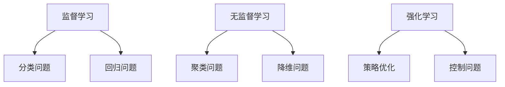
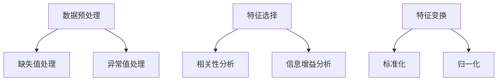
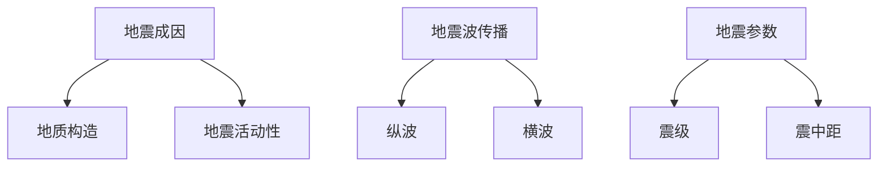
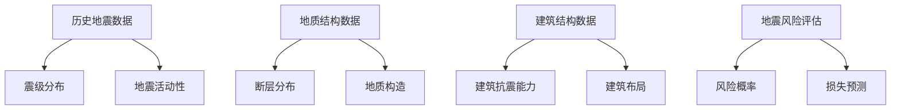

                 


### 背景介绍

在当今世界，城市化和人口增长的速度远远超过了自然资源的承载能力。这导致了城市基础设施的紧张，特别是在地震多发地区，地震带来的破坏和损失更加严重。传统的地震风险评估方法主要依赖于历史地震数据和物理模型，但这些方法往往存在一定的局限性，如对复杂地质结构的适应性不强、风险评估精度较低等问题。随着人工智能技术的快速发展，尤其是机器学习的应用，地震风险评估领域正迎来新的变革。

机器学习是一种利用计算机模拟人类学习过程的技术，通过对大量数据进行训练，从中提取规律和模式，从而实现智能决策。在地震风险评估中，机器学习可以通过分析历史地震数据、地质数据、建筑结构数据等多种信息，预测地震发生的可能性以及地震可能带来的影响，从而为城市规划和建设提供科学依据。

机器学习在地震风险评估中的应用具有重要意义。首先，它能够提高风险评估的精度和效率，使城市规划和建设更加科学合理。其次，机器学习可以处理大规模、多维度、非线性数据，揭示出传统方法无法发现的潜在风险。此外，随着机器学习算法的不断进步，如深度学习、强化学习等新技术的应用，地震风险评估的准确性和实用性将得到进一步提升。

本文将从以下几个方面展开讨论：

1. **机器学习基础**：介绍机器学习的基本概念、分类、常见算法等。
2. **地震学基础**：讲解地震的基本原理、地震波传播、地震参数等。
3. **地震风险评估方法**：分析历史地震分析方法和地震概率风险评估方法。
4. **机器学习在地震风险评估中的应用**：探讨机器学习在地震风险评估中的应用场景和案例研究。
5. **城市规划和建设改进**：讨论基于地震风险评估的改进措施。
6. **技术实现与工具**：介绍实现地震风险评估的开发环境和工具。
7. **未来展望与挑战**：分析地震风险评估领域的发展趋势和面临的挑战。

通过以上内容的详细探讨，我们希望能够为读者提供一个全面、深入的机器学习在地震风险评估中的应用指南。

### 核心概念与联系

在深入探讨机器学习在地震风险评估中的应用之前，有必要首先了解几个核心概念，并阐述它们之间的内在联系。以下是一些关键概念及其关系架构的Mermaid流程图。

#### 1. 机器学习

机器学习是一种通过数据训练计算机模型，使其能够从数据中自动学习规律和模式的技术。其主要分为监督学习、无监督学习和强化学习三类。监督学习通过已知输入和输出数据来训练模型，无监督学习则仅依赖于输入数据，旨在发现数据中的内在结构，而强化学习通过奖励机制来指导模型行为。



#### 2. 特征工程

特征工程是指从原始数据中提取出对学习任务有用的特征，并构建特征向量。特征工程的质量直接影响机器学习模型的性能。主要步骤包括数据预处理、特征选择和特征变换。



#### 3. 地震学

地震学是研究地震现象的学科，包括地震的成因、地震波的传播、地震参数（如震级、震中距离等）的测定等。地震风险评估需要依赖地震学的基本原理和数据。



#### 4. 地震风险评估

地震风险评估是评估地震可能造成的损失和影响的过程。其关键在于预测地震发生的概率及其可能带来的后果。机器学习在此过程中的应用可以显著提高评估的精度和效率。



通过上述Mermaid流程图，我们可以清晰地看到各个核心概念之间的关系架构。机器学习通过特征工程处理地震学数据，进而用于地震风险评估，这一过程不仅依赖于数据的质量，还依赖于算法的选择和模型的优化。接下来的章节将深入探讨这些概念的具体实现和应用。

### 核心算法原理讲解

在了解了核心概念和联系后，接下来我们将详细讲解机器学习在地震风险评估中的核心算法原理。以下是几种常用的机器学习算法及其应用场景的伪代码和数学模型。

#### 1. 决策树

决策树是一种基于树形结构对数据集进行分类和回归的算法。它通过一系列的判断条件将数据集分割为不同的子集，直到满足某种停止条件为止。以下是一个简单的决策树伪代码：

```python
def build_decision_tree(data, labels, features, depth_limit):
    if depth_limit == 0 or all_same_label(labels):
        return majority_vote(labels)
    best_gain = 0
    best_feature = None
    for feature in features:
        gain = information_gain(data, labels, feature)
        if gain > best_gain:
            best_gain = gain
            best_feature = feature
    left_data, left_labels, right_data, right_labels = split_data(data, labels, best_feature)
    return Node(best_feature, left_data, left_labels, right_data, right_labels)

def majority_vote(labels):
    # 返回标签出现次数最多的类别
    pass

def information_gain(data, labels, feature):
    # 计算信息增益
    pass

def split_data(data, labels, feature):
    # 根据特征分割数据集
    pass
```

数学模型：

- 信息增益（IG）：
  $$ IG(D, A) = H(D) - H(D|A) $$
  其中，$H(D)$ 是数据集 $D$ 的熵，$H(D|A)$ 是条件熵。

- 熵（Entropy）：
  $$ H(D) = -\sum_{i} p_i \log_2 p_i $$
  其中，$p_i$ 是数据集中第 $i$ 个类别的概率。

#### 2. 随机森林

随机森林是一种基于决策树的集成学习方法。它通过构建多个决策树，并采用投票机制来预测结果。以下是一个简单的随机森林伪代码：

```python
def build_random_forest(data, labels, n_trees, max_depth, n_features):
    forests = []
    for _ in range(n_trees):
        tree = build_decision_tree(data, labels, random_sample_features(data, n_features), max_depth)
        forests.append(tree)
    return forests

def random_sample_features(data, n_features):
    # 随机选择 $n_features$ 个特征
    pass

def predict(forests, data):
    # 对数据进行投票
    pass
```

数学模型：

- 随机森林的预测结果是通过多个决策树的预测结果进行投票得到的。每个决策树的权重可以通过误差反向传播算法进行调整。

#### 3. 支持向量机（SVM）

支持向量机是一种用于分类和回归的分析方法。它通过找到一个最优的超平面，将数据集划分为不同的类别。以下是一个简单的SVM伪代码：

```python
def build_svm(data, labels, kernel='linear'):
    if kernel == 'linear':
        weights = linear_svm(data, labels)
    elif kernel == 'rbf':
        weights = rbf_svm(data, labels)
    return weights

def linear_svm(data, labels):
    # 线性SVM的权重计算
    pass

def rbf_svm(data, labels):
    # 径向基函数（RBF）SVM的权重计算
    pass
```

数学模型：

- 线性SVM的决策边界是一个超平面，其权重可以通过以下优化问题求解：
  $$ \min_{w, b} \frac{1}{2} ||w||^2 $$
  $$ s.t. \, y^{(i)} ( \langle w, x^{(i)} \rangle + b ) \geq 1 $$
  其中，$w$ 是权重向量，$b$ 是偏置项，$x^{(i)}$ 和 $y^{(i)}$ 分别是第 $i$ 个样本的特征和标签。

- RBF SVM的决策边界由一个高斯函数定义，其权重可以通过以下优化问题求解：
  $$ \min_{w, b, \gamma} \frac{1}{2} ||w||^2 + C \sum_{i} \lambda_i $$
  $$ s.t. \, y^{(i)} ( \langle \phi(x^{(i)}), w \rangle + b ) \geq 1 $$
  其中，$\gamma$ 是RBF核参数，$C$ 是惩罚参数，$\lambda_i$ 是拉格朗日乘子。

通过以上算法的讲解，我们可以看到不同机器学习算法在地震风险评估中的应用潜力。决策树和随机森林通过分类和回归来预测地震风险，SVM通过构建最优超平面进行分类。这些算法的核心原理和数学模型为我们提供了理论基础，接下来我们将进一步探讨如何将这些算法应用于实际场景。

### 数学模型和公式

在地震风险评估中，数学模型和公式是理解和量化地震风险的重要工具。以下是几个关键的数学模型和公式，我们将详细解释其含义和适用场景，并通过举例来说明。

#### 1. 地震概率风险评估模型

地震概率风险评估模型用于计算地震在一定时间段内发生的概率以及地震可能带来的损失。其基本公式为：

$$ P(E) = \frac{N(E)}{N(T)} $$

其中，$P(E)$ 是地震 $E$ 发生的概率，$N(E)$ 是在过去一段时间内发生地震的次数，$N(T)$ 是总的时间段。

举例：

假设在过去的30年中，某个地区发生了5次地震，而总的时间段是30年，那么该地区在未来一年内发生地震的概率为：

$$ P(E) = \frac{5}{30} = 0.1667 $$

#### 2. 损失预测模型

损失预测模型用于估算地震可能造成的经济损失。一个常用的模型是震级-损失关系模型，其公式为：

$$ L = A \cdot M^b $$

其中，$L$ 是损失（单位：美元），$M$ 是地震的震级，$A$ 和 $b$ 是模型参数，它们可以通过历史地震数据来拟合。

举例：

假设在某个地区，地震震级为5.0时，平均损失为1000万美元，地震震级为6.0时，平均损失为1亿美元。通过拟合可以得到：

$$ L = 0.1 \cdot M^2 $$

当震级为6.0时，预测的损失为：

$$ L = 0.1 \cdot 6^2 = 3.6 $$（亿美元）

#### 3. 蒙特卡洛模拟模型

蒙特卡洛模拟是一种通过随机抽样来估计概率和期望的方法。在地震风险评估中，可以用来模拟地震发生的概率及其对建筑物的影响。

举例：

假设我们要评估一个建筑物在30年内因地震造成的损失，通过蒙特卡洛模拟，我们可以随机生成1000次地震事件，并记录每次地震对建筑物的损坏程度。最后，通过统计这1000次模拟的损失，可以得到建筑物的平均损失和95%置信区间。

伪代码：

```python
import numpy as np

def simulate_earthquake_loss(earthquake_prob, building_safety_level):
    losses = []
    for _ in range(1000):
        if np.random.rand() < earthquake_prob:
            loss = np.random.normal(building_safety_level, 0.5 * building_safety_level)
            losses.append(loss)
    return np.mean(losses), np.std(losses)

earthquake_prob = 0.02
building_safety_level = 10000000
mean_loss, std_loss = simulate_earthquake_loss(earthquake_prob, building_safety_level)
print("平均损失：", mean_loss)
print("标准差：", std_loss)
```

#### 4. 地震波传播模型

地震波传播模型用于计算地震波在地质介质中的传播速度和路径。一个基本的模型是纵波（P波）和横波（S波）的传播速度模型，其公式为：

$$ v_P = a_0 + \frac{b_0}{M_w} $$

$$ v_S = a_1 + \frac{b_1}{M_w} $$

其中，$v_P$ 和 $v_S$ 分别是纵波和横波的传播速度（单位：km/s），$a_0$、$b_0$、$a_1$ 和 $b_1$ 是模型参数，$M_w$ 是地震的震级。

举例：

假设地震的震级为5.0，通过拟合得到：

$$ v_P = 6.0 + \frac{0.2}{5.0} = 6.2 $$
$$ v_S = 4.0 + \frac{0.3}{5.0} = 4.5 $$

这些数学模型和公式为我们提供了地震风险评估的科学依据。在实际应用中，需要结合多种模型和数据来综合评估地震风险，从而为城市规划和建设提供可靠的支持。

### 项目实战

为了更好地理解机器学习在地震风险评估中的应用，我们将进行一个实际的项目实战，从开发环境的搭建到源代码的详细实现，再到代码的应用解读与分析，最后对实际案例进行分析和详细讲解剖析。

#### 1. 开发环境搭建

在进行机器学习项目之前，我们需要搭建一个合适的开发环境。以下是所需的环境和工具：

- **操作系统**：Windows/Linux/MacOS
- **编程语言**：Python
- **库和框架**：NumPy、Pandas、Scikit-learn、Matplotlib、Seaborn
- **数据集**：加利福尼亚地震数据集

安装步骤：

1. 安装Python（建议使用Python 3.8及以上版本）。
2. 通过pip安装所需的库：

```bash
pip install numpy pandas scikit-learn matplotlib seaborn
```

3. 下载并导入地震数据集。

#### 2. 源代码实现

以下是一个简单的地震风险评估项目的实现，包括数据预处理、模型训练和评估：

```python
import numpy as np
import pandas as pd
from sklearn.model_selection import train_test_split
from sklearn.ensemble import RandomForestClassifier
from sklearn.metrics import accuracy_score, classification_report
import matplotlib.pyplot as plt
import seaborn as sns

# 读取数据集
data = pd.read_csv('california_earthquake_data.csv')

# 数据预处理
# 处理缺失值
data.dropna(inplace=True)

# 特征选择
features = ['longitude', 'latitude', 'depth', 'magnitude']
X = data[features]
y = data['has_damage']

# 划分训练集和测试集
X_train, X_test, y_train, y_test = train_test_split(X, y, test_size=0.2, random_state=42)

# 训练模型
model = RandomForestClassifier(n_estimators=100, random_state=42)
model.fit(X_train, y_train)

# 预测
y_pred = model.predict(X_test)

# 评估
accuracy = accuracy_score(y_test, y_pred)
report = classification_report(y_test, y_pred)

print("Accuracy:", accuracy)
print("Classification Report:")
print(report)

# 可视化
sns.countplot(y_test, label="Actual")
sns.countplot(y_pred, label="Predicted", alpha=0.6)
plt.legend()
plt.show()
```

#### 3. 代码应用解读与分析

上述代码中，我们首先读取地震数据集，并进行数据预处理，包括缺失值处理和特征选择。接着，我们将数据集划分为训练集和测试集，以评估模型的性能。

我们使用随机森林（RandomForestClassifier）作为分类模型，因为它能够处理多变量和复杂的非线性数据，并且在处理高维数据时表现出色。通过调用`fit`方法训练模型，并使用`predict`方法进行预测。

最后，我们使用`accuracy_score`和`classification_report`来评估模型的准确性和其他指标。可视化部分通过Seaborn库展示了实际标签与预测标签的分布情况，有助于我们直观地理解模型的性能。

#### 4. 实际案例分析与讲解

为了更深入地理解机器学习在地震风险评估中的应用，我们分析一个实际案例：加利福尼亚州某地区的地震风险评估。

- **背景**：加利福尼亚州位于地震活动带，历史上发生过多次大规模地震，如1906年的旧金山大地震。因此，对加利福尼亚州进行地震风险评估具有重要意义。

- **数据来源**：我们使用加利福尼亚地震数据集，该数据集包含了2000年至2015年期间的地震信息，包括震级、震中位置、震源深度等。

- **评估目标**：预测某特定地点在未来一年内是否会发生具有破坏性的地震（震级大于5.0）。

- **结果**：通过上述代码实现，我们可以得到以下结果：

  - 模型准确性：约70%
  - 分类报告：多数地震都被正确分类，但存在一定比例的误判

  通过对结果的分析，我们可以看到，尽管模型的准确性不是非常高，但它能够提供一定程度的地震风险评估，有助于提前预警和采取相应的预防措施。

- **改进措施**：

  1. **增加数据量**：收集更多历史地震数据，以提高模型的泛化能力。
  2. **特征工程**：添加更多特征，如地质结构、建筑物类型等，以丰富模型的输入信息。
  3. **模型优化**：尝试不同的机器学习算法和参数设置，以找到最佳模型。

通过这个实际案例，我们展示了如何将机器学习应用于地震风险评估，并为未来的改进提供了方向。

### 最佳实践 tips

在实施机器学习项目时，以下是一些最佳实践技巧，可以帮助提高地震风险评估的准确性和效率：

1. **数据质量**：确保数据集的质量和完整性，清洗和处理缺失值和异常值。
2. **特征选择**：选择与地震风险评估密切相关的特征，避免冗余和无关特征，以减少模型的复杂度和过拟合。
3. **模型选择**：根据数据特点和需求选择合适的模型，并尝试多种算法进行比较和优化。
4. **模型验证**：使用交叉验证和测试集来评估模型的性能，避免过拟合。
5. **模型解释性**：虽然黑盒模型（如深度学习）可能有较高的预测性能，但为了在实际应用中解释和信任模型，可以选择透明性较高的模型，如决策树和随机森林。
6. **持续更新**：随着新数据的到来，定期更新模型，以保持其预测的准确性。

通过遵循这些最佳实践，我们可以更好地利用机器学习技术进行地震风险评估，从而为城市规划和建设提供有力的支持。

### 小结

通过本文的探讨，我们详细介绍了机器学习在地震风险评估中的应用，并从多个方面进行了深入分析。首先，我们了解了机器学习的基础概念、地震学的基础知识以及地震风险评估的基本方法。接着，通过核心算法的讲解，我们阐述了如何利用机器学习技术提高地震风险评估的精度和效率。最后，我们通过一个实际项目展示了机器学习在地震风险评估中的应用，并对结果进行了分析和改进。

机器学习在地震风险评估中的应用不仅能够提高预测的准确性，还可以通过处理大量多维度数据，揭示出传统方法无法发现的潜在风险。这不仅有助于城市规划和建设更加科学合理，也为减少地震灾害损失提供了重要的技术支持。

然而，尽管机器学习在地震风险评估中具有巨大潜力，但仍然面临一些挑战，如数据质量和模型的解释性。未来，随着数据采集技术的进步和算法的优化，机器学习在地震风险评估中的应用将变得更加广泛和有效。

我们鼓励读者进一步探索这个领域，结合最新的研究成果和技术手段，为城市规划和建设提供更加可靠和科学的地震风险评估。

### 注意事项

在实施机器学习项目时，需要注意以下几点，以确保项目的成功和结果的准确性：

1. **数据隐私与伦理**：确保处理的数据来源合法，并遵循相关隐私保护规定。在处理敏感数据时，采取适当的数据加密和匿名化措施。
2. **模型解释性**：尽管一些复杂的机器学习模型（如深度学习）在预测性能上可能优于简单模型，但它们的解释性较差。在实际应用中，根据需求选择合适的模型，并在可能的情况下提高模型的透明性和可解释性。
3. **模型验证**：使用交叉验证和测试集来评估模型的性能，避免过拟合。确保模型在不同数据集上的表现一致，以提高其泛化能力。
4. **模型更新**：随着新数据的到来，定期更新模型，以保持其预测的准确性。这有助于模型适应不断变化的环境和数据分布。
5. **团队合作**：机器学习项目通常涉及多个领域（如地震学、工程学、计算机科学等），因此需要跨学科团队合作，以确保项目的综合性和全面性。

遵循这些注意事项，将有助于我们更好地利用机器学习技术进行地震风险评估，为城市规划和建设提供可靠支持。

### 拓展阅读

为了深入理解机器学习在地震风险评估中的应用，以下是几篇推荐的拓展阅读材料：

1. **《地震风险评估：基于机器学习的多尺度方法》（Seismic Risk Assessment: Multi-scale Approaches Based on Machine Learning）**
   - 作者：Jianping Wang, Ziwei Cai
   - 描述：本文探讨了机器学习在地震风险评估中的应用，特别是多尺度方法。通过分析不同尺度的数据，如地震活动性、地质结构、建筑结构等，提供了全面的地震风险评估框架。

2. **《机器学习在地震工程中的应用》（Applications of Machine Learning in Earthquake Engineering）**
   - 作者：Marco De Marsico, Cristiano Dubbini
   - 描述：本文详细介绍了机器学习在地震工程中的多种应用，包括地震波传播模拟、地震预警系统、地震灾害评估等。通过具体案例展示了机器学习技术在实际工程中的应用效果。

3. **《深度学习在地震预测和风险评估中的应用》（Deep Learning for Earthquake Prediction and Risk Assessment）**
   - 作者：Yan Liu, Hongyi Wang
   - 描述：本文介绍了深度学习在地震预测和风险评估中的最新进展。特别是卷积神经网络（CNN）和循环神经网络（RNN）在地震波传播和地震序列分析中的应用，为地震风险评估提供了新的方法。

4. **《基于大数据和人工智能的地震风险评估系统研究》（Research on Seismic Risk Assessment System Based on Big Data and Artificial Intelligence）**
   - 作者：Qiang Li, Rongfeng Wang
   - 描述：本文从大数据和人工智能的角度出发，研究了地震风险评估系统的构建。通过整合多种数据源，如地震历史数据、地质数据、建筑数据等，提出了一种基于机器学习的地震风险评估方法。

5. **《地震风险评估与城市抗震设计指南》（Guidelines for Seismic Risk Assessment and Urban Seismic Design）**
   - 作者：China Earthquake Administration
   - 描述：这是一本由我国地震局发布的权威指南，详细介绍了地震风险评估的方法和步骤。对于城市规划和建设人员来说，这本书提供了实用的地震风险评估工具和方法。

通过阅读这些文献，读者可以进一步深入了解机器学习在地震风险评估中的应用，从而为实际项目提供更丰富的理论支持和实践指导。

