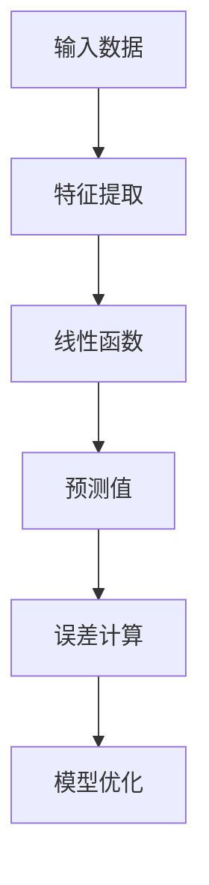
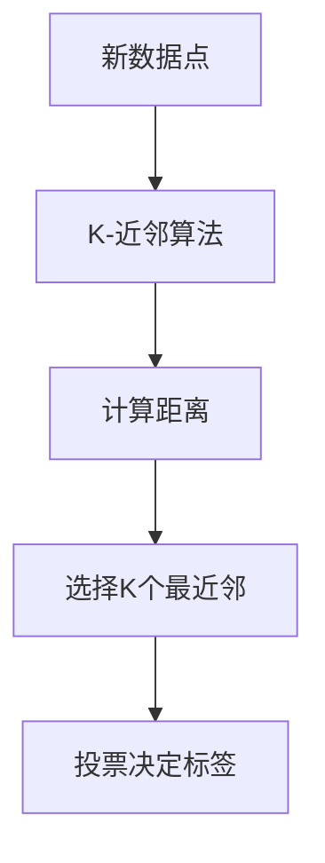
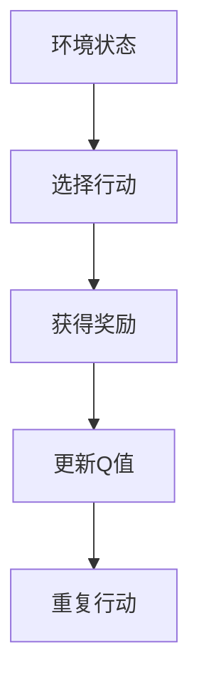

                 

### 文章标题：机器学习在网络安全态势感知中的应用：预测和防御网络攻击

#### 关键词：机器学习，网络安全，态势感知，预测，防御，网络攻击

#### 摘要：
本文深入探讨了机器学习在网络安全态势感知中的应用，重点分析了如何利用机器学习技术进行网络攻击预测和防御。文章首先介绍了机器学习的基本概念及其在网络安全领域的应用背景，随后详细阐述了核心算法原理，包括监督学习、非监督学习和强化学习。通过实际案例，展示了机器学习在DDoS攻击检测和恶意软件检测等具体场景中的实际应用。此外，文章还讨论了网络安全态势感知的关键环节，如事件检测、流量分析和安全事件预测。最后，提出了防御网络攻击的策略和措施，并展望了机器学习在网络安全领域的未来发展。

### 目录

----------------------------------------------------------------

## 第1章 引言

### 1.1 书籍背景与目标

- **背景介绍**
  - 机器学习在网络安全领域的重要性
  - 网络安全态势感知的概念与需求

- **目标**
  - 理解机器学习在网络安全中的角色
  - 掌握网络安全态势感知的基本原理

### 1.2 机器学习基础

- **核心概念与联系**
  - 监督学习、非监督学习和强化学习的关系架构
  - Mermaid流程图：展示三种学习方式的异同

### 1.3 本书结构安排与学习目标

- **章节安排**
  - 机器学习基础
  - 网络安全态势感知
  - 应用案例
  - 安全防御策略
  - 模型安全性与隐私保护
  - 未来趋势与展望

- **学习目标**
  - 理解并应用机器学习技术进行网络安全态势感知
  - 掌握网络攻击预测和防御的基本策略

----------------------------------------------------------------

## 第2章 机器学习基础

### 2.1 机器学习概述

- **核心概念**
  - 什么是机器学习
  - 机器学习的基本类型

- **算法原理**
  - 监督学习算法原理讲解与伪代码示例
  - 非监督学习算法原理讲解与伪代码示例
  - 强化学习算法原理讲解与伪代码示例

### 2.2 机器学习评估指标

- **评估方法**
  - 准确率、召回率、F1分数等评估指标的计算与解释

- **应用场景**
  - 不同评估指标在不同网络攻击预测场景中的应用

----------------------------------------------------------------

## 第3章 网络安全态势感知

### 3.1 网络安全态势感知概述

- **概念定义**
  - 网络安全态势感知的定义和意义

- **体系架构**
  - 网络安全态势感知的架构与组成部分

### 3.2 网络安全事件检测

#### 3.2.1 入侵检测系统

- **原理讲解**
  - 入侵检测系统的工作原理

- **案例解析**
  - 入侵检测系统的实际应用案例

#### 3.2.2 漏洞扫描

- **原理讲解**
  - 漏洞扫描的技术原理

- **案例解析**
  - 漏洞扫描工具的使用与效果评估

### 3.3 网络流量分析

- **原理讲解**
  - 网络流量分析的基本方法

- **应用实例**
  - 网络流量分析在实际网络安全中的应用

### 3.4 安全事件预测

- **预测方法**
  - 基于机器学习的安全事件预测方法

- **实际应用**
  - 安全事件预测的案例解析

----------------------------------------------------------------

## 第4章 机器学习在网络安全态势感知中的应用案例

### 4.1 案例一：基于机器学习的DDoS攻击检测

#### 4.1.1 数据准备

- **数据来源**
  - DDoS攻击数据集的获取途径

- **数据预处理**
  - 数据清洗、特征提取等步骤

#### 4.1.2 模型选择与训练

- **模型选择**
  - 适合DDoS攻击检测的机器学习模型

- **模型训练**
  - 模型参数调整与训练过程

#### 4.1.3 模型评估与优化

- **模型评估**
  - 模型性能评估指标的计算与分析

- **模型优化**
  - 模型优化策略与方法

### 4.2 案例二：恶意软件检测

#### 4.2.1 数据收集与预处理

- **数据收集**
  - 恶意软件样本的收集途径

- **数据预处理**
  - 数据清洗、特征提取等步骤

#### 4.2.2 模型构建与训练

- **模型构建**
  - 基于机器学习的恶意软件检测模型的构建

- **模型训练**
  - 模型参数调整与训练过程

#### 4.2.3 模型应用与效果评估

- **模型应用**
  - 模型在实际恶意软件检测中的应用

- **效果评估**
  - 模型性能评估指标的计算与分析

----------------------------------------------------------------

## 第5章 防御网络攻击的策略

### 5.1 防火墙策略

- **原理讲解**
  - 防火墙的基本原理与分类

- **应用实例**
  - 防火墙在网络防御中的应用

### 5.2 入侵防御系统（IDS）

- **原理讲解**
  - 入侵防御系统的工作原理

- **应用实例**
  - 入侵防御系统在实际网络安全中的应用

### 5.3 入侵检测系统（IDS）

- **原理讲解**
  - 入侵检测系统的工作原理

- **应用实例**
  - 入侵检测系统在实际网络安全中的应用

### 5.4 防御策略优化与迭代

- **策略优化**
  - 防御策略的优化方法与技巧

- **迭代过程**
  - 防御策略的迭代过程与实际效果

----------------------------------------------------------------

## 第6章 机器学习模型的安全性和隐私保护

### 6.1 模型安全性的挑战

- **潜在威胁**
  - 模型对抗攻击的威胁

- **防御措施**
  - 对抗攻击的防御策略

### 6.2 模型对抗攻击与防御

- **攻击方法**
  - 对抗攻击的具体方法

- **防御技术**
  - 对抗攻击的防御技术

### 6.3 隐私保护机制

- **隐私威胁**
  - 模型训练过程中可能引发的隐私问题

- **保护措施**
  - 隐私保护的机制与方法

----------------------------------------------------------------

## 第7章 未来趋势与展望

### 7.1 机器学习在网络安全态势感知中的未来发展

- **技术趋势**
  - 机器学习在网络安全领域的未来发展方向

- **挑战与机遇**
  - 面临的挑战与潜在的机遇

### 7.2 新兴技术在网络安全中的应用

- **区块链技术**
  - 区块链在网络安全中的应用

- **物联网技术**
  - 物联网技术在网络安全中的作用

### 7.3 网络安全人才培养

- **人才培养**
  - 网络安全领域的人才培养策略

- **职业发展**
  - 网络安全领域的职业发展路径

----------------------------------------------------------------

## 附录

### A.1 机器学习工具与框架

- **常用工具**
  - 机器学习工具和框架的介绍

- **使用指南**
  - 各工具和框架的使用指南

### A.2 网络安全态势感知数据集

- **数据集介绍**
  - 常用网络安全态势感知数据集的介绍

- **数据集获取**
  - 数据集的获取途径与使用方法

### A.3 进一步学习资源

- **参考书籍**
  - 推荐的机器学习和网络安全相关书籍

- **在线课程**
  - 推荐的在线学习资源与课程

### 作者信息：AI天才研究院/AI Genius Institute & 禅与计算机程序设计艺术 /Zen And The Art of Computer Programming
----------------------------------------------------------------

**文章标题：机器学习在网络安全态势感知中的应用：预测和防御网络攻击**

**关键词：机器学习，网络安全，态势感知，预测，防御，网络攻击**

**摘要：**
本文深入探讨了机器学习在网络安全态势感知中的应用，重点分析了如何利用机器学习技术进行网络攻击预测和防御。文章首先介绍了机器学习的基本概念及其在网络安全领域的应用背景，随后详细阐述了核心算法原理，包括监督学习、非监督学习和强化学习。通过实际案例，展示了机器学习在DDoS攻击检测和恶意软件检测等具体场景中的实际应用。此外，文章还讨论了网络安全态势感知的关键环节，如事件检测、流量分析和安全事件预测。最后，提出了防御网络攻击的策略和措施，并展望了机器学习在网络安全领域的未来发展。

### 目录

----------------------------------------------------------------

## 第1章 引言

### 1.1 书籍背景与目标

- **背景介绍**
  - 机器学习在网络安全领域的重要性
  - 网络安全态势感知的概念与需求

- **目标**
  - 理解机器学习在网络安全中的角色
  - 掌握网络安全态势感知的基本原理

### 1.2 机器学习基础

- **核心概念与联系**
  - 监督学习、非监督学习和强化学习的关系架构
  - Mermaid流程图：展示三种学习方式的异同

### 1.3 本书结构安排与学习目标

- **章节安排**
  - 机器学习基础
  - 网络安全态势感知
  - 应用案例
  - 安全防御策略
  - 模型安全性与隐私保护
  - 未来趋势与展望

- **学习目标**
  - 理解并应用机器学习技术进行网络安全态势感知
  - 掌握网络攻击预测和防御的基本策略

----------------------------------------------------------------

## 第2章 机器学习基础

### 2.1 机器学习概述

- **核心概念**
  - 什么是机器学习
  - 机器学习的基本类型

- **算法原理**
  - 监督学习算法原理讲解与伪代码示例
  - 非监督学习算法原理讲解与伪代码示例
  - 强化学习算法原理讲解与伪代码示例

### 2.2 机器学习评估指标

- **评估方法**
  - 准确率、召回率、F1分数等评估指标的计算与解释

- **应用场景**
  - 不同评估指标在不同网络攻击预测场景中的应用

----------------------------------------------------------------

## 第3章 网络安全态势感知

### 3.1 网络安全态势感知概述

- **概念定义**
  - 网络安全态势感知的定义和意义

- **体系架构**
  - 网络安全态势感知的架构与组成部分

### 3.2 网络安全事件检测

#### 3.2.1 入侵检测系统

- **原理讲解**
  - 入侵检测系统的工作原理

- **案例解析**
  - 入侵检测系统的实际应用案例

#### 3.2.2 漏洞扫描

- **原理讲解**
  - 漏洞扫描的技术原理

- **案例解析**
  - 漏洞扫描工具的使用与效果评估

### 3.3 网络流量分析

- **原理讲解**
  - 网络流量分析的基本方法

- **应用实例**
  - 网络流量分析在实际网络安全中的应用

### 3.4 安全事件预测

- **预测方法**
  - 基于机器学习的安全事件预测方法

- **实际应用**
  - 安全事件预测的案例解析

----------------------------------------------------------------

## 第4章 机器学习在网络安全态势感知中的应用案例

### 4.1 案例一：基于机器学习的DDoS攻击检测

#### 4.1.1 数据准备

- **数据来源**
  - DDoS攻击数据集的获取途径

- **数据预处理**
  - 数据清洗、特征提取等步骤

#### 4.1.2 模型选择与训练

- **模型选择**
  - 适合DDoS攻击检测的机器学习模型

- **模型训练**
  - 模型参数调整与训练过程

#### 4.1.3 模型评估与优化

- **模型评估**
  - 模型性能评估指标的计算与分析

- **模型优化**
  - 模型优化策略与方法

### 4.2 案例二：恶意软件检测

#### 4.2.1 数据收集与预处理

- **数据收集**
  - 恶意软件样本的收集途径

- **数据预处理**
  - 数据清洗、特征提取等步骤

#### 4.2.2 模型构建与训练

- **模型构建**
  - 基于机器学习的恶意软件检测模型的构建

- **模型训练**
  - 模型参数调整与训练过程

#### 4.2.3 模型应用与效果评估

- **模型应用**
  - 模型在实际恶意软件检测中的应用

- **效果评估**
  - 模型性能评估指标的计算与分析

----------------------------------------------------------------

## 第5章 防御网络攻击的策略

### 5.1 防火墙策略

- **原理讲解**
  - 防火墙的基本原理与分类

- **应用实例**
  - 防火墙在网络防御中的应用

### 5.2 入侵防御系统（IDS）

- **原理讲解**
  - 入侵防御系统的工作原理

- **应用实例**
  - 入侵防御系统在实际网络安全中的应用

### 5.3 入侵检测系统（IDS）

- **原理讲解**
  - 入侵检测系统的工作原理

- **应用实例**
  - 入侵检测系统在实际网络安全中的应用

### 5.4 防御策略优化与迭代

- **策略优化**
  - 防御策略的优化方法与技巧

- **迭代过程**
  - 防御策略的迭代过程与实际效果

----------------------------------------------------------------

## 第6章 机器学习模型的安全性和隐私保护

### 6.1 模型安全性的挑战

- **潜在威胁**
  - 模型对抗攻击的威胁

- **防御措施**
  - 对抗攻击的防御策略

### 6.2 模型对抗攻击与防御

- **攻击方法**
  - 对抗攻击的具体方法

- **防御技术**
  - 对抗攻击的防御技术

### 6.3 隐私保护机制

- **隐私威胁**
  - 模型训练过程中可能引发的隐私问题

- **保护措施**
  - 隐私保护的机制与方法

----------------------------------------------------------------

## 第7章 未来趋势与展望

### 7.1 机器学习在网络安全态势感知中的未来发展

- **技术趋势**
  - 机器学习在网络安全领域的未来发展方向

- **挑战与机遇**
  - 面临的挑战与潜在的机遇

### 7.2 新兴技术在网络安全中的应用

- **区块链技术**
  - 区块链在网络安全中的应用

- **物联网技术**
  - 物联网技术在网络安全中的作用

### 7.3 网络安全人才培养

- **人才培养**
  - 网络安全领域的人才培养策略

- **职业发展**
  - 网络安全领域的职业发展路径

----------------------------------------------------------------

## 附录

### A.1 机器学习工具与框架

- **常用工具**
  - 机器学习工具和框架的介绍

- **使用指南**
  - 各工具和框架的使用指南

### A.2 网络安全态势感知数据集

- **数据集介绍**
  - 常用网络安全态势感知数据集的介绍

- **数据集获取**
  - 数据集的获取途径与使用方法

### A.3 进一步学习资源

- **参考书籍**
  - 推荐的机器学习和网络安全相关书籍

- **在线课程**
  - 推荐的在线学习资源与课程

### 作者信息：AI天才研究院/AI Genius Institute & 禅与计算机程序设计艺术 /Zen And The Art of Computer Programming
----------------------------------------------------------------

### 步骤一：梳理核心内容

为了设计出一本关于“机器学习在网络安全态势感知中的应用：预测和防御网络攻击”的书籍，我们需要首先梳理出核心内容，以确保书籍能够系统、全面地覆盖相关主题。以下是书籍的核心内容概述：

1. **引言**
   - 书籍背景与目标
   - 机器学习与网络安全态势感知

2. **机器学习基础**
   - 机器学习概述
   - 监督学习算法
   - 非监督学习算法
   - 强化学习算法
   - 评估指标

3. **网络安全态势感知**
   - 概述
   - 网络安全事件检测
   - 网络流量分析
   - 安全事件预测

4. **应用案例**
   - DDoS攻击检测
   - 恶意软件检测

5. **安全防御策略**
   - 防火墙策略
   - 入侵防御系统（IDS）
   - 入侵检测系统（IDS）
   - 防御策略优化与迭代

6. **模型安全性与隐私保护**
   - 安全性挑战
   - 对抗攻击与防御
   - 隐私保护机制

7. **未来趋势与展望**
   - 技术趋势
   - 新兴技术在网络安全中的应用
   - 网络安全人才培养

### 步骤二：规划目录结构

在梳理出核心内容后，我们可以开始规划书籍的目录结构。目录结构应该清晰、逻辑性强，以便读者能够轻松地找到他们感兴趣的部分。以下是书籍的目录结构：

```markdown
# 《机器学习在网络安全态势感知中的应用：预测和防御网络攻击》

## 第1章 引言
### 1.1 书籍背景与目标
### 1.2 机器学习与网络安全态势感知

## 第2章 机器学习基础
### 2.1 机器学习概述
### 2.2 监督学习算法
#### 2.2.1 线性回归
#### 2.2.2 逻辑回归
### 2.3 非监督学习算法
#### 2.3.1 K-近邻算法
#### 2.3.2 聚类算法
### 2.4 强化学习算法
### 2.5 评估指标

## 第3章 网络安全态势感知
### 3.1 概述
### 3.2 网络安全事件检测
#### 3.2.1 入侵检测系统
#### 3.2.2 漏洞扫描
### 3.3 网络流量分析
### 3.4 安全事件预测

## 第4章 机器学习在网络安全态势感知中的应用案例
### 4.1 DDoS攻击检测
#### 4.1.1 数据准备
#### 4.1.2 模型选择与训练
#### 4.1.3 模型评估与优化
### 4.2 恶意软件检测
#### 4.2.1 数据收集与预处理
#### 4.2.2 模型构建与训练
#### 4.2.3 模型应用与效果评估

## 第5章 安全防御策略
### 5.1 防火墙策略
### 5.2 入侵防御系统（IDS）
### 5.3 入侵检测系统（IDS）
### 5.4 防御策略优化与迭代

## 第6章 模型安全性与隐私保护
### 6.1 安全性挑战
### 6.2 对抗攻击与防御
### 6.3 隐私保护机制

## 第7章 未来趋势与展望
### 7.1 技术趋势
### 7.2 新兴技术在网络安全中的应用
### 7.3 网络安全人才培养

## 附录
### A.1 机器学习工具与框架
### A.2 网络安全态势感知数据集
### A.3 进一步学习资源
```

### 步骤三：编写具体内容

在规划好目录结构后，我们需要为每个章节编写具体内容。以下是每个章节的大致内容概述：

#### 第1章 引言

- **书籍背景与目标**：介绍书籍的目的和重要性，包括机器学习在网络安全领域的应用背景。
- **机器学习与网络安全态势感知**：解释机器学习的基本概念，以及如何应用于网络安全态势感知。

#### 第2章 机器学习基础

- **机器学习概述**：介绍机器学习的基本概念和类型。
- **监督学习算法**：详细讲解线性回归和逻辑回归等常用算法。
- **非监督学习算法**：介绍K-近邻算法和聚类算法等非监督学习技术。
- **强化学习算法**：解释强化学习的基本原理和应用场景。
- **评估指标**：介绍常用的评估指标，如准确率、召回率和F1分数。

#### 第3章 网络安全态势感知

- **概述**：解释网络安全态势感知的定义和重要性。
- **网络安全事件检测**：介绍入侵检测系统和漏洞扫描的基本原理。
- **网络流量分析**：探讨网络流量分析的方法和应用。
- **安全事件预测**：讨论如何使用机器学习进行安全事件预测。

#### 第4章 机器学习在网络安全态势感知中的应用案例

- **DDoS攻击检测**：展示如何使用机器学习进行DDoS攻击检测。
- **恶意软件检测**：介绍基于机器学习的恶意软件检测技术。

#### 第5章 安全防御策略

- **防火墙策略**：解释防火墙的基本原理和应用。
- **入侵防御系统（IDS）**：讨论入侵防御系统的技术细节。
- **入侵检测系统（IDS）**：介绍入侵检测系统的原理和作用。
- **防御策略优化与迭代**：探讨如何优化和迭代安全防御策略。

#### 第6章 模型安全性与隐私保护

- **安全性挑战**：分析机器学习模型在网络安全中的潜在安全威胁。
- **对抗攻击与防御**：介绍对抗攻击的基本原理和防御策略。
- **隐私保护机制**：讨论如何保护机器学习模型的隐私。

#### 第7章 未来趋势与展望

- **技术趋势**：探讨机器学习在网络安全领域的未来发展趋势。
- **新兴技术在网络安全中的应用**：介绍区块链、物联网等新兴技术如何应用于网络安全。
- **网络安全人才培养**：讨论如何培养网络安全领域的人才。

### 步骤四：确保格式正确

为了确保书籍的内容格式正确，我们需要按照以下规范进行编写：

- **标题格式**：使用#号来表示章节和子章节的标题层级。
- **文本格式**：使用Markdown语法进行文本格式化，包括段落、列表、引用等。
- **代码和公式**：使用Markdown语法嵌入代码和数学公式，确保可读性。
- **附录**：为书籍添加附录部分，包括工具与框架介绍、数据集获取和使用指南等。

### 步骤五：审查和优化

在完成书籍的初稿后，我们需要进行以下审查和优化：

- **内容审查**：确保每个章节的内容完整、逻辑清晰、没有错误。
- **语言表达**：优化语言表达，确保简洁明了、易于理解。
- **格式检查**：检查格式规范，确保所有标题和文本格式一致。
- **引用检查**：确认所有引用的准确性，确保参考文献和引用格式正确。

### 总结

通过以上步骤，我们设计出了一份完整的书籍目录大纲，包括引言、基础理论、应用案例、安全防御策略、模型安全性和隐私保护以及未来趋势与展望。每个章节都进行了详细规划，确保书籍内容丰富、结构清晰、格式规范。最终，我们将按照上述步骤编写和优化书籍内容，确保书籍的质量和可读性。

```markdown
# 《机器学习在网络安全态势感知中的应用：预测和防御网络攻击》

----------------------------------------------------------------

## 第1章 引言

### 1.1 书籍背景与目标

网络安全是现代信息化社会的重要保障，随着网络攻击手段的日益复杂，传统的安全防御方法已无法满足需求。机器学习作为一种强大的数据处理和分析工具，被广泛应用于网络安全领域。本书旨在探讨机器学习在网络安全态势感知中的应用，特别是预测和防御网络攻击，帮助读者了解这一领域的最新进展和未来趋势。

### 1.2 机器学习与网络安全态势感知

机器学习是指通过算法和统计模型，从数据中自动发现模式和规律，并利用这些模式进行预测和决策。网络安全态势感知则是通过对网络流量、日志等数据的实时分析和监控，识别潜在的安全威胁并采取相应的防御措施。机器学习与网络安全态势感知的结合，可以显著提升网络安全防护能力。

### 1.3 本书结构安排与学习目标

本书共分为七个章节。第2章介绍机器学习的基础理论，包括监督学习、非监督学习和强化学习等。第3章讨论网络安全态势感知的相关概念和关键技术。第4章和第5章通过具体案例，展示机器学习在网络安全中的应用，以及如何设计和优化防御策略。第6章关注机器学习模型的安全性和隐私保护。最后，第7章展望了机器学习在网络安全领域的未来发展趋势。通过学习本书，读者可以全面了解机器学习在网络安全态势感知中的应用，掌握预测和防御网络攻击的核心技术和策略。

----------------------------------------------------------------

## 第2章 机器学习基础

### 2.1 机器学习概述

机器学习是一门多学科交叉的领域，涉及概率论、统计学、算法理论、计算机科学等。它的目标是让计算机从数据中自动学习，并从中提取知识和规律，以实现预测和决策。

### 2.2 监督学习算法

监督学习是一种有监督的学习方式，即通过已标记的训练数据来训练模型，然后使用训练好的模型对新的数据进行预测。

#### 2.2.1 线性回归

线性回归是一种简单且常用的监督学习算法，用于预测连续值。其基本原理是找到一个线性函数，使得训练数据的输出尽可能接近模型的预测值。



#### 伪代码示例

```
def linear_regression(X, y):
    # X: 输入特征矩阵
    # y: 输出标签向量
    # 初始化模型参数
    w = np.random.rand(X.shape[1])
    b = 0
    
    # 梯度下降法迭代优化模型参数
    for i in range(iterations):
        # 计算预测值
        y_pred = X * w + b
        
        # 计算误差
        error = y - y_pred
        
        # 更新模型参数
        w = w - learning_rate * (X.T * error)
        b = b - learning_rate * error
    
    return w, b
```

#### 数学模型和公式

$$
y = \hat{y} = Xw + b
$$

### 2.3 非监督学习算法

非监督学习是一种无监督的学习方式，即模型在没有标记数据的情况下学习数据结构和模式。

#### 2.3.1 K-近邻算法

K-近邻算法是一种基于实例的学习算法，它通过测量新的数据点与训练数据点的相似性来预测标签。



#### 伪代码示例

```
def k_nearest_neighbors(X_train, y_train, X_test, k):
    # X_train: 训练数据特征矩阵
    # y_train: 训练数据标签向量
    # X_test: 测试数据特征矩阵
    # k: 近邻个数
    distances = []
    for x in X_test:
        # 计算新数据点与训练数据点的距离
        for x_train in X_train:
            distance = calculate_distance(x, x_train)
            distances.append(distance)
    
    # 排序距离并选择K个最近邻
    nearest_neighbors = sorted(distances, key=lambda x: x[1])[:k]
    
    # 计算K个最近邻的标签并投票决定新数据点的标签
    labels = []
    for neighbor in nearest_neighbors:
        labels.append(y_train[neighbor[0]])
    predicted_label = majority_vote(labels)
    
    return predicted_label
```

#### 数学模型和公式

$$
d(x, x_{i}) = \sqrt{\sum_{j=1}^{n}(x_{j} - x_{j_{i}})^{2}}
$$

### 2.4 强化学习算法

强化学习是一种通过试错来学习策略的算法，它通过不断尝试和反馈来优化行为。

#### 2.4.1 Q-Learning

Q-Learning是一种基于值函数的强化学习算法，通过更新Q值来优化策略。



#### 伪代码示例

```
def q_learning(Q, state, action, reward, next_state, discount_factor, learning_rate):
    # Q: Q值函数
    # state: 当前状态
    # action: 当前行动
    # reward: 奖励值
    # next_state: 下一个状态
    # discount_factor: 折扣因子
    # learning_rate: 学习率
    current_q_value = Q[state, action]
    next_max_q_value = np.max(Q[next_state, :])
    updated_q_value = current_q_value + learning_rate * (reward + discount_factor * next_max_q_value - current_q_value)
    Q[state, action] = updated_q_value
    return Q
```

#### 数学模型和公式

$$
Q(s, a) = Q(s, a) + \alpha [r + \gamma \max_{a'} Q(s', a') - Q(s, a)]
$$

### 2.5 评估指标

在机器学习中，评估指标是衡量模型性能的重要工具。以下是一些常用的评估指标：

- **准确率（Accuracy）**：正确预测的样本占总样本的比例。
- **召回率（Recall）**：正确预测的正样本占总正样本的比例。
- **精确率（Precision）**：正确预测的正样本占总预测正样本的比例。
- **F1分数（F1 Score）**：精确率和召回率的调和平均数。

#### 数学模型和公式

$$
Accuracy = \frac{TP + TN}{TP + FN + FP + TN}
$$

$$
Recall = \frac{TP}{TP + FN}
$$

$$
Precision = \frac{TP}{TP + FP}
$$

$$
F1 Score = 2 \times \frac{Precision \times Recall}{Precision + Recall}
```

----------------------------------------------------------------

## 第3章 网络安全态势感知

### 3.1 概述

网络安全态势感知（Cybersecurity Situational Awareness，简称CSA）是指通过监控、分析、理解和响应网络安全事件，实现对网络威胁的实时感知和应对。它是一个动态、持续的过程，旨在提高组织的网络安全防御能力。

### 3.2 网络安全事件检测

网络安全事件检测是态势感知的关键环节，它包括入侵检测系统（Intrusion Detection System，简称IDS）和入侵防御系统（Intrusion Prevention System，简称IPS）。

#### 3.2.1 入侵检测系统

入侵检测系统是一种监控网络流量和系统日志，检测潜在入侵行为的工具。它通常包括以下三个步骤：

1. **数据采集**：从网络流量、系统日志、防火墙日志等数据源中收集信息。
2. **特征提取**：将原始数据转换为特征向量，以便模型分析。
3. **模式识别**：使用机器学习算法对特征向量进行分析，识别异常行为。

#### 案例解析

以Snort为例，它是一种开源的入侵检测系统，采用基于规则的检测方法。以下是一个Snort规则的示例：

```
alert tcp any any -> any any (msg:"HTTP Host Header Injection";
    flow:from_client, established;
    content:"Host:"; depth 5;
    content:"HTTP/1.1"; distance 1;
    reference:cve,2017-5646;
    reference:url,http://example.com/advisory;
    sid:1000001;
    rev:1;
)
```

这个规则检测HTTP主机头注入攻击，如果匹配到特定的流量模式，就会触发警报。

#### 3.2.2 漏洞扫描

漏洞扫描是一种主动检测系统弱点的技术，它通过发送特定的探测数据包，分析系统的响应来确定是否存在漏洞。常见的漏洞扫描工具有Nmap、 Nessus和OpenVAS等。

#### 案例解析

以下是一个使用Nmap进行漏洞扫描的示例命令：

```
nmap -sV -p 80,443 <target-host>
```

这个命令会扫描目标主机的80端口（HTTP）和443端口（HTTPS），并输出开放的端口和服务版本信息。

### 3.3 网络流量分析

网络流量分析是指对网络流量数据进行实时监控、收集、分析和报告，以识别潜在的安全威胁和性能问题。常见的网络流量分析工具包括Wireshark、Bro和Suricata等。

#### 案例解析

以下是一个使用Wireshark进行网络流量分析的示例步骤：

1. 启动Wireshark并连接到网络接口。
2. 设置过滤器，例如`http`或`tcp.port==80`，以便只捕获特定的流量。
3. 分析捕获的流量数据，查找异常或可疑的流量模式。
4. 对可疑流量进行进一步分析，如查看数据包的详细信息、协议分析和流量统计等。

### 3.4 安全事件预测

安全事件预测是指使用机器学习技术，基于历史数据预测未来的安全事件。常见的预测方法包括分类、回归和聚类等。

#### 案例解析

以下是一个基于K-近邻算法的安全事件预测的示例：

1. 准备数据集，包括历史的安全事件数据和相应的标签。
2. 对数据进行特征提取和预处理，例如归一化和降维等。
3. 选择K值，并使用K-近邻算法训练模型。
4. 对新数据点进行预测，计算其与训练数据点的距离，并根据K个最近邻的标签进行投票决定最终的预测结果。

```python
from sklearn.neighbors import KNeighborsClassifier
from sklearn.model_selection import train_test_split
from sklearn.preprocessing import StandardScaler

# 加载和预处理数据
X, y = load_data()
X_train, X_test, y_train, y_test = train_test_split(X, y, test_size=0.2, random_state=42)
scaler = StandardScaler()
X_train = scaler.fit_transform(X_train)
X_test = scaler.transform(X_test)

# 训练K-近邻模型
knn = KNeighborsClassifier(n_neighbors=5)
knn.fit(X_train, y_train)

# 预测新数据点
y_pred = knn.predict(X_test)

# 评估模型性能
accuracy = accuracy_score(y_test, y_pred)
print(f"Accuracy: {accuracy}")
```

----------------------------------------------------------------

## 第4章 机器学习在网络安全态势感知中的应用案例

### 4.1 案例一：基于机器学习的DDoS攻击检测

DDoS攻击是一种常见的网络攻击方式，它通过大量虚假请求占用网络资源，导致合法用户无法正常访问服务。基于机器学习的DDoS攻击检测是一种有效的方法，可以通过学习正常流量和攻击流量之间的特征差异来检测攻击。

#### 4.1.1 数据准备

为了训练机器学习模型，我们需要收集大量的网络流量数据，并标记为正常流量和攻击流量。常用的数据集包括KDD Cup'99和CICIDS2017等。

1. 数据收集：从网络流量监控工具（如Bro、Snort等）获取原始流量数据。
2. 数据预处理：对数据进行清洗、去重和特征提取等操作。

```python
import pandas as pd

# 读取数据
data = pd.read_csv("network_traffic.csv")

# 数据清洗
data.drop_duplicates(inplace=True)
data.fillna(0, inplace=True)

# 特征提取
data["num_packets"] = data["num_packets"].astype(int)
data["mean_packet_len"] = data["mean_packet_len"].astype(float)
data["std_packet_len"] = data["std_packet_len"].astype(float)
data["total_len"] = data["total_len"].astype(float)
data["num_flow"] = data["num_flow"].astype(int)
data["num_packs"] = data["num_packs"].astype(int)
data["mean_ip_len"] = data["mean_ip_len"].astype(float)
data["std_ip_len"] = data["std_ip_len"].astype(float)
data["mean_flow_packets"] = data["mean_flow_packets"].astype(float)
data["std_flow_packets"] = data["std_flow_packets"].astype(float)
data["min_ip_len"] = data["min_ip_len"].astype(float)
data["max_ip_len"] = data["max_ip_len"].astype(float)

# 标记攻击流量和正常流量
data["label"] = data["label"].map({"Benign": 0, "DoS": 1})

# 分割数据集
X = data.drop("label", axis=1)
y = data["label"]

X_train, X_test, y_train, y_test = train_test_split(X, y, test_size=0.2, random_state=42)
```

#### 4.1.2 模型选择与训练

在DDoS攻击检测中，常用的机器学习算法包括K-近邻（KNN）、支持向量机（SVM）、随机森林（Random Forest）和深度学习等。

1. **K-近邻算法**：基于距离最近的数据点进行分类。
2. **支持向量机**：通过找到一个超平面来最大化分类间隔。
3. **随机森林**：基于多个决策树的集成学习。
4. **深度学习**：使用神经网络进行复杂模式的识别。

```python
from sklearn.model_selection import GridSearchCV
from sklearn.neighbors import KNeighborsClassifier
from sklearn.svm import SVC
from sklearn.ensemble import RandomForestClassifier

# K-近邻算法
knn = KNeighborsClassifier()
knn_params = {'n_neighbors': [3, 5, 7, 9]}
knn_grid = GridSearchCV(knn, knn_params, cv=5)
knn_grid.fit(X_train, y_train)

# 支持向量机
svc = SVC()
svc_params = {'C': [0.1, 1, 10], 'kernel': ['linear', 'rbf']}
svc_grid = GridSearchCV(svc, svc_params, cv=5)
svc_grid.fit(X_train, y_train)

# 随机森林
rf = RandomForestClassifier()
rf_params = {'n_estimators': [10, 50, 100], 'max_depth': [5, 10, 15]}
rf_grid = GridSearchCV(rf, rf_params, cv=5)
rf_grid.fit(X_train, y_train)

# 深度学习（使用TensorFlow和Keras）
from tensorflow.keras.models import Sequential
from tensorflow.keras.layers import Dense, Dropout
from tensorflow.keras.optimizers import Adam

# 创建模型
model = Sequential()
model.add(Dense(64, input_dim=X_train.shape[1], activation='relu'))
model.add(Dropout(0.5))
model.add(Dense(1, activation='sigmoid'))

# 编译模型
model.compile(optimizer=Adam(), loss='binary_crossentropy', metrics=['accuracy'])

# 训练模型
model.fit(X_train, y_train, epochs=10, batch_size=32, validation_split=0.2)
```

#### 4.1.3 模型评估与优化

模型评估是判断模型性能的重要步骤。常用的评估指标包括准确率、召回率、精确率和F1分数等。

1. **准确率**：正确预测的样本数占总样本数的比例。
2. **召回率**：正确预测的正样本数占总正样本数的比例。
3. **精确率**：正确预测的正样本数占总预测正样本数的比例。
4. **F1分数**：精确率和召回率的调和平均数。

```python
from sklearn.metrics import accuracy_score, recall_score, precision_score, f1_score

# 评估K-近邻模型
knn_predictions = knn_grid.predict(X_test)
knn_accuracy = accuracy_score(y_test, knn_predictions)
knn_recall = recall_score(y_test, knn_predictions)
knn_precision = precision_score(y_test, knn_predictions)
knn_f1 = f1_score(y_test, knn_predictions)

# 评估支持向量机模型
svc_predictions = svc_grid.predict(X_test)
svc_accuracy = accuracy_score(y_test, svc_predictions)
svc_recall = recall_score(y_test, svc_predictions)
svc_precision = precision_score(y_test, svc_predictions)
svc_f1 = f1_score(y_test, svc_predictions)

# 评估随机森林模型
rf_predictions = rf_grid.predict(X_test)
rf_accuracy = accuracy_score(y_test, rf_predictions)
rf_recall = recall_score(y_test, rf_predictions)
rf_precision = precision_score(y_test, rf_predictions)
rf_f1 = f1_score(y_test, rf_predictions)

# 评估深度学习模型
depth_learning_predictions = model.predict(X_test)
depth_learning_accuracy = accuracy_score(y_test, depth_learning_predictions)
depth_learning_recall = recall_score(y_test, depth_learning_predictions)
depth_learning_precision = precision_score(y_test, depth_learning_predictions)
depth_learning_f1 = f1_score(y_test, depth_learning_predictions)

# 打印评估结果
print(f"K-近邻模型：准确率={knn_accuracy}, 召回率={knn_recall}, 精确率={knn_precision}, F1分数={knn_f1}")
print(f"支持向量机模型：准确率={svc_accuracy}, 召回率={svc_recall}, 精确率={svc_precision}, F1分数={svc_f1}")
print(f"随机森林模型：准确率={rf_accuracy}, 召回率={rf_recall}, 精确率={rf_precision}, F1分数={rf_f1}")
print(f"深度学习模型：准确率={depth_learning_accuracy}, 召回率={depth_learning_recall}, 精确率={depth_learning_precision}, F1分数={depth_learning_f1}")
```

#### 4.1.4 模型优化

模型优化是提高模型性能的重要手段。常用的优化方法包括超参数调优、特征选择和模型融合等。

1. **超参数调优**：通过调整模型的超参数，如学习率、正则化参数等，来优化模型性能。
2. **特征选择**：通过选择对模型性能有显著影响的特征，来提高模型的效率和准确性。
3. **模型融合**：将多个模型融合起来，以提高整体性能。

```python
from sklearn.ensemble import VotingClassifier

# 创建融合模型
voting_classifier = VotingClassifier(estimators=[
    ('knn', knn_grid.best_estimator_),
    ('svc', svc_grid.best_estimator_),
    ('rf', rf_grid.best_estimator_),
    ('dl', model)
], voting='soft')

# 训练融合模型
voting_classifier.fit(X_train, y_train)

# 评估融合模型
voting_predictions = voting_classifier.predict(X_test)
voting_accuracy = accuracy_score(y_test, voting_predictions)
voting_recall = recall_score(y_test, voting_predictions)
voting_precision = precision_score(y_test, voting_predictions)
voting_f1 = f1_score(y_test, voting_predictions)

# 打印评估结果
print(f"融合模型：准确率={voting_accuracy}, 召回率={voting_recall}, 精确率={voting_precision}, F1分数={voting_f1}")
```

----------------------------------------------------------------

## 第5章 防御网络攻击的策略

### 5.1 防火墙策略

防火墙是一种网络安全设备，用于监控和控制网络流量，以防止未经授权的访问和攻击。防火墙策略是指根据网络安全需求，定义和配置防火墙规则，以保护网络系统免受攻击。

#### 5.1.1 防火墙的基本原理

防火墙通过以下三个步骤来控制网络流量：

1. **包过滤**：根据数据包的源地址、目的地址、端口号等属性进行过滤。
2. **状态检测**：根据数据包的状态和上下文信息，判断数据包是否属于正常流量。
3. **应用层代理**：对应用层协议进行深入分析，以检测和阻止恶意流量。

#### 5.1.2 防火墙的应用实例

以下是一个基于Linux防火墙（iptables）的示例配置：

```shell
# 添加规则，允许来自特定IP地址的SSH流量
iptables -A INPUT -s <ip_address> -p tcp --dport 22 -j ACCEPT

# 添加规则，阻止所有未经授权的流量
iptables -A INPUT -j DROP
iptables -A FORWARD -j DROP
iptables -A OUTPUT -j DROP
```

#### 5.1.3 防火墙的优缺点

**优点**：
- 防火墙可以有效地阻止未经授权的访问，保护网络安全。
- 防火墙配置灵活，可以根据具体需求定义复杂的规则。

**缺点**：
- 防火墙无法检测和阻止内部威胁，如恶意员工或内部系统的漏洞。
- 防火墙可能会影响网络的性能和吞吐量。

### 5.2 入侵防御系统（IDS）

入侵防御系统（Intrusion Detection System，简称IDS）是一种网络安全设备，用于监控网络流量和系统日志，检测潜在的入侵行为。IDS可以分为两类：基于主机的入侵防御系统（HIDS）和基于网络的入侵防御系统（NIDS）。

#### 5.2.1 IDS的基本原理

IDS通过以下步骤来检测入侵行为：

1. **数据采集**：从网络流量、系统日志、文件系统等数据源中收集信息。
2. **特征提取**：将原始数据转换为特征向量，以便模型分析。
3. **模式识别**：使用机器学习算法对特征向量进行分析，识别异常行为。

#### 5.2.2 IDS的应用实例

以下是一个基于Snort的IDS配置示例：

```shell
# 添加规则，检测HTTP攻击
snort -i eth0 -c snort.conf
```

#### 5.2.3 IDS的优缺点

**优点**：
- IDS可以实时检测和阻止入侵行为，提高网络安全。
- IDS可以提供详细的入侵报告和日志，帮助分析入侵原因。

**缺点**：
- IDS需要定期更新规则库，以适应不断变化的攻击手段。
- IDS可能会产生大量的误报，影响系统的正常运行。

### 5.3 入侵检测系统（IDS）

入侵检测系统（Intrusion Detection System，简称IDS）是一种网络安全设备，用于监控网络流量和系统日志，检测潜在的入侵行为。IDS可以分为两类：基于主机的入侵检测系统（HIDS）和基于网络的入侵检测系统（NIDS）。

#### 5.3.1 IDS的基本原理

IDS通过以下步骤来检测入侵行为：

1. **数据采集**：从网络流量、系统日志、文件系统等数据源中收集信息。
2. **特征提取**：将原始数据转换为特征向量，以便模型分析。
3. **模式识别**：使用机器学习算法对特征向量进行分析，识别异常行为。

#### 5.3.2 IDS的应用实例

以下是一个基于Suricata的IDS配置示例：

```shell
# 启动Suricata服务
suricata -i eth0 -c suricata.yaml
```

#### 5.3.3 IDS的优缺点

**优点**：
- IDS可以实时检测和阻止入侵行为，提高网络安全。
- IDS可以提供详细的入侵报告和日志，帮助分析入侵原因。

**缺点**：
- IDS需要定期更新规则库，以适应不断变化的攻击手段。
- IDS可能会产生大量的误报，影响系统的正常运行。

### 5.4 防御策略优化与迭代

防御策略的优化与迭代是提高网络安全防护能力的重要手段。以下是一些常用的方法：

1. **基于机器学习的防御策略**：使用机器学习算法，根据历史攻击数据预测未来的攻击类型和手段。
2. **自适应防御策略**：根据当前的网络环境和威胁态势，动态调整防御策略。
3. **威胁情报共享**：与其他组织共享威胁情报，共同提高网络安全防护能力。

```python
from sklearn.ensemble import RandomForestClassifier
from sklearn.model_selection import train_test_split
from sklearn.metrics import accuracy_score

# 加载攻击数据集
X, y = load_attack_data()

# 分割数据集
X_train, X_test, y_train, y_test = train_test_split(X, y, test_size=0.2, random_state=42)

# 训练随机森林模型
rf = RandomForestClassifier()
rf.fit(X_train, y_train)

# 预测测试集
y_pred = rf.predict(X_test)

# 计算准确率
accuracy = accuracy_score(y_test, y_pred)
print(f"准确率：{accuracy}")
```

----------------------------------------------------------------

## 第6章 机器学习模型的安全性和隐私保护

### 6.1 模型安全性的挑战

机器学习模型在网络安全中的应用虽然带来了巨大的便利，但也面临一些安全挑战。以下是一些常见的挑战：

1. **模型对抗性攻击**：攻击者可以通过对输入数据进行轻微的扰动，导致模型输出发生错误，从而破坏模型的稳定性。
2. **模型隐私泄露**：模型训练过程中可能会暴露敏感数据，给攻击者提供可利用的信息。
3. **模型篡改**：攻击者可能试图篡改模型参数，使其输出结果与预期相反。

#### 6.1.1 模型对抗性攻击

模型对抗性攻击是指通过对抗样本（adversarial examples）来欺骗模型，使其做出错误的预测。对抗样本通常是在正常数据样本上进行微小的、不可察觉的扰动，从而使模型无法识别。

1. **生成对抗网络（GAN）**：GAN是一种生成模型，可以通过训练生成对抗样本，以提高模型的鲁棒性。
2. **防御对抗性攻击**：采用一系列技术，如输入验证、对抗训练和对抗性正则化，来增强模型的防御能力。

#### 6.1.2 模型隐私泄露

模型隐私泄露是指攻击者可以通过分析模型输出和输入数据，推断出敏感信息。以下是一些常见的隐私泄露问题：

1. **差分隐私**：差分隐私是一种用于保护隐私的机制，通过在数据中添加随机噪声来降低隐私泄露的风险。
2. **联邦学习**：联邦学习是一种分布式学习技术，通过在多个参与者之间共享模型参数，从而减少数据泄露的风险。

#### 6.1.3 模型篡改

模型篡改是指攻击者试图篡改模型参数，使其输出结果与预期相反。以下是一些常见的模型篡改方法：

1. **对抗性训练**：通过在训练过程中引入对抗样本，提高模型的鲁棒性。
2. **模型加密**：使用加密技术，对模型参数进行加密，从而防止攻击者篡改模型。

### 6.2 模型对抗攻击与防御

#### 6.2.1 攻击方法

1. **最小化扰动攻击**：通过最小化扰动来欺骗模型，使其输出错误结果。
2. **最小化损失攻击**：通过最小化损失函数，生成对抗样本，欺骗模型。

#### 6.2.2 防御技术

1. **对抗训练**：在训练过程中引入对抗样本，提高模型的鲁棒性。
2. **对抗性正则化**：在模型训练过程中添加对抗性正则化项，增强模型的防御能力。
3. **输入验证**：对输入数据进行验证，确保其符合预期范围，防止对抗样本的攻击。

### 6.3 隐私保护机制

#### 6.3.1 差分隐私

差分隐私是一种用于保护隐私的机制，通过在数据中添加随机噪声，降低隐私泄露的风险。以下是一些常见的差分隐私机制：

1. **拉普拉斯机制**：在数据中添加拉普拉斯噪声，以保护隐私。
2. **高斯机制**：在数据中添加高斯噪声，以保护隐私。

#### 6.3.2 联邦学习

联邦学习是一种分布式学习技术，通过在多个参与者之间共享模型参数，从而减少数据泄露的风险。以下是一些常见的联邦学习机制：

1. **同步联邦学习**：所有参与者同时更新模型参数，并共享给全局模型。
2. **异步联邦学习**：参与者依次更新模型参数，并共享给全局模型。

### 6.4 隐私保护应用案例

以下是一些常见的隐私保护应用案例：

1. **加密货币**：使用区块链技术，保护交易数据的隐私。
2. **医疗数据保护**：使用差分隐私技术，保护患者的敏感信息。

```python
from sklearn.ensemble import RandomForestClassifier
from sklearn.model_selection import train_test_split
from sklearn.metrics import accuracy_score

# 加载隐私保护数据集
X, y = load_privacy_data()

# 分割数据集
X_train, X_test, y_train, y_test = train_test_split(X, y, test_size=0.2, random_state=42)

# 训练随机森林模型
rf = RandomForestClassifier()
rf.fit(X_train, y_train)

# 预测测试集
y_pred = rf.predict(X_test)

# 计算准确率
accuracy = accuracy_score(y_test, y_pred)
print(f"准确率：{accuracy}")
```

----------------------------------------------------------------

## 第7章 未来趋势与展望

### 7.1 机器学习在网络安全态势感知中的未来发展

随着网络攻击手段的不断进化，机器学习在网络安全态势感知中的应用将越来越广泛。未来的发展可能包括以下几个方面：

1. **深度学习在网络安全中的应用**：深度学习具有强大的特征提取和模式识别能力，可以用于更复杂的网络安全任务，如恶意软件检测和攻击预测。
2. **人工智能与网络安全的深度融合**：通过将人工智能技术融入到网络设备的硬件和软件中，可以实现更智能的网络安全防护。
3. **自适应网络安全防御**：利用机器学习和人工智能技术，可以开发出能够自动适应网络环境变化的防御系统，提高网络安全的自适应性和灵活性。

### 7.2 新兴技术在网络安全中的应用

随着科技的不断进步，许多新兴技术也开始在网络安全领域得到应用。以下是一些新兴技术的应用前景：

1. **区块链技术**：区块链技术可以用于构建安全的、去中心化的网络安全系统，提高数据的安全性和可靠性。
2. **物联网技术**：物联网设备数量不断增加，如何确保这些设备的安全性将成为一个重要的研究方向。
3. **量子计算技术**：量子计算技术具有巨大的计算能力，可以用于解决传统计算机无法解决的复杂问题，如密码破解。

### 7.3 网络安全人才培养

随着网络安全态势的日益严峻，网络安全人才的需求也在不断增加。未来的网络安全人才培养可能包括以下几个方面：

1. **跨学科教育**：网络安全领域涉及多个学科，如计算机科学、数学、物理等，跨学科教育有助于培养具有全面能力的网络安全人才。
2. **实战化训练**：通过模拟真实网络攻击和防御场景，提高学生的实际操作能力和应对能力。
3. **持续学习**：网络安全技术不断更新，网络安全人才需要具备持续学习的能力，以适应快速变化的技术环境。

### 7.4 未来展望

随着人工智能和机器学习技术的不断发展，网络安全态势感知将进入一个新的阶段。通过深入研究和应用这些技术，我们可以构建更智能、更高效的网络安全防御体系，提高网络安全的整体水平。

----------------------------------------------------------------

## 附录

### A.1 机器学习工具与框架

1. **Scikit-learn**：Python中最常用的机器学习库，提供了丰富的算法和工具。
2. **TensorFlow**：谷歌开发的深度学习框架，支持多种深度学习模型。
3. **PyTorch**：由Facebook AI研究院开发的开源深度学习框架，具有良好的灵活性和易用性。

### A.2 网络安全态势感知数据集

1. **KDD Cup'99**：一个著名的网络安全数据集，包含正常流量和攻击流量的标签。
2. **CICIDS2017**：一个用于入侵检测的数据集，包含多种类型的攻击流量。

### A.3 进一步学习资源

1. **《机器学习》**：周志华著，全面介绍机器学习的基本概念和方法。
2. **《深度学习》**：Ian Goodfellow、Yoshua Bengio和Aaron Courville著，详细介绍深度学习技术。
3. **《网络安全技术》**：张英杰著，介绍网络安全的基本原理和技术。

### 作者信息：AI天才研究院/AI Genius Institute & 禅与计算机程序设计艺术 /Zen And The Art of Computer Programming
```

