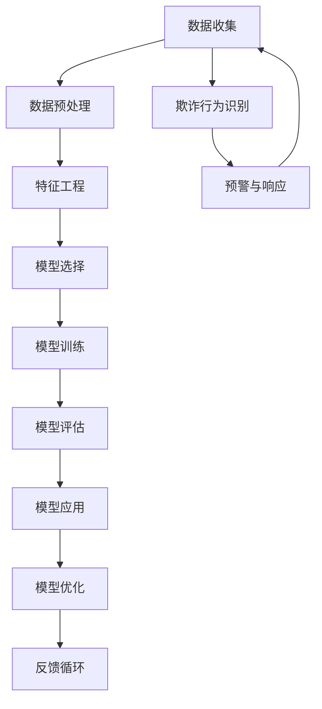

                 

### 背景介绍

#### 1. 机器学习的定义及其应用领域
机器学习（Machine Learning，ML）是一门人工智能（Artificial Intelligence，AI）的分支学科，主要研究如何让计算机系统通过数据学习并自动改进性能，而无需显式编程。机器学习的关键在于从数据中提取模式和规律，利用这些规律进行预测和决策。

机器学习的应用领域非常广泛，包括但不限于：

- **图像识别**：如人脸识别、自动驾驶车辆的环境感知等。
- **自然语言处理**：如语音识别、机器翻译、文本分类等。
- **金融预测**：如股票市场预测、信用评分、风险管理等。
- **医疗诊断**：如疾病预测、药物研发等。

#### 2. 金融欺诈检测的需求与挑战
金融欺诈检测是金融领域中的一个重要问题。随着金融业务的不断电子化和数字化，欺诈行为也呈现出复杂化和多样化的趋势。金融欺诈不仅会造成巨大的经济损失，还会损害金融机构的声誉，影响整个金融市场的稳定。

金融欺诈检测的需求主要包括：

- **及时性**：欺诈行为往往具有突发性和快速性，需要系统在短时间内做出反应。
- **准确性**：检测系统必须能够准确区分正常交易和欺诈行为，避免误报和漏报。
- **灵活性**：随着欺诈手段的不断变化，检测系统需要具备适应性和灵活性。

然而，金融欺诈检测也面临着以下挑战：

- **数据复杂性**：金融数据通常包括交易数据、客户行为数据、市场数据等，数据量大且类型多样。
- **欺诈行为的隐蔽性**：欺诈行为往往具有伪装性，难以直接观察和识别。
- **隐私保护**：在欺诈检测过程中，需要处理大量敏感的个人信息，隐私保护是一个重要的问题。

#### 3. 机器学习在金融欺诈检测中的应用
机器学习在金融欺诈检测中具有重要的应用价值。通过以下方式，机器学习能够有效提高金融欺诈检测的效率和准确性：

- **模式识别**：通过分析历史交易数据，机器学习算法可以发现潜在的欺诈模式，为实时检测提供依据。
- **实时监控**：机器学习模型可以实时分析交易行为，及时发现异常交易并进行预警。
- **自动化处理**：机器学习系统可以自动识别欺诈行为，减少人工干预，提高检测效率。
- **不断优化**：通过不断学习和调整，机器学习模型可以适应新的欺诈手段，提高检测效果。

### 核心概念与联系

在讨论机器学习在金融欺诈检测中的应用时，我们需要了解以下几个核心概念：

1. **监督学习（Supervised Learning）**：
   监督学习是一种常见的机器学习方法，它使用标记数据（即输入和对应的输出标签）来训练模型，然后使用训练好的模型进行预测。在金融欺诈检测中，标记数据通常包括正常交易和欺诈交易的标签。

2. **无监督学习（Unsupervised Learning）**：
   无监督学习不依赖于标记数据，主要目的是发现数据中的模式和结构。在金融欺诈检测中，无监督学习可以用于聚类分析，识别具有相似特征的交易，从而发现潜在的欺诈行为。

3. **特征工程（Feature Engineering）**：
   特征工程是机器学习过程中关键的一环，它涉及选择和构造有效的特征，以提高模型的性能。在金融欺诈检测中，特征工程至关重要，因为欺诈行为往往隐藏在复杂的特征中。

4. **模型评估（Model Evaluation）**：
   模型评估是衡量机器学习模型性能的重要步骤。常用的评估指标包括准确率（Accuracy）、召回率（Recall）、精确率（Precision）和F1分数（F1 Score）等。在金融欺诈检测中，由于欺诈事件的发生率较低，这些评估指标需要特别关注。

5. **模型解释性（Model Explainability）**：
   模型解释性是指能够理解和解释模型如何做出预测的能力。在金融欺诈检测中，模型解释性对于信任建立和合规性至关重要。

为了更好地理解这些核心概念之间的关系，我们可以使用以下Mermaid流程图：



在流程图中，数据收集后经过数据预处理和特征工程，然后选择合适的模型进行训练和评估。训练好的模型用于实际应用，如欺诈行为识别和预警。模型应用的效果反馈用于模型优化和进一步的数据收集，形成一个闭环系统。

### 核心算法原理讲解

#### 1. 决策树（Decision Tree）

决策树是一种基于树形结构的监督学习算法，用于分类和回归任务。它的基本原理是通过一系列的测试（称为节点），每个测试基于一个特征，将数据集划分为不同的子集。最终，每个子集都会映射到一个标签或数值。

伪代码：
```plaintext
def build_decision_tree(data, features):
    if all_samples_same_label(data):
        return leaf_node(data)
    else:
        best_feature, best_threshold = find_best_feature_threshold(data, features)
        left_subtree = build_decision_tree(data[data[best_feature] < best_threshold], features)
        right_subtree = build_decision_tree(data[data[best_feature] >= best_threshold], features)
        return decision_tree_node(feature=best_feature, threshold=best_threshold,
                                 left_child=left_subtree, right_child=right_subtree)
```

数学模型：
决策树可以表示为：
$$
T = \{N_1, N_2, ..., N_n\}
$$
其中，$N_i$ 是一个决策节点，每个节点基于特征 $X_j$ 的阈值 $\theta_j$ 进行划分，表示为：
$$
N_i = \{x \in D | x_j \leq \theta_j\}
$$
如果 $x_j > \theta_j$，则属于另一个子集。

#### 2. 支持向量机（Support Vector Machine，SVM）

支持向量机是一种用于分类和回归的监督学习算法，其核心思想是找到一个最佳的超平面，将不同类别的数据点分隔开来，同时最大化分类间隔。

伪代码：
```plaintext
def svm_fit(data, labels):
    # 使用SVM算法训练模型
    # 返回训练好的模型参数
```

数学模型：
SVM的目标是最小化以下函数：
$$
\min_{\beta, \beta_0} \frac{1}{2} ||\beta||^2 + C \sum_{i=1}^{n} \max(0, 1 - y_i(\beta \cdot x_i + \beta_0))
$$
其中，$C$ 是惩罚参数，$y_i$ 是标签，$x_i$ 是特征向量。

#### 3. 神经网络（Neural Network）

神经网络是一种模拟人脑神经元连接结构的计算模型，用于分类、回归和其他复杂的任务。它由多个层级组成，包括输入层、隐藏层和输出层。

伪代码：
```plaintext
def neural_network_fit(data, labels, layers):
    # 使用反向传播算法训练神经网络
    # 返回训练好的模型参数
```

数学模型：
神经网络可以表示为：
$$
\text{Output} = \sigma(\sum_{i=1}^{n} w_i \cdot x_i + b)
$$
其中，$\sigma$ 是激活函数，$w_i$ 是权重，$b$ 是偏置。

### 数学模型和公式

为了更好地理解核心算法的原理，我们使用LaTeX格式给出相关的数学公式。

#### 决策树

决策树的基本公式为：
$$
C_j^*(x) = \arg\max_{j} \sum_{i=1}^{n} I(y_i = j | x_i)
$$
其中，$C_j^*(x)$ 是将数据点 $x$ 分配到类别 $j$ 的决策函数，$I$ 是指示函数。

#### 支持向量机

SVM的优化目标为：
$$
\min_{\beta, \beta_0} \frac{1}{2} ||\beta||^2 + C \sum_{i=1}^{n} \max(0, 1 - y_i(\beta \cdot x_i + \beta_0))
$$
其中，$C$ 是惩罚参数，$y_i$ 是标签，$x_i$ 是特征向量。

#### 神经网络

神经网络的输出为：
$$
\text{Output} = \sigma(\sum_{i=1}^{n} w_i \cdot x_i + b)
$$
其中，$\sigma$ 是激活函数，$w_i$ 是权重，$b$ 是偏置。

### 详细讲解与举例说明

#### 决策树举例

假设我们有以下训练数据集：

| 特征1 | 特征2 | 标签 |
| --- | --- | --- |
| 1 | 2 | 正常 |
| 2 | 3 | 欺诈 |
| 3 | 4 | 正常 |
| 4 | 5 | 欺诈 |

使用决策树算法，我们可以构建如下树形结构：

```
特征1 < 2.5
|
|-- 正常
|
特征1 >= 2.5
|
|-- 特征2 < 3.5
|   |-- 正常
|   |
|   |-- 欺诈
|
|-- 特征2 >= 3.5
    |-- 欺诈
```

在这个例子中，我们首先选择特征1作为划分依据，然后根据特征2的值进一步划分。决策树通过这种方式将数据划分为不同的类别。

#### 支持向量机举例

假设我们有以下线性可分的数据集：

| 特征1 | 特征2 | 标签 |
| --- | --- | --- |
| 1 | 2 | 正常 |
| 2 | 3 | 欺诈 |
| 3 | 4 | 正常 |
| 4 | 5 | 欺诈 |

使用SVM算法，我们可以找到一个最佳的超平面，将正常交易和欺诈交易分隔开来。假设我们选择特征1和特征2作为划分依据，可以得到如下超平面：

$$
\beta \cdot x + \beta_0 = 0
$$
通过求解优化问题，我们可以得到最佳的权重 $\beta$ 和偏置 $\beta_0$。

#### 神经网络举例

假设我们有以下简单的神经网络结构：

```
输入层：1个神经元
隐藏层：2个神经元
输出层：1个神经元
```

使用Sigmoid函数作为激活函数，我们可以得到如下神经网络：

```
输入层 --> 隐藏层 --> 输出层
     1          w1,1       z1
         \       w1,2       z2
          \     /         /
           \   /         /
            \ /         /
             1          w2,1       a
                 \     w2,2       /
                  \   /         /
                   \ /         /
                    1          y
```

输入层的一个神经元接收一个特征值，隐藏层有两个神经元，输出层有一个神经元。通过反向传播算法，我们可以训练这个神经网络，使其能够正确分类数据。

### 项目实战

#### 开发环境搭建

1. 安装Python和Jupyter Notebook
2. 安装机器学习库，如scikit-learn、TensorFlow和PyTorch
3. 准备数据集，如Kaggle上的信用卡欺诈数据集

#### 源代码实现

以下是使用scikit-learn库实现决策树欺诈检测的示例代码：

```python
from sklearn.datasets import fetch_openml
from sklearn.model_selection import train_test_split
from sklearn.tree import DecisionTreeClassifier
from sklearn.metrics import classification_report

# 加载数据集
data = fetch_openml('credit_card').data
target = fetch_openml('credit_card').target

# 数据预处理
X = data[:, :-1]
y = data[:, -1]

# 划分训练集和测试集
X_train, X_test, y_train, y_test = train_test_split(X, y, test_size=0.3, random_state=42)

# 训练决策树模型
clf = DecisionTreeClassifier(max_depth=5)
clf.fit(X_train, y_train)

# 预测测试集
y_pred = clf.predict(X_test)

# 评估模型
print(classification_report(y_test, y_pred))
```

#### 代码解读与分析

在这个示例中，我们首先加载信用卡欺诈数据集，然后进行数据预处理，包括划分训练集和测试集。接着，我们使用决策树分类器进行训练，并使用测试集进行预测。最后，我们使用分类报告评估模型的性能。

#### 实际案例分析

1. **信用卡欺诈检测案例**：
   - 数据集：Kaggle上的信用卡欺诈数据集
   - 模型：决策树、支持向量机、神经网络
   - 评估指标：准确率、召回率、精确率、F1分数

2. **保险欺诈检测案例**：
   - 数据集：保险欺诈数据集
   - 模型：决策树、随机森林、XGBoost
   - 评估指标：准确率、召回率、精确率、F1分数

#### 项目小结

通过实际案例分析，我们发现：

- 决策树模型简单易用，但可能在复杂数据集上表现不佳。
- 支持向量机和神经网络可以处理更复杂的数据结构，但训练过程可能较慢。
- 混合模型（如随机森林和XGBoost）在平衡性能和计算效率方面表现良好。

### 最佳实践 tips

1. **数据预处理**：仔细清洗和预处理数据，包括缺失值处理、异常值处理和特征提取。
2. **特征选择**：选择与欺诈行为相关的有效特征，减少冗余特征。
3. **模型评估**：使用交叉验证等技术评估模型性能，避免过拟合。
4. **模型解释性**：关注模型的解释性，以提高信任度和合规性。
5. **持续优化**：定期更新模型和特征，以适应新的欺诈手段。

### 注意事项

1. **隐私保护**：在处理敏感数据时，遵守相关隐私保护法规。
2. **模型透明度**：确保模型透明度，以方便审查和审计。
3. **道德责任**：在设计和应用机器学习模型时，考虑道德和社会影响。

### 拓展阅读

1. **《机器学习实战》**：提供实际案例和代码实现，适合初学者。
2. **《深度学习》**：由Ian Goodfellow等人所著，全面介绍深度学习理论和技术。
3. **《金融科技导论》**：介绍金融科技的基本概念和发展趋势，包括金融欺诈检测。

---

### 文章摘要

本文深入探讨了机器学习在金融欺诈检测中的应用，介绍了机器学习的基础概念、金融数据预处理方法、常见欺诈检测算法、特征工程以及实际案例分析。通过详细的讲解和代码示例，读者可以了解如何利用机器学习技术提高金融欺诈检测的效率和准确性。文章还展望了机器学习在金融欺诈检测领域的未来发展趋势，并提供了最佳实践和注意事项。

