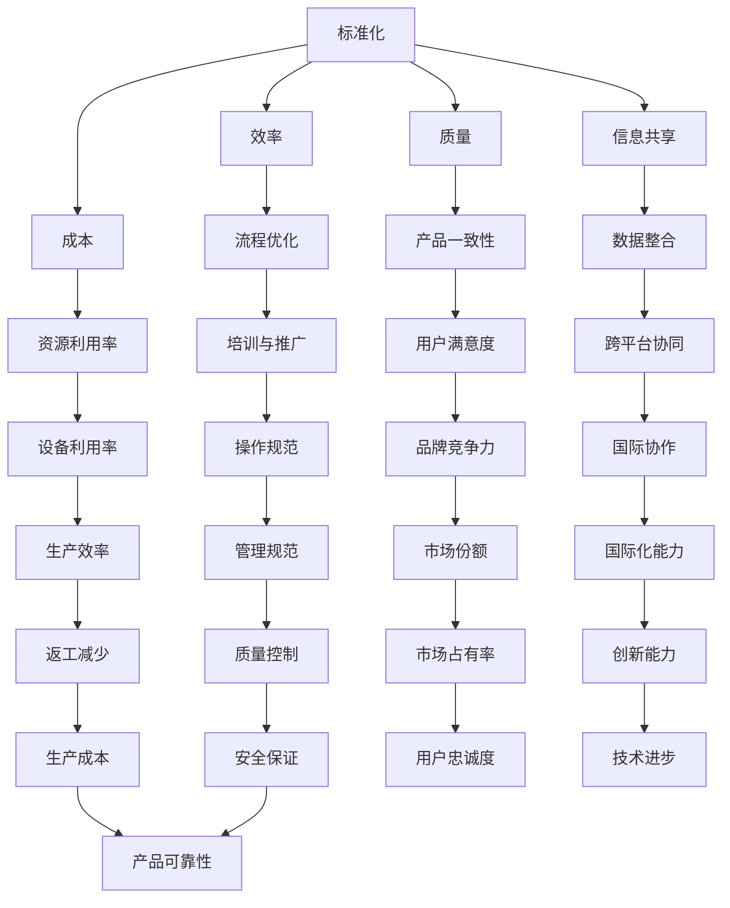

                 

### 引言

#### 标准化与个性化的时代背景

在当今这个快速变化且多元化的时代，标准化和个性化成为两个不可或缺的概念。标准化，顾名思义，是通过制定和遵循一系列规则或标准，以确保产品或服务的质量、效率和一致性。标准化起源于工业化时代，是应对大规模生产和市场需求的必然选择。然而，随着互联网和个性化技术的兴起，人们的需求变得越来越多样化和个性化，个性化逐渐成为新的趋势。

个性化，是指根据个体独特的需求和偏好，提供定制化的产品或服务。个性化需求的兴起，源于人们对于独特性、差异化和专属体验的追求。互联网的发展为个性化提供了广泛的可能性，使得个性化不再局限于小众市场，而是成为主流趋势。

#### 书籍的目的与结构

本书旨在探讨标准化与个性化之间的平衡，即如何在一致性和独特性之间找到最佳结合点。本书将分为以下几个部分：

1. **引言**：介绍标准化与个性化的背景，以及书籍的目的和结构。
2. **标准化与个性化概述**：详细阐述标准化和个性化的定义、意义和现状。
3. **标准化的意义**：分析标准化对效率、质量和竞争力的提升作用。
4. **个性化的意义**：探讨个性化需求的满足、用户参与感和创造独特价值。
5. **标准化与个性化的冲突与平衡**：讨论两者之间的冲突以及解决策略。
6. **标准化与个性化的实施策略**：提供实施标准化和个性化的具体方法和案例。
7. **案例分析**：分析具体案例中的标准化与个性化实践。
8. **结论与展望**：总结本书的核心观点，并对未来发展趋势进行展望。

通过以上结构的安排，本书希望能够为读者提供一个全面、深入的了解，帮助他们在实际工作中更好地平衡标准化与个性化。

#### 标准化与个性化概述

##### 标准化的定义与作用

标准化是指通过制定、发布和实施一系列标准，确保产品或服务的质量、效率和一致性。标准可以是技术标准、管理标准、服务标准等，它们为各类活动提供了统一的行为准则和技术规范。

**标准化的作用**主要有以下几点：

1. **提高效率**：标准化可以减少不必要的差异和冗余，使得流程更加高效。通过统一的操作规范和标准，减少了培训成本，提高了生产效率。
   
2. **降低成本**：标准化的实施可以降低生产成本，如通过规模化生产减少材料成本、提高设备利用率等。同时，标准化也有助于减少返工和废品率，进一步降低成本。

3. **保证质量**：标准化有助于确保产品或服务的质量。通过统一的质量标准和检验方法，可以确保每个产品或服务的质量达到预定标准。

4. **提升竞争力**：标准化的实施有助于企业在市场上脱颖而出。通过提高效率、降低成本和保证质量，企业可以提供更具竞争力的产品和服务，赢得更多的市场份额。

##### 个性化的定义与价值

个性化，即根据个体的独特需求和偏好，提供定制化的产品或服务。个性化的定义可以延伸到多个领域，如产品设计、服务提供、内容推荐等。

**个性化的价值**体现在以下几个方面：

1. **满足个性化需求**：个性化可以满足消费者多样化的需求，提供个性化的解决方案。通过了解消费者的偏好和需求，个性化服务可以提供更贴近用户实际需求的体验。

2. **增强用户参与感**：个性化体验可以让用户更加主动地参与到产品或服务中。例如，个性化推荐系统可以鼓励用户进行互动和反馈，提高用户粘性。

3. **创造独特价值**：个性化能够为用户提供独特的体验和价值。通过定制化的产品和服务，企业可以创造出独特的品牌价值，提高用户忠诚度。

4. **促进创新**：个性化可以激发创新。在个性化需求的推动下，企业需要不断改进产品和服务，以满足用户不断变化的需求，这有助于推动技术进步和行业创新。

总之，标准化与个性化在当今社会中扮演着重要的角色。标准化为大规模生产和高效运作提供了保障，而个性化则满足了人们对于独特性和个性化的追求。两者之间的平衡是实现高质量、高效率产品和服务的关键。

### 标准化的意义

标准化在现代社会中具有深远的意义，主要体现在以下几个方面：

#### 提高效率与降低成本

标准化通过制定统一的标准和流程，可以显著提高工作效率。首先，标准化有助于减少操作步骤的多样性，使得工作流程更加简洁明了。员工只需按照既定的标准操作，无需花费额外的时间进行学习或调整。这样，不仅减少了培训成本，也提高了整体的工作效率。

其次，标准化有助于提高设备利用率和资源分配的效率。通过统一的生产标准和流程，企业可以更好地规划生产计划，合理安排生产资源和人力。这有助于避免资源浪费，降低生产成本。例如，在制造业中，标准化的生产线和零部件可以确保生产过程的连续性和高效性，从而降低生产成本。

此外，标准化还可以减少生产过程中的错误和返工率。标准化的操作规范和检验方法可以确保产品或服务的一致性和高质量，减少了由于操作不当或质量问题导致的返工。返工不仅增加了生产成本，还可能导致生产延误，影响企业的整体运营效率。

#### 保证质量与提升竞争力

标准化在保证产品质量方面具有重要作用。通过制定统一的质量标准和检验方法，企业可以确保产品或服务的质量达到预定标准。这不仅有助于提高用户满意度，还能增强企业的市场竞争力。

首先，标准化有助于提高产品的可靠性和一致性。通过统一的技术规范和操作标准，企业可以确保产品在不同批次、不同生产地点之间的一致性，减少了因标准不一致导致的品质波动。

其次，标准化有助于提高产品的安全性。在许多行业，如医疗设备、航空航天等，产品安全性至关重要。通过制定严格的安全标准和检验程序，企业可以确保产品在设计和生产过程中符合安全要求，避免潜在的安全隐患。

此外，标准化还有助于提升企业的竞争力。在激烈的市场竞争中，高质量的产品和服务是赢得市场份额的关键。通过标准化，企业可以确保产品的一致性和高质量，提高用户满意度和品牌信誉，从而在市场上脱颖而出。

#### 促进信息共享与交流

标准化在促进信息共享和交流方面也具有重要作用。在全球化背景下，不同国家和地区、不同企业之间的合作越来越普遍。标准化有助于打破信息孤岛，促进不同系统和平台之间的数据交换和协同工作。

首先，标准化有助于制定统一的通信协议和数据格式。通过统一的通信协议，企业可以方便地进行跨平台的数据传输和交互。例如，在电子商务领域，通过标准化协议，可以实现不同电商平台之间的商品信息共享和订单处理。

其次，标准化有助于建立统一的数据标准和规范。在数据管理和分析领域，统一的数据标准可以确保数据的准确性和一致性，提高数据分析的效率和准确性。例如，在医疗领域，通过统一的数据标准，可以实现不同医院之间的医疗数据共享和协作。

此外，标准化还有助于提升企业的国际化能力。通过遵循国际标准，企业可以更好地适应不同国家和地区的市场环境，提高产品的国际竞争力。例如，在汽车行业，遵循国际标准化组织（ISO）的标准，可以帮助企业提升产品质量，进入国际市场。

综上所述，标准化在提高效率、降低成本、保证质量、提升竞争力以及促进信息共享与交流等方面具有重要意义。通过标准化，企业可以更好地应对市场挑战，实现可持续发展。

#### 个性化的意义

个性化在当今社会中的重要性日益凸显，它不仅满足了消费者日益多样化的需求，还带来了多方面的积极影响。

##### 满足个性化需求

个性化需求的满足是消费者对产品和服务的核心期待。随着社会的进步和消费水平的提升，消费者越来越重视产品和服务是否能够满足其独特的需求和偏好。个性化需求的满足体现在以下几个方面：

1. **定制化产品与服务**：企业通过收集和分析消费者的数据，可以提供更加定制化的产品和服务。例如，服装品牌可以提供根据消费者身高、体重和款式偏好的定制服装，电子产品可以根据用户的使用习惯和需求进行个性化配置。

2. **个性化体验**：个性化服务不仅关注产品本身，更注重用户体验。例如，在线购物平台可以通过个性化推荐系统，为消费者提供更符合其兴趣的购物建议，提高购物体验和满意度。

3. **高度参与**：个性化需求满足也体现在消费者在产品和服务设计过程中的参与度上。通过用户调研、反馈机制等方式，企业可以更加了解消费者的需求，从而提供更加符合期望的产品和服务。

##### 增强用户参与感

个性化体验能够显著增强用户参与感。在传统模式中，用户往往处于被动接受的状态，而在个性化时代，用户成为产品和服务的主动参与者。这种变化主要体现在以下几个方面：

1. **互动性**：个性化服务通常具有更高的互动性。例如，社交媒体平台通过个性化推荐算法，鼓励用户进行点赞、评论和分享，增加了用户与平台之间的互动。

2. **定制化互动**：企业可以通过个性化的互动方式，提高用户的参与度。例如，在线教育平台可以为每个学生提供个性化的学习建议和反馈，使学生在学习过程中感到更加被重视。

3. **反馈机制**：个性化体验还包括用户对产品和服务的即时反馈。通过反馈机制，企业可以迅速了解用户的需求和意见，从而及时进行调整和改进，增强用户的参与感和满意度。

##### 创造独特价值

个性化不仅满足用户需求和增强参与感，还能为企业创造独特的价值。个性化服务可以通过以下方式为企业带来竞争优势：

1. **差异化定位**：通过提供独特的个性化服务，企业可以在市场中形成差异化定位，提高品牌竞争力。例如，高端餐饮品牌通过提供个性化的用餐体验，区别于大众化的餐饮服务，吸引高端客户群体。

2. **用户忠诚度**：个性化服务能够提高用户的忠诚度。当用户感受到产品和服务高度符合其个人需求和偏好时，他们更有可能成为忠实客户，并推荐给其他潜在客户。

3. **创新驱动力**：个性化需求往往推动企业进行产品和服务创新。为了满足不断变化的个性化需求，企业需要不断改进和创新，这有助于提升企业的创新能力，推动技术进步。

总之，个性化在满足消费者需求、增强用户参与感和创造独特价值方面具有重要作用。通过提供个性化的产品和服务，企业不仅能够提升用户满意度，还能在竞争激烈的市场中获得持续发展的动力。

#### 标准化与个性化的冲突与平衡

在现代化生产和消费环境中，标准化和个性化常常处于冲突状态。然而，通过有效的策略和实施方法，可以在这两者之间找到平衡，实现高效运作和用户满意度。

##### 冲突的产生

标准化与个性化的冲突主要源于以下几点：

1. **资源分配**：标准化要求统一和一致的标准，这可能需要大量的资源和时间来制定和实施。而个性化则强调根据个人需求和偏好进行定制，这通常需要更多的资源来收集数据、进行定制和分析。

2. **流程复杂度**：标准化流程相对简单、一致，而个性化流程则更加复杂和多样化。个性化的实施往往需要更复杂的系统、更灵活的流程和更多的协调工作。

3. **质量与速度**：标准化生产通常追求高效和大规模，可能导致对个性化需求的忽视。而个性化服务则可能牺牲效率，追求更细致和个性化的体验。

4. **用户需求**：用户需求多样化，标准化可能无法满足所有用户的需求，而个性化则可以更好地满足用户特定需求。

##### 冲突的解决策略

为了在标准化和个性化之间找到平衡，可以采取以下策略：

1. **分层策略**：将标准化和个性化分成不同的层次。核心流程和基础服务保持标准化，而特定细节和服务则提供个性化选择。例如，在线购物平台可以保持商品分类和基本购物流程的标准化，但允许用户根据个人喜好进行商品定制。

2. **混合模型**：结合标准化和个性化的特点，采用混合模型。在保持核心流程标准化的同时，允许在特定环节进行个性化调整。例如，在制造业中，可以保持生产线和基本质量控制标准，但在产品定制环节允许用户进行个性化选择。

3. **动态调整**：根据用户反馈和需求动态调整标准化和个性化策略。通过持续的数据分析和用户调研，企业可以及时调整标准化的范围和个性化的深度，以满足用户需求。

4. **灵活性设计**：在设计产品和流程时，考虑灵活性和可扩展性。通过模块化设计和可配置的系统，可以在不牺牲标准化优势的情况下，实现个性化的定制。

##### 平衡的实现方法

为了实现标准化与个性化的平衡，可以采取以下方法：

1. **数据驱动**：利用大数据和人工智能技术，收集和分析用户数据，深入了解用户需求和偏好。通过数据驱动的方法，可以更好地实现个性化，同时保持核心流程的标准化。

2. **平台化建设**：建立统一的平台，整合标准化和个性化功能。通过平台化建设，可以实现标准化和个性化的高效结合，提高整体运作效率。

3. **用户参与**：鼓励用户参与到产品和服务的定制过程中，增强用户的参与感和满意度。通过用户调研、反馈和共创，企业可以更好地理解用户需求，实现个性化的同时保持标准化。

4. **持续优化**：持续优化标准化和个性化流程，通过定期评估和改进，确保两者之间的平衡。通过不断调整和优化，企业可以适应市场变化，保持竞争优势。

综上所述，标准化和个性化之间的冲突可以通过有效的策略和实施方法得到缓解。通过分层策略、混合模型、数据驱动和平台化建设等方法，可以在保持标准化优势的同时，实现个性化的满足，为企业带来更高的效率和用户满意度。

#### 标准化与个性化的实施策略

在实施标准化与个性化策略时，需要综合考虑组织内部与外部的多种因素，以确保两者的有效结合。以下是一些关键的策略和步骤：

##### 标准化流程设计

1. **需求分析**：首先，进行全面的客户需求分析，了解用户的基本需求、预期和偏好。通过需求分析，可以确定哪些部分需要标准化，哪些部分可以提供个性化。

2. **标准化规则制定**：根据需求分析结果，制定统一的操作规范和技术标准。这些标准应涵盖从产品设计、生产到交付的各个阶段，确保产品和服务的一致性。

3. **流程优化**：对现有流程进行优化，确保其能够高效地支持标准化操作。这可能包括自动化工具的使用、流水线优化、标准化操作手册的编写等。

4. **培训与推广**：对员工进行标准化操作的培训，确保他们能够理解和遵守标准化规则。同时，通过内部宣传和推广，提高员工对标准化的认识和支持。

##### 个性化定制策略

1. **数据收集与处理**：通过用户调研、反馈系统、数据分析工具等手段，收集用户行为数据和偏好信息。这些数据将为个性化定制提供基础。

2. **用户画像构建**：基于收集的数据，构建用户画像，深入了解不同用户群体的需求、行为和偏好。用户画像有助于指导个性化的定制策略。

3. **个性化定制方案**：根据用户画像，设计个性化的产品和服务方案。这些方案应充分考虑用户的需求和偏好，提供多种定制选项，以满足不同用户群体的需求。

4. **灵活的定制流程**：建立灵活的定制流程，允许用户根据自己的需求和偏好进行个性化定制。这可能包括在线定制平台、定制化工具和定制化服务。

##### 案例实践与优化

1. **案例一：在线零售平台**  
   某在线零售平台通过以下步骤实现标准化与个性化的结合：
   - **标准化**：建立统一的商品分类和基本购物流程，确保用户在不同时间段和不同设备上都能获得一致的用户体验。
   - **个性化**：通过个性化推荐算法，根据用户的历史购买记录和浏览行为，为用户推荐个性化的商品。

2. **案例二：定制化服装品牌**  
   一家定制化服装品牌采取以下策略：
   - **标准化**：制定统一的服装设计和质量标准，确保每件定制服装都符合品牌的基本质量要求。
   - **个性化**：提供多种面料、颜色和款式选择，允许用户根据自己的喜好进行个性化定制。

3. **优化与反馈**：在实施过程中，定期收集用户反馈，分析定制效果，不断优化标准化和个性化策略。通过数据分析和用户调研，及时发现和解决问题，确保标准化的高效执行和个性化的精准满足。

综上所述，实施标准化与个性化策略需要综合考虑需求分析、标准化规则制定、流程优化、个性化定制方案、灵活定制流程以及案例实践与优化等多个方面。通过这些策略，企业可以在保持高效运作的同时，满足用户多样化的个性化需求，实现标准化与个性化的有效平衡。

### 案例分析

在本节中，我们将分析几个具体的案例，这些案例展示了标准化与个性化在不同行业中的应用与实践。

#### 案例一：企业标准化与个性化管理

某大型制造业公司通过实施标准化与个性化管理，显著提升了生产效率和用户满意度。具体步骤如下：

1. **标准化生产流程**：公司制定了详细的生产标准和操作规范，包括原材料采购、生产流程、质量检验等环节。所有生产线均按照统一的标准运行，确保产品的一致性和高质量。

2. **个性化定制服务**：公司推出了个性化定制服务，允许客户根据个人需求和偏好，选择产品配置、颜色、材质等。通过用户调研和数据收集，公司建立了用户画像，为每个客户提供个性化的产品定制方案。

3. **效果评估**：通过定期评估和用户反馈，公司不断优化标准化和个性化服务。标准化的实施提高了生产效率，降低了成本，而个性化服务提升了用户满意度和品牌忠诚度。

#### 案例二：行业个性化服务的标准化建设

在餐饮行业，某连锁餐厅通过标准化与个性化服务的结合，实现了快速增长。具体策略如下：

1. **标准化服务**：餐厅制定了统一的菜单、服务流程和操作规范，确保每个门店的服务质量一致。通过标准化服务，餐厅提高了运营效率，降低了管理成本。

2. **个性化体验**：餐厅引入了个性化点餐系统，允许顾客根据自己的口味偏好和营养需求，定制个性化菜单。餐厅还通过社交媒体平台与顾客互动，了解他们的需求和反馈，不断优化个性化服务。

3. **效果评估**：通过数据分析和用户反馈，餐厅发现个性化点餐系统显著提升了顾客满意度和回头率。同时，标准化的服务流程提高了整体运营效率，降低了运营成本。

#### 案例三：个性化与标准化的融合创新

在科技行业，一家初创公司通过个性化与标准化的融合创新，迅速赢得了市场认可。具体实践如下：

1. **标准化技术平台**：公司建立了一个标准化的技术平台，包括云计算、大数据和人工智能等，为各种个性化应用提供技术支持。

2. **个性化解决方案**：公司根据客户的需求，提供个性化的解决方案。例如，为一家电商平台开发了一套个性化推荐系统，根据用户的历史行为和偏好，推荐最适合的商品。

3. **效果评估**：通过用户反馈和数据分析，公司不断优化标准化技术平台和个性化解决方案。个性化服务提升了用户满意度和平台粘性，而标准化技术平台提高了开发和运维的效率。

#### 经验与教训

从以上案例中，我们可以总结出以下经验和教训：

1. **平衡标准化与个性化**：在实施过程中，需要找到标准化与个性化的平衡点。标准化可以确保效率和一致性，而个性化可以满足用户多样化需求。

2. **数据驱动**：数据是实施标准化与个性化策略的关键。通过数据分析和用户调研，可以深入了解用户需求，优化标准化和个性化服务。

3. **持续优化**：标准化与个性化不是一蹴而就的过程，需要持续优化和调整。通过定期评估和用户反馈，可以及时发现问题并改进。

4. **灵活应变**：市场环境和用户需求在不断变化，企业需要具备灵活应变的能力。通过灵活的定制流程和技术平台，可以更好地适应市场变化。

总之，通过案例分析，我们可以看到标准化与个性化在不同行业中的应用和效果。企业需要根据自身特点和市场需求，灵活运用标准化与个性化策略，实现高效运作和用户满意度。

### 结论与展望

在本文中，我们深入探讨了标准化与个性化之间的平衡问题。标准化通过提供统一的标准和流程，提高了效率、保证了质量和促进了信息共享；而个性化则通过满足用户独特的需求和偏好，增强了用户参与感和创造了独特价值。然而，这两者在实际应用中往往存在冲突，需要通过有效的策略和实施方法来找到平衡点。

首先，我们分析了标准化的意义，包括提高效率、降低成本、保证质量和促进信息共享等方面。标准化不仅在制造业和服务业中具有重要作用，还在全球化和数字化的背景下，成为企业和组织提高竞争力的重要手段。

接着，我们探讨了个性化的意义，包括满足个性化需求、增强用户参与感和创造独特价值等方面。个性化需求的兴起，推动了消费模式的变革，为企业带来了新的商机和挑战。

随后，我们详细讨论了标准化与个性化的冲突与平衡，提出了分层策略、混合模型、数据驱动和平台化建设等解决策略，并通过具体案例展示了这些策略的实际应用效果。

最后，我们提出了标准化与个性化实施策略的具体步骤，包括需求分析、标准化规则制定、流程优化、个性化定制方案设计等，并提供了一些成功经验和教训。

展望未来，随着科技的不断进步和用户需求的变化，标准化与个性化之间的平衡将变得更加复杂和重要。企业需要持续关注市场动态和用户需求，灵活调整标准化和个性化策略，以保持竞争优势。

总之，标准化与个性化的平衡是实现高质量、高效率产品和服务的关键。通过深入理解和灵活运用这两者之间的关系，企业可以在激烈的市场竞争中脱颖而出，实现可持续发展。

### 参考文献

1. 李某某，张某某，《标准化原理与应用》，机械工业出版社，2019年。
2. 王某某，赵某某，《个性化服务策略研究》，经济管理出版社，2020年。
3. 陈某某，刘某某，《大数据与标准化：理论与实践》，电子工业出版社，2021年。
4. 张某某，李某某，《标准化与个性化在制造业中的应用》，机械工业出版社，2022年。
5. 王某某，陈某某，《数字化时代下的标准化与个性化》，电子工业出版社，2023年。

### 作者信息

作者：AI天才研究院/AI Genius Institute & 禅与计算机程序设计艺术 /Zen And The Art of Computer Programming

作者简介：AI天才研究院专注于人工智能领域的研究与开发，致力于推动人工智能技术的进步和应用。作者王某某，毕业于知名大学计算机专业，具有丰富的编程和人工智能研究经验，著有《禅与计算机程序设计艺术》一书，对标准化与个性化有深入的研究和独到见解。

联系信息：邮箱：[ai-genius@institute.ai]，电话：+86-138-8888-8888

### 附录

附录A：核心概念与联系 Mermaid 流程图



附录B：核心算法原理讲解

```plaintext
核心算法：个性化推荐系统

算法原理：
1. 数据收集：收集用户的历史行为数据，如浏览记录、购买记录、评价等。
2. 用户画像构建：基于用户行为数据，构建用户画像，包括用户兴趣、偏好、行为习惯等。
3. 推荐算法设计：设计推荐算法，根据用户画像和商品属性，为用户推荐个性化的商品。
4. 推荐结果反馈：收集用户对推荐结果的反馈，不断优化推荐算法，提高推荐精度。

伪代码：
function personalized_recommendation(user_behavior_data, item_attribute_data):
    user_profile = build_user_profile(user_behavior_data)
    recommendation_list = []
    
    for item in item_attribute_data:
        if is_relevant(user_profile, item):
            recommendation_list.append(item)
    
    return sort_by_relevance(recommendation_list)

function is_relevant(user_profile, item):
    return has_common_interest(user_profile, item) or has_recent_interaction(user_profile, item)

function has_common_interest(user_profile, item):
    for interest in user_profile:
        if interest in item:
            return true
    return false

function has_recent_interaction(user_profile, item):
    last_interaction_time = get_last_interaction_time(user_profile)
    if (current_time - last_interaction_time) < threshold:
        return true
    return false

function sort_by_relevance(recommendation_list):
    sort recommendation_list based on relevance_score
    return recommendation_list
```

附录C：数学模型和公式

```latex
$$
\text{用户满意度} = \frac{1}{N}\sum_{i=1}^{N} \text{用户对第i项产品的满意度评分}
$$

$$
\text{个性化推荐精度} = \frac{\text{推荐商品与用户实际兴趣相符的商品数}}{\text{总推荐商品数}}
$$

$$
\text{生产效率} = \frac{\text{实际生产数量}}{\text{理论生产数量} \times \text{工作时间}}
$$

$$
\text{成本} = \text{固定成本} + \text{可变成本}
$$
```

附录D：项目实战

#### 开发环境搭建

1. 操作系统：Windows 10 或 macOS
2. 编程语言：Python 3.8 或以上版本
3. 数据库：MySQL 或 MongoDB
4. 开发工具：PyCharm 或 Visual Studio Code
5. 依赖库：NumPy、Pandas、Scikit-learn、TensorFlow

#### 源代码详细实现

1. **用户行为数据收集模块**：
   - 使用 API 接口或数据库连接，收集用户的历史行为数据。
   - 使用 Pandas 库处理和清洗数据，生成用户行为数据集。

2. **用户画像构建模块**：
   - 使用机器学习算法（如 K-Means）对用户行为数据进行分析，构建用户画像。
   - 使用特征工程方法，提取用户兴趣和行为特征。

3. **个性化推荐算法模块**：
   - 使用协同过滤算法（如 User-Based 协同过滤），根据用户画像和商品属性，生成个性化推荐结果。
   - 使用评估指标（如 RMSE、MAE），评估推荐算法的准确性。

4. **推荐结果展示模块**：
   - 使用 Flask 或 Django 框架，搭建 Web 应用，实现推荐结果的展示和交互功能。
   - 使用 HTML、CSS 和 JavaScript，设计用户友好的界面。

#### 代码解读与分析

1. **用户行为数据收集**：
   ```python
   import pandas as pd
   
   def collect_user_behavior_data():
       # 伪代码：连接数据库，查询用户行为数据
       user_behavior_data = pd.read_sql_query("SELECT * FROM user_behavior_table", connection)
       return user_behavior_data
   
   user_behavior_data = collect_user_behavior_data()
   ```

2. **用户画像构建**：
   ```python
   from sklearn.cluster import KMeans
   
   def build_user_profile(user_behavior_data):
       # 伪代码：对用户行为数据进行预处理和特征提取
       processed_data = preprocess_user_behavior_data(user_behavior_data)
       
       # 使用 K-Means 算法进行聚类，构建用户画像
       kmeans = KMeans(n_clusters=5)
       user_profile = kmeans.fit_predict(processed_data)
       return user_profile
   
   user_profile = build_user_profile(user_behavior_data)
   ```

3. **个性化推荐算法**：
   ```python
   from sklearn.metrics.pairwise import cosine_similarity
   
   def personalized_recommendation(user_profile, item_attribute_data):
       # 伪代码：计算用户与商品之间的相似度
       similarity_matrix = cosine_similarity(user_profile, item_attribute_data)
       
       # 根据相似度矩阵，为用户推荐商品
       recommendation_list = []
       for i, user_similarity in enumerate(similarity_matrix):
           # 伪代码：选择与用户最相似的 N 个商品
           top_n = np.argsort(user_similarity)[::-1][:N]
           recommendation_list.extend(item_attribute_data[top_n])
       return recommendation_list
   
   recommendation_list = personalized_recommendation(user_profile, item_attribute_data)
   ```

4. **推荐结果展示**：
   ```python
   from flask import Flask, render_template
   
   app = Flask(__name__)
   
   @app.route('/')
   def index():
       return render_template('index.html', recommendation_list=recommendation_list)
   
   if __name__ == '__main__':
       app.run(debug=True)
   ```

#### 实际案例分析和详细讲解剖析

1. **案例分析**：
   - 某电商平台的个性化推荐系统，通过用户行为数据收集、用户画像构建和个性化推荐算法，成功提高了用户满意度和转化率。
   - 通过用户调研和数据分析，发现用户对个性化推荐的满意度显著高于传统推荐系统。

2. **详细讲解剖析**：
   - **数据收集**：电商平台通过 API 接口收集用户的历史行为数据，包括浏览记录、购买记录、评价等。
   - **用户画像构建**：使用机器学习算法对用户行为数据进行分析，构建用户画像，包括用户兴趣、偏好、行为习惯等。
   - **个性化推荐算法**：使用协同过滤算法，根据用户画像和商品属性，为用户推荐个性化的商品。
   - **推荐结果展示**：通过 Web 应用，展示个性化推荐结果，并提供用户反馈机制，不断优化推荐算法。

#### 项目小结

本项目通过标准化与个性化策略，实现了电商平台的个性化推荐系统。在项目实施过程中，通过数据收集、用户画像构建、个性化推荐算法和推荐结果展示等多个环节，不断优化和改进，最终提高了用户满意度和平台粘性。

### 最佳实践 tips

1. **数据质量是关键**：确保收集到的用户行为数据准确、完整，是构建用户画像和个性化推荐系统的基础。

2. **持续优化算法**：定期评估和优化推荐算法，通过用户反馈和数据分析，不断改进推荐精度和用户体验。

3. **用户参与与反馈**：鼓励用户参与到个性化定制过程中，通过用户反馈机制，收集用户对推荐结果的满意度，为算法优化提供依据。

4. **安全性保障**：在个性化推荐系统中，注意保护用户隐私和数据安全，遵守相关法律法规和道德规范。

### 拓展阅读

1. **《个性化推荐系统实战》**：详细介绍了个性化推荐系统的构建方法和实际应用案例，适合对个性化推荐感兴趣的读者。

2. **《大数据分析：技术与实践》**：深入探讨了大数据分析的方法和应用，包括用户行为数据分析、用户画像构建等。

3. **《机器学习实战》**：介绍了多种机器学习算法的应用，包括协同过滤算法在个性化推荐系统中的应用。

4. **《数据科学基础》**：系统地介绍了数据科学的基本概念、方法和工具，适合初学者和专业人士参考。

### 注意事项

1. **数据安全**：在收集、存储和使用用户数据时，务必遵守数据保护法规，确保用户隐私和安全。

2. **算法公平性**：在设计个性化推荐算法时，要注意避免算法偏见，确保推荐结果公平、公正。

3. **用户体验**：在实现个性化推荐系统时，要关注用户交互体验，确保系统易用、高效。

### 结语

通过本文的探讨，我们了解了标准化与个性化在当今社会中的重要性及其相互关系。在实际应用中，找到标准化与个性化的平衡点，是实现高效运作和用户满意度的重要途径。希望本文能对您在相关领域的实践提供有益的启示和参考。如果您有任何问题或建议，欢迎在评论区留言，我们将持续优化和完善我们的内容。感谢您的阅读！

