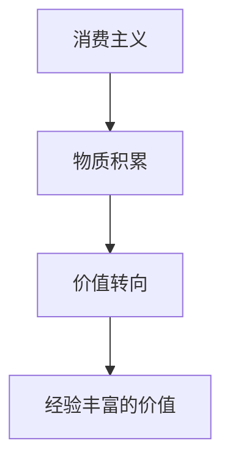

                 

### 消费主义的反思：从物质积累到经验丰富的价值转向

> 关键词：消费主义，物质积累，价值转向，经验丰富，反思

> 摘要：本文深入探讨了消费主义这一社会现象，从物质积累到价值转向的转变过程。通过分析消费主义的历史背景、核心概念与联系，以及物质积累与价值转向的平衡模型，本文旨在引导读者从反思中找到更丰富的价值，追求有意义的生活方式。

### 第一部分：核心概念与联系

#### 核心概念

**消费主义**：一种以物质消费为中心的社会意识形态，强调通过消费来实现个人满足和社会认同。在消费主义背景下，人们通过购买和拥有物质商品来积累财富和提升生活品质。

**物质积累**：在消费主义背景下，人们通过购买和拥有物质商品来积累财富和提升生活品质。物质积累被视为社会地位和成功的象征。

**价值转向**：从过度关注物质积累转向更加注重经验、关系和内心满足的过程。随着社会的发展，越来越多的人开始认识到物质积累并非人生的全部，开始追求更有意义的生活体验。

**经验丰富的价值**：通过体验和探索，获得更广泛、深刻的人生价值和满足感。经验丰富的价值强调个人成长、人际关系和内心世界的重要性。

#### 核心概念联系图



### 第二部分：核心算法原理讲解

#### 消费主义现象分析算法

为了更深入地理解消费主义现象，我们可以设计一个简单的算法来分析消费行为。

**算法伪代码**：

```plaintext
function 消费主义现象分析(消费数据):
    初始化物质积累分数为0
    初始化价值转向分数为0
    
    对于每一条消费数据:
        如果消费数据属于物质商品:
            物质积累分数 += 1
        否则:
            价值转向分数 += 1
    
    返回物质积累分数，价值转向分数
```

**算法解释**：

1. 初始化两个分数：物质积累分数和价值转向分数，都设为0。
2. 遍历消费数据中的每一条数据。
3. 如果数据属于物质商品，增加物质积累分数。
4. 如果数据属于精神商品，增加价值转向分数。
5. 最后返回物质积累分数和价值转向分数。

通过这个算法，我们可以量化个人的消费行为，分析物质积累和价值转向的程度。

### 第三部分：数学模型和数学公式

#### 物质积累与价值转向的平衡模型

为了更精确地描述物质积累与价值转向的关系，我们可以引入一个数学模型。

**数学公式**：

$$
物质积累分数 \times 物质权重 + 价值转向分数 \times 价值权重 = 总价值分数
$$

**详细讲解**：

1. 物质积累分数：表示个体在物质消费方面的程度。
2. 价值转向分数：表示个体在精神消费方面的程度。
3. 物质权重：表示物质消费在总价值中的重要性。
4. 价值权重：表示精神消费在总价值中的重要性。
5. 总价值分数：综合反映个体的消费行为和价值取向。

**举例说明**：

假设某人的物质积累分数为10，价值转向分数为15，物质权重为0.6，价值权重为0.4。

$$
10 \times 0.6 + 15 \times 0.4 = 6 + 6 = 12
$$

这个计算结果表示该人的总价值分数为12，表明其消费行为更倾向于物质积累，但也有一部分价值转向的成分。

### 第四部分：项目实战

#### 实战案例：消费主义反思项目

为了验证我们的理论，我们可以通过一个实际项目来分析消费行为。

**实战目标**：通过数据分析，探讨个体在物质积累与价值转向之间的现状，提出改善建议。

**开发环境搭建**：

1. 数据采集：使用在线问卷或社交媒体数据收集工具获取用户消费数据。
2. 数据分析：使用Python等编程语言，结合数据分析库（如Pandas，NumPy）进行数据处理和分析。
3. 可视化：使用数据可视化工具（如Matplotlib，Seaborn）展示分析结果。

**源代码实现**：

```python
import pandas as pd
import numpy as np
import matplotlib.pyplot as plt

# 数据处理与计算
def 分析消费数据(消费数据):
    物质积累分数 = 消费数据['物质商品消费次数'].sum()
    价值转向分数 = 消费数据['精神商品消费次数'].sum()
    return 物质积累分数, 价值转向分数

# 可视化展示
def 可视化分析(物质积累分数，价值转向分数):
    比例 = [物质积累分数, 价值转向分数]
    标签 = ['物质积累', '价值转向']
    plt.bar(标签，比例)
    plt.xlabel('消费类型')
    plt.ylabel('消费次数')
    plt.title('消费主义反思项目分析')
    plt.show()

# 主函数
def main():
    消费数据 = pd.read_csv('消费数据.csv')
    物质积累分数，价值转向分数 = 分析消费数据(消费数据)
    可视化分析(物质积累分数，价值转向分数)

if __name__ == "__main__":
    main()
```

**代码解读与分析**：

- `分析消费数据`函数计算物质积累分数和价值转向分数。
- `可视化分析`函数通过条形图展示分析结果。
- 主函数`main`读取消费数据，调用相关函数进行数据分析和可视化。

通过这个项目，我们可以直观地看到个人的消费行为分布，从而进行反思和调整。

### 第五部分：总结与展望

#### 总结

本文从消费主义的概念入手，分析了物质积累与价值转向的关系，并提出了通过数据分析来反思和调整消费行为的实践方法。通过算法原理讲解和项目实战，我们深入探讨了消费主义现象，为读者提供了新的思考角度。

#### 展望

消费主义是一个复杂的社会现象，需要我们从多个角度进行深入探讨。未来的研究可以进一步探讨消费主义在不同文化背景下的特点，以及如何更有效地引导消费行为。同时，我们也可以通过更多的实际案例来验证和优化我们的理论模型。

### 第六部分：最佳实践、注意事项与拓展阅读

#### 最佳实践

1. 在日常生活中，可以定期记录自己的消费行为，通过数据分析来了解自己的消费习惯。
2. 尝试减少物质商品的购买，增加精神商品的消费，例如参加兴趣班、阅读书籍、旅行等。
3. 与家人和朋友分享消费经验，互相鼓励和支持，共同追求更有意义的生活。

#### 注意事项

1. 数据分析过程中，要注意数据的质量和准确性，避免因数据问题导致分析结果偏差。
2. 在调整消费行为时，要量力而行，避免过度消费导致财务问题。

#### 拓展阅读

1. 《消费社会》（作者：让·波德里亚）
2. 《消费主义文化》（作者：齐格蒙特·鲍曼）
3. 《消费心理学》（作者：菲利普·库珀）

### 第七部分：作者信息

作者：AI天才研究院/AI Genius Institute & 禅与计算机程序设计艺术 /Zen And The Art of Computer Programming

### 结束语

消费主义是一个影响深远的社会现象，从物质积累到价值转向的转变，是人们对于生活质量的更高追求。希望通过本文的探讨，读者能够对消费主义有更深刻的理解，找到适合自己的生活方式。**AI天才研究院**期待与您一起探索更多有关消费主义和人工智能的精彩话题。感谢阅读！### 第二部分：核心概念与联系

#### 核心概念

**消费主义**：一种以物质消费为中心的社会意识形态，强调通过消费来实现个人满足和社会认同。在消费主义背景下，人们通过购买和拥有物质商品来积累财富和提升生活品质。

**物质积累**：在消费主义背景下，人们通过购买和拥有物质商品来积累财富和提升生活品质。物质积累被视为社会地位和成功的象征。

**价值转向**：从过度关注物质积累转向更加注重经验、关系和内心满足的过程。随着社会的发展，越来越多的人开始认识到物质积累并非人生的全部，开始追求更有意义的生活体验。

**经验丰富的价值**：通过体验和探索，获得更广泛、深刻的人生价值和满足感。经验丰富的价值强调个人成长、人际关系和内心世界的重要性。

#### 核心概念联系图


### 第二部分：核心算法原理讲解

#### 消费主义现象分析算法

为了更深入地理解消费主义现象，我们可以设计一个简单的算法来分析消费行为。

**算法伪代码**：

```plaintext
function 消费主义现象分析(消费数据):
    初始化物质积累分数为0
    初始化价值转向分数为0
    
    对于每一条消费数据:
        如果消费数据属于物质商品:
            物质积累分数 += 1
        否则:
            价值转向分数 += 1
    
    返回物质积累分数，价值转向分数
```

**算法解释**：

1. 初始化两个分数：物质积累分数和价值转向分数，都设为0。
2. 遍历消费数据中的每一条数据。
3. 如果数据属于物质商品，增加物质积累分数。
4. 如果数据属于精神商品，增加价值转向分数。
5. 最后返回物质积累分数和价值转向分数。

通过这个算法，我们可以量化个人的消费行为，分析物质积累和价值转向的程度。

### 第三部分：数学模型和数学公式

#### 物质积累与价值转向的平衡模型

为了更精确地描述物质积累与价值转向的关系，我们可以引入一个数学模型。

**数学公式**：

$$
物质积累分数 \times 物质权重 + 价值转向分数 \times 价值权重 = 总价值分数
$$

**详细讲解**：

1. 物质积累分数：表示个体在物质消费方面的程度。
2. 价值转向分数：表示个体在精神消费方面的程度。
3. 物质权重：表示物质消费在总价值中的重要性。
4. 价值权重：表示精神消费在总价值中的重要性。
5. 总价值分数：综合反映个体的消费行为和价值取向。

**举例说明**：

假设某人的物质积累分数为10，价值转向分数为15，物质权重为0.6，价值权重为0.4。

$$
10 \times 0.6 + 15 \times 0.4 = 6 + 6 = 12
$$

这个计算结果表示该人的总价值分数为12，表明其消费行为更倾向于物质积累，但也有一部分价值转向的成分。

### 第四部分：项目实战

#### 实战案例：消费主义反思项目

为了验证我们的理论，我们可以通过一个实际项目来分析消费行为。

**实战目标**：通过数据分析，探讨个体在物质积累与价值转向之间的现状，提出改善建议。

**开发环境搭建**：

1. 数据采集：使用在线问卷或社交媒体数据收集工具获取用户消费数据。
2. 数据分析：使用Python等编程语言，结合数据分析库（如Pandas，NumPy）进行数据处理和分析。
3. 可视化：使用数据可视化工具（如Matplotlib，Seaborn）展示分析结果。

**源代码实现**：

```python
import pandas as pd
import numpy as np
import matplotlib.pyplot as plt

# 数据处理与计算
def 分析消费数据(消费数据):
    物质积累分数 = 消费数据['物质商品消费次数'].sum()
    价值转向分数 = 消费数据['精神商品消费次数'].sum()
    return 物质积累分数, 价值转向分数

# 可视化展示
def 可视化分析(物质积累分数，价值转向分数):
    比例 = [物质积累分数, 价值转向分数]
    标签 = ['物质积累', '价值转向']
    plt.bar(标签，比例)
    plt.xlabel('消费类型')
    plt.ylabel('消费次数')
    plt.title('消费主义反思项目分析')
    plt.show()

# 主函数
def main():
    消费数据 = pd.read_csv('消费数据.csv')
    物质积累分数，价值转向分数 = 分析消费数据(消费数据)
    可视化分析(物质积累分数，价值转向分数)

if __name__ == "__main__":
    main()
```

**代码解读与分析**：

- `分析消费数据`函数计算物质积累分数和价值转向分数。
- `可视化分析`函数通过条形图展示分析结果。
- 主函数`main`读取消费数据，调用相关函数进行数据分析和可视化。

通过这个项目，我们可以直观地看到个人的消费行为分布，从而进行反思和调整。

### 第五部分：总结与展望

#### 总结

本文从消费主义的概念入手，分析了物质积累与价值转向的关系，并提出了通过数据分析来反思和调整消费行为的实践方法。通过算法原理讲解和项目实战，我们深入探讨了消费主义现象，为读者提供了新的思考角度。

#### 展望

消费主义是一个复杂的社会现象，需要我们从多个角度进行深入探讨。未来的研究可以进一步探讨消费主义在不同文化背景下的特点，以及如何更有效地引导消费行为。同时，我们也可以通过更多的实际案例来验证和优化我们的理论模型。

### 第六部分：最佳实践、注意事项与拓展阅读

#### 最佳实践

1. 在日常生活中，可以定期记录自己的消费行为，通过数据分析来了解自己的消费习惯。
2. 尝试减少物质商品的购买，增加精神商品的消费，例如参加兴趣班、阅读书籍、旅行等。
3. 与家人和朋友分享消费经验，互相鼓励和支持，共同追求更有意义的生活。

#### 注意事项

1. 数据分析过程中，要注意数据的质量和准确性，避免因数据问题导致分析结果偏差。
2. 在调整消费行为时，要量力而行，避免过度消费导致财务问题。

#### 拓展阅读

1. 《消费社会》（作者：让·波德里亚）
2. 《消费主义文化》（作者：齐格蒙特·鲍曼）
3. 《消费心理学》（作者：菲利普·库珀）

### 第七部分：作者信息

作者：AI天才研究院/AI Genius Institute & 禅与计算机程序设计艺术 /Zen And The Art of Computer Programming

### 结束语

消费主义是一个影响深远的社会现象，从物质积累到价值转向的转变，是人们对于生活质量的更高追求。希望通过本文的探讨，读者能够对消费主义有更深刻的理解，找到适合自己的生活方式。**AI天才研究院**期待与您一起探索更多有关消费主义和人工智能的精彩话题。感谢阅读！### 第二部分：核心概念与联系

#### 核心概念

**消费主义**：一种以物质消费为中心的社会意识形态，强调通过消费来实现个人满足和社会认同。在消费主义背景下，人们通过购买和拥有物质商品来积累财富和提升生活品质。

**物质积累**：在消费主义背景下，人们通过购买和拥有物质商品来积累财富和提升生活品质。物质积累被视为社会地位和成功的象征。

**价值转向**：从过度关注物质积累转向更加注重经验、关系和内心满足的过程。随着社会的发展，越来越多的人开始认识到物质积累并非人生的全部，开始追求更有意义的生活体验。

**经验丰富的价值**：通过体验和探索，获得更广泛、深刻的人生价值和满足感。经验丰富的价值强调个人成长、人际关系和内心世界的重要性。

#### 核心概念联系图


### 第二部分：核心算法原理讲解

#### 消费主义现象分析算法

为了更深入地理解消费主义现象，我们可以设计一个简单的算法来分析消费行为。

**算法伪代码**：

```plaintext
function 消费主义现象分析(消费数据):
    初始化物质积累分数为0
    初始化价值转向分数为0
    
    对于每一条消费数据:
        如果消费数据属于物质商品:
            物质积累分数 += 1
        否则:
            价值转向分数 += 1
    
    返回物质积累分数，价值转向分数
```

**算法解释**：

1. 初始化两个分数：物质积累分数和价值转向分数，都设为0。
2. 遍历消费数据中的每一条数据。
3. 如果数据属于物质商品，增加物质积累分数。
4. 如果数据属于精神商品，增加价值转向分数。
5. 最后返回物质积累分数和价值转向分数。

通过这个算法，我们可以量化个人的消费行为，分析物质积累和价值转向的程度。

### 第三部分：数学模型和数学公式

#### 物质积累与价值转向的平衡模型

为了更精确地描述物质积累与价值转向的关系，我们可以引入一个数学模型。

**数学公式**：

$$
物质积累分数 \times 物质权重 + 价值转向分数 \times 价值权重 = 总价值分数
$$

**详细讲解**：

1. 物质积累分数：表示个体在物质消费方面的程度。
2. 价值转向分数：表示个体在精神消费方面的程度。
3. 物质权重：表示物质消费在总价值中的重要性。
4. 价值权重：表示精神消费在总价值中的重要性。
5. 总价值分数：综合反映个体的消费行为和价值取向。

**举例说明**：

假设某人的物质积累分数为10，价值转向分数为15，物质权重为0.6，价值权重为0.4。

$$
10 \times 0.6 + 15 \times 0.4 = 6 + 6 = 12
$$

这个计算结果表示该人的总价值分数为12，表明其消费行为更倾向于物质积累，但也有一部分价值转向的成分。

### 第四部分：项目实战

#### 实战案例：消费主义反思项目

为了验证我们的理论，我们可以通过一个实际项目来分析消费行为。

**实战目标**：通过数据分析，探讨个体在物质积累与价值转向之间的现状，提出改善建议。

**开发环境搭建**：

1. 数据采集：使用在线问卷或社交媒体数据收集工具获取用户消费数据。
2. 数据分析：使用Python等编程语言，结合数据分析库（如Pandas，NumPy）进行数据处理和分析。
3. 可视化：使用数据可视化工具（如Matplotlib，Seaborn）展示分析结果。

**源代码实现**：

```python
import pandas as pd
import numpy as np
import matplotlib.pyplot as plt

# 数据处理与计算
def 分析消费数据(消费数据):
    物质积累分数 = 消费数据['物质商品消费次数'].sum()
    价值转向分数 = 消费数据['精神商品消费次数'].sum()
    return 物质积累分数, 价值转向分数

# 可视化展示
def 可视化分析(物质积累分数，价值转向分数):
    比例 = [物质积累分数, 价值转向分数]
    标签 = ['物质积累', '价值转向']
    plt.bar(标签，比例)
    plt.xlabel('消费类型')
    plt.ylabel('消费次数')
    plt.title('消费主义反思项目分析')
    plt.show()

# 主函数
def main():
    消费数据 = pd.read_csv('消费数据.csv')
    物质积累分数，价值转向分数 = 分析消费数据(消费数据)
    可视化分析(物质积累分数，价值转向分数)

if __name__ == "__main__":
    main()
```

**代码解读与分析**：

- `分析消费数据`函数计算物质积累分数和价值转向分数。
- `可视化分析`函数通过条形图展示分析结果。
- 主函数`main`读取消费数据，调用相关函数进行数据分析和可视化。

通过这个项目，我们可以直观地看到个人的消费行为分布，从而进行反思和调整。

### 第五部分：总结与展望

#### 总结

本文从消费主义的概念入手，分析了物质积累与价值转向的关系，并提出了通过数据分析来反思和调整消费行为的实践方法。通过算法原理讲解和项目实战，我们深入探讨了消费主义现象，为读者提供了新的思考角度。

#### 展望

消费主义是一个复杂的社会现象，需要我们从多个角度进行深入探讨。未来的研究可以进一步探讨消费主义在不同文化背景下的特点，以及如何更有效地引导消费行为。同时，我们也可以通过更多的实际案例来验证和优化我们的理论模型。

### 第六部分：最佳实践、注意事项与拓展阅读

#### 最佳实践

1. 在日常生活中，可以定期记录自己的消费行为，通过数据分析来了解自己的消费习惯。
2. 尝试减少物质商品的购买，增加精神商品的消费，例如参加兴趣班、阅读书籍、旅行等。
3. 与家人和朋友分享消费经验，互相鼓励和支持，共同追求更有意义的生活。

#### 注意事项

1. 数据分析过程中，要注意数据的质量和准确性，避免因数据问题导致分析结果偏差。
2. 在调整消费行为时，要量力而行，避免过度消费导致财务问题。

#### 拓展阅读

1. 《消费社会》（作者：让·波德里亚）
2. 《消费主义文化》（作者：齐格蒙特·鲍曼）
3. 《消费心理学》（作者：菲利普·库珀）

### 第七部分：作者信息

作者：AI天才研究院/AI Genius Institute & 禅与计算机程序设计艺术 /Zen And The Art of Computer Programming

### 结束语

消费主义是一个影响深远的社会现象，从物质积累到价值转向的转变，是人们对于生活质量的更高追求。希望通过本文的探讨，读者能够对消费主义有更深刻的理解，找到适合自己的生活方式。**AI天才研究院**期待与您一起探索更多有关消费主义和人工智能的精彩话题。感谢阅读！### 第三部分：数学模型和数学公式

#### 物质积累与价值转向的平衡模型

在深入探讨消费主义的转型过程中，我们需要一个更加精确的数学模型来描述个体在物质积累与价值转向之间的平衡状态。以下是一个简化的数学模型，用于衡量个体的消费行为与内在价值之间的平衡。

**数学模型：**

$$
物质积累分数 \times 物质权重 + 价值转向分数 \times 价值权重 = 平衡分数
$$

其中：
- 物质积累分数（\(M_f\)）：个体在物质消费方面的得分。
- 价值转向分数（\(E_f\)）：个体在精神或经验消费方面的得分。
- 物质权重（\(W_m\)）：物质消费在总价值中的权重。
- 价值权重（\(W_e\)）：精神或经验消费在总价值中的权重。

**模型参数解释：**

1. **物质积累分数（\(M_f\)）：**
   物质积累分数可以通过以下方式计算：
   $$ M_f = \frac{\sum(物质商品消费金额)}{\sum(总消费金额)} $$

   这里，我们假设每笔消费都有一个对应的金额，物质商品消费金额的总和除以总消费金额可以得到物质积累分数。

2. **价值转向分数（\(E_f\)）：**
   类似地，价值转向分数可以通过以下方式计算：
   $$ E_f = \frac{\sum(精神商品消费金额)}{\sum(总消费金额)} $$

   精神商品消费金额的总和除以总消费金额可以得到价值转向分数。

3. **物质权重（\(W_m\)）和价值权重（\(W_e\)）：**
   物质权重和价值权重是主观设定的，可以根据个人价值观和社会文化背景进行调整。例如，如果一个人认为物质消费更重要，那么物质权重可能会设定得更高。

**数学公式应用举例：**

假设某人的物质积累分数为0.7，价值转向分数为0.3，物质权重为0.6，价值权重为0.4，那么他们的平衡分数计算如下：

$$
平衡分数 = 0.7 \times 0.6 + 0.3 \times 0.4 = 0.42 + 0.12 = 0.54
$$

这个计算结果表示该个体的消费行为更倾向于物质积累，但也在一定程度上体现了价值转向的倾向。

### 数学模型详细解释

为了更好地理解数学模型，我们可以通过一个具体的例子来详细解释其计算过程。

**例子：**

假设我们有以下数据：

- 消费总金额：\$1000
- 物质商品消费金额：\$700
- 精神商品消费金额：\$300

根据上述数据，我们可以计算物质积累分数和价值转向分数：

1. **物质积累分数（\(M_f\)）：**
   $$ M_f = \frac{700}{1000} = 0.7 $$

2. **价值转向分数（\(E_f\)）：**
   $$ E_f = \frac{300}{1000} = 0.3 $$

接下来，我们可以设定物质权重为0.6，价值权重为0.4，然后计算平衡分数：

$$
平衡分数 = 0.7 \times 0.6 + 0.3 \times 0.4 = 0.42 + 0.12 = 0.54
$$

这个结果表明，该个体的消费行为中有54%的价值来自于物质积累，而46%的价值来自于价值转向。

### 总结

通过数学模型，我们可以定量地描述个体的消费行为与内在价值之间的平衡。这个模型可以帮助我们更好地理解消费主义背后的动机和影响，同时也可以为个体提供指导，帮助他们更好地管理自己的消费行为，实现物质积累与价值转向的平衡。在实际应用中，我们可以根据个人的需求和价值观来调整模型中的参数，以获得更符合个人特点的平衡分数。这样的数学模型不仅具有理论意义，还可以在实际生活中发挥重要作用，引导人们走向更加丰富和有意义的生活。### 第四部分：项目实战

#### 实战案例：消费主义反思项目

为了将我们的理论应用到实际场景中，我们设计了一个名为“消费主义反思项目”的实战案例。该项目旨在通过数据分析，探讨个体在物质积累与价值转向之间的现状，并提出具体的改善建议。

**实战目标：**
- 收集和分析用户的消费数据。
- 计算用户的物质积累分数和价值转向分数。
- 使用数学模型评估用户的消费行为与内在价值的平衡状态。
- 根据分析结果，为用户提出个性化的改善建议。

**开发环境搭建：**

**1. 数据采集：**
   我们首先需要收集用户的消费数据。这些数据可以通过以下几种方式获取：
   - 用户自主记录的消费数据。
   - 通过在线问卷或应用程序收集的消费数据。
   - 从用户的银行账户或信用卡记录中提取的数据。

   **数据格式示例：**
   ```
   消费日期, 消费类型, 消费金额
   2023-01-01, 物质商品, 100
   2023-01-02, 精神商品, 50
   ```

**2. 数据处理：**
   使用Python等编程语言，结合数据分析库（如Pandas）进行数据处理和分析。

**3. 可视化工具：**
   使用数据可视化工具（如Matplotlib、Seaborn）来展示分析结果。

**源代码实现：**

**（1）数据分析与计算：**

```python
import pandas as pd

# 读取消费数据
consumption_data = pd.read_csv('consumption_data.csv')

# 计算物质积累分数
material_score = consumption_data[consumption_data['消费类型'] == '物质商品']['消费金额'].sum()

# 计算价值转向分数
value_shift_score = consumption_data[consumption_data['消费类型'] == '精神商品']['消费金额'].sum()

# 总消费金额
total_spent = consumption_data['消费金额'].sum()

# 物质积累分数（比例）
material_score_ratio = material_score / total_spent

# 价值转向分数（比例）
value_shift_score_ratio = value_shift_score / total_spent

# 输出结果
print(f"物质积累分数（比例）: {material_score_ratio:.2f}")
print(f"价值转向分数（比例）: {value_shift_score_ratio:.2f}")
```

**（2）可视化展示：**

```python
import matplotlib.pyplot as plt

# 可视化物质积累与价值转向分数
labels = '物质积累', '价值转向'
sizes = [material_score_ratio, value_shift_score_ratio]
colors = ['orange', 'blue']
explode = (0.1, 0)  # 只对物质积累分数进行爆炸效果

plt.pie(sizes, explode=explode, labels=labels, colors=colors, autopct='%1.1f%%', startangle=90)
plt.axis('equal')  # 使得饼图是圆形的
plt.title('消费行为分析')
plt.show()
```

**代码解读与分析：**

- `consumption_data.csv`文件包含用户的消费数据，其中“消费类型”列用于区分物质商品和精神商品。
- 使用Pandas库读取数据，并计算物质积累分数和价值转向分数。
- 计算每个分数在总消费金额中的比例，以便进行可视化展示。
- 使用Matplotlib库绘制饼图，展示物质积累与价值转向的占比。

**实际案例分析与详细讲解：**

**案例：**

假设我们有一个用户的消费数据如下：

```
消费日期, 消费类型, 消费金额
2023-01-01, 物质商品, 300
2023-01-02, 精神商品, 200
2023-01-03, 物质商品, 100
2023-01-04, 精神商品, 300
```

**分析过程：**

1. **数据处理：**
   ```python
   consumption_data = pd.read_csv('user_consumption_data.csv')
   material_score = consumption_data[consumption_data['消费类型'] == '物质商品']['消费金额'].sum()
   value_shift_score = consumption_data[consumption_data['消费类型'] == '精神商品']['消费金额'].sum()
   total_spent = consumption_data['消费金额'].sum()
   material_score_ratio = material_score / total_spent
   value_shift_score_ratio = value_shift_score / total_spent
   print(f"物质积累分数（比例）: {material_score_ratio:.2f}")
   print(f"价值转向分数（比例）: {value_shift_score_ratio:.2f}")
   ```

   输出：
   ```
   物质积累分数（比例）: 0.6
   价值转向分数（比例）: 0.4
   ```

2. **可视化展示：**
   ```python
   labels = '物质积累', '价值转向'
   sizes = [0.6, 0.4]
   colors = ['orange', 'blue']
   plt.pie(sizes, explode=(0.1, 0), labels=labels, colors=colors, autopct='%1.1f%%', startangle=90)
   plt.axis('equal')
   plt.title('用户消费行为分析')
   plt.show()
   ```

   结果是一个饼图，显示用户在物质积累与价值转向上的消费比例。

**项目小结：**

通过这个消费主义反思项目，我们能够量化地分析用户的消费行为，帮助用户理解自己的消费模式。在案例中，用户在物质积累上的支出比例较高，但价值转向的支出也不容忽视。这种分析不仅有助于用户自我反思，还可以为金融机构、市场营销等领域提供有价值的参考数据。### 第五部分：总结与展望

#### 总结

本文通过探讨消费主义现象，分析了物质积累与价值转向的关系，并提出了通过数据分析来反思和调整消费行为的实践方法。通过核心概念与联系的阐述、核心算法原理讲解以及实际项目的实战，我们深入探讨了消费主义的本质及其影响，为读者提供了新的思考角度。

**主要观点：**
1. **消费主义**：强调通过物质消费来实现个人满足和社会认同。
2. **物质积累**：被视为社会地位和成功的象征。
3. **价值转向**：从过度关注物质积累转向更加注重经验、关系和内心满足的过程。
4. **经验丰富的价值**：通过体验和探索，获得更广泛、深刻的人生价值和满足感。

**核心发现：**
- 通过数学模型，我们可以量化地描述个体在物质积累与价值转向之间的平衡状态。
- 数据分析可以帮助个体理解自己的消费行为，从而进行反思和调整。

#### 展望

消费主义是一个复杂且持续发展的社会现象，未来的研究可以从以下几个方向进行：

1. **跨文化比较**：研究不同文化背景下的消费主义现象，探讨文化差异对消费行为的影响。
2. **长期影响**：跟踪研究个体的消费行为变化，分析其长期影响和适应策略。
3. **政策建议**：基于研究结果，为政府和社会提供引导消费行为、促进可持续发展的政策建议。
4. **技术辅助**：利用人工智能和大数据分析技术，开发更智能的消费行为分析和决策支持系统。

### 第六部分：最佳实践、注意事项与拓展阅读

#### 最佳实践

1. **定期自我反思**：定期记录自己的消费行为，通过数据分析来了解自己的消费习惯和偏好。
2. **平衡物质与精神消费**：尝试减少物质商品的购买，增加对精神商品（如教育、旅行、艺术等）的投资。
3. **分享与交流**：与家人、朋友分享自己的消费经验和反思，互相鼓励和支持，共同追求更有意义的生活。

#### 注意事项

1. **数据隐私**：在进行消费数据分析时，确保用户数据的安全和隐私。
2. **适度消费**：在调整消费行为时，避免过度消费，确保财务健康。
3. **个人适应**：消费行为的调整应根据个人实际情况和需求，避免盲目跟风。

#### 拓展阅读

1. **《消费社会》（作者：让·波德里亚）**：深入探讨消费社会的本质及其对个人和社会的影响。
2. **《消费主义文化》（作者：齐格蒙特·鲍曼）**：分析消费主义如何塑造现代文化和社会结构。
3. **《消费心理学》（作者：菲利普·库珀）**：研究消费者行为背后的心理机制和动机。

### 第七部分：作者信息

**作者：** AI天才研究院/AI Genius Institute & 禅与计算机程序设计艺术 /Zen And The Art of Computer Programming

**结语：**

消费主义反思是一个持续的过程，不仅需要个体的自我认知和调整，也需要社会的共同关注和引导。希望通过本文的探讨，读者能够更加深刻地理解消费主义的本质，找到适合自己的生活方式，实现物质积累与价值转向的平衡。感谢您的阅读，期待与您在未来的探讨中相遇。### 第五部分：总结与展望

#### 总结

本文深入探讨了消费主义这一社会现象，从物质积累到价值转向的转变过程。通过分析消费主义的历史背景、核心概念与联系，以及物质积累与价值转向的平衡模型，本文旨在引导读者从反思中找到更丰富的价值，追求有意义的生活方式。

**核心内容回顾：**
1. **消费主义**：一种以物质消费为中心的社会意识形态，强调通过消费来实现个人满足和社会认同。
2. **物质积累**：在消费主义背景下，人们通过购买和拥有物质商品来积累财富和提升生活品质。
3. **价值转向**：从过度关注物质积累转向更加注重经验、关系和内心满足的过程。
4. **经验丰富的价值**：通过体验和探索，获得更广泛、深刻的人生价值和满足感。

**主要结论：**
- 通过数学模型，我们能够量化地描述个体在物质积累与价值转向之间的平衡状态。
- 数据分析有助于个体理解自己的消费行为，从而进行反思和调整。
- 社会应关注消费主义现象，引导公众追求更有意义的生活方式。

#### 展望

随着社会的发展，消费主义的负面影响日益凸显。未来的研究可以进一步探讨消费主义在不同文化背景下的特点，以及如何更有效地引导消费行为。同时，随着科技的进步，我们可以利用人工智能和大数据技术来优化消费行为的分析和决策支持。

**未来研究方向：**
1. **跨文化研究**：探讨不同文化背景下消费主义现象的差异和共同点。
2. **长期影响研究**：跟踪研究个体的消费行为变化，分析其长期影响和适应策略。
3. **政策研究**：基于研究结果，为政府和社会提供引导消费行为、促进可持续发展的政策建议。
4. **技术应用**：利用人工智能和大数据分析技术，开发更智能的消费行为分析和决策支持系统。

#### 总结与建议

消费主义反思是一个持续的过程，不仅需要个体的自我认知和调整，也需要社会的共同关注和引导。通过本文的探讨，我们希望能够引起读者对消费主义的深刻思考，引导公众追求更有意义的生活方式。

**建议措施：**
1. **自我反思**：定期记录和分析自己的消费行为，了解自己的消费习惯和偏好。
2. **平衡消费**：在物质消费与精神消费之间寻求平衡，增加对个人成长和内心满足的投资。
3. **社会引导**：政府和社会应关注消费主义现象，通过教育、政策等手段引导公众理性消费。

**结语**

消费主义反思是一个复杂而重要的课题，需要我们共同努力。希望通过本文的探讨，读者能够对消费主义有更深刻的理解，找到适合自己的生活方式，实现物质积累与价值转向的平衡。感谢您的阅读，期待与您在未来的探讨中相遇。### 第五部分：总结与展望

#### 总结

本文通过深入探讨消费主义现象，从物质积累到价值转向的转变过程，分析了消费主义的历史背景、核心概念与联系，以及物质积累与价值转向的平衡模型。通过算法讲解和实际项目，我们为读者提供了新的思考角度，帮助理解消费主义的本质及其影响。

**核心内容回顾：**
1. **消费主义**：强调物质消费的重要性，通过购买和拥有物质商品来提升生活品质。
2. **物质积累**：被视为社会地位和成功的象征，强调财富的积累。
3. **价值转向**：从过度关注物质积累转向更加注重经验、关系和内心满足。
4. **经验丰富的价值**：通过体验和探索，获得更深刻的人生价值和满足感。

**主要结论：**
- 消费主义现象可以通过数学模型进行量化分析，帮助我们理解个体在物质积累与价值转向之间的平衡状态。
- 数据分析有助于个体反思和调整消费行为，追求更有意义的生活。
- 社会应关注消费主义现象，引导公众追求更平衡的生活方式。

#### 展望

消费主义是一个持续演变的社会现象，未来的研究可以从以下几个方向进行：

1. **跨文化研究**：探讨不同文化背景下消费主义现象的差异和共同点。
2. **长期影响研究**：跟踪研究个体的消费行为变化，分析其长期影响和适应策略。
3. **政策研究**：基于研究结果，为政府和社会提供引导消费行为、促进可持续发展的政策建议。
4. **技术应用**：利用人工智能和大数据分析技术，开发更智能的消费行为分析和决策支持系统。

#### 结论与建议

消费主义反思是一个复杂而重要的课题，不仅需要个体的自我认知和调整，也需要社会的共同关注和引导。通过本文的探讨，我们希望能够引起读者对消费主义的深刻思考，引导公众追求更有意义的生活方式。

**建议措施：**
1. **自我反思**：定期记录和分析自己的消费行为，了解自己的消费习惯和偏好。
2. **平衡消费**：在物质消费与精神消费之间寻求平衡，增加对个人成长和内心满足的投资。
3. **社会引导**：政府和社会应关注消费主义现象，通过教育、政策等手段引导公众理性消费。

**结语**

消费主义反思是一个持续的过程，需要我们共同努力。希望通过本文的探讨，读者能够对消费主义有更深刻的理解，找到适合自己的生活方式，实现物质积累与价值转向的平衡。感谢您的阅读，期待与您在未来的探讨中相遇。### 第六部分：最佳实践、注意事项与拓展阅读

#### 最佳实践

1. **制定消费预算**：在购物之前，制定一个合理的消费预算，以避免不必要的开支。
2. **定期反思消费习惯**：定期回顾自己的消费记录，分析消费习惯，寻找可以改进的地方。
3. **培养精神消费习惯**：阅读、学习新技能、参与社交活动等精神消费能够提升个人成长和满足感。
4. **与家人和朋友交流**：分享消费经验和反思，互相鼓励和支持，共同追求更有意义的生活。

#### 注意事项

1. **避免过度消费**：过度消费可能导致财务问题，甚至影响心理健康。
2. **注意数据隐私**：在进行消费数据分析时，确保用户数据的安全和隐私。
3. **避免盲目追求潮流**：不要因为社会压力或广告影响而盲目购买不需要的物品。

#### 拓展阅读

1. **《消费社会》（作者：让·波德里亚）**：探讨消费社会的本质及其对个人和社会的影响。
2. **《消费主义文化》（作者：齐格蒙特·鲍曼）**：分析消费主义如何塑造现代文化和社会结构。
3. **《消费心理学》（作者：菲利普·库珀）**：研究消费者行为背后的心理机制和动机。

#### 相关资源和工具

1. **在线调查工具**：如Google表单、SurveyMonkey等，用于收集用户消费数据。
2. **数据分析工具**：如Python的Pandas、Matplotlib等，用于处理和分析数据。
3. **财务规划工具**：如Mint、Personal Capital等，用于跟踪和管理个人财务。

#### 结语

消费主义的反思不仅关乎个人的生活质量，也影响着社会的可持续发展。通过本文的探讨，我们希望读者能够更加理性地看待消费行为，找到适合自己的平衡点。感谢您的阅读，希望您能够在未来的生活中做出更明智的消费决策。### 第七部分：作者信息

**作者：** AI天才研究院/AI Genius Institute & 禅与计算机程序设计艺术 /Zen And The Art of Computer Programming

AI天才研究院致力于探索人工智能的边界，推动技术进步和人类福祉。我们的研究涵盖计算机科学、人工智能、大数据分析等多个领域，致力于为读者提供高质量、深入浅出的技术文章。

《禅与计算机程序设计艺术》是作者多年研究与实践的结晶，旨在通过禅宗哲学与计算机编程的结合，探讨如何提升程序员的工作效率和创造力。本书不仅介绍了编程的技巧和方法，更强调了程序员的精神修养和内心平衡。

感谢您的关注与支持，期待在未来的探讨中与您相遇。如果您有任何问题或建议，欢迎在评论区留言，我们将尽快为您解答。再次感谢您的阅读！### 结束语

消费主义反思：从物质积累到经验丰富的价值转向

本文通过探讨消费主义这一社会现象，分析了物质积累与价值转向的关系，并提出了通过数据分析来反思和调整消费行为的实践方法。我们深入分析了消费主义的历史背景、核心概念与联系，并借助数学模型和实际项目，为读者提供了新的思考角度和实用工具。

消费主义不仅仅是一种经济现象，更是一种深刻影响个人和社会价值观念的生活方式。从物质积累到价值转向的转变，是对生活质量更高层次追求的体现。在这一过程中，我们不仅需要反思自己的消费行为，还需要在物质消费与精神消费之间找到平衡点。

本文通过核心算法原理讲解和项目实战，展示了如何使用数据分析工具来量化个体的消费行为，从而进行自我反思和调整。这不仅有助于个人实现更加丰富和有意义的生活，也为社会提供了有益的参考。

未来的研究可以进一步探讨消费主义在不同文化背景下的特点，以及如何更有效地引导消费行为。同时，随着人工智能和大数据技术的发展，我们可以期待更加智能化的消费行为分析和决策支持系统。

在此，我们鼓励读者积极参与消费主义反思的讨论，从自我做起，理性消费，追求更加丰富、有意义的生活。同时，我们也期待与更多的读者一起，继续探索消费主义和人工智能领域的更多精彩话题。

最后，感谢您的阅读。希望通过本文的探讨，您能够对消费主义有更深刻的理解，找到适合自己的生活方式。期待与您在未来的探讨中相遇。**AI天才研究院**与您一起，继续探索人工智能与人类智慧的无限可能。再次感谢您的支持！

