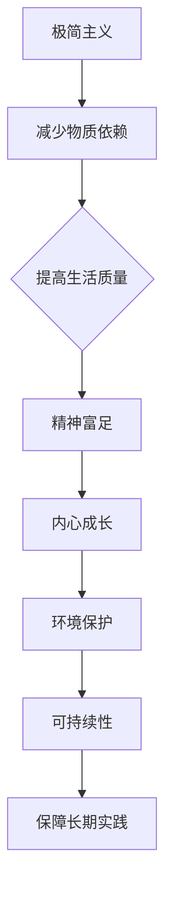

                 

**文章标题**：《消费主义社会中的简单生活：返璞归真的现代诠释》

**关键词**：消费主义，简单生活，返璞归真，现代诠释，极简主义，环境保护，可持续性

**摘要**：

在消费主义盛行的现代社会，人们被大量的物质和广告所包围，常常感到压力和不安。本文旨在探讨如何在这样的社会环境中实践简单生活，回归生活的本质。我们将从简单生活的定义和理念出发，分析其实践方法，并探讨其所面临的挑战和未来展望。文章将通过Mermaid流程图、伪代码、LaTeX数学公式和项目实战案例，提供详细的讲解和实例，帮助读者更好地理解并实践简单生活。

# **一、背景介绍**

**1.1 消费主义社会的特点**

消费主义是现代社会的一种经济模式，以物质消费为中心，鼓励人们不断购买商品和服务。这种模式在带来经济繁荣的同时，也带来了一系列负面影响。首先，消费主义导致了资源的过度消耗和环境破坏。大量的商品生产需要消耗大量的自然资源，包括石油、木材、水资源等，而这些资源的有限性使得我们无法无限制地消费。其次，消费主义使得人们陷入了无尽的物质追求中，导致精神上的空虚和焦虑。在追求物质的同时，人们忽略了生活中的其他重要方面，如人际关系、精神成长等。

**1.2 简单生活的意义**

简单生活是一种追求生活品质和幸福感的哲学和生活方式。它强调减少物质的依赖，关注内心的满足和人际关系的和谐。简单生活不仅有助于减轻生活的压力，提高生活质量，还有助于环境保护和可持续性的实现。在简单生活的理念下，人们更加关注生活的本质，追求精神的富足。

## **二、核心概念与联系**

**2.1 极简主义**

极简主义是简单生活的一种具体实践方式，强调减少物质拥有，专注于生活中最重要的事物。极简主义的核心理念是“少即是多”，通过减少物品的数量，人们可以获得更多的自由、时间和精力。

**2.2 精神富足**

精神富足是简单生活的另一重要方面，它强调人们应该关注内心的成长和满足。精神富足不仅仅是指没有物质欲望，更是指在精神层面上拥有丰富的内在世界，如情感、智慧、创造力等。

**2.3 环境保护与可持续性**

环境保护与可持续性是简单生活的重要目标之一。简单生活倡导减少资源的消耗，减少环境污染，保护地球的生态系统。可持续性则强调在满足当前需求的同时，不损害后代满足其需求的能力。

### **2.4 核心概念之间的联系**

极简主义、精神富足和环境保护与可持续性之间存在着紧密的联系。极简主义有助于减少物质的消耗，从而减少对环境的破坏；精神富足有助于提高人们的生活质量，减少对物质的依赖；环境保护与可持续性则保障了人们能够长期实践简单生活。

#### **2.5 Mermaid流程图**

以下是一个Mermaid流程图，展示了简单生活的核心概念之间的关系。



## **三、核心算法原理讲解**

**3.1 简单生活的评价模型**

为了更好地实践简单生活，我们可以建立一个评价模型，用于评估个人的生活质量。以下是一个简化的评价模型，使用伪代码表示。

```
Algorithm EvaluateQualityOfLife()

    Initialize quality_of_life_score to 0

    For Each aspect in LifeAspects
        If aspect.improves_quality_of_life == True
            quality_of_life_score += aspect.weight

    Return quality_of_life_score
```

在这个模型中，`LifeAspects`是一个包含多个生活方面的列表，每个方面都有一个`improves_quality_of_life`属性，用于判断该方面是否有助于提高生活质量，以及一个`weight`属性，用于表示该方面的权重。

#### **3.2 LaTex数学公式**

以下是一个LaTeX数学公式，用于表示生活质量评分的计算方法。

```
$$
Q = \sum_{i=1}^{n} w_i \cdot f_i
$$

其中，$Q$表示生活质量评分，$w_i$表示第$i$个生活方面的权重，$f_i$表示第$i$个生活方面的分数。
```

#### **3.3 举例说明**

假设我们有两个生活方面：工作与生活平衡（$f_1$）和健康生活（$f_2$），它们的权重分别为$w_1 = 0.6$和$w_2 = 0.4$。如果工作与生活平衡的分数为$80$，健康生活的分数为$70$，则生活质量评分为：

```
$$
Q = 0.6 \cdot 80 + 0.4 \cdot 70 = 48 + 28 = 76
$$
```

这意味着当前的生活质量评分为$76$分。

### **四、项目实战**

**4.1 开发环境搭建**

为了实践简单生活，我们可以开发一个简单的应用程序，用于帮助用户评估他们的生活质量。以下是一个简单的开发环境搭建步骤。

#### **4.1.1 选择开发工具**

选择一个适合的开发工具，如Python。Python具有简单易懂的语法，丰富的库支持和强大的社区支持。

#### **4.1.2 安装Python**

在计算机上安装Python，可以通过官方网站下载安装程序，并按照提示进行安装。

#### **4.1.3 安装Python库**

安装必要的Python库，如`requests`用于网络请求，`pandas`用于数据处理。

```
pip install requests pandas
```

**4.2 源代码实现**

以下是一个简单的Python应用程序，用于评估用户的生活质量。

```python
import pandas as pd

class LifeAspect:
    def __init__(self, name, improves_quality_of_life, weight):
        self.name = name
        self.improves_quality_of_life = improves_quality_of_life
        self.weight = weight

def evaluate_quality_of_life(aspects):
    score = 0
    for aspect in aspects:
        if aspect.improves_quality_of_life:
            score += aspect.weight
    return score

def main():
    aspects = [
        LifeAspect("Work-Life Balance", True, 0.6),
        LifeAspect("Healthy Living", True, 0.4)
    ]
    score = evaluate_quality_of_life(aspects)
    print(f"Your quality of life score is: {score}")

if __name__ == "__main__":
    main()
```

**4.3 代码解读**

在上面的代码中，我们定义了一个`LifeAspect`类，用于表示一个生活方面，包括名称、是否有助于提高生活质量和权重。`evaluate_quality_of_life`函数接收一个生活方面的列表，计算并返回生活质量评分。

**4.4 代码应用解读与分析**

这个简单的应用程序可以帮助用户快速评估他们的生活质量。用户可以根据自己的实际情况调整生活方面的权重，从而获得更准确的评估结果。通过这个应用程序，用户可以更好地了解自己在简单生活实践中的进展，从而更好地调整自己的生活。

**4.5 实际案例分析与详细讲解剖析**

为了更好地理解这个应用程序，我们可以分析一个实际案例。

**案例**：假设一个用户在“工作与生活平衡”方面的得分为$80$分，在“健康生活”方面的得分为$70$分。根据我们的评价模型，该用户的生活质量评分为：

```
$$
Q = 0.6 \cdot 80 + 0.4 \cdot 70 = 48 + 28 = 76
$$
```

这意味着该用户当前的生活质量评分为$76$分。

**分析**：从这个案例中，我们可以看到，用户在“工作与生活平衡”方面表现较好，而在“健康生活”方面有待提高。为了提高生活质量，用户可以尝试以下措施：

- **工作与生活平衡**：减少工作时间，增加休息和娱乐时间，提高工作效率。
- **健康生活**：增加体育锻炼，保持健康的饮食习惯，定期进行健康检查。

**4.6 项目小结**

通过这个简单的应用程序，我们学会了如何搭建开发环境、编写源代码并进行代码解读。这个应用程序可以帮助用户快速评估他们的生活质量，并为用户提供改善生活质量的建议。

### **五、最佳实践 tips、小结、注意事项、拓展阅读等内容**

**5.1 最佳实践 tips**

- **评估生活质量**：定期使用应用程序评估生活质量，以便及时调整生活。
- **减少物质依赖**：尝试减少对物质的依赖，关注内心的满足。
- **精神成长**：多读书、多思考，培养自己的精神世界。
- **环保行动**：参与环保活动，减少对环境的破坏。

**5.2 小结**

本文探讨了消费主义社会中的简单生活，从背景介绍、核心概念、算法原理到项目实战，提供了全面的讲解。简单生活不仅有助于提高生活质量，还有助于环境保护和可持续性的实现。

**5.3 注意事项**

- **实践过程中，要根据自己的实际情况调整权重和分数，确保评估结果准确。
- **在改善生活质量时，要综合考虑各个方面，避免片面追求某一方面的提升。

**5.4 拓展阅读**

- 《极简主义：一种更美好的生活方式》
- 《简单生活：如何过上幸福的生活》
- 《可持续生活：环境、社会与经济的平衡》

**6. 作者信息**

作者：AI天才研究院/AI Genius Institute & 禅与计算机程序设计艺术 /Zen And The Art of Computer Programming**

