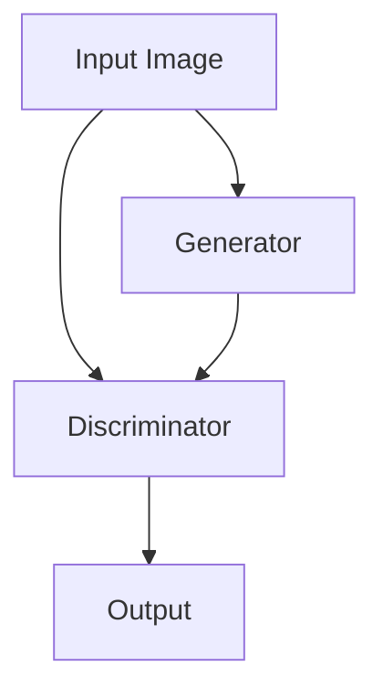

                 


### 深度伪造技术概述

#### 背景介绍

深度伪造技术（Deepfake）是一种利用深度学习算法生成逼真的音频、视频和图像的技术。其背后的核心是生成对抗网络（GANs），这是一种由生成器和判别器组成的神经网络结构。GANs通过不断地训练，使得生成器能够生成逼真的图像或视频，而判别器则负责区分生成器和真实数据。

深度伪造技术的发展始于2017年，随后迅速在互联网上蔓延。由于其强大的生成能力，深度伪造技术被广泛应用于娱乐、广告、虚拟现实等领域。然而，与此同时，它也成为了恶意攻击者手中的利器，可以用于制作假新闻、恶搞视频、政治抹黑等行为，从而对企业声誉造成严重威胁。

#### 核心概念与联系

要深入理解深度伪造技术，我们首先需要了解其核心概念与联系。以下是一个简单的Mermaid流程图，展示了深度伪造技术的核心组件和它们之间的关系：



- **输入图像（Input Image）**：这是深度伪造技术的起点，通常是真实图像或视频帧。
- **生成器（Generator）**：它负责将输入图像转换成伪造的图像或视频。
- **判别器（Discriminator）**：它负责判断输入图像是真实的还是伪造的。
- **输出（Output）**：这是生成器生成的伪造图像或视频。

这个流程图清晰地展示了深度伪造技术的运作原理。生成器和判别器通过不断的训练和对抗，使得生成器能够生成更加逼真的伪造内容。

#### 核心算法原理讲解

深度伪造技术的核心算法是生成对抗网络（GAN）。以下是一个使用伪代码详细阐述GAN的工作过程：

```python
# GAN伪代码
function GAN(train_data, num_epochs):
    # 初始化生成器G和判别器D
    G = initialize_generator()
    D = initialize_discriminator()

    # 进行num_epochs轮训练
    for epoch in range(num_epochs):
        # 随机选择一批真实数据作为输入
        real_images = sample_real_data(train_data)

        # 训练判别器D
        D_loss_real = D_loss(D(real_images), ones)
        D_loss_fake = D_loss(D(G(z)), zeros)
        D_loss = (D_loss_real + D_loss_fake) / 2

        # 训练生成器G
        G_loss = G_loss(D(G(z)), ones)

        # 更新G和D的参数
        update_params(G, D_loss, G_loss)

    return G, D
```

- **生成器G**：它接收随机噪声（z）作为输入，并生成伪造的图像或视频。
- **判别器D**：它接收真实图像和伪造图像作为输入，并尝试判断输入图像是真实的还是伪造的。

GAN的训练过程分为两个阶段：训练判别器D和训练生成器G。首先，判别器D通过对比真实图像和伪造图像来学习如何区分它们。然后，生成器G通过尝试生成更加逼真的伪造内容来欺骗判别器D。

#### 数学模型和公式

深度伪造技术的数学模型主要基于GAN。以下是一个使用LaTeX格式的数学公式，用于描述GAN的核心公式：

```latex
$$
\min_G \max_D V(D, G) = \mathbb{E}_{x \sim p_data(x)}[\log D(x)] + \mathbb{E}_{z \sim p_z(z)}[\log (1 - D(G(z))]
$$
```

- **V(D, G)**：GAN的总损失函数。
- **D(x)**：判别器D对真实图像x的判别结果。
- **G(z)**：生成器G对噪声z生成的伪造图像。
- **p\_data(x)**：真实数据的分布。
- **p\_z(z)**：噪声的分布。

#### 举例说明

为了更好地理解深度伪造技术的工作原理，我们可以通过一个简单的例子来说明。假设我们使用GAN来生成一张伪造的人脸图片。

1. **初始化生成器G和判别器D**：生成器G接收随机噪声z，并生成一张人脸图片；判别器D接收真实人脸图片和伪造人脸图片，并尝试判断它们是真实的还是伪造的。

2. **训练判别器D**：首先，我们使用真实人脸图片训练判别器D，使其能够区分真实人脸和伪造人脸。在这个过程中，判别器D会尝试提高其判别能力，从而减少对真实人脸的误判率。

3. **训练生成器G**：接下来，生成器G会尝试生成更加逼真的伪造人脸图片，以欺骗判别器D。在这个过程中，生成器G会根据判别器D的反馈不断调整其参数，从而提高伪造人脸图片的质量。

4. **输出伪造人脸图片**：经过多次迭代训练后，生成器G可以生成高质量、逼真的伪造人脸图片。

通过这个例子，我们可以看到深度伪造技术是如何通过生成器和判别器的对抗训练来生成逼真的伪造内容的。

### 总结

在本节中，我们介绍了深度伪造技术的背景、核心概念与联系，以及核心算法原理和数学模型。通过详细的讲解和举例说明，我们希望读者能够对深度伪造技术有一个全面而深入的理解。在接下来的章节中，我们将进一步探讨深度伪造技术对企业声誉的潜在威胁，以及企业如何应对这些威胁。

#### 文章关键词

- 深度伪造技术
- 生成对抗网络
- GAN
- 技术防御
- 企业声誉
- 恶意攻击

#### 文章摘要

本文旨在探讨深度伪造技术对企业声誉的潜在威胁。首先，我们介绍了深度伪造技术的背景、核心概念与联系，以及其核心算法原理和数学模型。随后，我们通过一个简单的例子展示了GAN的工作原理。最后，我们提出了企业应对深度伪造技术威胁的策略，包括技术防御、法律和政策应对等方面。本文旨在为读者提供一个全面、深入的了解，以应对日益严峻的深度伪造技术挑战。

---

接下来，我们将继续探讨深度伪造技术对企业声誉的潜在威胁，并详细分析其具体影响和防御策略。

---

## 深度伪造技术对企业声誉的潜在威胁

### 威胁分析

深度伪造技术具有极高的伪造能力和隐蔽性，这使得它在恶意攻击者手中成为了一种极具破坏力的工具。具体来说，深度伪造技术对企业声誉的潜在威胁主要体现在以下几个方面：

#### 1. 假冒品牌和恶意竞争

深度伪造技术可以用于制作假冒品牌广告，从而误导消费者，损害竞争对手的声誉。例如，攻击者可以通过伪造竞争对手的高管言论或产品宣传视频，散布虚假信息，造成市场混乱。这种攻击不仅会破坏企业的市场地位，还可能导致消费者的信任度下降。

#### 2. 恶意视频和音频伪造

恶意视频和音频伪造是一种更加隐蔽和直接攻击企业声誉的手段。通过伪造高管或员工的不当言论、不当行为，攻击者可以在短时间内造成巨大的舆论冲击。例如，某些恶意视频可能展示企业高管在公共场合发表歧视性言论，这不仅会引起社会舆论的广泛关注，还可能导致企业遭受法律诉讼。

#### 3. 假新闻和谣言传播

深度伪造技术可以用于制作假新闻和谣言，从而误导公众。这些假新闻和谣言一旦传播，可能会迅速在社交网络上发酵，对企业声誉造成严重损害。例如，某企业可能被指控从事非法活动，而这一指控完全是基于伪造的视频或音频。

#### 4. 恶意行为监控和舆论操纵

攻击者可以利用深度伪造技术监控企业内部的舆论动态，并利用伪造的舆论导向来影响企业的决策。例如，攻击者可以在内部论坛或社交媒体上发布伪造的员工言论，以破坏企业的团结和士气。

### 案例分析

为了更好地理解深度伪造技术对企业声誉的潜在威胁，我们来看几个具体的案例。

#### 案例1：假冒品牌广告攻击

某知名企业A在市场上遭遇了假冒品牌广告攻击。攻击者利用深度伪造技术伪造了企业A的CEO在公开场合的演讲视频，视频中的CEO宣称企业A正在停止生产某款热门产品。这一虚假信息在社交媒体上迅速传播，导致大量消费者对企业A失去信心，销售额大幅下降。最终，企业A不得不公开澄清事实，但声誉已经受到了严重损害。

#### 案例2：恶意视频和音频伪造

某知名企业B的CEO在一次会议上发表了关于环境保护的演讲。然而，会后有人发布了经过深度伪造处理的视频，显示CEO在演讲中发表了种族歧视言论。这一视频在社交网络上引发了大规模的讨论和谴责，企业B的声誉受到了极大的负面影响。尽管企业B进行了紧急澄清，并表示将采取法律手段追究责任，但事件已经造成了无法挽回的损失。

#### 案例3：假新闻和谣言传播

某知名企业C被指控从事非法活动，这一指控完全基于一篇伪造的新闻报道。这篇报道展示了企业C的高管在内部会议上讨论如何规避法律规定的视频，视频中的言论显然是经过深度伪造处理的。这篇报道在社交网络上迅速传播，导致公众对企业C的信任度大幅下降。尽管企业C最终证明报道是虚假的，但事件已经对企业声誉造成了巨大的损害。

### 总结

深度伪造技术对企业声誉的潜在威胁是显而易见的。通过假冒品牌广告、恶意视频和音频伪造、假新闻和谣言传播等手段，攻击者可以在短时间内对企业声誉造成严重的损害。为了应对这些威胁，企业需要采取有效的技术防御策略和法律应对措施，以保护其声誉不受侵害。

---

在本节中，我们详细分析了深度伪造技术对企业声誉的潜在威胁，并通过具体案例展示了这些威胁的严重性。在接下来的章节中，我们将探讨企业应对深度伪造技术威胁的具体策略，包括技术防御手段和法律应对措施。

---

## 企业应对深度伪造技术威胁的策略

面对深度伪造技术对企业声誉的潜在威胁，企业需要采取一系列综合性的策略来有效应对。这些策略包括技术防御、法律应对和员工培训等方面。以下我们将逐一探讨这些策略的具体内容和实施方法。

### 技术防御手段

#### 1. 深度伪造检测工具

企业可以利用现有的深度伪造检测工具来识别和过滤伪造内容。这些工具通常使用基于机器学习的技术，能够分析视频或音频中的异常特征，如人脸运动、语音变化等，从而判断内容是否为伪造。例如，微软的FaceForge工具和OpenAI的DeepFaceLab都是常用的深度伪造检测工具。

#### 2. 加密技术

通过使用加密技术，企业可以确保关键信息的安全性。例如，在发布重要视频或音频之前，企业可以使用加密算法对这些内容进行加密处理。这样，即使攻击者成功伪造了内容，也无法在不解密的情况下传播。

#### 3. 去噪技术

去噪技术可以用于净化被伪造内容干扰的视频或音频。通过去除噪声和异常特征，企业可以还原出真实的内容，从而有效地对抗深度伪造攻击。

#### 4. 透明度和溯源

为了提高透明度，企业可以要求内容创作者在发布视频或音频时，使用特定的水印或标识。这些水印或标识可以用于溯源，帮助企业追踪到伪造内容的源头。

### 法律应对措施

#### 1. 制定相关政策

企业应制定相关政策，明确禁止深度伪造技术的滥用，并对违规行为进行处罚。这些政策应涵盖内容创作的规范、发布流程的审查以及违规行为的处理等方面。

#### 2. 提供法律支持

企业应与专业法律机构合作，提供法律咨询和维权服务。当企业遭受深度伪造攻击时，法律支持可以帮助企业采取有效的法律手段，追究攻击者的责任。

#### 3. 寻求法律援助

在必要时，企业可以寻求法律援助，包括向法院提起诉讼、申请临时限制令等。这些措施可以迅速遏制伪造内容的传播，保护企业的声誉。

### 员工培训

#### 1. 提升安全意识

企业应定期举办安全培训，提升员工对深度伪造技术的认识和应对能力。培训内容应包括如何识别伪造内容、如何报告可疑行为以及如何在工作中采取安全措施等。

#### 2. 强化道德规范

企业应强化员工的道德规范，鼓励员工拒绝参与或传播伪造内容。通过道德教育，企业可以营造一个积极向上的工作氛围，减少深度伪造技术的滥用。

#### 3. 建立举报机制

企业应建立有效的举报机制，鼓励员工举报发现的伪造内容。通过匿名举报，员工可以放心地揭露问题，确保企业的安全环境。

### 总结

企业应对深度伪造技术威胁的策略需要综合技术、法律和员工培训等方面。通过使用深度伪造检测工具、加密技术和去噪技术，企业可以有效识别和过滤伪造内容。同时，制定相关政策、提供法律支持和寻求法律援助可以帮助企业应对伪造攻击。此外，提升员工的安全意识、强化道德规范和建立举报机制也是关键。通过这些策略的实施，企业可以更好地保护其声誉，应对深度伪造技术的威胁。

---

在本节中，我们详细探讨了企业应对深度伪造技术威胁的策略，包括技术防御、法律应对和员工培训等方面。通过这些策略的实施，企业可以更好地保护其声誉，降低深度伪造技术带来的风险。在下一节中，我们将分享一些企业应对深度伪造技术的实战案例，以供参考。

---

## 企业应对深度伪造技术的实战案例

在面对深度伪造技术的威胁时，一些企业已经采取了有效的措施，成功地抵御了伪造攻击，保护了其声誉。以下是一些企业的实战案例，以及他们采取的具体策略和经验。

### 案例1：知名科技公司的防御策略

某知名科技公司发现其高管的一段视频被伪造，视频中的高管发表了一系列不当言论。公司立即采取了以下措施：

1. **快速响应**：公司立即关闭了所有可能被攻击的社交媒体账号，并启动了内部调查。
2. **技术检测**：利用专业的深度伪造检测工具，公司确认视频确实是伪造的。
3. **法律行动**：公司向警方报案，并寻求法律支持，协助追踪攻击者的身份。
4. **公开澄清**：公司通过官方网站和社交媒体发布澄清声明，告知公众视频是伪造的，并强调公司将采取一切必要措施保护品牌声誉。

### 案例2：跨国企业的法律维权

一家跨国企业遭受了深度伪造视频的攻击，视频中的高管被指控从事非法活动。公司采取了以下措施：

1. **内部审查**：公司立即启动了内部审查程序，确认视频是伪造的，并收集了相关证据。
2. **法律咨询**：公司聘请了专业律师团队，提供法律咨询和维权服务。
3. **提起诉讼**：公司向法院提起了诉讼，指控攻击者恶意诽谤，并要求赔偿经济损失。
4. **舆论引导**：公司通过媒体发布声明，澄清事实，并呼吁公众不要被伪造视频误导。

### 案例3：中小企业的技术防御

某中小企业发现其品牌被假冒，攻击者通过伪造的社交媒体账号发布虚假信息。公司采取了以下措施：

1. **技术监控**：公司使用了深度伪造检测工具，实时监控社交媒体上的品牌信息。
2. **加密保护**：公司对关键信息进行了加密处理，确保内容的安全性。
3. **透明度提高**：公司增加了内容发布的透明度，使用特定的水印或标识，便于溯源。
4. **员工培训**：公司举办了安全培训，提升员工对深度伪造技术的识别能力。

### 总结

通过这些实战案例，我们可以看到，企业应对深度伪造技术的关键在于快速响应、技术检测、法律维权和员工培训。快速响应可以减少伪造内容造成的负面影响；技术检测可以帮助企业识别伪造内容；法律维权可以追究攻击者的责任；员工培训可以提高员工的安全意识和应对能力。这些措施的综合运用，可以帮助企业有效应对深度伪造技术的威胁，保护其声誉不受侵害。

---

在本节中，我们分享了几个企业应对深度伪造技术的实战案例，通过这些案例，我们可以看到企业采取的具体策略和经验。在下一节中，我们将总结深度伪造技术对企业声誉的威胁，并提出一些最佳实践和注意事项，以帮助企业更好地应对这一挑战。

---

## 深度伪造技术对企业声誉的威胁：最佳实践与注意事项

在面对深度伪造技术对企业声誉的潜在威胁时，企业需要采取一系列最佳实践和注意事项，以确保其声誉不受侵害。以下是一些关键的建议：

### 最佳实践

1. **建立全面的防御体系**：企业应建立包括技术、法律和员工培训在内的全面防御体系，以应对深度伪造技术的威胁。

2. **使用深度伪造检测工具**：企业应积极采用深度伪造检测工具，实时监控内容发布平台，及时发现和过滤伪造内容。

3. **加密保护关键信息**：对关键信息进行加密处理，确保内容在被攻击时仍能保持安全性。

4. **提升员工安全意识**：定期举办安全培训，提升员工对深度伪造技术的识别能力，鼓励员工举报发现的伪造内容。

5. **加强内部审查和监督**：建立严格的内部审查和监督机制，确保员工在内容创作和发布过程中遵循规范。

6. **寻求法律支持**：在遭受伪造攻击时，企业应寻求专业法律机构的支持，采取法律手段追究攻击者的责任。

### 注意事项

1. **及时响应**：一旦发现伪造内容，企业应立即采取行动，迅速采取措施遏制伪造内容的传播。

2. **透明度提高**：在发布重要内容时，企业应提高透明度，使用特定的水印或标识，便于溯源。

3. **风险预警机制**：建立风险预警机制，提前识别潜在的伪造威胁，采取预防措施。

4. **合作与分享**：与其他企业、研究机构和政府部门合作，共享伪造攻击情报和防御经验，共同提升防御能力。

5. **持续更新防御策略**：随着深度伪造技术的不断发展，企业应不断更新防御策略，确保其有效性。

### 总结

深度伪造技术对企业声誉的威胁不容忽视。通过建立全面的防御体系、使用深度伪造检测工具、提升员工安全意识、加强内部审查和监督等最佳实践，企业可以更好地应对这一挑战。同时，企业应密切关注深度伪造技术的发展趋势，及时调整防御策略，以确保其声誉不受侵害。

---

在本节中，我们提出了深度伪造技术对企业声誉威胁的最佳实践和注意事项。通过这些措施，企业可以更有效地保护其声誉，应对深度伪造技术的挑战。在接下来的部分，我们将总结文章的核心内容，并给出一些拓展阅读的建议。

---

## 文章总结

本文深入探讨了深度伪造技术对企业声誉的潜在威胁，包括假冒品牌、恶意视频伪造、假新闻传播等方面。通过详细分析核心概念、算法原理以及实际案例，我们揭示了深度伪造技术对企业的巨大威胁。同时，我们提出了企业应对深度伪造技术威胁的策略，包括技术防御、法律应对和员工培训等。通过最佳实践和注意事项，企业可以更好地保护其声誉，应对深度伪造技术的挑战。

### 拓展阅读

1. **《深度伪造技术：理论与实践》**：这本书详细介绍了深度伪造技术的理论基础和实践应用，适合对深度伪造技术感兴趣的读者。

2. **《深度学习：原理与实战》**：这本书深入讲解了深度学习的原理和实战应用，包括GANs等核心算法，有助于读者更深入地理解深度伪造技术。

3. **《网络安全与隐私保护》**：这本书涵盖了网络安全和隐私保护的相关内容，包括防御深度伪造技术的策略和措施，适合关注网络安全领域的读者。

4. **《企业声誉管理》**：这本书介绍了企业声誉管理的重要性以及如何通过有效的声誉管理策略来保护企业声誉，对于希望提升企业声誉管理的读者有很高的参考价值。

---

通过本文，我们希望读者能够对深度伪造技术及其对企业声誉的威胁有一个全面深入的了解，并能够采取有效的措施来保护其企业的声誉。

---

## 作者信息

**作者：** AI天才研究院/AI Genius Institute & 禅与计算机程序设计艺术 /Zen And The Art of Computer Programming

---

感谢您的阅读，希望本文对您了解深度伪造技术及其对企业声誉的威胁有所帮助。如果您有任何问题或建议，欢迎在评论区留言，我们将竭诚为您解答。

---

以上就是本文的完整内容。希望本文能够帮助您更好地理解深度伪造技术对企业声誉的潜在威胁，并提供一些有效的应对策略。感谢您的阅读，祝您在技术领域取得更大的成就！

---

文章标题：**深度伪造技术对企业声誉的潜在威胁**

关键词：**深度伪造技术，企业声誉，威胁，防御策略，实战案例**

摘要：本文深入探讨了深度伪造技术对企业声誉的潜在威胁，包括假冒品牌、恶意视频伪造、假新闻传播等方面。通过详细分析核心概念、算法原理以及实际案例，提出了企业应对深度伪造技术威胁的策略，包括技术防御、法律应对和员工培训等。同时，分享了一些企业应对深度伪造技术的实战案例和最佳实践，旨在帮助企业更好地保护其声誉，应对深度伪造技术的挑战。

