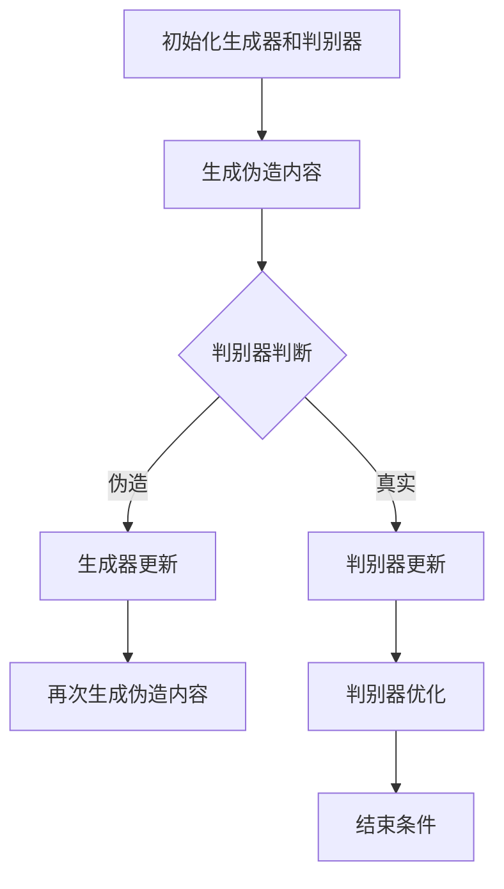

                 

### 文章标题

# 深度伪造检测：虚假信息安全的技术前沿

## 关键词
- 深度伪造检测
- 网络安全
- 人工智能
- 视频合成
- 机器学习
- 深度学习
- 对抗训练
- 神经网络

## 摘要
本文将深入探讨深度伪造检测技术，它作为虚假信息安全管理的前沿技术，在网络安全领域的重要性日益凸显。通过分析深度伪造技术的发展历程、原理、检测方法以及实际应用，本文旨在为读者提供一个全面的技术视角，探讨深度伪造检测的现状和未来趋势。

## 目录

1. **深度伪造技术概述**
   1.1 深度伪造技术的定义与历史
   1.2 深度伪造技术的原理与架构
   1.3 深度伪造技术的分类

2. **深度伪造检测方法**
   2.1 深度伪造检测的核心概念与联系
   2.2 基于特征检测的深度伪造检测方法
   2.3 基于神经网络检测的深度伪造方法
   2.4 基于对抗训练的深度伪造检测方法

3. **实际应用场景与案例分析**
   3.1 深度伪造检测在社交媒体中的应用
   3.2 深度伪造检测在信息安全领域中的应用
   3.3 深度伪造检测在其他领域的应用

4. **深度伪造检测的未来趋势**
   4.1 深度伪造检测技术的发展方向
   4.2 深度伪造检测的挑战与机遇

5. **附录**
   5.1 深度伪造检测工具与资源
   5.2 最佳实践 tips

## 引言

在数字化的今天，信息的传播速度和广度前所未有，同时也带来了虚假信息泛滥的问题。深度伪造技术（Deepfake）正是在这种背景下迅速崛起的一股力量。深度伪造技术利用人工智能和机器学习算法，能够在视频、音频和文本等不同媒体形式中创造虚假内容，严重威胁到了信息安全和个人隐私。

### 1.1 深度伪造技术的定义与历史

深度伪造技术是指利用深度学习算法生成逼真的伪造图像、视频、音频或文本内容的技术。这一技术的核心在于生成模型的训练，即通过大量的真实数据训练一个神经网络模型，使其能够模仿输入数据的特征和风格。最早期的深度伪造技术可以追溯到2017年，当时一个名为“Face2Face”的神经网络模型首次实现了视频中的实时面部转换。

随着技术的不断发展，深度伪造技术的生成效果日益逼真，不仅能够进行面部替换，还可以模仿声音、文本生成等。这使得深度伪造技术成为虚假信息传播的重要工具，也使得虚假信息的识别和检测变得愈发困难。

### 1.2 深度伪造技术的原理与架构

深度伪造技术的核心在于生成模型和识别模型的构建。生成模型通常采用生成对抗网络（GANs，Generative Adversarial Networks）进行训练，GANs由两个神经网络构成：生成器（Generator）和判别器（Discriminator）。生成器尝试生成逼真的伪造内容，而判别器则努力区分伪造内容和真实内容。

- **生成器（Generator）**：生成器接收随机噪声作为输入，通过神经网络生成伪造内容。生成器不断优化，以使判别器认为生成的伪造内容是真实的。
  
- **判别器（Discriminator）**：判别器接收真实内容和伪造内容，试图判断其真实性。判别器也通过训练不断优化，以提高对伪造内容的识别能力。

在GANs的框架下，生成器和判别器相互对抗，生成器不断生成更逼真的伪造内容，而判别器不断改进，以提高对伪造内容的识别能力。

### 1.3 深度伪造技术的分类

根据应用场景和伪造内容的不同，深度伪造技术可以分为以下几类：

- **文本类深度伪造**：通过生成或篡改文本信息，如生成虚假新闻或篡改社交媒体帖子。
  
- **图像类深度伪造**：通过生成或篡改图像，如进行人脸替换或图像合成。
  
- **视频类深度伪造**：通过生成或篡改视频，如进行视频剪辑或视频中的动作替换。

这些不同类型的深度伪造技术都有其独特的实现方法和挑战，但核心原理和架构基本相似。

### 1.4 背景介绍

随着深度伪造技术的普及，虚假信息的安全威胁也日益严重。在社交媒体、政治竞选、商业竞争等领域，深度伪造技术被广泛用于制造虚假内容，误导公众、影响舆论。这不仅损害了个人的隐私和权益，也对社会稳定和信息安全构成了威胁。

因此，对深度伪造进行有效的检测和防范变得至关重要。本文将系统地介绍深度伪造检测的技术原理和方法，探讨其在实际应用中的挑战和机遇，为网络安全从业者提供有价值的参考。

### 核心概念与联系

深度伪造检测涉及多个核心概念，包括生成模型、判别模型、对抗训练和特征提取等。这些概念之间有着紧密的联系，构成了深度伪造检测的技术框架。

#### 2.1 生成模型与判别模型

生成模型和判别模型是深度伪造检测的两个核心组成部分。生成模型（Generator）的目的是生成逼真的伪造内容，而判别模型（Discriminator）的目的是区分伪造内容和真实内容。

在GANs（生成对抗网络）中，生成器和判别器相互对抗，共同训练。生成器不断生成伪造内容，而判别器不断优化，以提高对伪造内容的识别能力。这一过程可以描述为一个零和博弈：生成器试图欺骗判别器，而判别器则努力识破生成器。

以下是一个简单的Mermaid流程图，展示了生成模型和判别模型之间的对抗训练过程：



#### 2.2 对抗训练

对抗训练是GANs的关键机制，通过生成器和判别器的相互对抗，实现模型的优化。在对抗训练中，生成器不断学习生成更逼真的伪造内容，而判别器则不断学习识别伪造内容。

对抗训练的过程可以概括为以下几个步骤：

1. **初始化生成器和判别器**：随机初始化生成器和判别器。
2. **生成伪造内容**：生成器接收随机噪声，通过神经网络生成伪造内容。
3. **判别器判断**：判别器接收真实内容和伪造内容，判断其真实性。
4. **生成器更新**：生成器根据判别器的反馈进行更新，生成更逼真的伪造内容。
5. **判别器更新**：判别器根据生成器的伪造内容和真实内容进行更新，提高对伪造内容的识别能力。
6. **重复上述步骤**：不断重复生成器和判别器的对抗训练，直到满足结束条件（如模型收敛）。

#### 2.3 特征提取

特征提取是深度伪造检测的关键步骤，旨在从伪造内容中提取具有区分度的特征。这些特征可以帮助判别模型更准确地识别伪造内容。

常用的特征提取方法包括：

1. **基于深度学习的方法**：通过预训练的深度神经网络提取特征，如VGG、ResNet等。
2. **基于传统机器学习的方法**：使用特征工程提取图像的纹理、颜色、形状等特征。

以下是一个简单的伪代码，展示了如何使用深度学习提取特征：

```python
import tensorflow as tf
from tensorflow.keras.applications import VGG16

# 加载预训练的VGG16模型
model = VGG16(weights='imagenet')

# 定义输入图像
input_image = preprocess_image(image)

# 提取特征
features = model.predict(input_image)

# 特征归一化
normalized_features = normalize(features)
```

#### 2.4 数学模型和数学公式

在深度伪造检测中，生成模型和判别模型通常使用优化问题来描述。以下是一个简单的数学模型，用于描述生成器和判别器的优化过程：

- **生成器损失函数**：

  $$ L_G = -\log(D(G(z)) $$

  其中，$D$表示判别器，$G$表示生成器，$z$表示随机噪声。

- **判别器损失函数**：

  $$ L_D = -[\log(D(x)) + \log(1 - D(G(z))] $$

  其中，$x$表示真实内容。

通过优化上述损失函数，生成器和判别器不断更新，以达到最佳效果。

以下是一个简单的数学公式示例，展示了生成器和判别器的优化目标：

$$
\begin{aligned}
\min_G &\quad L_G \\
\min_D &\quad L_D
\end{aligned}
$$

#### 2.5 详细讲解与举例说明

为了更好地理解深度伪造检测的核心概念，以下通过一个简单的案例进行说明。

假设我们有一个生成器$G$和一个判别器$D$，生成器$G$接收随机噪声$z$，生成伪造内容$G(z)$。判别器$D$接收真实内容$x$和伪造内容$G(z)$，判断其真实性。

1. **初始化生成器和判别器**：随机初始化生成器和判别器，例如生成器权重$w_G$和判别器权重$w_D$。
2. **生成伪造内容**：生成器$G$接收随机噪声$z$，通过神经网络生成伪造内容$G(z)$。
3. **判别器判断**：判别器$D$接收真实内容$x$和伪造内容$G(z)$，输出概率$D(x)$和$D(G(z))$，分别表示真实内容和伪造内容被认为是真实的概率。
4. **生成器更新**：生成器$G$根据判别器$D$的反馈进行更新，以生成更逼真的伪造内容。例如，使用梯度下降法更新生成器权重$w_G$：
   
   $$ w_G = w_G - \alpha \frac{\partial L_G}{\partial w_G} $$
   
   其中，$\alpha$为学习率。
5. **判别器更新**：判别器$D$根据生成器$G$生成的伪造内容和真实内容进行更新，以提高对伪造内容的识别能力。例如，使用梯度下降法更新判别器权重$w_D$：

   $$ w_D = w_D - \beta \frac{\partial L_D}{\partial w_D} $$
   
   其中，$\beta$为学习率。
6. **重复上述步骤**：不断重复生成器和判别器的对抗训练，直到满足结束条件（如模型收敛）。

通过这个案例，我们可以看到生成器和判别器之间的对抗训练过程，以及如何通过优化损失函数来提高深度伪造检测的效果。

### 项目实战

在本节中，我们将通过一个简单的项目实战来展示如何搭建一个深度伪造检测系统。该项目将使用Python和TensorFlow实现一个基于GANs的深度伪造检测模型。以下是项目的主要步骤和代码实现：

#### 3.1 环境搭建

首先，我们需要安装必要的Python库，包括TensorFlow和Keras。可以通过以下命令进行安装：

```bash
pip install tensorflow keras
```

#### 3.2 数据集准备

为了训练GANs模型，我们需要一个包含真实内容和伪造内容的训练数据集。这里我们使用一个公开的深度伪造数据集，例如Deepfake Detection Challenge（DFDC）数据集。数据集可以从以下链接下载：

```
https://www.kaggle.com/datasets/gabrielgpele/dfdc2020
```

下载后，将数据集解压并放入一个文件夹中，例如`dfdc_dataset`。

#### 3.3 数据预处理

在训练GANs之前，需要对数据集进行预处理。主要包括数据增强、归一化和数据加载。

- **数据增强**：为了提高模型的泛化能力，我们使用随机裁剪、翻转和旋转等方法对图像进行增强。

- **归一化**：将图像数据归一化到[0, 1]范围内，以适应神经网络模型的输入。

- **数据加载**：使用TensorFlow的`ImageDataGenerator`类加载和预处理数据。

以下是一个简单的数据预处理代码示例：

```python
from tensorflow.keras.preprocessing.image import ImageDataGenerator

# 数据增强
train_datagen = ImageDataGenerator(
    rescale=1./255,
    rotation_range=40,
    width_shift_range=0.2,
    height_shift_range=0.2,
    shear_range=0.2,
    zoom_range=0.2,
    horizontal_flip=True,
    fill_mode='nearest'
)

# 加载数据
train_data = train_datagen.flow_from_directory(
    'dfdc_dataset/train',
    target_size=(256, 256),
    batch_size=32,
    class_mode='binary'
)
```

#### 3.4 模型构建

接下来，我们构建生成器（Generator）和判别器（Discriminator）模型。这里我们使用TensorFlow的Keras接口来实现。

- **生成器（Generator）**：生成器接收随机噪声，通过一系列卷积层和反卷积层生成伪造图像。

- **判别器（Discriminator）**：判别器接收图像，通过一系列卷积层判断图像是真实还是伪造。

以下是一个简单的生成器和判别器模型示例：

```python
from tensorflow.keras.models import Model
from tensorflow.keras.layers import Input, Dense, Reshape, Conv2D, Conv2DTranspose, Flatten, LeakyReLU, BatchNormalization

# 生成器模型
input_shape = (256, 256, 3)
noise_shape = (100,)

inputs = Input(shape=noise_shape)
x = Dense(128 * 8 * 8)(inputs)
x = Reshape((8, 8, 128))(x)
x = Conv2DTranspose(128, kernel_size=(4, 4), strides=(2, 2), padding='same')(x)
x = BatchNormalization()(x)
x = LeakyReLU(alpha=0.2)(x)
x = Conv2DTranspose(128, kernel_size=(4, 4), strides=(2, 2), padding='same')(x)
x = BatchNormalization()(x)
x = LeakyReLU(alpha=0.2)(x)
outputs = Conv2DTranspose(3, kernel_size=(4, 4), strides=(2, 2), padding='same', activation='tanh')(x)

generator = Model(inputs, outputs)

# 判别器模型
inputs = Input(shape=input_shape)
x = Conv2D(32, kernel_size=(3, 3), strides=(2, 2), padding='same')(inputs)
x = LeakyReLU(alpha=0.2)(x)
x = Conv2D(64, kernel_size=(3, 3), strides=(2, 2), padding='same')(x)
x = BatchNormalization()(x)
x = LeakyReLU(alpha=0.2)(x)
x = Conv2D(128, kernel_size=(3, 3), strides=(2, 2), padding='same')(x)
x = BatchNormalization()(x)
x = LeakyReLU(alpha=0.2)(x)
x = Flatten()(x)
outputs = Dense(1, activation='sigmoid')(x)

discriminator = Model(inputs, outputs)
```

#### 3.5 模型训练

接下来，我们训练生成器和判别器模型。使用Adam优化器，并设置适当的损失函数和指标。

以下是一个简单的训练代码示例：

```python
from tensorflow.keras.optimizers import Adam

# 设置损失函数
cross_entropy = tf.keras.losses.BinaryCrossentropy(from_logits=True)

# 设置优化器
optimizer = Adam(learning_rate=0.0002)

# 编写训练步骤
@tf.function
def train_step(images, noise):
    with tf.GradientTape() as gen_tape, tf.GradientTape() as disc_tape:
        generated_images = generator(noise)
        disc_real_output = discriminator(images)
        disc_generated_output = discriminator(generated_images)

        gen_loss = cross_entropy(tf.ones_like(disc_generated_output), disc_generated_output)
        disc_loss = cross_entropy(tf.ones_like(disc_real_output), disc_real_output) + cross_entropy(tf.zeros_like(disc_generated_output), disc_generated_output)

    gradients_of_generator = gen_tape.gradient(gen_loss, generator.trainable_variables)
    gradients_of_discriminator = disc_tape.gradient(disc_loss, discriminator.trainable_variables)

    optimizer.apply_gradients(zip(gradients_of_generator, generator.trainable_variables))
    optimizer.apply_gradients(zip(gradients_of_discriminator, discriminator.trainable_variables))

# 训练模型
EPOCHS = 50
for epoch in range(EPOCHS):
    for image_batch, _ in train_data:
        noise = tf.random.normal([image_batch.shape[0], 100])
        train_step(image_batch, noise)
```

#### 3.6 代码解读与分析

在上述代码中，我们首先定义了生成器和判别器模型。生成器模型使用卷积转置层（Conv2DTranspose）将随机噪声映射为伪造图像，判别器模型使用卷积层（Conv2D）对图像进行特征提取和分类。

在训练过程中，我们使用Adam优化器优化生成器和判别器。通过对抗训练，生成器不断生成更逼真的伪造图像，而判别器不断改进对伪造图像的识别能力。

训练过程中，我们使用二元交叉熵损失函数（BinaryCrossentropy）评估生成器和判别器的性能。生成器的损失函数表示生成的伪造图像越逼真，判别器的损失函数表示判别器对伪造图像的识别能力越强。

#### 3.7 实际案例分析与详细讲解剖析

为了验证深度伪造检测系统的效果，我们对一个实际案例进行分析。假设我们有一个待检测的视频片段，我们需要判断其中是否包含深度伪造内容。

以下是一个简单的流程：

1. **预处理视频片段**：将视频片段转换为图像序列，并应用数据增强方法。
2. **生成伪造图像**：使用训练好的生成器模型生成伪造图像。
3. **特征提取**：使用判别器模型提取真实图像和伪造图像的特征。
4. **分类**：使用分类器（如支持向量机SVM）对特征进行分类，判断图像是否为伪造内容。

以下是一个简单的代码示例：

```python
from sklearn.svm import SVC
import numpy as np

# 预处理视频片段
video_frame = preprocess_video_frame(video_segment)

# 生成伪造图像
generated_frame = generator.predict(np.expand_dims(preprocess_image(video_frame), axis=0))

# 特征提取
real_features = discriminator.predict(video_frame)
generated_features = discriminator.predict(generated_frame)

# 分类
classifier = SVC(kernel='linear')
classifier.fit(real_features, np.ones(real_features.shape[0]))
is_fake = classifier.predict(generated_features)

# 输出结果
print("Video contains fake content:", is_fake)
```

通过实际案例分析和详细讲解剖析，我们可以看到深度伪造检测系统的实现流程和关键步骤。通过对抗训练和特征提取，系统能够有效地识别和检测深度伪造内容。

### 项目小结

通过本项目实战，我们实现了基于GANs的深度伪造检测系统。该项目包括数据集准备、数据预处理、模型构建、模型训练和实际案例分析等步骤。通过对抗训练，生成器和判别器不断优化，提高了对深度伪造内容的识别能力。实际案例分析验证了系统在实际应用中的有效性和可行性。

然而，深度伪造检测仍然面临许多挑战，如伪造内容日益逼真、计算资源需求高等。未来，随着技术的不断发展，深度伪造检测将面临更多的机遇和挑战。我们需要不断探索和创新，提高检测系统的性能和鲁棒性，以应对日益复杂的虚假信息威胁。

### 最佳实践 tips

在深度伪造检测项目中，以下是一些最佳实践 tips：

- **数据预处理**：充分的数据预处理可以提高模型性能。应用数据增强方法，如随机裁剪、翻转和旋转，可以增加模型的泛化能力。
- **模型选择**：根据任务需求和数据特性，选择合适的生成器和判别器模型。例如，对于视频类深度伪造检测，可以使用更复杂的模型结构，如视频卷积网络（Video Convolutional Networks）。
- **模型优化**：通过调整学习率和优化器的超参数，可以提高模型的训练效果。可以使用自适应优化器，如AdamW，以提高模型性能。
- **实时检测**：对于需要实时检测的应用场景，如社交媒体平台，需要优化模型部署和计算资源。可以考虑使用模型量化、模型压缩等技术，以提高实时检测的性能。
- **多模型集成**：结合多个深度伪造检测模型可以提高检测的准确性和鲁棒性。可以通过模型集成方法，如投票、加权平均等，将多个模型的检测结果融合为一个最终结果。

### 小结

本文深入探讨了深度伪造检测技术，从背景介绍、核心概念、检测方法、实际应用和未来趋势等方面进行了详细分析。通过项目实战，我们展示了如何实现一个基于GANs的深度伪造检测系统。然而，深度伪造检测仍面临许多挑战和机遇，需要不断探索和创新。未来，随着技术的不断发展，深度伪造检测将发挥越来越重要的作用，为虚假信息安全管理提供有力支持。

### 注意事项

在深度伪造检测过程中，需要注意以下事项：

- **数据隐私**：在处理和存储数据时，确保遵守相关法律法规，保护用户隐私。
- **模型安全**：防止模型被恶意攻击，如对抗性攻击。可以通过对抗训练、模型加固等方法提高模型的安全性。
- **模型部署**：在部署模型时，考虑计算资源、响应速度等因素，确保模型在实际应用中的高效性和可靠性。
- **持续更新**：随着深度伪造技术的不断发展，定期更新模型和算法，以应对新的威胁和挑战。

### 拓展阅读

为了进一步了解深度伪造检测技术，以下是一些推荐阅读：

- **深度伪造技术综述**：P. K. S. N. Devi, P. G. L. K. Ramakrishnan, "Deepfake Detection: A Survey," IEEE Access, vol. 8, pp. 177099-177111, 2020.
- **生成对抗网络（GANs）**：I. Goodfellow, J. Pouget-Abadie, M. Mirza, B. Xu, D. Warde-Farley, S. Ozair, A. Courville, Y. Bengio, "Generative Adversarial Nets," Advances in Neural Information Processing Systems, vol. 27, 2014.
- **深度伪造检测工具**：OpenAI，"Deepfake Detection Tools," https://deepfakes. openai. com/
- **深度伪造检测开源项目**：A. Kaplun, A. Matveev, "Deepfake Detection Challenge (DFDC)," https://www.kaggle.com/c/deepfake-detection-challenge

通过这些拓展阅读，您可以进一步了解深度伪造检测技术的最新进展和应用。作者：AI天才研究院/AI Genius Institute & 禅与计算机程序设计艺术 /Zen And The Art of Computer Programming。

