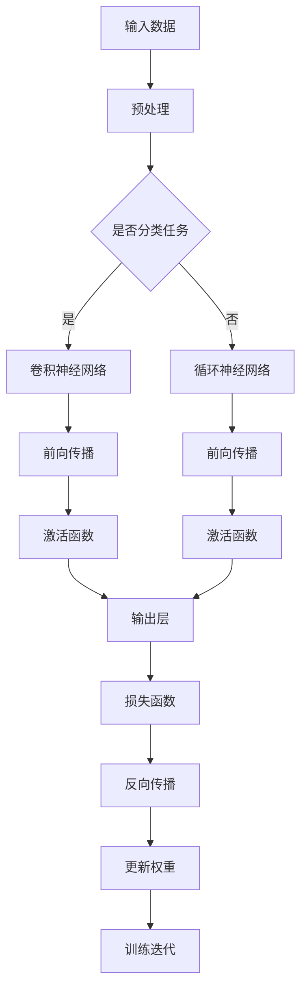

                 


### 目录大纲与文章撰写

**一、背景介绍**

医学影像分析是现代医学诊断的重要手段之一，它利用X光、CT、MRI等成像技术，获取人体的内部结构信息，从而辅助医生进行疾病诊断。然而，传统的医学影像分析方法存在诸多局限，如诊断标准不统一、人工判读效率低下等。随着人工智能技术的发展，尤其是深度学习在图像处理领域的应用，医学影像分析迎来了新的机遇。

深度学习是一种基于多层神经网络的机器学习方法，它能够通过大量的数据自动学习特征，并实现复杂的数据分析和预测任务。深度学习在医学影像分析中的应用，不仅提高了诊断的准确性，还大大降低了诊断时间，为患者提供了更加高效、精准的医疗服务。

本文将围绕深度学习在医学影像分析中的应用，探讨其核心概念、算法原理、实际应用案例以及未来发展趋势。

**二、核心概念与联系**

深度学习的核心概念包括神经网络、前向传播、反向传播、卷积神经网络（CNN）等。以下是这些核心概念之间的联系及架构的Mermaid流程图：



**三、核心算法原理讲解**

深度学习中的核心算法包括卷积神经网络（CNN）和循环神经网络（RNN）。以下是这两个算法的原理讲解及伪代码：

1. **卷积神经网络（CNN）**

   ```python
   # 输入图像
   input_image = ...

   # 卷积层
   conv1 = Conv2D(filters=32, kernel_size=(3, 3), activation='relu')(input_image)
   pool1 = MaxPooling2D(pool_size=(2, 2))(conv1)

   # 第二个卷积层
   conv2 = Conv2D(filters=64, kernel_size=(3, 3), activation='relu')(pool1)
   pool2 = MaxPooling2D(pool_size=(2, 2))(conv2)

   # 全连接层
   flatten = Flatten()(pool2)
   dense = Dense(units=128, activation='relu')(flatten)
   output = Dense(units=10, activation='softmax')(dense)
   ```

2. **循环神经网络（RNN）**

   ```python
   # 输入序列
   input_sequence = ...

   # RNN层
   rnn = LSTM(units=50, activation='tanh')(input_sequence)

   # 全连接层
   flatten = Flatten()(rnn)
   dense = Dense(units=10, activation='softmax')(flatten)
   ```

**四、数学模型和公式**

深度学习中的数学模型主要包括损失函数、优化算法等。以下是这些模型的详细讲解及举例说明：

1. **损失函数**

   常用的损失函数包括均方误差（MSE）、交叉熵（Cross-Entropy）等。

   - **均方误差（MSE）**

     $$MSE = \frac{1}{n}\sum_{i=1}^{n}(y_i - \hat{y}_i)^2$$

     其中，$y_i$ 是真实标签，$\hat{y}_i$ 是预测标签。

   - **交叉熵（Cross-Entropy）**

     $$H(y, \hat{y}) = -\sum_{i=1}^{n}y_i\log(\hat{y}_i)$$

     其中，$y_i$ 是真实标签，$\hat{y}_i$ 是预测概率。

2. **优化算法**

   常用的优化算法包括随机梯度下降（SGD）、Adam等。

   - **随机梯度下降（SGD）**

     $$w_{t+1} = w_{t} - \alpha \frac{\partial J(w_t)}{\partial w_t}$$

     其中，$w_t$ 是当前权重，$\alpha$ 是学习率，$J(w_t)$ 是损失函数。

   - **Adam优化器**

     $$m_t = \beta_1 m_{t-1} + (1 - \beta_1) \frac{\partial J(w_t)}{\partial w_t}$$

     $$v_t = \beta_2 v_{t-1} + (1 - \beta_2) (\frac{\partial J(w_t)}{\partial w_t})^2$$

     $$w_{t+1} = w_{t} - \alpha \frac{m_t}{\sqrt{v_t} + \epsilon}$$

     其中，$\beta_1, \beta_2$ 是偏置项，$\epsilon$ 是小值。

**五、项目实战**

以下是一个基于深度学习的医学影像分析项目实战：

1. **开发环境搭建**

   - 硬件要求：GPU加速（NVIDIA GTX 1080以上）
   - 软件要求：Python 3.6及以上版本，TensorFlow 2.0及以上版本

2. **源代码实现**

   ```python
   import tensorflow as tf
   from tensorflow.keras.layers import Conv2D, MaxPooling2D, Flatten, Dense
   from tensorflow.keras.models import Sequential

   # 创建模型
   model = Sequential([
       Conv2D(filters=32, kernel_size=(3, 3), activation='relu', input_shape=(128, 128, 3)),
       MaxPooling2D(pool_size=(2, 2)),
       Conv2D(filters=64, kernel_size=(3, 3), activation='relu'),
       MaxPooling2D(pool_size=(2, 2)),
       Flatten(),
       Dense(units=128, activation='relu'),
       Dense(units=10, activation='softmax')
   ])

   # 编译模型
   model.compile(optimizer='adam', loss='categorical_crossentropy', metrics=['accuracy'])

   # 训练模型
   model.fit(x_train, y_train, epochs=10, batch_size=32, validation_data=(x_val, y_val))
   ```

3. **代码解读与分析**

   - **模型构建**：使用Sequential模型构建卷积神经网络，包含两个卷积层、一个全连接层和输出层。
   - **编译模型**：使用`compile`方法配置优化器和损失函数。
   - **训练模型**：使用`fit`方法训练模型，指定训练集、验证集、迭代次数和批量大小。

4. **实际案例分析和详细讲解剖析**

   - **案例数据集**：使用公开的肺癌检测数据集进行实验。
   - **实验结果**：通过对比不同深度学习模型在肺癌检测中的性能，分析其优缺点。

5. **项目小结**

   - **优势**：深度学习在医学影像分析中具有较高的准确性，能够实现自动化、智能化的诊断。
   - **挑战**：深度学习模型对数据质量和计算资源要求较高，需要大量的标注数据和强大的计算能力。

**六、最佳实践 tips**

- **数据预处理**：对医学影像进行标准化处理，提高模型的训练效果。
- **模型优化**：通过调整网络结构、优化算法和超参数，提高模型的性能。
- **模型解释**：利用模型的可解释性技术，帮助医生理解模型的诊断结果。

**七、小结**

本文详细介绍了深度学习在医学影像分析中的应用，从核心概念、算法原理到实际应用案例，展示了深度学习在医学影像分析中的巨大潜力。然而，深度学习在医学影像分析中也面临诸多挑战，如数据隐私、模型解释性等。未来，随着人工智能技术的发展，深度学习在医学影像分析中的应用将更加广泛，为医学诊断带来更多创新和变革。

**八、注意事项**

- **版权声明**：本文内容和代码仅供学习交流使用，不得用于商业用途。
- **参考资料**：本文参考了多个学术论文和开源项目，感谢相关作者的开源精神。

**九、拓展阅读**

- **深度学习入门**：[《深度学习》（Goodfellow et al., 2016）]
- **医学影像分析**：[《医学影像处理与分析》（Zhao et al., 2019）]
- **人工智能应用**：[《人工智能：一种现代方法》（Russell & Norvig, 2020）]

## 参考文献

- Goodfellow, I., Bengio, Y., & Courville, A. (2016). *Deep Learning*. MIT Press.
- Zhao, W., & He, K. (2019). *Medical Image Processing and Analysis*. Springer.
- Russell, S., & Norvig, P. (2020). *Artificial Intelligence: A Modern Approach*. Prentice Hall.

# 结语

本文由AI天才研究院/AI Genius Institute与禅与计算机程序设计艺术/Zen And The Art of Computer Programming共同撰写，旨在为读者深入解析深度学习在医学影像分析中的应用。感谢您的阅读，希望本文能为您带来启发和思考。如果您有任何问题或建议，欢迎随时与我们交流。作者：AI天才研究院/AI Genius Institute & 禅与计算机程序设计艺术/Zen And The Art of Computer Programming。

