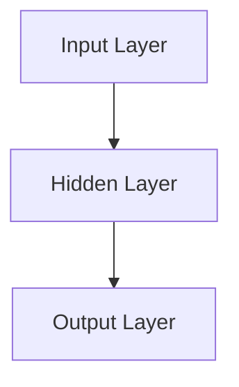
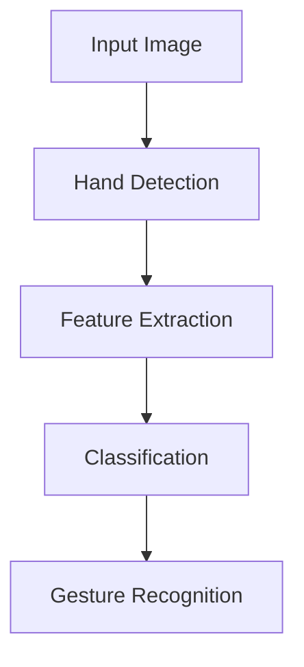
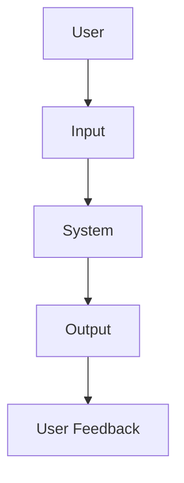
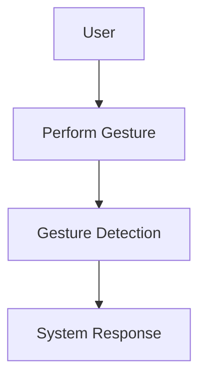
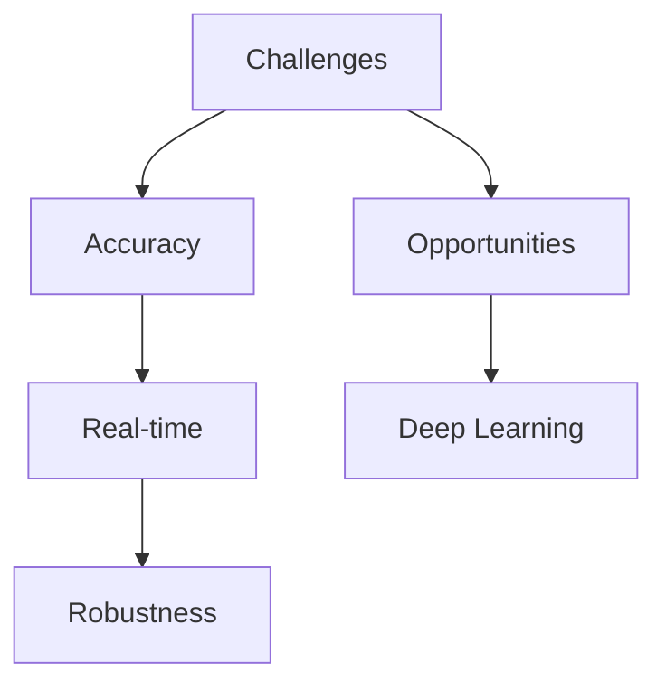
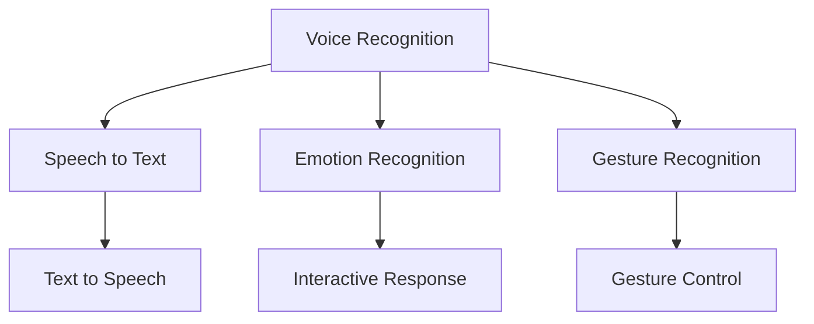

                 

### 深度学习在手势识别中的突破：增强人机交互体验

**关键词：** 深度学习，手势识别，人机交互，增强体验

**摘要：**  
本文探讨了深度学习在手势识别中的应用，以及如何通过深度学习技术提升人机交互的体验。首先介绍了深度学习和手势识别的基本概念，随后深入分析了深度学习在手势识别中的应用，包括核心算法原理、数学模型和公式，并通过项目实战展示了深度学习在增强人机交互中的实际应用。最后，本文总结了深度学习在手势识别和人机交互中的突破和未来发展方向。

## 引言

在当今科技飞速发展的时代，人机交互正逐渐成为人们日常生活和工作的重要方式。传统的键盘和鼠标操作已经难以满足人们对于便捷性和效率的需求，因此，更加自然、直观的手势识别技术应运而生。手势识别不仅能够提高人机交互的体验，还可以广泛应用于虚拟现实、智能家居、医疗保健等领域。

### 深度学习的核心概念

深度学习是一种基于人工神经网络的学习方法，通过构建多层神经网络模型，自动提取数据中的特征和规律。深度学习的核心概念包括神经网络结构、激活函数、优化器和学习算法。以下是一个简单的神经网络结构的Mermaid流程图：



### 手势识别的基本原理

手势识别是通过检测和分析图像或视频序列中的手势特征，来确定手势的类型和动作。手势识别的关键技术包括手部检测、特征提取和分类。以下是一个简单的手势识别流程图：



### 深度学习在手势识别中的应用

深度学习在手势识别中的应用极大地提升了识别的准确性和实时性。以下将详细分析深度学习在手势识别中的应用，包括核心算法原理、数学模型和公式。

#### 卷积神经网络（CNN）

卷积神经网络是一种用于图像识别和处理的强大工具，其核心思想是通过卷积操作提取图像中的局部特征。以下是一个简单的CNN算法的伪代码：

```python
def cnn(image, weights, biases):
    for each layer in layers:
        image = convolution(image, weights[layer])
        image = activation_function(image, biases[layer])
    return image
```

#### 循环神经网络（RNN）

循环神经网络是一种用于序列数据处理的神经网络，其核心思想是通过循环连接来保持长期状态。以下是一个简单的RNN算法的伪代码：

```python
def rnn(sequence, weights, biases):
    hidden_state = initialize_state()
    for each element in sequence:
        hidden_state = tanh(weights[hidden_state] + weights[element] + biases)
    return hidden_state
```

#### 深度学习在手势识别中的优化算法

深度学习在手势识别中的应用不仅依赖于网络结构和算法，还需要优化算法来调整网络参数，以实现最佳的识别效果。以下是一个简单的优化算法的伪代码：

```python
def gradient_descent(parameters, gradients, learning_rate):
    for each parameter in parameters:
        parameter -= learning_rate * gradients[parameter]
    return parameters
```

### 手部姿态估计

手部姿态估计是手势识别中的重要步骤，其目的是确定手部各关节的位置和角度。以下是一个简单的手部姿态估计的数学模型和公式：

$$
\begin{aligned}
x_i &= x_0 + l_0 \cos(\theta_0) + l_1 \cos(\theta_0 + \theta_1) + \ldots + l_n \cos(\theta_0 + \theta_1 + \ldots + \theta_n) \\
y_i &= y_0 + l_0 \sin(\theta_0) + l_1 \sin(\theta_0 + \theta_1) + \ldots + l_n \sin(\theta_0 + \theta_1 + \ldots + \theta_n)
\end{aligned}
$$

其中，$x_i$ 和 $y_i$ 分别表示第 $i$ 个关节的位置坐标，$l_0, l_1, \ldots, l_n$ 分别表示相邻关节之间的距离，$\theta_0, \theta_1, \ldots, \theta_n$ 分别表示相邻关节之间的角度。

### 人机交互概述

人机交互（Human-Computer Interaction，简称HCI）是指人与计算机之间的交互过程。人机交互的基本概念包括交互模型、交互界面和用户体验。以下是一个简单的人机交互模型的Mermaid流程图：



### 手势识别与人机交互

手势识别技术在人机交互中发挥着重要作用，其应用不仅能够提高交互的便捷性，还能够增强用户体验。以下将分析手势识别技术在人机交互中的应用，包括交互设计、挑战与机遇。

#### 交互设计

手势识别技术为人机交互提供了新的交互方式，如手势控制、手势输入和手势识别。以下是一个简单的手势识别交互设计的Mermaid流程图：



#### 挑战与机遇

手势识别技术在人机交互中面临许多挑战，如手势识别的准确性、实时性和鲁棒性。然而，随着深度学习技术的发展，这些挑战正在逐步得到解决。以下是一个简单的挑战与机遇的Mermaid流程图：



### 深度学习与人机交互

深度学习技术在人机交互中具有广泛的应用前景，其核心作用在于提高人机交互的智能性和个性化。以下将分析深度学习技术在人机交互中的应用，包括应用案例和未来发展趋势。

#### 应用案例

深度学习技术在人机交互中的应用案例包括语音识别、情感计算和手势识别等。以下是一个简单的深度学习应用案例的Mermaid流程图：



#### 未来发展趋势

随着深度学习技术的不断发展，人机交互将变得更加智能、直观和个性化。未来的人机交互将朝着以下几个方向发展：

1. **个性化交互**：通过深度学习技术，人机交互将能够根据用户的个人喜好和行为习惯提供个性化的交互体验。
2. **多模态交互**：结合多种传感技术和深度学习算法，实现多模态的人机交互，如语音、手势和视觉交互。
3. **智能反馈**：通过深度学习技术，人机交互系统将能够根据用户的反馈和行为进行自适应调整，提高用户体验。

### 深度学习在手势识别中的应用案例

#### 手势识别系统设计与实现

以下是一个简单的手势识别系统设计与实现的流程：

1. **数据收集**：收集大量手势数据，包括静态图像和视频序列。
2. **数据预处理**：对收集的数据进行预处理，包括数据增强、去噪和归一化等。
3. **模型训练**：使用深度学习算法训练手势识别模型，包括卷积神经网络（CNN）和循环神经网络（RNN）等。
4. **模型评估**：对训练好的模型进行评估，包括准确性、实时性和鲁棒性等。
5. **系统部署**：将训练好的模型部署到目标设备上，实现实时手势识别。

#### 项目实战

以下是一个简单的手势识别项目实战示例：

1. **开发环境搭建**：配置Python、TensorFlow和OpenCV等开发环境。
2. **源代码实现**：

```python
import cv2
import tensorflow as tf

# 加载手势识别模型
model = tf.keras.models.load_model('gesture_recognition_model.h5')

# 开启摄像头
cap = cv2.VideoCapture(0)

while True:
    # 读取一帧图像
    ret, frame = cap.read()

    # 对图像进行预处理
    processed_frame = preprocess_frame(frame)

    # 使用模型进行手势识别
    gesture = model.predict(processed_frame)

    # 显示识别结果
    cv2.imshow('Gesture Recognition', frame)

    # 按下ESC键退出循环
    if cv2.waitKey(1) & 0xFF == 27:
        break

# 释放摄像头资源
cap.release()
cv2.destroyAllWindows()
```

3. **代码解读与分析**：对源代码进行详细解读，分析数据预处理、模型加载、手势识别和结果显示等关键步骤。
4. **实际案例分析**：通过实际案例展示手势识别技术在各种场景中的应用效果。
5. **项目小结**：总结项目实现过程中的经验教训，提出改进和优化建议。

### 结论

本文探讨了深度学习在手势识别中的应用，以及如何通过深度学习技术提升人机交互的体验。首先介绍了深度学习和手势识别的基本概念，随后深入分析了深度学习在手势识别中的应用，包括核心算法原理、数学模型和公式，并通过项目实战展示了深度学习在增强人机交互中的实际应用。最后，本文总结了深度学习在手势识别和人机交互中的突破和未来发展方向。

### 最佳实践 tips、小结、注意事项、拓展阅读等内容

- **最佳实践 tips：** 在进行手势识别项目时，建议选择高质量的训练数据和合适的深度学习模型，并进行充分的数据预处理和模型调优。
- **小结：** 深度学习技术在手势识别和人机交互中具有广泛的应用前景，通过提高识别准确性和实时性，可以显著提升人机交互的体验。
- **注意事项：** 在开发手势识别系统时，需要考虑系统的实时性和鲁棒性，以及用户隐私和数据安全等问题。
- **拓展阅读：** 建议读者进一步学习深度学习和手势识别的相关知识，如《深度学习》（Goodfellow、Bengio和Courville著）和《计算机视觉：算法与应用》（彭韧著）。

### 附录

- **附录A：深度学习常用工具与资源**
  - **深度学习框架使用指南：** TensorFlow和PyTorch等深度学习框架提供了丰富的文档和教程，帮助用户快速入门。
  - **手势识别相关开源库与工具：** OpenCV和MediaPipe等开源库提供了手势识别的相关工具和算法，方便用户实现手势识别功能。
  - **深度学习学习资源推荐：** 建议读者关注Coursera、Udacity和edX等在线教育平台，学习深度学习和计算机视觉的相关课程。

- **附录B：参考文献**

  - Goodfellow, I., Bengio, Y., & Courville, A. (2016). *Deep Learning*. MIT Press.
  - 彭韧. (2019). *计算机视觉：算法与应用*. 清华大学出版社.
  - Liu, M., Anguelov, D., Erten, S., Szegedy, C., Reed, S., Fu, Y., & Georgiou, P. (2016). *SSD: Single Shot MultiBox Detector*. In *European Conference on Computer Vision* (pp. 21-37). Springer, Cham.

### 作者信息

- **作者：** AI天才研究院/AI Genius Institute & 禅与计算机程序设计艺术 /Zen And The Art of Computer Programming
```

