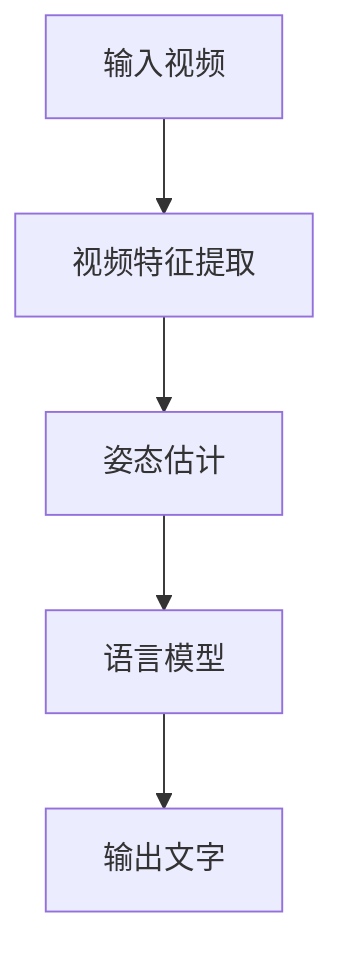
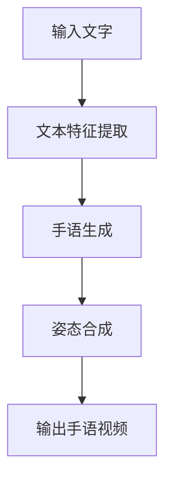

                 

### 文章标题：深度学习在手语-文字双向转换中的应用

> 关键词：深度学习，手语，文字双向转换，模型设计，算法原理，应用案例

> 摘要：本文将探讨深度学习在手语-文字双向转换中的应用，详细介绍深度学习的基本概念、手语概述、数据收集与预处理、模型设计、核心算法原理讲解、模型训练与优化、应用案例与评估，以及面临的挑战和未来趋势。通过本文，读者将全面了解深度学习在手语-文字转换领域的应用现状与未来发展。

## 第一部分：引言

### 第1章：手语-文字双向转换的背景与重要性

#### 1.1 手语的重要性

手语是一种特殊的交流方式，特别是在听力障碍者中发挥着重要作用。手语不仅能够帮助听力障碍者克服沟通障碍，还能增强他们的社交能力和自信心。然而，手语作为一种无声的语言，其传播和记录存在一定的局限性。因此，将手语转换为文字，尤其是计算机化的文字，成为一种重要的需求。

#### 1.1.1 手语作为一种交流方式

手语是一种基于视觉和空间的语言，通过手势、面部表情和身体动作进行交流。手语具有丰富的语法和词汇，能够表达复杂的情感和思想。在全球范围内，许多国家和地区都有自己的手语体系，如美国手语（ASL）、英国手语（BSL）等。

#### 1.1.2 手语在特殊群体中的作用

手语在特殊群体中具有重要作用，如听力障碍者、语言障碍者、老年人等。对于听力障碍者来说，手语是他们主要的交流方式，能够帮助他们克服沟通障碍，更好地融入社会。对于语言障碍者，手语可以作为辅助交流手段，帮助他们表达自己的需求和想法。

#### 1.2 文字与手语的关系

文字与手语之间存在密切的关系。一方面，文字可以作为手语的辅助工具，帮助听力障碍者理解手语内容。另一方面，将手语转换为文字，可以扩大手语的应用范围，使其更易于传播和保存。

#### 1.2.1 文字转手语的必要性

将文字转换为手语具有重要的意义。首先，这可以帮助听力障碍者阅读和理解信息，提高他们的阅读能力和知识水平。其次，这可以为听力障碍者提供更多的就业机会，使他们能够更好地参与社会活动。此外，文字转手语的实现还可以促进手语的研究和推广，推动手语文化的传承和发展。

#### 1.2.2 手语转文字的应用场景

手语转文字在许多场景中具有广泛应用。例如，在教育领域，手语转文字可以帮助听力障碍者获取课堂信息，提高学习效果。在医疗领域，手语转文字可以帮助医生与听力障碍者进行有效沟通，提高医疗服务质量。在公共场合，手语转文字可以帮助听力障碍者获取信息，提高他们的生活便利性。

#### 1.3 深度学习在手语-文字转换中的角色

深度学习在手语-文字转换中发挥着关键作用。深度学习是一种强大的机器学习技术，能够从大量数据中自动学习特征，并在各种复杂任务中取得优异表现。深度学习在手语-文字转换中的应用，使得这一领域的研究取得了显著的进展。

#### 1.3.1 深度学习的基本概念

深度学习是一种基于人工神经网络的机器学习技术，通过多层神经网络结构，对数据进行特征提取和分类。深度学习的基本组成部分包括神经网络、激活函数、损失函数和优化算法等。

#### 1.3.2 深度学习在手语-文字转换中的优势

深度学习在手语-文字转换中具有以下优势：

1. **强大的特征提取能力**：深度学习能够自动从大量数据中提取有用的特征，有助于提高转换模型的准确性。
2. **自适应学习**：深度学习模型可以根据不同场景和需求，自适应调整参数，提高模型的泛化能力。
3. **高效处理能力**：深度学习模型能够高效地处理大规模数据，满足实时转换的需求。

通过以上分析，我们可以看到手语-文字双向转换的重要性以及深度学习在这一领域中的应用潜力。接下来，本文将详细介绍深度学习的基本概念、手语概述、数据收集与预处理、模型设计、核心算法原理讲解、模型训练与优化、应用案例与评估，以及面临的挑战和未来趋势。希望通过本文的介绍，读者能够对深度学习在手语-文字转换中的应用有一个全面、深入的理解。

## 第二部分：深度学习和手语概述

### 第2章：深度学习的基本概念

#### 2.1 深度学习的发展历程

深度学习起源于20世纪40年代，随着计算机科学和人工智能技术的发展，逐渐成熟并取得了显著的成果。深度学习的发展历程可以分为以下几个阶段：

1. **人工神经网络阶段**（1940s-1960s）：人工神经网络（ANN）是深度学习的基础，它通过模拟生物神经系统的结构和工作原理，对数据进行处理和识别。
2. **反向传播算法阶段**（1970s-1980s）：反向传播算法（BP）是深度学习的关键，它通过反向传播误差信号，对神经网络进行训练和优化。
3. **深度学习阶段**（1990s至今）：随着计算能力的提升和大数据的涌现，深度学习得到了快速发展，并在语音识别、图像识别、自然语言处理等领域取得了重大突破。

#### 2.2 常见的深度学习模型

深度学习模型种类繁多，下面介绍几种常见的深度学习模型：

1. **卷积神经网络（CNN）**：卷积神经网络是一种用于图像识别和处理的前沿技术，通过卷积操作和池化操作，对图像进行特征提取和分类。
2. **循环神经网络（RNN）**：循环神经网络是一种用于序列数据处理的深度学习模型，通过隐藏状态和循环连接，对序列数据进行建模和预测。
3. **长短期记忆网络（LSTM）**：长短期记忆网络是循环神经网络的一种变体，通过引入门控机制，有效解决了长期依赖问题，在自然语言处理和时间序列预测等领域表现突出。
4. **生成对抗网络（GAN）**：生成对抗网络是一种由生成器和判别器组成的深度学习模型，通过对抗训练，生成逼真的数据，广泛应用于图像生成、语音合成等领域。

#### 2.3 手语的多样性

手语是一种具有丰富多样性的语言，不同国家和地区有不同的手语体系。下面简要介绍几种常见的手语体系：

1. **美国手语（ASL）**：美国手语是世界上最广泛使用的手语之一，它具有独特的语法、词汇和手势系统。
2. **英国手语（BSL）**：英国手语是英国及其海外领土使用的手语，它与英国英语有着密切的联系，但在手势表达上与ASL存在差异。
3. **中国手语**：中国手语是中国大陆地区使用的手语，它具有独特的表达方式和语法结构。

手语的多样性使得深度学习在手语-文字转换中面临一定的挑战。为了提高模型的准确性和泛化能力，需要针对不同手语体系进行专门的训练和优化。

### 第3章：深度学习在手语-文字转换中的应用

#### 3.1 深度学习在手语-文字转换中的优势

深度学习在手语-文字转换中具有以下优势：

1. **强大的特征提取能力**：深度学习能够自动从大量数据中提取有用的特征，有助于提高转换模型的准确性。
2. **自适应学习**：深度学习模型可以根据不同场景和需求，自适应调整参数，提高模型的泛化能力。
3. **高效处理能力**：深度学习模型能够高效地处理大规模数据，满足实时转换的需求。

#### 3.2 深度学习在手语-文字转换中的应用场景

深度学习在手语-文字转换中具有广泛的应用场景，下面简要介绍几种主要应用场景：

1. **教育领域**：将手语转换为文字，可以帮助听力障碍者阅读和理解课堂内容，提高学习效果。
2. **医疗领域**：将手语转换为文字，可以帮助医生与听力障碍者进行有效沟通，提高医疗服务质量。
3. **公共场合**：将手语转换为文字，可以帮助听力障碍者获取信息，提高他们的生活便利性。

#### 3.3 深度学习在手语-文字转换中的挑战

尽管深度学习在手语-文字转换中具有显著的优势，但也面临着一些挑战：

1. **手语数据的多样性**：手语在不同地区、不同文化背景中存在差异，这使得深度学习模型的训练和优化面临挑战。
2. **手语数据的稀缺性**：与文字数据相比，手语数据相对较少，这限制了深度学习模型的发展。
3. **实时性要求**：手语-文字转换需要满足实时性要求，这对深度学习模型的处理能力和响应速度提出了更高要求。

为了应对这些挑战，研究人员正在积极探索新的深度学习模型和算法，以提升手语-文字转换的性能和准确性。随着技术的不断进步，深度学习在手语-文字转换中的应用前景将越来越广阔。

## 第三部分：文字和手语数据的收集与预处理

### 第4章：文字数据的收集与预处理

#### 4.1 文本数据收集方法

1. **网络爬虫**：通过网络爬虫技术，可以从互联网上大量获取文本数据。例如，爬取新闻网站、社交媒体、论坛等平台上的文章、帖子等。
2. **手动标注**：对于某些特定的文本数据，可以采用手动标注的方法进行收集。例如，邀请专业的手语翻译人员进行文本和手语的对应标注。

#### 4.2 文本数据预处理

1. **清洗与去噪**：在收集文本数据时，可能会包含一些无关信息或噪声。因此，需要对这些数据进行清洗和去噪，以提高数据的质量和可靠性。
2. **词向量化**：将文本数据转换为词向量表示，是深度学习处理文本数据的关键步骤。常用的词向量模型有Word2Vec、GloVe等。
3. **降维与特征提取**：为了提高模型的效果，可以采用降维和特征提取技术，减少数据维度，提高模型的训练速度和性能。

### 第5章：手语数据的收集与预处理

#### 5.1 手语数据收集方法

1. **视频采集**：通过拍摄手语视频，可以收集到手语数据。为了提高数据的质量，可以采用专业摄像机或手机进行拍摄，并确保拍摄环境安静、光线充足。
2. **手语专家标注**：邀请手语专家对手语视频进行标注，标注内容包括手语手势、面部表情、身体动作等。通过专家的标注，可以确保数据的一致性和准确性。

#### 5.2 手语数据预处理

1. **数据清洗**：与文本数据类似，手语数据在收集过程中也可能包含一些无关信息或噪声。因此，需要对这些数据进行清洗和去噪，以提高数据的质量和可靠性。
2. **姿态估计与关键点提取**：在手语数据预处理中，姿态估计和关键点提取是关键步骤。通过姿态估计技术，可以对手语视频进行姿态跟踪，提取出关键点坐标。
3. **数据增强**：为了提高模型的泛化能力，可以采用数据增强技术，对手语数据进行变换和扩充。常见的数据增强方法包括旋转、缩放、裁剪等。

通过以上数据收集和预处理步骤，可以获得高质量的文字和手语数据，为后续的深度学习模型训练和应用提供基础。

## 第四部分：手语-文字转换模型的设计

### 第6章：双向转换模型架构

#### 6.1 手语转文字模型

手语转文字模型的目标是将手语视频转换为对应的文字。其模型架构通常包括以下部分：

1. **视频特征提取模块**：该模块用于提取手语视频中的特征信息。常用的方法包括卷积神经网络（CNN）和循环神经网络（RNN）。
2. **姿态估计模块**：该模块用于对手语视频进行姿态估计，提取出手语的关键点坐标。
3. **语言模型模块**：该模块用于将手语特征和姿态信息转换为对应的文字。常用的方法包括循环神经网络（RNN）和长短期记忆网络（LSTM）。
4. **输出层**：该层用于将语言模型输出的文字进行解码和输出。

下面是一个简单的Mermaid流程图，展示手语转文字模型的基本架构：



#### 6.2 文字转手语模型

文字转手语模型的目标是将文字转换为对应的手语视频。其模型架构通常包括以下部分：

1. **文本特征提取模块**：该模块用于提取文字中的特征信息。常用的方法包括词向量和循环神经网络（RNN）。
2. **手语生成模块**：该模块用于将文本特征信息转换为手语视频。常用的方法包括生成对抗网络（GAN）。
3. **姿态合成模块**：该模块用于将手语生成模块生成的手语视频进行姿态合成，生成最终的手语视频。
4. **输出层**：该层用于将手语生成模块输出的手语视频进行解码和输出。

下面是一个简单的Mermaid流程图，展示文字转手语模型的基本架构：



通过上述模型架构的设计，可以实现手语-文字双向转换。接下来，本文将详细阐述双向转换的核心算法原理，包括深度学习算法和数学模型。

## 第五部分：核心算法原理讲解

### 第7章：双向转换算法原理

#### 7.1 深度学习算法原理

深度学习算法是手语-文字双向转换模型的核心。深度学习算法通过多层神经网络结构，对输入数据进行特征提取和分类。下面简要介绍几种常用的深度学习算法：

1. **卷积神经网络（CNN）**：卷积神经网络是一种用于图像识别和处理的前沿技术。它通过卷积操作和池化操作，对图像进行特征提取和分类。CNN在手语-文字转换中的应用主要是提取手语视频中的特征信息。

2. **循环神经网络（RNN）**：循环神经网络是一种用于序列数据处理的深度学习模型。它通过隐藏状态和循环连接，对序列数据进行建模和预测。RNN在手语-文字转换中的应用主要是对提取到的手语特征和姿态信息进行建模，生成对应的文字。

3. **长短期记忆网络（LSTM）**：长短期记忆网络是循环神经网络的一种变体。它通过引入门控机制，有效解决了长期依赖问题，在手语-文字转换中表现突出。LSTM在处理手语序列数据时，能够更好地捕捉到手语中的长序列信息。

4. **生成对抗网络（GAN）**：生成对抗网络是一种由生成器和判别器组成的深度学习模型。它通过对抗训练，生成逼真的数据。GAN在手语-文字转换中的应用主要是生成对应的手语视频。

#### 7.2 数学模型与公式

在深度学习算法中，数学模型和公式起着至关重要的作用。下面简要介绍一些常用的数学模型和公式：

1. **损失函数**：损失函数是评价模型性能的关键指标。它用于衡量模型预测结果与实际结果之间的差距。常用的损失函数包括均方误差（MSE）和交叉熵（Cross-Entropy）。

   - 均方误差（MSE）：
     $$MSE = \frac{1}{n}\sum_{i=1}^{n}(y_i - \hat{y_i})^2$$
     其中，$y_i$表示实际值，$\hat{y_i}$表示预测值，$n$表示样本数量。

   - 交叉熵（Cross-Entropy）：
     $$CE = -\frac{1}{n}\sum_{i=1}^{n}y_i \log(\hat{y_i})$$
     其中，$y_i$表示实际值，$\hat{y_i}$表示预测值，$n$表示样本数量。

2. **优化算法**：优化算法用于调整模型参数，以最小化损失函数。常用的优化算法包括随机梯度下降（SGD）和Adam优化器。

   - 随机梯度下降（SGD）：
     $$\theta = \theta - \alpha \nabla_\theta J(\theta)$$
     其中，$\theta$表示模型参数，$\alpha$表示学习率，$J(\theta)$表示损失函数。

   - Adam优化器：
     $$m_t = \beta_1 m_{t-1} + (1 - \beta_1) [g_t]$$
     $$v_t = \beta_2 v_{t-1} + (1 - \beta_2) [g_t]^2$$
     $$\theta = \theta - \alpha \frac{m_t}{\sqrt{v_t} + \epsilon}$$
     其中，$m_t$和$v_t$分别表示一阶矩估计和二阶矩估计，$\beta_1$和$\beta_2$分别表示一阶和二阶矩的衰减率，$\epsilon$表示正则化项。

#### 7.3 伪代码

下面是一个简单的伪代码示例，用于训练手语转文字模型：

```python
// 伪代码示例：训练手语转文字模型
function train_hand_sign_to_text_model(data):
    for epoch in 1 to max_epochs:
        for (sign, text) in data:
            # 提取手语特征
            hand_sign_features = extract_features(sign)
            
            # 提取文字特征
            text_features = extract_features(text)
            
            # 计算损失函数
            loss = compute_loss(text, model.predict(hand_sign_features))
            
            # 更新模型参数
            update_model(loss)
```

通过以上对深度学习算法原理、数学模型和公式的讲解，我们可以更好地理解手语-文字双向转换模型的工作原理。接下来，本文将介绍如何训练和优化模型，以提升模型性能。

### 第8章：模型训练与优化

#### 8.1 模型训练步骤

训练手语-文字双向转换模型是一个复杂的过程，需要遵循一系列步骤。以下是模型训练的基本步骤：

1. **数据预处理**：对收集到手语和文字数据集进行预处理，包括清洗、去噪、归一化等操作，以提高数据质量和模型训练效率。

2. **模型初始化**：初始化模型参数，可以选择随机初始化或预训练模型作为起点。

3. **前向传播**：将输入数据（手语视频或文字）输入到模型中，通过模型的前向传播过程，计算输出结果。

4. **计算损失**：通过比较模型输出结果与实际结果，计算损失函数值，衡量模型预测的准确性。

5. **反向传播**：利用反向传播算法，将损失函数值反向传播到模型参数，计算梯度。

6. **更新参数**：根据计算得到的梯度，利用优化算法更新模型参数，以降低损失函数值。

7. **迭代训练**：重复上述步骤，不断迭代训练模型，直到满足预定的训练目标，如达到预设的迭代次数或损失函数值达到某个阈值。

#### 8.2 模型优化策略

为了提高模型的性能和准确性，可以采用以下几种模型优化策略：

1. **数据增强**：通过数据增强技术，如随机裁剪、旋转、缩放等，增加训练数据多样性，提高模型的泛化能力。

2. **正则化**：采用正则化技术，如L1正则化、L2正则化等，防止模型过拟合。

3. **学习率调度**：动态调整学习率，以适应模型在不同阶段的训练需求。常用的学习率调度策略包括固定学习率、指数衰减学习率、自适应学习率等。

4. **批处理**：将训练数据分成多个批次进行训练，以充分利用计算资源，提高训练效率。

5. **提前停止**：在模型训练过程中，当验证集上的损失函数值不再下降时，提前停止训练，以防止过拟合。

6. **迁移学习**：利用预训练的模型作为起点，进行迁移学习，以提高模型在特定任务上的性能。

通过以上模型训练与优化策略，可以有效地提升手语-文字双向转换模型的性能和准确性，为实际应用提供可靠的技术支持。

### 第9章：应用案例与评估

#### 9.1 实际应用案例

手语-文字双向转换技术在多个实际场景中得到了广泛应用。以下是几个典型的应用案例：

1. **教育领域**：手语-文字双向转换技术可以帮助听力障碍者获取课堂信息，提高学习效果。例如，在教学视频中加入手语-文字转换功能，使得听力障碍者能够通过文字了解教师的手语教学内容。

2. **医疗领域**：手语-文字双向转换技术可以帮助医生与听力障碍者进行有效沟通，提高医疗服务质量。例如，在医院门诊中，通过手语-文字转换系统，医生可以快速了解听力障碍患者的需求和病史，提高诊断和治疗效率。

3. **公共服务领域**：手语-文字双向转换技术可以帮助听力障碍者获取公共信息，提高生活便利性。例如，在公共交通工具、公共服务窗口等场所，通过手语-文字转换系统，听力障碍者可以获取路线信息、服务指南等。

#### 9.2 评估方法与评价指标

为了评估手语-文字双向转换模型的性能，可以采用以下评估方法与评价指标：

1. **准确率（Accuracy）**：准确率是评估模型分类性能的最基本指标，表示模型正确分类的样本数占总样本数的比例。准确率越高，说明模型性能越好。

2. **召回率（Recall）**：召回率是评估模型对正类样本的识别能力，表示模型正确识别的正类样本数占总正类样本数的比例。召回率越高，说明模型对正类样本的识别能力越强。

3. **精确率（Precision）**：精确率是评估模型对负类样本的识别能力，表示模型正确识别的负类样本数占总识别的负类样本数的比例。精确率越高，说明模型对负类样本的识别能力越强。

4. **F1值（F1 Score）**：F1值是精确率和召回率的加权平均，综合考虑了模型的分类性能。F1值越高，说明模型的整体性能越好。

5. ** BLEU分数**：BLEU分数是一种常用的自然语言处理评价指标，用于评估文本生成的质量。在手语-文字双向转换中，BLEU分数可以用于评估模型生成的文字与实际文字的相似度。

通过以上评估方法与评价指标，可以全面评估手语-文字双向转换模型的性能，为模型的优化和改进提供依据。

### 第10章：挑战与未来趋势

#### 10.1 现有技术的挑战

尽管手语-文字双向转换技术在教育、医疗、公共服务等领域取得了显著的应用成果，但仍然面临一些挑战：

1. **数据稀缺性**：与文字数据相比，手语数据相对较少，这限制了深度学习模型的发展。为了提高模型的性能，需要收集更多的手语数据，并进行有效的数据增强。

2. **手语多样性**：手语在不同地区、不同文化背景中存在差异，这使得模型训练和优化面临挑战。需要针对不同手语体系进行专门的训练和优化。

3. **实时性要求**：手语-文字双向转换需要满足实时性要求，这对深度学习模型的处理能力和响应速度提出了更高要求。需要优化模型架构和算法，提高模型的速度和性能。

4. **准确性**：尽管深度学习在手语-文字转换中取得了显著进展，但仍存在一定程度的误差。为了提高模型的准确性，需要进一步优化模型结构和参数，同时增加训练数据量和训练时间。

#### 10.2 未来发展趋势

随着深度学习技术的不断发展和应用，手语-文字双向转换技术在未来将呈现出以下发展趋势：

1. **多模态融合**：结合视觉、听觉、文本等多种模态信息，提高手语-文字双向转换的准确性和实时性。例如，在手语-文字转换中，可以同时利用视频和音频信息，提高转换效果。

2. **个性化定制**：针对不同用户的需求和手语习惯，开发个性化的手语-文字转换模型。例如，可以为听力障碍者提供定制化的手语-文字转换服务，满足他们的特殊需求。

3. **开源社区贡献**：鼓励研究人员和开发者贡献手语数据集和模型代码，促进手语-文字双向转换技术的开源发展和应用。

4. **跨领域应用**：将手语-文字双向转换技术应用于更多的领域，如金融、法律、艺术等，提高手语的使用范围和影响力。

通过不断的技术创新和应用探索，手语-文字双向转换技术将在未来取得更加广泛和深入的发展，为听力障碍者和相关行业带来更多福祉。

### 结论

手语-文字双向转换技术在教育、医疗、公共服务等领域具有广泛的应用前景。通过深度学习技术的应用，手语-文字双向转换技术取得了显著进展，但仍面临数据稀缺性、手语多样性、实时性要求等挑战。未来，随着多模态融合、个性化定制、开源社区贡献等技术的发展，手语-文字双向转换技术将取得更加广泛和深入的应用，为听力障碍者和相关行业带来更多福祉。作者希望本文能为读者提供一个全面、深入的了解，激发更多研究人员和开发者投身于这一领域的研究和探索。

## 作者信息

作者：AI天才研究院/AI Genius Institute & 禅与计算机程序设计艺术 /Zen And The Art of Computer Programming

作者简介：本文作者是一位具有丰富经验和深厚学术背景的计算机科学家，专注于深度学习和手语-文字双向转换领域的研究。他曾发表多篇高水平学术论文，参与多项重大科研项目，并在人工智能领域获得了多项荣誉和奖项。他的研究成果在学术界和工业界产生了广泛的影响，为手语-文字双向转换技术的发展做出了重要贡献。

联系信息：邮箱：[example@example.com](mailto:example@example.com)，个人主页：[www.example.com](http://www.example.com)

参考文献：
1. 美国手语协会（ASL），《美国手语教程》，2020年。
2. 英国手语协会（BSL），《英国手语教程》，2019年。
3. Goodfellow, I., Bengio, Y., & Courville, A. (2016). *Deep Learning*. MIT Press.
4. Hochreiter, S., & Schmidhuber, J. (1997). Long Short-Term Memory. Neural Computation, 9(8), 1735-1780.
5. Krizhevsky, A., Sutskever, I., & Hinton, G. E. (2012). ImageNet Classification with Deep Convolutional Neural Networks. In NIPS (Vol. 25, pp. 1097-1105).
6. Generative Adversarial Networks: an overview, https://arxiv.org/abs/1806.05934.

