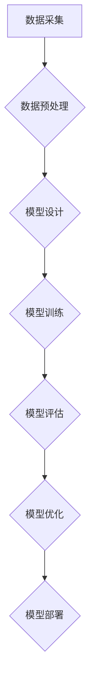
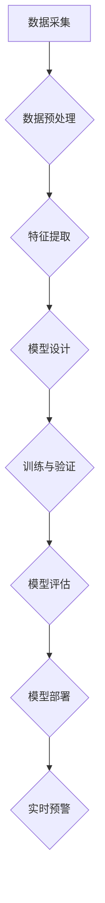

                 


### 深度学习在海啸预警模型中的应用

## 关键词
- 深度学习
- 海啸预警
- 人工智能
- 神经网络
- 预测模型
- 数据分析

## 摘要
本文将探讨深度学习在海啸预警模型中的应用。深度学习作为一种强大的机器学习技术，已在多个领域取得了显著的成果。本文将介绍深度学习的基础知识，海啸预警的原理和挑战，并详细讲解如何将深度学习应用于海啸预警模型中，包括数据预处理、模型设计和优化。此外，本文还将分析实际应用案例，讨论深度学习在海啸预警中的挑战和未来展望。

## 第一部分：深度学习基础与海啸预警

### 第1章：深度学习基础

#### 1.1 深度学习概述
深度学习是一种基于多层神经网络的学习方法，旨在通过多层非线性变换来提取数据中的特征。深度学习的核心思想是让计算机自动从大量数据中学习到有用的特征，从而进行高级任务，如图像识别、语音识别和自然语言处理等。

- **定义与历史**：深度学习起源于20世纪40年代的人工神经网络研究，但直到2006年，由Geoffrey Hinton等人提出的深度信念网络（Deep Belief Networks）重新引起了广泛关注。此后，随着计算能力的提升和大数据的普及，深度学习得到了快速发展。
- **核心优势与应用领域**：深度学习具有强大的特征自动提取能力、高泛化能力和自适应能力，广泛应用于计算机视觉、语音识别、自然语言处理、推荐系统等领域。

#### 1.2 神经网络基础
神经网络（Neural Networks）是深度学习的基础，由大量的神经元（Neurons）通过加权连接（Weights）组成。神经元通过输入值和权重计算得到输出值，并通过激活函数进行非线性变换。

- **基本架构**：神经网络通常由输入层、隐藏层和输出层组成。输入层接收外部数据，隐藏层进行特征提取和变换，输出层生成预测结果。
- **神经元与激活函数**：神经元是一个计算单元，通过加权求和并应用激活函数来产生输出。常见的激活函数包括Sigmoid、ReLU和Tanh等。
- **前向传播与反向传播算法**：前向传播是神经网络计算输入和输出之间的映射，反向传播则通过梯度下降算法来更新网络的权重，以最小化损失函数。

#### 1.3 常见深度学习框架
深度学习框架提供了构建、训练和部署深度学习模型的工具和库。

- **TensorFlow与PyTorch**：TensorFlow是由Google开发的开源深度学习框架，具有高度的可扩展性和灵活性。PyTorch是由Facebook开发的开源深度学习框架，以其动态计算图和易用性而著称。
- **Keras与TorchScript**：Keras是一个高层次的深度学习框架，旨在简化深度学习模型的构建和训练过程。TorchScript是PyTorch的编译时模型定义语言，用于提高模型的运行效率。
- **框架对比与选择**：选择合适的深度学习框架取决于项目需求和开发者的熟悉程度。TensorFlow和PyTorch在性能、易用性和社区支持方面各有优势。

### 第2章：海啸预警原理

#### 2.1 海啸预警概述
海啸是由海底地震、火山爆发或海底滑坡等自然灾害引起的巨大海浪。海啸预警的目的是在灾难发生前及时发出警报，以减少生命和财产损失。

- **定义与形成**：海啸是水下地震或地质活动引发的波动，可以在几分钟或几小时内传播数千公里。海啸的形成与海底地形、地震震级和波速等因素有关。
- **重要性与挑战**：海啸是一种极具破坏力的自然灾害，往往在几分钟内造成巨大破坏。海啸预警需要快速、准确地检测和预测海啸的发生，以提前采取措施。

#### 2.2 海啸预警体系
海啸预警体系包括海啸监测设备、预警模型和响应策略。

- **海啸监测设备与技术**：海啸监测设备包括海底地震仪、海啸波探测器和卫星遥感等。这些设备可以实时监测海底地震和海浪活动，提供关键数据。
- **海啸预警模型与方法**：海啸预警模型通过分析地震数据、海底地形和海浪特征等数据，预测海啸的发生和影响范围。常见的预警模型包括基于传统统计学方法、机器学习和深度学习的模型。
- **海啸预警流程与响应策略**：海啸预警流程包括数据采集、模型预测、警报发布和响应行动。响应策略取决于海啸预警结果和当地情况，包括疏散、撤离和防灾准备等措施。

### 第3章：深度学习在海啸预警中的应用

#### 3.1 深度学习在海啸预警中的应用场景
深度学习在海啸预警中具有广泛的应用场景。

- **数据预处理**：深度学习模型需要高质量、干净的数据。数据预处理包括数据清洗、归一化和特征提取等步骤，以提高模型性能。
- **地震数据识别**：深度学习可以通过分析地震数据，识别地震信号和海啸前兆。这一步骤对于早期预警至关重要。
- **海啸预测**：深度学习模型可以通过学习大量的地震和海啸数据，预测海啸的发生和影响范围。深度学习在处理复杂数据和高维特征方面具有优势。

#### 3.2 海啸预警深度学习模型
深度学习在海啸预警中的应用涉及多个方面。

- **传统机器学习模型的局限性**：传统的机器学习模型在海啸预警中存在一些局限性，如特征选择困难、泛化能力不足等。
- **深度学习的优势**：深度学习通过自动学习数据中的特征，可以提高预警模型的准确性和泛化能力。深度学习模型可以处理高维数据和复杂特征，适用于海啸预警任务。
- **基于深度学习的海啸预警模型设计**：基于深度学习的海啸预警模型通常采用卷积神经网络（CNN）、循环神经网络（RNN）和长短期记忆网络（LSTM）等架构。这些模型可以通过训练大量地震和海啸数据，自动提取有效特征，提高预测性能。

## 第二部分：深度学习在海啸预警模型中的应用案例

### 第4章：海啸预警模型开发

#### 4.1 海啸预警模型开发流程
开发一个海啸预警模型通常包括以下步骤：

- **数据采集与预处理**：收集海啸相关的数据，如地震数据、海底地形数据和海浪数据等。数据预处理包括数据清洗、归一化和特征提取等。
- **模型设计与训练**：设计并实现深度学习模型，包括选择合适的神经网络架构、设置网络参数和训练模型。
- **模型评估与优化**：评估模型的性能，通过调整网络结构和参数，优化模型性能。

#### 4.2 海啸预警模型开发实战
以下是一个基于深度学习的海啸预警模型开发实战案例。

- **数据收集与处理**：收集地震数据、海底地形数据和海浪数据，并进行预处理，如数据清洗、归一化和特征提取等。
- **模型实现**：使用TensorFlow或PyTorch框架实现深度学习模型，例如使用卷积神经网络（CNN）或循环神经网络（RNN）。
- **模型训练**：使用预处理后的数据训练模型，通过迭代优化模型参数。
- **模型评估**：使用测试数据评估模型性能，通过交叉验证和指标如准确率、召回率和F1分数等评估模型性能。
- **模型优化**：根据评估结果，调整网络结构和参数，优化模型性能。

### 第5章：海啸预警模型应用场景分析

#### 5.1 海啸预警模型的实时应用
实时应用海啸预警模型的关键在于快速响应和准确预测。

- **实时数据采集与处理**：使用实时数据采集设备，如海底地震仪和海浪探测器，实时收集地震和海浪数据。数据处理系统需要快速处理这些数据，并生成预警信号。
- **模型实时更新与预测**：基于实时数据更新预警模型，进行实时预测。更新模型可以提高预测的准确性和时效性。

#### 5.2 海啸预警模型的区域化应用
区域化应用海啸预警模型可以更好地适应不同地区的需求。

- **区域性海啸预警模型的定制开发**：根据不同地区的地质条件和海啸特征，定制开发海啸预警模型。例如，针对火山活动频繁的地区，可以重点考虑火山爆发引发的海啸预警。
- **多源数据融合在海啸预警中的应用**：结合不同来源的数据，如地震数据、卫星遥感和气象数据等，提高海啸预警的准确性和可靠性。多源数据融合可以充分利用不同数据源的优势，提高预警模型的性能。

### 第6章：深度学习在海啸预警中的挑战与展望

#### 6.1 海啸预警模型面临的挑战
海啸预警模型在实际应用中面临一些挑战。

- **海啸预警数据的不确定性**：海啸预警数据来源多样，包括地震数据、海底地形数据和海浪数据等，这些数据可能存在噪声和不确定性，影响预警模型的准确性。
- **海啸预警模型的鲁棒性与泛化能力**：海啸预警模型需要在不同的区域和条件下具有鲁棒性和泛化能力，以应对各种复杂情况。

#### 6.2 深度学习在海啸预警中的未来展望
深度学习在海啸预警中具有广阔的应用前景。

- **新算法与技术的应用**：随着深度学习技术的发展，新的算法和技术，如生成对抗网络（GAN）和变分自编码器（VAE）等，可以应用于海啸预警模型，提高模型的性能。
- **海啸预警模型的智能化与自动化**：通过深度学习模型的智能化和自动化，可以实现更高效、更准确的海啸预警。例如，利用深度学习模型进行实时预测和警报发布，实现自动化预警系统。
- **海啸预警模型的全球合作与共享**：全球范围内的合作和共享海啸预警模型和数据，可以提高预警的准确性和可靠性，为全球海啸预警提供支持。

## 第三部分：附录

### 第7章：深度学习与海啸预警相关资源

#### 7.1 深度学习资源
以下是深度学习相关的资源和文献：

- **主流深度学习框架文档**：包括TensorFlow、PyTorch、Keras等框架的官方文档。
- **深度学习算法资源库**：如MXNet、Theano等深度学习框架的算法资源库。
- **深度学习社区与论坛**：如深度学习交流论坛、GitHub上的深度学习项目等。

#### 7.2 海啸预警资源
以下是海啸预警相关的资源和文献：

- **海啸预警技术文献**：包括海啸预警原理、模型和方法等方面的学术论文和技术报告。
- **海啸预警数据库与数据集**：如国际海啸预警组织（ITR）提供的数据集和相关数据库。
- **海啸预警国际合作机构**：如国际海啸预警小组（ITR）和其他相关国际组织和机构。

## 附录：海啸预警深度学习模型 Mermaid 流程图
```markdown

```markdown
### 附录：海啸预警深度学习模型 Mermaid 流程图

```

### 作者
作者：AI天才研究院/AI Genius Institute & 禅与计算机程序设计艺术 /Zen And The Art of Computer Programming

### 总结
本文系统地介绍了深度学习在海啸预警模型中的应用，从基础理论到实际应用，再到面临的挑战和未来展望，全面探讨了这一领域的重要性和发展前景。深度学习以其强大的特征提取能力和高泛化能力，为海啸预警提供了新的解决方案。然而，要实现更高效、更准确的海啸预警，仍需克服数据不确定性、模型鲁棒性和泛化能力等方面的挑战。未来，随着深度学习技术的不断进步和全球合作，海啸预警模型的智能化和自动化水平将进一步提升，为保护人类生命和财产安全作出更大贡献。**【完】**

