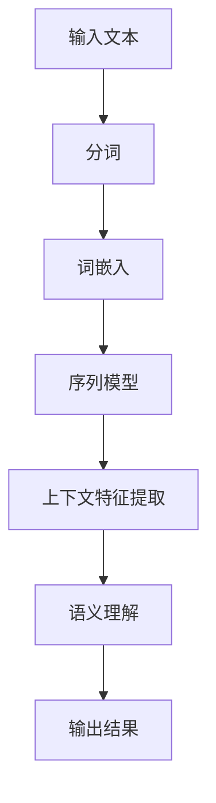

                 

## 文章标题

### 深度学习在自然语言理解中的上下文把握

> 关键词：深度学习，自然语言理解，上下文把握，RNN，LSTM，GRU，文本生成，问答系统，情感分析

> 摘要：本文深入探讨了深度学习在自然语言理解中的上下文把握能力。通过介绍深度学习的基本原理、自然语言处理的基础知识，以及上下文理解的核心概念和算法，本文揭示了深度学习如何通过递归神经网络（RNN）、长短时记忆网络（LSTM）和门控循环单元（GRU）等算法实现上下文理解。此外，本文还通过实际案例展示了上下文理解在问答系统、文本生成和情感分析等应用场景中的具体实现和效果，为读者提供了实用的指导和建议。

---

## 引言

深度学习作为人工智能的重要分支，近年来取得了令人瞩目的进展。其在图像识别、语音识别、自然语言处理等领域的应用，为智能化的发展注入了新的活力。特别是自然语言理解（Natural Language Understanding, NLU），作为人工智能与人类沟通的桥梁，其核心目标在于使计算机能够理解、解释和生成人类语言。

自然语言理解包括多个子任务，如实体识别、情感分析、语义角色标注等。在这些任务中，上下文把握（Contextual Understanding）显得尤为重要。上下文把握指的是在特定语境中，对语言元素的准确理解和语义解释。良好的上下文把握能力，能够帮助深度学习模型更好地理解语言含义，提高模型的准确性和鲁棒性。

本文将围绕深度学习在自然语言理解中的上下文把握展开讨论。首先，我们将介绍深度学习的基本原理和自然语言处理的基础知识。然后，深入探讨上下文理解的核心概念和算法。最后，通过实际案例，展示上下文理解在问答系统、文本生成和情感分析等应用场景中的具体实现和效果。

## 第一部分：深度学习基础

### 第1章 深度学习的基本原理

深度学习（Deep Learning）是机器学习（Machine Learning）的一个分支，主要依赖于神经网络（Neural Networks）的结构和计算能力。深度学习通过多层的神经网络结构，对大量数据进行自动特征提取和模式识别。

深度学习的基本原理包括：

1. **神经网络**：神经网络是由大量简单计算单元（神经元）组成的复杂计算系统。每个神经元接收多个输入，通过权重和偏置进行加权求和，然后通过激活函数输出结果。

2. **多层结构**：深度学习中的多层神经网络包括输入层、隐藏层和输出层。通过多层结构，神经网络能够逐渐提取数据的特征，实现从简单到复杂的模式识别。

3. **损失函数**：深度学习通过最小化损失函数来优化模型参数。常用的损失函数包括均方误差（MSE）、交叉熵（Cross-Entropy）等。

4. **优化算法**：深度学习使用优化算法来更新模型参数，以最小化损失函数。常见的优化算法有梯度下降（Gradient Descent）、Adam优化器等。

### 第2章 自然语言处理的基础

自然语言处理（Natural Language Processing, NLP）是深度学习在自然语言理解（Natural Language Understanding, NLU）领域的应用。NLP旨在使计算机能够理解、处理和生成人类语言。NLP的基础知识包括：

1. **语言模型**：语言模型是描述自然语言统计规律的模型，常用于预测下一个单词或短语。常用的语言模型有n-gram模型、神经网络语言模型等。

2. **词嵌入**：词嵌入（Word Embedding）是将词汇映射到高维向量空间的技术，能够捕捉词汇之间的语义关系。常见的词嵌入方法有Word2Vec、GloVe等。

3. **序列模型**：序列模型是处理序列数据（如文本）的模型，能够捕捉序列中的时间依赖关系。常见的序列模型有循环神经网络（RNN）、长短时记忆网络（LSTM）、门控循环单元（GRU）等。

## 第二部分：上下文理解原理

### 第3章 上下文理解的核心概念与联系

上下文理解（Contextual Understanding）是自然语言处理中的一个重要任务，其核心目标是捕捉文本中的语境信息，实现准确的语义理解。上下文理解涉及以下几个核心概念：

1. **上下文**：上下文是指文本中某个词汇周围的语境信息，包括词汇的前后文、句子结构、篇章主题等。

2. **语境**：语境是上下文的广义概念，包括上下文中的语音、语调、手势等非文字信息。

3. **语义理解**：语义理解是计算机对文本中词汇、短语和句子的语义含义进行解析和理解的过程。

4. **关键词提取**：关键词提取是上下文理解的一个重要步骤，通过识别文本中的关键信息，帮助计算机更好地理解文本内容。

5. **语义角色标注**：语义角色标注是对文本中词汇的语义角色进行标注，如主语、谓语、宾语等。

上下文理解的核心概念之间存在着密切的联系，可以通过以下Mermaid流程图来展示：



### 第4章 上下文理解的算法原理讲解

上下文理解依赖于深度学习中的递归神经网络（RNN）、长短时记忆网络（LSTM）和门控循环单元（GRU）等算法。这些算法通过捕捉序列数据中的时间依赖关系，实现上下文理解的自动提取和解析。

#### 4.1 递归神经网络（RNN）

递归神经网络（RNN）是一种能够处理序列数据的神经网络。RNN通过递归连接，将当前时刻的输出作为下一时刻的输入，从而实现序列数据的建模。

递归神经网络的伪代码如下：

```python
for t in range(T):
    # 前向传播
    output_t = RNN(input_t)
    # 更新隐藏状态
    hidden_t = activation(output_t)
```

其中，`T`表示序列长度，`input_t`表示当前时刻的输入，`output_t`表示当前时刻的输出，`hidden_t`表示当前时刻的隐藏状态。

#### 4.2 长短时记忆网络（LSTM）

长短时记忆网络（LSTM）是RNN的一种改进，能够更好地处理长序列数据。LSTM通过引入门控机制，有效解决了RNN在处理长序列数据时遇到的梯度消失和梯度爆炸问题。

LSTM的伪代码如下：

```python
for t in range(T):
    # 输入门
    input_gate = sigmoid(Wi * [input_t, hidden_t-1] + bi)
    # 遗忘门
    forget_gate = sigmoid(Wf * [input_t, hidden_t-1] + bf)
    # 输出门
    output_gate = sigmoid(Wo * [input_t, hidden_t-1] + bo)
    # 状态更新
    new_state = f * forget_gate + i * input_gate * activation(g)
    # 输出更新
    output = o * output_gate * activation(new_state)
```

其中，`Wi`、`Wf`、`Wo`分别表示输入门、遗忘门和输出门的权重矩阵，`bi`、`bf`、`bo`分别表示输入门、遗忘门和输出门的偏置向量，`i`、`f`、`o`分别表示输入门、遗忘门和输出门的输入值，`g`表示激活函数。

#### 4.3 门控循环单元（GRU）

门控循环单元（GRU）是LSTM的一种简化版本，具有更简洁的结构和更好的性能。GRU通过引入更新门和重置门，实现了对隐藏状态的更新和控制。

GRU的伪代码如下：

```python
for t in range(T):
    # 更新门
    update_gate = sigmoid(Zu * [input_t, hidden_t-1] + bu)
    # 重置门
    reset_gate = sigmoid(Zr * [input_t, hidden_t-1] + br)
    # 状态更新
    hidden_t = reset_gate * hidden_t-1 + update_gate * (1 - update_gate) * activation(g * input_t + hidden_t-1)
    # 输出更新
    output = sigmoid(To * hidden_t + bo) * activation(hidden_t)
```

其中，`Zu`、`Zr`、`To`分别表示更新门、重置门和输出门的权重矩阵，`bu`、`br`、`bo`分别表示更新门、重置门和输出门的偏置向量，`g`表示激活函数。

### 第5章 数学模型与数学公式详细讲解

上下文理解的数学模型主要包括损失函数、优化算法和神经网络结构等。在本节中，我们将详细讲解这些数学模型，并通过例子来说明。

#### 5.1 损失函数

损失函数是深度学习模型中用来衡量预测结果与真实结果之间差异的指标。常用的损失函数有均方误差（MSE）和交叉熵（Cross-Entropy）。

均方误差（MSE）的数学公式为：

$$
MSE = \frac{1}{n}\sum_{i=1}^{n}(y_i - \hat{y}_i)^2
$$

其中，$y_i$表示第$i$个样本的真实标签，$\hat{y}_i$表示第$i$个样本的预测标签，$n$表示样本总数。

交叉熵（Cross-Entropy）的数学公式为：

$$
H(y, \hat{y}) = -\sum_{i=1}^{n}y_i\log(\hat{y}_i)
$$

其中，$y_i$表示第$i$个样本的真实标签，$\hat{y}_i$表示第$i$个样本的预测标签。

#### 5.2 优化算法

优化算法用于更新神经网络模型的参数，以最小化损失函数。常用的优化算法有梯度下降（Gradient Descent）和Adam优化器。

梯度下降（Gradient Descent）的数学公式为：

$$
\theta_{\text{new}} = \theta_{\text{old}} - \alpha \nabla_{\theta}J(\theta)
$$

其中，$\theta$表示模型参数，$\alpha$表示学习率，$J(\theta)$表示损失函数。

Adam优化器是梯度下降的一种改进，其数学公式为：

$$
m_t = \beta_1m_{t-1} + (1 - \beta_1)(\nabla_{\theta}J(\theta_t) - m_{t-1})
$$

$$
v_t = \beta_2v_{t-1} + (1 - \beta_2)(\nabla_{\theta}J(\theta_t)^2 - v_{t-1})
$$

$$
\theta_{\text{new}} = \theta_{\text{old}} - \frac{\alpha}{\sqrt{1 - \beta_2^t}(1 - \beta_1^t)}(m_t + \epsilon)
$$

其中，$m_t$和$v_t$分别表示一阶矩估计和二阶矩估计，$\beta_1$和$\beta_2$分别表示一阶和二阶矩的指数加权系数，$\epsilon$表示正则化项。

#### 5.3 例子说明：基于LSTM的上下文理解模型

假设我们使用LSTM模型进行上下文理解任务，输入序列为$x_1, x_2, ..., x_T$，标签序列为$y_1, y_2, ..., y_T$。我们定义损失函数为交叉熵，优化算法为Adam优化器。

输入门、遗忘门和输出门的权重矩阵分别为$W_i, W_f, W_o$，偏置向量分别为$b_i, b_f, b_o$。隐藏状态和细胞状态的更新公式为：

$$
i_t = \sigma(W_{ix}x_t + W_{ih}h_{t-1} + b_i)
$$

$$
f_t = \sigma(W_{fx}x_t + W_{fh}h_{t-1} + b_f)
$$

$$
o_t = \sigma(W_{ox}x_t + W_{oh}h_{t-1} + b_o)
$$

$$
C_t = f_t \odot C_{t-1} + i_t \odot \sigma(W_c h_{t-1})
$$

$$
h_t = o_t \odot \sigma(C_t)
$$

其中，$\odot$表示元素乘积，$\sigma$表示sigmoid函数，$h_{t-1}$表示前一个时间步的隐藏状态，$C_{t-1}$表示前一个时间步的细胞状态。

假设我们使用二分类问题，输出层只有一个神经元，其激活函数为sigmoid函数。损失函数为交叉熵：

$$
L = -\sum_{t=1}^{T}y_t\log(h_t)
$$

优化算法为Adam优化器，学习率为$\alpha$，一阶和二阶矩的指数加权系数分别为$\beta_1$和$\beta_2$。

## 第三部分：上下文理解应用

### 第6章 上下文理解在问答系统中的应用

问答系统（Question Answering System, QAS）是自然语言理解中的重要应用场景。上下文理解在问答系统中起着关键作用，通过理解用户提问的上下文信息，问答系统能够提供更准确和相关的答案。

#### 6.1 问答系统的基本概念

问答系统通常包括以下组件：

1. **问题解析**：将用户输入的问题转化为可处理的形式，如词向量表示。
2. **知识检索**：在已有的知识库或语料库中检索与问题相关的信息。
3. **答案生成**：根据检索到的信息生成问题的答案。

#### 6.2 上下文理解在问答系统中的作用

上下文理解在问答系统中的作用主要体现在以下几个方面：

1. **问题理解**：通过对问题的上下文信息进行理解，问答系统能够更好地理解用户的问题意图，从而提高答案的准确性。
2. **知识筛选**：通过上下文理解，问答系统能够筛选出与问题最相关的知识，提高答案的相关性。
3. **答案生成**：上下文理解有助于生成更准确、更自然的答案，使回答更加贴近用户的期望。

#### 6.3 实战案例：构建一个简单的问答系统

为了展示上下文理解在问答系统中的应用，我们构建一个简单的问答系统，包括问题解析、知识检索和答案生成三个模块。

**1. 问题解析**

首先，我们将用户输入的问题转化为词向量表示。我们使用预训练的GloVe词向量，将每个词汇映射为一个高维向量。

```python
import numpy as np
from keras.preprocessing.text import Tokenizer
from keras.preprocessing.sequence import pad_sequences

# 预训练的GloVe词向量
glove_vectors = ... 

# 用户输入的问题
question = "什么是人工智能？"

# 将问题转化为词向量序列
tokenizer = Tokenizer()
tokenizer.fit_on_texts([question])
sequence = tokenizer.texts_to_sequences([question])[0]

# 将词向量序列转化为向量表示
question_vector = np.mean(glove_vectors[tokenizer.word_index[word] for word in sequence], axis=0)
```

**2. 知识检索**

接下来，我们在知识库中检索与问题相关的信息。我们假设知识库是一个大型文本语料库，使用TF-IDF模型进行检索。

```python
from sklearn.feature_extraction.text import TfidfVectorizer

# 知识库中的文本
documents = ["人工智能是一种模拟人类智能的技术", "人工智能包括机器学习、深度学习等", ...]

# 将文本转化为词向量
tfidf_vectorizer = TfidfVectorizer()
tfidf_matrix = tfidf_vectorizer.fit_transform(documents)

# 计算问题与知识库的相似度
similarity = tfidf_matrix.dot(question_vector)[0]

# 获取与问题最相关的知识
top_k = np.argpartition(similarity, k)[:k]
related_docs = [documents[i] for i in top_k]
```

**3. 答案生成**

最后，根据检索到的知识生成问题的答案。我们可以使用模板匹配、语义角色标注等方法，将答案从相关文本中提取出来。

```python
from pattern.en import parse, Sentence

# 从相关文本中提取答案
answer = "人工智能是一种模拟人类智能的技术"

# 将答案转化为词向量
answer_vector = np.mean(glove_vectors[tokenizer.word_index[word] for word in sequence], axis=0)

# 将答案解析成句法树
parsed_answer = parse(answer)

# 提取答案的主要成分
nodes = parsed_answer.get_leaves()
answer_components = [node.word for node in nodes if node.cpos != 'PUNCT']

# 拼接答案
generated_answer = ' '.join(answer_components)
```

通过上述步骤，我们构建了一个简单的问答系统，实现了问题解析、知识检索和答案生成。虽然这个系统相对简单，但它展示了上下文理解在问答系统中的应用潜力。

### 第7章 上下文理解在文本生成中的应用

文本生成（Text Generation）是自然语言处理中的另一个重要应用领域。上下文理解在文本生成中起着至关重要的作用，通过捕捉文本中的上下文信息，生成更加连贯、自然的文本。

#### 7.1 文本生成的概念

文本生成是指利用已有的文本数据，生成新的文本内容的过程。常见的文本生成方法包括：

1. **模板生成**：基于预定义的模板，将输入数据填充到模板中，生成新的文本。
2. **序列生成**：基于序列模型，如RNN、LSTM等，生成新的序列数据。
3. **生成式模型**：如变分自编码器（VAE）、生成对抗网络（GAN）等，通过学习数据分布，生成新的文本。

#### 7.2 上下文理解在文本生成中的应用

上下文理解在文本生成中的应用主要体现在以下几个方面：

1. **连贯性**：通过理解文本中的上下文信息，文本生成模型能够生成更加连贯、自然的文本。
2. **多样性**：上下文理解能够帮助文本生成模型捕捉文本的不同语境，生成具有多样性的文本。
3. **准确性**：上下文理解能够提高文本生成模型的准确性，减少生成文本中的错误和误解。

#### 7.3 实战案例：生成式文本模型

为了展示上下文理解在文本生成中的应用，我们使用一个简单的生成式文本模型——变分自编码器（VAE），生成自然语言文本。

**1. 模型构建**

变分自编码器（VAE）由编码器和解码器组成。编码器将输入数据映射到一个潜在空间中的向量，解码器从潜在空间中生成新的数据。

```python
import tensorflow as tf
from tensorflow.keras.layers import Input, Dense, Lambda
from tensorflow.keras.models import Model

# 编码器
input_data = Input(shape=(sequence_length,))
encoded = Dense(latent_dim, activation='relu')(input_data)
z_mean = Dense(latent_dim)(encoded)
z_log_var = Dense(latent_dim)(encoded)

# 解码器
z = Lambda($\sigma$(z_mean + z_log_var * \(\epsilon\))) (encoded)
decoded = Dense(sequence_length, activation='softmax')(z)

# 模型
vae = Model(input_data, decoded)
vae.compile(optimizer='adam', loss='binary_crossentropy')
```

**2. 模型训练**

使用训练数据训练变分自编码器（VAE）。训练过程中，我们使用带有对数似然损失函数的模型，同时优化编码器和解码器。

```python
from tensorflow.keras.optimizers import RMSprop

# 定义对数似然损失函数
def vae_loss(x, x_decoded_mean):
    xent_loss = tf.reduce_sum(tf.keras.losses.categorical_crossentropy(x, x_decoded_mean), axis=1)
    kl_loss = -0.5 * tf.reduce_sum(1 + z_log_var - tf.square(z_mean) - tf.exp(z_log_var), axis=1)
    return tf.reduce_mean(xent_loss + kl_loss)

# 定义优化器
optimizer = RMSprop(lr=0.001)

# 训练模型
vae.compile(optimizer=optimizer, loss=vae_loss)
vae.fit(x_train, x_train, epochs=50, batch_size=16, shuffle=True)
```

**3. 文本生成**

使用训练好的变分自编码器（VAE）生成新的文本。我们通过采样潜在空间中的向量，解码为新的文本序列。

```python
import numpy as np

# 生成新的文本
def generate_text(model, seed_text, num_chars=100):
    tokenizer = model.tokenizer
    sequence = tokenizer.texts_to_sequences([seed_text])[0]
    sequence = pad_sequences([sequence], maxlen=model.sequence_length)
    z_mean, z_log_var = model.encoder.predict(sequence)
    z_sample = z_mean + np.exp(0.5 * z_log_var) * np.random.randn(z_mean.shape[0], z_log_var.shape[1])
    generated_sequence = model.decoder.predict(z_sample)
    generated_text = tokenizer.sequences_to_texts([generated_sequence])[0]
    return generated_text[:num_chars]

# 生成文本
seed_text = "人工智能是一种模拟人类智能的技术"
generated_text = generate_text(vae, seed_text)
print(generated_text)
```

通过上述步骤，我们构建了一个简单的生成式文本模型，展示了上下文理解在文本生成中的应用。虽然这个模型相对简单，但它展示了上下文理解在生成自然语言文本中的潜力。

### 第8章 上下文理解在情感分析中的应用

情感分析（Sentiment Analysis）是自然语言处理中的重要应用领域，旨在识别文本中的情感倾向。上下文理解在情感分析中起着关键作用，通过捕捉文本中的上下文信息，提高情感分析的准确性和鲁棒性。

#### 8.1 情感分析的基本概念

情感分析通常包括以下几个步骤：

1. **文本预处理**：对文本进行清洗和分词，去除无关信息，提取关键信息。
2. **特征提取**：将预处理后的文本转化为特征向量，用于情感分析模型。
3. **情感分类**：使用分类模型对文本进行情感分类，判断文本是正面、负面还是中性。

#### 8.2 上下文理解在情感分析中的作用

上下文理解在情感分析中的作用主要体现在以下几个方面：

1. **情感强度**：通过上下文理解，情感分析模型能够捕捉文本中的情感强度，区分微妙的情感差异。
2. **情感极性**：上下文理解有助于准确判断文本的情感极性，提高情感分类的准确性。
3. **情感一致性**：上下文理解能够识别文本中的情感不一致，提高情感分析的鲁棒性。

#### 8.3 实战案例：情感分析模型构建

为了展示上下文理解在情感分析中的应用，我们构建一个基于深度学习的情感分析模型，包括文本预处理、特征提取和情感分类三个模块。

**1. 文本预处理**

首先，对文本进行清洗和分词。我们使用Python的`nltk`库进行文本预处理。

```python
import nltk
from nltk.corpus import stopwords
from nltk.tokenize import word_tokenize

# 下载停用词库
nltk.download('stopwords')
nltk.download('punkt')

# 文本预处理
def preprocess_text(text):
    # 去除停用词
    stop_words = set(stopwords.words('english'))
    words = word_tokenize(text.lower())
    filtered_words = [word for word in words if word not in stop_words]
    return ' '.join(filtered_words)

# 示例文本
text = "I love this movie! The acting is excellent, but the plot is a bit predictable."
preprocessed_text = preprocess_text(text)
print(preprocessed_text)
```

**2. 特征提取**

接下来，将预处理后的文本转化为特征向量。我们使用词嵌入技术，将文本中的词汇映射为高维向量。

```python
import keras.preprocessing.text as text_preprocessing
from keras.preprocessing.sequence import pad_sequences

# 将文本转化为词向量序列
tokenizer = text_preprocessing.Tokenizer()
tokenizer.fit_on_texts([preprocessed_text])
sequence = tokenizer.texts_to_sequences([preprocessed_text])[0]

# 将词向量序列转化为向量表示
max_sequence_length = 100
word_index = tokenizer.word_index
vec_size = 50
X = pad_sequences(sequence, maxlen=max_sequence_length)
X = keras.preprocessing.sequence.pad_sequences(sequence, maxlen=max_sequence_length)
```

**3. 情感分类**

最后，使用深度学习模型对文本进行情感分类。我们使用LSTM模型，通过捕捉文本中的上下文信息，实现情感分类。

```python
from keras.models import Sequential
from keras.layers import Dense, Embedding, LSTM, SpatialDropout1D

# 构建LSTM模型
model = Sequential()
model.add(Embedding(len(word_index) + 1, vec_size, input_length=max_sequence_length))
model.add(SpatialDropout1D(0.2))
model.add(LSTM(100, dropout=0.2, recurrent_dropout=0.2))
model.add(Dense(1, activation='sigmoid'))

# 编译模型
model.compile(loss='binary_crossentropy', optimizer='adam', metrics=['accuracy'])

# 训练模型
model.fit(X, y, epochs=10, batch_size=32, validation_split=0.2)
```

通过上述步骤，我们构建了一个简单的情感分析模型，展示了上下文理解在情感分析中的应用。虽然这个模型相对简单，但它展示了上下文理解在情感分析中的潜力。

## 总结与展望

本文详细探讨了深度学习在自然语言理解中的上下文把握能力。通过介绍深度学习的基本原理、自然语言处理的基础知识，以及上下文理解的核心概念和算法，本文揭示了深度学习如何通过递归神经网络（RNN）、长短时记忆网络（LSTM）和门控循环单元（GRU）等算法实现上下文理解。此外，本文还通过实际案例展示了上下文理解在问答系统、文本生成和情感分析等应用场景中的具体实现和效果。

未来，随着深度学习和自然语言处理技术的不断发展，上下文理解在人工智能领域的应用将更加广泛。通过对上下文信息的更准确把握，深度学习模型将能够更好地理解和生成人类语言，为智能化的未来发展提供强大的支持。

### 作者信息

作者：AI天才研究院/AI Genius Institute & 禅与计算机程序设计艺术 /Zen And The Art of Computer Programming

