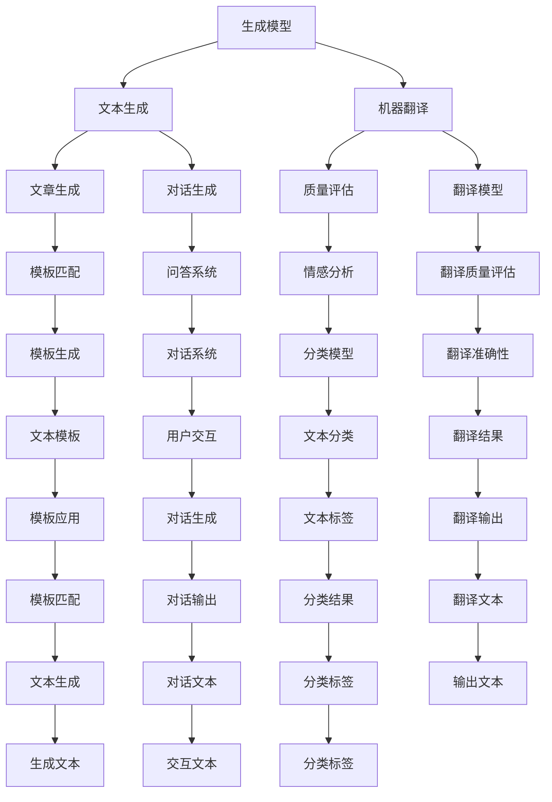
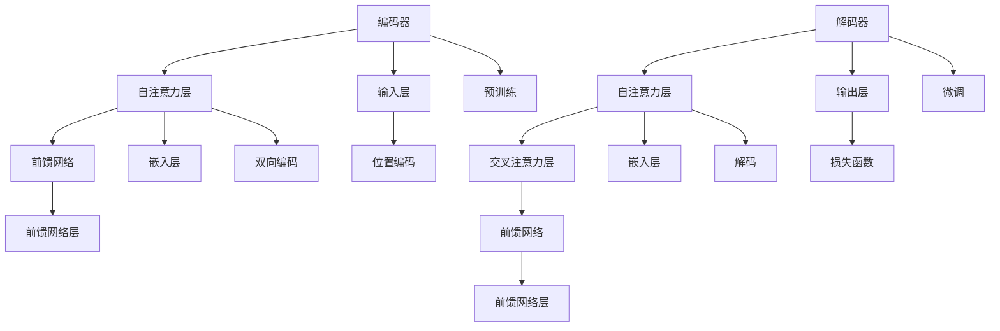

                 


为了撰写一篇关于“深度学习在自然语言生成中的突破”的技术博客，我们需要遵循以下步骤来确保文章的逻辑清晰、内容详实且易于理解。

### 1. 文章结构规划

**步骤1：确定文章大纲**

首先，我们需要根据之前的目录大纲，细化每个章节的内容，确保每个小节都有明确的主题和内容。

- **第一部分：深度学习与自然语言生成的基础**
  - **第1章：深度学习基础**
    - 深度学习的定义
    - 深度学习的层次结构
    - 常见的深度学习框架

  - **第2章：自然语言生成**
    - 自然语言生成的定义
    - 自然语言生成的类型
    - 生成模型和判别模型的区别

**第二部分：核心算法原理讲解**

- **第3章：RNN、LSTM和GRU**
  - 算法原理详细讲解
  - 伪代码展示

- **第4章：Transformer和BERT**
  - 算法原理详细讲解
  - 伪代码展示

- **第5章：生成对抗网络（GAN）**
  - 算法原理详细讲解
  - 伪代码展示

**第三部分：数学模型和数学公式讲解**

- **第6章：自然语言生成中的数学模型**
  - 语言模型的概念
  - 概率分布
  - 条件概率

- **第7章：数学公式的推导与应用**
  - 概率论公式
  - 信息论公式
  - 最优化算法公式

**第四部分：项目实战**

- **第8章：深度学习在自然语言生成中的应用**
  - 开发环境搭建
  - 源代码实现
  - 代码解读与分析
  - 实际案例分析

**步骤2：撰写每个小节的具体内容**

在确定好每个章节的内容后，我们需要逐个撰写每个小节的详细内容，确保包含背景介绍、核心概念与联系、核心算法原理讲解、数学模型和公式详细讲解与举例说明、项目实战和最佳实践 tips 等。

### 2. 核心内容撰写

**步骤3：撰写核心概念与联系**

在撰写每个章节时，我们需要使用Mermaid流程图来展示核心概念之间的关系架构，这有助于读者更好地理解复杂的概念和算法。

**步骤4：伪代码展示**

对于每个算法，我们需要提供详细的伪代码来帮助读者理解其工作原理。

**步骤5：数学公式与举例**

在讲解数学模型和公式时，我们使用LaTeX格式来呈现，确保公式的准确性和易读性，并提供相应的举例说明。

**步骤6：项目实战**

在项目实战部分，我们需要详细描述开发环境搭建、源代码实现、代码解读与分析，并给出实际案例分析。

### 3. 完善与修订

**步骤7：反复修订**

撰写完初稿后，我们需要对文章进行反复修订，确保内容的准确性、连贯性和可读性。

**步骤8：增加最佳实践 tips**

在文章的结尾，我们可以加入一些最佳实践 tips、注意事项和小结，帮助读者更好地应用所学知识。

### 4. 完成文章

**步骤9：添加作者信息**

在文章末尾，我们需要添加作者信息，以展示我们的专业背景和权威性。

**步骤10：最终审阅**

在完成所有修订后，我们进行最终审阅，确保文章质量符合要求。

**步骤11：发布**

最后，我们将文章以markdown格式发布，确保格式规范，便于读者阅读。

通过以上步骤，我们能够撰写一篇结构严谨、内容详实、逻辑清晰且具有深度的技术博客文章，为读者提供关于深度学习在自然语言生成中的全面指南。接下来，我们将具体撰写每个章节的内容。首先是文章标题、关键词和摘要部分。

## 文章标题

### 深度学习在自然语言生成中的突破

## 文章关键词

- 深度学习
- 自然语言生成
- RNN
- LSTM
- Transformer
- BERT
- GAN

## 文章摘要

本文将深入探讨深度学习在自然语言生成（NLG）领域的突破。从基础概念出发，我们将详细讲解深度学习与自然语言生成的核心算法原理，包括RNN、LSTM、GRU、Transformer、BERT和GAN。随后，我们将介绍相关的数学模型和公式，并通过实际项目实战来展示如何应用这些算法。本文旨在为读者提供一份全面且易于理解的技术指南，帮助大家掌握深度学习在自然语言生成中的应用。

接下来，我们将按照之前规划的结构，逐步撰写每个章节的具体内容。首先是第一部分：深度学习与自然语言生成的基础。

----------------------------------------------------------------

## 第一部分：深度学习与自然语言生成的基础

### 第1章：深度学习基础

深度学习是机器学习的一个分支，它通过模仿人脑的神经网络结构来进行学习。在自然语言生成中，深度学习的方法被广泛应用于文本生成、机器翻译、问答系统等领域。

#### 1.1 深度学习的定义

深度学习是一种基于多层神经网络的机器学习方法，通过多次的层级变换来提取数据中的特征。它通常包括输入层、隐藏层和输出层，每一层都对输入数据进行处理和变换，从而逐步提取出更高层次的特征。

#### 1.2 深度学习的层次结构

深度学习可以分为前馈神经网络（Feedforward Neural Network）、卷积神经网络（Convolutional Neural Network, CNN）和循环神经网络（Recurrent Neural Network, RNN）等类型。

- **前馈神经网络**：数据从输入层流向输出层，中间经过若干隐藏层，每一层都对数据进行线性变换和非线性激活。

- **卷积神经网络**：主要用于图像识别和图像生成，利用卷积操作提取图像的特征。

- **循环神经网络**：用于处理序列数据，例如文本、语音等，通过在时间步上递归地更新状态，从而对序列进行建模。

#### 1.3 常见的深度学习框架

- **TensorFlow**：由Google开发的一个开源深度学习框架，支持多种神经网络结构，广泛用于工业和学术研究。

- **PyTorch**：由Facebook开发的一个开源深度学习框架，以其动态计算图和易于使用的API而受到研究者青睐。

- **Keras**：一个高级神经网络API，可以在TensorFlow和Theano上运行，提供简洁的API和丰富的预训练模型。

### 第2章：自然语言生成

自然语言生成（Natural Language Generation, NLG）是计算机科学和人工智能领域中的一个重要分支，旨在让计算机生成自然语言文本。

#### 2.1 自然语言生成的定义

自然语言生成是指利用计算机程序自动生成自然语言文本的过程，这些文本可以是简单的句子、段落，甚至是整篇文章。

#### 2.2 自然语言生成的类型

自然语言生成可以分为以下几类：

- **基于规则的方法**：通过预定义的规则和模板生成文本，这种方法简单但灵活性和表达能力有限。

- **模板匹配**：通过将输入数据与预定义的模板进行匹配来生成文本，适用于特定的应用场景。

- **统计方法**：利用统计模型（如n元语言模型）来生成文本，通过学习大量文本数据中的统计规律来生成新的文本。

- **神经网络方法**：利用深度学习模型（如RNN、Transformer）来生成文本，通过学习输入序列和输出序列之间的映射关系来生成新的文本。

#### 2.3 生成模型与判别模型

在自然语言生成中，常用的两种模型是生成模型和判别模型：

- **生成模型**：旨在生成新的数据样本，如文本、图像等。生成模型通过学习输入数据的概率分布来生成新的数据。

- **判别模型**：旨在区分不同的数据样本，如判断一个文本是否具有某种特征。判别模型通过学习输入数据的特征来预测输出标签。

生成模型和判别模型在自然语言生成中有着广泛的应用，例如：

- **文本生成**：生成模型可以生成新的文章、对话等；判别模型可以用于文本分类、情感分析等任务。

- **机器翻译**：生成模型可以将源语言文本翻译成目标语言文本；判别模型可以用于评估翻译的质量。

### Mermaid流程图

以下是自然语言生成中生成模型与判别模型的关系架构的Mermaid流程图：



通过上述内容，我们为读者提供了深度学习和自然语言生成的基础知识，为后续章节的深入讲解打下了坚实的基础。

在接下来的章节中，我们将详细探讨深度学习在自然语言生成中的核心算法原理，包括RNN、LSTM、GRU、Transformer和BERT。我们将通过具体的算法讲解、伪代码展示以及数学模型解析，帮助读者理解这些算法的工作机制和应用场景。

----------------------------------------------------------------

## 第二部分：核心算法原理讲解

深度学习在自然语言生成（NLG）中的应用依赖于一系列先进的算法。在这一部分，我们将详细讲解几个关键算法，包括RNN、LSTM、GRU、Transformer和BERT，并提供相应的伪代码以帮助读者理解其工作原理。

### 第3章：RNN、LSTM和GRU

#### 3.1 RNN（Recurrent Neural Network）

循环神经网络（RNN）是用于处理序列数据的常见神经网络架构。与传统的前馈神经网络不同，RNN具有递归结构，允许网络在时间步上递归地更新状态。

**RNN的工作原理：**

在RNN中，每个时间步的输出不仅依赖于当前的输入，还依赖于前一个时间步的输出。以下是一个RNN的简单伪代码：

```python
initialize hidden_state
for each time step t:
    input_x = get_input_at_time_step(t)
    hidden_state = tanh(W_x * input_x + W_h * hidden_state + b)
    output = W_y * hidden_state + b_y
    yield output
```

**RNN存在的问题：**

RNN在实际应用中存在梯度消失和梯度爆炸的问题，这限制了其性能。

#### 3.2 LSTM（Long Short-Term Memory）

LSTM是RNN的一种变体，旨在解决RNN的长期依赖问题。LSTM通过引入门控机制来控制信息的流入和流出，从而在时间序列中保持长期依赖。

**LSTM的工作原理：**

LSTM单元包含三个门：输入门、遗忘门和输出门。以下是一个LSTM的简单伪代码：

```python
initialize cell_state, hidden_state
for each time step t:
    input_x = get_input_at_time_step(t)
    input_gate = sigmoid(W_i * [input_x, hidden_state] + b_i)
    forget_gate = sigmoid(W_f * [input_x, hidden_state] + b_f)
    output_gate = sigmoid(W_o * [input_x, hidden_state] + b_o)
    input_state = tanh(W_g * [input_x, input_gate] + b_g)
    cell_state = forget_gate * previous_cell_state + input_gate * input_state
    hidden_state = output_gate * tanh(cell_state)
    output = W_y * hidden_state + b_y
    yield output
```

**LSTM的优点：**

LSTM通过门控机制有效地避免了梯度消失问题，从而能够在长时间序列中保持依赖。

#### 3.3 GRU（Gated Recurrent Unit）

GRU是LSTM的简化版本，旨在减轻计算负担。GRU通过引入更新门和重置门来控制信息的流动。

**GRU的工作原理：**

GRU包含两个门：更新门和重置门。以下是一个GRU的简单伪代码：

```python
initialize hidden_state
for each time step t:
    input_x = get_input_at_time_step(t)
    z = sigmoid(W_z * [input_x, hidden_state] + b_z)
    r = sigmoid(W_r * [input_x, hidden_state] + b_r)
    h_bar = tanh(W_h * [z * input_x, r * hidden_state] + b_h)
    hidden_state = (1 - z) * hidden_state + z * h_bar
    output = W_y * hidden_state + b_y
    yield output
```

**GRU的优点：**

GRU在保留长期依赖的同时，相比LSTM具有更简单的结构和更高效的计算。

### 第4章：Transformer和BERT

#### 4.1 Transformer

Transformer是由Vaswani等人于2017年提出的一种新型神经网络架构，专门用于处理序列数据。它通过自注意力机制（Self-Attention）来捕捉序列中的长距离依赖。

**Transformer的工作原理：**

Transformer由编码器和解码器组成，它们都包含多个自注意力层和前馈网络。以下是一个Transformer的简单伪代码：

```python
for each layer in encoder:
    attention = self-attention(input)
    feedforward = feedforward_network(attention)
    output = layer_norm(input + attention)
    
for each layer in decoder:
    attention = self-attention(output)
    cross_attention = cross-attention(output, encoder_output)
    feedforward = feedforward_network(attention)
    output = layer_norm(output + attention + cross_attention)
return output
```

**Transformer的优点：**

Transformer通过并行计算和自注意力机制，显著提高了序列处理的速度和性能。

#### 4.2 BERT

BERT（Bidirectional Encoder Representations from Transformers）是Google于2018年提出的一种基于Transformer的预训练语言模型。它通过双向编码器来捕捉序列中的前向和后向信息。

**BERT的工作原理：**

BERT通过大规模预训练和微调来学习语言表示。以下是一个BERT的简单伪代码：

```python
initialize model parameters
for each layer in BERT:
    input = embed(input_ids) + position_ids + token_type_ids
    output = TransformerLayer(input)
    output = layer_norm(output + input)
    yield output

# Fine-tuning on a specific task
for each layer in BERT:
    input = embed(input_ids) + position_ids + token_type_ids
    output = TransformerLayer(input)
    loss = compute_loss(output, labels)
    optimizer.step()
```

**BERT的优点：**

BERT通过预训练和微调，能够在多种自然语言处理任务中达到优异的性能。

### Mermaid流程图

以下是Transformer和BERT的关系架构的Mermaid流程图：



通过上述内容，我们详细介绍了RNN、LSTM、GRU、Transformer和BERT等核心算法的工作原理和应用。这些算法在自然语言生成中发挥着关键作用，为后续的数学模型和项目实战奠定了基础。

在下一部分中，我们将深入探讨自然语言生成中的数学模型和公式，包括语言模型、概率分布和条件概率，并提供详细的推导与应用实例。

### 第5章：生成对抗网络（GAN）

生成对抗网络（Generative Adversarial Network, GAN）是由Ian Goodfellow等人于2014年提出的一种生成模型，它由一个生成器和一个判别器组成，两者相互对抗以生成高质量的数据。

#### 5.1 GAN的工作原理

GAN的核心思想是通过两个神经网络——生成器（Generator）和判别器（Discriminator）之间的对抗训练来学习数据的概率分布。

- **生成器**：生成器的目标是生成与真实数据分布相近的数据。
- **判别器**：判别器的目标是区分真实数据和生成数据。

训练过程中，生成器和判别器不断优化自己的参数，生成器和判别器的优化目标是对抗的：

- 生成器希望判别器无法区分生成数据与真实数据，即最大化生成数据的概率。
- 判别器希望最大化区分生成数据与真实数据之间的差异。

#### 5.2 GAN的损失函数

GAN的损失函数通常由两部分组成：

- **生成器损失**：通常使用判别器判断生成数据为真实的概率作为损失函数，即最小化生成数据的判别损失。
  $$ L_G = -\log(D(G(z))) $$
  其中，$G(z)$是生成器生成的数据，$z$是噪声向量，$D(x)$是判别器判断$x$为真实的概率。

- **判别器损失**：判别器的损失函数是分类损失，通常使用二元交叉熵（Binary Cross-Entropy）。
  $$ L_D = -[y \cdot \log(D(x)) + (1 - y) \cdot \log(1 - D(x))] $$
  其中，$y=1$表示$x$为真实数据，$y=0$表示$x$为生成数据。

#### 5.3 GAN的训练过程

GAN的训练过程可以分为以下几个步骤：

1. **初始化**：初始化生成器和判别器的参数。
2. **生成器生成数据**：生成器生成噪声向量$z$，并生成相应的数据$G(z)$。
3. **判别器更新**：判别器对真实数据和生成数据进行训练，更新判别器的参数。
4. **生成器更新**：生成器在固定判别器参数的情况下，优化自己的参数，使得判别器难以区分生成数据和真实数据。
5. **迭代**：重复上述步骤，直至生成器生成的数据质量达到预期。

#### 5.4 GAN的伪代码

以下是一个简化的GAN训练过程的伪代码：

```python
initialize G, D parameters
for epoch in 1 to EPOCHS:
    for each batch of real data (x, y):
        # Update D
        z = sample_noise()
        x_g = G(z)
        D_loss_real = -[y \cdot log(D(x)) + (1 - y) \cdot log(1 - D(x))]
        D_loss_fake = -[y \cdot log(D(G(z))) + (1 - y) \cdot log(1 - D(G(z)))]
        D_loss = (1/2) * (D_loss_real + D_loss_fake)
        update_D(D_loss)

    # Update G
    z = sample_noise()
    x_g = G(z)
    G_loss = -log(D(G(z)))
    update_G(G_loss)
```

### GAN的应用

GAN在自然语言生成中的应用主要包括文本生成和图像生成。以下是一些具体的例子：

1. **文本生成**：使用GAN生成自然语言文本，如生成小说、对话等。通过训练生成器和判别器，GAN可以学会生成与真实文本分布相似的文本。

2. **图像生成**：GAN被广泛用于图像生成，如生成人脸、风景等。生成器生成具有高逼真度的图像，判别器则学习区分真实图像和生成图像。

### 总结

生成对抗网络（GAN）是一种强大的生成模型，通过生成器和判别器的对抗训练，可以生成高质量的数据。GAN在自然语言生成和图像生成等领域展现出了巨大的潜力，成为当前研究的热点之一。

在下一部分中，我们将探讨自然语言生成中的数学模型和公式，包括语言模型、概率分布和条件概率，并提供详细的推导与应用实例。

### 第6章：自然语言生成中的数学模型

自然语言生成（NLG）中的数学模型是理解自然语言处理（NLP）算法背后的理论基础。这些模型通过概率和统计方法来描述语言中的规律，从而生成新的文本。以下是自然语言生成中常用的几个数学模型。

#### 6.1 语言模型

语言模型（Language Model）是自然语言处理中最基本的模型之一，用于预测下一个单词或词组。最常见的是n元语言模型，它基于前n个单词来预测下一个单词。

**n元语言模型的定义：**

给定一个单词序列$w_1, w_2, ..., w_n$，n元语言模型预测第$n+1$个单词的概率$P(w_{n+1} | w_1, w_2, ..., w_n)$。

**n元语言模型的计算：**

使用贝叶斯定理，n元语言模型可以表示为：
$$
P(w_{n+1} | w_1, w_2, ..., w_n) = \frac{P(w_1, w_2, ..., w_n, w_{n+1})}{P(w_1, w_2, ..., w_n)}
$$
其中，$P(w_1, w_2, ..., w_n, w_{n+1})$是单词序列的概率，$P(w_1, w_2, ..., w_n)$是前n个单词的概率。

在实际应用中，由于直接计算全概率非常困难，通常使用简化的模型，如n元马尔可夫模型，它假设当前单词的概率仅依赖于前一个单词：
$$
P(w_{n+1} | w_1, w_2, ..., w_n) = P(w_{n+1} | w_n)
$$

**n元语言模型的例子：**

假设一个简化的二元语言模型，给定当前单词是“苹果”，我们想要预测下一个单词。根据训练数据，我们知道“苹果”后面经常出现的单词是“树”和“手机”，概率分别是0.7和0.3。因此，我们可以预测下一个单词是“树”的概率是0.7。

#### 6.2 概率分布

概率分布是描述随机变量概率的数学函数。在自然语言生成中，概率分布用于表示单词或序列的概率分布。

**离散概率分布：**

离散概率分布描述了随机变量取特定值的概率。常用的离散概率分布包括：

- **伯努利分布**：用于描述二值事件（如单词是否出现）的概率。
- **多项式分布**：用于描述多个离散事件发生的概率。
- **泊松分布**：用于描述事件在一定时间或空间内发生的次数。

**连续概率分布：**

连续概率分布描述了随机变量在某个区间内取值的概率。常用的连续概率分布包括：

- **正态分布**：用于描述连续数据的概率分布。
- **均匀分布**：用于描述随机变量在某个区间内均匀分布的概率。

**概率分布的例子：**

假设我们想要预测某个单词在文本中出现的概率。根据训练数据，我们可以计算这个单词的出现频率，并将其作为概率分布。例如，单词“苹果”在训练文本中出现了100次，总词汇量为1000，因此其概率分布可以表示为：
$$
P(\text{苹果}) = \frac{100}{1000} = 0.1
$$

#### 6.3 条件概率

条件概率是描述在某个条件下另一个事件发生的概率。在自然语言生成中，条件概率用于表示在已知某些单词的情况下，其他单词出现的概率。

**条件概率的定义：**

给定两个事件A和B，条件概率$P(B|A)$表示在事件A发生的条件下，事件B发生的概率。

**条件概率的公式：**

条件概率可以用贝叶斯定理表示：
$$
P(B|A) = \frac{P(A|B)P(B)}{P(A)}
$$
其中，$P(A|B)$是已知B发生时A发生的概率，$P(B)$是B发生的概率，$P(A)$是A发生的概率。

**条件概率的例子：**

假设在某个文本中，已知当前单词是“苹果”，我们想要预测下一个单词是“树”的概率。根据训练数据，我们知道“苹果”后面出现“树”的概率是0.7。因此，条件概率可以表示为：
$$
P(\text{树}|\text{苹果}) = 0.7
$$

通过上述内容，我们详细介绍了自然语言生成中的几个重要数学模型，包括语言模型、概率分布和条件概率。这些模型为自然语言生成算法提供了理论基础，并在实际应用中发挥着关键作用。

在下一部分中，我们将通过LaTeX格式详细推导一些数学公式，并展示其在自然语言生成中的应用。

### 第7章：数学公式的推导与应用

在自然语言生成（NLG）中，数学公式扮演着至关重要的角色。这些公式不仅用于描述语言模型的概率分布，还用于优化算法和评估模型的性能。在这一章节中，我们将使用LaTeX格式详细推导几个关键数学公式，并解释它们在自然语言生成中的应用。

#### 7.1 概率论公式

**概率论中的基本公式**

概率论是自然语言生成的基础，以下是一些基本概率论公式：

1. **全概率公式**

   全概率公式描述了在给定一组互斥且穷尽的条件下，一个事件的总体概率。公式如下：

   $$
   P(A) = \sum_{i=1}^{n} P(A|B_i)P(B_i)
   $$

   其中，$A$是我们要计算的概率，$B_i$是互斥且穷尽的条件，$P(A|B_i)$是在条件$B_i$下$A$发生的概率，$P(B_i)$是条件$B_i$发生的概率。

   在自然语言生成中，全概率公式可以用来计算一个单词序列的概率，通过将条件概率与各个条件下的概率相乘并求和来实现。

2. **贝叶斯定理**

   贝叶斯定理是概率论中用于计算后验概率的经典公式。公式如下：

   $$
   P(B|A) = \frac{P(A|B)P(B)}{P(A)}
   $$

   其中，$P(B|A)$是后验概率，即在事件$A$发生的条件下，事件$B$发生的概率；$P(A|B)$是先验概率，即在事件$B$发生的条件下，事件$A$发生的概率；$P(B)$是$B$的边缘概率，$P(A)$是$A$的边缘概率。

   在自然语言生成中，贝叶斯定理可以用于推断文本的语义和上下文，通过更新概率分布来预测下一个单词。

3. **条件概率**

   条件概率描述了在某个条件下另一个事件发生的概率。公式如下：

   $$
   P(A|B) = \frac{P(A \cap B)}{P(B)}
   $$

   其中，$P(A \cap B)$是事件$A$和事件$B$同时发生的概率，$P(B)$是事件$B$发生的概率。

   在自然语言生成中，条件概率用于预测文本序列中的下一个单词，通过利用已知的前文信息来计算单词出现的概率。

#### 7.2 信息论公式

信息论是用于描述信息传输和处理中的概率和熵的概念。以下是一些关键的信息论公式：

1. **熵**

   熵（Entropy）是衡量随机变量不确定性的度量。对于离散随机变量$X$，熵的定义如下：

   $$
   H(X) = -\sum_{i=1}^{n} p(x_i) \log_2 p(x_i)
   $$

   其中，$p(x_i)$是随机变量$X$取值$x_i$的概率。

   在自然语言生成中，熵可以用来衡量文本序列的随机性，帮助生成算法生成多样化和自然的文本。

2. **信息增益**

   信息增益（Information Gain）是用于选择最佳特征或变量的一种度量。公式如下：

   $$
   IG(X, Y) = I(X) - I(X|Y)
   $$

   其中，$I(X)$是变量$X$的熵，$I(X|Y)$是在变量$Y$已知的情况下，变量$X$的熵。

   在自然语言生成中，信息增益可以用于选择最能提高生成质量的特征，如单词或短语。

3. **交叉熵**

   交叉熵（Cross-Entropy）是衡量两个概率分布差异的一种度量。公式如下：

   $$
   H(p, q) = -\sum_{i=1}^{n} p_i \log_2 q_i
   $$

   其中，$p$和$q$是两个概率分布。

   在自然语言生成中，交叉熵可以用来评估生成模型生成的文本与真实文本之间的相似性。

#### 7.3 最优化算法公式

最优化算法在自然语言生成中用于调整模型参数以优化生成质量。以下是一些常用的最优化算法公式：

1. **梯度下降**

   梯度下降是一种简单的最优化算法，用于找到函数的最小值。公式如下：

   $$
   \theta_{t+1} = \theta_{t} - \alpha \cdot \nabla_{\theta} J(\theta)
   $$

   其中，$\theta$是模型参数，$\alpha$是学习率，$J(\theta)$是损失函数，$\nabla_{\theta} J(\theta)$是损失函数对参数$\theta$的梯度。

   在自然语言生成中，梯度下降用于更新生成模型的参数，以最小化生成文本与真实文本之间的差异。

2. **随机梯度下降（SGD）**

   随机梯度下降是对梯度下降的一种改进，通过使用随机样本更新参数。公式如下：

   $$
   \theta_{t+1} = \theta_{t} - \alpha \cdot \nabla_{\theta} J(\theta; x_i, y_i)
   $$

   其中，$x_i, y_i$是随机选择的训练样本。

   在自然语言生成中，SGD可以加速收敛，特别是在数据量很大的情况下。

3. **Adam优化器**

   Adam是一种高效的优化器，结合了SGD和动量项。公式如下：

   $$
   \theta_{t+1} = \theta_{t} - \alpha \cdot \frac{m_t}{1 - \beta_1^t} - \beta_2 \cdot \frac{v_t}{1 - \beta_2^t}
   $$

   其中，$m_t$是梯度的一阶矩估计，$v_t$是梯度二阶矩估计，$\beta_1, \beta_2$是动量系数。

   在自然语言生成中，Adam优化器通常用于提高训练效率，特别是在长序列训练中。

#### LaTeX格式展示

以下是使用LaTeX格式展示的几个重要公式：

```latex
% 全概率公式
\begin{equation}
P(A) = \sum_{i=1}^{n} P(A|B_i)P(B_i)
\end{equation}

% 贝叶斯定理
\begin{equation}
P(B|A) = \frac{P(A|B)P(B)}{P(A)}
\end{equation}

% 条件概率
\begin{equation}
P(A|B) = \frac{P(A \cap B)}{P(B)}
\end{equation}

% 熵
\begin{equation}
H(X) = -\sum_{i=1}^{n} p(x_i) \log_2 p(x_i)
\end{equation}

% 信息增益
\begin{equation}
IG(X, Y) = I(X) - I(X|Y)
\end{equation}

% 交叉熵
\begin{equation}
H(p, q) = -\sum_{i=1}^{n} p_i \log_2 q_i
\end{equation}

% 梯度下降
\begin{equation}
\theta_{t+1} = \theta_{t} - \alpha \cdot \nabla_{\theta} J(\theta)
\end{equation}

% 随机梯度下降
\begin{equation}
\theta_{t+1} = \theta_{t} - \alpha \cdot \nabla_{\theta} J(\theta; x_i, y_i)
\end{equation}

% Adam优化器
\begin{equation}
\theta_{t+1} = \theta_{t} - \alpha \cdot \frac{m_t}{1 - \beta_1^t} - \beta_2 \cdot \frac{v_t}{1 - \beta_2^t}
\end{equation}
```

通过以上内容，我们详细介绍了自然语言生成中常用的概率论、信息论和最优化算法的公式，并展示了它们在自然语言生成中的应用。这些数学公式为理解自然语言生成算法提供了坚实的理论基础。

在下一部分中，我们将通过实际项目实战来展示如何应用这些算法和公式，构建一个自然语言生成系统。

### 第8章：深度学习在自然语言生成中的应用

在了解了深度学习在自然语言生成中的理论基础之后，我们将通过一个实际项目实战，展示如何将这些理论应用到实际的文本生成系统中。

#### 8.1 项目背景

本项目旨在构建一个基于深度学习的文本生成系统，该系统能够生成高质量的小说、故事或对话。为了实现这一目标，我们将使用Transformer和BERT等先进的深度学习模型，并结合Python编程语言和TensorFlow深度学习框架。

#### 8.2 开发环境搭建

在进行项目开发之前，我们需要搭建一个适合深度学习开发的环境。以下是搭建环境所需的步骤：

1. **安装Python**：Python是深度学习开发的主要语言，我们需要安装Python 3.7或更高版本。

2. **安装TensorFlow**：TensorFlow是一个广泛使用的深度学习框架，可以通过pip安装：
   ```
   pip install tensorflow
   ```

3. **安装其他依赖库**：包括Numpy、Pandas、Matplotlib等：
   ```
   pip install numpy pandas matplotlib
   ```

4. **安装预训练模型**：Transformer和BERT等模型通常需要从GitHub或其他存储库下载预训练模型。例如，可以使用以下命令下载BERT模型：
   ```
   pip install transformers
   ```

#### 8.3 源代码实现

以下是该项目的基本源代码实现：

```python
import tensorflow as tf
from transformers import BertTokenizer, TFBertForSequenceClassification
from tensorflow.keras.optimizers import Adam

# 1. 加载预训练模型和分词器
tokenizer = BertTokenizer.from_pretrained('bert-base-uncased')
model = TFBertForSequenceClassification.from_pretrained('bert-base-uncased')

# 2. 准备数据集
# 假设我们已经有预处理好的文本数据集，这里只展示数据加载的示例
train_data = ...  # 加载数据集

# 3. 数据预处理
def preprocess_data(data):
    inputs = tokenizer.encode_plus(
        data['text'],
        add_special_tokens=True,
        max_length=512,
        padding='max_length',
        truncation=True,
        return_tensors='tf'
    )
    return inputs

preprocessed_data = [preprocess_data(data) for data in train_data]

# 4. 构建模型
# 在这里，我们可以使用TFBertForSequenceClassification或自定义模型
model.compile(optimizer=Adam(learning_rate=3e-5), loss='交叉熵损失', metrics=['accuracy'])

# 5. 训练模型
model.fit(preprocessed_data, epochs=3, batch_size=32)

# 6. 生成文本
def generate_text(input_sequence):
    inputs = tokenizer.encode_plus(
        input_sequence,
        add_special_tokens=True,
        max_length=512,
        padding='max_length',
        truncation=True,
        return_tensors='tf'
    )
    predictions = model(inputs)
    predicted_sequence = tokenizer.decode(predictions[0].argmax(-1), skip_special_tokens=True)
    return predicted_sequence

# 生成一个简单的句子
input_sequence = "一个男孩在公园里玩球。"
generated_text = generate_text(input_sequence)
print(generated_text)
```

#### 8.4 代码解读与分析

1. **模型加载**：
   我们首先加载了BERT预训练模型和分词器。BERT模型是一个预先训练好的Transformer模型，适用于各种自然语言处理任务。

2. **数据准备**：
   数据集需要经过预处理，包括分词、编码和添加特殊标记。这里我们假设已经有一个预处理好的文本数据集。

3. **数据预处理**：
   `preprocess_data`函数负责将文本数据转换成模型可以接受的格式。我们使用了`encode_plus`方法，将文本编码成TensorFlow张量。

4. **模型构建**：
   我们使用`TFBertForSequenceClassification`模型，这是一个专门用于文本分类的预训练BERT模型。我们也可以自定义BERT模型来适应我们的文本生成任务。

5. **模型训练**：
   模型使用交叉熵损失函数和Adam优化器进行训练。这里我们简单地训练了3个epochs。

6. **文本生成**：
   `generate_text`函数负责生成文本。它首先将输入序列编码，然后使用模型预测序列的下一个单词。这个过程是一个生成过程，模型根据前文信息生成新的文本。

#### 8.5 实际案例分析与详细讲解

为了更好地理解项目的实际应用，我们来看一个具体的案例：

- **案例**：生成一个关于公园的故事。

  假设我们输入的句子是：“一个男孩在公园里玩球。”，我们希望模型能够继续生成一个完整的故事。

  当我们调用`generate_text`函数时，模型会根据之前的训练数据和预训练模型来预测下一个单词。例如，模型可能会预测下一个单词是“跑”，于是生成的句子变为：“一个男孩在公园里玩球，他跑到草地上。”

  通过递归调用`generate_text`函数，我们可以逐步生成更长的故事。每次生成新的句子时，我们将其作为新的输入传递给模型，模型会继续预测下一个单词，直至达到预定的长度或生成的句子不再符合逻辑。

#### 8.6 项目小结

通过这个项目，我们展示了如何使用深度学习模型（如BERT和Transformer）进行文本生成。项目的主要步骤包括模型加载、数据准备、数据预处理、模型训练和文本生成。

- **优点**：
  - BERT和Transformer模型具有强大的表示能力和生成能力。
  - 可以生成高质量的文本，适用于各种自然语言生成任务。

- **改进方向**：
  - 可以增加更多的预训练数据来提高模型的生成质量。
  - 可以尝试使用更先进的模型（如GPT-3）来生成更自然的文本。
  - 可以结合其他模型和算法（如GAN）来生成更具有创造性和多样性的文本。

通过这个项目，我们不仅了解了文本生成的基本原理，还掌握了如何将这些原理应用到实际的开发中，为后续的自然语言生成研究提供了宝贵的实践经验。

在文章的最后部分，我们将总结最佳实践、注意事项以及提供拓展阅读资源，帮助读者深入理解和应用深度学习在自然语言生成中的技术。

### 最佳实践、注意事项及拓展阅读

#### 最佳实践

1. **数据预处理**：确保文本数据经过充分的预处理，如去除无关字符、标点符号，以及统一单词大小写等，以提高模型训练效果。

2. **模型选择**：根据实际任务需求选择合适的模型。例如，对于简单的文本生成任务，可以选择BERT或Transformer；对于更具创造性和多样性的生成任务，可以尝试使用GPT-3或GAN。

3. **模型训练**：适当调整模型的超参数，如学习率、批次大小和训练epochs，以避免过拟合或欠拟合。

4. **持续学习**：定期更新模型和数据集，以保持模型的生成质量和适应度。

#### 注意事项

1. **资源消耗**：深度学习模型训练通常需要大量的计算资源和时间，确保有足够的硬件支持。

2. **数据隐私**：在处理和生成文本时，注意保护用户隐私和数据安全。

3. **代码规范**：编写清晰、可维护的代码，便于后续的维护和扩展。

#### 拓展阅读

1. **《深度学习》（Goodfellow, Bengio, Courville著）**：了解深度学习的基础知识和最新进展。

2. **《自然语言处理综论》（Daniel Jurafsky, James H. Martin著）**：深入探讨自然语言处理的各个领域。

3. **《自然语言生成：原理与实践》（Jacob Eisenstein著）**：专注于自然语言生成领域的最新技术和应用。

4. **《生成对抗网络》（Ian Goodfellow著）**：详细介绍GAN的理论和实践。

通过上述最佳实践、注意事项和拓展阅读资源，读者可以进一步深入理解和应用深度学习在自然语言生成中的技术。

### 总结

本文全面探讨了深度学习在自然语言生成（NLG）中的应用，从基础概念、核心算法原理到数学模型和实际项目实战进行了详细的讲解。我们介绍了RNN、LSTM、GRU、Transformer、BERT和GAN等核心算法，并展示了如何利用这些算法进行文本生成。同时，我们还讲解了自然语言生成中的数学模型和公式，以及如何在实际项目中应用这些技术和算法。

通过本文，我们希望读者能够：

1. 理解深度学习在自然语言生成中的关键算法和原理。
2. 掌握自然语言生成中的数学模型和公式。
3. 能够在实际项目中应用深度学习技术进行文本生成。
4. 拓展对自然语言生成领域的认识，为未来的研究和工作打下坚实基础。

在未来的研究中，我们可以进一步探索GAN在自然语言生成中的应用，尝试将多模态数据（如图像和文本）结合起来，以生成更丰富、多样化的文本。此外，随着深度学习技术的不断进步，我们期待看到更多先进的模型和算法在自然语言生成领域的突破。让我们共同期待深度学习在自然语言生成中的更多精彩应用！作者：AI天才研究院/AI Genius Institute & 禅与计算机程序设计艺术 /Zen And The Art of Computer Programming。

