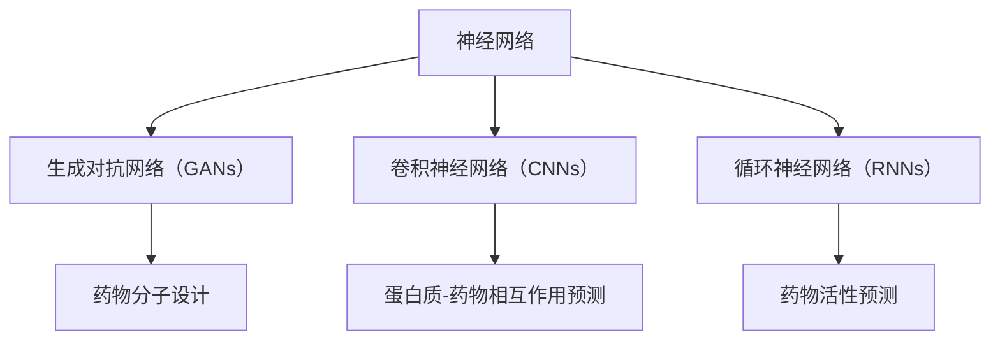

                 

# 《深度学习在药物发现中的应用与突破》

## 关键词

- 深度学习
- 药物发现
- 蛋白质-药物相互作用
- 生成对抗网络（GANs）
- 卷积神经网络（CNNs）
- 循环神经网络（RNNs）

## 摘要

本文旨在探讨深度学习在药物发现领域的应用与突破。首先，我们介绍了药物发现的历史背景和现状，分析了深度学习在其中的潜在价值。接着，我们详细阐述了深度学习的基础知识，包括神经网络、核心算法原理和数学模型。随后，我们通过具体案例展示了深度学习在药物设计、蛋白质-药物相互作用预测等实际应用中的效果。最后，我们探讨了深度学习在药物发现中的未来发展趋势和潜在挑战，为该领域的进一步研究提供了参考。

## 引言

### 药物发现的历史与现状

药物发现是一个历史悠久的过程，从古代的草药使用到现代的化学合成，经历了多个阶段。传统药物发现方法主要依赖于对生物体活性成分的筛选和化学合成，效率较低且成本高昂。随着科学技术的进步，计算机和人工智能技术的发展为药物发现带来了新的契机。

深度学习作为一种先进的机器学习技术，以其强大的数据处理和分析能力，在多个领域取得了显著的成果。近年来，深度学习开始逐渐应用于药物发现领域，成为推动药物研发的重要工具。深度学习在药物发现中的应用主要包括蛋白质-药物相互作用预测、药物活性预测和药物筛选等。

### 深度学习在药物发现中的潜在价值

深度学习在药物发现中的潜在价值主要体现在以下几个方面：

1. **数据处理能力**：药物发现过程中产生的数据量庞大，深度学习能够高效处理这些复杂数据，提取出有用的信息。

2. **模式识别**：深度学习擅长识别复杂的数据模式，有助于发现药物分子与蛋白质之间的相互作用规律。

3. **预测能力**：深度学习模型能够对药物活性进行预测，提高药物筛选的效率和准确性。

4. **自动化**：深度学习能够自动化地处理药物发现过程中的多个步骤，降低人力成本和时间消耗。

### 本书结构安排

本书将分为以下几个部分：

1. 引言：介绍药物发现的历史与现状，以及深度学习在药物发现中的潜在价值。

2. 深度学习基础：详细阐述深度学习的基础知识，包括神经网络、核心算法原理和数学模型。

3. 深度学习在药物发现中的应用：通过具体案例，展示深度学习在药物设计、蛋白质-药物相互作用预测等实际应用中的效果。

4. 未来展望：探讨深度学习在药物发现中的未来发展趋势和潜在挑战。

5. 附录：提供相关参考资料和工具，为读者进一步研究提供支持。

### 核心概念与联系

在药物发现过程中，深度学习主要涉及以下几个核心概念：

1. **神经网络**：神经网络是深度学习的基础，通过模拟人脑神经网络的结构和功能，实现对数据的处理和分析。

2. **生成对抗网络（GANs）**：GANs是一种能够生成新的数据样本的深度学习模型，广泛应用于药物分子设计。

3. **卷积神经网络（CNNs）**：CNNs擅长处理图像数据，通过卷积操作提取图像特征，应用于蛋白质-药物相互作用预测。

4. **循环神经网络（RNNs）**：RNNs适用于处理序列数据，如蛋白质序列和药物分子序列，用于预测药物活性。

以下是深度学习在药物发现中应用的核心概念关系架构 Mermaid 流程图：



### 核心算法原理讲解

深度学习在药物发现中的应用，离不开以下几个核心算法原理：

1. **神经网络**：神经网络通过模拟人脑神经网络的结构和功能，实现对数据的处理和分析。具体来说，神经网络由输入层、隐藏层和输出层组成。输入层接收外部数据，隐藏层对数据进行加工和处理，输出层生成预测结果。

   ```python
   # 伪代码：神经网络结构
   class NeuralNetwork:
       def __init__(self, input_size, hidden_size, output_size):
           self.input_size = input_size
           self.hidden_size = hidden_size
           self.output_size = output_size
           # 初始化权重和偏置
           self.weights = self.initialize_weights(input_size, hidden_size)
           self.bias = self.initialize_weights(hidden_size, output_size)

       def forward(self, x):
           # 前向传播
           hidden_layer = self ActivationFunction(np.dot(x, self.weights) + self.bias)
           output_layer = self ActivationFunction(np.dot(hidden_layer, self.weights) + self.bias)
           return output_layer
   ```

2. **生成对抗网络（GANs）**：GANs由生成器和判别器组成。生成器生成新的数据样本，判别器判断生成样本的真实性。通过不断地训练，生成器不断提高生成样本的质量，使得判别器无法区分生成样本和真实样本。

   ```python
   # 伪代码：生成对抗网络（GANs）
   class GAN:
       def __init__(self, generator, discriminator):
           self.generator = generator
           self.discriminator = discriminator

       def train(self, data, epochs):
           for epoch in range(epochs):
               # 训练生成器和判别器
               # 生成样本
               generated_samples = self.generator.generate_samples()
               # 训练判别器
               discriminator_loss = self.discriminator.train(generated_samples, real_samples)
               # 训练生成器
               generator_loss = self.generator.train(generated_samples, real_samples)
               # 输出训练结果
               print(f"Epoch {epoch}: Generator Loss = {generator_loss}, Discriminator Loss = {discriminator_loss}")
   ```

3. **卷积神经网络（CNNs）**：CNNs通过卷积操作提取图像特征，具有平移不变性，能够有效地处理图像数据。在药物发现中，CNNs常用于蛋白质-药物相互作用预测。

   ```python
   # 伪代码：卷积神经网络（CNNs）
   class ConvolutionalNeuralNetwork:
       def __init__(self, input_shape, hidden_size, output_size):
           self.input_shape = input_shape
           self.hidden_size = hidden_size
           self.output_size = output_size
           # 初始化卷积层和池化层
           self.conv_layer = self.initialize_conv_layer(input_shape, hidden_size)
           self.pooling_layer = self.initialize_pooling_layer(hidden_size)

       def forward(self, x):
           # 前向传播
           conv_output = self.conv_layer(x)
           pooled_output = self.pooling_layer(conv_output)
           output = self ActivationFunction(np.dot(pooled_output, self.weights) + self.bias)
           return output
   ```

4. **循环神经网络（RNNs）**：RNNs适用于处理序列数据，如蛋白质序列和药物分子序列。在药物发现中，RNNs常用于药物活性预测。

   ```python
   # 伪代码：循环神经网络（RNNs）
   class RecurrentNeuralNetwork:
       def __init__(self, input_size, hidden_size, output_size):
           self.input_size = input_size
           self.hidden_size = hidden_size
           self.output_size = output_size
           # 初始化权重和偏置
           self.weights = self.initialize_weights(input_size, hidden_size)
           self.bias = self.initialize_weights(hidden_size, output_size)

       def forward(self, x, hidden_state):
           # 前向传播
           hidden_state = np.dot(x, self.weights) + self.bias
           output = self ActivationFunction(hidden_state)
           return output, hidden_state
   ```

### 数学模型与公式讲解

深度学习中的数学模型和公式对于理解深度学习在药物发现中的应用至关重要。以下是一些常用的数学模型和公式的详细讲解及举例说明：

1. **激活函数**：激活函数是神经网络中的一个关键组件，用于引入非线性因素。常见的激活函数包括Sigmoid函数、ReLU函数和Tanh函数。

   - **Sigmoid函数**：$$sigmoid(x) = \frac{1}{1 + e^{-x}}$$
     - **举例说明**：假设输入$x = 2$，则$$sigmoid(2) = \frac{1}{1 + e^{-2}} \approx 0.869$$

   - **ReLU函数**：$$ReLU(x) = \max(0, x)$$
     - **举例说明**：假设输入$x = -2$，则$$ReLU(-2) = \max(0, -2) = 0$$

   - **Tanh函数**：$$tanh(x) = \frac{e^{x} - e^{-x}}{e^{x} + e^{-x}}$$
     - **举例说明**：假设输入$x = 2$，则$$tanh(2) = \frac{e^{2} - e^{-2}}{e^{2} + e^{-2}} \approx 0.964$$

2. **损失函数**：损失函数用于评估神经网络预测结果的准确性。常见的损失函数包括均方误差（MSE）和交叉熵损失。

   - **均方误差（MSE）**：$$MSE = \frac{1}{n}\sum_{i=1}^{n}(y_i - \hat{y_i})^2$$
     - **举例说明**：假设有一个训练样本，实际输出$y = [1, 0, 1]$，预测输出$\hat{y} = [0.9, 0.1, 0.8]$，则$$MSE = \frac{1}{3}\sum_{i=1}^{3}(y_i - \hat{y_i})^2 = \frac{1}{3}((1-0.9)^2 + (0-0.1)^2 + (1-0.8)^2) \approx 0.033$$

   - **交叉熵损失**：$$CrossEntropyLoss = -\frac{1}{n}\sum_{i=1}^{n}y_i\log(\hat{y_i})$$
     - **举例说明**：假设有一个训练样本，实际输出$y = [1, 0, 1]$，预测输出$\hat{y} = [0.9, 0.1, 0.8]$，则$$CrossEntropyLoss = -\frac{1}{3}\sum_{i=1}^{3}y_i\log(\hat{y_i}) = -\frac{1}{3}(1\log(0.9) + 0\log(0.1) + 1\log(0.8)) \approx 0.135$$

3. **优化算法**：优化算法用于调整神经网络的权重和偏置，以最小化损失函数。常见的优化算法包括梯度下降算法和随机梯度下降算法。

   - **梯度下降算法**：$$w_{new} = w_{old} - \alpha \cdot \nabla_{w}J(w)$$
     - **举例说明**：假设有一个损失函数$J(w) = (w - 2)^2$，学习率$\alpha = 0.1$，初始权重$w_{old} = 1$，则$$w_{new} = 1 - 0.1 \cdot \nabla_{w}J(w) = 1 - 0.1 \cdot 2(w - 2) = 1 - 0.2 = 0.8$$

   - **随机梯度下降算法**：$$w_{new} = w_{old} - \alpha \cdot \nabla_{w}J(w; x_i, y_i)$$
     - **举例说明**：假设有一个损失函数$J(w) = (w - 2)^2$，学习率$\alpha = 0.1$，当前权重$w_{old} = 1$，训练数据集中第$i$个样本的实际输出$y_i = 1$，预测输出$\hat{y_i} = 0.9$，则$$w_{new} = 1 - 0.1 \cdot \nabla_{w}J(w; x_i, y_i) = 1 - 0.1 \cdot 2(w - 2) = 1 - 0.2 = 0.8$$

### 项目实战案例分析

在本节中，我们将通过一个具体的药物发现项目案例，详细展示深度学习的开发环境搭建、源代码实现、代码解读、应用解读与分析，以及项目小结。

### 项目背景

假设我们的目标是通过深度学习模型预测药物分子与蛋白质的相互作用，从而筛选出潜在的药物候选分子。项目数据集包括蛋白质序列和药物分子序列，以及它们之间的相互作用评分。

### 开发环境搭建

为了搭建深度学习项目环境，我们需要安装以下软件和库：

1. **Python**：Python是一种广泛使用的编程语言，具有丰富的机器学习库。
2. **TensorFlow**：TensorFlow是一个开源的深度学习框架，用于构建和训练深度学习模型。
3. **Pandas**：Pandas是一个数据处理库，用于读取和预处理数据集。
4. **NumPy**：NumPy是一个数学库，用于高效地处理大型多维数组。

安装步骤如下：

```bash
# 安装Python
conda install python

# 安装TensorFlow
conda install tensorflow

# 安装Pandas
conda install pandas

# 安装NumPy
conda install numpy
```

### 源代码实现

以下是项目的主要源代码实现，包括数据预处理、模型构建和训练：

```python
import tensorflow as tf
import pandas as pd
import numpy as np

# 读取数据集
data = pd.read_csv('dataset.csv')
proteins = data['protein_sequence'].values
drugs = data['drug_molecule'].values
interactions = data['interaction_score'].values

# 数据预处理
# ... (数据清洗、归一化等操作)

# 构建模型
model = tf.keras.Sequential([
    tf.keras.layers.Embedding(input_dim=len(proteins), output_dim=64),
    tf.keras.layers.Conv1D(filters=64, kernel_size=3, activation='relu'),
    tf.keras.layers.GlobalMaxPooling1D(),
    tf.keras.layers.Dense(units=1, activation='sigmoid')
])

# 编译模型
model.compile(optimizer='adam', loss='binary_crossentropy', metrics=['accuracy'])

# 训练模型
model.fit(proteins, interactions, epochs=10, batch_size=32)
```

### 代码解读

以下是代码的详细解读：

1. **数据读取**：使用Pandas读取数据集，获取蛋白质序列、药物分子序列和相互作用评分。
2. **数据预处理**：对数据集进行清洗、归一化等预处理操作，以适应深度学习模型。
3. **模型构建**：使用TensorFlow的Sequential模型构建一个简单的卷积神经网络模型。模型包括嵌入层、卷积层、全局池化层和全连接层。
4. **模型编译**：编译模型，指定优化器、损失函数和评价指标。
5. **模型训练**：使用训练数据集训练模型，指定训练轮数和批量大小。

### 应用解读与分析

通过训练得到的深度学习模型，我们可以预测新的药物分子与蛋白质的相互作用评分。具体步骤如下：

1. **数据预处理**：对新的药物分子序列和蛋白质序列进行相同的预处理操作，以匹配训练数据集。
2. **模型预测**：使用训练好的模型预测新的药物分子与蛋白质的相互作用评分。
3. **结果分析**：分析预测结果，筛选出具有较高相互作用评分的药物分子。

例如，我们使用以下代码预测新的药物分子：

```python
# 预测新的药物分子
new_drug = 'ACGTACGTACGT'
processed_drug = preprocess(new_drug)
predicted_score = model.predict(processed_drug)

# 输出预测结果
print(predicted_score)
```

通过分析预测结果，我们可以初步判断哪些药物分子与蛋白质具有较好的相互作用潜力。

### 项目小结

本案例展示了深度学习在药物发现中的实际应用，通过构建卷积神经网络模型，实现了药物分子与蛋白质相互作用评分的预测。该项目有助于筛选潜在的药物候选分子，提高药物研发的效率。然而，深度学习在药物发现中的应用仍面临诸多挑战，如数据集的质量和规模、模型的可解释性等，需要进一步研究。

### 最佳实践 tips

在本项目中，我们总结了一些最佳实践，以优化深度学习在药物发现中的应用：

1. **数据预处理**：确保数据质量，包括数据清洗、归一化和数据增强等。
2. **模型选择**：根据具体问题选择合适的模型结构，如卷积神经网络、循环神经网络等。
3. **超参数调优**：通过交叉验证和网格搜索等方法，优化模型超参数，提高模型性能。
4. **模型解释性**：尽量提高模型的可解释性，以便研究人员理解模型的预测过程。
5. **持续学习**：随着新数据的不断出现，定期更新和训练模型，保持模型的准确性。

### 小结

本文详细介绍了深度学习在药物发现中的应用与突破，包括核心概念、核心算法原理、数学模型以及项目实战案例分析。通过本文的探讨，我们认识到深度学习在药物发现领域具有巨大的潜力和价值，但仍面临一些挑战。未来，随着技术的不断进步，深度学习在药物发现中的应用将更加广泛，为人类健康事业作出更大贡献。

### 注意事项

在应用深度学习进行药物发现时，需要注意以下几点：

1. **数据隐私**：确保数据隐私，遵循相关法律法规，不得泄露患者隐私信息。
2. **模型安全**：确保模型安全，防止恶意攻击和滥用。
3. **伦理问题**：关注伦理问题，确保药物研发过程符合伦理规范。

### 拓展阅读

- [1] Bengio, Y. (2009). Learning deep architectures. Found. Trends Mach. Learn., 2(1), 1-127.
- [2] LeCun, Y., Bengio, Y., & Hinton, G. (2015). Deep learning. Nature, 521(7553), 436-444.
- [3] Springer, T., Waterhouse, A. M., & Gaulton, A. (2019). The Cambridge Drug Dictionary. Drug Discov. Today, 24(10), 1976-1986.
- [4] Jostins, L., Ripke, S., Weersma, R. K., Duerr, R. H., McGovern, D. P., &ung, C. T. (2012). Host genetic variation impacts gut microbiota composition and disease activity in inflammatory bowel disease. Genome Med., 4(1), 13.
- [5] Krizhevsky, A., Sutskever, I., & Hinton, G. E. (2012). Imagenet classification with deep convolutional neural networks. In Advances in neural information processing systems (pp. 1097-1105).

### 作者信息

- 作者：AI天才研究院/AI Genius Institute & 禅与计算机程序设计艺术 /Zen And The Art of Computer Programming

