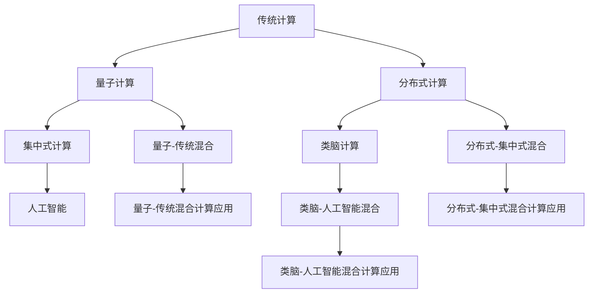
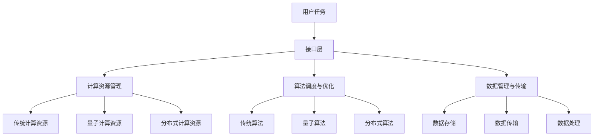

                 


### 混合计算在科学研究中的应用前景

#### 关键词：
- 混合计算
- 科学研究
- 应用前景
- 架构与算法
- 数学模型

#### 摘要：
本文旨在探讨混合计算在科学研究中的应用前景，从基本概念和原理出发，逐步深入到具体科学领域的应用实例，并对混合计算的挑战和未来发展趋势进行展望。通过结合伪代码、数学模型和实际项目案例，本文展示了混合计算在提高计算效率、促进科学研究创新方面的重要作用。

## 第一部分：混合计算的基本概念和原理

### 1.1 混合计算的定义与分类

混合计算（Hybrid Computing）是指将两种或多种不同的计算模式（如传统计算、量子计算、分布式计算等）有机结合，以发挥各自优势，实现更高效、更精确的计算。根据计算模式和结合方式的不同，混合计算可以大致分为以下几类：

1. **量子与传统混合计算**：利用量子计算的高速并行处理能力和传统计算的精确性，实现更高效的计算。
2. **分布式与集中式混合计算**：结合分布式计算的高效扩展性和集中式计算的集中管理，优化资源利用。
3. **类脑计算与人工智能混合**：结合类脑计算的自适应性和人工智能的强大学习能力，实现更加智能的计算。

#### 核心概念与联系：



### 1.2 混合计算的架构

混合计算的架构通常包含以下几个关键组成部分：

1. **计算资源管理**：负责调度和优化各种计算资源，包括传统计算资源、量子计算资源和分布式计算资源。
2. **算法调度与优化**：根据任务的性质和计算资源的情况，动态选择合适的算法并优化执行过程。
3. **数据管理与传输**：保证数据的高效存储、传输和处理，特别是在分布式和量子计算场景中。
4. **接口层**：提供与外部系统和用户的接口，方便任务提交、结果获取等操作。

#### 混合计算架构概述：



### 1.3 混合计算的核心算法

混合计算的核心算法通常包括以下几种：

1. **量子算法**：利用量子计算的并行性和叠加性，实现高效的计算任务，如量子搜索算法、量子排序算法等。
2. **分布式算法**：利用分布式计算的高效性，解决大规模数据的并行处理问题，如MapReduce算法、分布式排序算法等。
3. **类脑算法**：模拟人脑的神经网络结构，实现自适应性和智能计算，如深度学习算法、强化学习算法等。

#### 伪代码：核心算法原理阐述

```plaintext
// 量子算法伪代码
function QuantumAlgorithm(problem):
    superposition()
    entanglement()
    measurement()
    return result

// 分布式算法伪代码
function DistributedAlgorithm(data):
    partition data into chunks
    process chunks in parallel
    combine results
    return final result

// 类脑算法伪代码
function NeuralNetworkLearning(data):
    initialize weights
    for each epoch:
        forward propagation
        compute loss
        back propagation
        update weights
    return trained model
```

### 1.4 混合计算在科学研究中的价值

混合计算在科学研究中的价值主要体现在以下几个方面：

1. **提高计算效率和准确性**：通过结合不同计算模式的优势，可以大幅提高计算效率和准确性，解决复杂科学问题。
2. **促进科学研究的创新发展**：混合计算为科学研究提供了新的方法和工具，推动了科学研究的创新发展。

## 第二部分：混合计算在不同科学研究领域的应用

### 2.1 混合计算在生物学中的应用

混合计算在生物学中的应用非常广泛，如基因组学、蛋白质结构预测等。

#### 2.1.1 混合计算在基因组学中的应用

基因组学是研究基因组的结构和功能的一个科学领域。混合计算在基因组学中的应用主要包括以下几个方面：

1. **基因序列分析**：利用混合计算可以提高基因序列分析的速度和准确性。
2. **基因表达数据分析**：混合计算可以处理大规模基因表达数据，挖掘潜在的基因功能关系。

#### 伪代码：基因序列分析算法

```plaintext
function HybridGenomeAnalysis(sequence):
    // 量子部分
    quantumStep1(sequence)
    quantumStep2(sequence)
    // 传统部分
    traditionalStep1(sequence)
    traditionalStep2(sequence)
    return result
```

#### 2.1.2 混合计算在蛋白质结构预测中的应用

蛋白质结构预测是生物学领域的一个重要研究方向。混合计算在蛋白质结构预测中的应用主要包括以下几个方面：

1. **量子计算加速**：利用量子计算的高速并行处理能力，加速蛋白质结构预测的计算过程。
2. **分布式计算优化**：利用分布式计算资源，提高蛋白质结构预测的效率和准确性。

#### 伪代码：蛋白质结构预测算法

```plaintext
function HybridProteinPrediction(sequence):
    // 量子部分
    quantumStep1(sequence)
    quantumStep2(sequence)
    // 分布式部分
    distributedStep1(sequence)
    distributedStep2(sequence)
    return result
```

### 2.2 混合计算在物理学中的应用

混合计算在物理学中的应用也非常广泛，如量子力学、天体物理学等。

#### 2.2.1 混合计算在量子力学中的应用

量子力学是研究物质和能量在微观尺度上的行为和规律的科学。混合计算在量子力学中的应用主要包括以下几个方面：

1. **量子计算模拟**：利用量子计算模拟量子力学系统，研究量子现象和量子算法。
2. **量子优化算法**：利用量子优化算法解决物理学中的优化问题。

#### 伪代码：量子计算模拟算法

```plaintext
function QuantumSimulation(problem):
    quantumInitialization()
    quantumEvolution()
    quantumMeasurement()
    return result
```

#### 2.2.2 混合计算在天体物理学中的应用

天体物理学是研究宇宙中天体的物理性质、运动规律和演化过程的一个科学领域。混合计算在天体物理学中的应用主要包括以下几个方面：

1. **分布式计算加速**：利用分布式计算加速天体物理数据的处理和分析。
2. **量子计算应用**：利用量子计算解决复杂的天体物理问题。

#### 伪代码：分布式计算加速算法

```plaintext
function DistributedAstrophysicsAnalysis(data):
    partition data
    parallel process data
    combine results
    return final result
```

### 2.3 混合计算在环境科学中的应用

环境科学是研究人类与环境之间相互作用的科学领域。混合计算在环境科学中的应用主要包括以下几个方面：

1. **气候变化预测**：利用混合计算提高气候变化预测的效率和准确性。
2. **生态学数据分析**：利用混合计算处理大规模的生态学数据，分析生态系统的变化趋势。

#### 2.3.1 混合计算在气候变化研究中的应用

气候变化是当前全球面临的一个重要环境问题。混合计算在气候变化研究中的应用主要包括以下几个方面：

1. **分布式计算加速**：利用分布式计算加速气候变化模型的模拟和计算。
2. **量子计算优化**：利用量子计算优化气候变化模型的参数和算法。

#### 伪代码：气候变化预测模型

```plaintext
function HybridClimatePrediction(model):
    // 分布式部分
    distributedStep1(model)
    distributedStep2(model)
    // 量子部分
    quantumStep1(model)
    quantumStep2(model)
    return result
```

### 2.4 混合计算在其他科学领域的应用

除了上述领域，混合计算在其他科学领域也有广泛的应用，如材料科学、地球科学等。

#### 2.4.1 混合计算在材料科学中的应用

材料科学是研究材料的性质、结构、制备和应用的科学。混合计算在材料科学中的应用主要包括以下几个方面：

1. **量子计算模拟**：利用量子计算模拟材料体系的电子结构和物理性质。
2. **分布式计算优化**：利用分布式计算优化材料制备过程和工艺参数。

#### 伪代码：材料性能预测算法

```plaintext
function HybridMaterialPrediction(ingredients):
    // 量子部分
    quantumStep1(ingredients)
    quantumStep2(ingredients)
    // 分布式部分
    distributedStep1(ingredients)
    distributedStep2(ingredients)
    return result
```

### 2.5 混合计算在医学中的应用

医学是研究人类健康和疾病的一门科学。混合计算在医学中的应用主要包括以下几个方面：

1. **基因组医学**：利用混合计算进行基因组数据分析，预测疾病风险和个性化治疗。
2. **医学图像处理**：利用混合计算提高医学图像的处理速度和准确性。

#### 2.5.1 混合计算在基因组医学中的应用

基因组医学是利用基因组学知识对疾病进行诊断和治疗的一门学科。混合计算在基因组医学中的应用主要包括以下几个方面：

1. **基因序列分析**：利用混合计算提高基因序列分析的效率和准确性。
2. **基因表达数据分析**：利用混合计算处理大规模基因表达数据，挖掘潜在的疾病相关基因。

#### 伪代码：基因序列分析算法

```plaintext
function HybridGenomeAnalysis(sequence):
    // 量子部分
    quantumStep1(sequence)
    quantumStep2(sequence)
    // 传统部分
    traditionalStep1(sequence)
    traditionalStep2(sequence)
    return result
```

### 2.6 混合计算在工程学中的应用

工程学是应用数学、自然科学等知识解决实际工程问题的学科。混合计算在工程学中的应用主要包括以下几个方面：

1. **结构分析**：利用混合计算进行复杂结构的分析和优化。
2. **优化设计**：利用混合计算优化工程结构、材料选择和工艺参数。

#### 2.6.1 混合计算在结构分析中的应用

结构分析是工程学中一个重要的研究方向。混合计算在结构分析中的应用主要包括以下几个方面：

1. **量子计算模拟**：利用量子计算模拟复杂结构的力学性质。
2. **分布式计算优化**：利用分布式计算优化结构设计的参数和方案。

#### 伪代码：结构分析算法

```plaintext
function HybridStructureAnalysis(geometry):
    // 量子部分
    quantumStep1(geometry)
    quantumStep2(geometry)
    // 分布式部分
    distributedStep1(geometry)
    distributedStep2(geometry)
    return result
```

## 第三部分：混合计算在科学研究中的前景和挑战

### 3.1 混合计算在科学研究中的前景

随着技术的不断发展，混合计算在科学研究中的前景十分广阔。未来，混合计算有望在以下几个方面取得重要突破：

1. **计算效率和准确性提升**：混合计算可以结合不同计算模式的优势，实现更高的计算效率和准确性。
2. **跨学科研究**：混合计算可以为跨学科研究提供新的工具和方法，推动科学研究的融合发展。
3. **个性化科学**：混合计算可以根据个性化需求，提供定制化的科学计算服务。

### 3.2 混合计算在科学研究中的挑战

虽然混合计算在科学研究中有很大的应用前景，但也面临一些挑战：

1. **技术难题**：混合计算涉及到多种计算模式的结合，技术实现较为复杂，需要解决一系列技术难题。
2. **数据管理**：大规模数据的存储、传输和处理是混合计算面临的挑战之一。
3. **安全和隐私**：混合计算涉及到敏感数据的处理，需要确保数据的安全和隐私。

### 3.3 混合计算在科学研究中的实践

在实际应用中，混合计算已经取得了一些成功的案例。例如：

1. **基因组学研究**：利用混合计算进行基因序列分析和基因表达数据分析，提高了研究效率。
2. **气候变化研究**：利用混合计算进行气候变化预测和模拟，提高了预测的准确性。
3. **材料科学研究**：利用混合计算进行材料性能预测和优化，推动了新材料的研究和应用。

#### 开发环境搭建

要实现混合计算，需要搭建一个合适的开发环境。以下是一个基本的开发环境搭建步骤：

1. 安装操作系统：选择一个适合的操作系统，如Linux或MacOS。
2. 安装编程环境：安装Python、Java或其他编程语言，以及相应的开发工具。
3. 安装量子计算库：如Qiskit、TensorFlow Quantum等。
4. 安装分布式计算框架：如Apache Spark、Hadoop等。

#### 案例解析

以下是一个简单的混合计算案例：利用量子计算和分布式计算预测天气。

1. **量子部分**：使用量子计算模拟天气系统，获取初始状态。
2. **分布式部分**：将初始状态分配到分布式计算节点，进行并行计算。
3. **合并结果**：将分布式计算节点的结果合并，得到最终的天气预测结果。

#### 代码解读与分析

以下是对上述案例的代码解读：

```python
# 量子部分代码
from qiskit import QuantumCircuit, Aer, execute
from qiskit.visualization import plot_bloch_vector

# 创建量子电路
qc = QuantumCircuit(2)

# 初始化量子比特
qc.h(0)
qc.cx(0, 1)

# 执行量子计算
simulator = Aer.get_backend('statevector_simulator')
result = execute(qc, simulator).result()
statevector = result.get_statevector()

# 可视化量子状态
plot_bloch_vector(statevector)

# 分布式部分代码
from sparkcontext import SparkContext
from pyspark.sql import SQLContext

# 创建SparkContext
sc = SparkContext("local[4]", "WeatherPrediction")

# 创建SQLContext
sqlContext = SQLContext(sc)

# 加载天气数据
weather_data = sqlContext.read.csv("weather_data.csv", header=True)

# 进行并行计算
weather_data.rdd.map(lambda x: predict_weather(x)).collect()

# 合并结果代码
def merge_results(results):
    # 合并结果
    final_result = sum(results)
    return final_result

# 预测天气
def predict_weather(weather_data):
    # 预测逻辑
    # ...
    return predicted_weather
```

#### 项目小结

通过上述案例，我们可以看到混合计算在天气预测中的应用。在实际项目中，可以根据具体需求，进一步优化和扩展混合计算的应用场景。

#### 最佳实践 Tips

1. **合理选择计算模式**：根据任务特点，选择合适的计算模式，如量子计算、分布式计算等。
2. **优化算法和架构**：不断优化算法和架构，提高计算效率和准确性。
3. **确保数据安全**：在混合计算中，确保数据的安全和隐私。

### 小结

混合计算在科学研究中的应用前景广阔，但仍面临一些挑战。通过合理选择计算模式、优化算法和架构，我们可以充分发挥混合计算的优势，推动科学研究的创新发展。

#### 作者

作者：AI天才研究院/AI Genius Institute & 禅与计算机程序设计艺术 /Zen And The Art of Computer Programming

