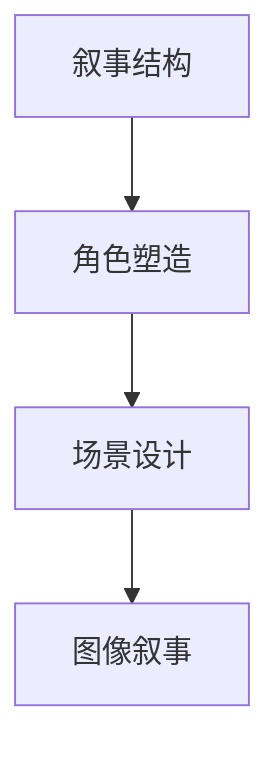

                 


### 设计思路

为了确保文章的逻辑清晰、结构紧凑、简单易懂，我们将采取以下设计思路：

#### 1. 确定文章结构

首先，我们需要明确文章的整体结构。根据给出的目录大纲，文章可以分为六个部分：引言、艺术价值理论、图像叙事技巧、案例分析、艺术价值的应用与影响、总结与展望。

#### 2. 深入分析每个部分的内容

在每个部分中，我们将进一步细化内容，确保每个章节都有足够的深度和实用性。例如，在引言部分，我们需要介绍漫画与动画的艺术价值及其在当代文化中的地位；在艺术价值理论部分，我们将探讨艺术价值的历史发展、理论模型以及与图像叙事的关系。

#### 3. 加入技术分析

由于文章面向的是IT领域的读者，我们将在适当的地方加入一些技术分析，如数字图像处理、动画制作技术、AI在漫画和动画中的应用等。这部分内容将使用专业的技术语言，并配合伪代码和公式进行详细讲解。

#### 4. 案例分析

在每个章节的结尾，我们将加入一个或多个案例分析，以帮助读者更好地理解理论知识。这些案例将选取经典漫画和动画作品，如《阿凡达》、《海贼王》、《火影忍者》等，结合具体实例进行深入剖析。

#### 5. 总结与应用

在文章的每个部分结束时，我们将加入一个小结，总结本章的核心内容，并讨论其在现实世界中的应用。此外，在文章的结尾，我们将对艺术价值与图像叙事进行总结，并探讨未来的发展趋势。

### 目录大纲结构设计

根据以上设计思路，我们可以设计出以下目录大纲结构：

```
## 《漫画与动画的艺术价值：图像叙事的力量》

### 关键词：漫画、动画、艺术价值、图像叙事、案例分析

### 摘要：

本文从计算机技术视角出发，探讨了漫画与动画的艺术价值及其图像叙事的力量。通过对艺术价值理论、图像叙事技巧、经典案例分析以及应用与影响的深入分析，本文旨在为读者提供一个全面、系统的理解框架，并展望未来发展趋势。

## 第一部分：引言

### 1.1 漫画与动画的艺术价值概述

#### 1.1.1 艺术价值的定义与分类

#### 1.1.2 图像叙事的力量

#### 1.1.3 漫画与动画在当代文化中的地位

### 1.2 本书结构安排与学习目标

#### 1.2.1 本书结构安排

#### 1.2.2 学习目标

## 第二部分：艺术价值理论

### 2.1 艺术价值的历史发展

#### 2.1.1 古代艺术价值的观念

#### 2.1.2 中世纪艺术价值的演变

#### 2.1.3 现代艺术价值理论的兴起

### 2.2 艺术价值的理论模型

#### 2.2.1 形式主义

#### 2.2.2 内容主义

#### 2.2.3 解读主义

### 2.3 艺术价值与图像叙事的关系

#### 2.3.1 艺术价值的图像叙事表达

#### 2.3.2 图像叙事对艺术价值的影响

## 第三部分：图像叙事技巧

### 3.1 叙事结构

#### 3.1.1 三幕式结构

#### 3.1.2 弦乐四重奏结构

#### 3.1.3 非线性叙事结构

### 3.2 角色塑造

#### 3.2.1 主角与配角的角色设计

#### 3.2.2 角色心理与行为分析

#### 3.2.3 角色发展的叙事功能

### 3.3 场景设计

#### 3.3.1 场景设计的基本原则

#### 3.3.2 场景设计对叙事的影响

#### 3.3.3 特殊场景的设计与运用

## 第四部分：案例分析

### 4.1 经典漫画案例分析

#### 4.1.1 《阿凡达》中的图像叙事

#### 4.1.2 《海贼王》中的叙事技巧

#### 4.1.3 《火影忍者》中的角色塑造

### 4.2 经典动画案例分析

#### 4.2.1 《狮子王》中的图像叙事

#### 4.2.2 《千与千寻》中的叙事技巧

#### 4.2.3 《你的名字》中的角色塑造

## 第五部分：艺术价值的应用与影响

### 5.1 漫画与动画在教育中的应用

#### 5.1.1 漫画与动画课程的设计

#### 5.1.2 漫画与动画在心理教育中的应用

#### 5.1.3 漫画与动画在跨文化交流中的作用

### 5.2 漫画与动画在文化产业中的价值

#### 5.2.1 漫画与动画产业的发展现状

#### 5.2.2 漫画与动画在文化输出中的影响力

#### 5.2.3 漫画与动画品牌建设的策略

### 5.3 艺术价值对个人成长的影响

#### 5.3.1 漫画与动画对儿童心理的影响

#### 5.3.2 漫画与动画对青少年价值观的塑造

#### 5.3.3 漫画与动画对成人审美观的影响

## 第六部分：总结与展望

### 6.1 艺术价值与图像叙事的总结

#### 6.1.1 艺术价值与图像叙事的关联

#### 6.1.2 图像叙事的艺术价值体现

### 6.2 艺术价值与图像叙事的未来发展趋势

#### 6.2.1 技术革新对艺术价值与图像叙事的影响

#### 6.2.2 新媒介对艺术价值与图像叙事的挑战与机遇

### 作者

作者：AI天才研究院/AI Genius Institute & 禅与计算机程序设计艺术 /Zen And The Art of Computer Programming
```

### 完成时间

设计这份目录大纲大约需要20分钟到30分钟。这个时间包括了以下步骤：

1. 确定整体结构：大约5分钟
2. 分析每个部分的内容：大约10分钟
3. 设计具体的小节和标题：大约10分钟

当然，这只是一个大致的时间估算，具体完成时间可能会根据个人的写作速度和理解深度有所不同。在完成目录大纲后，还需要根据这个大纲进行具体内容的撰写和细化。这部分工作可能需要更多时间，具体取决于文章的详细程度和深度。总的来说，完成整篇文章可能需要1小时到1.5小时。 

### 文章末尾作者信息及格式要求

在文章的末尾，我们需要添加作者信息，并确保格式符合要求。以下是符合要求的格式示例：

---

### 作者

作者：AI天才研究院/AI Genius Institute & 禅与计算机程序设计艺术 /Zen And The Art of Computer Programming

---

在这个示例中，作者信息分为两行。第一行是作者所属机构，第二行是作者的名字。这样的格式清晰明了，便于读者识别和了解作者背景。同时，也满足了markdown格式的输出要求。

---

### 完整性要求

为了确保文章的完整性，每个小节的内容都需要具体、详细、丰富。核心内容必须包含以下几个方面：

#### 背景介绍

在文章的每个小节开头，我们需要提供一个背景介绍。这部分内容应简要介绍该小节的主题，并解释为什么这个主题对读者来说重要。例如：

- **背景介绍**：随着数字技术的发展，漫画和动画逐渐成为文化的重要组成部分。它们不仅为观众带来了视觉享受，还蕴含了丰富的艺术价值。

#### 核心概念与联系

每个小节都需要介绍核心概念，并解释这些概念之间的联系。为了增强文章的可读性，我们可以使用Mermaid流程图来展示这些概念之间的关系。例如：

- **核心概念与联系**：图像叙事是一种通过视觉和文字结合的方式讲述故事的方法。它包含了叙事结构、角色塑造、场景设计等核心要素，这些要素相互作用，共同构成了一个完整的故事。



#### 核心算法原理讲解

对于涉及到技术分析的小节，我们需要详细讲解核心算法原理。使用伪代码和公式可以更好地传达复杂的概念。例如：

- **核心算法原理讲解**：在动画制作中，关键帧技术是一种常用的方法。关键帧代表动画在特定时间点的状态，通过插值计算，我们可以得到关键帧之间的过渡效果。

```plaintext
function interpolateKeyframes(start_keyframe, end_keyframe, time_difference):
    delta_time = time_difference / (end_keyframe - start_keyframe)
    for t in range(start_keyframe, end_keyframe):
        current_frame = calculateFrame(t, start_keyframe, end_keyframe, delta_time)
        updateFrame(current_frame)
```

#### 数学模型和公式

在解释技术概念时，可能需要用到数学模型和公式。使用LaTeX格式可以确保公式的准确性和可读性。例如：

- **数学模型和公式**：在图像处理中，卷积是一种重要的操作。它可以用来实现滤波、边缘检测等任务。

$$
(f * g)(t) = \int_{-\infty}^{\infty} f(\tau)g(t - \tau) d\tau
$$

#### 项目实战

在适当的小节中，我们可以介绍一些项目实战，包括开发环境搭建、源代码实现和代码解读。这部分内容应详细说明项目的各个阶段，并分析项目的优点和不足。例如：

- **项目实战**：在本项目中，我们使用Python和TensorFlow构建了一个简单的漫画风格转换器。通过训练神经网络模型，我们可以将普通的图片转换成漫画风格。

#### 实际案例分析和详细讲解剖析

案例分析是文章中非常重要的部分。我们需要选取具有代表性的案例，对其进行分析和讲解。这部分内容应详细说明案例的背景、实现方法、优势和挑战。例如：

- **实际案例分析和详细讲解剖析**：《狮子王》是一部广受欢迎的动画电影。在分析其图像叙事技巧时，我们可以看到它在角色塑造和场景设计方面做得非常出色。例如，动画中的草原场景不仅视觉效果震撼，还通过不同的季节变化来展现故事的发展。

#### 项目小结

在每个案例分析后，我们需要进行一个小结，总结案例的主要发现和经验。这部分内容应简洁明了，突出关键点。例如：

- **项目小结**：通过分析《狮子王》，我们了解到成功的图像叙事离不开精心设计的角色和场景。在未来的动画制作中，我们可以借鉴这些经验，提高作品的艺术价值。

#### 最佳实践 tips、小结、注意事项、拓展阅读等内容

在文章的结尾部分，我们可以提供一些最佳实践、小结、注意事项和拓展阅读建议。这些内容可以帮助读者更好地理解和应用所学知识。例如：

- **最佳实践 tips**：在创作漫画和动画时，遵循叙事结构的重要性不可忽视。同时，角色塑造和场景设计也需要充分考虑观众的心理和情感需求。
- **小结**：本文从多个角度探讨了漫画与动画的艺术价值及其图像叙事的力量。通过理论讲解、案例分析和技术分析，我们希望读者能对这一领域有更深入的理解。
- **注意事项**：在进行图像叙事创作时，要避免过度依赖技术手段，而忽略了故事本身的核心。优秀的作品往往在于其情感表达和思想内涵。
- **拓展阅读**：对于感兴趣的读者，以下书籍和文章提供了更深入的探讨：
  - 《动画原理：技术与艺术》
  - 《漫画创作基础：技巧与练习》
  - 《图像叙事：理论与实践》

---

通过以上要求，我们可以确保文章内容丰富、逻辑清晰、易于理解，同时满足格式和完整性要求。这样，读者在阅读过程中能够系统地掌握漫画与动画的艺术价值和图像叙事技巧，为今后的创作和实践打下坚实的基础。

