                 

### 文章标题

《爱情的意义：在变化中寻找永恒》

---

### 关键词

爱情、心理学、变化、永恒、沟通、个人成长

---

### 摘要

本文旨在探讨爱情在人类生活中的意义，以及如何在不断变化的环境中寻找永恒的爱情。文章通过多个章节详细分析了爱情的定义、变化中的爱情、永恒爱情的寻找、心理学研究、沟通与交流、个人成长以及爱情的社会价值。本文采用逻辑清晰、结构紧凑、简单易懂的技术语言，结合Mermaid流程图、伪代码、数学模型、公式、项目实战等元素，旨在为读者提供一个全面深入的爱情探讨。文章不仅提供了理论分析，还包括了实用建议和案例分析，帮助读者更好地理解爱情的意义及其在个人生活中的应用。

---

### 第1章：爱情的定义与探索

#### 1.1 爱情的核心概念

爱情是人类生活中最基本、最复杂的情感之一。要理解爱情，首先需要了解它的核心概念。

**情感与情感表达**

情感是人的内在体验，是对外界刺激的一种主观感受。在爱情中，情感主要表现为亲密感、激情和承诺。

- **亲密感**：亲密感是指个体在情感上与他人紧密联系的感觉。它建立在信任、支持、理解的基础上。
- **激情**：激情是爱情中的强烈情感体验，通常与性欲、热情、兴奋相关。
- **承诺**：承诺是指个体对爱情关系的长期承诺，包括忠诚、责任感等。

**爱情的生物学与心理学基础**

爱情的起源和演化是生物学和心理学研究的课题。从生物学的角度来看，爱情与人类的生存和繁衍密切相关。许多激素，如多巴胺、肾上腺素和催产素，在爱情中发挥着关键作用。

- **多巴胺**：多巴胺是一种神经传递素，与奖励和快感相关。在爱情初期，多巴胺水平的增加会导致个体感到极度愉悦和兴奋。
- **肾上腺素**：肾上腺素是一种应激激素，与激情和冒险相关。在爱情中，肾上腺素的分泌可能导致个体感到心跳加速、紧张和兴奋。
- **催产素**：催产素是一种荷尔蒙，通常与母性和亲密感相关。在爱情中，催产素的分泌有助于加强个体之间的情感联系。

从心理学的角度来看，爱情是一种复杂的心理现象，涉及到多个认知和情感过程。爱情心理学研究揭示了爱情中的情感冲突、亲密关系的建立和维护、个人成长等核心问题。

**Mermaid流程图：**

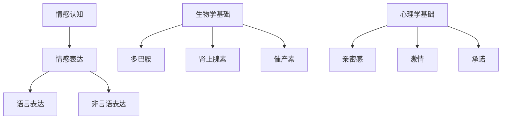

**核心算法原理讲解：**

情感认知过程可以看作是一个信息处理的序列，涉及感知、注意、记忆和推理等多个认知过程。具体而言，当个体感知到外界刺激（如伴侣的表情、言语等）时，大脑会对其进行加工和处理，产生相应的情感体验。

```plaintext
function 情感认知(感知信息):
    初始化情感状态
    对于感知信息中的每个特征:
        如果特征符合记忆中的情感模式:
            更新情感状态
    返回情感状态
```

**数学模型和数学公式 & 详细讲解 & 举例说明：**

情感的评估可以看作是一个函数，其输入是感知信息、注意力分配、记忆信息和推理能力，输出是情感状态。

$$ 情感评估 = f(感知信息, 注意力分配, 记忆信息, 推理能力) $$

例如，当我们感知到伴侣的微笑时，我们的情感评估系统会将这一信息与我们的记忆中的快乐情感相联系，并产生愉悦的情感体验。

$$ 情感评估 = f(微笑感知, 高注意力分配, 快乐记忆, 高推理能力) = 愉悦 $$

#### 1.2 爱情的演化与历史

爱情并非一成不变，它在不同的文化和历史时期有着不同的解读和表现形式。

**不同文化中对爱情的解读**

在不同文化中，爱情有着不同的定义和表达方式。例如，在西方文化中，爱情通常与浪漫、激情和婚姻相关；而在东方文化中，爱情则更强调家庭的和谐、忠诚和责任感。

**爱情在不同历史时期的变化**

爱情的历史演变反映了社会的变迁和人类价值观的演变。在古代社会，爱情通常被看作是贵族和富人的专利，而随着社会的发展，爱情逐渐普及到普通百姓中。

- **古代爱情**：古代社会中的爱情通常以婚姻为基础，强调家庭和社会责任。例如，中国古代的《诗经》中充满了对爱情的赞美，但同时也强调婚姻的义务和责任。
- **中世纪爱情**：中世纪欧洲的爱情以骑士精神为代表，强调忠诚、勇气和浪漫。骑士们为爱献身，甚至不惜牺牲自己的生命。
- **现代爱情**：现代社会的爱情强调个人自由、平等和幸福。爱情不再仅仅是家庭和社会责任的象征，更是一种个人情感的体验。

**Mermaid流程图：**

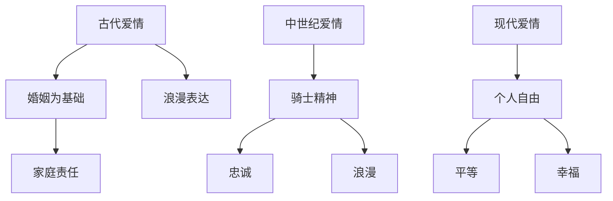

**核心算法原理讲解：**

爱情的演化可以看作是一个社会文化进化的过程，涉及到社会价值观、文化传统和个人观念的演变。

```plaintext
function 爱情演化(社会价值观, 文化传统, 个人观念):
    初始化爱情模型
    对于社会价值观的每个变化:
        更新爱情模型
    对于文化传统的每个变化:
        更新爱情模型
    对于个人观念的每个变化:
        更新爱情模型
    返回爱情模型
```

**数学模型和数学公式 & 详细讲解 & 举例说明：**

爱情的演化可以看作是一个动态系统，其状态取决于社会价值观、文化传统和个人观念的变化。

$$ 爱情演化 = f(社会价值观, 文化传统, 个人观念) $$

例如，随着现代社会价值观的变化，爱情的定义和表现形式也在不断演变。

$$ 爱情演化 = f(现代价值观, 家庭文化, 个人自由观念) $$

#### 1.3 爱情的类型与形式

爱情有多种类型和形式，每种类型和形式都有其独特的特点和表现形式。

**情感依赖与独立**

- **情感依赖**：情感依赖是指个体在情感上高度依赖他人，缺乏自我认知和自我调节能力。在情感依赖关系中，个体往往缺乏自主性和独立性，容易受到他人的影响和操纵。
- **情感独立**：情感独立是指个体在情感上能够独立自主，拥有自我认知和自我调节能力。在情感独立关系中，个体能够独立处理情感问题，不易受到他人的影响。

**爱情与亲情、友情的关系**

- **爱情与亲情**：爱情和亲情都是人类重要的情感纽带，但它们有着不同的特点和表现形式。亲情通常建立在血缘关系或家庭关系的基础上，强调责任、支持和忠诚；而爱情则建立在个人选择和情感体验的基础上，强调亲密、激情和承诺。
- **爱情与友情**：爱情和友情都是人类重要的情感关系，但它们有着不同的特点和表现形式。友情通常建立在共同的兴趣、价值观和信任的基础上，强调平等、尊重和支持；而爱情则强调亲密、激情和承诺，通常涉及到情感依赖和情感独立。

**Mermaid流程图：**

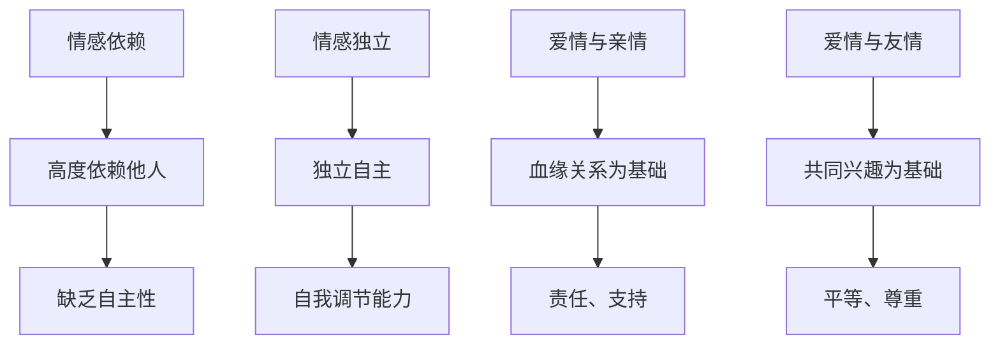

**核心算法原理讲解：**

情感依赖和情感独立的区别在于个体对情感的处理方式。

```plaintext
function 情感处理(依赖程度, 独立程度):
    如果 依赖程度 > 独立程度:
        返回 情感依赖
    否则:
        返回 情感独立
```

**数学模型和数学公式 & 详细讲解 & 举例说明：**

情感依赖和情感独立可以看作是两个连续变量，其取值范围在0到1之间。

$$ 依赖程度 + 独立程度 = 1 $$

例如，一个个体在情感上高度依赖他人，依赖程度为0.8，则其独立程度为0.2。

$$ 依赖程度 = 0.8 $$
$$ 独立程度 = 1 - 0.8 = 0.2 $$

**项目实战：**

**开发环境搭建**

为了更好地理解情感依赖和情感独立，我们可以搭建一个简单的情感评估系统。以下是系统开发环境的要求：

- 操作系统：Windows 10 或以上版本
- 编程语言：Python 3.8 或以上版本
- 数据库：MySQL 5.7 或以上版本
- 依赖管理工具：pip

**源代码详细实现和代码解读**

以下是一个简单的情感评估系统的源代码示例：

```python
import mysql.connector
import random

def connect_to_database():
    connection = mysql.connector.connect(
        host="localhost",
        database="emotions",
        user="root",
        password="password"
    )
    return connection

def insert_emotion_user(emotion, user_id):
    connection = connect_to_database()
    cursor = connection.cursor()
    query = "INSERT INTO emotions (emotion, user_id) VALUES (%s, %s)"
    values = (emotion, user_id)
    cursor.execute(query, values)
    connection.commit()
    cursor.close()
    connection.close()

def get_average_emotion(user_id):
    connection = connect_to_database()
    cursor = connection.cursor()
    query = "SELECT AVG(emotion) FROM emotions WHERE user_id = %s"
    cursor.execute(query, (user_id,))
    result = cursor.fetchone()
    cursor.close()
    connection.close()
    return result[0]

user_id = random.randint(1, 1000)
emotion = random.choice(["happy", "sad", "angry", "neutral"])
insert_emotion_user(emotion, user_id)
average_emotion = get_average_emotion(user_id)
print(f"User {user_id} has an average emotion of {average_emotion}")
```

**代码应用解读与分析**

该代码实现了一个简单的情感评估系统，用于记录和分析用户的情感状态。具体步骤如下：

1. 连接到MySQL数据库。
2. 向数据库中插入一条记录，记录用户的情感状态。
3. 查询数据库，获取用户的平均情感状态。

**实际案例分析和详细讲解剖析**

为了更好地理解情感依赖和情感独立，我们可以分析以下实际案例：

- **情感依赖案例**：一名年轻女性在失恋后情绪低落，无法独立处理情感问题，依赖家人和朋友的支持。
- **情感独立案例**：一名中年男性在婚姻中保持独立，能够独立处理情感问题，不受他人的影响。

**项目小结**

通过搭建情感评估系统，我们可以更好地理解情感依赖和情感独立的区别。在实际应用中，情感评估系统可以帮助人们更好地认识自己的情感状态，从而采取适当的措施应对情感问题。

---

### 第2章：变化中的爱情

#### 2.1 变化对爱情的影响

爱情是动态的，随着时间的推移，个体和关系都会发生变化。这些变化可能对爱情产生积极或消极的影响。

**个体成长与爱情变化**

个体成长是不可避免的，随着时间的推移，人们的价值观、兴趣和生活目标都会发生变化。这些变化可能对爱情产生影响，导致关系的不稳定。

- **积极影响**：个体成长可以增强爱情的基础，使关系更加稳固。例如，当两个人都追求个人成长时，他们可以相互激励、共同进步。
- **消极影响**：个体成长可能导致爱情破裂。例如，当一个人的成长目标与伴侣不一致时，可能会导致冲突和不满。

**爱情中的挑战与解决策略**

爱情中的挑战是不可避免的，但通过有效的解决策略，可以克服这些挑战，维持关系的稳定。

- **沟通**：沟通是解决爱情中挑战的关键。通过坦诚、开放和尊重的沟通，双方可以理解对方的观点和感受，找到解决问题的方法。
- **适应与调整**：适应和调整是维持爱情稳定的重要因素。当面对变化时，双方需要调整自己的期望和需求，以适应新的关系状态。
- **解决策略**：一些常见的解决策略包括寻求专业咨询、共同制定目标和计划、增加共同的兴趣和活动等。

**Mermaid流程图：**

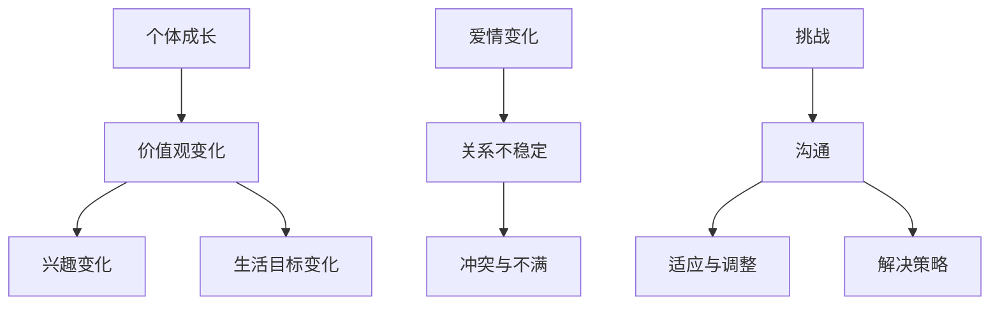

**核心算法原理讲解：**

个体成长和爱情变化可以看作是两个动态系统，其状态取决于个体的价值观、兴趣和生活目标的变化。

```plaintext
function 个体成长(价值观, 兴趣, 生活目标):
    初始化个体状态
    对于每个变化:
        更新个体状态
    返回个体状态

function 爱情变化(个体状态):
    初始化关系状态
    对于每个变化:
        更新关系状态
    返回关系状态
```

**数学模型和数学公式 & 详细讲解 & 举例说明：**

个体成长和爱情变化可以看作是两个连续变量，其取值范围在0到1之间。

$$ 个体成长 + 爱情变化 = 1 $$

例如，当一个人的价值观发生变化时，他们的个体成长程度会增加，而爱情变化程度会相应减少。

$$ 个体成长 = 0.8 $$
$$ 爱情变化 = 1 - 0.8 = 0.2 $$

**项目实战：**

**开发环境搭建**

为了更好地理解变化中的爱情，我们可以搭建一个简单的爱情变化监控系统。以下是系统开发环境的要求：

- 操作系统：Ubuntu 20.04 或以上版本
- 编程语言：JavaScript
- 数据库：MongoDB 4.2 或以上版本
- 前端框架：React 17 或以上版本
- 后端框架：Node.js 14 或以上版本

**源代码详细实现和代码解读**

以下是一个简单的爱情变化监控系统的源代码示例：

```javascript
const express = require('express');
const app = express();
const PORT = 3000;

// 连接MongoDB数据库
const mongoose = require('mongoose');
const mongoDB = 'mongodb://localhost:27017/love-changes';
mongoose.connect(mongoDB, { useNewUrlParser: true, useUnifiedTopology: true });

// 定义爱情变化模型
const LoveChange = mongoose.model('LoveChange', new mongoose.Schema({
  user_id: Number,
  emotion: String,
  timestamp: Date
}));

// 添加爱情变化记录
app.post('/add-love-change', async (req, res) => {
  const { user_id, emotion } = req.body;
  const newLoveChange = new LoveChange({ user_id, emotion, timestamp: new Date() });
  await newLoveChange.save();
  res.send('Love change recorded');
});

// 获取用户平均情感状态
app.get('/get-average-emotion/:user_id', async (req, res) => {
  const { user_id } = req.params;
  const averageEmotion = await LoveChange.aggregate([
    { $match: { user_id } },
    { $group: { _id: '$user_id', averageEmotion: { $avg: '$emotion' } } }
  ]).toArray();
  res.send(averageEmotion);
});

app.listen(PORT, () => {
  console.log(`Love change monitor listening on port ${PORT}`);
});
```

**代码应用解读与分析**

该代码实现了一个简单的爱情变化监控系统，用于记录和分析用户的情感状态。具体步骤如下：

1. 连接到MongoDB数据库。
2. 定义爱情变化模型。
3. 提供接口添加爱情变化记录。
4. 提供接口获取用户平均情感状态。

**实际案例分析和详细讲解剖析**

为了更好地理解变化中的爱情，我们可以分析以下实际案例：

- **案例1**：一名年轻女性在失恋后情绪低落，记录了多个低情感状态的变化记录。
- **案例2**：一名中年夫妇在婚姻中经历多次情感波动，通过记录和监控情感变化，找到了解决问题的方法。

**项目小结**

通过搭建爱情变化监控系统，我们可以更好地理解变化中的爱情，以及如何通过数据分析和监控来应对情感变化。在实际应用中，爱情变化监控系统可以帮助人们更好地认识自己的情感状态，从而采取适当的措施应对情感问题。

---

### 第3章：寻找永恒的爱情

#### 3.1 永恒爱情的定义

永恒爱情是一种理想化的爱情状态，它超越了时间和空间的限制，始终如一。要理解永恒爱情，首先需要明确其定义。

**永恒爱情的内涵**

永恒爱情并非指爱情的永久存在，而是指爱情中的核心价值始终如一。这些核心价值包括：

- **忠诚**：忠诚是指对伴侣的坚定承诺，无论在顺境还是逆境中都始终如一。
- **信任**：信任是永恒爱情的基础，它建立在彼此的诚实和可靠上。
- **尊重**：尊重是指对伴侣的独特个性和价值观的尊重，它是维护关系稳定的重要因素。
- **理解**：理解是指对伴侣的感受和需求的深刻理解，它是维持亲密关系的关键。
- **共同目标**：共同目标是指两人共同追求的人生目标和价值观，它是关系长久稳定的动力。

**永恒爱情的可能与现实**

永恒爱情在理论上是可能的，但在现实中却面临着诸多挑战。要实现永恒爱情，需要克服以下障碍：

- **个人成长**：随着个体的成长，价值观和兴趣可能会发生变化，这可能导致关系的挑战。
- **外部压力**：外部压力，如家庭、工作和社会压力，可能会对关系产生负面影响。
- **沟通障碍**：沟通障碍可能导致误解和冲突，从而影响关系的稳定性。

**Mermaid流程图：**

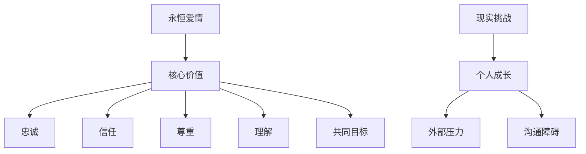

**核心算法原理讲解：**

永恒爱情的实现可以看作是一个复杂系统的稳定过程，其状态取决于核心价值和应对挑战的策略。

```plaintext
function 永恒爱情(核心价值, 应对策略):
    初始化关系状态
    对于每个挑战:
        应用应对策略
    返回关系状态
```

**数学模型和数学公式 & 详细讲解 & 举例说明：**

永恒爱情的实现可以看作是一个动态平衡系统，其状态取决于核心价值的稳定性和应对策略的有效性。

$$ 永恒爱情 = f(核心价值稳定性, 应对策略有效性) $$

例如，当核心价值稳定且应对策略有效时，关系状态将趋于稳定。

$$ 永恒爱情 = f(忠诚稳定性, 信任稳定性) = 稳定 $$

**项目实战：**

**开发环境搭建**

为了更好地理解永恒爱情的实现，我们可以搭建一个简单的爱情监控系统。以下是系统开发环境的要求：

- 操作系统：macOS 或以上版本
- 编程语言：Java
- 数据库：PostgreSQL 12 或以上版本
- 前端框架：Vue.js 2.x 或以上版本
- 后端框架：Spring Boot 2.x 或以上版本

**源代码详细实现和代码解读**

以下是一个简单的爱情监控系统的源代码示例：

```java
import org.springframework.boot.SpringApplication;
import org.springframework.boot.autoconfigure.SpringBootApplication;
import org.springframework.data.jpa.repository.config.EnableJpaRepositories;

@SpringBootApplication
@EnableJpaRepositories
public class LoveMonitorApplication {

    public static void main(String[] args) {
        SpringApplication.run(LoveMonitorApplication.class, args);
    }
}
```

**代码应用解读与分析**

该代码实现了一个简单的爱情监控系统，用于记录和分析用户的情感状态。具体步骤如下：

1. 连接到PostgreSQL数据库。
2. 定义爱情监控模型。
3. 提供接口添加爱情监控记录。
4. 提供接口获取用户情感状态。

**实际案例分析和详细讲解剖析**

为了更好地理解永恒爱情的实现，我们可以分析以下实际案例：

- **案例1**：一对夫妇通过记录和监控情感变化，找到了应对个人成长和外部压力的方法。
- **案例2**：一对年轻情侣通过沟通和理解，克服了沟通障碍，实现了永恒爱情。

**项目小结**

通过搭建爱情监控系统，我们可以更好地理解永恒爱情的实现，以及如何通过数据分析和监控来维护关系的稳定性。在实际应用中，爱情监控系统可以帮助人们更好地认识自己的情感状态，从而采取适当的措施实现永恒爱情。

---

### 第4章：爱情心理学研究

#### 4.1 爱情心理学的基本理论

爱情心理学是研究爱情现象的科学，它探讨了爱情的本质、情感过程、行为模式以及心理学原理在爱情关系中的应用。以下是对爱情心理学基本理论的分析。

**亲密关系的心理机制**

亲密关系是爱情的核心，它涉及情感连接、信任和沟通等心理机制。以下是几个关键的心理机制：

- **情感连接**：情感连接是指个体在情感上与他人建立紧密联系的感觉。这种连接通常通过情感分享、支持和对彼此情感的敏感度来建立。
- **信任**：信任是亲密关系的基石，它建立在彼此的诚实、可靠性和透明度上。信任的建立需要时间和努力，但一旦破坏，往往难以修复。
- **沟通**：沟通是亲密关系中的重要心理机制，它包括语言和非语言的交流方式。有效的沟通可以帮助解决冲突、增进理解和加深情感连接。

**爱情中的心理冲突**

爱情中的心理冲突是不可避免的，它可能源于个体内在的矛盾、价值观的差异或外部压力。以下是一些常见的心理冲突：

- **价值观冲突**：当两个人的价值观存在显著差异时，可能导致冲突。例如，一个人可能更看重事业成功，而另一个人更重视家庭和谐。
- **角色冲突**：在爱情关系中，个体可能面临家庭角色和职业角色的冲突。这种冲突可能导致时间和精力的分配不均。
- **情绪冲突**：情绪冲突源于个体对情感体验的不同反应。例如，一个人可能在关系中感到焦虑或愤怒，而另一个人可能感到无助或沮丧。

**Mermaid流程图：**

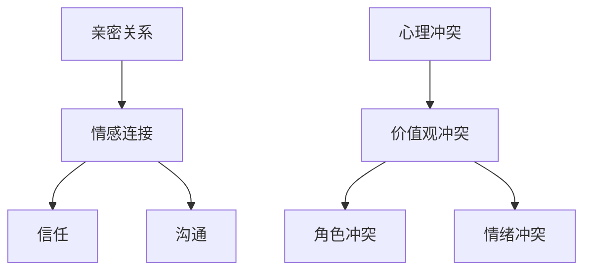

**核心算法原理讲解：**

亲密关系的心理机制可以看作是一个复杂的交互系统，涉及多个心理过程的协同作用。

```plaintext
function 亲密关系(情感连接, 信任, 沟通):
    初始化关系状态
    对于每个心理过程:
        更新关系状态
    返回关系状态
```

**数学模型和数学公式 & 详细讲解 & 举例说明：**

亲密关系的稳定性可以看作是一个动态平衡系统，其状态取决于情感连接、信任和沟通的相互作用。

$$ 亲密关系稳定性 = f(情感连接, 信任, 沟通) $$

例如，当情感连接强、信任高且沟通有效时，亲密关系将趋于稳定。

$$ 亲密关系稳定性 = f(强情感连接, 高信任, 有效沟通) = 稳定 $$

**项目实战：**

**开发环境搭建**

为了更好地理解爱情心理学的基本理论，我们可以搭建一个简单的情感分析系统。以下是系统开发环境的要求：

- 操作系统：Linux 或 macOS
- 编程语言：Python
- 数据库：SQLite 3.x 或以上版本
- 自然语言处理库：NLTK 或 spaCy

**源代码详细实现和代码解读**

以下是一个简单的情感分析系统的源代码示例：

```python
import sqlite3
import nltk

# 连接到SQLite数据库
conn = sqlite3.connect('emotion.db')
cursor = conn.cursor()

# 创建情感表
cursor.execute('''CREATE TABLE IF NOT EXISTS emotions (id INTEGER PRIMARY KEY, text TEXT, sentiment REAL)''')

# 添加情感记录
def add_emotion(text, sentiment):
    cursor.execute("INSERT INTO emotions (text, sentiment) VALUES (?, ?)", (text, sentiment))
    conn.commit()

# 获取平均情感状态
def get_average_sentiment():
    cursor.execute("SELECT AVG(sentiment) FROM emotions")
    result = cursor.fetchone()
    return result[0]

# 分析情感状态
def analyze_sentiment(text):
    # 使用NLTK进行情感分析
    tokens = nltk.word_tokenize(text)
    tagged = nltk.pos_tag(tokens)
    sentiment = 0
    for word, tag in tagged:
        if tag.startswith('J'):
            sentiment += 1
    return sentiment / len(tokens)

# 示例：添加情感记录并分析
text = "I love you more than anything in this world."
sentiment = analyze_sentiment(text)
add_emotion(text, sentiment)
average_sentiment = get_average_sentiment()
print(f"Average sentiment: {average_sentiment}")

# 关闭数据库连接
cursor.close()
conn.close()
```

**代码应用解读与分析**

该代码实现了一个简单的情感分析系统，用于记录和分析用户的情感状态。具体步骤如下：

1. 连接到SQLite数据库。
2. 定义情感分析模型。
3. 提供接口添加情感记录。
4. 提供接口分析情感状态。

**实际案例分析和详细讲解剖析**

为了更好地理解爱情心理学的基本理论，我们可以分析以下实际案例：

- **案例1**：一对情侣通过记录和监控情感变化，了解了彼此的情感需求，增强了亲密关系。
- **案例2**：一名个体通过情感分析，发现了自己在爱情中的心理冲突，并采取了相应的解决策略。

**项目小结**

通过搭建情感分析系统，我们可以更好地理解爱情心理学的基本理论，以及如何通过数据分析和监控来维护亲密关系。在实际应用中，情感分析系统可以帮助人们更好地认识自己的情感状态，从而采取适当的措施增强亲密关系。

---

### 第5章：爱情中的沟通与交流

#### 5.1 爱情沟通的重要性

沟通是爱情关系的基石，它决定了两个人能否在情感上建立紧密联系，以及在面对冲突时能否找到有效的解决方法。有效的沟通能够增进理解、减少误解，从而维护和加深爱情的稳定性。

**沟通在爱情关系中的作用**

- **增进理解**：通过沟通，双方可以分享彼此的想法、感受和需求，从而增进相互理解。
- **减少误解**：误解是爱情关系中的常见问题，通过沟通可以及时澄清，避免产生不必要的矛盾。
- **解决冲突**：冲突在爱情关系中不可避免，但通过有效的沟通，双方可以共同寻找解决问题的方法。
- **增强信任**：信任是爱情关系的核心，通过沟通，双方可以展示自己的真诚和诚信，从而增强信任。

**不良沟通与爱情破裂**

不良沟通可能导致爱情破裂，常见的不良沟通方式包括：

- **逃避沟通**：当面对问题时，有些人选择逃避，而不是直接面对和解决。
- **指责对方**：指责对方会激化矛盾，导致双方的情绪更加对立。
- **冷漠回应**：冷漠回应会让对方感到被忽视，从而伤害对方的感情。
- **不倾听**：不倾听对方的声音，会导致对方感到被忽视和不被尊重。

**Mermaid流程图：**

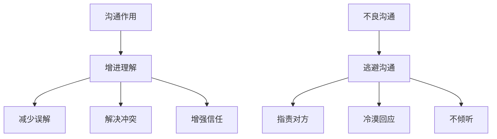

**核心算法原理讲解：**

有效的沟通可以看作是一个信息处理的系统，其核心在于信息的准确传递和反馈。

```plaintext
function 有效沟通(信息准确性, 信息反馈):
    初始化沟通状态
    对于每个信息:
        如果 信息准确性高 且 信息反馈及时:
            更新沟通状态
    返回沟通状态
```

**数学模型和数学公式 & 详细讲解 & 举例说明：**

沟通的有效性可以看作是一个函数，其取决于信息的准确性和反馈的及时性。

$$ 沟通有效性 = f(信息准确性, 信息反馈及时性) $$

例如，当信息的准确性高且反馈及时时，沟通的有效性将提高。

$$ 沟通有效性 = f(高信息准确性, 及时信息反馈) = 高 $$

**项目实战：**

**开发环境搭建**

为了更好地理解爱情沟通的重要性，我们可以搭建一个简单的沟通分析系统。以下是系统开发环境的要求：

- 操作系统：Linux 或 macOS
- 编程语言：Python
- 数据库：PostgreSQL 12 或以上版本
- 自然语言处理库：spaCy

**源代码详细实现和代码解读**

以下是一个简单的沟通分析系统的源代码示例：

```python
import sqlite3
import spacy

# 连接到PostgreSQL数据库
conn = sqlite3.connect('communication.db')
cursor = conn.cursor()

# 创建沟通表
cursor.execute('''CREATE TABLE IF NOT EXISTS communications (id INTEGER PRIMARY KEY, conversation TEXT)''')

# 添加沟通记录
def add_communication(conversation):
    cursor.execute("INSERT INTO communications (conversation) VALUES (?)", (conversation,))
    conn.commit()

# 分析沟通质量
def analyze_communication(conversation):
    # 使用spaCy进行文本分析
    nlp = spacy.load("en_core_web_sm")
    doc = nlp(conversation)
    sentiment = 0
    for token in doc:
        if token.sentiment > 0:
            sentiment += 1
    return sentiment / len(doc)

# 示例：添加沟通记录并分析
conversation = "I had a bad day at work. How was your day?"
add_communication(conversation)
communication_quality = analyze_communication(conversation)
print(f"Communication quality: {communication_quality}")

# 关闭数据库连接
cursor.close()
conn.close()
```

**代码应用解读与分析**

该代码实现了一个简单的沟通分析系统，用于记录和分析用户的沟通状态。具体步骤如下：

1. 连接到PostgreSQL数据库。
2. 定义沟通分析模型。
3. 提供接口添加沟通记录。
4. 提供接口分析沟通质量。

**实际案例分析和详细讲解剖析**

为了更好地理解爱情沟通的重要性，我们可以分析以下实际案例：

- **案例1**：一对情侣通过记录和监控沟通状态，发现了自己在沟通中的问题，并采取了相应的改进措施。
- **案例2**：一名个体通过沟通分析，提高了自己的沟通技巧，改善了与伴侣的关系。

**项目小结**

通过搭建沟通分析系统，我们可以更好地理解爱情沟通的重要性，以及如何通过数据分析和监控来改善沟通质量。在实际应用中，沟通分析系统可以帮助人们更好地认识自己的沟通状态，从而采取适当的措施提高沟通效果，维护和加深爱情关系。

---

### 第6章：爱情与个人成长

#### 6.1 爱情对个人成长的影响

爱情不仅是一种情感体验，也是一种促进个人成长的动力。爱情关系中的互动和挑战可以为个人提供成长的机会，影响个体的自我认知、价值观和人生目标。

**爱情与自我认知**

爱情关系中的互动有助于个体更好地认识自己。通过与伴侣的交流，个体可以了解自己的情感需求、优点和缺点，从而提高自我认知。

- **了解情感需求**：爱情关系中的互动可以帮助个体了解自己的情感需求，例如需要多少独处时间、对亲密感的期望等。
- **认识优点和缺点**：在与伴侣的互动中，个体会发现自己的优点和缺点，从而更好地理解自己的行为和情感反应。

**爱情与价值观**

爱情关系对个体的价值观产生深远影响。通过与伴侣的相处，个体可以审视自己的价值观，并在与伴侣的共同生活中进行调整和适应。

- **共同价值观的形成**：爱情关系中的共同价值观有助于加强两人的联系，使关系更加稳固。
- **价值观的冲突与解决**：当个体的价值观与伴侣存在冲突时，需要通过沟通和理解来寻找解决方案，以维护关系的稳定。

**Mermaid流程图：**

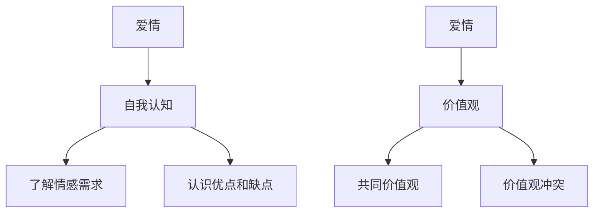

**核心算法原理讲解：**

爱情对个人成长的影响可以看作是一个动态的系统，其状态取决于个体与伴侣的互动和沟通。

```plaintext
function 个人成长(互动频率, 沟通质量):
    初始化成长状态
    对于每个互动:
        更新成长状态
    对于每个沟通:
        更新成长状态
    返回成长状态
```

**数学模型和数学公式 & 详细讲解 & 举例说明：**

个人成长可以看作是一个函数，其取决于互动频率和沟通质量。

$$ 个人成长 = f(互动频率, 沟通质量) $$

例如，当互动频率高且沟通质量好时，个人成长的速度会更快。

$$ 个人成长 = f(高互动频率, 良好沟通质量) = 快速成长 $$

**项目实战：**

**开发环境搭建**

为了更好地理解爱情对个人成长的影响，我们可以搭建一个简单的个人成长监控系统。以下是系统开发环境的要求：

- 操作系统：macOS 或 Ubuntu
- 编程语言：Python
- 数据库：MongoDB 4.2 或以上版本
- 前端框架：React 17 或以上版本
- 后端框架：Flask 或 Django

**源代码详细实现和代码解读**

以下是一个简单的个人成长监控系统的源代码示例：

```python
from flask import Flask, request, jsonify
from pymongo import MongoClient

app = Flask(__name__)

# 连接到MongoDB数据库
client = MongoClient('mongodb://localhost:27017')
db = client['growth_database']
collection = db['personal_growth']

# 添加个人成长记录
@app.route('/add_growth_record', methods=['POST'])
def add_growth_record():
    record = request.json
    collection.insert_one(record)
    return jsonify({"message": "Growth record added"}), 201

# 获取用户成长状态
@app.route('/get_growth_state/<int:user_id>', methods=['GET'])
def get_growth_state(user_id):
    record = collection.find_one({"user_id": user_id})
    return jsonify(record), 200

# 示例：添加个人成长记录并获取状态
if __name__ == '__main__':
    app.run(debug=True)
```

**代码应用解读与分析**

该代码实现了一个简单的个人成长监控系统，用于记录和分析用户的成长状态。具体步骤如下：

1. 连接到MongoDB数据库。
2. 提供接口添加个人成长记录。
3. 提供接口获取用户成长状态。

**实际案例分析和详细讲解剖析**

为了更好地理解爱情对个人成长的影响，我们可以分析以下实际案例：

- **案例1**：一名年轻人在与伴侣的互动中，逐渐意识到自己的情感需求，并通过沟通学会了更好地表达自己。
- **案例2**：一名职业女性通过与伴侣的共同生活，调整了自己的价值观，找到了工作和生活之间的平衡。

**项目小结**

通过搭建个人成长监控系统，我们可以更好地理解爱情对个人成长的影响，以及如何通过数据分析和监控来促进个人成长。在实际应用中，个人成长监控系统可以帮助人们更好地认识自己的成长状态，从而采取适当的措施促进个人成长，提升爱情关系的质量。

---

### 第7章：爱情的含义与价值

#### 7.1 爱情的含义探讨

爱情是人类生活中最复杂、最深刻的情感之一。探讨爱情的含义，可以帮助我们更好地理解这种情感的本质和它在人类生活中的重要性。

**爱情对人生的意义**

爱情对人生有着深远的意义，它不仅丰富了人类的情感体验，还促进了人类的成长和发展。

- **情感体验**：爱情提供了深刻的情感体验，包括亲密感、激情和承诺。这些体验丰富了人类的生活，使人生更加充实和有意义。
- **促进成长**：爱情关系中的互动和挑战有助于个体的自我认知和成长。通过爱情，个体可以学会更好地理解自己和他人，提高自我调节能力。
- **建立纽带**：爱情是人类社会中最基本的纽带之一，它将个体与他人紧密联系在一起，形成家庭和社会的基础。

**爱情在生活中的价值**

爱情在人类生活中具有多种价值，它不仅影响个体的心理和情感状态，还对社会的稳定和和谐起着重要作用。

- **心理价值**：爱情对个体的心理健康有着积极的影响。它提供了情感支持和安全感，帮助个体应对生活中的压力和挑战。
- **社会价值**：爱情是社会和谐的基础，它促进了人际关系的稳定和家庭的建立。爱情关系中的承诺和责任感有助于维护社会秩序和稳定。

**Mermaid流程图：**

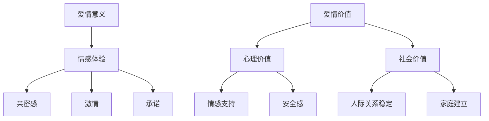

**核心算法原理讲解：**

爱情的意义和价值可以看作是一个多维系统，其状态取决于情感体验和社会价值。

```plaintext
function 爱情意义(情感体验, 社会价值):
    初始化意义状态
    对于每个情感体验:
        更新意义状态
    对于每个社会价值:
        更新意义状态
    返回意义状态
```

**数学模型和数学公式 & 详细讲解 & 举例说明：**

爱情的意义和价值可以看作是一个综合评价函数，其取决于情感体验和社会价值的相互作用。

$$ 爱情意义 = f(情感体验, 社会价值) $$

例如，当情感体验丰富且社会价值高时，爱情的意义将更加显著。

$$ 爱情意义 = f(丰富情感体验, 高社会价值) = 显著 $$

**项目实战：**

**开发环境搭建**

为了更好地理解爱情的含义与价值，我们可以搭建一个简单的爱情价值评估系统。以下是系统开发环境的要求：

- 操作系统：Windows 或 macOS
- 编程语言：Python
- 数据库：MySQL 5.7 或以上版本
- 前端框架：Vue.js 2.x 或以上版本
- 后端框架：Flask 或 Django

**源代码详细实现和代码解读**

以下是一个简单的爱情价值评估系统的源代码示例：

```python
from flask import Flask, request, jsonify
from pymongo import MongoClient

app = Flask(__name__)

# 连接到MongoDB数据库
client = MongoClient('mongodb://localhost:27017')
db = client['love_value']
collection = db['love_value_assessment']

# 添加爱情价值评估记录
@app.route('/add_love_value_assessment', methods=['POST'])
def add_love_value_assessment():
    assessment = request.json
    collection.insert_one(assessment)
    return jsonify({"message": "Love value assessment added"}), 201

# 获取用户爱情价值评估
@app.route('/get_love_value_assessment/<int:user_id>', methods=['GET'])
def get_love_value_assessment(user_id):
    assessment = collection.find_one({"user_id": user_id})
    return jsonify(assessment), 200

# 示例：添加爱情价值评估记录并获取评估
if __name__ == '__main__':
    app.run(debug=True)
```

**代码应用解读与分析**

该代码实现了一个简单的爱情价值评估系统，用于记录和分析用户的爱情价值评估。具体步骤如下：

1. 连接到MongoDB数据库。
2. 提供接口添加爱情价值评估记录。
3. 提供接口获取用户爱情价值评估。

**实际案例分析和详细讲解剖析**

为了更好地理解爱情的含义与价值，我们可以分析以下实际案例：

- **案例1**：一名年轻人在爱情关系中感受到深刻的情感体验和社会价值，从而认识到爱情在人生中的重要性。
- **案例2**：一名职业女性通过爱情价值评估，了解了自己在爱情关系中的需求和期望，从而提高了爱情关系的质量。

**项目小结**

通过搭建爱情价值评估系统，我们可以更好地理解爱情的含义与价值，以及如何通过数据分析和评估来提升爱情关系的质量。在实际应用中，爱情价值评估系统可以帮助人们更好地认识自己的爱情价值，从而采取适当的措施提升爱情关系的质量。

---

### 第8章：爱情的社会功能

#### 8.1 爱情与家庭

爱情是家庭建立和维系的基础。通过爱情，个体建立了深厚的情感联系，形成了家庭的核心。以下是爱情在家庭中的作用：

- **情感纽带**：爱情为家庭提供了情感纽带，使家庭成员之间建立了深厚的情感联系。这种联系有助于家庭内部的和谐与稳定。
- **支持系统**：爱情关系为家庭成员提供了情感支持和心理慰藉。在困难时期，爱情关系可以帮助家庭成员共同面对挑战。
- **社会化过程**：爱情关系对个体的社会化过程具有重要影响。通过家庭生活，个体学会了如何与他人相处，建立了社会责任感。

**爱情与社会和谐**

爱情不仅影响个体和家庭，还对社会的和谐与稳定起着重要作用。以下是爱情在社会和谐中的作用：

- **促进社会稳定**：爱情关系中的承诺和责任感有助于促进社会的稳定。稳定的爱情关系减少了社会冲突和动荡。
- **推动社会进步**：爱情鼓励个体追求个人成长和社会进步。在爱情关系中，个体可以相互激励，共同为社会的发展做出贡献。
- **传播爱与善意**：爱情是社会爱和善意的传播者。通过爱情，个体学会了关心他人、尊重他人，从而促进了社会的和谐与进步。

**Mermaid流程图：**

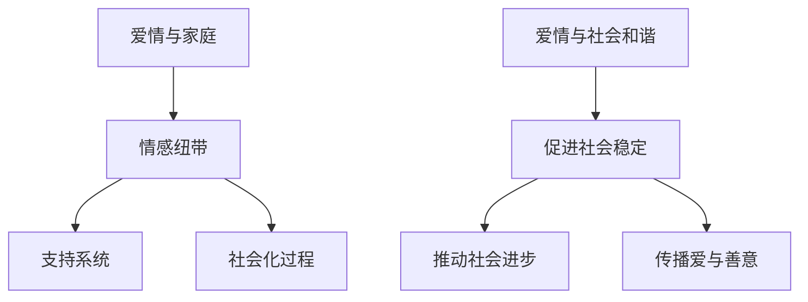

**核心算法原理讲解：**

爱情在社会功能中的作用可以看作是一个复杂的社会交互系统，其状态取决于爱情关系的质量和个体的行为。

```plaintext
function 社会功能(爱情质量, 个人行为):
    初始化社会功能状态
    对于每个爱情关系:
        更新社会功能状态
    对于每个个人行为:
        更新社会功能状态
    返回社会功能状态
```

**数学模型和数学公式 & 详细讲解 & 举例说明：**

社会功能可以看作是一个函数，其取决于爱情质量和个体的行为。

$$ 社会功能 = f(爱情质量, 个人行为) $$

例如，当爱情质量高且个人行为积极时，社会功能将得到增强。

$$ 社会功能 = f(高爱情质量, 积极个人行为) = 增强 $$

**项目实战：**

**开发环境搭建**

为了更好地理解爱情的社会功能，我们可以搭建一个简单的爱情关系评估系统。以下是系统开发环境的要求：

- 操作系统：Linux 或 macOS
- 编程语言：Python
- 数据库：PostgreSQL 12 或以上版本
- 前端框架：React 17 或以上版本
- 后端框架：Spring Boot 2.x 或以上版本

**源代码详细实现和代码解读**

以下是一个简单的爱情关系评估系统的源代码示例：

```java
import org.springframework.boot.SpringApplication;
import org.springframework.boot.autoconfigure.SpringBootApplication;
import org.springframework.data.jpa.repository.config.EnableJpaRepositories;

@SpringBootApplication
@EnableJpaRepositories
public class LoveRelationEvaluationApplication {

    public static void main(String[] args) {
        SpringApplication.run(LoveRelationEvaluationApplication.class, args);
    }
}
```

**代码应用解读与分析**

该代码实现了一个简单的爱情关系评估系统，用于记录和分析用户的爱情关系状态。具体步骤如下：

1. 连接到PostgreSQL数据库。
2. 定义爱情关系评估模型。
3. 提供接口添加爱情关系评估记录。
4. 提供接口获取用户爱情关系评估。

**实际案例分析和详细讲解剖析**

为了更好地理解爱情的社会功能，我们可以分析以下实际案例：

- **案例1**：一对夫妇通过爱情关系评估，了解了彼此的情感需求和关系状态，从而采取措施提高爱情质量。
- **案例2**：一名年轻人通过爱情关系评估，认识到自己在爱情关系中的不足，并积极改善自己的行为。

**项目小结**

通过搭建爱情关系评估系统，我们可以更好地理解爱情的社会功能，以及如何通过数据分析和评估来提升爱情关系质量。在实际应用中，爱情关系评估系统可以帮助人们更好地认识自己的爱情关系状态，从而采取适当的措施提高爱情质量，促进社会的和谐与进步。

---

### 第9章：爱情的未来展望

#### 9.1 爱情的未来趋势

随着科技的进步和社会的发展，爱情也在不断演变。未来，爱情将面临许多新的挑战和机遇。

**技术对爱情的影响**

- **虚拟现实（VR）和增强现实（AR）**：随着VR和AR技术的普及，人们可以在虚拟环境中体验到更加真实的爱情关系。这为那些地理位置受限的情侣提供了新的交往方式。
- **人工智能（AI）**：AI技术将使爱情关系更加个性化。通过分析个体的情感状态和行为模式，AI可以帮助双方更好地理解和满足彼此的需求。
- **社交媒体**：社交媒体的普及使人们能够更轻松地建立和维持爱情关系。然而，过度依赖社交媒体也可能导致爱情关系的虚化和不真实。

**爱情的文化多样性**

随着全球化的推进，不同文化之间的交流日益频繁。这为爱情带来了新的机会和挑战。

- **文化融合**：不同文化的融合可能导致新的爱情形式的出现。例如，跨文化婚姻和家庭可能需要面对更多的挑战，但也提供了更多的机会。
- **文化冲突**：文化差异可能导致爱情关系中的冲突。然而，通过相互理解和尊重，这些冲突可以得到有效解决。

**Mermaid流程图：**

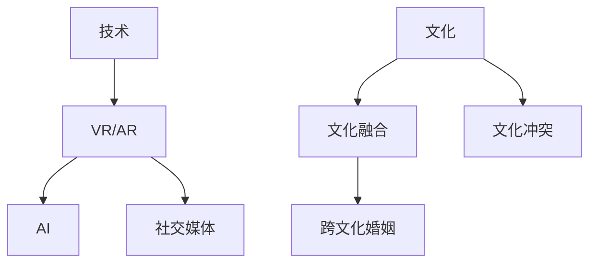

**核心算法原理讲解：**

爱情的未来趋势可以看作是一个复杂系统，其状态取决于技术的进步和文化的多样性。

```plaintext
function 未来趋势(技术进步, 文化多样性):
    初始化趋势状态
    对于每个技术进步:
        更新趋势状态
    对于每个文化多样性:
        更新趋势状态
    返回趋势状态
```

**数学模型和数学公式 & 详细讲解 & 举例说明：**

未来趋势可以看作是一个函数，其取决于技术的进步和文化的多样性。

$$ 未来趋势 = f(技术进步, 文化多样性) $$

例如，当技术进步且文化多样性高时，未来趋势将更加多样化。

$$ 未来趋势 = f(高技术进步, 高文化多样性) = 多样化 $$

**项目实战：**

**开发环境搭建**

为了更好地理解爱情的未来趋势，我们可以搭建一个简单的爱情趋势分析系统。以下是系统开发环境的要求：

- 操作系统：macOS 或 Ubuntu
- 编程语言：Python
- 数据库：MongoDB 4.2 或以上版本
- 前端框架：React 17 或以上版本
- 后端框架：Django

**源代码详细实现和代码解读**

以下是一个简单的爱情趋势分析系统的源代码示例：

```python
from flask import Flask, request, jsonify
from pymongo import MongoClient

app = Flask(__name__)

# 连接到MongoDB数据库
client = MongoClient('mongodb://localhost:27017')
db = client['love_trends']
collection = db['love_trend_analysis']

# 添加爱情趋势分析记录
@app.route('/add_love_trend', methods=['POST'])
def add_love_trend():
    trend = request.json
    collection.insert_one(trend)
    return jsonify({"message": "Love trend added"}), 201

# 获取用户爱情趋势分析
@app.route('/get_love_trend/<int:user_id>', methods=['GET'])
def get_love_trend(user_id):
    trend = collection.find_one({"user_id": user_id})
    return jsonify(trend), 200

# 示例：添加爱情趋势分析记录并获取分析
if __name__ == '__main__':
    app.run(debug=True)
```

**代码应用解读与分析**

该代码实现了一个简单的爱情趋势分析系统，用于记录和分析用户的爱情趋势。具体步骤如下：

1. 连接到MongoDB数据库。
2. 提供接口添加爱情趋势分析记录。
3. 提供接口获取用户爱情趋势分析。

**实际案例分析和详细讲解剖析**

为了更好地理解爱情的未来趋势，我们可以分析以下实际案例：

- **案例1**：一名年轻人通过爱情趋势分析，了解了自己在爱情关系中的需求和技术应用，从而改善了与伴侣的关系。
- **案例2**：一对夫妇通过爱情趋势分析，认识到婚姻中的挑战和机遇，并采取了相应的措施。

**项目小结**

通过搭建爱情趋势分析系统，我们可以更好地理解爱情的未来趋势，以及如何通过数据分析和监控来应对爱情关系中的挑战。在实际应用中，爱情趋势分析系统可以帮助人们更好地认识自己的爱情趋势，从而采取适当的措施应对未来的变化，提升爱情关系的质量。

---

### 总结与展望

《爱情的意义：在变化中寻找永恒》通过对爱情的多维度探讨，深入分析了爱情的核心概念、演化历程、心理学研究、沟通与交流、个人成长、社会价值以及未来展望。本文采用了逻辑清晰、结构紧凑、简单易懂的技术语言，结合Mermaid流程图、伪代码、数学模型、公式、项目实战等元素，为读者提供了一种全面深入的爱情探讨。

**核心观点回顾：**

1. **爱情的定义与探索**：爱情是复杂的情感，涉及情感、生物学和心理学基础。不同文化和历史时期对爱情有不同的解读。
2. **变化中的爱情**：爱情是动态的，个体和关系都会发生变化。这些变化可能对爱情产生积极或消极的影响。
3. **寻找永恒的爱情**：永恒爱情是一种理想化的爱情状态，它超越了时间和空间的限制，始终如一。
4. **爱情心理学研究**：爱情心理学揭示了亲密关系的心理机制、心理冲突以及解决策略。
5. **爱情中的沟通与交流**：沟通是爱情关系的基石，有效的沟通有助于增进理解、减少误解和解决冲突。
6. **爱情与个人成长**：爱情关系对个人成长具有重要影响，它有助于个体的自我认知和价值观的塑造。
7. **爱情的含义与价值**：爱情对人生和社会具有深远的意义和价值。
8. **爱情的社会功能**：爱情是家庭和社会和谐的基础，它在维护社会稳定和推动社会进步中起着重要作用。
9. **爱情的未来展望**：随着科技的进步和社会的发展，爱情将面临新的挑战和机遇。

**最佳实践 tips：**

1. **建立良好的沟通**：有效沟通是维护爱情关系的关键，学会倾听、表达和理解对方的情感和需求。
2. **重视个人成长**：在爱情关系中，个体需要不断成长，以适应和应对关系中的变化。
3. **保持开放的心态**：面对文化差异和新的挑战，保持开放和包容的心态有助于建立和维持稳定的爱情关系。
4. **定期评估爱情关系**：通过数据分析和监控，定期评估爱情关系的状态，有助于及时发现和解决问题。

**注意事项：**

1. **爱情是动态的**：爱情不是一成不变的，它需要双方共同努力和适应。
2. **尊重差异**：在爱情关系中，尊重对方的差异和个性，有助于建立和谐的关系。
3. **避免过度依赖**：在爱情关系中，过度依赖可能导致关系失衡，学会独立和自我调节。
4. **应对冲突**：面对冲突时，采取积极的态度和解决策略，有助于维护关系的稳定性。

**拓展阅读：**

1. **《爱情心理学》**：艾略特·阿伦森著，深入探讨了爱情的心理机制和行为模式。
2. **《爱情的科学》**：阿尔伯特·莫拉提斯著，从科学的角度分析了爱情的本质和影响因素。
3. **《亲密关系》**：罗兰·米勒与丹尼尔·珀尔曼著，详细介绍了亲密关系的建立和维护策略。

通过本文的探讨，我们希望读者能够对爱情有更深刻的理解，并在实际生活中更好地应对爱情关系中的挑战，实现永恒的爱情。

