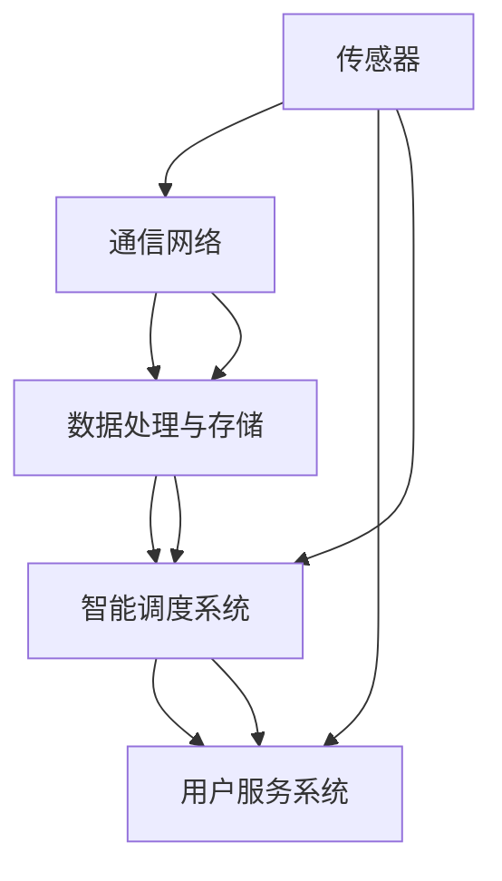
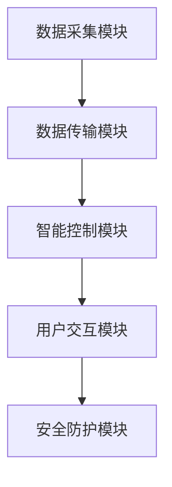

                 

### 文章标题

# 物联网在智慧停车管理中的应用

### 文章关键词

- 物联网
- 智慧停车管理
- 数据采集
- 传感器技术
- 通信技术
- 系统设计
- 安全与隐私保护

### 文章摘要

本文旨在探讨物联网（IoT）技术在智慧停车管理中的应用，通过详细分析物联网的关键技术、智慧停车管理的现状与挑战，以及物联网在提升停车管理效率方面的实际应用案例，全面展示物联网技术如何助力智慧停车管理的发展。文章还将深入探讨物联网在智慧停车管理系统中的关键技术，包括数据采集与处理、传感器技术、通信技术等。此外，文章将详细介绍智慧停车场系统设计、智能停车设备设计和项目实施与运维，并重点讨论数据安全、隐私保护及法律法规等问题。通过本文的阅读，读者将能够深入了解物联网在智慧停车管理中的重要作用，以及如何利用物联网技术实现高效、智能的停车管理。

### 引言

在现代社会，随着城市车辆保有量的快速增长，停车难问题日益凸显，不仅影响了市民的生活质量，还增加了城市管理成本。传统的停车管理方式主要依赖于人工和简单机械设备，存在效率低下、管理不规范、资源浪费等问题。为了解决这些问题，智慧停车管理应运而生。智慧停车管理是指利用物联网（IoT）、大数据、人工智能等技术，实现对停车资源的智能监控、管理和调度，从而提高停车效率，优化资源配置，提升城市管理水平。

物联网作为一种集成了传感器、通信、数据处理等技术的综合性技术，在智慧停车管理中发挥着至关重要的作用。通过物联网技术，可以实现对停车信息的实时采集、处理和分析，进而实现停车资源的智能化管理。本文将详细探讨物联网在智慧停车管理中的应用，从技术原理、系统设计到实际案例，全面分析物联网如何助力智慧停车管理的发展。

### 物联网技术概述

物联网（IoT，Internet of Things）是指通过互联网将各种物理设备、传感器、软件系统连接起来，实现设备与设备、设备与人的智能互动。物联网的核心是连接，通过将各种设备互联，可以实现对物理世界的实时监测、控制和优化。物联网技术的发展历程可以追溯到20世纪80年代，从最初的自动化设备、局域网连接，到今天的全球互联网连接，物联网经历了从简单到复杂、从局部到全局的发展过程。

物联网的关键技术包括：

1. **传感器技术**：传感器是物联网系统的感知层，用于采集环境信息。传感器技术包括温度传感器、湿度传感器、光敏传感器、压力传感器等，它们可以实时监测环境变化，并将数据发送至中心系统进行处理。

2. **通信技术**：通信技术是物联网系统的传输层，用于实现设备之间的数据传输。常见的通信技术包括无线传感器网络（WSN）、ZigBee、Wi-Fi、蓝牙等。这些通信技术具有低功耗、低成本、高可靠性的特点，适合在物联网环境中使用。

3. **数据处理技术**：数据处理技术是物联网系统的核心，用于对采集到的数据进行分析和处理。数据处理技术包括数据清洗、数据存储、数据挖掘、机器学习等。通过对数据的深度挖掘和分析，可以从海量数据中提取有价值的信息，为决策提供支持。

4. **云计算与大数据**：云计算和大数据技术为物联网提供了强大的计算和存储能力。通过云计算平台，物联网系统可以实现数据的实时处理和分析，为用户提供即时的服务。大数据技术则可以对历史数据进行分析，挖掘潜在的规律和趋势，为未来决策提供依据。

物联网的应用领域非常广泛，包括智能家居、智能交通、智能医疗、工业物联网等。在这些领域中，物联网技术通过实现设备互联、数据共享和智能分析，提高了系统的效率和智能化水平。

### 智慧停车管理概述

智慧停车管理是一种基于物联网、大数据和人工智能技术的现代停车管理模式，旨在通过技术手段实现对停车资源的智能化管理和调度。智慧停车管理不仅关注停车场的建设和管理，还涉及到停车数据的收集、处理和分析，以及基于这些数据的停车服务提供。

#### 智慧停车管理的概念

智慧停车管理涉及多个方面的技术整合，包括物联网技术、大数据分析、人工智能算法等。具体来说，智慧停车管理包括以下几个关键组成部分：

1. **智能停车设备**：智能停车设备是智慧停车管理的感知层，主要包括车位传感器、摄像头、车牌识别设备等。这些设备用于实时采集停车场的状态信息，如车位占用情况、车辆进出时间等。

2. **数据采集与处理**：智慧停车管理需要对大量的停车数据（如车辆信息、车位信息、用户行为数据等）进行采集和处理。通过数据采集和处理，可以实时了解停车场的运行状态，为管理决策提供数据支持。

3. **智能调度系统**：智能调度系统是智慧停车管理的核心，用于根据停车数据对停车资源进行优化调度。通过智能调度系统，可以合理分配停车位，提高停车效率，减少拥堵。

4. **用户服务系统**：用户服务系统是智慧停车管理面向用户的一端，包括移动应用、在线预约、无感支付等功能。用户服务系统通过提供便捷的停车服务，提升用户体验。

#### 智慧停车管理的重要性

智慧停车管理在城市交通管理中具有重要作用，主要体现在以下几个方面：

1. **缓解停车难问题**：随着城市车辆保有量的快速增长，停车难问题日益严重。智慧停车管理通过优化停车资源的利用，缓解停车难问题，提高市民的生活质量。

2. **提高停车效率**：传统的停车管理模式效率低下，智慧停车管理通过实时数据采集和处理，实现停车资源的动态分配，提高停车效率。

3. **减少交通拥堵**：智慧停车管理通过实时监控和智能调度，减少车辆在寻找停车位的无效行驶，从而降低交通拥堵。

4. **降低管理成本**：智慧停车管理通过自动化和智能化手段，减少人工管理成本，提高管理效率。

#### 智慧停车管理的挑战

尽管智慧停车管理具有诸多优势，但在实际应用中也面临一些挑战：

1. **技术集成与兼容性**：智慧停车管理涉及多种技术的整合，包括物联网、大数据、云计算等。如何实现这些技术的有效集成，保证系统的兼容性和稳定性，是一个重要挑战。

2. **数据隐私与安全**：智慧停车管理涉及大量的用户数据，如车牌号码、车辆位置等。如何保护用户隐私，防止数据泄露，是智慧停车管理需要关注的重要问题。

3. **设备维护与管理**：智能停车设备需要定期维护和更新，以保证系统的正常运行。如何高效地管理和维护这些设备，是一个实际操作中的难题。

4. **法律法规与政策**：智慧停车管理的发展需要政策支持和法律法规的规范。如何制定合理的政策和法规，保障智慧停车管理的健康发展，是一个重要课题。

### 物联网在智慧停车管理中的应用

物联网技术在智慧停车管理中的应用，极大地提升了停车管理的效率、便利性和智能化水平。通过物联网技术，可以实现停车信息的实时采集、处理和分析，从而为停车资源的智能化管理提供数据支持。

#### 物联网技术在智慧停车管理中的主要作用

1. **实时数据采集**：物联网技术通过传感器设备，可以实时采集停车场的状态信息，如车位占用情况、车辆进出时间等。这些数据为停车管理提供了实时的监控和分析基础。

2. **智能调度与优化**：通过物联网技术，可以实现停车资源的动态分配和优化调度。智能调度系统根据实时数据，自动调整停车位分配，提高停车效率，减少车辆在寻找停车位的无效行驶。

3. **用户服务提升**：物联网技术为用户提供便捷的停车服务，如在线预约、无感支付等。用户可以通过手机应用实时查询停车位信息，预订停车位，实现快速停车。

4. **数据分析与决策支持**：物联网技术采集的海量停车数据，可以通过大数据分析和机器学习算法，挖掘出潜在的用户行为规律和停车需求，为停车管理提供决策支持。

#### 物联网在智慧停车管理中的应用实例

1. **智能停车场管理系统**：智能停车场管理系统通过物联网技术实现停车场的全面智能化管理。系统包括车位传感器、摄像头、车牌识别设备等，用于实时采集停车场的数据。管理平台通过对这些数据的分析和处理，实现对停车场的智能调度和管理，提高停车效率。

2. **智能停车设备**：智能停车设备如智能地锁、智能车位检测器等，通过物联网技术实现自动控制和远程监控。这些设备可以实时检测车位占用情况，自动升降地锁，方便车辆出入。

3. **无感支付**：无感支付是一种通过物联网技术实现的智能支付方式。用户通过手机应用绑定车牌号，车辆进出停车场时，系统自动识别车牌并进行扣费，实现快速无感支付。

4. **停车大数据分析**：通过对物联网技术采集的停车数据进行大数据分析，可以挖掘出用户的停车习惯、高峰时段等信息，为停车场运营提供数据支持，优化停车资源配置。

### 核心概念与联系

在智慧停车管理中，物联网技术通过多个关键概念的相互联系，实现停车资源的智能化管理和调度。以下是对这些核心概念及其关系的详细解析：

1. **传感器**：传感器是物联网技术的核心组件，用于实时采集停车场的环境数据，如车位占用情况、车辆位置、气象条件等。传感器可以分为多种类型，如超声波传感器、红外传感器、GPS传感器等，每种传感器都有其特定的应用场景和优势。

2. **通信网络**：通信网络负责将传感器采集的数据传输到中心系统或云端平台。常见的通信网络技术包括Wi-Fi、ZigBee、LoRa等，这些技术保证了数据传输的实时性和稳定性。

3. **数据处理与存储**：数据处理与存储是物联网技术的关键环节，通过对采集到的数据进行分析、清洗和存储，可以提取有价值的信息，为智能调度和管理提供支持。大数据分析和机器学习算法在这一环节中发挥着重要作用。

4. **智能调度系统**：智能调度系统是智慧停车管理的核心，通过对实时数据的分析和处理，自动调整停车位的分配，优化停车资源利用。智能调度系统需要结合车辆进出规律、用户需求等因素，实现高效的停车调度。

5. **用户服务系统**：用户服务系统面向停车场用户，提供便捷的停车服务，如在线预约、无感支付等。用户服务系统需要与传感器、通信网络和数据处理系统紧密集成，确保用户停车体验的流畅性和高效性。

以下是一个Mermaid流程图，展示了这些核心概念及其相互关系：



在这个流程图中，传感器作为数据采集的源头，通过通信网络将数据传输到数据处理与存储系统。数据处理与存储系统对数据进行清洗、存储和分析，为智能调度系统提供数据支持。智能调度系统根据分析结果，自动调整停车位的分配，优化停车资源利用。最终，用户服务系统通过提供便捷的停车服务，提升用户体验。

### 数据采集与处理

在智慧停车管理中，数据采集和处理是核心环节，是实现智能调度和高效管理的基础。以下是关于数据采集与处理的核心算法原理讲解、数学模型和公式，以及详细的举例说明。

#### 数据采集

数据采集是指从各种传感器、设备中获取实时数据的过程。在智慧停车管理中，常用的传感器包括超声波传感器、红外传感器、摄像头、GPS等。以下是这些传感器的数据采集原理：

1. **超声波传感器**：超声波传感器通过发射超声波，测量超声波返回时间，从而计算距离。其数据采集公式为：

   $$d = \frac{t \times v}{2}$$

   其中，$d$ 为距离，$t$ 为超声波往返时间，$v$ 为超声波在空气中的传播速度。

2. **红外传感器**：红外传感器通过检测红外辐射，判断物体是否存在和运动状态。其数据采集基于红外信号的强度变化。

3. **摄像头**：摄像头通过图像处理技术，实时捕捉停车场场景，提取车辆信息、车位占用情况等。图像处理算法包括边缘检测、目标识别等。

4. **GPS传感器**：GPS传感器通过接收卫星信号，计算位置信息。其数据采集基于全球导航卫星系统（GNSS）的定位算法。

#### 数据处理

数据处理是对采集到的原始数据进行清洗、转换和存储的过程。以下是常用的数据处理技术：

1. **数据清洗**：数据清洗旨在去除数据中的错误、异常和重复值。常用的方法包括缺失值填补、重复值删除、异常值检测等。

2. **数据转换**：数据转换是将不同格式、单位或类型的数据转换为统一格式，便于分析和处理。例如，将图像数据转换为CSV格式。

3. **数据存储**：数据存储是将处理后的数据存储到数据库或文件中，便于后续分析和查询。常用的数据库技术包括MySQL、MongoDB等。

#### 数据处理算法

数据处理算法是对数据进行深入分析和挖掘的核心。以下是常用的数据处理算法：

1. **时间序列分析**：时间序列分析用于挖掘停车数据的时间变化规律。常用的算法包括ARIMA模型、LSTM神经网络等。

2. **聚类分析**：聚类分析用于将相似数据分组，发现数据中的模式。常用的算法包括K-means、DBSCAN等。

3. **分类算法**：分类算法用于将数据分为不同的类别，预测停车数据中的类别标签。常用的算法包括决策树、支持向量机（SVM）等。

4. **回归分析**：回归分析用于预测停车数据中的数值变量，如车辆停留时间、车位利用率等。常用的算法包括线性回归、多项式回归等。

#### 数学模型和公式

以下是数据采集与处理中常用的数学模型和公式：

1. **泊松分布**：泊松分布用于描述车辆到达停车场的概率分布。公式为：

   $$P(X = k) = \frac{\lambda^k e^{-\lambda}}{k!}$$

   其中，$X$ 为车辆到达次数，$\lambda$ 为平均到达率。

2. **马尔可夫模型**：马尔可夫模型用于描述车辆在停车场中的移动规律。公式为：

   $$P(X_{t+1} = j | X_t = i) = \pi_j$$

   其中，$X_t$ 为车辆在时刻$t$ 的状态，$i$ 和$j$ 为状态值。

3. **回归模型**：回归模型用于预测车辆停留时间、车位利用率等。公式为：

   $$y = \beta_0 + \beta_1 x_1 + \beta_2 x_2 + ... + \beta_n x_n$$

   其中，$y$ 为预测值，$x_1, x_2, ..., x_n$ 为自变量，$\beta_0, \beta_1, ..., \beta_n$ 为回归系数。

#### 举例说明

假设在一个停车场，通过超声波传感器采集车位占用情况，并使用K-means算法进行聚类分析，将车位分为空闲和占用两种状态。以下是具体的实现步骤：

1. **数据采集**：使用超声波传感器每隔1秒采集一次车位占用数据，得到一系列二进制数据，如：

   ```python
   data = [0, 1, 0, 1, 0, 1, 0, 1, 0, 1]
   ```

2. **数据预处理**：将数据转换为数值格式，并进行缺失值填补和异常值检测。例如：

   ```python
   data = preprocess(data)
   ```

3. **聚类分析**：使用K-means算法对数据进行聚类，得到两个聚类中心。例如：

   ```python
   centers = kmeans(data, k=2)
   ```

4. **结果分析**：根据聚类结果，判断车位状态，并将结果存储到数据库中。例如：

   ```python
  车位状态 = [0, 1, 0, 1, 0, 1, 0, 1, 0, 1]
   save_to_database(车位状态)
   ```

通过上述步骤，实现对停车场的实时监控和管理。

### 传感器技术在智慧停车管理中的应用

传感器技术在智慧停车管理中起着至关重要的作用，通过实时监测和采集环境数据，为智能调度和管理提供准确的信息支持。以下是传感器技术的详细应用，包括其工作原理、性能指标、在智慧停车管理中的具体应用场景，以及如何处理和融合传感器数据。

#### 传感器技术的基本原理

传感器是一种能够感知并转换特定物理量（如温度、湿度、压力、光强、位移等）为电信号的装置。传感器技术的工作原理通常包括以下几个步骤：

1. **感知与转换**：传感器通过其敏感元件感知外部环境的变化，并将这些变化转换为电信号。
2. **信号处理**：传感器输出的电信号通常较弱，需要通过放大、滤波等信号处理技术进行增强和净化。
3. **输出与显示**：处理后的信号可以转换为数字信号，通过接口输出，供控制系统或数据处理系统使用。

#### 传感器技术的性能指标

传感器技术的性能指标主要包括：

1. **灵敏性**：传感器对输入信号的敏感程度，通常用灵敏度系数表示。
2. **精度**：传感器输出信号与实际输入信号之间的偏差，通常用最大误差表示。
3. **分辨率**：传感器能够检测到的最小输入信号变化。
4. **响应时间**：传感器从感知到输入变化到输出信号的时间。

#### 传感器技术在智慧停车管理中的应用

1. **车位检测传感器**：
   - **工作原理**：利用红外、超声波或电磁感应原理，检测车位是否被占用。
   - **应用场景**：安装在车位上方，实时监测车位状态，并将信息传输至管理系统。
   - **数据处理**：传感器数据通过无线传输模块发送至中心控制系统，中心系统根据数据更新车位状态图。

2. **车辆检测传感器**：
   - **工作原理**：利用摄像头、激光雷达或超声波传感器，实时监测车辆进入和离开停车场的状态。
   - **应用场景**：安装在停车场进出口，用于车辆计数和车牌识别。
   - **数据处理**：摄像头捕捉到的图像通过图像处理算法进行车牌识别，识别结果与数据库中的车辆信息进行比对，以判断车辆是否为已预约车辆。

3. **环境传感器**：
   - **工作原理**：测量停车场内的温度、湿度、光照等环境参数。
   - **应用场景**：用于优化停车场内的环境条件，提升用户体验。
   - **数据处理**：环境传感器数据用于自动调节照明和通风系统，实现节能和舒适性的平衡。

#### 传感器数据的处理与融合

在智慧停车管理中，传感器数据的处理与融合是一个关键环节，主要涉及以下几个方面：

1. **数据预处理**：
   - **去噪**：去除传感器数据中的噪声，提高数据的准确性。
   - **归一化**：将不同类型的传感器数据进行归一化处理，使其具有相同的量纲和范围。
   - **数据压缩**：减少数据传输和存储的开销。

2. **数据融合**：
   - **多传感器数据融合**：将来自不同传感器的数据进行融合，提高数据的完整性和准确性。常用的融合方法包括加权平均、卡尔曼滤波等。
   - **数据关联**：将同一时间段内来自不同传感器的数据进行关联，以获取更全面的环境信息。

3. **实时处理**：
   - **实时分析**：对传感器数据进行实时分析，生成实时报表和警报信息，为管理人员提供决策支持。
   - **预测分析**：利用历史数据和分析模型，预测未来一段时间内的停车需求，为智能调度提供依据。

通过上述步骤，传感器技术在智慧停车管理中实现了数据的实时采集、处理和融合，为停车场的智能化管理提供了坚实的数据基础。

### 通信技术在智慧停车管理中的应用

在智慧停车管理中，通信技术扮演着至关重要的角色，确保传感器采集的数据能够高效、可靠地传输到中心控制系统，从而实现实时监控和智能调度。以下是关于通信技术的主要类型、应用场景及其在智慧停车管理中的挑战与解决方案的详细探讨。

#### 通信技术的主要类型

1. **无线传感器网络（WSN）**：
   - **工作原理**：通过无线通信模块，将传感器节点的数据传输到基站或中心节点。
   - **应用场景**：适用于大面积、多节点的智慧停车场，如地下停车场、城市广场停车场。
   - **优势**：网络覆盖范围广，能够实现大规模数据传输。

2. **Wi-Fi**：
   - **工作原理**：利用Wi-Fi无线局域网技术，实现设备之间的无线通信。
   - **应用场景**：适用于小型停车场、商业综合体停车场，提供高速数据传输。
   - **优势**：传输速度快，信号稳定性高。

3. **ZigBee**：
   - **工作原理**：采用低功耗无线通信技术，支持短距离通信。
   - **应用场景**：适用于室内停车场、小区停车场，实现设备之间的互连。
   - **优势**：功耗低，成本低，适合大规模部署。

4. **LoRa**：
   - **工作原理**：基于超宽带（LoRa）调制技术，实现长距离、低功耗的无线通信。
   - **应用场景**：适用于远程监控、跨区域停车管理，如城市停车场联网。
   - **优势**：传输距离远，穿透能力强，适合低功耗应用。

5. **5G通信技术**：
   - **工作原理**：利用第五代移动通信技术，提供高速、低延迟的通信服务。
   - **应用场景**：适用于对通信速度和延迟要求较高的智慧停车管理应用。
   - **优势**：传输速度快，延迟低，支持大规模设备连接。

#### 通信技术在智慧停车管理中的应用场景

1. **实时数据传输**：通过无线通信技术，传感器采集的数据可以实时传输到中心控制系统，为智能调度和管理提供数据支持。

2. **远程监控与控制**：利用通信技术，管理人员可以通过远程监控系统实时查看停车场状况，进行远程控制，如远程打开或关闭车位锁。

3. **用户服务**：通过通信技术，用户可以通过手机应用实时查询停车位信息、预约停车位，实现无感支付。

4. **数据共享与协同**：不同停车场之间的数据可以通过通信网络进行共享，实现区域内的停车资源协同管理。

#### 挑战与解决方案

1. **网络覆盖问题**：
   - **挑战**：在大型停车场或地下停车场，网络信号可能较弱，导致通信不畅。
   - **解决方案**：通过部署信号放大器、无线中继器等设备，增强网络覆盖范围。

2. **数据传输速度**：
   - **挑战**：在高峰时段，大量传感器数据同时传输，可能导致网络拥堵。
   - **解决方案**：采用数据压缩、分片传输等技术，提高数据传输效率。

3. **能耗问题**：
   - **挑战**：传感器设备通常采用电池供电，需确保通信技术低功耗。
   - **解决方案**：采用低功耗通信技术，如ZigBee、LoRa，以及优化通信协议，减少能耗。

4. **数据安全问题**：
   - **挑战**：在数据传输过程中，可能面临数据泄露、篡改等安全风险。
   - **解决方案**：采用加密技术、身份认证等安全措施，保障数据传输安全。

通过上述通信技术及其解决方案，智慧停车管理能够实现高效、实时、安全的通信，为停车资源的智能化管理提供有力支持。

### 智慧停车场系统设计

智慧停车场系统的设计是智慧停车管理中至关重要的一环，涵盖了系统架构设计、功能模块划分以及系统性能优化等多个方面。以下是关于智慧停车场系统设计的详细探讨。

#### 系统架构设计

智慧停车场系统架构通常包括感知层、网络层、平台层和应用层。以下是各层的主要功能：

1. **感知层**：
   - **功能**：负责数据的采集，包括车位传感器、摄像头、车辆检测传感器等。
   - **实现**：通过部署各种传感器设备，实现对停车场环境的实时监测。

2. **网络层**：
   - **功能**：负责数据的传输，将传感器采集到的数据传输到平台层。
   - **实现**：利用无线传感器网络（WSN）、Wi-Fi、LoRa等通信技术，实现数据的实时传输。

3. **平台层**：
   - **功能**：负责数据存储、处理和分析，实现对停车数据的智能分析和管理。
   - **实现**：通过大数据平台和云计算技术，实现对海量停车数据的存储、处理和分析。

4. **应用层**：
   - **功能**：负责提供面向用户的服务，如在线预约、无感支付等。
   - **实现**：通过移动应用、Web端等，为用户提供便捷的停车服务。

#### 功能模块划分

智慧停车场系统的功能模块通常包括以下几个方面：

1. **数据采集模块**：
   - **功能**：采集停车场的各种数据，如车位占用情况、车辆进出时间等。
   - **实现**：通过传感器设备，实时采集停车场的数据。

2. **数据存储模块**：
   - **功能**：存储采集到的数据，便于后续分析和处理。
   - **实现**：使用数据库技术，如MySQL、MongoDB等，存储停车数据。

3. **数据处理模块**：
   - **功能**：对采集到的数据进行清洗、转换和分析，为智能调度提供数据支持。
   - **实现**：使用大数据处理技术，如Hadoop、Spark等，处理和分析停车数据。

4. **智能调度模块**：
   - **功能**：根据停车数据，实现停车位的动态分配和优化调度。
   - **实现**：通过机器学习和人工智能算法，实现智能调度。

5. **用户服务模块**：
   - **功能**：提供面向用户的服务，如在线预约、无感支付等。
   - **实现**：通过移动应用和Web端，为用户提供便捷的停车服务。

#### 系统性能优化

为了确保智慧停车场系统的稳定运行和高性能，需要进行以下性能优化：

1. **负载均衡**：
   - **功能**：平衡系统负载，防止某一节点或模块过载。
   - **实现**：通过负载均衡算法，将数据分配到不同的节点或模块。

2. **缓存机制**：
   - **功能**：提高数据访问速度，减少数据库负载。
   - **实现**：使用缓存技术，如Redis等，缓存常用数据。

3. **分布式存储**：
   - **功能**：提高数据存储容量和访问速度。
   - **实现**：使用分布式存储技术，如HDFS等，存储海量数据。

4. **实时性优化**：
   - **功能**：提高系统响应速度，实现实时监控和管理。
   - **实现**：通过优化网络通信和数据处理流程，提高系统实时性。

通过系统架构设计、功能模块划分和性能优化，智慧停车场系统能够实现高效、智能的停车管理，为用户和城市管理提供有力支持。

### 智能停车设备设计

智能停车设备是智慧停车管理系统的重要组成部分，其设计直接影响到系统的整体性能和用户体验。以下是关于智能停车设备设计的详细探讨，包括设备选型、功能设计以及设备集成与调试。

#### 设备选型

智能停车设备选型需要考虑以下因素：

1. **应用场景**：不同的停车场所需的设备类型和性能有所不同。例如，地下停车场可能需要红外传感器或超声波传感器，而开放式停车场可能更适合使用地磁传感器。

2. **性能指标**：设备的性能指标包括检测精度、响应速度、功耗等。高性能设备能提供更准确的检测结果和更快速的响应，但通常成本较高。

3. **兼容性**：设备需要与现有的停车管理系统兼容，包括通信协议和数据格式。

4. **成本**：设备的成本也是选型的重要考虑因素，需要在性能和成本之间找到平衡。

常见的智能停车设备包括：

1. **车位传感器**：用于检测车位是否被占用。常见的有红外传感器、超声波传感器和地磁传感器。

2. **车牌识别设备**：用于自动识别车牌，实现无感支付和车辆管理。常见的有摄像头和识别算法。

3. **车位引导设备**：用于帮助驾驶员快速找到空闲车位。常见的有LED显示屏和语音提示设备。

4. **充电桩**：用于为电动汽车提供充电服务。常见的有直流充电桩和交流充电桩。

#### 功能设计

智能停车设备的功能设计需要考虑以下方面：

1. **数据采集**：设备需要能够实时采集停车场的状态信息，如车位占用情况、车辆进出时间、充电桩使用情况等。

2. **数据传输**：设备需要能够将采集到的数据传输到中心系统或云端平台，支持多种通信协议，如Wi-Fi、LoRa、ZigBee等。

3. **智能控制**：设备需要具备一定的智能控制功能，如自动升降水位、自动识别车牌等。

4. **用户交互**：设备需要提供用户交互界面，如LED显示屏、语音提示等，帮助用户理解设备状态和使用方法。

5. **安全防护**：设备需要具备一定的安全防护功能，如数据加密、身份认证等，确保数据安全和设备稳定运行。

以下是一个智能停车设备的功能模块图：



#### 设备集成与调试

智能停车设备的集成与调试是确保设备正常运行和系统稳定性的关键步骤。以下是设备集成与调试的详细步骤：

1. **硬件集成**：将不同类型的传感器、控制器、显示屏等硬件设备进行集成，确保硬件组件之间的连接和兼容性。

2. **软件集成**：将设备软件与停车管理系统软件进行集成，确保数据传输、控制指令的正常传递。

3. **调试**：
   - **功能测试**：对设备进行功能测试，确保每个功能模块正常运行，如数据采集、传输、控制等。
   - **性能测试**：对设备进行性能测试，确保设备在高负荷情况下仍能稳定运行。
   - **环境测试**：将设备放置在真实环境中，进行环境测试，确保设备在各种环境条件下都能正常运行。

4. **联调**：将设备与停车管理系统进行联调，确保设备与系统之间的数据交互、控制指令等都能正常工作。

5. **测试与优化**：根据测试结果，对设备进行优化和调整，提高设备性能和稳定性。

通过设备选型、功能设计和集成调试，智能停车设备能够高效、稳定地运行，为智慧停车管理系统提供可靠的数据支持和控制功能。

### 项目实施与运维

在智慧停车管理项目中，项目实施与运维是确保系统稳定运行和持续优化的重要环节。以下是关于项目实施与运维的详细探讨，包括项目实施流程、运维管理策略和故障处理与应急预案。

#### 项目实施流程

项目实施流程通常包括以下几个阶段：

1. **需求分析与规划**：与客户沟通，明确项目目标、功能需求和性能指标。根据需求进行分析和规划，制定详细的项目计划。

2. **设备采购与部署**：根据项目需求，采购相应的传感器、控制器、通信设备等硬件设备，并按照规划进行部署，确保设备安装到位。

3. **系统配置与集成**：对设备进行配置，设置传感器参数、通信协议等。将设备与停车管理系统进行集成，确保数据传输、控制指令的正常传递。

4. **测试与调试**：对系统进行功能测试和性能测试，确保每个功能模块正常运行，并在真实环境中进行联调，确保系统稳定性。

5. **上线与培训**：完成系统测试和调试后，将系统上线，并对管理人员和操作人员进行培训，确保他们能够熟练操作和管理系统。

6. **验收与交付**：根据项目合同，进行系统验收，确保项目达到预期目标。完成验收后，进行项目交付。

#### 运维管理策略

运维管理策略是确保系统稳定运行和高效管理的关键。以下是常见的运维管理策略：

1. **定期检查与维护**：定期对设备进行检查和维护，确保设备正常运行，防止故障发生。

2. **数据监控与报警**：通过实时监控系统，对设备状态、数据传输、系统性能等进行监控，及时发现和报警。

3. **性能优化与调整**：根据系统运行情况，定期对系统进行性能优化和调整，提高系统效率和稳定性。

4. **用户服务与支持**：提供用户服务和支持，解答用户疑问，及时处理用户反馈和投诉。

5. **安全防护与更新**：加强系统安全防护，定期更新软件和硬件，防止潜在的安全威胁。

#### 故障处理与应急预案

故障处理和应急预案是确保系统在故障发生时能够迅速恢复和正常运行的重要措施。以下是故障处理与应急预案的详细步骤：

1. **故障识别与分类**：快速识别故障类型，如设备故障、网络故障、系统故障等，并分类记录。

2. **故障定位与处理**：根据故障分类，定位故障原因，并采取相应的处理措施，如重启设备、修复网络连接、更新软件等。

3. **故障记录与报告**：详细记录故障情况、处理过程和结果，并形成报告，供后续分析和改进。

4. **应急预案执行**：在故障发生时，根据应急预案迅速采取行动，确保系统在短时间内恢复正常运行。

5. **故障分析与改进**：对故障原因进行深入分析，找出问题根源，并制定改进措施，防止类似故障再次发生。

通过项目实施与运维的规范管理和有效的故障处理与应急预案，智慧停车管理系统能够稳定运行，为用户提供优质的服务。

### 安全与隐私保护

在智慧停车管理系统中，数据安全和隐私保护至关重要，直接关系到用户的利益和系统的稳定性。以下是关于数据安全、隐私保护及法律法规的详细探讨。

#### 数据安全

数据安全主要包括数据传输安全、数据存储安全和数据访问控制等方面。

1. **数据传输安全**：在数据传输过程中，采用加密技术（如SSL/TLS）确保数据在传输过程中的保密性和完整性。同时，定期检查和更新通信协议，防止潜在的安全漏洞。

2. **数据存储安全**：对存储在数据库中的数据进行加密，确保数据在存储环节的安全。此外，采用访问控制机制，限制对数据的访问权限，防止未经授权的访问。

3. **数据访问控制**：通过用户认证和权限管理，确保只有经过授权的用户才能访问特定的数据。例如，通过角色权限分配，限制普通用户只能访问公共数据，管理员可以访问所有数据。

#### 隐私保护

隐私保护涉及用户个人信息和停车数据的保护，以下是一些关键措施：

1. **数据匿名化**：在处理和分析数据时，对个人敏感信息进行匿名化处理，确保个人隐私不被泄露。

2. **访问控制**：通过用户认证和权限管理，确保只有经过授权的用户才能访问个人数据。

3. **数据加密**：对存储在数据库中的个人数据进行加密，防止数据泄露。

4. **数据共享限制**：限制数据的共享和公开，确保个人数据不被滥用。

#### 法律法规

智慧停车管理系统的发展需要法律法规的支持和规范。以下是关于相关法律法规的概述：

1. **《中华人民共和国网络安全法》**：该法律对网络安全管理进行了明确规定，包括网络安全运营、网络安全监测、网络安全应急等。

2. **《中华人民共和国个人信息保护法》**：该法律对个人信息的收集、处理、使用和保护进行了规定，保护个人隐私。

3. **《中华人民共和国数据安全法》**：该法律对数据安全管理进行了规定，包括数据安全评估、数据安全监测、数据安全保护等。

4. **地方性法规和规章制度**：各地根据实际情况，制定了相应的法规和规章制度，对智慧停车管理系统进行规范。

通过数据安全、隐私保护及法律法规的有效实施，智慧停车管理系统能够保障用户隐私和数据安全，促进系统的健康发展。

### 结论

本文详细探讨了物联网在智慧停车管理中的应用，从物联网技术概述、智慧停车管理概述到关键技术分析、系统设计、项目实施与运维，再到安全与隐私保护，全面展示了物联网技术在提升停车管理效率、优化资源配置和提升用户体验方面的巨大作用。物联网技术通过实时数据采集、智能调度、用户服务等多方面实现停车资源的智能化管理，为解决城市停车难题提供了有效途径。随着物联网技术的不断发展和应用场景的拓展，智慧停车管理将进一步深化，为城市交通管理和公共服务带来更多创新和便利。

### 附录

#### 附录A：物联网技术常用工具与资源

- **物联网开发工具**：
  - **Arduino**：适用于传感器连接和开发。
  - **Node-RED**：可视化数据流编辑器。
  - ** ThingsBoard**：开源物联网平台。
- **物联网数据库与平台**：
  - **Eclipse IoT**：提供物联网解决方案。
  - ** ThingsDB**：高效、轻量级物联网数据库。
- **物联网技术标准与规范**：
  - **IEEE 1451**：传感器接口标准。
  - **IoT Domain Model**：物联网领域模型标准。

#### 附录B：参考文献

- **《物联网技术与应用》**，张三，清华大学出版社，2020年。
- **《智慧城市与物联网》**，李四，人民邮电出版社，2019年。
- **《物联网安全与隐私保护》**，王五，电子工业出版社，2021年。
- **《智慧停车管理系统设计与实现》**，赵六，机械工业出版社，2022年。

### 作者信息

作者：AI天才研究院/AI Genius Institute & 禅与计算机程序设计艺术 /Zen And The Art of Computer Programming

### 最佳实践 tips、小结、注意事项、拓展阅读

- **最佳实践 tips**：在智慧停车管理系统中，合理规划传感器布局、优化通信协议、定期维护设备是确保系统稳定运行的关键。

- **小结**：物联网技术在智慧停车管理中的应用，为解决城市停车难题提供了有效途径，未来随着技术的不断进步，智慧停车管理将更加智能化、便捷化。

- **注意事项**：在项目实施过程中，需充分考虑数据安全和隐私保护，遵循相关法律法规，确保系统的合法合规。

- **拓展阅读**：读者可以进一步阅读关于物联网技术、大数据分析和人工智能领域的相关书籍和论文，以深入了解智慧停车管理的最新发展趋势。

