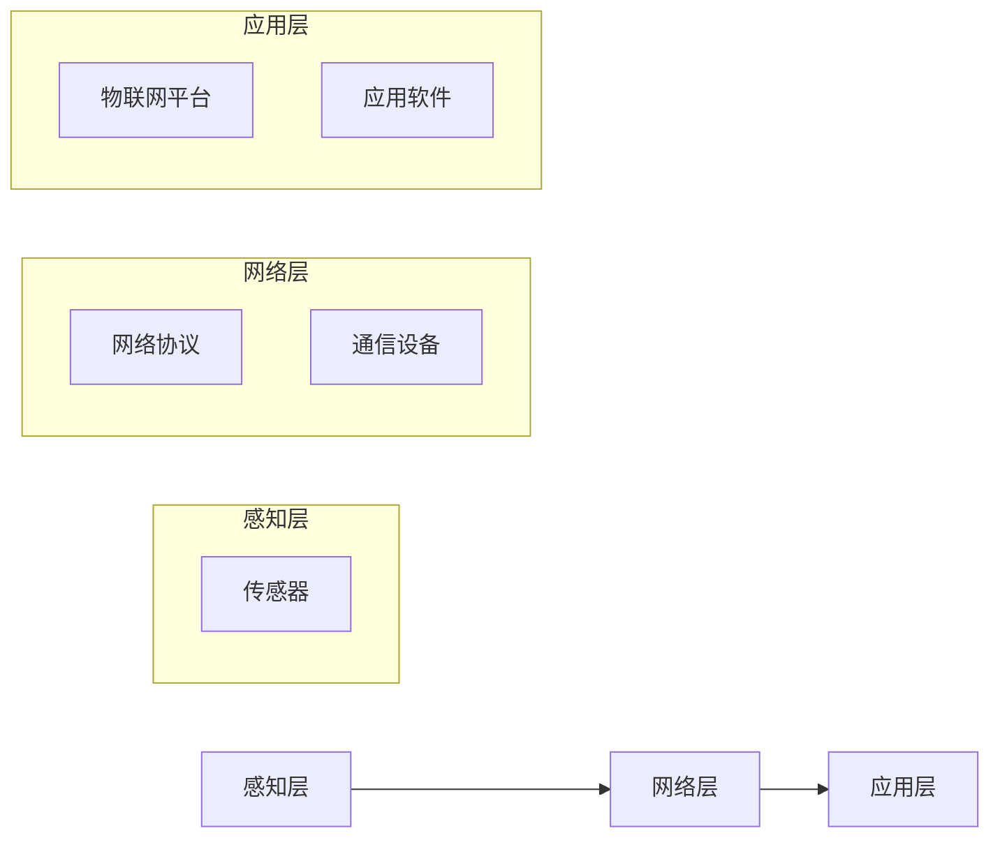

                 

### 文章标题：物联网在智慧养老监护中的全面应用

物联网（Internet of Things，简称IoT）作为当前技术发展的重要方向，已经深刻地改变了我们的生活方式。在智慧养老监护领域，物联网的应用尤为显著，它通过整合各种传感器、网络通信和数据处理技术，为老年人提供了更加便捷、安全、智能的养老服务。本文将深入探讨物联网在智慧养老监护中的全面应用，旨在为读者提供一份系统、详尽的技术分析。

### 关键词

- 物联网（IoT）
- 智慧养老监护
- 传感器技术
- 数据采集与传输
- 智能分析与应用
- 物联网安全

### 摘要

本文首先介绍了物联网的基本概念和智慧养老监护的背景，随后详细阐述了物联网在智慧养老监护中的应用场景，包括传感器技术、数据采集与传输、智能分析与应用等方面。接着，文章探讨了物联网安全与隐私保护的重要性，并分析了物联网技术在智慧养老监护中的未来发展趋势。通过本文的阅读，读者将能够全面了解物联网在智慧养老监护领域的应用现状和未来潜力。

### 目录

1. **物联网基础**
    1.1. 物联网概述
    1.2. 物联网架构
    1.3. 物联网通信协议

2. **智慧养老监护概述**
    2.1. 智慧养老监护的概念与背景
    2.2. 智慧养老监护的需求分析

3. **物联网在智慧养老监护中的应用**
    3.1. 物联网技术在养老监护中的应用
    3.2. 物联网在养老监护中的案例研究

4. **物联网安全与隐私保护**
    4.1. 物联网安全概述
    4.2. 物联网隐私保护

5. **智慧养老监护的未来发展趋势**
    5.1. 智慧养老监护的未来展望
    5.2. 物联网与人工智能的结合

### 总结与展望

本文从物联网的基本概念出发，深入探讨了物联网在智慧养老监护中的应用，包括技术、安全、隐私等方面。通过详细的分析和案例研究，读者可以清晰地了解物联网在智慧养老监护中的价值。未来，随着物联网技术的不断发展和完善，智慧养老监护领域将迎来更多的创新和突破，为老年人提供更加全面、智能的养老服务。

#### 1.1 物联网概述

物联网（Internet of Things，简称IoT）是一个基于互联网、传统通信网络等信息载体，将各种物理设备、传感器、软件系统连接起来，实现设备与设备之间、设备与人之间的信息交换和通信的系统。物联网的核心在于“连接”，通过物联网技术，各种设备可以自动地收集、传递和处理信息，从而实现智能化管理和自动化控制。

物联网的基本概念可以归纳为以下几个方面：

- **设备连接**：物联网通过将各种物理设备连接到互联网上，使其具备网络功能，可以实时地传输数据，实现设备间的互联互通。

- **数据采集**：物联网中的传感器和设备可以实时地采集各种环境数据，如温度、湿度、光线、声音等，并将这些数据传输到数据处理中心进行分析和处理。

- **数据处理**：物联网平台可以对采集到的数据进行处理和分析，提取有价值的信息，为用户提供决策支持。

- **智能控制**：物联网系统可以根据处理后的数据，自动调整设备的工作状态，实现智能化的控制。

- **应用场景**：物联网技术广泛应用于智能家居、智能交通、智慧城市、工业自动化、医疗健康等领域，其中在智慧养老监护领域有着特别的应用价值。

物联网的发展历程可以追溯到20世纪90年代，最初的研究主要集中在如何将各种物理设备通过网络连接起来。随着互联网技术的普及和移动通信技术的发展，物联网逐渐从理论研究走向实际应用。近年来，随着传感器技术、无线通信技术、云计算和大数据技术的快速发展，物联网的应用范围和深度都在不断拓展。

物联网的关键技术包括传感器技术、网络通信技术、数据处理技术等。传感器技术是物联网的感知层，通过各种类型的传感器可以实时采集环境数据；网络通信技术是实现设备间数据传输的基础，包括无线通信、有线通信等多种方式；数据处理技术则负责对采集到的数据进行分析和处理，提供智能化的服务。

物联网的发展对智慧养老监护领域带来了深远的影响。首先，物联网技术可以实现老年人的实时监控，通过传感器可以实时监测老年人的健康状况，如心率、血压、血糖等，及时发现异常情况并采取措施。其次，物联网技术可以提供个性化的养老服务，根据老年人的健康数据和需求，智能推荐合适的护理方案和健康建议。此外，物联网技术还可以提高养老机构的运营效率，通过智能化管理，减少人力资源的浪费，提高服务质量。

总之，物联网技术在智慧养老监护领域的应用，不仅提高了养老服务的质量和效率，也为老年人提供了更加便捷、智能的生活体验。随着物联网技术的不断发展和成熟，未来在智慧养老监护领域的应用前景将更加广阔。

#### 1.2 物联网架构

物联网的架构通常由感知层、网络层和应用层三个部分组成，这三个层次共同构成了物联网系统的基本框架，各自发挥着不同的作用。

**感知层**是物联网架构的最底层，主要负责数据的采集和感知。感知层主要由各种类型的传感器组成，如温度传感器、湿度传感器、光传感器、声音传感器、生物特征传感器等。这些传感器可以实时地监测环境或目标的状态，并将采集到的数据转换为数字信号。例如，温度传感器可以测量房间的温度，并将其值转换为数字信号，通过无线通信模块发送到网络层。

**网络层**是物联网架构的中间层，主要负责数据传输和通信。网络层包括各种网络协议和通信设备，如无线传感器网络（WSN）、无线通信网络（如Wi-Fi、蓝牙、蜂窝网络等）、有线网络（如以太网等）等。这些网络协议和通信设备确保感知层采集到的数据能够有效地传输到应用层，实现数据的远程访问和共享。例如，传感器采集到的温度数据可以通过Wi-Fi或蓝牙传输到服务器或移动设备，供用户查看和分析。

**应用层**是物联网架构的最高层，主要负责数据处理和业务应用。应用层包括各种物联网平台和应用软件，通过对网络层传输来的数据进行处理、分析和存储，为用户提供具体的应用服务。应用层可以根据实际需求，实现各种功能，如智能监控、远程控制、数据分析、预测预警等。例如，在智慧养老监护中，应用层可以根据传感器采集的老年人的健康数据，分析其健康状况，提供个性化的健康建议和护理方案。

为了更清晰地理解物联网架构的层次关系，我们可以通过一个简化的Mermaid流程图来表示：

在物联网架构中，感知层、网络层和应用层之间通过数据传输实现紧密的协同工作。感知层通过传感器采集数据，网络层通过各种通信协议和设备实现数据传输，应用层通过数据处理和分析为用户提供具体的服务。这三层相互配合，共同构成了物联网系统，实现了物理世界与数字世界的无缝连接。

总的来说，物联网架构的设计目标是实现设备与设备、设备与人之间的无缝连接和信息交换，从而提高系统的智能化和自动化水平。在智慧养老监护领域，物联网架构的应用尤为重要，通过这三个层次的协同工作，可以为老年人提供实时、精准、个性化的健康监护服务，提升养老服务的质量和效率。随着物联网技术的不断发展和成熟，物联网架构将更加完善和高效，为智慧养老监护领域带来更多的创新和变革。

#### 1.3 物联网通信协议

物联网通信协议是物联网系统中不可或缺的组成部分，它们定义了设备之间如何交换数据、如何确保数据的可靠性和安全性。常见的物联网通信协议包括Wi-Fi、蓝牙、Zigbee、LoRa、NB-IoT等，每种协议都有其独特的特点和应用场景。

**Wi-Fi** 是一种广泛使用的无线通信协议，具有高速传输和广泛覆盖的特点。Wi-Fi技术通常应用于需要高带宽和长时间连接的物联网应用中，如智能家居设备、视频监控等。Wi-Fi的优势在于其高带宽和稳定的连接，但缺点是功耗较高，不适合低功耗物联网设备。

**蓝牙** 是另一种常见的无线通信协议，特别适合短距离、低功耗的物联网应用。蓝牙技术具有低成本、低功耗和简单易用等优点，广泛应用于智能手表、无线耳机、智能家居设备等领域。蓝牙的最新版本，如蓝牙5.0和蓝牙LE（低功耗蓝牙），进一步提高了传输速率和传输距离，适用于更广泛的物联网应用场景。

**Zigbee** 是一种低功耗的无线个人局域网（WPAN）协议，适用于短距离、低速率的物联网应用。Zigbee具有功耗低、可靠性高、网络容量大等特点，广泛应用于家庭自动化、智能照明、传感器网络等领域。Zigbee协议能够实现多跳通信，支持多种拓扑结构，如星形、网状和树形等，适合复杂网络环境。

**LoRa** 是一种超长距离的低功耗无线通信技术，特别适合在远距离和低功耗的物联网应用中使用。LoRa具有低功耗、长距离、低带宽等特点，广泛应用于智慧城市、农业、远程监控等领域。LoRa技术通过扩频通信技术实现长距离传输，同时采用跳频通信技术提高通信的鲁棒性和抗干扰能力。

**NB-IoT**（窄带物联网）是一种专门为物联网设计的通信协议，具有低功耗、广覆盖、高速率等特点。NB-IoT能够覆盖传统的移动通信网络无法覆盖的区域，如地下、山区等。NB-IoT的优势在于其低功耗和广覆盖能力，特别适用于大规模的物联网应用，如智能抄表、智慧农业、智慧物流等。

在选择物联网通信协议时，需要根据具体应用场景的需求进行综合考虑。以下是一些选择通信协议的常见考虑因素：

- **带宽需求**：如果应用场景需要高带宽，如视频监控或智能家居，可以选择Wi-Fi；如果应用场景需要低带宽，如远程监控或传感器网络，可以选择Zigbee或LoRa。
- **功耗需求**：如果应用场景需要低功耗，如可穿戴设备或电池供电的传感器，可以选择蓝牙或Zigbee；如果应用场景对功耗要求不高，如工业物联网或智慧城市，可以选择Wi-Fi或NB-IoT。
- **传输距离**：如果应用场景需要远距离传输，如智慧农业或远程监控，可以选择LoRa或NB-IoT；如果应用场景需要短距离传输，如智能家居，可以选择蓝牙或Zigbee。
- **网络覆盖**：如果应用场景需要广泛覆盖，如智慧城市或远程监控，可以选择NB-IoT或LoRa；如果应用场景需要局部覆盖，如家庭自动化，可以选择Wi-Fi或Zigbee。
- **成本和复杂性**：如果预算有限，且不需要复杂的通信功能，可以选择蓝牙或Zigbee；如果需要复杂的通信功能和较低的成本，可以选择Wi-Fi或NB-IoT。

通过综合考虑以上因素，可以选出最适合应用场景的物联网通信协议，从而实现高效、稳定、可靠的物联网通信。在智慧养老监护领域，选择合适的物联网通信协议至关重要，它直接影响着系统的性能、可靠性和用户体验。随着物联网技术的不断发展和成熟，未来将出现更多适应各种应用场景的通信协议，为智慧养老监护领域带来更多的创新和机遇。

#### 1.4 智慧养老监护概述

智慧养老监护是指通过物联网、大数据、云计算、人工智能等先进技术，对老年人的健康状况、生活状态和社交活动进行全面监控和管理，从而提供个性化、智能化的养老服务。智慧养老监护的核心理念是将现代科技与养老服务相结合，通过实时数据采集、智能分析和服务响应，实现养老服务的智能化和个性化。

智慧养老监护的发展背景可以追溯到人口老龄化的加剧和社会养老压力的增大。随着全球人口结构的变化，老年人口比例逐年上升，传统的养老服务模式已难以满足社会需求。因此，如何利用现代科技提升养老服务质量，成为各国政府和社会关注的重点。智慧养老监护应运而生，通过物联网技术的应用，实现了对老年人健康状况的实时监控和个性化护理，极大地提高了养老服务的效率和质量。

智慧养老监护的重要性体现在以下几个方面：

1. **提升养老服务质量**：通过物联网技术，可以实现老年人健康数据的实时采集和监控，及时发现健康问题，提供及时的护理和医疗服务，从而提升养老服务的整体质量。

2. **降低社会养老成本**：智慧养老监护通过自动化和智能化的管理，减少了人力资源的浪费，降低了养老服务的成本，提高了养老机构的运营效率。

3. **实现个性化服务**：智慧养老监护可以根据老年人的个性化需求，提供个性化的健康建议和护理方案，使老年人能够享受更加符合自身需求的养老服务。

4. **增强老年人的安全感**：通过实时监控和紧急响应系统，智慧养老监护能够为老年人提供安全保障，增强他们的安全感和幸福感。

5. **促进家庭和社会和谐**：智慧养老监护使得家庭和医疗机构能够更好地了解老年人的健康状况，减少因信息不对称导致的误解和矛盾，促进家庭和社会的和谐。

智慧养老监护的发展趋势主要包括以下几个方面：

1. **智能化和个性化**：随着人工智能和大数据技术的不断发展，智慧养老监护将更加智能化和个性化，能够提供更加精准的健康监测和护理服务。

2. **多技术融合**：智慧养老监护将融合物联网、大数据、云计算、人工智能等多种技术，实现全方位、多层次的养老监护服务。

3. **远程监护和智能护理**：远程监护和智能护理将成为智慧养老监护的重要发展方向，通过智能设备和技术，实现远程健康监测和护理服务。

4. **安全性和隐私保护**：随着智慧养老监护的广泛应用，安全和隐私保护将成为关注的重点，需要建立完善的网络安全和隐私保护机制。

5. **跨平台和跨区域服务**：智慧养老监护将逐步实现跨平台和跨区域的服务，为老年人提供更便捷、高效的养老监护服务。

总之，智慧养老监护作为应对人口老龄化的重要手段，具有广阔的发展前景和应用价值。通过不断引入和应用先进技术，智慧养老监护将进一步提升养老服务的质量和效率，为老年人提供更加智能化、个性化的养老服务。

#### 1.5 智慧养老监护的需求分析

智慧养老监护的需求源自于人口老龄化的加剧和社会养老压力的增大，这迫使社会和政府寻找更加高效、智能的养老服务模式。以下是对智慧养老监护需求的详细分析：

**1. 老年人健康监护需求**

随着年龄的增长，老年人的健康状况逐渐恶化，患有慢性病、行动不便等问题日益突出。传统的医疗服务模式难以满足老年人对健康监护的需求，特别是在突发健康事件时，往往无法及时获得医疗帮助。智慧养老监护通过物联网技术，可以实时监测老年人的健康数据，如心率、血压、血糖等，及时发现异常情况，并自动通知医疗机构和家属，从而提供及时的医疗援助。

**2. 个性化服务需求**

老年人具有不同的生活背景、健康状况和个性需求，传统的养老服务模式难以提供个性化的服务。智慧养老监护通过大数据分析和人工智能技术，可以根据老年人的健康状况和生活习惯，提供个性化的健康建议和护理方案，从而更好地满足老年人的需求。

**3. 安全保障需求**

老年人往往面临独居、行动不便等安全风险，尤其是在突发情况下，如摔倒、突发疾病等，需要及时获得帮助。智慧养老监护通过智能设备和技术，可以实现紧急呼叫、定位跟踪等功能，为老年人提供安全保障。

**4. 社交支持需求**

老年人除了身体健康需求外，还需要社交支持和心理关怀。智慧养老监护可以通过远程视频通话、在线社交平台等功能，帮助老年人保持社交活动，减轻孤独感，提高生活质量。

**5. 数据分析与决策支持需求**

在养老监护过程中，积累大量的健康数据和行为数据，通过数据分析可以提取有价值的信息，为医疗决策和养老服务提供支持。例如，通过对老年人健康数据的长期监测和分析，可以预测健康趋势，提前采取预防措施。

**6. 多层次服务需求**

智慧养老监护需要提供多层次的服务，包括个人健康管理、社区护理、医疗服务等。老年人可能需要不同类型的服务，如日常健康监测、短期护理、长期护理等。智慧养老监护通过整合多种资源和服务，可以为老年人提供全方位、多层次的服务。

**7. 隐私保护需求**

智慧养老监护涉及大量的个人信息和健康数据，因此隐私保护成为一项重要需求。智慧养老监护系统需要建立严格的隐私保护机制，确保个人信息不被泄露或滥用。

总之，智慧养老监护的需求分析揭示了老年人对健康监护、个性化服务、安全保障、社交支持、数据分析、多层次服务以及隐私保护的多样化需求。通过满足这些需求，智慧养老监护能够提供更加全面、智能、高效的养老服务，从而提升老年人的生活质量。

#### 2.1 物联网技术在养老监护中的应用

物联网技术在养老监护中的应用日益广泛，极大地提升了养老服务的质量和效率。以下从传感器技术、数据采集与传输、智能分析与应用三个方面详细探讨物联网技术在养老监护中的具体应用。

**1. 传感器技术**

传感器技术是物联网技术在养老监护中应用的基础，各种传感器可以实时监测老年人的生理参数和环境信息，如心率、血压、血糖、活动状态等。以下是几种常见的传感器及其在养老监护中的应用：

- **生物特征传感器**：如心率传感器、血压传感器、血糖传感器等，可以实时监测老年人的生命体征。心率传感器通常通过光电传感器或电极传感器实现，可以检测皮肤表面的微弱光变化，从而测量心率。血压传感器通过测量血管内的压力变化来计算血压。血糖传感器则通过检测血糖水平，帮助糖尿病患者监控病情。

- **活动状态传感器**：如加速度传感器、陀螺仪等，可以监测老年人的活动状态。这些传感器通常集成在可穿戴设备中，如智能手表、智能手环等，能够记录老年人的步数、运动轨迹、睡眠质量等数据。

- **环境传感器**：如温度传感器、湿度传感器、光线传感器等，可以监测养老院或家庭环境中的各种参数。这些传感器有助于优化生活环境，确保老年人处于舒适的环境中。

**2. 数据采集与传输**

传感器采集到的数据需要通过有效的传输技术传输到数据中心或养老监护平台，以便进行分析和处理。以下是几种常用的数据采集与传输技术：

- **无线传感器网络（WSN）**：通过无线通信技术，将传感器节点连接成网络，实现数据的无线传输。WSN广泛应用于家庭和养老院的监控系统中，可以实时传输老年人的生理参数和环境数据。

- **Wi-Fi、蓝牙、Zigbee等无线通信技术**：这些技术具有低成本、低功耗、易部署等特点，适用于短距离的数据传输。在养老监护中，Wi-Fi可以用于传输高清视频，蓝牙和Zigbee适用于传感器数据的实时传输。

- **NB-IoT、LoRa等远距离通信技术**：这些技术具有长距离、低功耗、广覆盖等特点，适用于偏远地区或家庭环境中的数据传输。NB-IoT和LoRa可以确保传感器数据即使在偏远地区也能稳定传输。

**3. 智能分析与应用**

采集到的数据通过智能分析平台进行处理，可以提取有价值的信息，为老年人提供个性化的健康建议和护理方案。以下是物联网技术在养老监护中智能分析与应用的几个方面：

- **健康数据监测与分析**：通过大数据分析和人工智能技术，对老年人的健康数据进行分析，可以识别异常情况，预测健康风险。例如，通过分析心率数据，可以识别心律失常；通过分析血压数据，可以预测高血压发作。

- **个性化健康建议**：基于智能分析的结果，可以为老年人提供个性化的健康建议。例如，根据血糖水平的变化，智能系统可以建议老年人调整饮食；根据运动数据，智能系统可以建议老年人增加或减少运动量。

- **智能护理方案**：通过智能分析，可以制定个性化的护理方案，如根据老年人的健康状况和活动能力，智能系统可以建议家属或护理人员进行合适的护理操作。

- **远程医疗服务**：智能分析平台还可以为老年人提供远程医疗服务，如在线咨询、远程诊断等。通过视频通话和健康数据传输，医生可以远程监控老年人的健康状况，提供专业的医疗建议。

- **智能家居环境**：物联网技术还可以应用于智能家居环境中，为老年人提供便捷的生活服务。例如，智能照明系统可以根据老年人的活动轨迹和光线需求自动调节灯光亮度；智能安防系统可以实时监测家庭环境的安全状况。

总之，物联网技术在养老监护中的应用，通过传感器、数据采集与传输、智能分析等技术，为老年人提供了实时、精准、个性化的健康监护服务。随着物联网技术的不断发展和完善，未来在养老监护领域的应用前景将更加广阔，为老年人提供更加优质、高效的养老服务。

#### 2.2 物联网在养老监护中的案例研究

物联网在养老监护中的应用已经取得了一定的成果，以下通过国内外具体的案例研究，探讨物联网技术在智慧养老监护中的实际应用效果。

**1. 国内案例研究**

**案例一：深圳平安智慧养老**

深圳平安智慧养老是一个基于物联网技术的综合养老监护系统。该系统通过智能传感器、无线通信和云计算技术，对老年人的健康状态、活动轨迹、生活环境等进行实时监测。具体来说，系统包括以下几个核心模块：

- **健康监测模块**：通过植入式传感器和可穿戴设备，实时监测老年人的心率、血压、血糖等健康数据。这些数据通过无线网络传输到云平台，进行实时分析和存储。

- **活动监测模块**：通过智能门磁、红外传感器等设备，监测老年人的活动状态和睡眠质量。当检测到老年人长时间未活动或出现异常行为时，系统会自动向家属和医疗机构发送警报。

- **环境监测模块**：通过温度传感器、湿度传感器等设备，监测养老院或家庭的居住环境，确保老年人处于舒适的环境中。

- **紧急呼叫模块**：老年人可以通过一键呼叫设备，在紧急情况下快速联系家属或医疗机构。

**效果分析**：深圳平安智慧养老系统的实施，极大地提高了养老服务质量。首先，通过实时健康监测，家属和医疗机构可以及时了解老年人的健康状况，减少突发疾病的概率。其次，通过活动监测和环境监测，可以及时发现老年人可能面临的安全隐患，如摔倒、缺氧等。最后，紧急呼叫模块为老年人提供了安全保障，提高了他们的生活安全感。

**案例二：杭州智慧健康养老**

杭州智慧健康养老项目是一个综合性智慧养老平台，通过物联网、大数据、人工智能等技术，为老年人提供全方位的健康监护服务。具体包括以下方面：

- **健康数据分析**：通过采集老年人的健康数据，利用大数据分析和人工智能技术，预测健康风险，提供个性化的健康建议。

- **远程医疗服务**：通过视频通话和健康数据传输，医生可以远程监控老年人的健康状况，提供在线咨询、远程诊断等医疗服务。

- **智能设备应用**：通过智能血压计、智能血糖仪等设备，老年人可以方便地测量自己的健康数据，并自动上传至平台。

- **生活服务提供**：通过智能设备，为老年人提供便捷的生活服务，如智能购物、在线支付、智能家居控制等。

**效果分析**：杭州智慧健康养老项目的实施，显著提升了老年人的健康水平和生活质量。通过健康数据分析，老年人可以提前了解自己的健康状况，采取预防措施。远程医疗服务为老年人提供了便捷的医疗支持，减少了他们外出就医的频率和成本。智能设备的应用，使得老年人可以更方便地进行健康监测和生活服务，提高了他们的生活舒适度。

**2. 国际案例研究**

**案例一：日本智能养老社区**

日本智能养老社区项目是一个典型的物联网在养老监护中的应用案例。该社区通过物联网技术，实现了对老年人生活环境的全面监控和智能化服务。具体包括以下几个方面：

- **智能监测系统**：通过安装在房间、浴室等位置的传感器，实时监测老年人的健康数据，如心率、血压、步数等。当检测到异常情况时，系统会自动向护理人员和家属发送警报。

- **智能机器人**：社区配备了多种智能机器人，如护理机器人、陪伴机器人等，可以为老年人提供日常护理、陪伴等服务。

- **智能家居系统**：通过智能家居系统，老年人可以远程控制家中的灯光、温度、家电等，提高生活便利性。

- **紧急响应系统**：当老年人遇到紧急情况时，可以通过紧急响应按钮或手机APP快速联系到护理人员和家属。

**效果分析**：日本智能养老社区项目的实施，显著提升了老年人的生活质量。智能监测系统确保了老年人的健康状况得到实时监控，减少了突发疾病的概率。智能机器人和智能家居系统为老年人提供了便捷的服务和舒适的生活环境，减少了他们的孤独感和不便。紧急响应系统的设立，为老年人提供了安全保障，提高了他们的生活安全感。

**案例二：美国智慧养老平台**

美国智慧养老平台项目通过物联网技术，为老年人提供全面的健康监护和个性化护理服务。具体包括以下几个模块：

- **健康数据平台**：通过可穿戴设备和健康监测设备，实时收集老年人的健康数据，并上传至云平台进行存储和分析。

- **个性化护理方案**：通过分析健康数据，平台可以为老年人提供个性化的护理方案，如饮食建议、运动计划等。

- **远程医疗服务**：通过视频通话和健康数据传输，医生可以远程监控老年人的健康状况，提供专业的医疗建议。

- **社交支持服务**：通过在线社交平台，老年人可以与其他老年人或家属进行交流和互动，减轻孤独感。

**效果分析**：美国智慧养老平台项目的实施，大大提高了养老服务的质量和效率。健康数据平台确保了老年人的健康状况得到实时监测，个性化护理方案提高了护理的针对性。远程医疗服务为老年人提供了便捷的医疗支持，减少了他们外出就医的频率和成本。社交支持服务为老年人提供了情感上的支持，提高了他们的生活幸福感。

综上所述，国内外智慧养老监护的案例研究充分展示了物联网技术在养老监护中的广泛应用和显著效果。通过物联网技术，可以为老年人提供实时、精准、个性化的健康监护和护理服务，提升养老服务的质量和效率，为老年人创造更加安全、舒适的生活环境。

#### 2.3 物联网安全与隐私保护的重要性

在智慧养老监护中，物联网技术虽为老年人提供了便捷、智能的服务，但也带来了新的安全和隐私保护挑战。物联网设备大量采集、存储和传输老年人的个人信息和健康数据，这些数据一旦泄露或被恶意利用，可能对老年人造成严重的伤害。因此，物联网安全与隐私保护在智慧养老监护中至关重要。

**1. 物联网安全威胁**

物联网安全威胁主要包括以下几类：

- **设备入侵**：攻击者可以通过物联网设备漏洞，未经授权访问和控制设备，进而获取老年人的敏感信息。例如，通过入侵智能监控设备，攻击者可以偷窥老年人的隐私。

- **数据泄露**：物联网设备在传输和存储过程中，可能由于安全措施不足而导致数据泄露。例如，未经加密的数据在无线传输过程中，容易被截获和篡改。

- **拒绝服务攻击**：攻击者可以通过恶意攻击，使物联网设备停止工作，从而影响老年人的正常生活。例如，通过拒绝服务攻击，攻击者可以使得紧急呼叫系统失效。

- **恶意软件传播**：物联网设备容易被恶意软件感染，攻击者可以通过恶意软件控制设备，进行非法操作或传播病毒。例如，智能健康设备可能被恶意软件控制，用于传播恶意代码。

**2. 隐私保护的重要性**

在智慧养老监护中，隐私保护至关重要，主要表现在以下几个方面：

- **个人信息安全**：老年人的个人信息，如健康数据、生活习惯等，都是敏感信息，一旦泄露，可能导致隐私侵犯和身份盗窃。

- **行为数据分析**：通过物联网设备采集的数据，可以分析老年人的行为习惯，这些数据如果被不法分子获取，可能会被用于进行恶意行为或商业诈骗。

- **家庭安全风险**：物联网设备连接的不仅是老年人，还有家庭的其他成员。如果家庭隐私被泄露，可能对家庭成员的安全造成威胁。

**3. 物联网安全防护策略**

为了确保物联网技术在智慧养老监护中的安全可靠，需要采取一系列防护策略：

- **设备安全加固**：对物联网设备进行安全加固，确保设备在设计和制造阶段就具备一定的安全防护能力。例如，可以采用硬件加密模块、安全启动机制等。

- **数据加密传输**：对传输中的数据进行加密，确保数据在传输过程中不会被截获和篡改。例如，可以使用TLS协议进行数据传输加密。

- **访问控制**：通过访问控制机制，确保只有授权用户才能访问和操作物联网设备。例如，可以使用多因素认证、权限管理策略等。

- **系统监控与预警**：建立物联网系统的监控与预警机制，及时发现和响应潜在的安全威胁。例如，可以设置入侵检测系统、实时监控设备状态等。

- **安全培训与意识提升**：对使用物联网设备的老年人、家属和护理人员开展安全培训，提升他们的安全意识和操作技能，以减少人为因素导致的安全问题。

总之，物联网安全与隐私保护在智慧养老监护中至关重要。通过采取有效的防护策略，可以保障物联网系统的安全可靠，确保老年人在享受智能养老服务的同时，个人信息和隐私得到充分保护。

#### 2.4 物联网隐私保护

在智慧养老监护中，隐私保护至关重要，因为物联网技术不仅收集和处理大量老年人的敏感数据，还涉及到家庭成员的生活习惯和个人信息。以下从隐私泄露风险、隐私保护技术与应用、隐私保护的最佳实践三个方面详细探讨物联网隐私保护。

**1. 隐私泄露风险**

物联网隐私泄露风险主要来自以下几个方面：

- **设备漏洞**：物联网设备在设计、制造过程中可能存在安全漏洞，攻击者可以通过这些漏洞获取设备控制权，进而获取敏感数据。例如，某些智能健康设备的固件可能存在未修复的安全漏洞，导致攻击者能够远程访问设备。

- **数据传输**：在数据传输过程中，如果没有采取有效的加密措施，数据容易被截获和篡改。例如，不加密的数据在无线传输过程中，攻击者可以通过中间人攻击拦截和篡改数据。

- **存储管理**：未经妥善管理的存储设备可能导致数据泄露。例如，如果数据存储在未经充分加密的数据库中，攻击者可以通过非法手段访问和获取数据。

- **第三方服务**：物联网设备可能需要连接第三方服务进行数据分析和处理，如果第三方服务不安全，可能导致隐私泄露。例如，某些智能健康平台可能将数据传输给不信任的第三方进行分析，增加了数据泄露的风险。

**2. 隐私保护技术与应用**

为了确保物联网技术在智慧养老监护中的隐私保护，需要采取一系列技术措施：

- **数据加密**：数据加密是保护隐私的基础技术，通过加密算法将敏感数据转换为密文，确保数据在传输和存储过程中不被窃取和篡改。常用的加密技术包括对称加密（如AES）和非对称加密（如RSA）。在数据传输过程中，可以使用TLS（传输层安全协议）进行加密传输。

- **访问控制**：通过访问控制机制，确保只有授权用户才能访问和操作物联网设备。例如，可以使用多因素认证（如密码、指纹、面部识别等）、权限管理策略（如角色基础访问控制，RBAC）等。

- **匿名化处理**：在数据收集和存储过程中，可以通过匿名化处理技术，去除或隐藏数据中的个人标识信息，从而降低隐私泄露的风险。例如，可以使用数据脱敏技术，对姓名、身份证号等敏感信息进行匿名化处理。

- **差分隐私**：差分隐私是一种先进的隐私保护技术，通过在数据集中加入随机噪声，确保单个数据记录不会被识别出来。差分隐私可以在数据分析和挖掘过程中，保护隐私数据的同时，确保分析结果的准确性。

- **加密计算**：通过加密计算技术，可以在不泄露数据内容的情况下进行数据处理和分析。例如，使用同态加密技术，可以在加密数据上进行计算，得到的结果仍然是加密的，确保数据在计算过程中不被泄露。

**3. 隐私保护的最佳实践**

为了确保物联网隐私保护的有效性，以下是一些最佳实践：

- **设计阶段的隐私保护**：在物联网设备设计和开发阶段，就应该充分考虑隐私保护需求。例如，可以采用隐私设计原则，确保设备在设计和实现阶段就具备一定的安全防护能力。

- **数据最小化原则**：在数据收集和存储过程中，应遵循数据最小化原则，只收集和处理必要的数据，避免过度收集敏感信息。例如，只收集与健康监护直接相关的数据，如心率、血压等，避免收集与监护无关的个人信息。

- **安全审计与监测**：定期进行安全审计和监测，及时发现和修复安全漏洞。例如，可以采用安全扫描工具，定期检查物联网设备的漏洞和风险。

- **用户教育和培训**：对使用物联网设备的老年人、家属和护理人员开展安全教育和培训，提升他们的安全意识和操作技能。例如，教育用户如何正确使用设备、如何识别和防范安全威胁等。

- **第三方服务审查**：在连接第三方服务进行数据分析和处理时，应对第三方服务的安全性和可靠性进行审查。例如，可以要求第三方提供安全审计报告，确保其数据处理过程符合隐私保护要求。

- **数据安全合规性**：确保物联网系统符合相关的数据安全法规和标准，如GDPR（欧盟通用数据保护条例）、CC（中国信息安全标准）等。例如，可以在系统中集成数据安全合规性检查模块，确保数据处理的每一个环节都符合法规要求。

总之，物联网隐私保护是一个复杂而关键的任务，需要从技术和管理多个方面进行综合考虑和实施。通过采取有效的隐私保护技术和最佳实践，可以确保智慧养老监护系统的安全性和可靠性，为老年人提供更加放心和安全的智能养老服务。

#### 2.5 智慧养老监护的未来发展趋势

随着物联网、人工智能、大数据等先进技术的不断发展和应用，智慧养老监护领域也呈现出一些显著的发展趋势。以下从物联网与人工智能的结合、智慧养老监护的未来发展等方面进行探讨。

**1. 物联网与人工智能的结合**

物联网与人工智能（AI）技术的结合是智慧养老监护未来发展的关键。物联网为AI提供了丰富的数据来源，而AI则为物联网提供了强大的数据分析和处理能力，两者相辅相成，共同推动智慧养老监护的发展。

- **智能健康监测与预测**：通过物联网设备，可以实时采集老年人的健康数据，如心率、血压、血糖等。结合AI技术，可以对这些数据进行分析，识别健康趋势和异常情况，提前预测潜在的健康风险。例如，通过分析心率数据，可以预测心律失常的风险；通过分析血压数据，可以预测高血压发作的可能性。

- **个性化护理与健康管理**：AI技术可以根据老年人的个性化需求和健康状况，提供个性化的护理方案和健康管理建议。例如，通过分析生活习惯和健康数据，AI可以为老年人制定合适的饮食计划、运动计划，甚至提供情绪调节建议。

- **智能助理与互动**：AI智能助理可以通过语音交互、自然语言处理等技术，为老年人提供便捷的服务和陪伴。例如，老年人可以通过语音指令控制智能家居设备，如调节室温、播放音乐等，同时，AI智能助理还可以与老年人进行日常对话，提供情感上的支持。

**2. 智慧养老监护的未来发展**

智慧养老监护的未来发展将更加智能化、个性化和高效化，主要体现在以下几个方面：

- **全场景覆盖的智能监护**：未来，物联网和AI技术将实现全场景覆盖的智能监护，不仅包括家庭和养老院，还包括社区、医院等场景。通过部署多样化的物联网设备和AI算法，可以实现对老年人健康状态的全方位监控和智能管理。

- **跨平台的智能协同**：随着物联网和AI技术的发展，不同平台之间的数据共享和协同将更加便捷。未来，智慧养老监护系统将实现跨平台的数据共享和协同工作，例如，将家庭健康数据与医院诊疗数据相结合，提供更加全面的健康管理服务。

- **智能决策与应急响应**：通过AI技术，智慧养老监护系统可以实现智能决策和应急响应。例如，当检测到老年人的健康数据出现异常时，系统可以自动分析并决定采取何种措施，如通知家属或医护人员。这种智能化的决策和响应机制，将大大提高养老服务的效率和质量。

- **个性化健康干预与预防**：未来，智慧养老监护将更加注重个性化健康干预和预防。通过AI技术，系统可以根据老年人的健康状况和需求，提供个性化的健康干预措施，如药物调整、饮食建议、运动计划等。这种个性化的服务，将有助于提高老年人的健康水平和生活质量。

- **数据驱动的研究与发展**：智慧养老监护的数据积累将为研究和发展提供宝贵的数据资源。通过大数据分析和AI技术，可以挖掘出更多有价值的信息，为智慧养老监护的创新和发展提供支持。

总之，智慧养老监护的未来发展将依赖于物联网和人工智能等先进技术的深度融合和应用。通过实现全场景覆盖的智能监护、跨平台的智能协同、智能决策与应急响应、个性化健康干预与预防以及数据驱动的研究与发展，智慧养老监护将为老年人提供更加智能、高效、个性化的养老服务，显著提升老年人的生活质量。

#### 2.6 智慧养老监护的挑战与机遇

智慧养老监护的发展面临着诸多挑战和机遇，这些挑战和机遇共同推动了智慧养老监护技术的进步和应用。

**1. 挑战**

**技术挑战**：物联网技术、人工智能、大数据等技术的成熟度和稳定性对智慧养老监护的发展至关重要。然而，目前这些技术仍存在一些问题，如数据隐私和安全问题、设备互联互通问题、算法可靠性等。此外，技术的快速更新换代也对养老监护系统的稳定性和可持续性提出了挑战。

**政策法规挑战**：智慧养老监护涉及大量的个人信息和敏感数据，因此政策法规的制定和执行至关重要。目前，全球各地的政策法规尚不完善，特别是在数据隐私保护、信息安全等方面存在较大的差异。这给智慧养老监护系统的设计和实施带来了挑战。

**社会接受度挑战**：智慧养老监护技术的应用需要老年人的积极参与和接受。然而，部分老年人对新技术存在一定的抵触情绪，担心个人信息泄露、隐私受到侵犯等问题。此外，老年人的数字素养水平相对较低，这也限制了智慧养老监护技术的普及和应用。

**2. 机遇**

**技术创新**：随着物联网、人工智能、大数据等技术的不断发展和创新，智慧养老监护技术将变得更加成熟和可靠。例如，新型传感器技术的研发、边缘计算的应用、隐私保护技术的进步等，都将为智慧养老监护提供新的技术支撑。

**市场扩大**：全球人口老龄化趋势加剧，对智慧养老监护的需求日益增长。这不仅为智慧养老监护技术的应用提供了广阔的市场空间，也为相关企业提供了巨大的商业机会。

**政策支持**：各国政府纷纷加大对智慧养老监护的政策支持力度，如提供资金支持、税收优惠、行业标准制定等。这些政策将有助于推动智慧养老监护技术的研发和应用，提高养老服务质量。

**跨学科合作**：智慧养老监护的发展需要多个学科领域的合作，如医学、计算机科学、心理学、社会学等。跨学科的合作不仅可以整合不同领域的优势，还可以促进技术创新和服务模式的优化。

**3. 发展建议**

**技术创新**：持续投入研发，提高物联网、人工智能、大数据等技术的成熟度和可靠性，特别是针对隐私保护和安全性的技术突破。

**政策法规**：完善相关法律法规，制定统一的数据隐私保护标准和信息安全标准，确保智慧养老监护系统的合法合规运行。

**社会宣传**：加强社会宣传和科普教育，提高老年人的数字素养和接受度，使他们更好地理解和接受智慧养老监护技术。

**跨学科合作**：推动多学科的合作，整合不同领域的资源和优势，共同推动智慧养老监护技术的发展和应用。

总之，智慧养老监护的发展面临着一系列挑战和机遇。通过技术创新、政策法规的完善、社会宣传和跨学科合作，智慧养老监护将迎来更加广阔的发展前景，为老年人提供更加智能、高效、个性化的养老服务。

#### 第3章：物联网技术在养老监护中的应用

物联网技术在养老监护中的应用，为老年人提供了更加智能、便捷和安全的监护服务。在这一章节中，我们将详细介绍物联网技术在养老监护中的具体应用，包括传感器技术、数据采集与传输、智能分析与应用等方面。

##### 3.1 传感器技术

传感器技术在养老监护中扮演着至关重要的角色，通过传感器，我们可以实时监测老年人的生理参数和环境信息，为健康监护提供可靠的数据支持。以下是几种常见的传感器及其在养老监护中的应用：

**1. 生物特征传感器**

生物特征传感器主要用于监测老年人的生理参数，如心率、血压、血糖等。这些传感器通常分为无创和有创两种。

- **心率传感器**：心率传感器可以通过光电传感器或电极传感器检测皮肤表面的微弱光变化或电信号，从而测量心率。这种传感器广泛应用于智能手环、智能手表等可穿戴设备中。

- **血压传感器**：血压传感器通过测量血管内的压力变化来计算血压。这种传感器通常用于家用电子血压计，通过袖带和压力感应器来测量血压。

- **血糖传感器**：血糖传感器主要用于监测糖尿病患者的血糖水平，通过检测微量的葡萄糖分子来实现。这种传感器通常植入在患者的皮下，可以实时监测血糖变化，并将数据传输到移动设备或监护系统中。

**2. 活动状态传感器**

活动状态传感器用于监测老年人的活动水平和日常行为，如步数、运动轨迹、睡眠质量等。

- **加速度传感器**：加速度传感器可以检测人体的运动状态，通过记录步数和运动轨迹来分析老年人的活动水平。这种传感器通常集成在智能手环、智能鞋等可穿戴设备中。

- **陀螺仪**：陀螺仪用于检测旋转运动，可以与加速度传感器结合，提供更加准确的活动监测数据。

- **红外传感器**：红外传感器可以检测人体的红外辐射，通过检测人体在房间内的移动情况来分析睡眠质量。

**3. 环境传感器**

环境传感器用于监测养老院或家庭环境中的各种参数，如温度、湿度、光照等，以确保老年人处于舒适和安全的环境中。

- **温度传感器**：温度传感器可以监测室内温度，确保老年人不会受到过冷或过热的困扰。

- **湿度传感器**：湿度传感器可以监测室内湿度，防止过度潮湿或干燥对老年人的健康造成影响。

- **光照传感器**：光照传感器可以监测室内光照强度，自动调节照明设备，确保老年人不会受到强光或弱光的困扰。

##### 3.2 数据采集与传输

传感器采集到的数据需要通过有效的传输技术传输到数据中心或养老监护平台，以便进行分析和处理。以下是几种常用的数据采集与传输技术：

**1. 无线传感器网络（WSN）**

无线传感器网络通过无线通信技术，将传感器节点连接成网络，实现数据的无线传输。WSN广泛应用于家庭和养老院的监控系统中，可以实时传输老年人的生理参数和环境数据。

**2. 无线通信技术**

无线通信技术包括Wi-Fi、蓝牙、Zigbee等，这些技术具有低成本、低功耗和易部署等特点，适用于短距离的数据传输。

- **Wi-Fi**：Wi-Fi技术具有高速传输和广泛覆盖的特点，适用于需要高带宽的数据传输场景，如视频监控。

- **蓝牙**：蓝牙技术特别适合短距离、低功耗的物联网应用，如智能手表、无线耳机等。

- **Zigbee**：Zigbee技术是一种低功耗的无线个人局域网（WPAN）协议，适用于短距离、低速率的物联网应用，如智能家居。

**3. 远距离通信技术**

远距离通信技术包括NB-IoT、LoRa等，这些技术具有长距离、低功耗、广覆盖等特点，适用于大规模的物联网应用，如远程健康监护。

- **NB-IoT**：NB-IoT是一种专门为物联网设计的通信协议，具有低功耗、广覆盖、高速率等特点。

- **LoRa**：LoRa是一种超长距离的低功耗无线通信技术，适用于远距离、低功耗的物联网应用。

##### 3.3 智能分析与应用

采集到的数据通过智能分析平台进行处理，可以提取有价值的信息，为老年人提供个性化的健康建议和护理方案。以下是物联网技术在养老监护中智能分析与应用的几个方面：

**1. 健康数据监测与分析**

通过大数据分析和人工智能技术，对老年人的健康数据进行分析，可以识别异常情况，预测健康风险。

- **异常检测**：通过分析心率、血压等数据，可以检测出异常值，如心率过快或过慢、血压异常等，及时通知医护人员或家属。

- **健康趋势预测**：通过分析长期的健康数据，可以预测健康趋势，如血压逐渐升高或心率逐渐降低，提前采取预防措施。

**2. 个性化健康建议**

基于智能分析的结果，可以为老年人提供个性化的健康建议。

- **饮食建议**：根据血糖、血压等数据，系统可以建议老年人调整饮食，减少高糖、高盐食物的摄入。

- **运动计划**：根据运动数据，系统可以建议老年人进行适当的运动，提高心肺功能。

**3. 智能护理方案**

通过智能分析，可以制定个性化的护理方案。

- **紧急响应**：当检测到健康数据异常时，系统可以自动启动紧急响应机制，如通知家属或医疗机构。

- **日常护理**：根据老年人的健康状况和需求，系统可以提供日常护理建议，如用药提醒、定期检查等。

**4. 社交支持与服务**

物联网技术还可以为老年人提供社交支持和服务。

- **远程视频通话**：通过智能设备，老年人可以与家人、朋友进行远程视频通话，减轻孤独感。

- **在线咨询**：老年人可以通过智能设备进行在线咨询，获取医疗建议和健康知识。

通过物联网技术的应用，养老监护变得更加智能和高效，为老年人提供了更加精准、个性化的健康监护服务。随着物联网技术的不断发展和成熟，未来在养老监护领域的应用前景将更加广阔。

#### 3.4 物联网技术在养老监护中的案例研究

物联网技术在养老监护中的应用已经取得了显著的成果，通过具体的案例研究，我们可以深入了解物联网技术在养老监护中的实际应用效果。以下将介绍两个具有代表性的物联网在养老监护中的应用案例：日本富士通智慧养老社区和中国的“智慧养老·物联网+”项目。

**1. 日本富士通智慧养老社区**

日本富士通智慧养老社区是一个结合物联网技术、人工智能和大数据分析的综合养老监护系统。该项目于2016年在日本福冈县的北九州市启动，旨在为老年人提供智能、便捷、安全的养老监护服务。以下是该项目的主要特点和亮点：

- **全方位的健康监测**：通过在老年人居住的房间内安装各种传感器，如心率传感器、血压传感器、血糖传感器等，实时监测老年人的生理参数。当检测到异常情况时，系统会自动发送警报通知家属和医护人员。

- **智能紧急响应系统**：当老年人遇到紧急情况时，可以通过安装在房间内的紧急呼叫按钮或移动设备上的紧急按钮快速联系家属和医疗机构。系统会自动记录事故发生的时间、地点和情况，并提供实时定位信息。

- **个性化健康管理**：通过分析老年人的健康数据，系统可以为其提供个性化的健康管理建议，如饮食建议、运动计划等。同时，系统还可以根据老年人的健康变化调整护理方案，确保护理措施的有效性。

- **智能家居环境**：智慧养老社区内的智能家居系统可以根据老年人的生活习惯和需求自动调整房间温度、照明等，提高老年人的舒适度和生活质量。

- **远程医疗服务**：通过远程视频诊疗系统，医生可以远程监控老年人的健康状况，提供在线咨询、远程诊断等服务，减少老年人外出就医的频率和成本。

**效果分析**：

- **提高养老服务质量**：通过物联网技术和智能系统的应用，富士通智慧养老社区显著提高了养老服务质量。实时健康监测和个性化健康管理使得老年人能够得到更加及时和个性化的护理服务。

- **降低医疗成本**：远程医疗服务和智能紧急响应系统降低了老年人外出就医的频率和成本，同时也减轻了医疗资源的压力。

- **增强老年人的安全感**：智能紧急响应系统和智能家居环境为老年人提供了安全保障，使他们在生活中更加安心和放心。

**2. 中国“智慧养老·物联网+”项目**

中国“智慧养老·物联网+”项目是由政府和多家企业共同发起的一个智慧养老示范项目，旨在通过物联网技术提升养老服务的质量和效率。以下是该项目的主要特点和亮点：

- **多层次的监护服务**：该项目提供了多层次、多方面的监护服务，包括个人健康监护、社区健康监护和远程医疗服务等。通过在不同层次上应用物联网技术，实现了对老年人的全面监护。

- **智慧养老平台**：智慧养老平台是项目的核心，通过集成各类传感器数据、医疗信息和社区服务信息，为老年人提供一站式、个性化的健康管理服务。

- **智能设备应用**：项目采用了多种智能设备，如智能健康监测设备、智能呼叫设备、智能穿戴设备等，实时采集老年人的健康数据，并通过无线网络传输到平台进行分析和处理。

- **数据共享与协同**：项目建立了数据共享与协同机制，实现了医疗机构、社区和家庭的联动，为老年人提供了更加全面和高效的监护服务。

- **政策支持**：该项目得到了政府的大力支持，包括资金投入、政策优惠和行业标准制定等，为项目的顺利实施提供了有力保障。

**效果分析**：

- **提升养老服务质量**：通过物联网技术和智能设备的应用，项目显著提升了养老服务质量。实时健康监测和个性化健康管理使得老年人能够得到更加精准和个性化的服务。

- **降低医疗成本**：远程医疗服务和智能设备的应用减少了老年人外出就医的频率和成本，同时也降低了医疗机构的运营成本。

- **增强老年人的生活质量**：多层次的监护服务和便捷的智能设备应用，使老年人能够享受更加舒适、便捷的生活。

综上所述，日本富士通智慧养老社区和中国“智慧养老·物联网+”项目展示了物联网技术在养老监护中的广泛应用和显著效果。通过物联网技术，可以为老年人提供实时、精准、个性化的健康监护服务，提升养老服务的质量和效率。随着物联网技术的不断发展和完善，未来在养老监护领域的应用前景将更加广阔。

#### 3.5 物联网安全与隐私保护在智慧养老监护中的重要性

在智慧养老监护中，物联网安全与隐私保护的重要性不言而喻。由于物联网技术广泛应用于养老监护系统，涉及大量的个人健康数据和隐私信息，一旦这些数据泄露或被恶意利用，可能对老年人及其家庭造成严重的伤害。因此，确保物联网系统的安全性和隐私保护是智慧养老监护健康发展的关键。

**1. 数据泄露风险**

物联网技术在养老监护中的数据泄露风险主要来自以下几个方面：

- **设备漏洞**：物联网设备在设计、制造和部署过程中可能存在安全漏洞，攻击者可以利用这些漏洞非法访问和获取设备控制权，进而获取老年人的健康数据和隐私信息。

- **数据传输**：在数据传输过程中，如果没有采取有效的加密措施，数据容易被截获和篡改。例如，不加密的无线传输数据在传输过程中，可能被攻击者拦截和篡改。

- **存储管理**：未经妥善管理的存储设备可能导致数据泄露。例如，如果数据存储在未经充分加密的数据库中，攻击者可以通过非法手段访问和获取数据。

- **第三方服务**：物联网设备可能需要连接第三方服务进行数据分析和处理，如果第三方服务不安全，可能导致隐私泄露。例如，某些智能健康平台可能将数据传输给不信任的第三方进行分析，增加了数据泄露的风险。

**2. 隐私保护的重要性**

隐私保护在智慧养老监护中至关重要，主要体现在以下几个方面：

- **个人信息安全**：老年人的个人信息，如健康数据、生活习惯等，都是敏感信息。一旦泄露，可能导致隐私侵犯和身份盗窃，对老年人及其家庭造成严重威胁。

- **行为数据分析**：通过物联网设备采集的数据，可以分析老年人的行为习惯。这些数据如果被不法分子获取，可能会被用于进行恶意行为或商业诈骗。

- **家庭安全风险**：物联网设备连接的不仅是老年人，还有家庭的其他成员。如果家庭隐私被泄露，可能对家庭成员的安全造成威胁。

**3. 安全防护措施**

为了确保物联网技术在智慧养老监护中的安全性和隐私保护，需要采取一系列防护措施：

- **设备安全加固**：在物联网设备设计和制造过程中，应充分考虑安全因素，采用安全加固技术，如硬件加密模块、安全启动机制等，确保设备在运行过程中具备一定的安全防护能力。

- **数据加密传输**：在数据传输过程中，应采用有效的加密技术，如TLS协议，确保数据在传输过程中不会被截获和篡改。

- **访问控制**：通过访问控制机制，确保只有授权用户才能访问和操作物联网设备。例如，可以使用多因素认证、权限管理策略等。

- **匿名化处理**：在数据收集和存储过程中，应采用匿名化处理技术，去除或隐藏数据中的个人标识信息，从而降低隐私泄露的风险。

- **差分隐私**：采用差分隐私技术，通过在数据集中加入随机噪声，确保单个数据记录不会被识别出来，保护隐私数据的同时，确保分析结果的准确性。

- **安全培训与意识提升**：对使用物联网设备的老年人、家属和护理人员开展安全培训，提升他们的安全意识和操作技能，以减少人为因素导致的安全问题。

- **合规性检查**：确保物联网系统符合相关的数据安全法规和标准，如GDPR、CC等，通过合规性检查模块，确保数据处理的每一个环节都符合法规要求。

总之，物联网安全与隐私保护在智慧养老监护中至关重要。通过采取有效的安全防护措施和隐私保护技术，可以保障物联网系统的安全可靠，确保老年人在享受智能养老服务的同时，个人信息和隐私得到充分保护。

#### 3.6 智慧养老监护中物联网隐私保护技术的应用

在智慧养老监护中，物联网隐私保护技术的应用至关重要，以确保老年人的个人信息和健康数据在传输、存储和处理过程中不被泄露或滥用。以下将详细介绍几种常见的隐私保护技术，包括数据加密、访问控制和匿名化处理等，并探讨其在智慧养老监护中的具体应用。

**1. 数据加密**

数据加密是隐私保护的基础技术，通过将数据转换为密文，确保数据在传输和存储过程中不会被未经授权的实体访问和篡改。在智慧养老监护中，数据加密技术广泛应用于以下几个方面：

- **传输加密**：在数据从传感器传输到物联网平台的过程中，应采用传输层加密协议，如TLS（传输层安全协议），确保数据在无线传输过程中不被截获和篡改。TLS协议可以确保数据在传输过程中的完整性和机密性。

- **存储加密**：在数据存储到数据库或云平台时，应采用存储层加密技术，如AES（高级加密标准），对存储的数据进行加密。这样，即使数据库或云平台遭到攻击，攻击者也无法直接读取数据内容。

- **文件加密**：对于某些重要的文件，如医疗记录或个人身份信息，可以在文件级别进行加密。例如，可以使用GPG（GNU隐私保护）或PGP（密码学邮件协议）对文件进行加密，确保文件在存储和传输过程中得到充分保护。

**2. 访问控制**

访问控制是通过限制对物联网设备的访问权限，确保只有授权用户可以访问设备或数据的一种安全机制。在智慧养老监护中，访问控制技术的应用主要体现在以下几个方面：

- **多因素认证**：采用多因素认证（MFA）机制，要求用户在访问物联网设备或系统时，提供两种或两种以上的认证方式，如密码、指纹、面部识别等。这样可以大大提高系统的安全性，防止未经授权的访问。

- **基于角色的访问控制（RBAC）**：通过定义不同的角色和权限，为不同的用户分配相应的访问权限。例如，家庭成员可能只有查看健康数据的权限，而医护人员则可以访问和处理健康数据，进行紧急响应。RBAC机制可以确保数据的访问和使用符合其安全要求。

- **动态权限管理**：根据用户的角色和行为，动态调整其访问权限。例如，当检测到用户的登录地点或设备发生变化时，系统可以临时降低其访问权限，确保系统的安全性。

**3. 匿名化处理**

匿名化处理技术是通过去除或隐藏数据中的个人标识信息，保护数据隐私的一种有效手段。在智慧养老监护中，匿名化处理技术主要用于以下几个方面：

- **数据脱敏**：通过数据脱敏技术，将数据中的敏感信息进行替换、掩码或删除，从而去除个人标识信息。例如，可以使用假名代替真实姓名，使用随机数字替换身份证号码等。

- **数据扰动**：通过在数据中添加随机噪声，使得原始数据无法直接识别，但不会影响数据分析的结果。这种技术被称为差分隐私（Differential Privacy）。差分隐私技术可以通过在数据集中添加噪声，确保单个数据记录不会被识别出来，同时确保数据分析的准确性。

- **数据分区**：将数据按特定的规则进行分区，使分区后的数据无法直接关联到个人。例如，可以将数据按时间、地理位置或其他属性进行分区，确保每个分区的数据无法独立识别个人。

**4. 具体应用实例**

以下是一个智慧养老监护系统中物联网隐私保护技术的具体应用实例：

- **传感器数据加密传输**：当传感器采集到老年人的生理参数后，数据通过Wi-Fi传输到物联网平台。在传输过程中，数据采用TLS协议进行加密，确保数据在传输过程中不会被截获和篡改。

- **基于角色的访问控制**：物联网平台设置了不同的角色和权限，如家庭成员、医护人员、系统管理员等。每个角色只能访问其权限范围内的数据，确保数据的安全性和保密性。

- **数据匿名化处理**：在存储健康数据时，系统对数据进行脱敏处理，去除个人身份信息。同时，采用差分隐私技术，确保数据分析的准确性，同时保护数据隐私。

- **多因素认证**：当家庭成员或医护人员需要访问系统时，必须通过多因素认证，如密码和指纹，确保只有授权用户可以访问系统。

通过这些隐私保护技术，智慧养老监护系统可以有效地保护老年人的个人信息和健康数据，确保系统在提供高效、智能的养老服务的同时，保障数据的安全性和隐私性。

#### 3.7 智慧养老监护中物联网安全防护策略

在智慧养老监护中，物联网安全防护策略至关重要，它关系到老年人的个人信息和健康数据的安全。以下将从设备安全、数据传输安全、网络安全三个方面详细探讨智慧养老监护中物联网安全防护的具体措施。

**1. 设备安全**

设备安全是物联网安全防护的基础，确保设备在设计和使用过程中不受恶意攻击和非法控制。以下是一些设备安全防护策略：

- **安全启动和固件更新**：物联网设备在启动时，应进行安全启动验证，确保设备运行的是正版和未被篡改的固件。设备制造商应提供可靠的固件更新机制，定期发布安全补丁和更新，以修复已知的安全漏洞。

- **设备加密存储**：物联网设备内部存储的数据应采用加密技术，如AES（高级加密标准），确保数据在设备本地存储时得到保护。同时，设备应支持加密的文件系统，防止未授权的读取和篡改。

- **访问控制**：物联网设备应具备基于角色的访问控制（RBAC）机制，确保只有授权用户可以访问设备的功能和数据。设备可以通过用户名和密码、指纹、面部识别等多因素认证，提高访问安全性。

- **硬件安全模块**：物联网设备应集成硬件安全模块（HSM），用于存储和管理加密密钥。HSM可以提供安全的密钥生成、存储和分发功能，防止密钥泄露和未经授权的访问。

**2. 数据传输安全**

数据传输安全是确保数据在传输过程中不被截获、篡改和泄露的关键。以下是一些数据传输安全防护策略：

- **数据加密传输**：在数据从传感器传输到物联网平台的过程中，应采用加密协议，如TLS（传输层安全协议）和SSL（安全套接字层协议），确保数据在无线传输过程中不会被截获和篡改。

- **数据完整性验证**：在数据传输过程中，应对数据进行完整性验证，确保数据在传输过程中未被篡改。可以使用哈希函数（如SHA-256）对数据进行哈希计算，传输双方可以验证数据的一致性。

- **传输加密**：对于某些重要的数据，如医疗记录或个人身份信息，应在传输前进行加密。例如，可以使用AES加密算法对数据进行加密，确保数据在传输过程中的机密性。

- **传输速率控制**：对于高带宽需求的数据传输，如高清视频监控，应进行传输速率控制，以防止网络拥塞和攻击。可以通过设置传输速率上限、使用QoS（服务质量）策略等手段，确保网络资源的合理分配。

**3. 网络安全**

网络安全是确保物联网系统整体安全的关键，以下是一些网络安全防护策略：

- **防火墙和入侵检测**：在物联网网络中部署防火墙和入侵检测系统（IDS），用于监测和阻止非法访问和攻击。防火墙可以设置访问控制策略，允许或拒绝特定IP地址、端口的访问请求。IDS可以实时监测网络流量，发现和响应异常行为和攻击。

- **网络隔离**：通过隔离网络，将物联网设备与其他网络（如企业内部网、互联网）分离，降低攻击者通过物联网设备入侵内部网络的概率。可以使用虚拟局域网（VLAN）、防火墙隔离等手段实现网络隔离。

- **安全审计和监控**：定期进行安全审计，检查物联网系统的配置、访问日志等，及时发现和修复安全漏洞。同时，部署监控工具，实时监测物联网设备的运行状态和网络安全状况，确保系统在安全状态下运行。

- **更新和维护**：定期更新物联网设备的操作系统、应用软件和固件，修复已知的安全漏洞和缺陷。同时，制定和维护物联网安全策略和操作规程，确保系统的安全性和可靠性。

通过上述安全防护策略，智慧养老监护中的物联网系统可以有效地保护老年人的个人信息和健康数据，确保系统的安全可靠运行。随着物联网技术的不断发展和应用，物联网安全防护策略需要持续更新和优化，以应对不断出现的新威胁和挑战。

#### 3.8 智能分析在智慧养老监护中的应用

智能分析技术在智慧养老监护中的应用，显著提升了养老服务的质量和效率，通过大数据分析和人工智能算法，智能分析技术能够对老年人的健康数据和行为进行深度分析，提供个性化、智能化的健康建议和护理方案。

**1. 大数据分析**

大数据分析是智能分析技术的基础，通过对大量健康数据的收集、存储和挖掘，可以提取出有价值的信息，为智慧养老监护提供数据支持。以下是大数据分析在智慧养老监护中的应用：

- **健康数据分析**：通过对老年人的健康数据进行长时间监测和积累，可以利用大数据分析技术识别健康趋势和异常情况。例如，通过分析心率、血压、血糖等数据，可以预测心血管疾病和糖尿病等慢性病的发生风险，为老年人提供个性化的健康建议。

- **行为模式识别**：大数据分析可以帮助识别老年人的日常行为模式，如运动习惯、睡眠质量、饮食偏好等。通过分析这些数据，可以为老年人制定个性化的运动计划、饮食建议和健康方案。

- **健康风险评估**：通过大数据分析，可以对老年人的健康状况进行综合评估，识别高风险人群。例如，通过分析健康数据和行为数据，可以识别出有跌倒风险的老年人，提前采取预防措施。

**2. 人工智能算法**

人工智能算法在智慧养老监护中的应用，进一步提升了数据分析的深度和准确性。以下是人工智能算法在智慧养老监护中的应用：

- **预测模型**：利用机器学习算法，可以建立预测模型，预测老年人的健康风险和疾病发生概率。例如，通过训练心脏疾病预测模型，可以根据心率、血压等数据预测心脏病发作的可能性。

- **智能诊断**：人工智能算法可以帮助医护人员进行健康诊断，提高诊断的准确性和效率。例如，通过分析影像数据，人工智能系统可以辅助医生诊断癌症、心血管疾病等。

- **个性化健康建议**：基于人工智能算法，可以为老年人提供个性化的健康建议和护理方案。例如，通过分析老年人的健康数据和行为数据，人工智能系统可以建议老年人调整饮食、增加运动量或进行特定的医疗检查。

**3. 智能分析的实际应用案例**

以下是一些智能分析在智慧养老监护中的实际应用案例：

- **智能健康监测**：某养老机构采用智能健康监测系统，对老年人的健康数据进行实时监测和分析。通过分析心率、血压、血糖等数据，系统可以及时发现异常情况，并提供健康预警。例如，当监测到老年人的血压持续升高时，系统会自动发送警报，提醒医护人员采取相应措施。

- **个性化护理方案**：某智能养老系统通过收集老年人的健康数据和日常行为数据，利用大数据分析和人工智能算法，为老年人制定个性化的护理方案。例如，系统可以根据老年人的健康数据和活动数据，建议进行特定的运动、饮食调整或进行医疗检查。

- **智能诊断辅助**：某医疗机构引入人工智能诊断系统，通过分析影像数据和健康数据，辅助医生进行疾病诊断。例如，通过分析CT影像数据，人工智能系统可以预测肺癌的可能性，提高诊断的准确性。

**4. 智能分析的优势**

智能分析技术在智慧养老监护中的应用，具有以下优势：

- **实时性**：智能分析系统可以实时监测和分析老年人的健康数据，及时识别健康风险，提供及时的健康建议和护理方案。

- **个性化**：智能分析技术可以根据老年人的个性化需求，提供个性化的健康建议和护理方案，提高护理的针对性和有效性。

- **高效性**：通过大数据分析和人工智能算法，智能分析技术可以快速处理大量健康数据，提高数据分析的效率和准确性。

- **预防性**：智能分析技术可以帮助识别老年人的健康风险，提前采取预防措施，减少疾病发生的概率。

总之，智能分析技术在智慧养老监护中的应用，为老年人提供了更加智能、高效的监护服务，显著提升了养老服务的质量和效率。随着大数据和人工智能技术的不断发展，智能分析技术在智慧养老监护中的应用前景将更加广阔。

#### 3.9 人工智能在智慧养老监护中的应用

人工智能（AI）技术在智慧养老监护中的应用，极大地提升了养老服务的质量和效率，通过智能化的健康监测、诊断、护理和管理，为老年人提供了更加便捷、个性化的服务。以下从人工智能在智慧养老监护中的实际应用、优势、面临的挑战和未来发展四个方面进行详细探讨。

**1. 实际应用**

**智能健康监测**：人工智能技术可以通过对传感器采集的健康数据进行实时分析，监测老年人的生理参数，如心率、血压、血糖等。通过建立健康数据分析模型，AI可以识别健康趋势和异常情况，提供实时预警。例如，当心率异常时，系统可以立即通知家属和医护人员，确保老年人得到及时的关注和治疗。

**智能诊断**：人工智能技术在医疗诊断中的应用日益广泛，AI系统可以通过学习大量的医疗数据，识别出不同疾病的特征，提高诊断的准确性。在智慧养老监护中，AI辅助诊断系统可以帮助医护人员进行疾病预测和诊断，减少误诊率，提高诊断效率。例如，通过分析CT影像数据，AI可以预测肺癌的可能性，辅助医生做出诊断。

**智能护理**：人工智能技术可以根据老年人的个性化需求，提供智能化的护理方案。例如，通过分析老年人的健康数据和日常行为，AI可以制定个性化的饮食计划、运动方案和用药提醒。此外，AI还可以通过智能机器人或语音助手，为老年人提供日常护理服务，如陪护、清洁、喂药等，减轻护理人员的负担。

**智能管理**：人工智能技术在智慧养老监护中还可以用于管理和服务流程的优化。通过分析养老院或家庭的数据，AI可以优化床位分配、资源调度和护理流程，提高养老机构的运营效率。例如，AI可以根据老年人的健康数据和服务需求，自动调整护理人员的排班，确保资源的合理利用。

**2. 优势**

**提高诊断准确性**：人工智能技术可以通过学习大量的医疗数据，提高诊断的准确性。AI系统可以识别出人类医生可能忽略的细微特征，减少误诊和漏诊。

**提升护理效率**：通过智能化的健康监测和护理服务，AI可以帮助医护人员更加高效地进行工作。例如，自动化的健康监测和诊断系统可以减轻医护人员的负担，使他们有更多时间关注其他重要任务。

**个性化服务**：人工智能技术可以根据老年人的个性化需求，提供定制化的健康建议和护理方案，提升老年人的生活质量。这种个性化的服务不仅提高了养老服务的针对性，还增强了老年人的满意度和幸福感。

**降低成本**：通过智能化管理和自动化服务，人工智能技术可以降低养老服务的成本。例如，AI系统可以优化资源的利用，减少不必要的医疗支出和人力成本。

**3. 面临的挑战**

**数据隐私和安全**：智慧养老监护涉及大量的个人信息和健康数据，数据隐私和安全问题至关重要。如何确保数据在采集、传输、存储和处理过程中的安全性，是一个亟待解决的问题。

**技术成熟度**：尽管人工智能技术在医疗诊断和护理中的应用前景广阔，但当前的技术成熟度仍存在一定的局限。例如，AI系统的准确性和可靠性需要进一步提高，以确保在关键时刻提供正确的决策支持。

**社会接受度**：老年人对新技术有一定的抵触情绪，担心个人信息泄露和隐私受到侵犯。提高老年人的数字素养和社会接受度，是推广人工智能技术的重要挑战。

**4. 未来发展**

**多技术融合**：未来的智慧养老监护将更加注重多技术融合，如物联网、大数据、云计算等，通过整合多种技术，提供更加全面和高效的养老服务。

**个性化定制**：随着人工智能技术的进步，智慧养老监护将更加注重个性化定制。AI系统将能够更好地理解老年人的需求，提供更加精准和个性化的健康建议和护理方案。

**智能化管理**：人工智能技术将在养老机构的管理中发挥更大的作用，通过智能化管理，提高养老机构的运营效率和服务质量。

**人机协同**：未来的智慧养老监护将实现人机协同，AI系统将成为医护人员的得力助手，帮助他们更好地进行工作。同时，老年人也可以通过与AI系统的互动，获得更多的帮助和支持。

总之，人工智能技术在智慧养老监护中的应用具有巨大的潜力，通过不断提高技术成熟度、确保数据隐私和安全、提升社会接受度，人工智能将在智慧养老监护领域发挥越来越重要的作用。

#### 第4章：物联网安全与隐私保护

物联网技术在智慧养老监护中的广泛应用，为老年人提供了便利和智能化的服务，但同时也带来了新的安全与隐私保护挑战。本章将深入探讨物联网安全与隐私保护的重要性、主要威胁、防护策略及隐私保护的最佳实践，旨在为智慧养老监护系统的设计者和实施者提供实用的指导。

##### 4.1 物联网安全与隐私保护的重要性

物联网安全与隐私保护的重要性体现在以下几个方面：

1. **数据敏感性**：智慧养老监护系统涉及大量的个人健康数据和隐私信息，如生理参数、生活习惯等。这些数据一旦泄露，可能对老年人及其家庭成员造成严重伤害。

2. **安全威胁**：物联网设备可能遭受恶意攻击，如设备入侵、数据泄露、拒绝服务攻击等。这些攻击不仅会导致数据泄露，还可能影响系统的正常运行。

3. **合规要求**：在全球范围内，数据隐私法规如欧盟的GDPR（通用数据保护条例）和中国的个人信息保护法等对数据保护提出了严格的要求。智慧养老监护系统需要符合这些法规，避免法律风险。

4. **信任问题**：如果老年人及其家属对系统的安全性和隐私保护没有信心，可能拒绝使用或信任这些智能服务，从而影响智慧养老监护的普及和效果。

##### 4.2 物联网安全的主要威胁

物联网安全的主要威胁包括：

1. **设备漏洞**：物联网设备在设计、制造和部署过程中可能存在安全漏洞，如未加密的通信接口、默认密码等，攻击者可以利用这些漏洞非法访问设备。

2. **数据泄露**：在数据传输和存储过程中，如果没有采取有效的加密措施，数据容易被截获和篡改。例如，不加密的无线传输数据容易被攻击者拦截。

3. **中间人攻击**：攻击者通过在数据传输过程中插入自己，拦截和篡改数据，从而获取敏感信息。

4. **拒绝服务攻击**：攻击者通过大量请求使物联网设备或系统瘫痪，导致服务中断。

5. **恶意软件**：物联网设备容易被恶意软件感染，如木马、病毒等，攻击者可以通过恶意软件控制设备，进行非法操作或传播病毒。

##### 4.3 物联网隐私保护的主要策略

为了确保物联网在智慧养老监护中的安全与隐私保护，可以采取以下策略：

1. **数据加密**：在数据传输和存储过程中，采用加密技术，如TLS协议、AES加密算法等，确保数据在传输和存储过程中的机密性。

2. **访问控制**：通过访问控制机制，确保只有授权用户可以访问物联网设备或数据。可以使用多因素认证（MFA）和基于角色的访问控制（RBAC）等手段。

3. **匿名化处理**：在数据收集和存储过程中，采用匿名化处理技术，去除或隐藏数据中的个人标识信息，从而降低隐私泄露的风险。

4. **差分隐私**：通过在数据集中加入随机噪声，确保单个数据记录不会被识别出来，从而保护隐私数据的同时，确保分析结果的准确性。

5. **安全培训与意识提升**：对使用物联网设备的老年人、家属和护理人员开展安全培训，提升他们的安全意识和操作技能，以减少人为因素导致的安全问题。

6. **合规性检查**：确保物联网系统符合相关的数据安全法规和标准，如GDPR、CC等，通过合规性检查模块，确保数据处理的每一个环节都符合法规要求。

##### 4.4 隐私保护的最佳实践

以下是物联网隐私保护的最佳实践：

1. **设计阶段的隐私保护**：在物联网设备设计和开发阶段，就应该充分考虑隐私保护需求。例如，可以采用隐私设计原则，确保设备在设计和实现阶段就具备一定的安全防护能力。

2. **数据最小化原则**：在数据收集和存储过程中，应遵循数据最小化原则，只收集和处理必要的数据，避免过度收集敏感信息。

3. **安全审计与监测**：定期进行安全审计和监测，及时发现和修复安全漏洞。例如，可以采用安全扫描工具，定期检查物联网设备的漏洞和风险。

4. **第三方服务审查**：在连接第三方服务进行数据分析和处理时，应对第三方服务的安全性和可靠性进行审查。例如，可以要求第三方提供安全审计报告，确保其数据处理过程符合隐私保护要求。

5. **用户教育和培训**：对使用物联网设备的老年人、家属和护理人员开展安全教育和培训，提升他们的安全意识和操作技能。例如，教育用户如何正确使用设备、如何识别和防范安全威胁等。

通过上述策略和最佳实践，智慧养老监护系统可以在提供高效、智能服务的同时，确保数据的安全性和隐私保护，为老年人提供更加放心和安全的智能养老服务。

#### 第4章：物联网安全与隐私保护

##### 4.5 物联网安全与隐私保护的总结与展望

物联网技术在智慧养老监护中的应用，为提升养老服务质量、提高老年人生活质量提供了强有力的技术支持。然而，随着物联网设备的普及和物联网技术的不断发展，物联网安全与隐私保护问题日益突出，成为智慧养老监护系统发展的关键挑战。以下是对物联网安全与隐私保护现状的总结以及对未来发展的展望。

**现状总结**

1. **技术进步与安全挑战并进**：物联网技术发展迅速，传感器、无线通信、云计算等技术的进步为智慧养老监护提供了丰富的技术支持。然而，这些技术的快速迭代也带来了新的安全挑战，如设备漏洞、数据泄露、恶意软件等。

2. **法律法规逐步完善**：随着全球对数据隐私保护意识的提高，各国政府纷纷制定和颁布了相关的法律法规，如欧盟的GDPR、中国的个人信息保护法等，为物联网安全与隐私保护提供了法律保障。然而，法律法规的执行和监管仍需进一步加强。

3. **隐私保护意识提高**：随着物联网技术的广泛应用，公众对数据隐私保护的关注度逐步提高。企业和个人开始重视数据安全，采取了一系列措施来保护个人隐私。

4. **安全防护措施逐步完善**：物联网安全防护措施逐渐得到完善，包括数据加密、访问控制、匿名化处理等技术的应用。然而，面对不断出现的新威胁，物联网安全防护仍需持续更新和优化。

**展望未来**

1. **多技术融合与协同**：未来的智慧养老监护将更加注重多技术融合，如物联网、大数据、云计算、人工智能等。通过协同应用，可以提供更加全面和高效的养老服务。

2. **个性化与智能化服务**：随着人工智能技术的不断发展，智慧养老监护将更加注重个性化服务。AI技术可以帮助系统更好地理解老年人的需求，提供更加精准和个性化的健康建议和护理方案。

3. **安全与隐私保护技术持续创新**：未来的物联网安全与隐私保护技术将不断创新发展，如区块链、差分隐私、联邦学习等。这些技术将为物联网安全与隐私保护提供新的解决方案。

4. **法律法规与国际合作**：随着物联网技术的全球化发展，各国政府需要加强国际合作，制定和执行统一的物联网安全与隐私保护法律法规，确保全球物联网的安全与隐私保护。

5. **安全教育与培训**：提高公众对物联网安全与隐私保护的认识，开展安全教育与培训，提升个人和企业对物联网安全的意识与能力。

总之，物联网安全与隐私保护是智慧养老监护发展的关键，只有通过技术进步、法律法规完善、安全防护措施的创新和公众意识的提高，才能确保物联网在智慧养老监护中的应用得到健康、可持续发展。未来，物联网安全与隐私保护将在智慧养老监护中发挥越来越重要的作用，为老年人提供更加智能、安全、放心的养老服务。

### 总结

综上所述，物联网在智慧养老监护中的应用为老年人提供了更加智能、便捷、安全的监护服务。通过传感器技术、数据采集与传输、智能分析等多种物联网技术，智慧养老监护系统能够实时监测老年人的健康状态、提供个性化的健康建议和护理方案，显著提升了养老服务的质量和效率。同时，物联网安全与隐私保护在智慧养老监护中也具有重要意义，确保老年人个人信息和健康数据的安全，是智慧养老监护系统可持续发展的重要保障。

随着物联网技术的不断发展和应用，未来智慧养老监护领域将迎来更多创新和突破。物联网与人工智能、大数据、云计算等技术的深度融合，将推动智慧养老监护向更加智能化、个性化、高效化方向发展。此外，随着法律法规和国际合作的不断完善，物联网安全与隐私保护也将得到进一步加强，为智慧养老监护提供更加坚实的保障。

总之，物联网在智慧养老监护中的全面应用，不仅为老年人提供了更加优质的养老服务，也为智慧养老产业的发展带来了新的机遇和挑战。通过不断探索和创新，物联网技术将为智慧养老监护领域带来更加美好的未来。

### 作者信息

作者：AI天才研究院/AI Genius Institute & 禅与计算机程序设计艺术 /Zen And The Art of Computer Programming

AI天才研究院致力于推动人工智能技术的发展，专注于人工智能在各个领域的应用研究，特别是在智慧养老监护领域的创新探索。同时，作者还创作了《禅与计算机程序设计艺术》一书，深入探讨了计算机编程和人工智能领域的哲学思考，为读者提供了独特的视角和深刻的洞察。通过结合理论研究与实际应用，作者为智慧养老监护领域的创新与发展贡献了重要力量。

