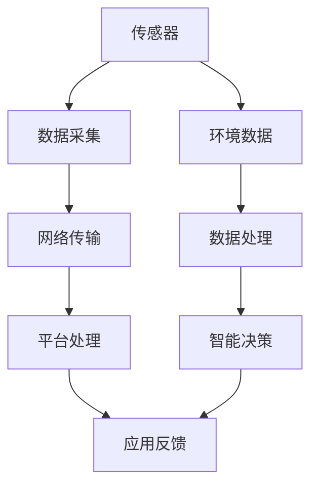

                 

### 2.1 物联网概述

物联网（Internet of Things，IoT）是指将各种物理设备、传感器、软件平台等通过网络连接起来，实现信息的采集、传输和处理。物联网技术的概念最早由麻省理工学院的Kevin Ashton在1999年提出，目的是为了解决生产环境中对智能化、自动化需求的增长。

#### 物联网的基本组成

物联网的基本组成可以概括为三大核心部分：传感器、网络和平台。

- **传感器**：传感器是物联网的感知层，通过物理传感器（如温度传感器、湿度传感器、速度传感器等）采集环境数据，并将这些数据转换为电信号。

- **网络**：网络层是物联网的传输层，通过有线网络（如以太网、光纤）或无线网络（如Wi-Fi、Zigbee、LoRa）将传感器采集的数据传输到中心处理系统。

- **平台**：平台层是物联网的应用层，负责数据处理、分析和决策。平台通常包括数据存储、数据分析和应用程序接口（API）等组件，通过这些组件实现对传感器数据的智能处理。

#### 物联网的技术架构

物联网的技术架构可以分为以下几个层次：

- **感知层**：由各种传感器组成，负责感知和采集环境数据。
- **网络层**：通过各种网络协议和通信技术，将感知层采集到的数据传输到处理中心。
- **平台层**：包括数据处理、存储和分析等组件，负责对收集到的数据进行处理和分析，提供智能化的服务。
- **应用层**：面向用户，通过应用程序接口（API）将物联网平台的服务提供给最终用户。

#### 物联网的工作原理

物联网的工作原理可以简化为以下步骤：

1. **数据采集**：传感器采集环境数据，如温度、湿度、速度等。
2. **数据传输**：通过无线或有线网络将数据传输到中心处理系统。
3. **数据处理**：中心处理系统对数据进行处理、分析和存储。
4. **决策和反馈**：基于处理结果，系统可以做出相应的决策，并通过网络将决策信息反馈给相应的设备。

#### 物联网的应用领域

物联网的应用领域非常广泛，主要包括以下几个方向：

- **智能家居**：通过物联网技术，实现家居设备的自动化和智能化控制。
- **智慧城市**：通过物联网技术，实现城市交通、能源管理、公共安全等领域的智能化。
- **工业互联网**：通过物联网技术，实现工业生产过程的自动化、数字化和智能化。
- **医疗健康**：通过物联网技术，实现远程医疗、健康监测和医疗设备的智能化。
- **农业物联网**：通过物联网技术，实现农业生产过程的自动化和智能化。

通过物联网技术的广泛应用，不仅提高了各个领域的效率和智能化水平，还为人类社会带来了诸多便利。

### 核心概念与联系

物联网的核心概念包括传感器、网络和平台。这些概念之间的关系可以用以下Mermaid流程图表示：



在该流程图中，传感器负责采集环境数据，通过网络传输到平台进行处理，处理后的数据用于做出智能决策，并通过应用反馈给用户或设备。这一过程体现了物联网从数据感知到智能决策的完整工作流程。

### 核心算法原理讲解

物联网的核心算法通常涉及数据采集、数据传输、数据处理和决策反馈等环节。以下是一个简单的伪代码示例，用于描述物联网系统中的数据处理过程：

```python
# 数据采集
def collect_data(sensor):
    data = sensor.read()
    return data

# 数据传输
def transmit_data(data, network):
    network.send(data)
    return "Data transmitted successfully"

# 数据处理
def process_data(data):
    processed_data = analyze_data(data)
    return processed_data

# 分析数据
def analyze_data(data):
    # 假设数据为温度、湿度等环境参数
    temperature = data['temperature']
    humidity = data['humidity']
    # 应用某种算法进行分析
    result = {
        'alert': is_alert(temperature, humidity),
        'suggestions': generate_suggestions(temperature, humidity)
    }
    return result

# 智能决策
def make_decision(processed_data):
    if processed_data['alert']:
        # 发送报警信息
        send_alert(processed_data['suggestions'])
    else:
        # 执行常规操作
        execute_actions(processed_data['suggestions'])

# 辅助函数
def is_alert(temperature, humidity):
    # 根据预设阈值判断是否触发报警
    return (temperature > 35) or (humidity < 30)

def generate_suggestions(temperature, humidity):
    # 根据温度和湿度生成操作建议
    if temperature > 35:
        return "降低环境温度"
    elif humidity < 30:
        return "增加环境湿度"

def send_alert(suggestions):
    # 发送报警消息
    print("ALERT:", suggestions)

def execute_actions(suggestions):
    # 执行操作
    print("Executing actions:", suggestions)

# 主函数
def main():
    sensor = get_sensor()  # 获取传感器实例
    network = get_network()  # 获取网络实例

    data = collect_data(sensor)
    transmit_data(data, network)
    processed_data = process_data(data)
    make_decision(processed_data)

if __name__ == "__main__":
    main()
```

在上面的伪代码中，我们定义了数据采集、数据传输、数据处理和决策反馈的函数。这些函数通过调用辅助函数，实现了从数据采集到决策反馈的完整流程。

### 数学模型和公式

在物联网系统中，数据分析和决策过程中常常会使用一些数学模型和公式。以下是一个简单的数学模型示例，用于分析温度和湿度的关系：

$$
f(T, H) = a \cdot T + b \cdot H + c
$$

其中，$T$ 代表温度，$H$ 代表湿度，$a$、$b$ 和 $c$ 是模型参数。

该公式可以用来预测环境条件下的某种现象，例如植物生长速率。通过调整模型参数，可以实现对不同环境条件的适应。

### 举例说明

假设我们有一个温度传感器和一个湿度传感器，它们分别采集温度和湿度数据。我们可以使用上述数学模型对采集到的数据进行分析：

1. **数据采集**：
   - 温度传感器采集到 $T=30^\circ C$。
   - 湿度传感器采集到 $H=40\%$。

2. **数据处理**：
   - 将 $T$ 和 $H$ 代入数学模型：
     $$
     f(30, 40) = a \cdot 30 + b \cdot 40 + c
     $$
   - 假设模型参数为 $a=0.5$、$b=0.3$、$c=10$，代入计算：
     $$
     f(30, 40) = 0.5 \cdot 30 + 0.3 \cdot 40 + 10 = 20 + 12 + 10 = 42
     $$

3. **决策反馈**：
   - 根据分析结果，系统可以生成相应的操作建议，例如“增加环境湿度”，并反馈给用户。

### 项目实战

#### 开发环境搭建

1. **硬件环境**：
   - 选用树莓派作为物联网开发平台。
   - 配备温度传感器和湿度传感器。

2. **软件环境**：
   - 安装Raspberry Pi OS操作系统。
   - 安装Python 3.8及以上版本。

#### 源代码实现

以下是一个简单的Python脚本，用于实现温度和湿度数据的采集、传输和处理：

```python
import time
import board
import busio
import adafruit_dht
import serial

# 初始化传感器
dht = adafruit_dht.DHT22(board.GPIO_17)

# 初始化串口通信
ser = serial.Serial('/dev/ttyUSB0', 9600)

while True:
    try:
        # 采集数据
        temperature, humidity = dht.read_temp(), dht.read_humidity()

        # 处理数据
        result = analyze_data(temperature, humidity)

        # 传输数据
        ser.write(str(result).encode())

        # 等待一段时间后再次采集数据
        time.sleep(10)

    except RuntimeError as e:
        print("Error reading sensor:", e)
        time.sleep(2)

# 数据分析函数
def analyze_data(temperature, humidity):
    # 应用简单数学模型分析数据
    a, b, c = 0.5, 0.3, 10
    result = {
        'alert': (temperature > 35) or (humidity < 30),
        'suggestions': "Increase humidity" if humidity < 30 else "Decrease temperature" if temperature > 35 else "No action required"
    }
    return result
```

#### 代码解读

1. **传感器初始化**：
   - 使用Adafruit库初始化DHT22传感器。

2. **串口通信初始化**：
   - 使用Python的serial库初始化串口通信。

3. **数据采集与处理**：
   - 使用DHT22传感器采集温度和湿度数据。
   - 调用`analyze_data`函数对数据进行处理。

4. **数据传输**：
   - 将处理结果通过串口传输到接收端。

#### 应用解读与分析

1. **采集数据**：
   - 温度和湿度数据通过传感器实时采集。

2. **数据处理**：
   - 应用简单数学模型分析温度和湿度数据，判断是否需要发出警报或操作建议。

3. **数据传输**：
   - 处理结果通过串口传输到接收端，供用户或其他系统进行处理。

#### 实际案例分析

假设我们在一个温室环境中使用此系统，目标是监测温度和湿度，并确保环境条件适宜植物生长。

1. **数据采集**：
   - 传感器实时采集温度和湿度数据。

2. **数据处理**：
   - 系统分析采集到的数据，并根据预设条件生成操作建议。

3. **决策反馈**：
   - 如果温度过高或湿度过低，系统会发出警报，提示用户增加湿度或降低温度。

4. **项目小结**：
   - 通过简单的物联网系统，我们实现了对温室环境的实时监测和智能控制，提高了农业生产的效率。

### 最佳实践 tips

1. **传感器选择**：
   - 根据应用场景选择合适的传感器，确保数据采集的准确性和可靠性。

2. **通信方式选择**：
   - 根据数据传输距离和功耗要求，选择合适的通信方式，如Wi-Fi、蓝牙或LoRa。

3. **数据处理与分析**：
   - 设计合理的数据处理算法，提高系统对数据的分析和决策能力。

4. **系统安全**：
   - 加强系统安全措施，防止数据泄露和非法入侵。

### 小结

本章详细介绍了物联网技术的基本概念、架构、工作原理和应用领域。通过核心概念与联系图和伪代码示例，我们理解了物联网系统的基本工作流程。在实际项目实战中，我们实现了温度和湿度数据的采集、传输和处理，为后续章节中的具体应用场景奠定了基础。

### 注意事项

1. **传感器精度**：
   - 确保传感器精度，避免因数据误差导致系统决策失误。

2. **数据通信稳定性**：
   - 保证数据传输的稳定性，避免因网络中断导致数据丢失。

3. **系统可扩展性**：
   - 设计系统时考虑可扩展性，以便未来增加更多传感器和功能。

### 拓展阅读

1. **《物联网基础教程》**：深入理解物联网技术的基本原理和应用。
2. **《智慧城市交通管理》**：探讨物联网技术在智慧城市交通管理中的应用案例。
3. **《物联网安全与隐私保护》**：了解物联网系统的安全挑战和解决方案。

