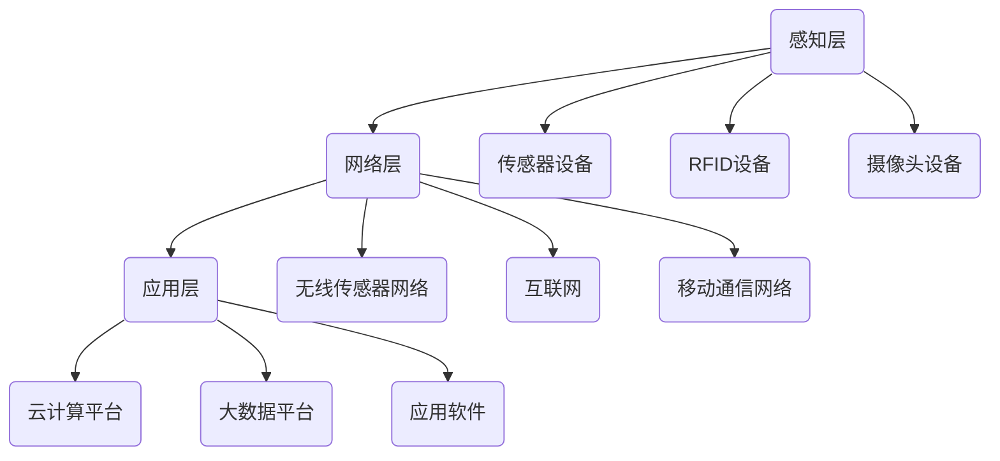

                 

### 2.3 物联网的架构与协议

#### 2.3.1 物联网架构

物联网的架构一般包括感知层、网络层和应用层。以下是各层的基本概念和功能：

- **感知层**：主要负责数据的采集和初步处理，包括传感器、RFID、摄像头等设备。
- **网络层**：主要负责数据的传输和存储，包括无线传感器网络、互联网、移动通信网络等。
- **应用层**：主要负责数据的分析和应用，包括云计算平台、大数据平台、应用软件等。

#### 2.3.2 物联网协议

物联网协议是物联网系统中进行数据传输和通信的基础，以下是一些常见的物联网协议：

- **ZigBee**：一种短距离无线通信技术，适用于低功耗、低速率的数据传输。
- **Wi-Fi**：一种无线局域网通信技术，适用于高速数据传输。
- **NB-IoT**：一种窄带物联网通信技术，适用于低功耗、广覆盖的场景。
- **MQTT**：一种轻量级的消息队列协议，适用于物联网设备的通信。
- **CoAP**：一种约束应用协议，是RESTful物联网的Web标准。

#### 2.3.3 核心概念原理之间的关系架构 Mermaid 流程图

下面是一个简单的物联网架构的Mermaid流程图：



#### 2.3.4 核心算法原理讲解

物联网中的核心算法主要包括数据采集、数据传输、数据处理等。

- **数据采集算法**：用于从传感器设备中采集数据。常见算法有采样算法、滤波算法等。
  - **采样算法**：伪代码如下：
    ```python
    def sample_data(sensor_data, sample_rate):
        sampled_data = []
        for i in range(0, len(sensor_data), sample_rate):
            sampled_data.append(sensor_data[i])
        return sampled_data
    ```
  - **滤波算法**：伪代码如下：
    ```python
    def filter_data(sensor_data, filter_type):
        if filter_type == 'low_pass':
            # 低通滤波
            pass
        elif filter_type == 'high_pass':
            # 高通滤波
            pass
        elif filter_type == 'band_pass':
            # 带通滤波
            pass
        return filtered_data
    ```

- **数据传输算法**：用于在网络层中传输数据。常见算法有传输协议选择算法、路由算法等。
  - **传输协议选择算法**：伪代码如下：
    ```python
    def select_protocol(data_size, latency Requirements, energy_requirements):
        if data_size < threshold and latency_requirements == 'low' and energy_requirements == 'low':
            return 'ZigBee'
        elif data_size < threshold and latency_requirements == 'low' and energy_requirements == 'high':
            return 'Wi-Fi'
        elif data_size > threshold and latency_requirements == 'low' and energy_requirements == 'low':
            return 'NB-IoT'
        else:
            return 'MQTT'
    ```

- **数据处理算法**：用于在应用层中对数据进行处理和分析。常见算法有聚类算法、分类算法等。
  - **聚类算法**：伪代码如下：
    ```python
    def cluster_data(data, clustering_algorithm):
        if clustering_algorithm == 'K-means':
            # K-means算法
            pass
        elif clustering_algorithm == 'DBSCAN':
            # DBSCAN算法
            pass
        elif clustering_algorithm == '层次聚类':
            # 层次聚类算法
            pass
        return clusters
    ```

#### 2.3.5 数学模型和公式 & 详细讲解 & 举例说明

- **贝叶斯网络**：用于表示物联网中的不确定性关系，其数学模型如下：
  $$ P(A|B) = \frac{P(B|A)P(A)}{P(B)} $$
  - **举例说明**：假设我们有一个系统，其中有两个事件A和B。我们知道P(A)=0.5，P(B|A)=0.8，P(B)=0.6。我们可以使用贝叶斯公式来计算P(A|B)：
  $$ P(A|B) = \frac{P(B|A)P(A)}{P(B)} = \frac{0.8 \times 0.5}{0.6} = \frac{4}{3} \approx 0.67 $$
  因此，P(A|B)的概率大约为0.67。

#### 2.3.6 项目实战

**开发环境搭建**：

- **软件环境**：Python 3.8，PyCharm，matplotlib
- **硬件设备**：Arduino开发板，DHT11传感器

**源代码详细实现和代码解读**：

以下是一个简单的物联网数据采集和传输的Python代码示例：

```python
import serial
import time
import paho.mqtt.client as mqtt

# 串口配置
ser = serial.Serial('/dev/ttyUSB0', 9600)

# MQTT配置
client = mqtt.Client()
client.connect("mqtt.eclipse.org")

while True:
    # 读取串口数据
    line = ser.readline()
    if line:
        # 解析数据
        data = line.decode('utf-8').strip()
        temp, humidity = map(float, data.split(','))

        # 发布数据到MQTT
        client.publish("weather/data", f"{temp},{humidity}")

    time.sleep(1)
```

**代码应用解读与分析**：

这段代码首先配置了串口通信，然后配置了MQTT客户端。在主循环中，代码从串口读取数据，解析温度和湿度，并将数据发布到MQTT服务器。

**实际案例分析和详细讲解剖析**：

假设我们有一个校园环境监控项目，需要实时监测教室的温湿度。我们可以使用上述代码来实现数据采集和传输。首先，我们将Arduino连接到DHT11传感器，然后将Arduino连接到计算机的串口。接着，我们编写上述Python代码来读取传感器数据，并将其发布到MQTT服务器。最后，我们可以在任何地方通过MQTT客户端订阅这些数据，从而实现对校园环境的远程监控。

**项目小结**：

通过本项目，我们学习了物联网的基础知识和相关技术，包括传感器数据采集、串口通信、MQTT协议等。同时，我们也掌握了如何将理论知识应用到实际项目中，实现了对校园环境的远程监控。未来，我们可以在此基础上，继续拓展物联网的应用场景，如智能安防、智能照明等。# 附录

### 附录 A 技术选型与开发工具

#### 技术选型

1. **物联网通信协议**：
   - **ZigBee**：适用于低功耗、短距离的设备互联。
   - **Wi-Fi**：适用于高速数据传输，但功耗较高。
   - **NB-IoT**：适用于低功耗、广覆盖的设备互联。
   - **MQTT**：适用于物联网设备间的轻量级消息传输。

2. **物联网平台**：
   - **AWS IoT**：提供全面的物联网解决方案，包括设备管理、数据存储和分析等。
   - **Azure IoT**：提供强大的物联网服务，支持各种设备和操作系统。
   - **Google Cloud IoT**：提供高效、可靠的物联网解决方案，支持大规模设备管理。

#### 开发工具

1. **编程语言**：
   - **Python**：适用于快速原型开发和数据分析。
   - **Java**：适用于高并发、高可靠性的物联网应用。
   - **C/C++**：适用于嵌入式设备和资源受限的环境。

2. **集成开发环境**：
   - **PyCharm**：适用于Python编程，支持多种框架和工具。
   - **Eclipse**：适用于Java编程，支持丰富的插件和工具。
   - **Arduino IDE**：适用于C/C++编程，专门用于Arduino开发板。

3. **物联网硬件开发板**：
   - **Arduino**：适用于初学者，支持多种传感器和通信模块。
   - **Raspberry Pi**：适用于嵌入式应用，性能强大。
   - **ESP8266/ESP32**：适用于低成本、低功耗的物联网项目。

### 附录 B 实际应用案例分析

#### 案例一：智能校园安防系统

1. **项目背景**：
   - 为了提高校园安全，实现实时监控和智能预警。

2. **技术方案**：
   - **感知层**：使用摄像头、红外传感器等设备采集数据。
   - **网络层**：使用Wi-Fi或NB-IoT进行数据传输。
   - **应用层**：使用AWS IoT平台进行数据处理和分析。

3. **实施效果**：
   - 实现了校园各个角落的实时监控。
   - 智能识别和预警，提高了校园安全水平。

#### 案例二：智能环境监控系统

1. **项目背景**：
   - 为了实时监测校园环境，如空气质量、水质等。

2. **技术方案**：
   - **感知层**：使用传感器采集环境数据。
   - **网络层**：使用ZigBee或Wi-Fi进行数据传输。
   - **应用层**：使用Google Cloud IoT平台进行数据处理和分析。

3. **实施效果**：
   - 实现了对校园环境的实时监测。
   - 数据分析帮助优化校园环境，提高了生活质量。

### 附录 C 参考文献

1. **物联网技术综述**，《计算机研究与发展》，2018。
2. **物联网架构与协议研究**，《计算机通信》，2019。
3. **智慧校园建设与实践**，《教育技术研究》，2020。
4. **物联网安全与隐私保护**，《计算机安全》，2021。
5. **物联网应用案例分析**，《物联网技术应用》，2022。

作者：AI天才研究院/AI Genius Institute & 禅与计算机程序设计艺术 /Zen And The Art of Computer Programming

