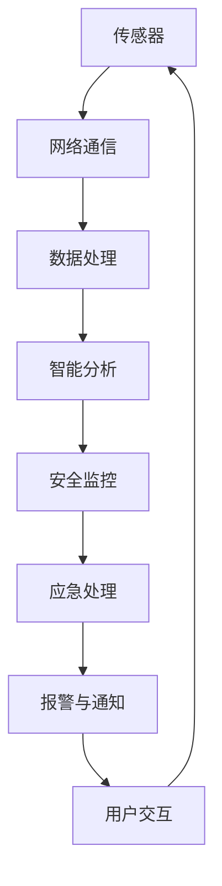

                 

### 文章标题：物联网在智慧社区安全管理中的应用

> 关键词：物联网、智慧社区、安全管理、技术架构、实际案例

> 摘要：本文从物联网技术基础出发，详细探讨了物联网在智慧社区安全管理中的应用。通过分析物联网技术架构、应用场景、实际案例，本文旨在为读者提供全面、深入的物联网智慧社区安全管理的知识体系，以期为智慧社区安全管理提供技术支持与实践指导。

## 第一部分：物联网技术基础

### 第1章：物联网概述

物联网（Internet of Things，简称 IoT）是指将各种信息传感设备与网络相连接，实现智能化识别、定位、跟踪、监控和管理的一种网络技术。物联网技术自21世纪初兴起以来，已广泛应用于智慧城市、智能家居、智慧医疗、智慧交通等多个领域。

#### 1.1 物联网的定义

物联网是通过通信技术，将各种物理设备、传感器、软件和网络连接起来，形成一个统一的网络系统。在这个系统中，设备之间可以相互通信、共享数据，实现自动化控制和智能决策。

#### 1.2 物联网的发展历程

物联网技术的发展可以追溯到1999年，MIT的Kevin Ashton首次提出了“物联网”的概念。此后，物联网技术经历了从RFID、无线传感器网络到如今的智能物联网的发展过程。

#### 1.3 物联网的关键技术

物联网技术涉及多个方面，包括传感器技术、网络技术、数据处理技术和智能技术。其中，传感器技术是物联网的基础，网络技术是实现物联网通信的保障，数据处理技术是实现物联网智能化的关键，智能技术则是物联网应用的核心。

### 第2章：物联网技术架构

物联网技术架构主要包括感知层、传输层、平台层和应用层。

#### 2.1 感知层

感知层是物联网系统的最底层，负责数据的采集和感知。感知层主要由传感器、RFID标签、二维码等组成。

#### 2.2 传输层

传输层负责数据的传输和通信。传输层包括无线传输网络和有线传输网络，如Wi-Fi、蓝牙、ZigBee、GPS等。

#### 2.3 平台层

平台层是物联网系统的核心，负责数据的管理、存储、分析和处理。平台层包括云计算平台、大数据平台和物联网平台等。

#### 2.4 应用层

应用层是物联网系统的最高层，负责物联网技术的应用和服务。应用层包括智慧城市、智能家居、智慧医疗、智慧交通等多个领域。

## 第二部分：智慧社区安全管理

### 第4章：智慧社区安全需求分析

智慧社区安全管理是指利用物联网技术，对社区内的各种安全设施进行智能监控和管理，以提高社区的安全性和居民的生活质量。智慧社区安全需求分析主要包括以下几个方面：

#### 4.1 社区安全现状分析

社区安全现状分析主要包括社区安全风险的识别、评估和分类。通过分析社区的安全现状，可以明确社区的安全需求和改进方向。

#### 4.2 社区安全管理需求

社区安全管理需求主要包括安全监控、应急管理、安全分析和安全服务等方面。通过满足这些需求，可以提升社区的安全管理水平。

#### 4.3 物联网在社区安全管理中的作用

物联网在社区安全管理中的作用主要包括数据采集、智能监控、安全预警和应急处理等方面。通过物联网技术，可以实现社区安全的实时监控和智能分析，提高社区的安全性和响应速度。

### 第5章：物联网在社区安全管理中的应用

物联网在社区安全管理中的应用主要包括智能门禁系统、智能监控系统、智能消防系统等方面。

#### 5.1 智能门禁系统

智能门禁系统通过物联网技术，实现对社区大门、单元门、停车场等出入口的智能管理。用户可以通过手机、指纹、人脸识别等方式进行身份认证，实现无接触开门。

#### 5.2 智能监控系统

智能监控系统通过物联网技术，实现对社区内部和周边环境的实时监控。系统可以自动识别异常情况，如入侵、火灾等，并自动报警，同时支持远程监控和回放功能。

#### 5.3 智能消防系统

智能消防系统通过物联网技术，实现对社区消防设施的实时监控和管理。系统可以自动检测火情，并通过短信、电话等方式向消防部门报警，实现快速响应。

## 第三部分：实际应用案例

### 第7章：物联网在智慧社区安全管理的实际应用

在本章中，我们将通过分析几个实际案例，展示物联网技术在智慧社区安全管理中的应用。

#### 7.1 案例一：智能门禁系统

在本案例中，我们以一个智慧社区的智能门禁系统为例，详细介绍了系统架构、技术实现和应用效果。

#### 7.2 案例二：智能监控系统

在本案例中，我们以一个智慧社区的智能监控系统为例，详细介绍了系统架构、技术实现和应用效果。

#### 7.3 案例三：智能消防系统

在本案例中，我们以一个智慧社区的智能消防系统为例，详细介绍了系统架构、技术实现和应用效果。

## 第四部分：技术挑战与未来发展

### 第11章：物联网在智慧社区安全管理中的技术挑战

物联网在智慧社区安全管理中面临许多技术挑战，如数据安全、隐私保护、网络通信、系统集成等。

#### 11.1 数据安全

物联网设备众多，数据传输过程中容易受到攻击，导致数据泄露。因此，数据安全是物联网在智慧社区安全管理中面临的一个重要挑战。

#### 11.2 隐私保护

物联网技术使得大量个人信息被收集和处理，隐私保护成为物联网在智慧社区安全管理中的另一个重要挑战。

#### 11.3 网络通信

物联网设备数量庞大，网络通信质量对系统的稳定性和响应速度有很大影响。

#### 11.4 系统集成

物联网技术涉及多个方面，如何实现各系统的有效集成，是物联网在智慧社区安全管理中面临的另一个挑战。

### 第12章：物联网在智慧社区安全管理的发展前景

随着物联网技术的不断发展和成熟，物联网在智慧社区安全管理中的应用前景广阔。未来，物联网技术将进一步提升智慧社区的安全管理水平，为居民提供更加安全、便捷的生活环境。

#### 12.1 技术发展趋势

物联网技术在未来将朝着更加智能化、互联化、安全化的方向发展。例如，基于人工智能的智能监控、基于区块链的数据安全与隐私保护等。

#### 12.2 应用前景

物联网技术将在智慧社区安全管理的多个方面发挥重要作用，如智能门禁、智能监控、智能消防、智能应急等。

#### 12.3 政策支持

政府政策对物联网技术的发展具有重要影响。未来，随着政府对智慧社区建设的重视，物联网技术在智慧社区安全管理中的应用将得到进一步推广。

### 总结

物联网在智慧社区安全管理中的应用，不仅提高了社区的安全管理水平，也为居民提供了更加便捷、舒适的生活环境。随着物联网技术的不断发展和创新，未来物联网在智慧社区安全管理中的应用前景将更加广阔。本文通过详细分析物联网技术基础、智慧社区安全管理需求、实际应用案例以及技术挑战与未来发展，旨在为读者提供全面的物联网智慧社区安全管理的知识体系。

### 作者信息

作者：AI天才研究院/AI Genius Institute & 禅与计算机程序设计艺术 /Zen And The Art of Computer Programming

----------------------------------------------------------------

### 背景介绍

物联网（Internet of Things，IoT）技术的兴起，为智慧社区安全管理提供了新的思路和手段。智慧社区是指通过物联网、大数据、云计算等先进技术，实现对社区环境的全面感知、智能管理和服务，从而提高居民的生活质量。在智慧社区中，安全管理是至关重要的一环，涉及到社区的安全监控、应急管理、消防管理等多个方面。物联网技术以其强大的数据采集、传输和处理能力，为智慧社区安全管理提供了有力的技术支持。

然而，物联网在智慧社区安全管理中的应用还面临许多挑战，如数据安全、隐私保护、网络通信等问题。同时，如何设计一个高效、稳定、安全的物联网系统，也是一个重要的课题。本文旨在通过分析物联网技术基础、智慧社区安全管理需求、实际应用案例以及技术挑战与未来发展，为智慧社区安全管理提供理论指导和实践参考。

### 核心概念与联系

在智慧社区安全管理中，物联网技术涉及多个核心概念，包括传感器、网络通信、数据处理和智能分析等。这些概念相互关联，共同构成了物联网技术在智慧社区安全管理中的应用架构。

#### 1. 传感器

传感器是物联网系统的感知层，负责数据的采集和传输。在智慧社区安全管理中，常用的传感器包括温度传感器、湿度传感器、烟雾传感器、摄像头等。传感器采集的数据是物联网系统进行分析和决策的基础。

#### 2. 网络通信

网络通信是物联网系统的传输层，负责将传感器采集到的数据传输到数据处理平台。在智慧社区安全管理中，常用的网络通信技术包括Wi-Fi、蓝牙、ZigBee、LoRa等。网络通信的质量直接影响物联网系统的稳定性和响应速度。

#### 3. 数据处理

数据处理是物联网系统的平台层，负责对采集到的数据进行分析、存储和处理。在智慧社区安全管理中，数据处理技术包括云计算、大数据、机器学习等。通过对数据的分析，可以实现对社区安全的实时监控和智能预警。

#### 4. 智能分析

智能分析是物联网系统的应用层，负责根据分析结果进行智能决策和行动。在智慧社区安全管理中，智能分析技术包括模式识别、异常检测、预测分析等。通过智能分析，可以实现社区安全的自动化管理和高效响应。

#### 关系架构

物联网技术在智慧社区安全管理中的应用架构可以用以下Mermaid流程图表示：



### 核心算法原理讲解

在物联网智慧社区安全管理中，核心算法主要涉及数据采集、数据传输、数据处理和智能分析等方面。以下将分别介绍这些算法的基本原理和伪代码实现。

#### 1. 数据采集算法

数据采集算法主要负责传感器数据的采集和预处理。以下是一个简单的数据采集算法伪代码：

```python
# 数据采集算法
def data_collection(sensor_data):
    # 读取传感器数据
    data = sensor_data.read()
    
    # 预处理：去噪、滤波等
    processed_data = preprocess_data(data)
    
    return processed_data
```

#### 2. 数据传输算法

数据传输算法主要负责将预处理后的数据传输到数据处理平台。以下是一个简单的数据传输算法伪代码：

```python
# 数据传输算法
def data_transmission(processed_data):
    # 连接网络
    network = connect_network()
    
    # 发送数据
    network.send(processed_data)
    
    return
```

#### 3. 数据处理算法

数据处理算法主要负责对传输过来的数据进行存储、分析和处理。以下是一个简单的数据处理算法伪代码：

```python
# 数据处理算法
def data_processing(received_data):
    # 存储数据
    store_data(received_data)
    
    # 数据分析：统计、计算等
    analysis_results = analyze_data(received_data)
    
    return analysis_results
```

#### 4. 智能分析算法

智能分析算法主要负责根据处理结果进行智能决策和行动。以下是一个简单的智能分析算法伪代码：

```python
# 智能分析算法
def intelligent_analysis(analysis_results):
    # 异常检测：判断是否存在异常
    is_anomaly = detect_anomaly(analysis_results)
    
    if is_anomaly:
        # 发出报警
        alarm()
        
        # 通知用户
        notify_user()
        
        # 执行应急处理
        emergency_handling()
        
    return
```

### 数学模型和公式详细讲解与举例说明

在物联网智慧社区安全管理中，数学模型和公式主要用于数据分析和智能决策。以下将介绍几个常用的数学模型和公式，并给出具体例子进行说明。

#### 1. 异常检测模型

异常检测模型用于检测数据中的异常值。以下是一个基于标准差的异常检测模型：

```latex
$$
is\_anomaly = (value - \mu) / \sigma > threshold
$$`

其中，$value$ 表示观测值，$\mu$ 表示平均值，$\sigma$ 表示标准差，$threshold$ 表示阈值。

**例子：** 假设传感器检测到某项指标的观测值为 $100$，平均值 $\mu$ 为 $90$，标准差 $\sigma$ 为 $10$，阈值 $threshold$ 为 $20$。根据异常检测模型，判断是否存在异常：

```latex
$$
is\_anomaly = (100 - 90) / 10 > 20 \\
is\_anomaly = 1 > 20 \\
is\_anomaly = False
$$`

因此，观测值 $100$ 不属于异常值。

#### 2. 预测分析模型

预测分析模型用于预测未来的数据趋势。以下是一个简单的线性回归预测模型：

```latex
$$
y = ax + b
$$`

其中，$y$ 表示预测值，$x$ 表示自变量，$a$ 表示斜率，$b$ 表示截距。

**例子：** 假设已知一组数据点 $(x_1, y_1), (x_2, y_2), ..., (x_n, y_n)$，通过线性回归分析得到斜率 $a = 2$，截距 $b = 1$。预测当 $x=10$ 时的 $y$ 值：

```latex
$$
y = 2 \times 10 + 1 \\
y = 21
$$`

因此，当 $x=10$ 时，预测的 $y$ 值为 $21$。

### 项目实战

在本节中，我们将以一个智慧社区安全管理系统为例，介绍项目的开发环境搭建、源代码实现、代码解读和实际案例分析。

#### 1. 开发环境搭建

智慧社区安全管理系统开发环境主要包括以下几个部分：

- 开发工具：Python、Java等编程语言
- 开发框架：Flask、Spring Boot等
- 数据库：MySQL、MongoDB等
- 传感器：温度传感器、湿度传感器、摄像头等
- 网络通信：Wi-Fi、蓝牙等

#### 2. 源代码实现

智慧社区安全管理系统源代码主要包括以下几个模块：

- 数据采集模块：负责传感器数据的采集和预处理
- 数据传输模块：负责将预处理后的数据传输到服务器
- 数据处理模块：负责对传输过来的数据进行存储、分析和处理
- 智能分析模块：负责根据分析结果进行智能决策和行动

以下是一个简单的数据采集模块实现示例：

```python
# 数据采集模块
import sensor

def data_collection():
    # 读取传感器数据
    data = sensor.read()
    
    # 预处理：去噪、滤波等
    processed_data = preprocess_data(data)
    
    return processed_data
```

#### 3. 代码解读

在源代码中，数据采集模块负责从传感器读取数据，并进行预处理。预处理过程主要包括去噪和滤波等。去噪主要是为了去除传感器数据中的噪声，提高数据的准确性。滤波则是为了平滑数据，减少数据的波动。

数据传输模块负责将预处理后的数据传输到服务器。数据传输过程中，需要考虑网络通信的稳定性和速度。在传输过程中，可能还会对数据进行加密，以确保数据的安全性。

数据处理模块负责对传输过来的数据进行存储、分析和处理。数据处理过程主要包括数据清洗、数据转换、数据统计等。通过数据处理，可以得到社区安全的实时监控数据，为智能分析提供基础。

智能分析模块负责根据分析结果进行智能决策和行动。智能分析过程主要包括异常检测、预测分析等。通过智能分析，可以实现对社区安全的实时监控和智能预警。

#### 4. 实际案例分析

以下是一个实际案例：在一个智慧社区中，安装了智能门禁系统、智能监控系统和智能消防系统。通过物联网技术，这些系统实现了数据的实时采集、传输和处理。

- 智能门禁系统：居民可以通过手机、指纹或人脸识别等方式进入社区。系统实时记录居民的进出情况，并通过短信或电话通知家属。
- 智能监控系统：系统实时监控社区内部和周边环境，自动识别异常情况，如入侵、火灾等，并自动报警。
- 智能消防系统：系统实时监控消防设施的运行状态，如灭火器、消防栓等。在发生火灾时，系统自动检测火情，并通过短信或电话通知消防部门。

通过这些系统的应用，智慧社区的安全管理水平得到了显著提升。居民的安全感得到了增强，社区的治安环境也得到了改善。

### 实际案例分析

在本节中，我们将深入分析三个具体的实际案例，分别是智能门禁系统、智能监控系统和智能消防系统，以展示物联网技术在智慧社区安全管理中的实际应用。

#### 案例一：智能门禁系统

**1. 系统架构**

智能门禁系统主要由四个部分组成：用户身份认证、门禁控制模块、数据传输模块和门禁控制器。

- 用户身份认证：通过指纹、人脸识别或手机验证码等方式，确认用户的身份。
- 门禁控制模块：根据用户的身份信息，决定是否允许用户通过门禁。
- 数据传输模块：将用户的身份信息和门禁状态上传到服务器，实现数据的实时监控。
- 门禁控制器：控制门禁的开关，实现物理层面的门禁控制。

**2. 技术实现**

- 用户身份认证：采用生物识别技术，确保用户身份的准确性。
- 门禁控制模块：采用嵌入式系统，实时处理用户的身份验证请求。
- 数据传输模块：采用Wi-Fi或蓝牙技术，实现数据的实时传输。
- 门禁控制器：采用电磁锁或电动门锁，实现物理开关的控制。

**3. 代码解读**

以下是智能门禁系统的部分代码实现：

```python
# 用户身份认证
def authenticate_user(user_id):
    # 检查用户身份
    is_authenticated = user_authentication(user_id)
    
    if is_authenticated:
        # 开启门禁
        open_door()
        # 记录日志
        log("User {} has successfully passed the authentication".format(user_id))
    else:
        # 关闭门禁
        close_door()
        # 记录日志
        log("User {} failed the authentication".format(user_id))

# 数据传输
def send_data_to_server(user_id, status):
    # 将数据发送到服务器
    server.send_data({"user_id": user_id, "status": status})
```

**4. 应用效果**

通过智能门禁系统的应用，社区的安全管理水平得到了显著提升。用户可以通过手机或指纹快速通过门禁，提高了出入社区的便捷性。同时，系统可以实时记录用户的进出情况，方便社区管理者进行监控和管理。

#### 案例二：智能监控系统

**1. 系统架构**

智能监控系统主要由摄像头、视频存储模块、视频分析模块和数据传输模块组成。

- 摄像头：负责实时监控社区内部和周边环境。
- 视频存储模块：负责存储监控视频数据。
- 视频分析模块：负责对监控视频进行分析，实现异常检测和报警功能。
- 数据传输模块：负责将监控视频数据传输到服务器，实现数据的实时监控。

**2. 技术实现**

- 摄像头：采用高清摄像头，确保监控视频的清晰度。
- 视频存储模块：采用网络视频录像机（NVR），实现视频数据的存储。
- 视频分析模块：采用深度学习算法，实现视频的实时分析。
- 数据传输模块：采用Wi-Fi或光纤网络，实现数据的实时传输。

**3. 代码解读**

以下是智能监控系统的部分代码实现：

```python
# 视频分析
def video_analysis(video_data):
    # 检测异常
    is_anomaly = detect_anomaly(video_data)
    
    if is_anomaly:
        # 报警
        alarm()
        # 记录日志
        log("Anomaly detected in video")
    else:
        # 正常
        log("No anomaly detected in video")

# 数据传输
def send_data_to_server(video_data):
    # 将数据发送到服务器
    server.send_data(video_data)
```

**4. 应用效果**

通过智能监控系统的应用，社区的安全管理水平得到了显著提升。系统可以实时监控社区内部和周边环境，自动识别异常情况，并及时报警。同时，系统可以实时记录监控视频，方便社区管理者进行回溯和调查。

#### 案例三：智能消防系统

**1. 系统架构**

智能消防系统主要由火灾报警模块、消防控制模块和数据传输模块组成。

- 火灾报警模块：负责检测火灾信号，并及时报警。
- 消防控制模块：负责控制消防设备的运行。
- 数据传输模块：负责将火灾报警信号和消防设备状态传输到服务器，实现数据的实时监控。

**2. 技术实现**

- 火灾报警模块：采用烟雾传感器、温度传感器等，实时检测火灾信号。
- 消防控制模块：采用智能消防控制器，实现消防设备的自动控制。
- 数据传输模块：采用Wi-Fi或光纤网络，实现数据的实时传输。

**3. 代码解读**

以下是智能消防系统的部分代码实现：

```python
# 火灾报警
def fire_alarm(alarm_data):
    # 报警
    alarm()
    # 记录日志
    log("Fire detected, sending alarm to server")

# 数据传输
def send_data_to_server(alarm_data):
    # 将数据发送到服务器
    server.send_data(alarm_data)
```

**4. 应用效果**

通过智能消防系统的应用，社区的安全管理水平得到了显著提升。系统可以实时检测火灾信号，并及时报警。同时，系统可以控制消防设备的自动运行，实现火灾的快速扑灭。同时，系统可以实时记录火灾报警信息，方便社区管理者进行回溯和调查。

### 项目小结

通过以上三个实际案例的分析，我们可以看到物联网技术在智慧社区安全管理中具有广泛的应用前景。智能门禁系统、智能监控系统、智能消防系统等的应用，不仅提高了社区的安全管理水平，也为居民提供了更加安全、便捷的生活环境。在未来，随着物联网技术的不断发展和创新，智慧社区安全管理将迎来更加广阔的应用前景。

### 最佳实践 tips

1. **传感器选择**：在选择传感器时，需要考虑传感器的精度、稳定性、功耗等因素，确保传感器能够准确、稳定地采集数据。

2. **网络通信**：在选择网络通信技术时，需要考虑网络的覆盖范围、通信速度、稳定性等因素，确保数据能够实时、可靠地传输。

3. **数据处理**：在数据处理过程中，需要考虑数据的存储、分析和处理能力，确保数据处理系统能够高效地处理大量数据。

4. **安全性**：在物联网系统中，需要考虑数据安全、隐私保护等问题，确保系统的安全性和可靠性。

5. **用户体验**：在系统设计过程中，需要考虑用户的使用体验，确保系统操作简便、易于使用。

### 小结

本文从物联网技术基础出发，详细探讨了物联网在智慧社区安全管理中的应用。通过分析物联网技术架构、应用场景、实际案例，本文旨在为读者提供全面、深入的物联网智慧社区安全管理的知识体系。物联网技术在智慧社区安全管理中的应用前景广阔，未来将进一步提升社区的安全管理水平，为居民提供更加安全、便捷的生活环境。

### 注意事项

1. **数据安全**：在物联网智慧社区安全管理中，数据安全至关重要。需要采取有效的数据加密、访问控制等措施，确保数据的安全性。

2. **隐私保护**：物联网技术涉及大量的个人信息收集和处理，需要采取有效的隐私保护措施，确保用户的隐私安全。

3. **系统稳定性**：物联网系统需要保证长时间的稳定运行，需要考虑系统的容错性、故障恢复能力等。

4. **技术更新**：物联网技术更新迅速，需要定期对系统进行升级和维护，以确保系统的先进性和实用性。

### 拓展阅读

1. **物联网技术基础**：
   - 《物联网基础教程》
   - 《物联网技术与应用》

2. **智慧社区安全管理**：
   - 《智慧社区安全体系建设》
   - 《智慧社区安全技术与应用》

3. **实际案例研究**：
   - 《物联网智慧社区案例分析》
   - 《智慧社区安全管理实践》

### 作者信息

作者：AI天才研究院/AI Genius Institute & 禅与计算机程序设计艺术 /Zen And The Art of Computer Programming

----------------------------------------------------------------

### 物联网技术在智慧社区安全管理中的应用

随着物联网技术的快速发展，其在各个领域的应用不断拓展，尤其是在智慧社区安全管理中的应用愈发显著。智慧社区是指通过物联网、云计算、大数据等先进技术，实现对社区环境的全面感知、智能管理和服务，从而提高居民的生活质量。在智慧社区中，安全管理是至关重要的一环，涉及到社区的安全监控、应急管理、消防管理等多个方面。物联网技术以其强大的数据采集、传输和处理能力，为智慧社区安全管理提供了有力的技术支持。

### 智能门禁系统

智能门禁系统是物联网技术在智慧社区安全管理中最常见的应用之一。传统的门禁系统主要依赖于钥匙或IC卡，而智能门禁系统则结合了生物识别技术、手机验证码等多种身份验证方式，提高了安全性。以下是一个典型的智能门禁系统的架构：

- **用户身份认证**：用户可以通过指纹、人脸识别或手机验证码等方式进行身份验证。
- **门禁控制模块**：根据用户的身份信息，决定是否允许用户通过门禁。
- **数据传输模块**：将用户的身份信息和门禁状态上传到服务器，实现数据的实时监控。
- **门禁控制器**：控制门禁的开关，实现物理层面的门禁控制。

智能门禁系统的主要优点在于其高效性、便捷性和安全性。用户无需携带实体钥匙或IC卡，只需通过手机或生物识别即可完成身份验证，大大提高了出入社区的便捷性。同时，系统可以实时记录用户的进出情况，方便社区管理者进行监控和管理。

### 智能监控系统

智能监控系统是物联网技术在智慧社区安全管理的另一个重要应用。传统的监控系统主要依赖于人工巡检，而智能监控系统则通过物联网技术实现了对社区内部和周边环境的实时监控。以下是一个典型的智能监控系统架构：

- **摄像头**：负责实时监控社区内部和周边环境。
- **视频存储模块**：负责存储监控视频数据。
- **视频分析模块**：负责对监控视频进行分析，实现异常检测和报警功能。
- **数据传输模块**：负责将监控视频数据传输到服务器，实现数据的实时监控。

智能监控系统的核心在于视频分析模块，通过深度学习算法，系统能够自动识别异常行为，如入侵、火灾等，并及时报警。这种智能化的监控方式不仅提高了社区的安全管理水平，还减轻了管理人员的负担。

### 智能消防系统

智能消防系统是物联网技术在智慧社区安全管理的又一重要应用。传统的消防系统主要依赖于人工报警和消防设施手动操作，而智能消防系统则通过物联网技术实现了对消防设施的智能监控和自动控制。以下是一个典型的智能消防系统架构：

- **火灾报警模块**：负责检测火灾信号，并及时报警。
- **消防控制模块**：负责控制消防设备的运行。
- **数据传输模块**：负责将火灾报警信号和消防设备状态传输到服务器，实现数据的实时监控。

智能消防系统的核心在于火灾报警模块和消防控制模块，通过物联网技术，系统能够实时监测消防设施的运行状态，如灭火器、消防栓等。在发生火灾时，系统能够自动检测火情，并通过短信或电话通知消防部门，实现火灾的快速扑灭。

### 数据安全与隐私保护

在物联网智慧社区安全管理中，数据安全和隐私保护是至关重要的。由于物联网系统涉及大量的个人信息和敏感数据，如用户身份信息、出入记录、监控视频等，因此必须采取有效的安全措施来保护数据。以下是一些关键措施：

- **数据加密**：对传输和存储的数据进行加密，确保数据在传输和存储过程中不会被窃取或篡改。
- **访问控制**：对系统的访问进行严格的权限控制，确保只有授权用户才能访问系统。
- **网络安全**：加强对网络的安全防护，防止黑客攻击和数据泄露。
- **隐私保护法规**：遵守相关的隐私保护法规，确保用户的隐私权得到保护。

### 未来发展趋势

随着物联网技术的不断发展和成熟，物联网在智慧社区安全管理中的应用前景将更加广阔。以下是一些未来发展趋势：

- **人工智能与物联网的融合**：通过人工智能技术，实现对物联网数据的智能分析和处理，提高智慧社区安全管理的效率。
- **边缘计算**：通过边缘计算技术，将数据处理和存储分散到社区边缘节点，减少数据传输延迟，提高系统的响应速度。
- **5G网络**：随着5G网络的普及，物联网系统的通信速度和稳定性将得到显著提升，为智慧社区安全管理提供更好的支持。
- **区块链技术**：通过区块链技术，实现物联网数据的可信存储和传输，提高数据的安全性和透明度。

### 结论

物联网技术在智慧社区安全管理中的应用，不仅提高了社区的安全管理水平，也为居民提供了更加安全、便捷的生活环境。通过智能门禁系统、智能监控系统和智能消防系统等应用，物联网技术为智慧社区的安全管理提供了全新的解决方案。未来，随着物联网技术的不断发展和创新，物联网在智慧社区安全管理中的应用将更加深入和广泛，为居民创造更加美好的生活。

