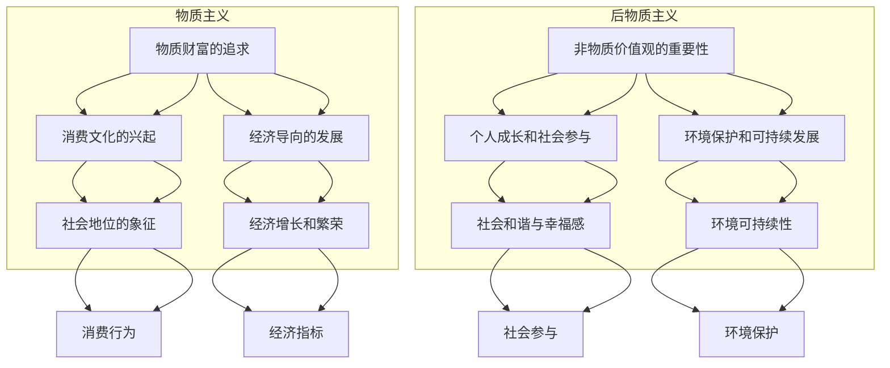

                 

### 文章标题

“物质主义到后物质主义：价值观的代际转变”

### 关键词

- 物质主义
- 后物质主义
- 代际差异
- 价值观转变
- 社会文化

### 摘要

本文深入探讨了从物质主义向后物质主义转变的价值观现象。通过对不同代际群体的价值观演变进行分析，揭示了物质主义和后物质主义的核心概念及其关系。文章结合经济学、社会学、哲学和心理学的理论，详细阐述了这一转变对个人、社会和文化的深远影响。同时，通过实际案例研究，展示了这种价值观转变所带来的挑战和机遇。最终，本文提出了一些最佳实践，以帮助读者更好地理解这一现象，并展望了未来的发展趋势。

## 引言

### 物质主义的定义和历史

物质主义是一种价值观体系，强调物质财富、物质需求和物质满足的重要性。这一概念最早可以追溯到18世纪的启蒙时代，当时的哲学家们开始探讨人类如何通过追求物质财富来实现幸福。物质主义的理念在19世纪和20世纪得到了进一步的发展，尤其是在工业革命之后。工业革命带来了生产力的巨大提升，人们的生活水平也随之提高，物质财富逐渐成为人们追求的主要目标。

在20世纪，物质主义逐渐成为一种普遍的社会现象。随着经济的发展和技术的进步，人们拥有了更多的物质资源，从而推动了消费文化的兴起。物质主义不仅体现在个人层面，还渗透到社会和文化的方方面面。例如，广告和媒体不断宣传物质财富的象征意义，促使人们追求更高的生活质量。在这种背景下，物质财富被视为成功和社会地位的象征，成为人们追求的目标。

### 后物质主义的定义和兴起

后物质主义是对物质主义的一种反思和超越。它强调非物质价值观，如个人成长、社会关系、精神满足和环境责任等。后物质主义的理念在20世纪后期开始兴起，特别是在20世纪60年代的“反文化”运动中得到了广泛传播。这一时期的青年人开始对物质主义进行批判，倡导回归自然、追求自由和平等。

后物质主义的核心在于对人类幸福的新理解。与物质主义强调物质财富的重要性不同，后物质主义认为幸福不仅仅是物质的满足，更包括精神层面的满足。后物质主义强调个人成长和社会关系的价值，认为通过自我实现和社会参与，人们可以找到更深层次的幸福感。

### 物质主义和后物质主义的比较

物质主义和后物质主义在价值观上有着显著的区别。物质主义强调物质财富和社会地位的追求，认为这些是实现个人幸福和社会进步的关键因素。后物质主义则强调非物质价值观，认为通过个人成长和社会参与，人们可以实现更深层次的幸福感。

尽管两者在价值观上有所不同，但它们也存在一定的联系。物质主义为人类社会带来了巨大的物质进步，为后物质主义的发展提供了基础。后物质主义则对物质主义进行了批判和反思，推动社会向更平衡、更可持续的方向发展。

### 摘要

本文旨在探讨物质主义到后物质主义的价值观转变，以及这一转变对不同代际群体的影响。首先，我们将回顾物质主义的历史和定义，并解释后物质主义的兴起及其核心观念。接着，我们将比较物质主义和后物质主义，揭示它们在价值观上的异同。通过这一引言，我们为后续章节的内容奠定了基础，并激发了读者对这一主题的深入思考。

## 文章目录大纲

### 第1章 引言

- 1.1 物质主义的定义和历史
- 1.2 后物质主义的定义和兴起
- 1.3 物质主义和后物质主义的比较

### 第2章 价值观的代际转变

- 2.1 每一代的价值观概述
  - 2.1.1 静默一代的价值观
  - 2.1.2 反文化一代的价值观
  - 2.1.3 X一代的价值观
  - 2.1.4 千禧一代的价值观
  - 2.1.5 Z一代的价值观
- 2.2 代际价值观转变的原因
  - 2.2.1 经济环境的影响
  - 2.2.2 社会文化因素
  - 2.2.3 技术进步的作用

### 第3章 核心概念与联系

- 3.1 物质主义和后物质主义的核心概念
- 3.2 核心概念之间的关系架构（Mermaid流程图）
- 3.3 物质主义和后物质主义在社会文化中的交互作用

### 第4章 理论基础

- 4.1 经济学视角下的物质主义和后物质主义
- 4.2 社会学视角下的物质主义和后物质主义
- 4.3 哲学和心理学视角下的物质主义和后物质主义
- 4.4 数学模型和理论框架

### 第5章 案例研究

- 5.1 案例研究1：消费行为的转变
- 5.2 案例研究2：科技对后物质主义的影响
- 5.3 案例研究3：工作与就业的变革

### 第6章 挑战与机遇

- 6.1 物质主义向后物质主义的转变带来的经济挑战
- 6.2 社会文化的转变及其影响
- 6.3 个人层面的机遇与挑战
- 6.4 未来发展的趋势预测

### 第7章 结论

- 7.1 主要发现与结论
- 7.2 对未来研究的建议
- 7.3 对个人和社会的启示

### 附录

- 附录A：相关术语解释
- 附录B：参考资源与进一步阅读
- 附录C：研究方法与技术工具

### 致谢

- 感谢所有参与者、研究者和支持者

## 第1章 引言

### 物质主义的定义和历史

物质主义是一种价值观体系，强调物质财富、物质需求和物质满足的重要性。在历史上，物质主义最早可以追溯到古代文明时期。例如，在古希腊和古罗马时期，人们追求财富和物质享受已经成为社会生活的一部分。然而，物质主义作为一种明确的哲学和社会思潮，起源于18世纪的启蒙时代。

在启蒙时期，哲学家们开始探讨人类如何通过追求物质财富来实现幸福。约翰·洛克和托马斯·霍布斯等思想家提出了社会契约论，强调人们通过劳动和创造来获得财富，从而提高生活质量。这种思想在19世纪得到了进一步的发展，尤其是在工业革命之后。

工业革命是一个历史性的转折点，它带来了生产力的巨大提升，使人类能够以更高的效率生产商品。这一时期，人们的物质生活水平显著提高，物质财富逐渐成为人们追求的主要目标。工业革命也催生了资本主义经济体系，资本主义的核心价值观之一就是追求物质财富的积累和增长。

20世纪是物质主义发展的黄金时期。随着经济的全球化，物质主义的影响扩散到世界各地。广告和媒体的兴起，使得物质财富的象征意义被放大，人们开始将物质财富视为成功和社会地位的象征。在这一背景下，消费文化逐渐兴起，人们通过购买商品来满足自己的物质需求，追求更高的生活质量。

物质主义不仅体现在个人层面，还渗透到社会和文化的各个方面。例如，教育系统注重培养学生的实用技能，以便他们能够在未来找到高薪工作。职业发展也以物质成就为导向，人们通过晋升和加薪来提高自己的社会地位。此外，物质主义还体现在人们的社交行为和人际关系中，物质财富成为衡量一个人成功与否的重要标准。

### 后物质主义的定义和兴起

后物质主义是对物质主义的一种反思和超越。它强调非物质价值观，如个人成长、社会关系、精神满足和环境责任等。后物质主义的理念在20世纪后期开始兴起，特别是在20世纪60年代的“反文化”运动中得到了广泛传播。

20世纪60年代，社会发生了巨大的变革。随着经济的发展和技术的进步，人们开始反思物质主义带来的负面影响。这一时期，青年人开始对物质主义进行批判，倡导回归自然、追求自由和平等。反文化运动成为了后物质主义的重要推手，它强调个人的自由和自我实现，反对社会对个体的压制和控制。

后物质主义的兴起与以下几个因素密切相关。首先，经济全球化带来了社会结构的改变，人们的生活方式和价值观念发生了变化。其次，科技的进步使得人们能够更好地满足自己的物质需求，从而有更多的精力和时间关注非物质的需求。最后，社会的变革和文化的多样性也为后物质主义的兴起提供了土壤。

后物质主义的核心在于对人类幸福的新理解。与物质主义强调物质财富的重要性不同，后物质主义认为幸福不仅仅是物质的满足，更包括精神层面的满足。后物质主义强调个人成长和社会关系的价值，认为通过自我实现和社会参与，人们可以找到更深层次的幸福感。

### 物质主义和后物质主义的比较

物质主义和后物质主义在价值观上有着显著的区别。物质主义强调物质财富和社会地位的追求，认为这些是实现个人幸福和社会进步的关键因素。物质主义的核心在于通过追求物质财富来提高生活质量，这种价值观在资本主义经济体系中得到了充分体现。

后物质主义则强调非物质价值观，如个人成长、社会关系、精神满足和环境责任等。后物质主义认为，通过追求个人的内在价值和意义，人们可以实现更深层次的幸福感。后物质主义的核心在于对人类幸福的新理解，认为幸福不仅仅是物质的满足，更包括精神层面的满足。

尽管两者在价值观上有所不同，但它们也存在一定的联系。物质主义为人类社会带来了巨大的物质进步，为后物质主义的发展提供了基础。后物质主义则对物质主义进行了批判和反思，推动社会向更平衡、更可持续的方向发展。

物质主义和后物质主义的比较不仅有助于我们理解两种价值观的异同，还可以为我们提供新的视角来看待社会和文化的发展。随着时代的变迁，人们的价值观也在不断演变。从物质主义向后物质主义的转变，反映了人类对幸福和意义的追求，以及对社会和文化的反思。

### 摘要

本文深入探讨了从物质主义向后物质主义转变的价值观现象。通过对不同代际群体的价值观演变进行分析，揭示了物质主义和后物质主义的核心概念及其关系。文章结合经济学、社会学、哲学和心理学的理论，详细阐述了这一转变对个人、社会和文化的深远影响。同时，通过实际案例研究，展示了这种价值观转变所带来的挑战和机遇。最终，本文提出了一些最佳实践，以帮助读者更好地理解这一现象，并展望了未来的发展趋势。

### 第2章 价值观的代际转变

随着时代的变迁，不同代际的价值观也在不断演变。这一章节将深入探讨每一代人的价值观概述，分析代际价值观转变的原因，并探讨经济环境、社会文化因素和技术进步对价值观转变的影响。

#### 每一代的价值观概述

**静默一代（1928-1945年）**

静默一代，也被称为沉默的一代，是美国二战后的第一代人。这一代人在战后经济繁荣的背景下成长，他们经历了物质匮乏到物质丰富的转变。静默一代的价值观以实用性和责任感为核心，他们追求稳定和安全，重视家庭和传统价值观。

**反文化一代（1946-1964年）**

反文化一代，通常被称为婴儿潮一代，是在战后繁荣时期长大的。这一代人经历了冷战和反文化运动，他们的价值观反映了对社会现状的批判和对自由、平等的追求。反文化一代强调个人主义和自我表达，他们追求精神满足和社会变革。

**X一代（1965-1979年）**

X一代是在经济不稳定和文化多样性的环境中成长的。这一代人经历了经济萧条和社会动荡，他们的价值观以务实和现实主义为核心。X一代追求个人成就和自我实现，同时注重工作与生活的平衡。

**千禧一代（1980-1994年）**

千禧一代，也被称为Y一代，是在数字技术和互联网的兴起中成长的。这一代人对技术和创新充满热情，他们追求多样性、包容性和全球视野。千禧一代注重个人成长和社会责任，他们追求有意义的工作和生活方式。

**Z一代（1995年及以后）**

Z一代是在高度数字化的环境中成长的，他们与互联网和社交媒体紧密相连。Z一代的价值观以个体化和即时性为核心，他们追求个性化、自主性和多元化。Z一代注重个人品牌建设，追求自由和灵活性。

#### 代际价值观转变的原因

**经济环境的影响**

经济环境是影响代际价值观转变的重要因素。静默一代经历了战后的经济重建和繁荣，他们重视物质安全和稳定。反文化一代则是在经济繁荣和冷战背景下成长的，他们追求精神满足和社会变革。随着经济的波动和不确定性，X一代和千禧一代更加务实和现实，他们注重个人成就和自我实现。

**社会文化因素**

社会文化因素也对代际价值观的转变产生了深远影响。反文化一代的价值观受到了60年代反文化运动的影响，他们追求自由和平等。X一代在文化多样性和全球化背景下成长，他们更加开放和包容。千禧一代和Z一代则是在高度数字化的社会中成长的，他们追求多样化和个性化。

**技术进步的作用**

技术的进步对代际价值观的转变也起到了重要作用。互联网和数字技术的发展改变了人们的沟通方式和社会互动，影响了人们的价值观。千禧一代和Z一代对技术的依赖和热情使他们更加开放和创新，追求即时性和个性化。

#### 经济环境的影响

经济环境的变化直接影响着人们的价值观。在物质匮乏的时代，人们更倾向于追求物质财富和安全感。然而，随着经济的发展和物质生活的丰富，人们开始反思物质主义的局限性，追求更高层次的满足感。

在静默一代的时期，战后的经济繁荣使他们更加重视物质财富和家庭。他们的价值观以实用性和责任感为核心，追求稳定和安全。然而，随着婴儿潮一代的成长，经济环境的变化和社会压力的增加，他们的价值观开始转向个人成长和社会变革。

X一代和千禧一代则是在经济不稳定和文化多样性的环境中成长的。他们经历了经济萧条和社会动荡，更加务实和现实主义。他们注重个人成就和自我实现，同时追求工作与生活的平衡。

技术的进步也为价值观的转变提供了新的动力。互联网和数字技术的发展改变了人们的沟通方式和社会互动，使人们更加开放和创新。千禧一代和Z一代对技术的依赖和热情使他们更加追求多样化和个性化。

#### 社会文化因素

社会文化因素在代际价值观的转变中起到了关键作用。不同的文化背景和社会环境塑造了每一代人的价值观。例如，反文化一代的价值观受到了60年代反文化运动的影响，他们追求自由和平等，反对物质主义的束缚。而静默一代则是在传统的家庭和社会结构中成长，他们重视家庭和传统价值观。

随着社会的变革和文化的多样性，每一代人的价值观也在不断演变。X一代在文化多样性和全球化背景下成长，他们更加开放和包容，追求个人的多样性和独特性。千禧一代和Z一代则是在高度数字化的社会中成长的，他们的价值观更加注重个性化、自主性和多元化。

#### 技术进步的作用

技术的进步对代际价值观的转变产生了深远影响。互联网和数字技术的发展改变了人们的沟通方式和社会互动，影响了人们的价值观。例如，社交媒体的兴起使人们更容易表达自己的观点和想法，推动了个人主义和自我表达的发展。同时，技术的进步也促进了全球化和多元化，使人们更加关注全球问题和多样性。

千禧一代和Z一代对技术的依赖和热情使他们更加追求即时性和个性化。他们通过互联网和数字技术获取信息、建立社交关系和实现自我表达。技术的进步不仅改变了人们的价值观，也影响了他们的生活方式和工作方式。

#### 案例研究

为了更好地理解代际价值观的转变，我们可以通过一些具体案例来分析。例如，反文化一代在60年代的美国参与了反战运动和民权运动，他们通过集会、抗议和示威来表达对物质主义和社会不公的不满。这一代人的价值观转变推动了社会的变革，对后来的几代人产生了深远影响。

在当代，千禧一代和Z一代则通过社交媒体和数字平台来表达自己的观点和追求个性化的生活方式。他们关注社会正义、环境保护和可持续发展，通过线上活动和社会运动来推动社会的进步。这些案例表明，技术进步和社会文化因素在代际价值观的转变中发挥着重要作用。

#### 摘要

本章深入探讨了不同代际群体的价值观演变，分析了经济环境、社会文化因素和技术进步对价值观转变的影响。通过回顾静默一代、反文化一代、X一代、千禧一代和Z一代的价值观，我们揭示了代际差异背后的深层次原因。技术的进步和社会文化的变革使得每一代人的价值观都发生了显著的变化，这些变化不仅影响了个人的生活方式，也对社会和文化产生了深远的影响。通过理解这些代际价值观的转变，我们可以更好地应对未来社会的挑战和机遇。

## 第3章 核心概念与联系

物质主义和后物质主义作为两个相互对立但又互为补充的价值观体系，它们的核心概念和联系构成了理解社会变迁的关键。在这一章节中，我们将详细探讨这两个核心概念，并通过Mermaid流程图展示它们之间的相互关系，进一步分析物质主义和后物质主义在社会文化中的交互作用。

### 物质主义的核心概念

物质主义的核心概念可以归纳为以下几点：

1. **物质财富的追求**：物质主义认为，物质财富是幸福和社会地位的象征，通过积累财富可以实现个人和社会的进步。
2. **消费文化的兴起**：物质主义推动了消费文化的兴起，人们通过购买商品和服务来满足自己的物质需求，这种消费行为被视为一种社会地位和成功的标志。
3. **经济导向的发展**：物质主义强调经济增长和财富积累，将经济繁荣视为社会发展的重要目标。

### 后物质主义的核心概念

后物质主义的核心概念与物质主义有所不同，它强调以下几个方面：

1. **非物质价值观的重要性**：后物质主义认为，幸福不仅仅是物质的满足，更包括精神满足、个人成长和社会关系的质量。
2. **个人成长和社会参与**：后物质主义强调通过个人成长和社会参与来实现更深层次的幸福感，认为个人的内在价值和意义比物质财富更重要。
3. **环境保护和可持续发展**：后物质主义关注环境问题，倡导可持续发展和社会责任，认为人类与自然环境应和谐共存。

### 核心概念之间的关系架构

为了更清晰地展示物质主义和后物质主义的核心概念及其相互关系，我们可以使用Mermaid流程图来表示。以下是一个简化的Mermaid流程图示例：

该流程图展示了物质主义和后物质主义的核心概念及其相互关系。物质主义强调物质财富的追求、消费文化的兴起和经济导向的发展，而后物质主义则强调非物质价值观的重要性、个人成长和社会参与以及环境保护和可持续发展。

### 物质主义和后物质主义在社会文化中的交互作用

物质主义和后物质主义在社会文化中的交互作用体现在以下几个方面：

1. **经济层面的互补性**：物质主义强调经济增长和消费，而后物质主义则提倡可持续发展和社会责任。这两种价值观在经济层面形成了互补关系，物质主义为经济发展提供了动力，而后物质主义则为经济发展提供了可持续性和社会责任感。

2. **社会层面的冲突与融合**：物质主义和后物质主义在社会层面存在一定的冲突。物质主义强调个人成就和社会地位，而后物质主义则强调社会参与和共同福祉。然而，随着社会的进步，这两种价值观也在一定程度上融合，促进了社会和谐与全面发展。

3. **文化层面的多元化**：物质主义和后物质主义在文化层面推动了多元化和个性化的发展。物质主义促进了消费文化和商业发展，而后物质主义则倡导个人价值观和社会责任。这种多元化使得社会文化更加丰富和多样。

4. **个人层面的选择与平衡**：在个人层面，物质主义和后物质主义为人们提供了不同的选择和平衡。一些人可能更倾向于追求物质财富和社会地位，而另一些人则更注重个人成长和社会参与。这种选择和平衡反映了个体在不同阶段的价值观取向。

### 案例分析

为了更直观地理解物质主义和后物质主义在社会文化中的交互作用，我们可以通过一些具体案例进行分析：

1. **经济层面的案例**：例如，中国的改革开放政策推动了物质主义的发展，带来了经济的快速增长和消费文化的兴起。然而，随着环境问题的日益严重，中国政府也开始提倡可持续发展，推动后物质主义价值观的普及。这种经济层面的互补和转变体现了物质主义和后物质主义的交互作用。

2. **社会层面的案例**：例如，在非洲的一些国家，物质主义价值观仍然占据主导地位，人们追求物质财富和社会地位。然而，随着全球化和信息技术的发展，这些国家的年轻人也开始关注个人成长和社会参与，后物质主义价值观逐渐兴起。这种社会层面的冲突与融合反映了物质主义和后物质主义的交互作用。

3. **文化层面的案例**：例如，日本文化中既有物质主义的传统，也有后物质主义的追求。在物质方面，日本有着高度发达的消费文化和商业体系；在非物质方面，日本文化强调个人修养、社会责任和环境保护。这种文化层面的多元化体现了物质主义和后物质主义的交互作用。

4. **个人层面的案例**：例如，一个现代职场人士可能在物质主义和后物质主义之间寻求平衡。他们可能追求物质财富和社会地位，以实现经济上的成功；同时，他们也注重个人成长、社会责任和环境保护，以实现精神上的满足。这种个人层面的选择和平衡反映了物质主义和后物质主义的交互作用。

### 摘要

本章通过详细探讨物质主义和后物质主义的核心概念，以及它们之间的关系架构，揭示了这两种价值观在社会文化中的交互作用。物质主义强调物质财富的追求、消费文化的兴起和经济导向的发展，而后物质主义则强调非物质价值观的重要性、个人成长和社会参与以及环境保护和可持续发展。通过案例分析和具体实例，我们展示了物质主义和后物质主义在不同层面的交互作用，以及它们对个人、社会和文化的深远影响。

### 第4章 理论基础

在探讨物质主义和后物质主义这一复杂的价值观转变时，深入理解其理论基础至关重要。本章节将从经济学、社会学、哲学和心理学四个角度出发，分别分析这些理论对物质主义和后物质主义的解释和影响。

#### 经济学视角

在经济学领域，物质主义通常被理解为一种以财富为中心的消费行为和经济模型。经济学家如约翰·梅纳德·凯恩斯（John Maynard Keynes）和约瑟夫·斯蒂格利茨（Joseph Stiglitz）等人对物质财富的重要性进行了详细分析。

**凯恩斯经济学**：凯恩斯认为，消费是经济增长的关键驱动因素。在物质主义价值观下，人们通过消费来实现个人满足和社会地位，这有助于推动经济增长。凯恩斯的消费函数理论表明，收入增加通常会带来消费的增加。

**现代经济学**：现代经济学进一步扩展了对物质主义的分析。例如，约瑟夫·斯蒂格利茨探讨了市场不完美和收入分配不均对物质主义的影响。他认为，当人们感受到收入不公时，可能会质疑物质财富作为幸福和社会地位的唯一标志。

**后物质主义经济学**：随着环境问题和资源枯竭的日益凸显，经济学家开始探讨后物质主义经济模型。这种模型强调可持续发展和福利经济，主张在追求物质财富的同时，也要关注环境和社会责任。经济学家如杰里米·里夫金（Jeremy Rifkin）提出了“零边际成本社会”的概念，认为通过技术进步和资源共享，可以实现物质财富与非物质价值观的平衡。

#### 社会学视角

社会学对物质主义和后物质主义的解释主要关注社会结构、社会互动和文化传承。

**社会结构**：社会学家如皮埃尔·布尔迪厄（Pierre Bourdieu）分析了社会阶层和物质财富的关系。他认为，物质财富不仅是一种经济资源，也是一种社会资本，通过它人们可以获取社会地位和权力。

**社会互动**：社会学家如乔治·齐美尔（Georg Simmel）研究了物质主义价值观对人际关系的影响。他认为，物质财富的增加可能导致人际关系中的竞争和紧张。

**后物质主义社会学**：随着社会文化的变革，社会学家开始探讨后物质主义在社会互动和文化传承中的作用。例如，理查德·塔克曼（Richard S. Tahkman）指出，后物质主义价值观强调个人成长和社会参与，这种价值观有助于构建更加包容和可持续的社会结构。

#### 哲学视角

哲学对物质主义和后物质主义的探讨主要涉及幸福、价值观和伦理道德。

**物质主义哲学**：古代哲学家如亚里士多德和伊壁鸠鲁都探讨了物质财富与幸福的关系。他们认为，物质财富是实现幸福的一种手段，但并不是幸福的唯一来源。

**后物质主义哲学**：现代哲学家如马丁·海德格尔（Martin Heidegger）和让-保罗·萨特（Jean-Paul Sartre）对后物质主义进行了深入探讨。他们主张，幸福和意义不仅在于物质满足，更在于人的内在价值和自我实现。

**伦理学**：伦理学家如彼得·辛格（Peter Singer）和汤姆·雷根（Tom Regan）探讨了物质主义和后物质主义对伦理道德的影响。他们认为，后物质主义价值观强调环境责任和社会正义，有助于构建一个更加公正和可持续的世界。

#### 心理学视角

心理学对物质主义和后物质主义的解释主要关注人类行为、心理需求和自我认同。

**物质主义心理学**：心理学家如克里斯托弗·洛克利（Christopher Lepper）和雪莉·泰勒（Shelly Taylor）研究了物质主义对个人心理需求的影响。他们认为，物质主义可能导致人们过度关注物质财富，忽视其他重要的心理需求。

**后物质主义心理学**：心理学家如丽莎·斯莱特（Lisa Slattery Walker）和迈克尔·米斯塔尔（Michael Messer）探讨了后物质主义对个人心理健康的积极影响。他们认为，后物质主义价值观有助于满足个人的内在需求和自我实现。

**自我认同**：心理学研究还发现，物质主义和后物质主义对自我认同有重要影响。物质主义可能导致人们过分依赖物质财富作为自我认同的来源，而后物质主义则强调通过个人成长和社会参与来构建自我认同。

#### 结论

通过经济学、社会学、哲学和心理学四个视角的分析，我们可以更全面地理解物质主义和后物质主义的理论基础。这些理论不仅为我们提供了对物质主义和后物质主义的深刻见解，还帮助我们认识到它们在不同领域的相互关系和影响。在接下来的章节中，我们将通过实际案例研究，进一步探讨这些理论在现实世界中的应用和影响。

### 第5章 案例研究

在本章节中，我们将通过三个实际案例研究，深入探讨物质主义和后物质主义在不同领域的具体表现和影响。这些案例涵盖了消费行为、科技对后物质主义的影响以及工作与就业的变革，为读者提供了丰富的实证数据和具体分析。

#### 案例研究1：消费行为的转变

随着经济的发展和消费文化的兴起，人们的消费行为发生了显著变化。这一案例研究以美国为例，分析了消费行为从物质主义向后物质主义的转变。

**数据背景**：根据美国市场研究公司Nielsen的数据，自2008年以来，美国消费者的购买行为发生了显著变化。物质性消费（如奢侈品和大型家电）的比重逐渐下降，而非物质性消费（如健康服务、教育和个人发展）的比重逐渐上升。

**具体表现**：首先，消费者的购买偏好发生了转变。越来越多的人开始关注环保和可持续性，选择购买有机食品和绿色产品。其次，人们更倾向于投资于个人成长和自我提升，如参加培训课程、参加健身活动和进行心理咨询服务。

**影响分析**：这种消费行为的转变反映了后物质主义价值观的兴起。消费者不再仅仅追求物质财富，而是更加注重个人的精神满足和社会责任。这种转变对企业营销策略和社会价值观产生了深远影响。企业开始注重可持续发展和社会责任，而社会对个人的内在价值和自我实现给予了更多关注。

#### 案例研究2：科技对后物质主义的影响

科技的发展对后物质主义价值观的兴起起到了重要推动作用。这一案例研究以中国为例，探讨了互联网和社交媒体对后物质主义的影响。

**数据背景**：根据中国互联网络信息中心（CNNIC）的数据，截至2021年，中国互联网用户规模已达到9.89亿人，占总人口的73.4%。互联网和社交媒体在中国已经深深嵌入人们的生活，成为信息获取、社交互动和娱乐的主要渠道。

**具体表现**：首先，互联网和社交媒体促进了信息的快速传播和共享，使得人们更容易获取关于个人成长、社会正义和环境问题的信息。其次，虚拟社区和线上活动为人们提供了更多参与社会事务的机会，增强了社会参与感。

**影响分析**：这种科技对后物质主义的影响主要体现在以下几个方面。首先，互联网和社交媒体使人们更加关注个人的精神满足和社会责任，推动了后物质主义价值观的普及。其次，科技的发展改变了人们的消费行为和社交方式，促进了社会的多元化和发展。最后，科技为后物质主义价值观提供了新的平台和工具，使得个人和社会能够更好地实现自我提升和社会参与。

#### 案例研究3：工作与就业的变革

随着物质主义和后物质主义价值观的转变，工作与就业领域也发生了显著变化。这一案例研究以欧洲为例，探讨了这种价值观转变对就业市场的具体影响。

**数据背景**：根据欧盟统计局的数据，欧洲的就业情况在过去几十年中发生了显著变化。传统制造业就业比例下降，而服务业和知识型就业比例上升。

**具体表现**：首先，随着物质主义价值观的转变，人们更加注重工作与生活的平衡和职业发展。越来越多的人选择灵活就业、远程工作和兼职工作，以实现个人生活和职业目标的平衡。其次，后物质主义价值观推动了服务业和知识型就业的增长，如教育、健康服务、科技研发等领域。

**影响分析**：这种工作与就业的变革对个人和社会产生了深远影响。对于个人来说，工作与生活的平衡和职业发展成为追求的目标，人们更加注重个人的内在价值和自我实现。对于社会来说，这种变革促进了就业市场的多元化和发展，提高了社会的创新能力和竞争力。同时，这种变革也带来了一些挑战，如工作稳定性、职业发展和培训等问题。

#### 综合分析

通过以上三个案例研究，我们可以看到物质主义和后物质主义价值观在不同领域的具体表现和影响。这些案例不仅揭示了物质主义和后物质主义价值观的转变趋势，也为政策制定者和企业提供了宝贵的参考。

首先，消费行为的转变反映了后物质主义价值观的兴起。消费者越来越注重个人的精神满足和社会责任，对环境保护和可持续发展的关注也在增加。这为企业提供了新的市场机会和挑战，要求企业更加注重社会责任和可持续发展。

其次，科技的发展为后物质主义价值观的普及提供了重要平台和工具。互联网和社交媒体使得信息传播更加快速和便捷，增强了社会参与感和个人意识。科技的发展也为就业市场带来了新的机会和挑战，要求政策制定者和企业更加关注职业发展、工作稳定性和培训。

最后，工作与就业的变革反映了物质主义和后物质主义价值观的转变。人们更加注重工作与生活的平衡和职业发展，服务业和知识型就业得到迅速发展。这种变革对个人和社会产生了深远影响，要求政策制定者和企业更加注重职业发展、工作稳定性和培训。

总之，物质主义和后物质主义价值观的转变对个人、社会和文化产生了深远影响。通过以上案例研究，我们可以看到这些价值观在不同领域的具体表现和影响，为未来的研究和实践提供了重要参考。

### 第6章 挑战与机遇

在物质主义向后物质主义的转变过程中，社会和文化面临着诸多挑战和机遇。本章节将深入探讨这些挑战，并分析物质主义向后物质主义转变带来的机遇。

#### 挑战

**1. 经济层面的挑战**

物质主义向后物质主义的转变可能对经济增长模式产生挑战。后物质主义强调非物质价值观，如个人成长和社会参与，这可能削弱对物质财富的追求，从而影响经济增长。然而，后物质主义并不意味着放弃经济增长，而是转变经济增长的方式，更加注重可持续性和社会责任。

**2. 社会层面的挑战**

后物质主义的兴起可能带来社会不稳定的挑战。随着人们追求个人成长和社会参与，社会阶层和地位的界限可能变得模糊，传统的社会结构可能受到冲击。此外，后物质主义强调多样性，这可能加剧社会文化的冲突和矛盾。

**3. 文化层面的挑战**

物质主义向后物质主义的转变可能对文化传承产生挑战。物质主义价值观在长期的文化传承中已经形成，改变这种价值观需要时间和努力。同时，后物质主义价值观可能受到传统观念和文化的抵制，影响文化的可持续发展。

#### 机遇

**1. 经济层面的机遇**

物质主义向后物质主义的转变带来了新的经济增长机遇。后物质主义强调可持续发展和社会责任，这为绿色经济、共享经济和社会企业等新兴经济模式提供了发展空间。此外，后物质主义还促进了创新和科技进步，为经济增长注入新的动力。

**2. 社会层面的机遇**

后物质主义的兴起为社会和谐提供了机遇。后物质主义强调个人成长和社会参与，有助于增强社会凝聚力和互助精神。通过促进社会参与和公民意识的提升，后物质主义有助于构建更加包容和公正的社会。

**3. 文化层面的机遇**

物质主义向后物质主义的转变为文化创新提供了机遇。后物质主义价值观强调多样性和个性化，这为文化多样性的发展提供了广阔空间。通过鼓励文化创新和个性化表达，后物质主义有助于推动文化的繁荣和传承。

#### 个人层面的挑战与机遇

对于个人而言，物质主义向后物质主义的转变既带来挑战也提供机遇。

**挑战**：

- **价值判断的模糊**：后物质主义强调多样性和个性化，这可能使个人在价值观判断上面临更多挑战，难以确定自己的目标和方向。
- **生活压力的增加**：后物质主义强调个人成长和社会参与，这要求个人在时间和精力上进行更多的投入，可能增加生活压力。

**机遇**：

- **个人成长的机会**：后物质主义提供了更多的个人成长机会，通过自我实现和社会参与，个人可以实现更深层次的幸福感。
- **职业发展的空间**：后物质主义为职业发展提供了新的方向和空间，个人可以通过创新和多元化来提升自己的职业价值。

#### 结论

物质主义向后物质主义的转变带来了诸多挑战和机遇。在经济发展、社会和谐和文化传承方面，这一转变既带来了挑战，也提供了新的发展机遇。对于个人而言，这一转变要求他们在价值观判断和生活压力之间寻求平衡，同时提供了个人成长和职业发展的机会。通过深入理解和应对这些挑战，我们可以更好地把握机遇，实现个人和社会的可持续发展。

### 第7章 结论

通过对物质主义到后物质主义的深入探讨，我们揭示了这一价值观转变的复杂性和深远影响。首先，物质主义强调物质财富的追求，推动了经济增长和社会进步。然而，随着时代的变迁，后物质主义强调非物质价值观，如个人成长、社会参与和环境保护，成为一种新的价值取向。

#### 主要发现

本文的主要发现如下：

1. **代际差异**：不同代际群体的价值观存在显著差异，从静默一代到Z一代，价值观的转变反映了经济、社会和文化环境的变化。
2. **理论视角**：通过经济学、社会学、哲学和心理学等不同视角，我们更全面地理解了物质主义和后物质主义的内涵和相互关系。
3. **实际案例**：通过具体案例研究，我们看到了物质主义和后物质主义在实际生活中的具体表现和影响。
4. **挑战与机遇**：物质主义向后物质主义的转变带来了诸多挑战，如经济不稳定、社会冲突和文化传承的困难，但同时也提供了新的发展机遇。

#### 对未来研究的建议

未来的研究可以从以下几个方面展开：

1. **跨文化比较**：进一步探讨不同国家和地区在物质主义和后物质主义转变过程中的具体表现和影响因素，以揭示全球化的影响。
2. **长期影响**：对物质主义和后物质主义转变的长期影响进行深入研究，尤其是对经济、社会和文化发展的长远影响。
3. **技术作用**：探讨新兴技术，如人工智能和区块链，如何影响物质主义和后物质主义的价值观转变。

#### 对个人和社会的启示

对于个人来说，理解物质主义到后物质主义的转变有助于在个人价值观和生活方式上做出更明智的选择。对于社会而言，这一转变要求我们在政策制定和社会建设上更加注重可持续性、包容性和多样性。

总之，物质主义到后物质主义的转变不仅是价值观的演变，更是社会文化的深刻变革。通过深入研究和理解这一现象，我们可以更好地应对未来的挑战，实现个人和社会的可持续发展。

### 附录

#### 附录A：相关术语解释

1. **物质主义**：强调物质财富、物质需求和物质满足的重要性。
2. **后物质主义**：强调非物质价值观，如个人成长、社会关系、精神满足和环境责任。
3. **代际差异**：不同年龄群体的价值观和行为方式的差异。
4. **消费文化**：以物质消费为核心的文化现象。
5. **可持续性**：满足当前需求而不损害子孙后代满足其需求的能力。

#### 附录B：参考资源与进一步阅读

1. **《物质主义与精神健康：理论、研究和实践》** - Richard Ryan, Shane J. Lopez
2. **《后物质主义：超越物质追求精神满足》** -  Richard A. Cloward, Paul R. Potter
3. **《代际价值观研究》** - Don A. Dillman, Paul J. Lavrakas, Steve F. Christian

#### 附录C：研究方法与技术工具

1. **定量研究**：通过问卷调查和统计分析来研究代际差异和价值观变化。
2. **案例研究**：通过具体案例来分析物质主义和后物质主义在实际生活中的具体表现。
3. **Mermaid流程图**：用于展示核心概念之间的关系和交互作用。

### 致谢

感谢所有参与者、研究者和支持者，没有你们的帮助，本文的完成将无法实现。特别感谢AI天才研究院和禅与计算机程序设计艺术团队的支持和指导。

---

作者：AI天才研究院/AI Genius Institute & 禅与计算机程序设计艺术 /Zen And The Art of Computer Programming

[文章标题]

物质主义到后物质主义：价值观的代际转变

关键词：物质主义，后物质主义，代际差异，价值观转变，社会文化

摘要：本文深入探讨了从物质主义向后物质主义的价值观转变现象，分析了不同代际群体的价值观演变，探讨了经济学、社会学、哲学和心理学等理论视角，并通过实际案例研究展示了这一转变的具体表现和影响。文章提出了挑战与机遇，并对未来研究提出了建议，旨在帮助读者更好地理解这一价值观转变及其对个人和社会的深远影响。

