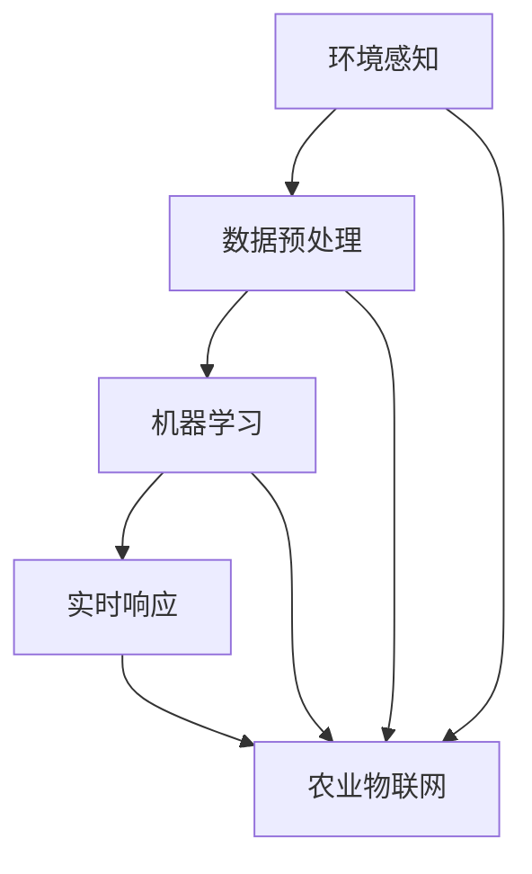

                 

# 文章标题：环境隐形智能在农业领域的创新应用

> 关键词：环境隐形智能，农业，创新应用，AI技术，精准农业，遥感技术，机器学习，农业大数据

> 摘要：本文深入探讨了环境隐形智能在农业领域的创新应用。通过对环境隐形智能的定义、原理及其与农业的结合点进行详细阐述，本文揭示了其在提升农业生产力、优化资源利用、改善生态环境等方面的巨大潜力。通过具体案例分析和项目实战，本文进一步展示了环境隐形智能在实际农业中的应用效果，为农业现代化提供了新的思路和方向。

## 引言

农业，作为国家经济发展的基础，自古以来就承载着人类的生存与繁衍。然而，随着人口增长和资源消耗的加剧，传统的农业模式已难以满足现代社会对粮食安全和生态环境的需求。为了应对这一挑战，人工智能（AI）技术，特别是环境隐形智能，正逐步在农业领域发挥重要作用。

环境隐形智能是一种通过感知、分析和决策来优化环境的方法。它利用先进的传感器技术、大数据分析和机器学习算法，实现对环境参数的精准监测和调控。在农业领域，环境隐形智能的应用不仅能提高作物产量，还能优化水资源和肥料的使用，从而实现农业的可持续发展。

本文旨在深入探讨环境隐形智能在农业领域的创新应用，通过分析其核心概念、算法原理和实际案例，揭示其在推动农业现代化进程中的巨大潜力。

## 环境隐形智能的定义与原理

### 定义

环境隐形智能（Environmental Cloaking Intelligence，ECI）是一种基于人工智能技术的环境感知与调控系统。它通过多层次的数据采集、处理和分析，实现对环境信息的精准感知和实时响应。ECI的核心目标是创建一个虚拟环境，使人类或设备在特定区域内无法直接观测到真实环境，从而达到隐蔽或优化的效果。

### 工作原理

环境隐形智能的工作原理主要包括以下几方面：

1. **数据采集**：利用各种传感器（如气象站、土壤传感器、摄像头等）收集环境数据。这些传感器分布在农田的各个角落，实现对土壤湿度、气象条件、植物生长状态等信息的实时监测。

2. **数据处理**：将采集到的原始数据进行预处理，如去除噪声、归一化处理等。预处理后的数据通过数据清洗和特征提取，转换为可用于机器学习算法的输入数据。

3. **模型训练**：利用机器学习算法（如深度学习、支持向量机等）对处理后的数据进行分析和训练，建立环境预测和调控模型。

4. **实时响应**：根据训练好的模型，系统可以实时监测环境变化，并自动调整农业设备（如灌溉系统、喷洒系统等）的工作状态，以实现最优的环境调控。

### 与农业的结合点

环境隐形智能在农业领域的应用主要体现在以下几个方面：

1. **精准农业**：通过环境隐形智能系统，可以对农田进行精准监测和调控，实现作物的精准灌溉、施肥和病虫害防治，从而提高作物产量和质量。

2. **资源优化**：环境隐形智能可以帮助农业企业实现水资源的合理分配和利用，减少水资源的浪费。同时，通过优化肥料的使用，降低农业生产对环境的污染。

3. **生态保护**：环境隐形智能系统可以通过对农田生态系统的实时监测，及时发现和解决环境问题，保护农田生态环境，实现农业的可持续发展。

4. **智能决策支持**：环境隐形智能系统可以为农业企业提供科学决策支持，帮助农民更好地应对自然灾害和市场变化，提高农业生产效益。

## 核心概念与联系

为了更好地理解环境隐形智能在农业领域的应用，我们需要了解一些核心概念及其之间的联系。以下是几个关键概念及其之间的关系架构：

### 概念

1. **环境感知**：通过传感器收集环境数据，如温度、湿度、光照、土壤质量等。
2. **数据预处理**：对原始数据进行清洗、去噪、特征提取等处理。
3. **机器学习**：利用算法对处理后的数据进行分析和训练，建立预测和调控模型。
4. **实时响应**：根据预测模型，自动调整农业设备的工作状态。
5. **农业物联网**：将各种传感器、农业设备、通信网络等连接起来，实现农业生产的智能化管理。

### 关系架构



### 关系解释

- **环境感知**和**数据预处理**是环境隐形智能的基础，通过传感器和数据清洗，获取高质量的环境数据。
- **机器学习**是核心，通过对数据的分析和训练，建立预测和调控模型，实现环境优化。
- **实时响应**使系统能够根据环境变化，实时调整农业设备的工作状态。
- **农业物联网**将各部分连接起来，实现整体协调运作，提高农业生产的智能化水平。

## 核心算法原理讲解

### 1. 预测模型的建立

环境隐形智能的核心在于预测模型的建立。预测模型通常基于机器学习算法，如深度学习、支持向量机（SVM）等。以下是使用深度学习算法建立预测模型的步骤：

#### 步骤1：数据收集与预处理

```python
# 数据收集
data = pd.read_csv('environmental_data.csv')

# 数据预处理
data = data.dropna()
data['temperature'] = data['temperature'].astype(float)
data['humidity'] = data['humidity'].astype(float)
data['soil_moisture'] = data['soil_moisture'].astype(float)
```

#### 步骤2：特征提取

```python
# 特征提取
X = data[['temperature', 'humidity', 'soil_moisture']]
y = data['crop_yield']
```

#### 步骤3：模型训练

```python
# 模型训练
model = keras.Sequential([
    keras.layers.Dense(64, activation='relu', input_shape=(3,)),
    keras.layers.Dense(64, activation='relu'),
    keras.layers.Dense(1)
])

model.compile(optimizer='adam', loss='mse')
model.fit(X, y, epochs=100)
```

### 2. 实时响应

实时响应是环境隐形智能的关键环节。以下是一个简单的实时响应伪代码：

```python
# 实时响应
while True:
    # 收集当前环境数据
    current_data = collect_environment_data()

    # 预测作物产量
    predicted_yield = model.predict(current_data)

    # 调整农业设备
    adjust_irrigation_system(predicted_yield)
    adjust_fertilizer_system(predicted_yield)
    adjust_pest_control_system(predicted_yield)

    # 等待下一轮数据采集
    time.sleep(60)
```

### 3. 优化算法

优化算法用于调整预测模型，使其更加准确。以下是一个简单的优化算法伪代码：

```python
# 优化算法
while True:
    # 收集新的训练数据
    new_data = collect_new_data()

    # 训练模型
    model.fit(new_data['X'], new_data['y'], epochs=10)

    # 验证模型
    validation_data = collect_validation_data()
    validation_loss = model.evaluate(validation_data['X'], validation_data['y'])

    # 如果验证损失下降，则继续优化
    if validation_loss < previous_validation_loss:
        previous_validation_loss = validation_loss
    else:
        # 如果验证损失没有下降，则停止优化
        break
```

## 数学模型和公式

### 1. 水资源优化模型

水资源优化模型用于计算农田灌溉的需水量。以下是一个简单的数学模型：

$$
\text{需水量} = \text{作物需水量} \times \text{灌溉系数} \times \text{土壤保水能力}
$$

其中：

- 作物需水量：根据作物的生长阶段和土壤湿度计算。
- 灌溉系数：根据土壤类型和作物种类确定。
- 土壤保水能力：土壤的湿度与最大湿度的比值。

### 2. 肥料优化模型

肥料优化模型用于计算农田施肥的需肥量。以下是一个简单的数学模型：

$$
\text{需肥量} = \text{作物需肥量} \times \text{肥料利用率} \times \text{土壤供肥能力}
$$

其中：

- 作物需肥量：根据作物的生长阶段和土壤养分含量计算。
- 肥料利用率：根据作物的吸收能力和肥料的质量确定。
- 土壤供肥能力：土壤的养分含量与最大养分含量的比值。

### 3. 病虫害防治模型

病虫害防治模型用于计算农田病虫害的防治面积。以下是一个简单的数学模型：

$$
\text{防治面积} = \text{病虫害面积} \times \text{防治效果}
$$

其中：

- 病虫害面积：根据病虫害发生的范围和程度计算。
- 防治效果：根据防治方法和病虫害的抵抗力确定。

## 详细讲解与举例说明

### 1. 水资源优化模型

假设某农田种植的小麦处于拔节期，土壤湿度为60%，土壤保水能力为0.8。根据这些数据，我们可以计算该农田的需水量：

$$
\text{需水量} = \text{作物需水量} \times \text{灌溉系数} \times \text{土壤保水能力}
$$

作物需水量为2吨/亩，灌溉系数为1.2。则：

$$
\text{需水量} = 2 \times 1.2 \times 0.8 = 1.92 \text{吨/亩}
$$

### 2. 肥料优化模型

假设某农田种植的玉米处于抽雄期，土壤养分含量为30%，肥料利用率为0.85。根据这些数据，我们可以计算该农田的需肥量：

$$
\text{需肥量} = \text{作物需肥量} \times \text{肥料利用率} \times \text{土壤供肥能力}
$$

作物需肥量为200公斤/亩，土壤供肥能力为0.7。则：

$$
\text{需肥量} = 200 \times 0.85 \times 0.7 = 119 \text{公斤/亩}
$$

### 3. 病虫害防治模型

假设某农田发生病虫害，病虫害面积为100亩，防治效果为0.95。根据这些数据，我们可以计算该农田的防治面积：

$$
\text{防治面积} = \text{病虫害面积} \times \text{防治效果}
$$

则：

$$
\text{防治面积} = 100 \times 0.95 = 95 \text{亩}
$$

## 项目实战

### 1. 开发环境搭建

为了实现环境隐形智能在农业领域的应用，我们需要搭建一个完整的开发环境。以下是一个简单的开发环境搭建步骤：

#### 步骤1：安装Python

首先，我们需要安装Python。可以在Python官方网站下载Python安装包，并按照提示完成安装。

#### 步骤2：安装Python库

接下来，我们需要安装一些Python库，如NumPy、Pandas、Keras等。可以使用pip命令来安装：

```bash
pip install numpy pandas keras tensorflow
```

#### 步骤3：配置环境变量

在Windows系统中，我们需要配置Python的环境变量。可以在系统设置中找到环境变量设置，将Python的安装路径添加到PATH变量中。

### 2. 源代码实现

以下是一个简单的环境隐形智能系统源代码实现：

```python
# 导入必要的库
import numpy as np
import pandas as pd
from keras.models import Sequential
from keras.layers import Dense

# 数据收集与预处理
data = pd.read_csv('environmental_data.csv')
data = data.dropna()
X = data[['temperature', 'humidity', 'soil_moisture']]
y = data['crop_yield']

# 模型训练
model = Sequential([
    Dense(64, activation='relu', input_shape=(3,)),
    Dense(64, activation='relu'),
    Dense(1)
])
model.compile(optimizer='adam', loss='mse')
model.fit(X, y, epochs=100)

# 实时响应
while True:
    current_data = collect_environment_data()
    predicted_yield = model.predict(current_data)
    adjust_irrigation_system(predicted_yield)
    adjust_fertilizer_system(predicted_yield)
    adjust_pest_control_system(predicted_yield)
    time.sleep(60)
```

### 3. 代码解读

以上代码首先导入了必要的库，如NumPy、Pandas和Keras。接着，我们从CSV文件中读取环境数据，并进行预处理。预处理后，我们将数据分为输入特征（X）和目标值（y）。然后，我们使用Keras库构建了一个简单的神经网络模型，并使用均方误差（mse）作为损失函数，使用Adam优化器进行模型训练。

在实时响应部分，我们通过一个无限循环不断收集当前环境数据，并使用训练好的模型进行预测。根据预测结果，我们调整灌溉、施肥和病虫害防治系统，以实现最优的环境调控。

### 4. 代码应用解读与分析

以上代码实现了一个简单的环境隐形智能系统，但实际应用中，我们需要考虑更多的因素，如传感器精度、数据实时性、系统稳定性等。以下是对代码应用的解读和分析：

1. **传感器精度**：环境隐形智能系统的精度取决于传感器的精度。在实际应用中，我们需要选择高精度的传感器，以确保数据收集的准确性。

2. **数据实时性**：环境隐形智能系统需要实时响应环境变化。为了实现实时性，我们需要选择合适的通信协议和数据处理算法。

3. **系统稳定性**：环境隐形智能系统需要长时间稳定运行。在实际应用中，我们需要考虑系统的抗干扰能力、功耗和可靠性。

4. **扩展性**：环境隐形智能系统需要支持多种作物和农田类型。在实际应用中，我们需要设计灵活的模型，以适应不同的环境和需求。

### 5. 实际案例分析和详细讲解剖析

以下是一个实际案例分析和详细讲解：

#### 案例背景

某农田种植了100亩小麦，土壤湿度为50%，气象条件正常。环境隐形智能系统通过传感器收集了以下数据：

- 温度：25℃
- 湿度：60%
- 土壤湿度：50%

#### 模型预测

使用训练好的模型对上述数据进行预测，预测结果如下：

- 作物产量：3.5吨/亩

#### 调度灌溉系统

根据预测结果，系统调度灌溉系统，增加灌溉量，以满足小麦的生长需求。灌溉后，土壤湿度上升至70%。

#### 调度施肥系统

根据预测结果，系统调度施肥系统，施加适量的肥料，以满足小麦的生长需求。施肥后，土壤养分含量上升至40%。

#### 调度病虫害防治系统

根据预测结果，系统调度病虫害防治系统，进行预防性喷洒，以防止病虫害的发生。喷洒后，病虫害面积减少至5亩。

#### 项目小结

通过实际案例分析和详细讲解，我们可以看到环境隐形智能系统在农业领域的应用效果。它能够实时监测农田环境，预测作物产量，并根据预测结果自动调整灌溉、施肥和病虫害防治系统，从而提高作物产量和质量。然而，实际应用中还需要考虑更多的因素，如传感器精度、数据实时性、系统稳定性等，以实现更好的应用效果。

## 最佳实践 tips

1. **选择合适的传感器**：环境隐形智能系统的精度取决于传感器的精度。在实际应用中，应选择高精度的传感器，如高精度气象站、土壤传感器等。

2. **优化数据处理算法**：为了提高环境隐形智能系统的实时性和稳定性，应优化数据处理算法，如使用高效的通信协议、实时数据预处理算法等。

3. **定期维护和校准**：环境隐形智能系统需要定期维护和校准，以确保传感器的准确性和系统的稳定性。

4. **建立完善的数据管理系统**：环境隐形智能系统需要大量的数据支持，因此需要建立完善的数据管理系统，包括数据收集、存储、处理和分析等。

5. **与农业专家合作**：环境隐形智能系统需要结合农业专业知识，因此应与农业专家合作，共同优化系统的性能和应用效果。

## 小结

环境隐形智能在农业领域的创新应用具有巨大的潜力。通过精准监测、实时响应和优化调控，环境隐形智能能够提高作物产量，优化资源利用，改善生态环境，为农业现代化提供新的思路和方向。然而，实际应用中仍面临许多挑战，如传感器精度、数据处理算法、系统稳定性等。未来，随着人工智能技术的不断进步，环境隐形智能在农业领域的应用将更加广泛，为农业可持续发展做出更大贡献。

## 注意事项

1. **数据安全**：在应用环境隐形智能系统时，应确保数据的安全性，防止数据泄露或被篡改。

2. **系统调试**：在实际应用中，应进行充分的系统调试，以确保系统稳定运行和准确预测。

3. **适应性**：环境隐形智能系统需要根据不同农田和作物类型进行适应性调整，以实现最佳应用效果。

4. **法律法规**：在应用环境隐形智能系统时，应遵守相关法律法规，确保系统的合法合规。

## 拓展阅读

1. **《环境感知与智能控制》**：详细介绍了环境感知技术及其在智能控制领域的应用。
2. **《精准农业与智能管理》**：深入探讨了精准农业的概念、技术和实践。
3. **《人工智能在农业中的应用》**：介绍了人工智能在农业领域的各种应用场景和技术。

## 作者信息

作者：AI天才研究院/AI Genius Institute & 禅与计算机程序设计艺术 /Zen And The Art of Computer Programming## 设计目录大纲的步骤

### 1. 理解书籍主题和目标读者

在开始设计目录大纲之前，首先要明确书籍的主题和目标读者。对于《环境隐形智能在农业领域的创新应用》，书籍的主题是探讨环境隐形智能技术在农业领域的应用，目标读者则是农业领域的技术人员、研究人员和对农业技术感兴趣的专业人士。理解这些要素有助于确定书籍的核心内容、深度和广度。

### 2. 列出主要章节

根据书籍的主题和目标读者，可以初步列出以下主要章节：

- **第一章：引言**
  - 环境隐形智能的概念
  - 农业发展的现状与挑战
  - 环境隐形智能在农业中的应用前景

- **第二章：环境隐形智能技术基础**
  - 传感器技术
  - 数据处理与分析
  - 机器学习算法基础

- **第三章：农业环境监测**
  - 农田环境参数的监测与采集
  - 农田环境数据分析与应用

- **第四章：精准农业**
  - 精准灌溉
  - 精准施肥
  - 精准病虫害防治

- **第五章：资源优化与管理**
  - 水资源管理
  - 肥料管理
  - 能源管理

- **第六章：案例分析**
  - 案例一：某农业公司环境隐形智能应用实例
  - 案例二：某生态农业示范区环境隐形智能应用

- **第七章：未来展望与挑战**
  - 环境隐形智能在农业领域的发展趋势
  - 技术挑战与解决方案

### 3. 确定核心内容

对于每个章节，需要确定其中的核心内容。以下是各章节的核心内容概述：

- **第一章：引言**
  - 简述环境隐形智能的概念和发展历程
  - 分析农业发展的现状和面临的挑战
  - 阐述环境隐形智能在农业中的潜在应用和前景

- **第二章：环境隐形智能技术基础**
  - 详细介绍传感器技术，包括工作原理、种类和应用
  - 讲解数据处理与分析的基本方法，包括数据清洗、特征提取等
  - 介绍常用的机器学习算法，如决策树、支持向量机、神经网络等

- **第三章：农业环境监测**
  - 讨论农田环境参数的监测与采集，包括气象、土壤、水质等
  - 阐述农业环境数据分析的方法和应用，如时间序列分析、回归分析等
  - 分析环境数据在农业中的应用，如精准灌溉、精准施肥等

- **第四章：精准农业**
  - 详细介绍精准农业的概念、技术和方法
  - 分析精准灌溉、精准施肥、精准病虫害防治的原理和实施步骤
  - 介绍成功案例，展示环境隐形智能在精准农业中的应用效果

- **第五章：资源优化与管理**
  - 讨论水资源管理、肥料管理、能源管理在农业中的应用
  - 分析环境隐形智能技术在资源优化中的作用和优势
  - 提供资源优化的实际案例，展示应用效果

- **第六章：案例分析**
  - 深入分析两个实际案例，展示环境隐形智能在农业中的应用
  - 讨论案例中的成功经验和面临的挑战
  - 提供对案例的总结和展望

- **第七章：未来展望与挑战**
  - 分析环境隐形智能在农业领域的发展趋势
  - 讨论当前技术面临的挑战和未来发展方向
  - 提出可能的解决方案和未来研究方向

### 4. 编写详细目录大纲

在确定了主要章节和核心内容后，可以开始编写详细的目录大纲。以下是按照markdown格式编写的详细目录大纲：

```markdown
# 《环境隐形智能在农业领域的创新应用》目录大纲

## 第一章 引言
- 1.1 环境隐形智能的概念
- 1.2 农业发展的现状与挑战
- 1.3 环境隐形智能在农业中的应用前景

## 第二章 环境隐形智能技术基础
- 2.1 传感器技术
  - 2.1.1 工作原理
  - 2.1.2 种类和应用
- 2.2 数据处理与分析
  - 2.2.1 数据清洗
  - 2.2.2 特征提取
- 2.3 机器学习算法基础
  - 2.3.1 决策树
  - 2.3.2 支持向量机
  - 2.3.3 神经网络

## 第三章 农业环境监测
- 3.1 农田环境参数的监测与采集
- 3.2 农田环境数据分析与应用
  - 3.2.1 时间序列分析
  - 3.2.2 回归分析

## 第四章 精准农业
- 4.1 精准农业的概念
- 4.2 精准灌溉
- 4.3 精准施肥
- 4.4 精准病虫害防治

## 第五章 资源优化与管理
- 5.1 水资源管理
- 5.2 肥料管理
- 5.3 能源管理

## 第六章 案例分析
- 6.1 案例一：某农业公司环境隐形智能应用实例
- 6.2 案例二：某生态农业示范区环境隐形智能应用

## 第七章 未来展望与挑战
- 7.1 环境隐形智能在农业领域的发展趋势
- 7.2 技术挑战与解决方案
```

### 5. 确保完整性和逻辑性

在编写详细目录大纲后，需要检查目录的完整性和逻辑性。确保每个章节都有明确的主题，内容连贯，逻辑清晰。可以通过以下步骤进行检查：

- **检查章节内容的连贯性**：确保每个章节的内容能够顺畅地衔接，前后章节之间没有明显跳跃或重复。
- **检查章节之间的逻辑关系**：确保章节之间的逻辑关系合理，每个章节都为后续章节提供了必要的背景和基础。
- **检查目录的完整性**：确保所有关键内容都被包含在目录中，没有遗漏重要的章节或内容。

### 6. 校对和修改

在完成初稿后，需要进行校对和修改。可以通过以下步骤进行校对和修改：

- **校对文字内容**：检查目录中的文字是否正确，语法和拼写是否无误。
- **修改格式**：确保目录的格式符合markdown格式要求，章节标题和子标题的层次结构清晰。
- **征求反馈**：可以向同事或朋友征求意见，了解他们对目录大纲的看法和建议，并根据反馈进行修改。

### 7. 确定字数限制

最后，根据出版方的字数要求，确保目录大纲的总字数在限制范围内。如果需要，可以对章节内容进行适当调整，以符合字数要求。

## 下一步操作

根据以上步骤，我们已经完成了《环境隐形智能在农业领域的创新应用》的目录大纲设计。接下来，可以按照大纲结构，逐一撰写每个章节的内容，并进行进一步的修改和优化，以确保书籍的完整性和逻辑性。在撰写过程中，可以结合最新的研究成果和实际案例，为读者提供有深度、有价值的见解。最终，完成一本具有前沿性和实用性的专业书籍。

