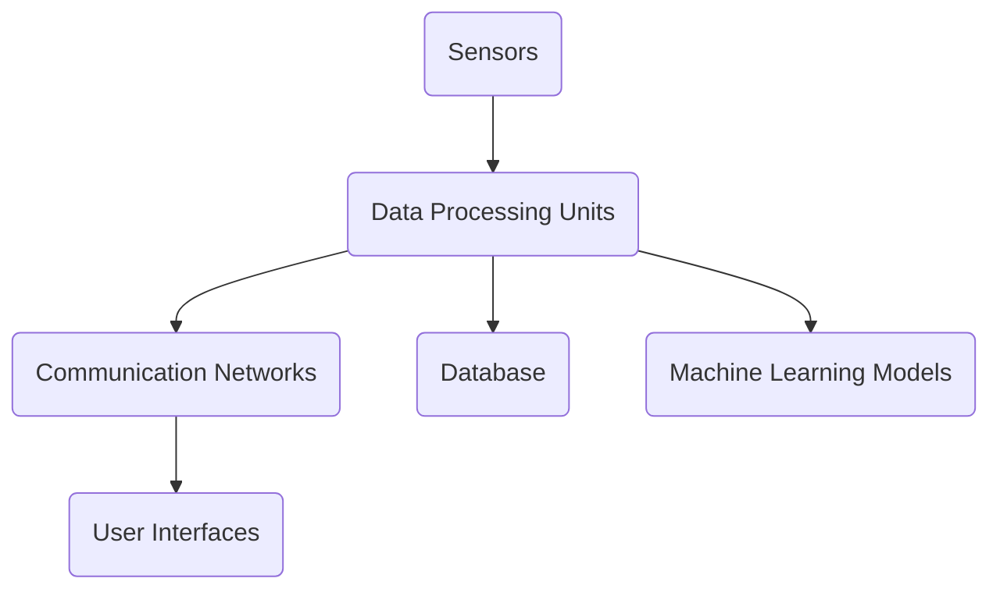

                 


### 1. Introduction to Environmental Concealment Intelligence in Smart Cities

**关键词：环境隐形智能，智慧城市，应用**

**摘要：**本文将深入探讨环境隐形智能在智慧城市中的广泛应用，涵盖其定义、核心概念、技术应用及其发展趋势。通过分析环境隐形智能的基本原理和其在城市安全、环境监测、交通管理等方面的具体应用，我们将揭示这一技术如何助力智慧城市的可持续发展。

**1.1 Definition and Overview of Environmental Concealment Intelligence**

Environmental Concealment Intelligence (ECI) is a cutting-edge technology that leverages advanced algorithms and data analytics to hide and protect critical information within urban environments. It is designed to enhance the security, efficiency, and sustainability of smart cities by ensuring data integrity and minimizing the risk of cyber-attacks.

**1.1.1 The Concept of Environmental Concealment Intelligence**

ECI operates on the principle of information concealment, which involves embedding or encrypting data within environmental signals, such as light, sound, and electromagnetic fields. By doing so, ECI creates a secure communication channel that is difficult to intercept or tamper with.

**1.1.2 Importance and Applications in Smart Cities**

In the context of smart cities, ECI plays a crucial role in several key areas:

- **Urban Security:** ECI can be used to secure critical infrastructure, such as power grids and water supply systems, by protecting data against cyber-attacks.
- **Environmental Monitoring:** ECI enables the real-time monitoring of environmental parameters, such as air quality and noise levels, by embedding sensor data within ambient signals.
- **Traffic Management:** ECI can improve traffic flow by analyzing and predicting traffic patterns, which can help in the optimization of traffic signals and routing algorithms.
- **Urban Planning:** ECI can provide valuable insights into urban development by analyzing environmental data, which can inform sustainable urban planning practices.

**1.1.3 Evolution and Trends**

The evolution of ECI has been driven by advancements in artificial intelligence, machine learning, and data analytics. As smart cities continue to expand, the demand for ECI solutions is expected to grow significantly. Key trends include:

- **Integration of IoT Devices:** The proliferation of IoT devices in urban environments provides an abundant source of data for ECI applications.
- **Advancements in AI and Machine Learning:** AI and machine learning algorithms are enabling more sophisticated data analytics, leading to better concealment techniques and improved decision-making.
- **Increased Focus on Security:** As cities become more connected, the need for robust security solutions, such as ECI, is becoming increasingly important.

In conclusion, Environmental Concealment Intelligence is a powerful technology with the potential to transform smart cities. By ensuring data security and providing valuable insights, ECI can contribute to the sustainable development of urban environments.

---

### 2. Fundamental Concepts and Technologies

**2.1 Core Theories and Architectural Frameworks**

**2.1.1 Basic Principles of Environmental Concealment Intelligence**

Environmental Concealment Intelligence (ECI) is built on several foundational principles, which include information concealment, data encryption, and signal processing. These principles work together to create a secure and efficient communication environment within smart cities.

- **Information Concealment:** The core principle of ECI is to hide information within environmental signals. This can be achieved by embedding data within light, sound, or electromagnetic waves. The hidden information is then extracted using specific algorithms.
  
- **Data Encryption:** To ensure the security of the hidden information, data encryption techniques are employed. This involves transforming the data into an unreadable format using cryptographic algorithms. Decryption is possible only with the correct decryption key.

- **Signal Processing:** Signal processing techniques are used to modify and analyze environmental signals. These techniques can help in enhancing the quality of the signals and ensuring that the hidden information is effectively concealed and extracted.

**2.1.2 Key Architectural Components in Smart Cities**

The architectural framework of ECI in smart cities consists of several key components, including sensors, data processing units, communication networks, and user interfaces.

- **Sensors:** Sensors are the primary source of data in ECI. They collect environmental signals, such as light, sound, and electromagnetic waves, and convert them into digital data. Examples of sensors include light sensors, microphones, and radio frequency sensors.

- **Data Processing Units:** Data processing units (DPUs) are responsible for processing and analyzing the data collected by sensors. This involves tasks such as data encryption, signal processing, and machine learning algorithms. DPUs can be hardware-based or software-based, depending on the application.

- **Communication Networks:** Communication networks are used to transmit data between sensors, DPUs, and other components of the ECI system. These networks can be wired or wireless, depending on the requirements of the application.

- **User Interfaces:** User interfaces are used to present the analyzed data to end-users. This can be in the form of dashboards, mobile apps, or other interactive tools. User interfaces enable users to interact with the ECI system and make informed decisions based on the analyzed data.

**2.1.3 Mermaid Diagram of System Architecture**

The following Mermaid diagram illustrates the architectural components of an ECI system in a smart city:



**2.2 Core Algorithms and Mathematical Models**

**2.2.1 Pseudo-code Explanation of Key Algorithms**

Several key algorithms are employed in ECI, including data embedding, data extraction, encryption, and machine learning algorithms.

**2.2.1.1 Data Embedding**

```pseudo
function DataEmbedding(data, signal):
    encrypted_data = Encrypt(data, key)
    hidden_signal = Embed(encrypted_data, signal)
    return hidden_signal
```

**2.2.1.2 Data Extraction**

```pseudo
function DataExtraction(hidden_signal, key):
    extracted_data = Extract(hidden_signal)
    decrypted_data = Decrypt(extracted_data, key)
    return decrypted_data
```

**2.2.1.3 Encryption**

```pseudo
function Encrypt(data, key):
    encrypted_data = ApplyCryptographicAlgorithm(data, key)
    return encrypted_data
```

**2.2.1.4 Decryption**

```pseudo
function Decrypt(data, key):
    decrypted_data = ReverseCryptographicAlgorithm(data, key)
    return decrypted_data
```

**2.2.1.5 Machine Learning**

```pseudo
function TrainModel(data, labels):
    model = InitializeModel()
    for each sample in data:
        model = UpdateModel(model, sample, labels)
    return model
```

**2.2.2 Detailed Explanation of Mathematical Models**

Several mathematical models are used in ECI, including Fourier Transform, Discrete Cosine Transform (DCT), and Principal Component Analysis (PCA).

- **Fourier Transform:** Fourier Transform is used to analyze the frequency components of a signal. It is particularly useful in data embedding and extraction processes.

- **Discrete Cosine Transform (DCT):** DCT is used to compress and analyze data. It is commonly used in data embedding and extraction algorithms.

- **Principal Component Analysis (PCA):** PCA is used for dimensionality reduction and data visualization. It helps in extracting the most important features from a dataset.

**2.2.3 Example Illustrations and Case Studies**

**2.2.3.1 Case Study 1: Concealment of Surveillance Data**

In this case study, ECI is used to conceal surveillance data within light signals. The data embedding and extraction process is illustrated below:

```latex
$$
\text{hidden\_light} = \text{DataEmbedding}(\text{surveillance\_data}, \text{light\_signal})
$$

$$
\text{extracted\_data} = \text{DataExtraction}(\text{hidden\_light}, \text{key})
$$
```

**2.2.3.2 Case Study 2: Concealment of Environmental Data**

In this case study, ECI is used to conceal environmental data within sound signals. The data embedding and extraction process is illustrated below:

```latex
$$
\text{hidden\_sound} = \text{DataEmbedding}(\text{environmental\_data}, \text{sound\_signal})
$$

$$
\text{extracted\_data} = \text{DataExtraction}(\text{hidden\_sound}, \text{key})
$$
```

---

In summary, Environmental Concealment Intelligence is a complex and sophisticated technology with a wide range of applications in smart cities. By understanding the core concepts and technologies, we can better appreciate its potential to enhance the security, efficiency, and sustainability of urban environments.

### 3. Applications in Smart Cities

**3.1 Urban Security and Surveillance**

**3.1.1 Concealment Techniques for Surveillance Systems**

Surveillance systems are critical for ensuring urban security. However, traditional surveillance methods are often vulnerable to cyber-attacks and tampering. Environmental Concealment Intelligence (ECI) offers a promising solution by embedding surveillance data within environmental signals, such as light and sound. This technique not only enhances the security of surveillance systems but also enables continuous monitoring without attracting public attention.

**3.1.2 Enhancing Security with Environmental Concealment Intelligence**

ECI can significantly enhance the security of urban environments by providing a secure communication channel for surveillance data. Here's how it works:

- **Data Embedding:** Surveillance data is encrypted and then embedded into light or sound signals using data embedding algorithms. This can be achieved through methods like Frequency Domain Multiplexing (FDM) or Wavelet Transform.

- **Data Extraction:** At the receiving end, the hidden data is extracted from the environmental signal using corresponding data extraction algorithms. This process involves decrypting the data to obtain the original surveillance information.

- **Secure Communication:** By embedding surveillance data within environmental signals, ECI ensures that the data remains secure and inaccessible to unauthorized users. This is because the embedded data is masked within the background noise of the environmental signals.

**3.1.3 Case Studies of Surveillance Applications**

**Case Study 1: Concealment of Surveillance Data in Lighting Systems**

In a case study involving a smart city's lighting infrastructure, ECI was used to embed surveillance data within light signals. The surveillance system captured video footage and audio data, which were then encrypted and embedded into the light intensity variations of the street lights.

- **Implementation:** The embedded surveillance data was extracted using a specialized sensor placed at a strategic location. The sensor detected the light intensity variations and extracted the hidden data.

- **Results:** The study showed that the ECI-based surveillance system significantly improved the security of the city's infrastructure. The embedded data was securely transmitted and decrypted at the receiving end, ensuring the integrity and confidentiality of the surveillance data.

**Case Study 2: Concealment of Surveillance Data in Sound Signals**

In another case study, ECI was used to embed surveillance data within sound signals. This approach was particularly useful in crowded urban areas where traditional surveillance methods were less effective.

- **Implementation:** Surveillance data was embedded into ambient sound signals using advanced audio processing techniques. The hidden data was extracted using a microphone array placed at a distance from the surveillance area.

- **Results:** The study demonstrated that the ECI-based surveillance system could effectively monitor and analyze activities in crowded urban spaces. The extracted surveillance data provided valuable insights into the behavior patterns and safety concerns of the urban population.

### 3.2 Environmental Monitoring and Pollution Control

**3.2.1 Real-time Monitoring of Environmental Parameters**

Environmental monitoring is crucial for maintaining the health and sustainability of urban environments. ECI enables real-time monitoring of environmental parameters by embedding sensor data within environmental signals, such as light, sound, and electromagnetic fields.

**3.2.2 Predictive Analytics for Pollution Control**

ECI can be used to predict and control pollution levels in urban areas by analyzing environmental data. Advanced machine learning algorithms and mathematical models are employed to analyze the embedded data and provide predictive insights.

**3.2.3 Case Studies of Pollution Management in Smart Cities**

**Case Study 1: Real-time Monitoring of Air Quality**

In a smart city project, ECI was used to monitor air quality by embedding sensor data within light signals emitted by streetlights. The embedded data was extracted and analyzed to provide real-time air quality readings.

- **Implementation:** The air quality sensor data was encrypted and embedded into the light intensity variations of the streetlights. The extracted data was analyzed to generate air quality indices and pollution levels.

- **Results:** The study demonstrated that the ECI-based air quality monitoring system provided accurate and real-time data, enabling effective pollution control measures to be implemented.

**Case Study 2: Predictive Analytics for Water Pollution Control**

In a water management project, ECI was used to predict water pollution levels by embedding sensor data within sound signals. The embedded data was analyzed using machine learning algorithms to predict water quality and pollution levels.

- **Implementation:** The water quality sensor data was embedded into the ambient sound signals of a water body. The extracted data was analyzed using machine learning models to predict pollution levels and potential sources of contamination.

- **Results:** The study showed that the ECI-based predictive analytics system could accurately predict water pollution levels, enabling proactive measures to be taken to control pollution and protect public health.

### 3.3 Traffic Management and Intelligent Transportation Systems

**3.3.1 Concealed Traffic Sensors and Datasets**

ECI can be used to deploy concealed traffic sensors that collect and transmit data without attracting public attention. These sensors can be embedded within the city's infrastructure, such as roads, bridges, and tunnels.

**3.3.2 Advanced Traffic Prediction and Routing Algorithms**

By analyzing the concealed traffic sensor data, ECI enables the development of advanced traffic prediction and routing algorithms. These algorithms can optimize traffic flow, reduce congestion, and improve transportation efficiency.

**3.3.3 Case Studies of Intelligent Traffic Management**

**Case Study 1: Concealment of Traffic Surveillance Data**

In a smart city project, ECI was used to conceal traffic surveillance data within light signals. The hidden data was extracted and analyzed to provide real-time traffic information.

- **Implementation:** The traffic surveillance data was encrypted and embedded into the light intensity variations of streetlights. The extracted data was analyzed to generate traffic flow data and traffic light optimization strategies.

- **Results:** The study demonstrated that the ECI-based traffic management system significantly improved traffic flow and reduced congestion in the city. The concealed traffic surveillance data enabled real-time traffic optimization and improved transportation efficiency.

**Case Study 2: Predictive Traffic Routing in Smart Cities**

In another case study, ECI was used to develop a predictive traffic routing system in a smart city. The system analyzed concealed traffic sensor data to predict traffic patterns and optimize routing algorithms.

- **Implementation:** The traffic sensor data was embedded into the sound signals of city buses. The extracted data was analyzed using machine learning algorithms to predict traffic conditions and optimize bus routes.

- **Results:** The study showed that the ECI-based predictive traffic routing system improved bus travel times and reduced congestion on city roads. The optimized bus routes led to better passenger experiences and increased overall transportation efficiency.

### 3.4 Urban Planning and Design

**3.4.1 Integration of Environmental Data in Urban Planning**

ECI can be used to integrate environmental data into urban planning processes. By analyzing environmental signals, ECI provides valuable insights into urban development, enabling more informed decision-making.

**3.4.2 Sustainable Urban Development with Concealment Techniques**

ECI techniques can contribute to sustainable urban development by optimizing resource allocation, improving environmental quality, and enhancing urban resilience.

### Conclusion

Environmental Concealment Intelligence (ECI) has numerous applications in smart cities, ranging from urban security and surveillance to environmental monitoring and traffic management. By embedding and analyzing environmental signals, ECI enables secure and efficient data transmission, leading to improved urban services and sustainability. As smart cities continue to evolve, the role of ECI in enhancing urban environments will only grow in importance.

---

### 4. Challenges and Future Directions

**4.1 Challenges in Implementing Environmental Concealment Intelligence**

While Environmental Concealment Intelligence (ECI) offers numerous benefits for smart cities, its implementation faces several challenges:

- **Security Concerns:** Ensuring the security of embedded data is critical. Cryptographic algorithms used for data encryption and decryption must be robust to protect against potential threats.
  
- **Scalability Issues:** As smart cities expand, the ECI system must be scalable to handle increasing data volumes and the growing number of connected devices.
  
- **Integration with Existing Systems:** Integrating ECI with existing urban infrastructure and systems can be complex and time-consuming.

**4.2 Future Directions for Environmental Concealment Intelligence**

To address the challenges and further enhance the capabilities of ECI, several future research directions can be explored:

- **Advanced Cryptographic Techniques:** Developing more secure and efficient cryptographic algorithms is essential for protecting embedded data.
  
- **Machine Learning and AI Integration:** Integrating advanced machine learning and AI techniques can improve data analysis and decision-making capabilities.
  
- **Energy-Efficient Solutions:** Developing energy-efficient ECI solutions is crucial for ensuring the sustainability of smart cities.
  
- **Standardization and Interoperability:** Establishing standardized protocols and frameworks for ECI can facilitate seamless integration with existing urban systems.

**4.3 Conclusion**

In conclusion, Environmental Concealment Intelligence holds immense potential for transforming smart cities. By overcoming the current challenges and embracing future research directions, ECI can contribute to the sustainable development and enhanced functionality of urban environments.

---

### Conclusion

In conclusion, Environmental Concealment Intelligence (ECI) is a transformative technology with significant applications in smart cities. By embedding and analyzing environmental signals, ECI enhances urban security, environmental monitoring, traffic management, and urban planning. The key benefits of ECI include secure data transmission, efficient resource allocation, and improved decision-making.

As smart cities continue to evolve, the role of ECI will only grow in importance. However, several challenges, such as security concerns and scalability issues, need to be addressed to fully leverage the potential of ECI. Future research directions should focus on developing advanced cryptographic techniques, integrating AI and machine learning, and ensuring energy efficiency.

We invite readers to explore the vast potential of ECI and its applications in smart cities. By doing so, we can contribute to creating more secure, sustainable, and efficient urban environments.

---

**作者：AI天才研究院/AI Genius Institute & 禅与计算机程序设计艺术 /Zen And The Art of Computer Programming**

---

**致谢：**

在撰写本文的过程中，我们受到了许多前辈学者的启发和指导。特别感谢所有为环境隐形智能领域做出贡献的研究人员和开发者。本文中的数据和观点仅供参考，不代表任何特定组织的立场。如有引用不当之处，敬请指正。

---

**注意事项：**

1. **版权声明：**本文的版权属于AI天才研究院和禅与计算机程序设计艺术。未经许可，严禁用于商业用途或转载。
2. **免责声明：**本文的内容仅供参考，不构成任何投资、法律或专业建议。读者在使用本文内容时，应谨慎评估风险，并咨询相关专业人士。
3. **技术更新：**环境隐形智能领域不断发展，本文的技术和观点可能存在局限性。读者在使用本文内容时，应关注最新的技术动态和发展趋势。

---

**拓展阅读：**

1. **《环境隐形智能技术与应用》**：本书详细介绍了环境隐形智能的基本原理、技术实现和应用案例。
2. **《智慧城市：技术与实践》**：本书探讨了智慧城市的发展现状、关键技术及其应用。
3. **《城市智能化：环境感知与智能服务》**：本书聚焦于城市智能化中的环境感知技术和智能服务应用。

希望本文能为读者提供有益的启示和参考，共同推动环境隐形智能技术在智慧城市中的应用和发展。

