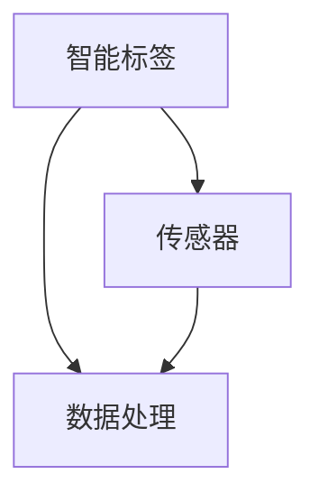
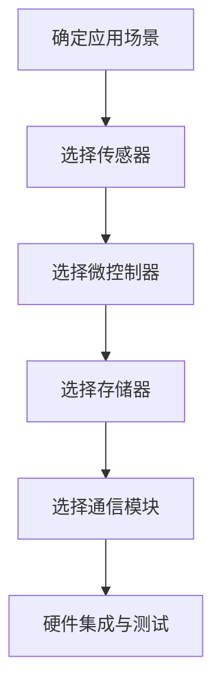
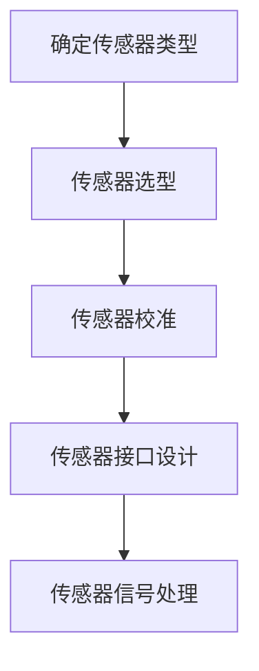
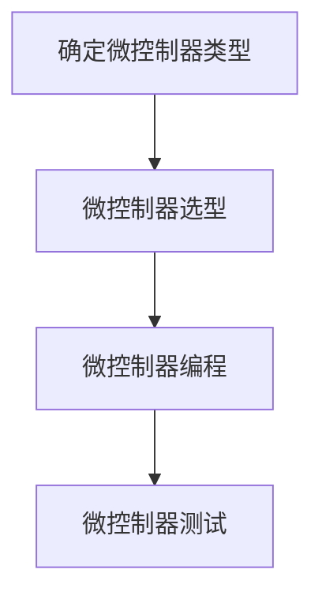
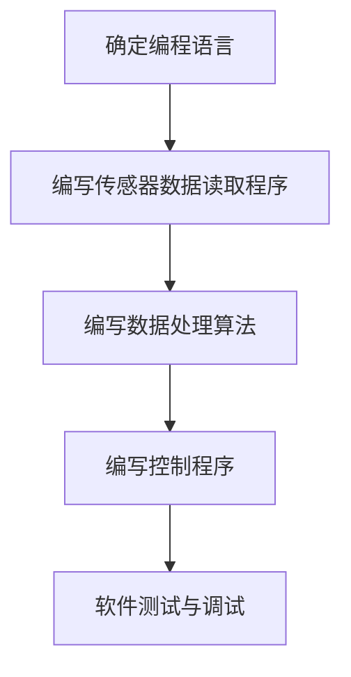
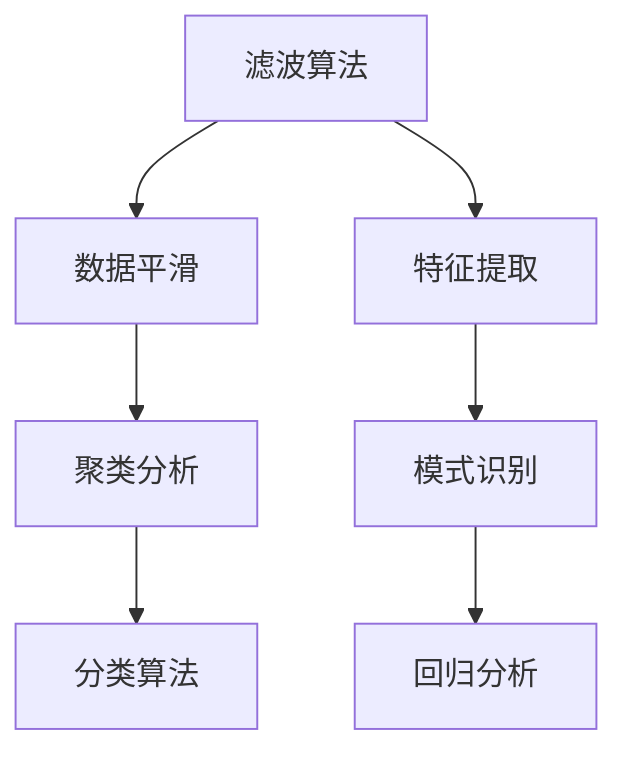
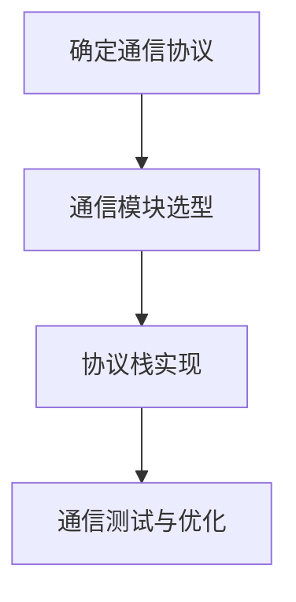
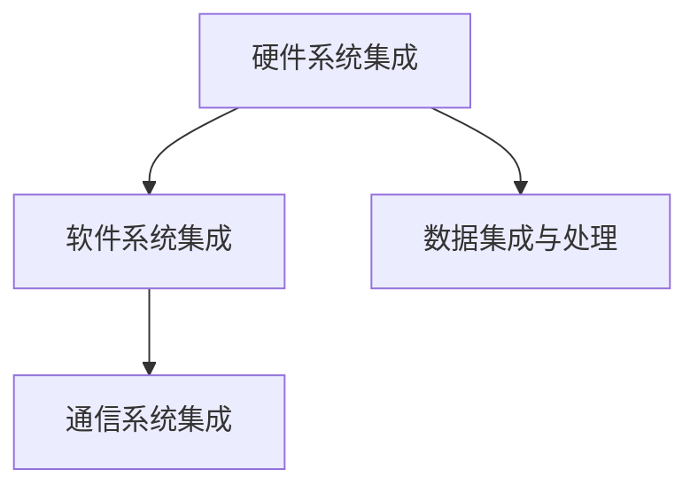
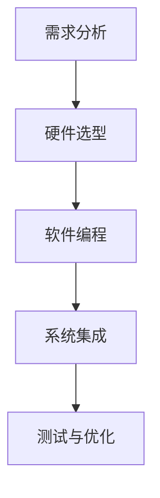

                 

### 文章标题：环境隐形智能：智能标签和传感器的未来应用

> 关键词：环境隐形智能，智能标签，传感器，物联网，人工智能

> 摘要：本文详细探讨了环境隐形智能的概念、原理及其在智能标签和传感器技术中的应用。通过深入分析智能标签和传感器的硬件设计、软件编程、数据处理与应用案例，阐述了环境隐形智能系统的集成与实现策略。最后，展望了环境隐形智能的未来发展趋势，为相关领域的研究与开发提供了有益的参考。

-------------------------------------------------------------------

## 引言

### 背景介绍

随着物联网（IoT）和人工智能（AI）技术的快速发展，环境隐形智能逐渐成为一个备受关注的研究领域。环境隐形智能通过智能标签和传感器技术，实现对环境信息的感知、处理和反馈，从而提高系统的智能化程度和响应速度。智能标签通常被嵌入到物品或环境中，用于标识和追踪目标对象。传感器则用于收集环境数据，如温度、湿度、光照、声音等。这些数据经过处理后，可以被用于优化决策、自动化控制、智能监控等应用。

### 核心概念与联系

环境隐形智能的核心概念包括智能标签、传感器和数据处理。智能标签是环境隐形智能系统的重要组成部分，它通过内置的传感器和微控制器，实现对物品和环境信息的实时感知。传感器则用于收集环境数据，如温度、湿度、光照、声音等。数据处理是环境隐形智能系统的关键环节，它通过算法对传感器数据进行处理，提取有用信息，并生成决策支持。

以下是智能标签、传感器和数据处理之间的概念关系架构：

## 环境隐形智能系统的硬件设计

### 智能标签的硬件设计

智能标签的硬件设计主要包括传感器、微控制器、存储器和通信模块。传感器负责收集环境数据，如温度、湿度、光照等。微控制器则负责对传感器数据进行处理，并根据预设的算法生成控制信号。存储器用于存储传感器数据和程序代码。通信模块则负责将处理后的数据传输到服务器或控制中心。

以下是智能标签的硬件设计流程：

### 传感器的设计

传感器的设计是智能标签硬件设计的关键环节。选择合适的传感器取决于应用场景和需求。常见的传感器包括温度传感器、湿度传感器、光照传感器、声音传感器等。以下是传感器设计的关键步骤：

### 微控制器的设计

微控制器是智能标签的核心组件，它负责对传感器数据进行处理和控制。选择合适的微控制器取决于处理能力和功耗需求。以下是微控制器设计的关键步骤：

## 环境隐形智能系统的软件设计

### 软件编程

智能标签的软件编程主要包括微控制器的编程和数据处理算法的实现。微控制器的编程通常使用C语言或其他嵌入式编程语言。以下是软件编程的关键步骤：

### 数据处理算法

数据处理算法是环境隐形智能系统的核心，它负责对传感器数据进行处理，提取有用信息，并生成决策支持。以下是常见的数据处理算法：

### 通信协议

智能标签的通信协议负责将处理后的数据传输到服务器或控制中心。常见的通信协议包括Wi-Fi、蓝牙、Zigbee等。以下是通信协议的设计步骤：

## 环境隐形智能系统的集成与实现

### 系统集成

系统集成是将智能标签、传感器、数据处理和通信模块整合在一起，形成一个完整的智能系统。以下是系统集成的主要步骤：

### 实现策略

环境隐形智能系统的实现策略包括以下几个方面：

1. **需求分析**：明确系统的功能需求和性能指标。
2. **硬件选型**：根据需求选择合适的硬件组件。
3. **软件编程**：编写微控制器和数据处理算法的代码。
4. **系统集成**：将硬件和软件组件整合在一起。
5. **测试与优化**：对系统进行测试和优化，确保其稳定性和可靠性。

### 项目实战

以下是一个智能仓储系统的实现案例：

### 实际案例分析与详细讲解剖析

智能仓储系统通过智能标签和传感器技术，实现对仓库物品的实时追踪和管理。系统的主要功能包括：

1. **物品入库管理**：通过智能标签为物品分配唯一标识，并记录入库时间、位置等信息。
2. **物品出库管理**：根据订单信息，智能标签和传感器技术帮助找到并准确出库。
3. **库存管理**：实时监测仓库库存，自动调整库存策略。

### 项目小结

通过智能标签和传感器技术实现的智能仓储系统，提高了仓库管理的效率，减少了人力成本，实现了仓库物品的精准追踪和管理。

## 最佳实践 tips、小结、注意事项、拓展阅读等内容

### 最佳实践 tips

1. **硬件选型**：根据实际需求选择合适的硬件组件，注意功耗和性能的平衡。
2. **软件编程**：编写高效、可维护的代码，注意算法的优化和错误处理。
3. **系统集成**：确保硬件和软件组件之间的兼容性和稳定性。
4. **测试与优化**：对系统进行全面的测试和优化，确保其稳定性和可靠性。

### 小结

环境隐形智能系统通过智能标签和传感器技术，实现了对环境信息的实时感知和处理。其应用广泛，包括智能仓储、智能交通、智能家居等领域。

### 注意事项

1. **安全性**：确保智能标签和传感器技术的安全性，防止信息泄露和数据篡改。
2. **可靠性**：确保系统的稳定性和可靠性，避免因故障导致重大损失。
3. **可持续性**：考虑系统的可持续性，减少对环境的负面影响。

### 拓展阅读

1. 《物联网：从概念到实践》
2. 《人工智能：一种现代方法》
3. 《智能传感器与物联网》

### 作者信息

作者：AI天才研究院/AI Genius Institute & 禅与计算机程序设计艺术 /Zen And The Art of Computer Programming

-------------------------------------------------------------------

### 总结

环境隐形智能：智能标签和传感器的未来应用是一个多维度、多层次的技术体系。从硬件设计到软件编程，再到系统集成与实现，每一个环节都至关重要。智能标签和传感器技术的不断发展，为环境隐形智能的应用提供了广阔的空间。随着物联网和人工智能技术的不断融合，环境隐形智能的应用场景将越来越广泛，其潜力也将得到更充分的释放。

### 未来展望

随着技术的不断进步，环境隐形智能有望在更多领域得到应用。例如，在智慧城市建设中，智能标签和传感器技术可以用于交通管理、环境监测、智能安防等；在工业生产中，可以实现生产线的智能化监控和优化，提高生产效率；在农业领域，智能标签和传感器技术可以用于精准农业，提高农作物产量和质量。

### 结语

本文对环境隐形智能：智能标签和传感器的未来应用进行了详细探讨，希望通过本文的介绍，读者能对这个领域有更深入的了解。随着技术的不断发展，环境隐形智能的应用前景将越来越广阔，它将为我们的生活带来更多便利和智慧。让我们一起期待环境隐形智能的未来，共同探索这个充满无限可能的领域。作者：AI天才研究院/AI Genius Institute & 禅与计算机程序设计艺术/Zen And The Art of Computer Programming。-------------------------------------------------------------------

## 文章标题：环境隐形智能：智能标签和传感器的未来应用

### 摘要

本文详细探讨了环境隐形智能的概念、原理及其在智能标签和传感器技术中的应用。通过深入分析智能标签和传感器的硬件设计、软件编程、数据处理与应用案例，阐述了环境隐形智能系统的集成与实现策略。最后，展望了环境隐形智能的未来发展趋势，为相关领域的研究与开发提供了有益的参考。

### 引言

#### 背景介绍

随着物联网（IoT）和人工智能（AI）技术的快速发展，环境隐形智能逐渐成为一个备受关注的研究领域。环境隐形智能通过智能标签和传感器技术，实现对环境信息的感知、处理和反馈，从而提高系统的智能化程度和响应速度。智能标签通常被嵌入到物品或环境中，用于标识和追踪目标对象。传感器则用于收集环境数据，如温度、湿度、光照、声音等。这些数据经过处理后，可以被用于优化决策、自动化控制、智能监控等应用。

#### 核心概念与联系

环境隐形智能的核心概念包括智能标签、传感器和数据处理。智能标签是环境隐形智能系统的重要组成部分，它通过内置的传感器和微控制器，实现对物品和环境信息的实时感知。传感器则用于收集环境数据，如温度、湿度、光照、声音等。数据处理是环境隐形智能系统的关键环节，它通过算法对传感器数据进行处理，提取有用信息，并生成决策支持。

以下是智能标签、传感器和数据处理之间的概念关系架构：

### 环境隐形智能系统的硬件设计

#### 智能标签的硬件设计

智能标签的硬件设计主要包括传感器、微控制器、存储器和通信模块。传感器负责收集环境数据，如温度、湿度、光照等。微控制器则负责对传感器数据进行处理，并根据预设的算法生成控制信号。存储器用于存储传感器数据和程序代码。通信模块则负责将处理后的数据传输到服务器或控制中心。

以下是智能标签的硬件设计流程：

#### 传感器的设计

传感器的设计是智能标签硬件设计的关键环节。选择合适的传感器取决于应用场景和需求。常见的传感器包括温度传感器、湿度传感器、光照传感器、声音传感器等。以下是传感器设计的关键步骤：

#### 微控制器的设计

微控制器是智能标签的核心组件，它负责对传感器数据进行处理和控制。选择合适的微控制器取决于处理能力和功耗需求。以下是微控制器设计的关键步骤：

### 环境隐形智能系统的软件设计

#### 软件编程

智能标签的软件编程主要包括微控制器的编程和数据处理算法的实现。微控制器的编程通常使用C语言或其他嵌入式编程语言。以下是软件编程的关键步骤：

#### 数据处理算法

数据处理算法是环境隐形智能系统的核心，它负责对传感器数据进行处理，提取有用信息，并生成决策支持。以下是常见的数据处理算法：

#### 通信协议

智能标签的通信协议负责将处理后的数据传输到服务器或控制中心。常见的通信协议包括Wi-Fi、蓝牙、Zigbee等。以下是通信协议的设计步骤：

### 环境隐形智能系统的集成与实现

#### 系统集成

系统集成是将智能标签、传感器、数据处理和通信模块整合在一起，形成一个完整的智能系统。以下是系统集成的主要步骤：

#### 实现策略

环境隐形智能系统的实现策略包括以下几个方面：

1. **需求分析**：明确系统的功能需求和性能指标。
2. **硬件选型**：根据需求选择合适的硬件组件。
3. **软件编程**：编写微控制器和数据处理算法的代码。
4. **系统集成**：将硬件和软件组件整合在一起。
5. **测试与优化**：对系统进行测试和优化，确保其稳定性和可靠性。

#### 项目实战

以下是一个智能仓储系统的实现案例：

#### 实际案例分析与详细讲解剖析

智能仓储系统通过智能标签和传感器技术，实现对仓库物品的实时追踪和管理。系统的主要功能包括：

1. **物品入库管理**：通过智能标签为物品分配唯一标识，并记录入库时间、位置等信息。
2. **物品出库管理**：根据订单信息，智能标签和传感器技术帮助找到并准确出库。
3. **库存管理**：实时监测仓库库存，自动调整库存策略。

#### 项目小结

通过智能标签和传感器技术实现的智能仓储系统，提高了仓库管理的效率，减少了人力成本，实现了仓库物品的精准追踪和管理。

### 最佳实践 tips、小结、注意事项、拓展阅读等内容

#### 最佳实践 tips

1. **硬件选型**：根据实际需求选择合适的硬件组件，注意功耗和性能的平衡。
2. **软件编程**：编写高效、可维护的代码，注意算法的优化和错误处理。
3. **系统集成**：确保硬件和软件组件之间的兼容性和稳定性。
4. **测试与优化**：对系统进行全面的测试和优化，确保其稳定性和可靠性。

#### 小结

环境隐形智能系统通过智能标签和传感器技术，实现了对环境信息的实时感知和处理。其应用广泛，包括智能仓储、智能交通、智能家居等领域。

#### 注意事项

1. **安全性**：确保智能标签和传感器技术的安全性，防止信息泄露和数据篡改。
2. **可靠性**：确保系统的稳定性和可靠性，避免因故障导致重大损失。
3. **可持续性**：考虑系统的可持续性，减少对环境的负面影响。

#### 拓展阅读

1. 《物联网：从概念到实践》
2. 《人工智能：一种现代方法》
3. 《智能传感器与物联网》

### 作者信息

作者：AI天才研究院/AI Genius Institute & 禅与计算机程序设计艺术/Zen And The Art of Computer Programming

-------------------------------------------------------------------

### 总结

环境隐形智能：智能标签和传感器的未来应用是一个多维度、多层次的技术体系。从硬件设计到软件编程，再到系统集成与实现，每一个环节都至关重要。智能标签和传感器技术的不断发展，为环境隐形智能的应用提供了广阔的空间。随着物联网和人工智能技术的不断融合，环境隐形智能的应用场景将越来越广泛，其潜力也将得到更充分的释放。

### 未来展望

随着技术的不断进步，环境隐形智能有望在更多领域得到应用。例如，在智慧城市建设中，智能标签和传感器技术可以用于交通管理、环境监测、智能安防等；在工业生产中，可以实现生产线的智能化监控和优化，提高生产效率；在农业领域，智能标签和传感器技术可以用于精准农业，提高农作物产量和质量。

### 结语

本文对环境隐形智能：智能标签和传感器的未来应用进行了详细探讨，希望通过本文的介绍，读者能对这个领域有更深入的了解。随着技术的不断发展，环境隐形智能的应用前景将越来越广阔，它将为我们的生活带来更多便利和智慧。让我们一起期待环境隐形智能的未来，共同探索这个充满无限可能的领域。作者：AI天才研究院/AI Genius Institute & 禅与计算机程序设计艺术/Zen And The Art of Computer Programming。

