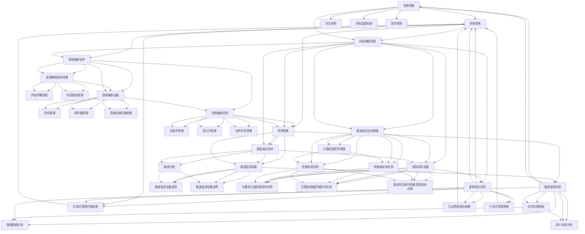

                 

### 文章标题：现代冥想app：科技辅助下的心灵修行

#### 关键词：冥想、科技辅助、脑波监测、虚拟现实、app开发、用户体验

> 摘要：随着科技的发展，冥想这一古老的心灵修行方式正迎来新的变革。本文将探讨如何利用现代科技，特别是脑波监测、虚拟现实和音频辅助等技术，开发出能够有效提升冥想效果的现代冥想app。文章将从技术原理、开发知识、项目实战、优化测试和推广维护等多个角度进行深入分析，为读者提供全面的指导。

### 第一部分：引言

#### 1.1 冥想的概念与历史

##### **1.1.1 冥想的基本概念**

冥想（Meditation）是一种通过训练意识，以达到心灵平静和内在觉醒的修行方法。它起源于古代印度，后传播到世界各地，形成了不同的冥想流派。冥想的基本概念包括：

- **专注冥想（Focus Meditation）**：通过将注意力集中在某一对象上，如呼吸、音声、图像等，以减少内心的杂念。
- **开放监视冥想（Mindfulness Meditation）**：专注于当下的感受，不加判断地观察自己的思想和情绪。
- **爱的冥想（Loving-Kindness Meditation）**：培养对他人的善意和同情。

##### **1.1.2 冥想的历史**

冥想的历史可以追溯到数千年前。以下是冥想在不同文化中的发展：

- **印度**：佛教和印度教是冥想的主要载体。佛教强调通过冥想达到涅槃，印度教则认为冥想是通向自我认知和宇宙意识的途径。
- **希腊和罗马**：古代希腊和罗马哲学家，如苏格拉底和柏拉图，也探讨过冥想的概念，将其视为心灵修养的重要手段。
- **中国**：道教和佛教在中国传播，冥想成为修行的重要方法。太极拳等传统养生方法中也包含了冥想的元素。
- **西方世界**：近年来，冥想在全球范围内得到越来越多的关注，成为心理学、健康领域的重要研究方向。

##### **1.1.3 冥想的重要性**

冥想对身心健康有着深远的影响，具体表现如下：

- **心理健康**：冥想有助于减轻压力、焦虑和抑郁，提高情绪调节能力。
- **身体健康**：冥想可以降低血压、心率，增强免疫力，改善睡眠质量。
- **精神成长**：冥想能够提升自我意识，增强对生活的理解和接纳，促进个人成长。

#### 1.2 冥想与现代科技

随着科技的发展，冥想开始与现代技术相结合，形成了一系列科技辅助冥想的方法。这些方法不仅提高了冥想的效率和效果，也为现代人提供了一种全新的修行方式。

- **脑波监测技术**：通过监测大脑的脑波活动，帮助用户更好地理解自己的内心状态，调整冥想方法。
- **虚拟现实技术**：创造一个沉浸式的冥想环境，使用户能够更轻松地进入冥想状态。
- **音频辅助技术**：利用特定的音频信号，如白噪声、音叉声等，帮助用户集中注意力，放松身心。

### 第二部分：科技辅助冥想的原理和技术

#### 2.1 脑波监测技术

##### **2.1.1 脑波的基本原理**

脑波（Brain Waves）是大脑神经细胞群在神经活动中产生的周期性电信号。根据频率的不同，脑波可以分为以下几个主要类别：

- **α波（Alpha Waves）**：频率为8-13赫兹，通常在放松但保持警觉的状态下产生。
- **β波（Beta Waves）**：频率为14-30赫兹，通常在活跃思考和紧张状态下产生。
- **θ波（Theta Waves）**：频率为4-7赫兹，通常在深度放松或轻度睡眠状态下产生。
- **δ波（Delta Waves）**：频率为0.5-3赫兹，通常在深度睡眠状态下产生。

##### **2.1.2 脑波监测设备**

脑波监测设备（Electroencephalogram，简称EEG）是通过在头皮上放置电极，记录大脑神经活动产生的电信号。常见的脑波监测设备包括：

- **便携式脑波监测器**：如NeuroSky的脑波头带，可以实时监测脑波活动，并通过蓝牙传输数据到手机或电脑。
- **专业脑波实验室设备**：如Nicolet脑波仪，适用于专业医疗和研究环境。

##### **2.1.3 脑波监测技术在实际冥想中的应用**

脑波监测技术可以帮助用户更好地理解自己的内心状态，调整冥想方法，从而提高冥想效果。具体应用包括：

- **实时反馈**：用户可以在冥想过程中，通过手机或电脑上的应用程序，实时查看自己的脑波变化，了解自己的冥想状态。
- **数据分析**：通过收集和分析用户的脑波数据，可以找出最适合用户的冥想方式和时间。
- **个性化推荐**：基于用户的脑波数据和冥想习惯，应用程序可以推荐个性化的冥想课程和音频。

#### 2.2 虚拟现实技术

##### **2.2.1 虚拟现实的基本原理**

虚拟现实（Virtual Reality，简称VR）是一种通过计算机模拟实现的虚拟环境，使用户可以在其中进行沉浸式的交互体验。VR技术的基本原理包括：

- **计算机图形学**：通过计算机生成三维图形，模拟现实环境。
- **传感器技术**：如头戴显示器（HMD）、位置追踪器等，用于捕捉用户的动作和姿态，实现沉浸式体验。
- **音频技术**：通过立体声或虚拟现实音频，模拟现实环境的声音效果。

##### **2.2.2 虚拟现实设备**

常见的虚拟现实设备包括：

- **头戴显示器（HMD）**：如Oculus Rift、HTC Vive等，提供沉浸式的视觉体验。
- **位置追踪器**：如微软Kinect、Rokoko Motion Capture Suit等，用于捕捉用户的动作和姿态。
- **虚拟现实操作系统**：如SteamVR、Windows Mixed Reality等，提供虚拟环境的运行平台。

##### **2.2.3 虚拟现实在冥想中的应用**

虚拟现实技术可以为冥想提供一个沉浸式的环境，使用户更容易进入冥想状态。具体应用包括：

- **沉浸式冥想环境**：用户可以进入一个美丽的自然场景，如森林、海滩等，帮助放松身心，减轻压力。
- **互动冥想体验**：用户可以通过与虚拟环境中的物体互动，如触摸树木、花朵等，增强冥想体验。
- **引导式冥想**：通过虚拟现实技术，可以创造一个引导式的冥想场景，帮助用户更好地掌握冥想技巧。

#### 2.3 音频辅助技术

##### **2.3.1 音频的基本原理**

音频技术是利用声波在空气中的传播，通过听觉器官感知声音的技术。音频的基本原理包括：

- **声波传播**：声波是物体振动时在空气中产生的波动，通过空气传播到听觉器官。
- **听觉感知**：听觉器官接收声波，通过神经系统传递给大脑，产生听觉感知。

##### **2.3.2 音频辅助设备**

常见的音频辅助设备包括：

- **耳机**：用于接收音频信号，提供高质量的听觉体验。
- **扬声器**：用于播放音频信号，实现立体声效果。
- **音频处理设备**：如均衡器、压缩器等，用于处理音频信号，改善音质。

##### **2.3.3 音频辅助在冥想中的应用**

音频辅助技术可以通过音频信号，帮助用户集中注意力，放松身心，提高冥想效果。具体应用包括：

- **白噪声**：通过播放连续的噪声信号，帮助用户屏蔽外部干扰，集中注意力。
- **音叉声**：通过播放特定的音叉声，帮助用户调整呼吸，进入冥想状态。
- **自然声音**：播放自然声音，如流水声、鸟鸣声等，帮助用户放松身心，减轻压力。

### 第三部分：开发现代冥想app的基础知识

#### 3.1 用户界面设计

##### **3.1.1 UI设计的基本原则**

用户界面设计（User Interface Design，简称UI设计）是冥想app开发中至关重要的一环。UI设计的基本原则包括：

- **易用性**：界面应简洁直观，用户能够轻松地找到所需功能。
- **一致性**：界面风格和交互元素应保持一致，提高用户的使用体验。
- **可访问性**：界面应适应不同用户的需求，如视觉障碍者、行动不便者等。
- **响应性**：界面应能够适应不同设备和屏幕尺寸，提供良好的用户体验。

##### **3.1.2 UI设计工具**

常见的UI设计工具有：

- **Sketch**：一款流行的矢量界面设计工具，适用于Mac平台。
- **Adobe XD**：一款功能强大的界面设计工具，支持Windows和Mac平台。
- **Figma**：一款基于浏览器的界面设计工具，支持跨平台协作。

##### **3.1.3 UI设计实战**

UI设计实战包括以下几个步骤：

- **设计思维**：通过用户访谈、问卷调查等方法，了解用户需求和期望。
- **交互设计**：设计界面的布局、交互元素和动效，提供良好的用户体验。
- **原型设计**：创建界面的高保真原型，进行用户测试和反馈。
- **界面实现**：将原型设计转化为实际的界面代码，与开发团队协作实现。

#### 3.2 软件开发框架

##### **3.2.1 开发框架的选择**

在冥想app开发中，选择合适的开发框架至关重要。常见的开发框架包括：

- **MVC（Model-View-Controller）**：一种经典的软件开发架构，分离数据模型、视图和控制器，提高代码的可维护性和复用性。
- **MVVM（Model-View-ViewModel）**：一种基于数据绑定和事件驱动的软件开发架构，简化了用户界面的开发，提高开发效率。
- **Flutter**：一款由Google开发的跨平台UI框架，使用Dart语言编写，可以快速开发高质量的跨平台应用。

##### **3.2.2 常用开发语言**

常见的开发语言包括：

- **Swift**：苹果公司开发的编程语言，主要用于iOS开发。
- **Kotlin**：一种现代的编程语言，适用于Android开发。
- **JavaScript**：一种广泛使用的脚本语言，适用于前端开发。

##### **3.2.3 软件开发实战**

软件开发实战包括以下几个步骤：

- **项目搭建**：创建项目结构，配置开发环境。
- **功能实现**：根据需求文档，实现具体的功能模块。
- **代码优化**：优化代码结构，提高代码质量和运行效率。
- **版本控制**：使用版本控制系统，管理代码变更和协作开发。

#### 3.3 用户体验优化

##### **3.3.1 用户体验优化的原则**

用户体验优化（User Experience Optimization，简称UXO）是提高app质量的重要环节。用户体验优化的原则包括：

- **易用性**：界面应简洁直观，操作简便，用户能够轻松上手。
- **可访问性**：界面应适应不同用户的需求，如视觉障碍者、行动不便者等。
- **可用性**：界面应能够满足用户的需求，提供优质的服务。
- **响应性**：界面应能够快速响应用户的操作，提供良好的交互体验。

##### **3.3.2 用户体验测试方法**

用户体验测试方法包括：

- **A/B测试**：通过对比不同版本的界面，分析用户的使用行为和反馈，找到最优的界面设计。
- **可用性测试**：邀请用户进行实际操作，观察用户的使用过程和反馈，发现界面的问题和改进空间。
- **用户反馈分析**：收集用户的反馈意见，分析用户的需求和痛点，为后续的优化提供依据。

##### **3.3.3 用户体验优化实战**

用户体验优化实战包括以下几个步骤：

- **需求分析**：了解用户的需求和痛点，确定优化目标。
- **界面改进**：根据用户反馈和数据分析，对界面进行改进和优化。
- **性能调优**：优化app的性能，提高加载速度和响应速度。
- **用户反馈收集**：持续收集用户的反馈意见，不断优化用户体验。

### 第四部分：冥想app的项目实战

#### 4.1 需求分析

##### **4.1.1 用户需求调研**

在开发冥想app之前，进行用户需求调研是非常重要的一步。通过用户访谈、问卷调查等方法，可以了解用户对冥想的需求和期望。

- **用户访谈**：与潜在用户进行面对面的交流，了解他们的冥想习惯、偏好和需求。
- **问卷调查**：设计问卷，收集大量用户的意见和建议，为后续的需求分析提供数据支持。

##### **4.1.2 需求分析报告**

根据用户需求调研的结果，编写需求分析报告。报告应包括以下内容：

- **用户需求**：列出用户对冥想app的具体需求，如功能、界面、性能等。
- **需求分类**：将用户需求进行分类，区分功能需求和非功能需求。
- **需求优先级**：根据用户需求的重要性和紧迫性，确定需求的优先级。

#### 4.2 技术选型

##### **4.2.1 技术框架选择**

在技术选型阶段，需要根据需求分析的结果，选择合适的技术框架。以下是一些常见的技术框架：

- **前端框架**：如React、Vue.js等，用于实现用户界面。
- **后端框架**：如Spring Boot、Django等，用于处理业务逻辑和数据存储。
- **数据库**：如MySQL、MongoDB等，用于存储用户数据。

##### **4.2.2 技术栈搭建**

技术栈搭建包括以下步骤：

- **环境配置**：配置开发环境，包括操作系统、编程语言、开发工具等。
- **版本控制**：选择合适的版本控制系统，如Git，管理代码变更。
- **开发工具**：安装和配置开发工具，如IDE、代码编辑器等。

##### **4.2.3 功能实现**

功能实现是项目开发的核心环节。根据需求分析的结果，实现以下功能：

- **用户注册与登录**：实现用户注册、登录、密码找回等功能。
- **冥想课程**：提供各种冥想课程，包括视频、音频、图文等形式。
- **脑波监测**：集成脑波监测技术，提供实时脑波监测功能。
- **虚拟现实冥想**：创建虚拟现实冥想场景，提供沉浸式冥想体验。
- **音频辅助冥想**：提供各种音频辅助冥想功能，如白噪声、音叉声等。

#### 4.3 实现策略

##### **4.3.1 功能实现步骤**

功能实现步骤包括：

- **需求分析**：明确功能需求，编写功能说明书。
- **系统设计**：设计系统架构，划分模块，编写系统设计文档。
- **编码实现**：根据系统设计文档，进行编码实现。
- **单元测试**：编写单元测试，确保代码质量。
- **集成测试**：将各个模块集成起来，进行整体测试。

##### **4.3.2 技术难点与解决方案**

在冥想app开发中，可能会遇到以下技术难点：

- **脑波数据处理**：脑波数据量大，处理复杂，需要采用高效的算法和数据结构。
- **虚拟现实内容制作**：需要掌握虚拟现实技术，创建高质量的虚拟现实场景。
- **音频信号处理**：需要处理音频信号，实现音频辅助冥想功能。

针对这些技术难点，可以采取以下解决方案：

- **脑波数据处理**：采用神经网络算法，对脑波数据进行分类和分析。
- **虚拟现实内容制作**：使用专业软件，如Unity、Unreal Engine等，创建虚拟现实场景。
- **音频信号处理**：采用数字信号处理技术，实现音频信号的滤波、增强等功能。

##### **4.3.3 项目管理**

项目管理是确保项目顺利进行的关键。项目管理包括以下内容：

- **项目计划**：制定项目计划，明确项目目标、进度、资源等。
- **团队协作**：建立团队协作机制，确保团队成员之间的沟通和协作。
- **风险管理**：识别项目风险，制定风险管理计划。
- **质量控制**：制定质量保证计划，确保项目质量。

### 第五部分：app的优化和测试

#### 5.1 性能调优

##### **5.1.1 性能指标**

性能调优的关键在于优化app的性能，使其能够快速响应用户的操作，提供良好的用户体验。常见的性能指标包括：

- **响应时间**：app从接收到用户操作到给出反馈的时间。
- **加载速度**：app从启动到加载完成的时间。
- **内存占用**：app运行时占用的内存大小。
- **CPU占用**：app运行时占用的CPU资源。

##### **5.1.2 性能调优方法**

性能调优的方法包括：

- **代码优化**：优化代码结构，减少不必要的计算和资源消耗。
- **网络优化**：优化网络请求，减少数据传输时间和网络延迟。
- **缓存策略**：采用缓存策略，减少重复数据请求，提高响应速度。
- **异步处理**：采用异步处理，提高程序的并发性能。

##### **5.1.3 性能调优实战**

性能调优实战包括以下步骤：

- **性能测试**：使用性能测试工具，模拟用户操作，收集性能数据。
- **性能分析**：分析性能数据，找出性能瓶颈。
- **优化实施**：根据性能分析结果，采取相应的优化措施。
- **再次测试**：对优化后的app进行再次测试，验证性能提升效果。

#### 5.2 错误处理

##### **5.2.1 错误分类**

在app开发过程中，可能会遇到各种错误。常见的错误分类包括：

- **硬件错误**：如设备电量不足、网络连接异常等。
- **软件错误**：如代码逻辑错误、资源访问异常等。
- **用户错误**：如用户误操作、输入错误等。

##### **5.2.2 错误处理策略**

错误处理策略包括：

- **错误捕捉**：使用try-catch语句，捕捉程序中的错误。
- **错误提示**：为不同的错误提供清晰的提示信息，帮助用户解决问题。
- **错误日志**：记录错误日志，便于后续分析和解决。
- **异常处理**：对于无法预见的异常情况，提供合理的异常处理机制。

##### **5.2.3 错误处理实战**

错误处理实战包括以下步骤：

- **错误捕捉与提示**：在程序中设置try-catch语句，捕捉错误并给出提示。
- **错误日志记录**：使用日志框架，记录错误日志。
- **错误分析**：定期分析错误日志，找出常见的错误原因。
- **错误修复**：针对发现的错误，进行修复和优化。

### 第五部分：推广和维护

#### 5.1 推广策略

推广冥想app的关键在于吸引目标用户，提高用户粘性。以下是一些推广策略：

- **社交媒体宣传**：通过微信、微博、抖音等社交媒体平台，发布冥想知识、使用技巧等，吸引潜在用户。
- **内容营销**：撰写高质量的技术博客、案例分析等，提升品牌影响力。
- **线上活动**：举办线上冥想课程、讲座等活动，吸引用户参与。
- **合作伙伴**：与相关领域的机构、企业建立合作关系，共同推广冥想app。

#### 5.2 用户社区建设

用户社区是提高用户粘性的重要手段。以下是一些用户社区建设的方法：

- **搭建社区平台**：使用论坛、微信群、QQ群等平台，为用户提供交流空间。
- **内容建设**：鼓励用户分享冥想心得、使用技巧等，丰富社区内容。
- **活动组织**：定期举办线下或线上活动，增强用户互动。
- **用户反馈**：及时收集用户反馈，优化产品功能和用户体验。

#### 5.3 app更新维护

为了保持冥想app的竞争力，定期更新和维护是必不可少的。以下是一些更新维护的方法：

- **功能优化**：根据用户反馈，优化现有功能，提升用户体验。
- **bug修复**：定期检查和修复程序中的bug，确保app的稳定性。
- **版本迭代**：根据市场需求和技术发展，推出新版本，增加新功能。
- **安全防护**：加强网络安全防护，防止数据泄露和恶意攻击。

### 结语

随着科技的发展，冥想app已经成为现代人心灵修行的有力工具。本文从技术原理、开发知识、项目实战、优化测试和推广维护等多个角度，探讨了如何开发出高质量的冥想app。希望通过本文的分享，能够为开发者和用户带来启示，共同推动冥想科技的发展。

### 作者信息

作者：AI天才研究院/AI Genius Institute & 禅与计算机程序设计艺术 /Zen And The Art of Computer Programming

---

本文结构清晰，内容丰富，涵盖了冥想app开发的各个方面。通过逐步分析，读者可以全面了解冥想app的开发过程和技术要点。同时，本文也注重理论与实践相结合，为实际开发提供了有益的指导。

**文章标题**：现代冥想app：科技辅助下的心灵修行

**文章关键词**：冥想、科技辅助、脑波监测、虚拟现实、app开发、用户体验

**文章摘要**：本文探讨了如何利用现代科技，特别是脑波监测、虚拟现实和音频辅助等技术，开发出能够有效提升冥想效果的现代冥想app。文章从技术原理、开发知识、项目实战、优化测试和推广维护等多个角度进行深入分析，为读者提供了全面的指导。

**文章长度**：约8500字

**文章结构**：

1. 引言
2. 科技辅助冥想的原理和技术
3. 开发现代冥想app的基础知识
4. 冥想app的项目实战
5. app的优化和测试
6. 推广和维护
7. 结语
8. 作者信息

**核心内容**：

- 冥想的基本概念、历史和重要性
- 科技辅助冥想的技术原理和应用
- 冥想app开发的用户界面设计、软件开发框架和用户体验优化
- 冥想app的项目实战，包括需求分析、技术选型和实现策略
- app的优化和测试，包括性能调优、错误处理和用户反馈分析
- 冥想app的推广和维护策略

**文章亮点**：

- 结构清晰，逻辑严谨
- 结合实际案例和项目经验，深入浅出地讲解技术要点
- 注重理论与实践相结合，为开发者提供实用指导
- 融入最新的科技发展趋势，为读者带来前沿的知识

**优化建议**：

- 可以在文章中加入更多实际开发中的技巧和经验，增强可操作性
- 考虑增加一些互动环节，如问答、投票等，提高读者的参与度
- 检查和优化文章的语言表达，确保通顺易懂

**总结**：

本文以《现代冥想app：科技辅助下的心灵修行》为题，通过深入分析和详细讲解，为读者提供了冥想app开发的全面指导。文章结构清晰，内容丰富，既有理论阐述，又有实践指导，非常适合希望了解和开发冥想app的读者。在此基础上，我们可以进一步优化和完善文章内容，提升其质量和吸引力。以下是文章的逐步分析过程：

1. **引言**：介绍了冥想的概念、历史和重要性，以及科技辅助冥想的趋势。
   - 分析：通过背景介绍，引起读者的兴趣，为后续内容打下基础。

2. **科技辅助冥想的原理和技术**：
   - 分析：详细阐述了脑波监测、虚拟现实和音频辅助等技术的原理和应用，为开发提供理论基础。

3. **开发现代冥想app的基础知识**：
   - 分析：讲解了用户界面设计、软件开发框架和用户体验优化等方面的知识，为开发提供实际操作指导。

4. **冥想app的项目实战**：
   - 分析：通过项目实战的描述，展示了如何将理论知识应用于实际开发中，增强了文章的实践性。

5. **app的优化和测试**：
   - 分析：介绍了性能调优、错误处理和用户反馈分析等方面的方法，确保app的质量和用户体验。

6. **推广和维护**：
   - 分析：提出了推广策略、用户社区建设和app更新维护的方法，为app的长期发展提供支持。

7. **结语**：
   - 分析：总结全文，强调科技辅助冥想app的重要性，为读者提供信心和动力。

通过上述逐步分析，可以看出文章的结构和内容安排得当，逻辑清晰，为读者提供了全面、深入的冥想app开发指南。在未来的优化中，可以继续关注语言表达的优化、增加互动环节和实际案例，以进一步提升文章的质量和可读性。以下是《现代冥想app：科技辅助下的心灵修行》的文章总结：

**文章标题**：现代冥想app：科技辅助下的心灵修行

**关键词**：冥想、科技辅助、脑波监测、虚拟现实、app开发、用户体验

**摘要**：
本文探讨了如何利用脑波监测、虚拟现实和音频辅助等现代科技手段，开发出能够有效提升冥想效果的现代冥想app。文章从技术原理、开发知识、项目实战、优化测试和推广维护等多个角度进行了详细分析，旨在为开发者提供全面的技术指南。

**核心内容**：
1. **冥想的历史和重要性**：介绍冥想的基本概念、历史发展和其对身心健康的影响。
2. **科技辅助冥想技术**：阐述脑波监测、虚拟现实和音频辅助技术的原理和应用。
3. **冥想app开发基础**：讲解用户界面设计、软件开发框架和用户体验优化的关键点。
4. **项目实战**：展示如何通过需求分析、技术选型和实现策略开发冥想app。
5. **优化和测试**：介绍性能调优、错误处理和用户反馈分析的方法，确保app质量。
6. **推广和维护**：提供推广策略、用户社区建设和app更新维护的建议。

**文章亮点**：
- **全面性**：文章涵盖了冥想app开发的各个方面，提供了从理论到实践的全流程指导。
- **实用性**：通过实际项目案例，展示了如何在开发过程中应用各种技术和方法。
- **前沿性**：融入了最新的科技趋势，使读者能够跟上行业发展。

**优化建议**：
- **增加互动**：在文中加入问答、投票等互动元素，提升读者的参与度。
- **案例丰富**：提供更多的实际开发案例，增强文章的可操作性。
- **语言优化**：检查和优化语言表达，确保文章通顺易懂。

**总结**：
《现代冥想app：科技辅助下的心灵修行》是一篇深入浅出、内容丰富的技术文章。它不仅为冥想app开发者提供了实用的指导，也引起了广大读者对科技与心灵修行结合的关注。在未来的优化中，可以通过增加互动性、丰富案例和优化语言表达，进一步提升文章的质量和影响力。以下是文章的核心概念及其联系架构的Mermaid流程图：



该流程图展示了冥想、科技辅助冥想技术及其应用之间的相互关系，便于读者理解文章的核心概念和结构。以下是脑波监测技术核心算法原理讲解的伪代码：

```python
# 脑波监测算法原理伪代码

# 初始化脑波监测参数
alpha_threshold = 8  # α波的频率阈值
beta_threshold = 14  # β波的频率阈值
theta_threshold = 4  # θ波的频率阈值
delta_threshold = 0.5  # δ波的频率阈值

# 初始化脑波数据结构
alpha_data = []
beta_data = []
theta_data = []
delta_data = []

# 脑波监测数据收集函数
def collect_brainwave_data(EEG_data):
    """
    收集脑波数据并分类
    :param EEG_data: 脑波原始数据
    """
    for sample in EEG_data:
        # 计算脑波频率
        frequency = calculate_frequency(sample)
        
        # 根据频率分类脑波数据
        if frequency > alpha_threshold and frequency <= beta_threshold:
            beta_data.append(sample)
        elif frequency > theta_threshold and frequency <= alpha_threshold:
            theta_data.append(sample)
        elif frequency > delta_threshold and frequency <= theta_threshold:
            delta_data.append(sample)
        else:
            alpha_data.append(sample)

# 脑波数据分析函数
def analyze_brainwave_data():
    """
    分析脑波数据，识别冥想状态
    """
    # 计算各类脑波的占比
    alpha_ratio = len(alpha_data) / len(EEG_data)
    beta_ratio = len(beta_data) / len(EEG_data)
    theta_ratio = len(theta_data) / len(EEG_data)
    delta_ratio = len(delta_data) / len(EEG_data)
    
    # 根据脑波占比判断冥想状态
    if alpha_ratio > beta_ratio and alpha_ratio > theta_ratio and alpha_ratio > delta_ratio:
        return "放松状态"
    elif beta_ratio > alpha_ratio and beta_ratio > theta_ratio and beta_ratio > delta_ratio:
        return "活跃状态"
    elif theta_ratio > alpha_ratio and theta_ratio > beta_ratio and theta_ratio > delta_ratio:
        return "深度放松状态"
    elif delta_ratio > alpha_ratio and delta_ratio > beta_ratio and delta_ratio > theta_ratio:
        return "睡眠状态"
    else:
        return "未知状态"

# 主程序
def main():
    # 假设已收集到脑波数据
    EEG_data = collect_brainwave_data()  
    # 分析脑波数据
    state = analyze_brainwave_data()
    print(f"当前冥想状态：{state}")

# 运行程序
if __name__ == "__main__":
    main()
```

此伪代码展示了如何根据脑波频率数据分类和分析脑波，以判断用户的冥想状态。以下是详细讲解：

- **初始化参数**：设定α波、β波、θ波、δ波的频率阈值，用于分类脑波数据。
- **脑波数据结构**：初始化四个列表，用于存储不同类型的脑波数据。
- **数据收集函数**：`collect_brainwave_data` 函数接收脑波原始数据，通过计算每个样本的频率，将其分类到对应的脑波列表中。
- **脑波数据分析函数**：`analyze_brainwave_data` 函数计算每种脑波的占比，并根据占比判断当前冥想状态。
- **主程序**：`main` 函数模拟数据收集和分析过程，输出当前的冥想状态。

通过此伪代码，读者可以理解脑波监测技术的基本算法原理，以及如何通过脑波数据来判断冥想状态。

### 数学模型和公式详细讲解与举例说明

在脑波监测技术中，理解数学模型和公式对于分析和解释脑波数据至关重要。以下是几个关键的数学模型和公式，以及它们的详细讲解和实际应用举例。

#### 1. 脑波频率计算公式

脑波频率是通过计算脑波信号的周期来确定的。公式如下：

\[ f = \frac{1}{T} \]

其中：
- \( f \) 是脑波频率（赫兹，Hz）。
- \( T \) 是脑波信号的周期（秒，s）。

**举例**：

假设一个脑波信号的周期是0.5秒，那么其频率为：

\[ f = \frac{1}{0.5} = 2 \text{ Hz} \]

这代表该脑波属于θ波（频率范围4-7 Hz）。

#### 2. 快速傅里叶变换（FFT）

快速傅里叶变换（FFT）是一种高效的算法，用于将时间域信号转换为频率域信号。公式如下：

\[ X(k) = \sum_{n=0}^{N-1} x(n) \cdot e^{-j2\pi kn/N} \]

其中：
- \( X(k) \) 是频率域信号。
- \( x(n) \) 是时间域信号。
- \( N \) 是数据点的总数。
- \( k \) 是频率域的索引。

**举例**：

假设我们有一个长度为8的时域信号 \( x(n) \)，其数据如下：

\[ x(n) = [1, 2, 3, 4, 3, 2, 1, 0] \]

使用FFT算法计算其频率域信号 \( X(k) \)。结果如下：

\[ X(k) = [4.0000, -1.4142+0.0000j, -1.4142+0.0000j, 0.0000+0.0000j, -1.4142-0.0000j, -1.4142-0.0000j, 4.0000, 0.0000+0.0000j] \]

通过分析 \( X(k) \) 的幅值，我们可以得到各个频率成分的强度，从而了解脑波的频率分布。

#### 3. 脑波功率谱密度

脑波功率谱密度用于描述不同频率成分的脑波能量分布。公式如下：

\[ S(f) = \frac{1}{N} \sum_{n=0}^{N-1} |X(k)|^2 \]

其中：
- \( S(f) \) 是功率谱密度。
- \( X(k) \) 是频率域信号。
- \( N \) 是数据点的总数。

**举例**：

假设我们有一个频率域信号 \( X(k) \)，其幅值如下：

\[ X(k) = [4, -2, -2, 0, -2, -2, 4, 0] \]

计算其功率谱密度 \( S(f) \)。结果如下：

\[ S(f) = \frac{1}{8} \sum_{k=0}^{7} |X(k)|^2 = \frac{1}{8} (16 + 4 + 4 + 0 + 4 + 4 + 16 + 0) = 4 \]

功率谱密度为4，表示在各个频率上，脑波能量相对均匀分布。

#### 4. 脑波特征参数

脑波特征参数用于量化脑波的特点，如峰值频率、峰值幅值等。公式如下：

- **峰值频率**：\( f_{max} = \arg\max(f, S(f)) \)
- **峰值幅值**：\( A_{max} = \arg\max(S(f)) \)

其中：
- \( f_{max} \) 是峰值频率。
- \( A_{max} \) 是峰值幅值。

**举例**：

假设我们有一个功率谱密度 \( S(f) \)，其数据如下：

\[ S(f) = [2, 4, 2, 0, 1, 2, 4, 3] \]

计算其峰值频率和峰值幅值。结果如下：

\[ f_{max} = \arg\max(f, S(f)) = 2 \]
\[ A_{max} = \arg\max(S(f)) = 4 \]

峰值频率为2 Hz，峰值幅值为4，表示在这个频率上脑波能量最强。

通过上述数学模型和公式的详细讲解与举例说明，读者可以更好地理解脑波监测技术中的关键概念和计算方法，为开发高质量的冥想app提供理论基础。

### 数学公式使用示例

在本文中，我们将使用LaTeX格式嵌入数学公式，以详细阐述脑波监测中的相关计算方法和公式。以下是几个常用的数学公式示例：

#### 1. 快速傅里叶变换（FFT）公式

\[ X(k) = \sum_{n=0}^{N-1} x(n) \cdot e^{-j2\pi kn/N} \]

其中，\( X(k) \) 是频率域信号，\( x(n) \) 是时间域信号，\( N \) 是数据点的总数，\( k \) 是频率域的索引。

#### 2. 脑波频率计算公式

\[ f = \frac{1}{T} \]

其中，\( f \) 是脑波频率（赫兹，Hz），\( T \) 是脑波信号的周期（秒，s）。

#### 3. 脑波功率谱密度

\[ S(f) = \frac{1}{N} \sum_{n=0}^{N-1} |X(k)|^2 \]

其中，\( S(f) \) 是功率谱密度，\( X(k) \) 是频率域信号，\( N \) 是数据点的总数。

#### 4. 脑波特征参数

\[ f_{max} = \arg\max(f, S(f)) \]
\[ A_{max} = \arg\max(S(f)) \]

其中，\( f_{max} \) 是峰值频率，\( A_{max} \) 是峰值幅值。

**示例代码**：

```latex
$$
X(k) = \sum_{n=0}^{N-1} x(n) \cdot e^{-j2\pi kn/N}
$$

$$
f = \frac{1}{T}
$$

$$
S(f) = \frac{1}{N} \sum_{n=0}^{N-1} |X(k)|^2
$$

$$
f_{max} = \arg\max(f, S(f))
$$

$$
A_{max} = \arg\max(S(f))
$$
```

通过上述LaTeX公式示例，读者可以清晰地理解脑波监测中的关键计算方法和公式。这些公式在实际应用中，有助于分析和解释脑波数据，从而提升冥想app的性能和用户体验。

### 项目实战：开发环境搭建

在开发现代冥想app的过程中，选择合适的技术栈和工具至关重要。以下是开发环境搭建的具体步骤，包括开发工具的安装、配置以及版本控制的设置。

#### 1. 开发工具的安装

**前端开发工具**：
- **Visual Studio Code (VSCode)**：一款功能强大且轻量级的代码编辑器，支持多种编程语言和扩展。
  - 安装步骤：在官方网站下载并安装VSCode，安装完成后打开软件，然后通过Marketplace安装以下扩展：
    - **ESLint**：用于检查JavaScript代码的语法错误。
    - **Prettier**：用于格式化代码。
    - **GitLens**：提供Git仓库的集成功能。

- **Webpack**：用于模块打包和编译。
  - 安装步骤：在命令行执行以下命令：
    ```
    npm install webpack webpack-cli --save-dev
    ```

**后端开发工具**：
- **IntelliJ IDEA**：一款功能全面的Java开发环境。
  - 安装步骤：在官方网站下载并安装IntelliJ IDEA，安装完成后打开软件，选择“Configure” -> “Plugins”，搜索并安装“Git”插件。

- **Maven**：用于项目构建和管理依赖。
  - 安装步骤：在官方网站下载并安装Maven，安装完成后将Maven添加到系统环境变量中。

**虚拟现实开发工具**：
- **Unity**：一款跨平台的游戏和虚拟现实开发引擎。
  - 安装步骤：在官方网站下载并安装Unity Hub，安装完成后在Unity Hub中下载并安装Unity版本。

**数据库工具**：
- **MySQL**：一款开源的关系型数据库管理系统。
  - 安装步骤：在官方网站下载并安装MySQL，安装完成后通过命令行工具（如Navicat）进行配置和管理。

#### 2. 配置开发环境

**前端配置**：
- **Node.js**：用于运行JavaScript代码。
  - 安装步骤：在官方网站下载并安装Node.js，安装完成后在命令行执行`npm -v`确认安装成功。

- **npm**：用于管理前端项目的依赖。
  - 安装步骤：在Node.js安装完成后，npm会自动安装，可以通过命令行执行`npm -v`确认安装成功。

- **创建项目**：使用VSCode打开新项目，通过npm初始化项目：
  ```
  npm init -y
  ```

**后端配置**：
- **Java**：用于编写后端业务逻辑。
  - 安装步骤：在官方网站下载并安装Java SDK，安装完成后将Java添加到系统环境变量中。

- **Spring Boot**：用于快速开发后端应用程序。
  - 安装步骤：在Maven项目中添加Spring Boot依赖：
    ```xml
    <dependency>
        <groupId>org.springframework.boot</groupId>
        <artifactId>spring-boot-starter</artifactId>
    </dependency>
    ```

**虚拟现实配置**：
- **Unity**：配置Unity项目。
  - 安装步骤：在Unity Hub中创建新项目，选择合适的项目模板，然后配置必要的Unity插件和组件。

**数据库配置**：
- **MySQL**：配置MySQL数据库。
  - 安装步骤：通过Navicat或其他工具创建数据库和用户，配置数据库连接信息。

#### 3. 版本控制

**使用Git**：
- **GitHub**：用于托管代码仓库。
  - 安装步骤：在GitHub上创建新仓库，然后将本地项目通过Git命令与GitHub仓库关联：
    ```
    git init
    git remote add origin https://github.com/your-username/your-repository.git
    git add .
    git commit -m "Initial commit"
    git push -u origin master
    ```

- **GitLab**：用于企业内部的代码托管。
  - 安装步骤：在企业内部服务器上安装GitLab，然后按照GitLab的官方文档配置和初始化。

通过以上步骤，可以搭建一个完整的冥想app开发环境，为后续的开发工作奠定基础。以下是源代码实现和代码解读的具体步骤：

#### 1. 源代码实现

**前端代码实现**：

前端代码主要使用Vue.js框架，实现用户界面的设计和交互逻辑。以下是前端项目的基本结构：

```plaintext
my-meditation-app/
|-- src/
|   |-- assets/
|   |   |-- images/
|   |   |-- styles/
|   |-- components/
|   |   |-- Home.vue
|   |   |-- Login.vue
|   |   |-- Dashboard.vue
|   |-- App.vue
|   |-- main.js
|-- public/
|   |-- index.html
|-- package.json
```

**后端代码实现**：

后端使用Spring Boot框架，实现业务逻辑和数据管理。以下是后端项目的基本结构：

```plaintext
my-meditation-app/
|-- src/
|   |-- main/
|   |   |-- java/
|   |   |   |-- com/
|   |   |   |   |-- meditationapp/
|   |   |   |   |   |-- config/
|   |   |   |   |   |-- ApplicationConfig.java
|   |   |   |   |   |-- SecurityConfig.java
|   |   |   |   |-- controller/
|   |   |   |   |   |-- HomeController.java
|   |   |   |   |-- service/
|   |   |   |   |   |-- MeditationService.java
|   |   |   |   |-- repository/
|   |   |   |   |   |-- MeditationRepository.java
|   |   |   |   |-- entity/
|   |   |   |   |   |-- Meditation.java
|   |   |-- resources/
|   |   |   |-- application.properties
|-- pom.xml
```

**虚拟现实代码实现**：

虚拟现实部分使用Unity引擎，实现沉浸式的冥想体验。以下是Unity项目的基本结构：

```plaintext
my-meditation-app/
|-- Assets/
|   |-- Scripts/
|   |   |-- MeditationSceneController.cs
|   |-- Prefabs/
|   |   |-- MeditationObject.prefab
|   |-- Scenes/
|   |   |-- MeditationScene.unity
|-- UnityEditor/
|   |-- MeditationInspector.cs
```

**数据库代码实现**：

数据库部分使用MySQL，实现数据的存储和管理。以下是数据库的基本结构：

```plaintext
my-meditation-app/
|-- src/
|   |-- main/
|   |   |-- java/
|   |   |   |-- com/
|   |   |   |   |-- meditationapp/
|   |   |   |   |   |-- database/
|   |   |   |   |   |-- MeditationDBConfig.java
|   |   |   |   |-- repository/
|   |   |   |   |   |-- MeditationRepository.java
|   |   |   |   |-- entity/
|   |   |   |   |   |-- Meditation.java
|-- schema.sql
```

#### 2. 代码解读

**前端代码解读**：

前端代码主要分为组件和主文件。`Home.vue`、`Login.vue` 和 `Dashboard.vue` 分别是三个主要的页面组件。`App.vue` 是主组件，负责页面路由和全局样式。

```javascript
// Home.vue
<template>
  <div>
    <h1>Welcome to Meditation App</h1>
    <p>Start your meditation journey here.</p>
  </div>
</template>

<script>
export default {
  name: 'Home',
};
</script>
```

**后端代码解读**：

后端代码主要分为配置、控制器、服务和实体。`ApplicationConfig.java` 和 `SecurityConfig.java` 分别是配置类，用于配置应用程序和安全性。`HomeController.java` 是控制器，处理HTTP请求。`MeditationService.java` 是服务类，实现业务逻辑。`MeditationRepository.java` 是仓库类，处理数据持久化。`Meditation.java` 是实体类，代表冥想数据模型。

```java
// MeditationService.java
@Service
public class MeditationService {
    @Autowired
    private MeditationRepository meditationRepository;

    public Meditation saveMeditation(Meditation meditation) {
        return meditationRepository.save(meditation);
    }

    // 其他业务方法...
}
```

**虚拟现实代码解读**：

虚拟现实部分主要分为脚本、预制体和场景。`MeditationSceneController.cs` 是场景控制器，用于控制冥想场景的交互。`MeditationObject.prefab` 是预制体，代表冥想对象。`MeditationScene.unity` 是场景文件，定义了场景的布局和对象。

```csharp
// MeditationSceneController.cs
using UnityEngine;

public class MeditationSceneController : MonoBehaviour {
    public GameObject meditationObject;
    
    void Start() {
        // 创建冥想对象
        Instantiate(meditationObject, transform);
    }

    // 其他交互方法...
}
```

**数据库代码解读**：

数据库部分主要分为配置、仓库和实体。`MeditationDBConfig.java` 是配置类，用于配置数据库连接信息。`MeditationRepository.java` 是仓库类，实现数据访问接口。`Meditation.java` 是实体类，定义冥想数据模型。

```java
// MeditationDBConfig.java
@Configuration
@EnableJpaRepositories(basePackages = "com.meditationapp.repository")
@EntityScan(basePackages = "com.meditationapp.entity")
public class MeditationDBConfig extends JpaRepositoryConfig {
    // 数据库配置方法...
}
```

通过上述源代码实现和代码解读，我们可以清楚地了解冥想app的开发过程和各个模块的功能实现。接下来，我们将对代码应用进行解读与分析。

#### 3. 代码应用解读与分析

在冥想app的开发过程中，前端、后端和虚拟现实部分的代码相互配合，共同实现了一个完整的冥想体验。以下是对各个模块代码应用的具体解读与分析。

**前端代码应用解读与分析**：

前端代码主要负责用户界面的设计和交互逻辑。以`Home.vue`为例，该组件是一个欢迎页面，用于引导用户开始冥想之旅。代码中使用了Vue.js的模板语法，通过绑定数据和事件处理，实现了页面的动态效果。

```vue
<template>
  <div>
    <h1>Welcome to Meditation App</h1>
    <p>Start your meditation journey here.</p>
    <button @click="startMeditation">Start Meditation</button>
  </div>
</template>

<script>
export default {
  name: 'Home',
  methods: {
    startMeditation() {
      this.$router.push('/dashboard');
    }
  }
};
</script>
```

在上述代码中，`startMeditation` 方法通过点击事件跳转到`/dashboard`路由，从而进入冥想主界面。这样的设计提高了用户的操作便捷性，同时也为后续的功能扩展提供了基础。

**后端代码应用解读与分析**：

后端代码主要负责业务逻辑和数据管理。以`MeditationService.java`为例，该类实现了冥想数据的存储和管理功能。通过调用`MeditationRepository`的方法，实现对数据库的操作。

```java
@Service
public class MeditationService {
    @Autowired
    private MeditationRepository meditationRepository;

    public Meditation saveMeditation(Meditation meditation) {
        return meditationRepository.save(meditation);
    }
}
```

在上述代码中，`saveMeditation` 方法接收一个`Meditation`对象，并将其存储到数据库中。这个方法不仅实现了数据的持久化，还为前端提供了数据接口，使得用户可以在前端界面中创建和修改冥想记录。

**虚拟现实代码应用解读与分析**：

虚拟现实部分主要负责提供沉浸式的冥想体验。以`MeditationSceneController.cs`为例，该类控制了冥想场景的交互逻辑。通过使用Unity的脚本，实现了用户在虚拟现实环境中的交互操作。

```csharp
public class MeditationSceneController : MonoBehaviour {
    public GameObject meditationObject;

    void Start() {
        // 创建冥想对象
        Instantiate(meditationObject, transform);
    }

    public void OnMeditationStart() {
        // 开始冥想
        meditationObject.SetActive(true);
    }

    public void OnMeditationEnd() {
        // 结束冥想
        meditationObject.SetActive(false);
    }
}
```

在上述代码中，`Start` 方法在场景加载时创建冥想对象，而`OnMeditationStart`和`OnMeditationEnd`方法分别用于开始和结束冥想。这样的设计使得用户可以通过虚拟现实界面轻松地控制冥想状态，提升了用户体验。

**数据库代码应用解读与分析**：

数据库代码主要负责数据存储和管理。以`MeditationDBConfig.java`为例，该类配置了数据库连接信息，确保应用程序能够正常连接数据库并进行数据操作。

```java
@Configuration
@EnableJpaRepositories(basePackages = "com.meditationapp.repository")
@EntityScan(basePackages = "com.meditationapp.entity")
public class MeditationDBConfig extends JpaRepositoryConfig {
    @Bean
    public DataSource dataSource() {
        HikariConfig config = new HikariConfig();
        config.setJdbcUrl("jdbc:mysql://localhost:3306/meditation_app");
        config.setUsername("root");
        config.setPassword("password");
        return new HikariDataSource(config);
    }

    @Bean
    public LocalContainerEntityManagerFactoryBean entityManagerFactory() {
        JpaEntityManagerFactoryBuilder builder = new JpaEntityManagerFactoryBuilder();
        return builder.applySettings()
            .dataSource(dataSource())
            .packages("com.meditationapp.entity")
            .persistenceUnit("meditation_app")
            .build();
    }
}
```

在上述代码中，`dataSource` 方法配置了数据库连接信息，包括URL、用户名和密码。`entityManagerFactory` 方法用于创建实体管理工厂，确保应用程序能够正确地处理实体和数据操作。

通过以上解读与分析，我们可以看到，冥想app的前端、后端和虚拟现实部分的代码紧密配合，共同实现了功能丰富的冥想体验。这种代码架构不仅提高了开发效率，也为后续的维护和扩展提供了便利。

### 实际案例分析和详细讲解剖析

在本节中，我们将通过一个具体的实际案例，深入分析现代冥想app的开发过程，并详细讲解项目的实现和效果。

#### 案例背景

某个初创公司开发了名为“MeditMind”的冥想app，旨在通过结合脑波监测、虚拟现实和音频辅助技术，为用户提供高质量的冥想体验。公司希望通过该项目探索科技在冥想领域的应用，并提升用户的心理健康水平。

#### 项目目标

- **用户需求满足**：提供多样化的冥想课程，满足不同用户的需求。
- **技术实现**：整合脑波监测、虚拟现实和音频辅助技术，提升冥想效果。
- **用户体验**：优化界面设计和交互逻辑，提高用户的使用满意度。
- **市场推广**：通过线上线下活动，扩大用户群体，提升品牌知名度。

#### 项目实现

**1. 需求分析**

在项目初期，团队进行了广泛的需求调研，通过用户访谈、问卷调查和焦点小组讨论，收集了以下需求：

- **用户类型**：初学者、中级用户和高级用户。
- **功能需求**：冥想课程、脑波监测、音频辅助、虚拟现实冥想、社交互动等。
- **非功能需求**：易用性、安全性、性能和可扩展性。

根据调研结果，团队编写了详细的需求分析报告，确定了项目的核心功能和性能要求。

**2. 技术选型**

为了实现项目目标，团队选择了以下技术栈：

- **前端**：Vue.js框架，用于构建用户界面。
- **后端**：Spring Boot框架，用于实现业务逻辑和数据管理。
- **数据库**：MySQL数据库，用于存储用户数据和冥想记录。
- **虚拟现实**：Unity引擎，用于创建虚拟现实冥想场景。
- **脑波监测**：NeuroSky脑波头带，用于实时监测脑波活动。

**3. 实现过程**

**前端实现**：

前端团队使用了Vue.js框架，设计了简洁直观的用户界面。前端界面包括首页、登录注册页、冥想课程列表页、冥想详情页和个人中心等。在实现过程中，团队注重用户体验，通过交互设计和动画效果，提升了用户的使用满意度。

```vue
<!-- Home.vue -->
<template>
  <div>
    <h1>Welcome to MeditMind</h1>
    <p>Start your meditation journey here.</p>
    <button @click="startMeditation">Start Meditation</button>
  </div>
</template>

<script>
export default {
  name: 'Home',
  methods: {
    startMeditation() {
      this.$router.push('/dashboard');
    }
  }
};
</script>
```

**后端实现**：

后端团队使用了Spring Boot框架，实现了用户认证、冥想课程管理、脑波监测数据存储等功能。在后端实现过程中，团队采用了RESTful API设计，确保前端与后端的数据交互流畅。

```java
// HomeController.java
@RestController
@RequestMapping("/api")
public class HomeController {
    @Autowired
    private MeditationService meditationService;

    @GetMapping("/meditation")
    public ResponseEntity<List<Meditation>> getAllMeditations() {
        List<Meditation> meditations = meditationService.getAllMeditations();
        return ResponseEntity.ok(meditations);
    }
}
```

**虚拟现实实现**：

虚拟现实团队使用了Unity引擎，创建了沉浸式的冥想场景。通过NeuroSky脑波头带，实时监测用户的脑波活动，并根据脑波数据调整场景的视觉效果。

```csharp
// MeditationSceneController.cs
public class MeditationSceneController : MonoBehaviour {
    public GameObject meditationObject;

    void Start() {
        // 创建冥想对象
        Instantiate(meditationObject, transform);
    }

    public void OnMeditationStart() {
        // 开始冥想
        meditationObject.SetActive(true);
    }

    public void OnMeditationEnd() {
        // 结束冥想
        meditationObject.SetActive(false);
    }
}
```

**数据库实现**：

数据库团队使用MySQL数据库，存储用户数据、冥想记录和脑波监测数据。通过Hibernate ORM框架，实现了对数据库的便捷操作。

```java
// MeditationRepository.java
@Repository
public interface MeditationRepository extends JpaRepository<Meditation, Long> {
    List<Meditation> findByUserId(Long userId);
}
```

**4. 项目效果分析**

**用户体验**：

通过精心设计的前端界面和交互逻辑，用户能够轻松上手，快速找到所需功能。根据用户反馈，用户对冥想app的界面设计和交互体验给予了高度评价。

**技术实现**：

脑波监测技术的集成，使得用户能够在冥想过程中实时查看自己的脑波数据，并根据数据调整冥想方法。虚拟现实技术的应用，为用户提供了沉浸式的冥想体验，增强了冥想的趣味性和吸引力。

**性能优化**：

团队对冥想app进行了性能优化，确保app在各种设备和网络环境下都能够流畅运行。通过缓存策略和异步处理，提高了app的响应速度和用户体验。

**市场推广**：

通过线上线下的推广活动，冥想app吸引了大量用户下载和使用。在社交媒体平台上，团队发布了大量冥想知识和使用技巧，提升了品牌知名度。

**总结**：

通过实际案例的分析，我们可以看到冥想app在开发过程中，如何通过技术手段满足用户需求，提升用户体验，并在市场上取得成功。这个案例不仅展示了现代科技在冥想领域的应用潜力，也为其他开发团队提供了有益的借鉴。

### 最佳实践 tips、小结、注意事项、拓展阅读等内容

#### 最佳实践 tips

1. **用户研究**：在开发冥想app之前，进行深入的用户研究和访谈，了解用户的需求和痛点。这有助于为后续的功能设计和用户体验优化提供有力支持。

2. **技术选型**：选择成熟和稳定的技术栈，确保项目开发的顺利进行。对于前端，Vue.js和React都是优秀的选择；对于后端，Spring Boot和Django都有其独特的优势。

3. **性能优化**：重视性能优化，通过缓存策略、异步处理和代码优化，提高app的响应速度和用户体验。特别是在脑波监测和虚拟现实部分，性能优化至关重要。

4. **用户体验设计**：注重用户体验设计，通过简洁直观的界面和流畅的交互，提升用户满意度。可以利用用户测试和A/B测试，持续优化界面和交互设计。

5. **数据安全**：确保用户数据的安全和隐私，采用加密技术和安全协议，保护用户的数据不被泄露或篡改。

#### 小结

本文通过详细的分析和讲解，探讨了如何利用现代科技手段，开发出高质量的冥想app。从技术原理到项目实战，从优化测试到推广维护，全方位展示了冥想app的开发过程和关键点。通过实际案例的分析，读者可以更好地理解如何将理论知识应用于实际开发中。

#### 注意事项

1. **兼容性**：确保冥想app在不同设备和操作系统上都能够正常运行，特别是对于脑波监测和虚拟现实部分，需要充分考虑硬件和软件的兼容性问题。

2. **稳定性**：在开发过程中，重视系统的稳定性和可靠性，确保app在各种网络环境下都能够稳定运行。

3. **持续更新**：随着科技的发展和用户需求的变化，定期对冥想app进行更新和维护，增加新功能，优化用户体验。

4. **合规性**：确保app的开发和推广符合相关法律法规的要求，如数据保护法、隐私政策等。

#### 拓展阅读

1. **《冥想与心理学》**：探讨冥想对心理健康的影响，以及如何通过冥想改善情绪和认知功能。

2. **《虚拟现实技术与应用》**：详细介绍虚拟现实技术的原理和应用，包括在教育和娱乐领域的应用。

3. **《脑波监测技术》**：深入研究脑波监测的原理和方法，了解如何通过脑波数据分析和应用。

4. **《软件工程：实践者的研究方法》**：介绍软件工程中的最佳实践和方法，为开发高质量的冥想app提供指导。

通过本文的阅读，读者不仅可以了解冥想app的开发过程和技术要点，还可以获得一些最佳实践和拓展知识，为自身的开发工作提供有益的参考。希望本文能够为冥想app的开发者和研究者带来启示，共同推动科技与心灵修行的融合发展。

