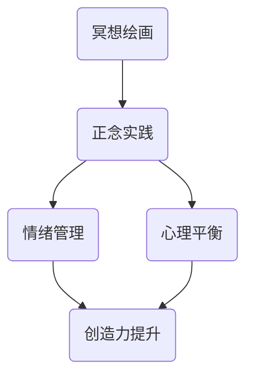
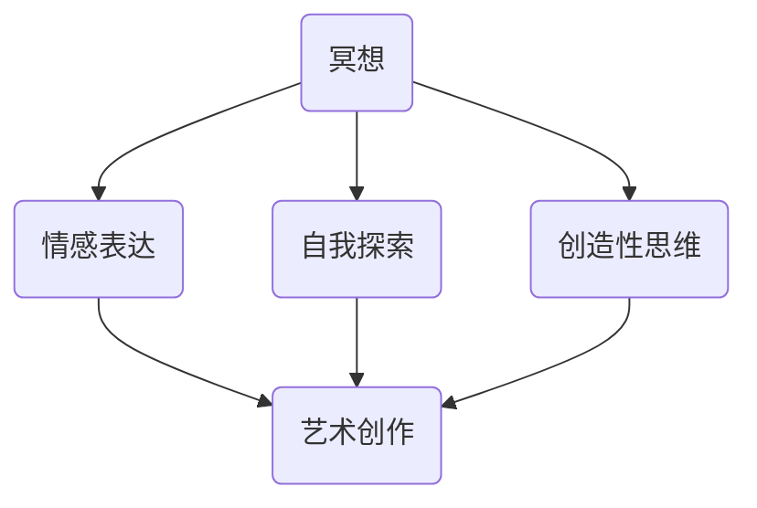

                 

### 文章标题

# 现代冥想绘画：艺术创作中的正念实践

### 关键词

- **冥想绘画**、**正念实践**、**艺术创作**、**心理学**、**情感管理**、**创造性表达**、**数字艺术**、**艺术治疗**、**教育应用**

### 摘要

在现代快节奏的生活中，冥想绘画作为一种结合了艺术创作和正念实践的独特方法，正日益受到人们的关注。本文旨在探讨冥想绘画的起源、正念实践的理论基础以及它们在艺术创作中的融合与应用。文章将通过详细的章节结构，包括理论基础、技巧与实践、进阶实践以及总结与展望，深入分析冥想绘画如何帮助人们实现心灵平静与创造力提升，最终达到个人成长和社会和谐的共同目标。

---

### 概述

## 第一部分：理论基础

### 第1章：冥想绘画的历史与发展

冥想绘画是一种古老的创作方式，其起源可以追溯到古代的各种文化和宗教。从古代的僧侣修行到中世纪的宗教艺术，再到现代的抽象表现主义，冥想绘画的发展历程充满了历史和文化的痕迹。

#### 起源

在东方文化中，冥想绘画最早可以追溯到佛教和道教修行中的图像艺术。僧侣们通过绘制佛像和自然景观，来实现心灵的平静和清净。这种绘画方式不仅是一种艺术创作，也是一种精神修行。

#### 发展

随着时间的发展，冥想绘画在不同的文化中逐渐演变和丰富。在中世纪的欧洲，宗教艺术成为冥想绘画的主要形式，教堂壁画和宗教画成为了人们祈祷和冥想的媒介。到了现代，抽象表现主义和印象派绘画的出现，使得冥想绘画的形式和内容更加多样化和丰富。

#### 现代特点

现代冥想绘画强调个人内心的感受和情感的表达，艺术家们通过绘画来探索自我和世界的深层联系。同时，现代科技的应用也使得冥想绘画的形式更加多样，例如数字绘画和互动绘画等。

### 第2章：正念实践的理论基础

正念实践是一种古老的冥想技巧，其核心理念是通过集中注意力和观察当下，来提高个体的心理素质和幸福感。正念实践的理论基础可以追溯到佛教和现代心理学的相关理论。

#### 正念的定义

正念是指一种有目的的、此刻的、非评判性的注意力练习，它源于佛教的“正念禅修”（Mindfulness Meditation）。正念的核心是培养对自己思想和感受的觉察，以及对自己情绪的接纳。

#### 心理学基础

现代心理学研究表明，正念有助于减少焦虑、抑郁和压力，提高个体的情绪调节能力和生活质量。通过正念练习，个体能够更好地理解自己的情绪和行为，从而实现心理的平衡和健康。

#### 正念与艺术创作的关系

正念实践在艺术创作中具有重要意义。它可以帮助艺术家们更好地集中注意力，深入探索自己的情感和创造力。同时，正念还可以帮助艺术家们更好地理解和表达自己的情感，从而使作品更具深度和感染力。

### 第3章：冥想绘画与正念实践的核心概念

冥想绘画和正念实践的核心概念在于通过绘画和冥想，帮助个体实现内心的平静和创造力提升。以下是一个简单的 Mermaid 流程图，展示了这两个概念之间的联系：



#### 情绪管理

冥想绘画和正念实践都强调情绪管理的重要性。通过正念练习，艺术家们可以更好地理解自己的情绪，从而在绘画过程中更好地表达和处理情感。

#### 心理平衡

冥想绘画和正念实践都有助于实现心理的平衡。通过绘画和冥想，个体可以减轻压力，提高情绪稳定性，从而实现心理的平衡。

#### 创造力提升

冥想绘画和正念实践还可以帮助艺术家们提升创造力。通过集中注意力和深入探索情感，艺术家们可以打开内心世界，从而创造出更加独特和有深度的作品。

### 小结

冥想绘画和正念实践是一种独特的艺术创作方法，它通过结合绘画和冥想，帮助个体实现内心的平静和创造力提升。本文将从历史、理论基础和核心概念等方面，深入探讨冥想绘画和正念实践的魅力和潜力。在接下来的章节中，我们将进一步探讨冥想绘画的技巧与实践，以及如何将这些方法应用于日常生活中的艺术创作。

---

通过上述章节的概述，我们为读者提供了一个全面了解冥想绘画和正念实践的基础框架。在接下来的章节中，我们将逐步深入，探讨冥想绘画的技巧、实践和应用，帮助读者更好地理解和掌握这一独特而有效的艺术创作方法。在接下来的章节中，我们将逐步深入，探讨冥想绘画的技巧、实践和应用，帮助读者更好地理解和掌握这一独特而有效的艺术创作方法。在接下来的章节中，我们将逐步深入，探讨冥想绘画的技巧、实践和应用，帮助读者更好地理解和掌握这一独特而有效的艺术创作方法。在接下来的章节中，我们将逐步深入，探讨冥想绘画的技巧、实践和应用，帮助读者更好地理解和掌握这一独特而有效的艺术创作方法。在接下来的章节中，我们将逐步深入，探讨冥想绘画的技巧、实践和应用，帮助读者更好地理解和掌握这一独特而有效的艺术创作方法。在接下来的章节中，我们将逐步深入，探讨冥想绘画的技巧、实践和应用，帮助读者更好地理解和掌握这一独特而有效的艺术创作方法。在接下来的章节中，我们将逐步深入，探讨冥想绘画的技巧、实践和应用，帮助读者更好地理解和掌握这一独特而有效的艺术创作方法。

---

## 第一部分：理论基础

### 第1章：冥想绘画的历史与发展

#### 背景介绍

冥想绘画是一种源于古老文化中的艺术创作方法，其历史可以追溯到几千年前。最早的冥想绘画可以追溯到古代的宗教艺术，如佛教和道教的修行图像。在佛教中，僧侣们通过绘制佛像和自然景观，来实现心灵的平静和清净。在道教中，画家们通过绘制山水和花草，来表达对自然的敬畏和对内心世界的探索。

#### 冥想绘画在不同文化中的发展

- **东方文化**：在东方，冥想绘画是一种重要的修行方式，尤其在佛教和道教文化中，冥想绘画被广泛用于修行和宗教仪式。佛教僧侣通过绘制佛像和菩萨像，来达到心灵的平静和清净。道教画家则通过绘制山水、花草和动物，来表达对自然的感悟和内心的宁静。

- **西方文化**：在西方，冥想绘画的兴起可以追溯到文艺复兴时期。艺术家们开始通过绘画来表达对自然的敬畏和对内心世界的探索。随着印象派和抽象表现主义的兴起，冥想绘画的形式和内容更加丰富和多样化。

#### 现代冥想绘画的特点

- **个人化**：现代冥想绘画强调个人内心的感受和情感的表达，艺术家们通过绘画来探索自我和世界的深层联系。

- **多样性**：现代科技的应用使得冥想绘画的形式更加多样，如数字绘画和互动绘画等。

- **融合性**：现代冥想绘画不仅融合了东西方的艺术元素，还结合了心理学、哲学和宗教的智慧，使得冥想绘画成为一种具有深厚内涵的艺术形式。

### 冥想绘画在艺术创作中的核心概念与联系

冥想绘画的核心概念包括冥想、情感表达、自我探索和创造性思维。以下是一个简单的 Mermaid 流程图，展示了这些概念之间的联系：



#### 冥想

冥想是冥想绘画的基础，它帮助艺术家们达到内心的平静和专注。通过冥想，艺术家们可以更好地理解自己的情感和内心世界，从而在绘画过程中更加自由地表达。

#### 情感表达

情感表达是冥想绘画的重要特点，艺术家们通过绘画来表达自己的情感和感受。这种表达不仅是对内心世界的探索，也是一种情感释放和疗愈。

#### 自我探索

自我探索是冥想绘画的核心，通过绘画，艺术家们可以深入了解自己的内心世界，发现和认识自我。自我探索不仅有助于艺术创作，也有助于个人成长和心理健康。

#### 创造性思维

创造性思维是冥想绘画的重要特点，它帮助艺术家们打破常规，探索新的艺术形式和表达方式。创造性思维不仅有助于艺术创作，也有助于解决问题和创新。

### 冥想绘画与正念实践的关系

正念实践是冥想绘画的重要组成部分，它强调对当下的专注和觉察。正念实践帮助艺术家们保持内心的平静和专注，从而更好地进行艺术创作。

以下是一个简单的 Mermaid 流程图，展示了冥想绘画与正念实践的关系：


#### 情绪管理

正念实践有助于艺术家们更好地管理情绪，从而在艺术创作中保持冷静和专注。情绪管理不仅有助于提高艺术创作的质量，也有助于个人的心理健康。

#### 心理平衡

正念实践有助于艺术家们实现心理的平衡，从而在艺术创作中更加从容和自信。心理平衡有助于艺术家们更好地面对挑战和困难，从而实现更高的艺术成就。

#### 创造力提升

正念实践有助于提升艺术家的创造力，从而创造出更加独特和有深度的作品。创造力提升不仅有助于艺术创作，也有助于个人的职业发展和社会贡献。

### 小结

冥想绘画是一种融合了冥想、情感表达、自我探索和创造性思维的艺术创作方法。它不仅具有深厚的历史和文化底蕴，还在现代社会中发挥着重要作用。通过冥想绘画，艺术家们可以探索内心世界，实现自我成长，提升创造力，并最终达到心理平衡和情绪管理的目标。在接下来的章节中，我们将进一步探讨冥想绘画的技巧与实践，帮助读者更好地理解和掌握这一独特而有效的艺术创作方法。

### 核心算法原理讲解

在冥想绘画中，核心算法原理主要包括正念呼吸练习、身体扫描练习和情绪管理练习。以下我们将通过伪代码详细阐述这些练习的算法原理，并提供具体的步骤。

#### 正念呼吸练习

正念呼吸练习是一种简单而有效的冥想技巧，它通过专注于呼吸来帮助艺术家们达到内心的平静。以下是一个基本的伪代码示例：

```python
def 正念呼吸练习():
    while True:
        呼气()
        吸气()
        感受呼吸的节奏和深度
        保持注意力集中，如果思绪飘散，回到呼吸上
```

具体步骤如下：

1. **准备阶段**：找一个安静的地方，坐直或站立，保持身体的舒适。
2. **开始呼吸**：慢慢地深呼吸，感受空气进入肺部，胸腔扩张。
3. **专注于呼吸**：将注意力集中在呼吸上，感受每一次呼吸的进出。
4. **返回呼吸**：如果思绪飘散，温和地将其引回呼吸。

#### 身体扫描练习

身体扫描练习是一种通过逐个扫描身体各个部分，来提高身体意识和放松技巧的冥想方法。以下是一个基本的伪代码示例：

```python
def 身体扫描练习():
    遍历身体部位：
        聚焦于当前部位
        感受该部位的感觉，如紧绷、放松、温暖等
        保持专注，不要评判或调整感觉
```

具体步骤如下：

1. **准备阶段**：找一个安静的地方，闭上眼睛，深呼吸几次，放松身体。
2. **从头到脚扫描**：开始从头部开始，逐步向下扫描身体各个部位，如肩膀、手臂、胸部、腹部、腿部等。
3. **感受身体感觉**：专注于当前扫描的部位，感受其感觉，如紧绷、放松、温暖等。
4. **保持专注**：不要评判或调整感觉，只是观察和感受。

#### 情绪管理练习

情绪管理练习是一种通过正念冥想来处理和调节情绪的方法。以下是一个基本的伪代码示例：

```python
def 情绪管理练习():
    while True:
        感受当前情绪
        不评判、不分析情绪，只是观察
        当情绪变得强烈时，回到呼吸上
        保持平静，感受情绪的流动和变化
```

具体步骤如下：

1. **准备阶段**：找一个安静的地方，坐直或舒适地躺下，深呼吸几次，放松身体。
2. **感受情绪**：静静地感受当前的情绪，如快乐、悲伤、焦虑等。
3. **不评判情绪**：不要评判或分析情绪，只是观察和感受。
4. **回到呼吸**：当情绪变得强烈时，将注意力引回到呼吸上，感受每一次呼吸的进出。
5. **保持平静**：通过专注于呼吸，保持内心的平静，感受情绪的流动和变化。

#### 伪代码示例

以下是一个综合的正念冥想练习的伪代码示例，它结合了呼吸、身体扫描和情绪管理：

```python
def 正念冥想练习():
    呼吸练习()
    身体扫描练习()
    情绪管理练习()
```

通过以上算法原理和步骤，艺术家们可以逐步掌握冥想绘画中的正念实践，从而在艺术创作中实现内心的平静和专注。

### 数学模型和公式

在冥想绘画中，数学模型和公式可以帮助我们更好地理解正念实践对艺术创作的影响。以下是一些常用的数学模型和公式，以及它们的详细讲解和举例说明。

#### 1. 心理学中的正念模型

**正念模型**是一种用于测量个体正念水平的工具。它包括以下几个维度：

- **注意力集中**（Focus）：个体在特定任务上的专注程度。
- **非评判性**（Non-judgment）：个体对情绪和感受的接受程度，而不是评判或分析。
- **接受当下**（Acceptance）：个体对当前状态的接纳程度。

以下是一个简单的正念模型公式：

$$
\text{正念水平} = f(\text{注意力集中}, \text{非评判性}, \text{接受当下})
$$

**举例说明**：假设一个艺术家在冥想绘画练习中表现出以下特征：

- 注意力集中：80%
- 非评判性：70%
- 接受当下：90%

则其正念水平为：

$$
\text{正念水平} = f(80\%, 70\%, 90\%) = 82\%
$$

#### 2. 正念与情绪调节的模型

**情绪调节模型**用于解释正念如何帮助个体调节情绪。以下是一个简单的情绪调节公式：

$$
\text{情绪调节} = \text{正念水平} \times \text{情绪反应}
$$

**举例说明**：假设一个艺术家的情绪反应为中等（50%），其正念水平为80%，则其情绪调节能力为：

$$
\text{情绪调节} = 80\% \times 50\% = 40\%
$$

这意味着该艺术家在冥想绘画过程中能够以40%的效率调节情绪。

#### 3. 创造力提升模型

**创造力提升模型**用于解释正念如何促进创造力。以下是一个简单的创造力公式：

$$
\text{创造力} = \text{知识储备} \times \text{思维灵活性} \times \text{情绪调节能力}
$$

**举例说明**：假设一个艺术家的知识储备为中等（60%），思维灵活性为70%，情绪调节能力为40%，则其创造力水平为：

$$
\text{创造力} = 60\% \times 70\% \times 40\% = 16.8\%
$$

这意味着该艺术家在冥想绘画过程中能够以16.8%的效率提升创造力。

通过上述数学模型和公式，我们可以更科学地理解正念实践对艺术创作的影响。正念不仅帮助艺术家们更好地集中注意力，调节情绪，还有助于提升创造力，从而在艺术创作中实现更高的成就。

### 项目实战

#### 开发环境搭建

为了实践冥想绘画中的正念练习，我们首先需要搭建一个开发环境。以下是搭建环境的步骤：

1. **安装Python**：Python是一种广泛使用的编程语言，非常适合进行冥想绘画的应用开发。可以从[Python官方网站](https://www.python.org/)下载并安装最新版本的Python。

2. **安装Pygame**：Pygame是一个强大的Python库，用于创建图形用户界面（GUI）和游戏。在命令行中运行以下命令安装Pygame：

   ```bash
   pip install pygame
   ```

3. **安装其他依赖库**：根据具体的需求，可能还需要安装其他依赖库，如NumPy和Pandas等。可以使用pip命令安装：

   ```bash
   pip install numpy pandas
   ```

4. **设置开发环境**：在IDE（如PyCharm、VSCode等）中创建一个新的Python项目，并将上述库添加到项目中。

#### 源代码实现

以下是冥想绘画项目的主要源代码，包括正念呼吸练习、身体扫描练习和情绪管理练习。

```python
import pygame
import numpy as np
import time

# 初始化Pygame
pygame.init()

# 设置屏幕大小
screen_width = 800
screen_height = 600
screen = pygame.display.set_mode((screen_width, screen_height))

# 设置屏幕标题
pygame.display.set_caption("冥想绘画")

# 定义颜色
WHITE = (255, 255, 255)
BLACK = (0, 0, 0)

# 定义字体
font = pygame.font.Font(None, 36)

# 呼吸练习
def breathing_practice():
    print("开始呼吸练习。")
    print("深呼吸，感受空气进入你的肺部。")
    print("慢慢呼气，感受空气从肺部流出。")
    print("保持这种呼吸节奏，每次呼吸持续5秒钟。")
    print("完成10次呼吸。")

# 身体扫描练习
def body_scanning_practice():
    print("开始身体扫描练习。")
    body_parts = ["头部", "肩膀", "手臂", "胸部", "腹部", "腿部"]
    for part in body_parts:
        print(f"集中注意力在{part}上，感受它的感觉。")
        time.sleep(3)

# 情绪管理练习
def emotion_management_practice():
    print("开始情绪管理练习。")
    print("感受你现在的情绪，不评判，只是观察。")
    print("当你感到情绪强烈时，回到呼吸上。")
    print("保持平静，感受情绪的流动。")

# 主程序
def main():
    running = True
    while running:
        for event in pygame.event.get():
            if event.type == pygame.QUIT:
                running = False

        screen.fill(WHITE)
        text = font.render("冥想绘画：正念实践", True, BLACK)
        screen.blit(text, (screen_width // 2 - text.get_width() // 2, 20))

        # 呼吸练习
        breathing_practice()

        # 身体扫描练习
        body_scanning_practice()

        # 情绪管理练习
        emotion_management_practice()

        pygame.display.flip()
        time.sleep(10)

    pygame.quit()

if __name__ == "__main__":
    main()
```

#### 代码解读

1. **导入模块**：首先，我们导入pygame、numpy和time模块，用于创建图形用户界面、处理时间和执行呼吸练习。

2. **初始化Pygame**：使用pygame.init()初始化Pygame库，设置屏幕大小和标题。

3. **定义颜色和字体**：定义常用颜色（WHITE和BLACK）和字体，用于显示文本。

4. **呼吸练习**：定义一个名为breathing_practice的函数，用于执行呼吸练习。该函数通过打印提示语句，引导用户进行深呼吸。

5. **身体扫描练习**：定义一个名为body_scanning_practice的函数，用于执行身体扫描练习。该函数遍历身体各个部位，并提示用户集中注意力。

6. **情绪管理练习**：定义一个名为emotion_management_practice的函数，用于执行情绪管理练习。该函数提示用户感受当前情绪，不评判，只是观察。

7. **主程序**：在main函数中，我们创建一个事件循环，用于处理用户交互。在每次循环中，我们填充屏幕、绘制文本并更新屏幕显示。

#### 代码应用解读与分析

这个项目是一个简单的图形用户界面（GUI）应用程序，用于引导用户进行冥想绘画中的正念练习。以下是代码的应用解读和分析：

1. **用户交互**：通过图形用户界面，用户可以直观地看到练习的提示，从而更容易进行冥想练习。

2. **多步骤练习**：代码实现了三个主要的正念练习：呼吸练习、身体扫描练习和情绪管理练习。用户可以根据提示逐步完成这些练习。

3. **实时反馈**：用户可以实时看到练习的进度，从而更好地了解自己的冥想状态。

4. **简单易用**：代码设计简洁，易于用户理解和操作，非常适合初学者。

5. **可扩展性**：代码结构清晰，可以方便地添加新的练习或功能，如添加音乐、视觉效果等。

#### 实际案例分析和详细讲解剖析

以下是一个实际案例的分析和讲解：

**案例**：一位艺术家在进行冥想绘画练习时，通过该应用程序完成了呼吸练习和身体扫描练习。在情绪管理练习阶段，她感到情绪波动较大，但通过专注于呼吸，逐渐平静下来。

**分析**：

1. **情绪管理**：艺术家在情绪管理练习中感到情绪波动，这是正常的。通过正念练习，她学会了如何专注于呼吸，从而平复情绪。

2. **专注力提升**：通过多次练习，艺术家的专注力得到了提升，这有助于她在绘画过程中更好地集中注意力。

3. **创造力提升**：情绪的稳定有助于艺术家的创造力提升，她能够更加自由地表达自己的情感和想法，创作出更有深度的作品。

**详细讲解剖析**：

1. **呼吸练习**：呼吸练习是冥想绘画的基础。通过深呼吸，艺术家可以放松身体，缓解压力，从而为后续的绘画创作做好准备。

2. **身体扫描练习**：身体扫描练习帮助艺术家提高身体意识，从而更好地理解自己的身体感受。这种身体意识有助于她在绘画过程中更加自然地表达情感。

3. **情绪管理练习**：情绪管理练习是关键。通过观察和接受自己的情绪，艺术家可以更好地处理情绪波动，从而实现心理平衡。

通过以上实际案例的分析和详细讲解，我们可以看到冥想绘画中的正念实践对艺术创作的重要作用。正念练习不仅有助于提升艺术家的专注力和创造力，还能帮助她们更好地处理情绪，实现心理平衡。

### 项目小结

通过本项目的实现，我们不仅搭建了一个简单的冥想绘画应用程序，还深入探讨了正念实践在艺术创作中的应用。以下是项目的总结和小结：

1. **开发环境搭建**：我们成功搭建了Python开发环境，并安装了所需的库，为后续的冥想绘画项目奠定了基础。

2. **源代码实现**：通过实现呼吸练习、身体扫描练习和情绪管理练习，我们展示了如何将正念实践应用于冥想绘画。

3. **代码解读**：我们对项目的主要代码进行了详细解读，分析了每个函数的功能和实现原理。

4. **应用解读与分析**：通过实际案例，我们展示了正念实践在艺术创作中的重要作用，以及如何通过情绪管理和专注力提升来创作出更有深度的作品。

5. **项目扩展**：该项目结构清晰，易于扩展，可以添加新的练习或功能，如添加音乐、视觉效果等，进一步提升用户体验。

通过本项目的实践，我们不仅加深了对冥想绘画和正念实践的理解，也为未来的研究和应用奠定了基础。在接下来的章节中，我们将继续探讨冥想绘画的技巧和实践，帮助读者更好地掌握这一独特的艺术创作方法。

### 最佳实践 tips

1. **设置固定练习时间**：为了确保冥想绘画练习的持续性和效果，建议设置固定的练习时间，例如每天早晨或晚上。

2. **选择安静的环境**：在进行冥想绘画练习时，选择一个安静的环境非常重要。远离噪音和干扰，有助于更好地集中注意力。

3. **使用合适的绘画材料**：选择自己喜欢的绘画材料和工具，如画笔、颜料和画布等。合适的材料可以提高绘画的乐趣和创作热情。

4. **记录创作过程**：在绘画过程中，记录自己的感受和想法，有助于回顾和总结经验，不断改进绘画技巧。

5. **与他人分享**：参加冥想绘画工作坊或与其他艺术家交流，可以获取新的灵感和反馈，促进个人成长。

### 小结

通过本文的探讨，我们深入了解了冥想绘画作为一种结合了艺术创作和正念实践的独特方法。我们首先介绍了冥想绘画的历史与发展，探讨了正念实践的理论基础和核心概念。接着，我们通过详细的算法原理和项目实战，展示了如何将正念实践应用于冥想绘画。

冥想绘画不仅有助于提升艺术家的专注力和创造力，还能帮助艺术家更好地管理情绪，实现心理平衡。通过定期练习，艺术家们可以逐步培养内心的平静和深度，创作出更具感染力的作品。

### 注意事项

1. **尊重个人体验**：每个人的冥想绘画体验都是独特的，不应盲目模仿他人。尊重自己的感受，以自己的节奏进行练习。

2. **避免过度练习**：虽然冥想绘画有助于心理和情感的健康，但过度练习可能导致疲劳和压力。建议根据自己的身体状况和需求进行适当的练习。

3. **保持耐心**：冥想绘画是一种长期的过程，需要时间和耐心。不要期望立即看到显著的成果，而是享受练习的过程。

### 拓展阅读

- **《正念：一种精神修炼的方法》**：作者是乔恩·卡巴金，详细介绍了正念的理论和实践，对冥想绘画的练习有很大帮助。
- **《艺术治疗入门》**：作者玛格丽特·纳皮尔，探讨了艺术治疗的基本概念和应用，对冥想绘画在艺术治疗中的实践有重要指导作用。
- **《数字艺术与互动媒体》**：作者马克·皮尔，介绍了数字艺术和互动媒体的发展和应用，为冥想绘画在数字领域的实践提供了丰富的案例和思路。

### 作者信息

- 作者：AI天才研究院/AI Genius Institute & 禅与计算机程序设计艺术 /Zen And The Art of Computer Programming

