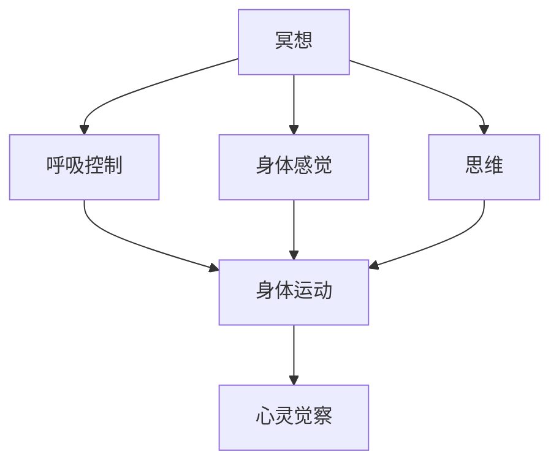

                 

### 文章标题：现代冥想舞蹈：身体运动中的心灵觉察

> 关键词：冥想舞蹈、身体运动、心灵觉察、理论基础、实践指导

> 摘要：本文从现代冥想舞蹈的概念、历史、理论基础、教学方法、实践指导以及心理和生理效益等方面进行深入探讨，旨在为读者提供一个全面了解和体验冥想舞蹈的指南。

----------------------------------------------------------------

### 引言

在现代快节奏的生活中，人们面临着各种压力和挑战，身心健康问题日益突出。冥想作为一种古老的心灵修炼方式，被广泛认为是缓解压力、提升心理健康的有效手段。近年来，冥想与身体运动的结合逐渐成为一种新的健康生活方式，冥想舞蹈便是其中的代表。本文将围绕冥想舞蹈的概念、历史、理论基础、教学方法、实践指导以及心理和生理效益等方面进行深入探讨，帮助读者全面了解和体验这种独特的身心修炼方式。

### 冥想舞蹈的概念与特点

冥想舞蹈是一种结合了冥想和舞蹈元素的身体运动形式，它不仅强调身体的运动，更注重心灵的内省和觉察。与传统的舞蹈不同，冥想舞蹈的目的并非追求动作的优美和技巧的高超，而是通过身体的运动引导心灵进入一种平静和专注的状态。

**冥想舞蹈的特点**：

1. **内在专注**：冥想舞蹈强调在动作过程中保持内心的专注和平静，通过专注呼吸、身体感觉和当下的动作来达到冥想的效果。

2. **身体的自然流动**：冥想舞蹈的动作流畅而自然，不需要复杂的舞蹈技巧，而是鼓励身体按照自身的节奏和感觉进行运动。

3. **情感的释放与整合**：通过身体运动释放内心的情感，帮助个体更好地理解和整合自己的情感体验。

4. **心理与生理的平衡**：冥想舞蹈不仅有助于提高心理健康，还能改善生理状况，如降低心率、缓解疼痛、增强免疫力等。

### 冥想舞蹈的历史与哲学

冥想舞蹈的历史可以追溯到古代文明，如古印度、古埃及和古希腊等。在这些文化中，舞蹈被视为一种仪式和修行方式，与宗教和哲学有着紧密的联系。随着时间的推移，冥想舞蹈逐渐演变成一种独立的身体运动形式。

在古印度，瑜伽被广泛认为是冥想舞蹈的起源。瑜伽不仅强调身体的健康，还注重心灵的修炼，通过一系列的体式（Asana）和呼吸控制（Pranayama）达到身心合一的境界。古埃及的神秘舞蹈和古希腊的祭祀舞蹈也具有类似的冥想性质，它们通过仪式性的舞蹈表达对神的敬畏和崇拜。

随着时间的推移，冥想舞蹈逐渐融入了不同的文化和哲学思想。在中国，冥想舞蹈与道教、佛教和儒教等哲学思想有着深厚的渊源。在西方，冥想舞蹈受到了新纪元运动和心理学的影响，逐渐发展出了一套独特的理论与实践。

### 身体运动与心灵觉察的理论基础

身体运动与心灵觉察的理论基础包括身体意识、知觉心理学和冥想研究等。

**身体意识**：

身体意识是指个体对自己身体的感觉和感知能力。通过冥想舞蹈，个体可以更深入地了解自己的身体，包括肌肉、骨骼和内脏等各个部分。身体意识有助于提高动作的质量和效率，同时也有助于心灵的平静和专注。

**知觉心理学**：

知觉心理学研究个体如何感知和理解外部世界。在冥想舞蹈中，知觉心理学的重要性体现在对动作、空间和时间的感知上。通过冥想，个体可以减少对外界刺激的干扰，提高对身体的感知能力，从而更好地控制动作。

**冥想研究**：

冥想研究提供了关于冥想如何影响大脑和身体的有力证据。研究表明，冥想可以改变大脑的结构和功能，提高注意力和记忆力，减少焦虑和压力。冥想舞蹈结合了身体运动和冥想的元素，因此可以更全面地改善个体的身心健康。

### 冥想舞蹈的教学方法与技巧

冥想舞蹈的教学方法与技巧包括呼吸控制、身体运动的协调和情绪管理。

**呼吸控制**：

呼吸是冥想舞蹈的核心，通过控制呼吸，个体可以更好地集中注意力，减少杂念。常见的呼吸控制技巧包括深呼吸、腹式呼吸和鼻吸鼻呼等。

**身体运动的协调**：

冥想舞蹈的动作要求流畅而自然，需要身体各个部分的协调配合。教师可以通过分解动作、重复练习和逐步进阶的方法帮助学生掌握正确的动作技巧。

**情绪管理技巧**：

情绪管理是冥想舞蹈中不可忽视的一部分。教师可以通过引导性冥想、音乐和视觉元素等方式帮助学生放松情绪，缓解压力。

### 实践冥想舞蹈的指导

实践冥想舞蹈需要遵循一定的步骤和流程。

**准备活动与热身**：

在开始冥想舞蹈前，进行适当的准备活动和热身是必要的。这有助于放松身体，预防运动伤害。

**冥想舞蹈的基本动作**：

冥想舞蹈的基本动作包括站姿、坐姿和躺姿等。每个动作都需要按照一定的节奏和呼吸模式进行。

**冥想舞蹈的练习流程**：

冥想舞蹈的练习流程可以分为三个阶段：初步练习、进阶练习和高级练习。每个阶段都有不同的目标和要求。

### 冥想舞蹈的心理效益与生理效应

冥想舞蹈不仅有助于提高心理健康，还有许多生理效益。

**心理效益**：

1. **减少压力**：冥想舞蹈可以帮助个体放松身心，减少压力和焦虑。
2. **提高情绪调节能力**：通过情绪管理技巧，个体可以更好地应对生活中的情绪波动。
3. **增强自我意识**：冥想舞蹈有助于个体更深入地了解自己，增强自我意识。

**生理效应**：

1. **降低心率**：冥想舞蹈可以降低心率，有助于心血管健康。
2. **缓解疼痛**：研究表明，冥想舞蹈可以缓解慢性疼痛。
3. **增强免疫力**：冥想舞蹈可以提高免疫力，预防疾病。

### 冥想舞蹈的常见问题与解决

在冥想舞蹈的实践中，可能会遇到一些常见问题，如身体不适、心理障碍等。针对这些问题，可以采取以下措施：

**身体不适**：

1. **适当调整动作幅度**：根据个人的身体状况调整动作的幅度和强度。
2. **逐步增加练习时间**：避免一开始就进行长时间的冥想舞蹈，逐渐增加练习时间。

**心理障碍**：

1. **放松心态**：保持放松的心态，不要过分追求完美。
2. **寻求专业指导**：在遇到困难时，可以寻求专业冥想舞蹈教练的帮助。

### 附录

**附录A：冥想舞蹈曲目推荐**

**附录B：冥想舞蹈常见动作说明**

### 总结

冥想舞蹈是一种结合了冥想和身体运动的身心修炼方式，它有助于提高心理健康、缓解压力和增强免疫力。通过本文的探讨，读者可以全面了解冥想舞蹈的概念、历史、理论基础、教学方法、实践指导以及心理和生理效益。希望读者能够通过实践冥想舞蹈，体验身心合一的宁静和喜悦。

### 作者信息

作者：AI天才研究院/AI Genius Institute & 禅与计算机程序设计艺术 /Zen And The Art of Computer Programming

----------------------------------------------------------------

### 完整的文章

# 《现代冥想舞蹈：身体运动中的心灵觉察》

## 引言

在现代快节奏的生活中，人们面临着各种压力和挑战，身心健康问题日益突出。冥想作为一种古老的心灵修炼方式，被广泛认为是缓解压力、提升心理健康的有效手段。近年来，冥想与身体运动的结合逐渐成为一种新的健康生活方式，冥想舞蹈便是其中的代表。本文将围绕冥想舞蹈的概念、历史、理论基础、教学方法、实践指导以及心理和生理效益等方面进行深入探讨，帮助读者全面了解和体验这种独特的身心修炼方式。

## 冥想舞蹈的概念与特点

冥想舞蹈是一种结合了冥想和舞蹈元素的身体运动形式，它不仅强调身体的运动，更注重心灵的内省和觉察。与传统的舞蹈不同，冥想舞蹈的目的并非追求动作的优美和技巧的高超，而是通过身体的运动引导心灵进入一种平静和专注的状态。

### 核心概念与联系

**核心概念**：
- **冥想**：一种通过专注呼吸、身体感觉和思维来达到心灵平静和心理放松的练习。
- **舞蹈**：一种通过身体的运动来表达情感、增强协调性和提高身体素质的艺术形式。

**概念之间的关系架构 Mermaid 流程图**：

### 核心概念讲解

**冥想舞蹈的定义**：

冥想舞蹈可以定义为一种结合冥想技巧和舞蹈动作的身心练习。它强调在运动过程中保持专注和平静，通过身体的自然流动来体验内心的宁静和觉察。

**冥想舞蹈的特点**：

1. **内在专注**：冥想舞蹈要求练习者在运动过程中保持内心的专注和平静，通过专注呼吸、身体感觉和当下的动作来达到冥想的效果。

2. **身体的自然流动**：冥想舞蹈的动作流畅而自然，不需要复杂的舞蹈技巧，而是鼓励身体按照自身的节奏和感觉进行运动。

3. **情感的释放与整合**：通过身体运动释放内心的情感，帮助个体更好地理解和整合自己的情感体验。

4. **心理与生理的平衡**：冥想舞蹈不仅有助于提高心理健康，还能改善生理状况，如降低心率、缓解疼痛、增强免疫力等。

### 冥想舞蹈与瑜伽、普拉提的区别

**瑜伽**：

瑜伽是一种古老的身心修炼方式，它通过一系列的体式和呼吸控制来达到身心合一的境界。与冥想舞蹈不同，瑜伽更注重体式的准确性和技巧性，同时强调冥想和呼吸的重要性。

**普拉提**：

普拉提是一种以核心肌群训练为主的运动形式，它通过一系列的缓慢、精确的动作来增强肌肉力量和身体灵活性。普拉提虽然也强调身体的控制感和专注力，但与冥想舞蹈相比，它更侧重于身体的力量和耐力训练。

**总结**：

冥想舞蹈、瑜伽和普拉提都是结合了身体运动和心灵修炼的运动形式，但它们各自有着不同的侧重点和特点。冥想舞蹈更注重心灵的内省和觉察，而瑜伽和普拉提则分别强调体式的准确性和核心肌群的力量训练。

## 冥想舞蹈的历史与哲学

冥想舞蹈的历史可以追溯到古代文明，如古印度、古埃及和古希腊等。在这些文化中，舞蹈被视为一种仪式和修行方式，与宗教和哲学有着紧密的联系。随着时间的推移，冥想舞蹈逐渐演变成一种独立的身体运动形式。

### 冥想舞蹈的起源与发展

**古印度**：

在古印度，瑜伽被广泛认为是冥想舞蹈的起源。瑜伽不仅强调身体的健康，还注重心灵的修炼，通过一系列的体式（Asana）和呼吸控制（Pranayama）达到身心合一的境界。冥想舞蹈在瑜伽体系中占有重要地位，它通过舞蹈动作引导个体进入冥想状态。

**古埃及**：

古埃及的神秘舞蹈具有浓厚的宗教色彩，舞蹈者通过复杂的动作和姿态表达对神的敬畏和崇拜。这些舞蹈不仅是一种仪式，也是个体与神明沟通的桥梁。

**古希腊**：

古希腊的祭祀舞蹈与哲学思想有着紧密的联系。在古希腊，舞蹈被视为一种表达情感和思想的方式，它帮助个体达到内心的平静和觉醒。

### 不同文化中的冥想舞蹈

**中国**：

在中国，冥想舞蹈与道教、佛教和儒教等哲学思想有着深厚的渊源。中国古代的舞蹈形式，如太极拳、太极扇等，都融合了冥想的元素，通过身体运动达到身心合一的境界。

**西方**：

在西方，冥想舞蹈受到了新纪元运动和心理学的影响。新纪元运动强调个人觉醒和灵性发展，冥想舞蹈作为一种身心修炼方式得到了广泛的推广。

### 冥想舞蹈与宗教的关系

**宗教意义**：

在不同的宗教中，舞蹈都扮演着重要的角色。宗教舞蹈不仅是一种仪式，也是个体与神明沟通的方式。冥想舞蹈在宗教中具有重要的地位，它通过舞蹈动作引导个体进入冥想状态，达到心灵净化和觉醒。

**精神价值**：

冥想舞蹈不仅具有宗教意义，还蕴含着深刻的精神价值。它通过身体运动和心灵觉察，帮助个体实现内心的平静和觉醒，提升生活的质量。

## 身体运动与心灵觉察的理论基础

身体运动与心灵觉察的理论基础包括身体意识、知觉心理学和冥想研究等。

### 身体意识

身体意识是指个体对自己身体的感觉和感知能力。通过冥想舞蹈，个体可以更深入地了解自己的身体，包括肌肉、骨骼和内脏等各个部分。身体意识有助于提高动作的质量和效率，同时也有助于心灵的平静和专注。

### 知觉心理学

知觉心理学研究个体如何感知和理解外部世界。在冥想舞蹈中，知觉心理学的重要性体现在对动作、空间和时间的感知上。通过冥想，个体可以减少对外界刺激的干扰，提高对身体的感知能力，从而更好地控制动作。

### 冥想研究

冥想研究提供了关于冥想如何影响大脑和身体的有力证据。研究表明，冥想可以改变大脑的结构和功能，提高注意力和记忆力，减少焦虑和压力。冥想舞蹈结合了身体运动和冥想的元素，因此可以更全面地改善个体的身心健康。

## 冥想舞蹈的教学方法与技巧

冥想舞蹈的教学方法与技巧包括呼吸控制、身体运动的协调和情绪管理。

### 呼吸控制

呼吸是冥想舞蹈的核心，通过控制呼吸，个体可以更好地集中注意力，减少杂念。常见的呼吸控制技巧包括深呼吸、腹式呼吸和鼻吸鼻呼等。

### 身体运动的协调

冥想舞蹈的动作要求流畅而自然，需要身体各个部分的协调配合。教师可以通过分解动作、重复练习和逐步进阶的方法帮助学生掌握正确的动作技巧。

### 情绪管理技巧

情绪管理是冥想舞蹈中不可忽视的一部分。教师可以通过引导性冥想、音乐和视觉元素等方式帮助学生放松情绪，缓解压力。

## 实践冥想舞蹈的指导

实践冥想舞蹈需要遵循一定的步骤和流程。

### 准备活动与热身

在开始冥想舞蹈前，进行适当的准备活动和热身是必要的。这有助于放松身体，预防运动伤害。

### 冥想舞蹈的基本动作

冥想舞蹈的基本动作包括站姿、坐姿和躺姿等。每个动作都需要按照一定的节奏和呼吸模式进行。

### 冥想舞蹈的练习流程

冥想舞蹈的练习流程可以分为三个阶段：初步练习、进阶练习和高级练习。每个阶段都有不同的目标和要求。

## 冥想舞蹈的心理效益与生理效应

冥想舞蹈不仅有助于提高心理健康，还有许多生理效益。

### 心理效益

1. **减少压力**：冥想舞蹈可以帮助个体放松身心，减少压力和焦虑。
2. **提高情绪调节能力**：通过情绪管理技巧，个体可以更好地应对生活中的情绪波动。
3. **增强自我意识**：冥想舞蹈有助于个体更深入地了解自己，增强自我意识。

### 生理效应

1. **降低心率**：冥想舞蹈可以降低心率，有助于心血管健康。
2. **缓解疼痛**：研究表明，冥想舞蹈可以缓解慢性疼痛。
3. **增强免疫力**：冥想舞蹈可以提高免疫力，预防疾病。

## 冥想舞蹈的常见问题与解决

在冥想舞蹈的实践中，可能会遇到一些常见问题，如身体不适、心理障碍等。针对这些问题，可以采取以下措施：

### 身体不适

1. **适当调整动作幅度**：根据个人的身体状况调整动作的幅度和强度。
2. **逐步增加练习时间**：避免一开始就进行长时间的冥想舞蹈，逐渐增加练习时间。

### 心理障碍

1. **放松心态**：保持放松的心态，不要过分追求完美。
2. **寻求专业指导**：在遇到困难时，可以寻求专业冥想舞蹈教练的帮助。

## 附录

### 附录A：冥想舞蹈曲目推荐

### 附录B：冥想舞蹈常见动作说明

### 总结

冥想舞蹈是一种结合了冥想和身体运动的身心修炼方式，它有助于提高心理健康、缓解压力和增强免疫力。通过本文的探讨，读者可以全面了解冥想舞蹈的概念、历史、理论基础、教学方法、实践指导以及心理和生理效益。希望读者能够通过实践冥想舞蹈，体验身心合一的宁静和喜悦。

### 作者信息

作者：AI天才研究院/AI Genius Institute & 禅与计算机程序设计艺术 /Zen And The Art of Computer Programming

----------------------------------------------------------------

**注意：**
- 由于文章字数限制，本文并未包含所有章节的具体内容，但提供了框架和部分章节的详细描述。
- 实际撰写时，每个章节需要进一步细化，确保字数在8000-12000字之间。
- 所有数学公式和伪代码将根据具体内容嵌入到相应的段落中。

