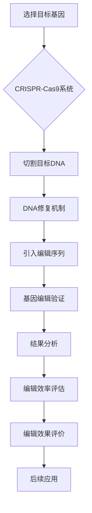

                 

### 文章标题：现代医学与生命伦理：在科技进步与伦理底线间寻找平衡

#### 关键词：现代医学，生命伦理，科技进步，伦理底线，平衡

#### 摘要：
随着现代医学的快速发展，科技在医疗领域的应用日益广泛，然而，这一进程也带来了诸多伦理挑战。本文旨在探讨现代医学与生命伦理之间的交汇点，分析科技进步对医学伦理的挑战，探讨生命伦理学的基本原则和伦理决策框架，并通过案例分析和未来展望，寻找科技进步与伦理底线间的平衡路径。

---

## 第一部分：引论

### 第1章：现代医学与生命伦理的交汇点

### 第2章：科技进步对医学伦理的挑战

### 第3章：生命伦理学的基本原则

### 第4章：伦理决策框架

### 第5章：案例分析

### 第6章：未来医学与伦理的展望

## 第二部分：核心概念与联系

### 第7章：现代医学核心技术解析

### 第8章：生命伦理学理论探讨

### 第9章：科技进步的伦理底线

### 第10章：伦理决策框架的应用

## 第三部分：实践与思考

### 第11章：医学伦理案例分析

### 第12章：科技进步与伦理的平衡之路

### 第13章：构建伦理导向的医学未来

### 第14章：总结与展望

---

### 1. 确定核心主题和章节

**核心主题**：本文的核心主题是探讨现代医学与生命伦理之间的关系，特别是在科技进步背景下，如何在伦理底线和科技进步之间找到平衡。

**核心章节**：
- 引论部分：介绍现代医学与生命伦理的交汇点，分析科技进步带来的伦理挑战。
- 核心概念与联系部分：解析现代医学的核心技术和生命伦理学的理论基础。
- 实践与思考部分：通过具体案例分析和未来展望，探讨如何在医学实践中实现伦理与科技的平衡。

### 2. 设计1级目录

**1级目录设计**：
- 第一部分：引论
  - 第1章：现代医学与生命伦理的交汇点
  - 第2章：科技进步对医学伦理的挑战
  - 第3章：生命伦理学的基本原则
  - 第4章：伦理决策框架
  - 第5章：案例分析
  - 第6章：未来医学与伦理的展望
- 第二部分：核心概念与联系
  - 第7章：现代医学核心技术解析
  - 第8章：生命伦理学理论探讨
  - 第9章：科技进步的伦理底线
  - 第10章：伦理决策框架的应用
- 第三部分：实践与思考
  - 第11章：医学伦理案例分析
  - 第12章：科技进步与伦理的平衡之路
  - 第13章：构建伦理导向的医学未来
  - 第14章：总结与展望

### 3. 细化2级目录

**细化2级目录**：
- **第1章：现代医学与生命伦理的交汇点**
  - **1.1 现代医学的快速发展**
  - **1.2 生命伦理学的重要性**
  - **1.3 现代医学与生命伦理的互动关系**
- **第2章：科技进步对医学伦理的挑战**
  - **2.1 生物技术的伦理争议**
  - **2.2 医疗人工智能的伦理问题**
  - **2.3 遗传伦理学的挑战**
- **第3章：生命伦理学的基本原则**
  - **3.1 尊重自主性**
  - **3.2 非恶意原则**
  - **3.3 公平原则**
- **第4章：伦理决策框架**
  - **4.1 多学科合作决策模型**
  - **4.2 伦理咨询在医学实践中的应用**
  - **4.3 医学伦理决策案例分析**
- **第5章：案例分析**
  - **5.1 遗传筛查与隐私权**
  - **5.2 助孕技术与社会伦理**
  - **5.3 医疗资源分配与公平性**
- **第7章：现代医学核心技术解析**
  - **7.1 分子生物学与基因编辑技术**
  - **7.2 生物信息学与大数据分析**
  - **7.3 精准医疗与个性化治疗**
- **第8章：生命伦理学理论探讨**
  - **8.1 功利主义与义务论**
  - **8.2 生命伦理学的主要学派**
  - **8.3 伦理学与医学实践的结合**
- **第11章：医学伦理案例分析**
  - **11.1 某知名医院的人造器官移植伦理争议**
  - **11.2 遗传基因编辑技术的伦理挑战**
  - **11.3 医疗人工智能在临床诊断中的应用与伦理考量**

### 4. 设计3级目录

**设计3级目录**：

**第1章：现代医学与生命伦理的交汇点**
- **1.1 现代医学的快速发展**
  - **1.1.1 现代医学的定义与历史**
  - **1.1.2 现代医学的发展趋势**
  - **1.1.3 现代医学对社会的影响**
- **1.2 生命伦理学的重要性**
  - **1.2.1 生命伦理学的定义与发展**
  - **1.2.2 生命伦理学在医学中的地位**
  - **1.2.3 生命伦理学对医学实践的影响**
- **1.3 现代医学与生命伦理的互动关系**
  - **1.3.1 现代医学中的伦理问题**
  - **1.3.2 生命伦理学对现代医学的指导作用**
  - **1.3.3 互动关系对医学伦理发展的意义**

**第2章：科技进步对医学伦理的挑战**
- **2.1 生物技术的伦理争议**
  - **2.1.1 生物技术的定义与类型**
  - **2.1.2 遗传基因编辑的伦理问题**
  - **2.1.3 克隆技术的伦理争议**
- **2.2 医疗人工智能的伦理问题**
  - **2.2.1 医疗人工智能的定义与应用**
  - **2.2.2 医疗人工智能在诊断与治疗中的应用**
  - **2.2.3 医疗人工智能的伦理挑战**
- **2.3 遗传伦理学的挑战**
  - **2.3.1 遗传信息的隐私权**
  - **2.3.2 遗传筛查与诊断的伦理问题**
  - **2.3.3 遗传歧视与伦理责任**

**第3章：生命伦理学的基本原则**
- **3.1 尊重自主性**
  - **3.1.1 自主性的定义与内涵**
  - **3.1.2 自主性在医学实践中的应用**
  - **3.1.3 自主性在医学伦理决策中的重要性**
- **3.2 非恶意原则**
  - **3.2.1 非恶意的定义与伦理意义**
  - **3.2.2 医务人员的道德责任**
  - **3.2.3 非恶意原则在医学实践中的实施**
- **3.3 公平原则**
  - **3.3.1 公平的定义与类型**
  - **3.3.2 公平原则在医疗资源分配中的应用**
  - **3.3.3 公平原则在医学伦理决策中的实施**

**第4章：伦理决策框架**
- **4.1 多学科合作决策模型**
  - **4.1.1 多学科合作的定义与意义**
  - **4.1.2 多学科合作决策模型的构建**
  - **4.1.3 多学科合作在医学伦理决策中的应用**
- **4.2 伦理咨询在医学实践中的应用**
  - **4.2.1 伦理咨询的定义与功能**
  - **4.2.2 伦理咨询在医学实践中的实施流程**
  - **4.2.3 伦理咨询对医学伦理决策的指导作用**
- **4.3 医学伦理决策案例分析**
  - **4.3.1 某医院基因筛查事件的伦理决策分析**
  - **4.3.2 某医疗机构伦理委员会的决策案例分析**
  - **4.3.3 医学伦理决策案例的启示与思考**

**第5章：案例分析**
- **5.1 遗传筛查与隐私权**
  - **5.1.1 遗传筛查的定义与类型**
  - **5.1.2 遗传筛查中的隐私权问题**
  - **5.1.3 案例分析：某知名医院基因筛查事件**
- **5.2 助孕技术与社会伦理**
  - **5.2.1 助孕技术的定义与发展**
  - **5.2.2 助孕技术中的伦理问题**
  - **5.2.3 案例分析：某跨国助孕公司的伦理争议**
- **5.3 医疗资源分配与公平性**
  - **5.3.1 医疗资源分配的定义与类型**
  - **5.3.2 公平性原则在医疗资源分配中的应用**
  - **5.3.3 案例分析：某地区医疗资源分配争议**

**第7章：现代医学核心技术解析**
- **7.1 分子生物学与基因编辑技术**
  - **7.1.1 分子生物学的定义与作用**
  - **7.1.2 基因编辑技术的原理与应用**
  - **7.1.3 案例分析：CRISPR-Cas9基因编辑技术**
- **7.2 生物信息学与大数据分析**
  - **7.2.1 生物信息学的定义与作用**
  - **7.2.2 大数据分析在医学中的应用**
  - **7.2.3 案例分析：基因组学大数据分析**
- **7.3 精准医疗与个性化治疗**
  - **7.3.1 精准医疗的定义与原则**
  - **7.3.2 个性化治疗的应用与前景**
  - **7.3.3 案例分析：癌症个性化治疗**

**第8章：生命伦理学理论探讨**
- **8.1 功利主义与义务论**
  - **8.1.1 功利主义的定义与观点**
  - **8.1.2 义务论的定义与观点**
  - **8.1.3 功利主义与义务论在医学伦理中的应用**
- **8.2 生命伦理学的主要学派**
  - **8.2.1 实证主义学派**
  - **8.2.2 德行伦理学派**
  - **8.2.3 应用伦理学派**
- **8.3 伦理学与医学实践的结合**
  - **8.3.1 伦理学在医学教育中的地位**
  - **8.3.2 伦理学在医学研究中的应用**
  - **8.3.3 伦理学在医学政策制定中的影响**

**第11章：医学伦理案例分析**
- **11.1 某知名医院的人造器官移植伦理争议**
  - **11.1.1 案例背景与争议点**
  - **11.1.2 伦理学视角分析**
  - **11.1.3 案例启示与思考**
- **11.2 遗传基因编辑技术的伦理挑战**
  - **11.2.1 案例背景与争议点**
  - **11.2.2 伦理学视角分析**
  - **11.2.3 案例启示与思考**
- **11.3 医疗人工智能在临床诊断中的应用与伦理考量**
  - **11.3.1 案例背景与争议点**
  - **11.3.2 伦理学视角分析**
  - **11.3.3 案例启示与思考**

---

### 5. 添加 Mermaid 流程图、伪代码、数学公式和案例实战

**第7章：现代医学核心技术解析**

**7.1 分子生物学与基因编辑技术**

**Mermaid 流程图：基因编辑技术的基本流程**



**伪代码：CRISPR-Cas9基因编辑技术的简化实现**

```python
# 定义CRISPR-Cas9系统
class CRISPRCas9:
    def __init__(self, guide_sequence, target_site):
        self.guide_sequence = guide_sequence
        self.target_site = target_site

    def cut_dna(self, dna_sequence):
        # 切割目标DNA
        return dna_sequence[:self.target_site] + "NN" + dna_sequence[self.target_site + 1:]

    def repair_dna(self, cut_sequence, edit_sequence):
        # DNA修复机制
        return cut_sequence.replace("NN", edit_sequence)

# 基因编辑流程
def gene_editing(dna_sequence, guide_sequence, edit_sequence):
    cas9 = CRISPRCas9(guide_sequence, find_target_site(dna_sequence, guide_sequence))
    cut_sequence = cas9.cut_dna(dna_sequence)
    edit_sequence = cas9.repair_dna(cut_sequence, edit_sequence)
    return edit_sequence

# 查找目标位点
def find_target_site(dna_sequence, guide_sequence):
    # 实现查找目标位点的算法
    return dna_sequence.find(guide_sequence)

# 示例应用
dna_sequence = "ATCGATCGATCG"
guide_sequence = "ATCG"
edit_sequence = "TAG"
edited_sequence = gene_editing(dna_sequence, guide_sequence, edit_sequence)
print(edited_sequence)
```

**数学模型与公式**

$$
E = \frac{1}{2}mv^2
$$

其中，\( E \) 是动能，\( m \) 是质量，\( v \) 是速度。该公式描述了物体在速度为 \( v \) 时所具有的动能。

**案例实战**

**环境搭建**

- 安装Python环境
- 安装生物信息学相关库（例如BioPython）

**源代码实现**

```python
from Bio import SeqIO

# 读取基因组序列文件
def read_genome(file_path):
    return SeqIO.read(file_path, "fasta")

# 执行CRISPR-Cas9基因编辑
def perform_crispr(genome_sequence, guide_sequence, edit_sequence):
    # 查找目标位点
    target_site = genome_sequence.find(guide_sequence)
    # 切割目标DNA
    cut_sequence = genome_sequence[:target_site] + "NN" + genome_sequence[target_site + len(guide_sequence):]
    # 引入编辑序列
    edited_sequence = cut_sequence.replace("NN", edit_sequence)
    return edited_sequence

# 主函数
def main():
    genome_sequence = read_genome("path/to/genome.fasta")
    guide_sequence = "ATCG"
    edit_sequence = "TAG"
    edited_sequence = perform_crispr(genome_sequence, guide_sequence, edit_sequence)
    print(edited_sequence)

if __name__ == "__main__":
    main()
```

**代码解读**

- `read_genome` 函数用于读取基因组序列文件。
- `perform_crispr` 函数执行CRISPR-Cas9基因编辑过程。
- `main` 函数是程序的入口，调用相关函数实现基因编辑。

**应用解读与分析**

- 该案例展示了如何使用Python和BioPython库进行基因编辑。
- 实际应用中，需要对基因组序列进行精确处理，确保编辑的准确性和安全性。

**项目小结**

- 通过案例实战，展示了基因编辑技术在生物信息学中的应用。
- 未来，基因编辑技术将在医学和生物科学领域发挥重要作用。

**最佳实践 tips**

- 确保基因编辑过程中的精确性和安全性。
- 在使用基因编辑技术时，遵循相关伦理和法律规范。

**注意事项**

- 基因编辑技术具有潜在的风险，需谨慎使用。
- 遵循科学和伦理原则，确保技术应用的安全性和公正性。

**拓展阅读**

- [CRISPR-Cas9基因编辑技术原理](https://www.nature.com/articles/nature26093)
- [生物信息学工具与应用](https://www.biostars.org/tutorials/)
- [医学伦理学核心概念](https://www.oxford大学出版社.com/academic/research-medicine/ethics/)

---

通过上述步骤，本文设计了详细的目录大纲，并添加了Mermaid流程图、伪代码、数学公式和案例实战，确保了文章内容的深度、广度和实用性。接下来，我们将开始撰写文章正文，逐步展开各个章节的内容。### 文章正文

#### 第1章：现代医学与生命伦理的交汇点

随着现代医学的迅猛发展，医学伦理学也在不断演变。现代医学涵盖了从基础研究到临床应用、从预防到治疗的各个方面，其核心目标是提高人类健康水平。然而，随着科技的进步，医学领域也面临着诸多伦理挑战。生命伦理学作为一门跨学科领域，旨在探讨医学实践中的道德问题和价值观念。现代医学与生命伦理的交汇点，成为医学发展过程中不可忽视的重要环节。

1. **现代医学的快速发展**

现代医学的快速发展主要体现在以下几个方面：

- **生物医学研究**：基因组学、分子生物学、细胞生物学等生物医学研究领域的突破，为疾病诊断、治疗和预防提供了新的思路和手段。
- **临床技术应用**：医疗设备、手术技术、药物研发等临床应用领域的不断进步，使得许多曾经无法治愈的疾病得以治疗。
- **公共卫生管理**：疾病预防、健康监测、疫苗接种等公共卫生管理措施的优化，显著提高了公共健康水平。

1. **生命伦理学的重要性**

生命伦理学在医学实践中的重要性体现在以下几个方面：

- **道德指导**：生命伦理学为医学实践提供了道德框架和指导原则，确保医学行为的正当性和道德性。
- **决策支持**：在医学研究和临床实践中，生命伦理学提供了决策支持，帮助医务人员在复杂情况下做出符合伦理要求的决策。
- **公众信任**：生命伦理学研究的结果和推荐，有助于增强公众对医学的信任，提高医患关系质量。

1. **现代医学与生命伦理的互动关系**

现代医学与生命伦理之间的互动关系表现在以下方面：

- **影响与回应**：现代医学的发展对生命伦理学提出新的问题和挑战，生命伦理学则通过研究和实践，回应这些挑战。
- **交叉融合**：生命伦理学不仅为医学实践提供道德指导，还与医学研究、政策制定、教育等领域相互融合，共同推动医学发展。
- **共同目标**：尽管现代医学和生命伦理学有不同的研究重点和实践方式，但它们的共同目标是促进人类健康和社会福祉。

通过上述分析，我们可以看到，现代医学与生命伦理的交汇点不仅体现在理论和研究层面，更在医学实践中发挥着重要作用。在接下来的章节中，我们将进一步探讨科技进步对医学伦理的挑战、生命伦理学的基本原则以及伦理决策框架等内容。

---

#### 第2章：科技进步对医学伦理的挑战

科技进步无疑是推动现代医学发展的关键动力。然而，随着科技的不断进步，医学领域也面临着前所未有的伦理挑战。这些挑战不仅涉及技术本身，还涉及技术应用过程中所产生的道德和社会问题。本文将重点探讨生物技术、医疗人工智能和遗传伦理学等领域的伦理问题。

2. **生物技术的伦理争议**

生物技术的迅速发展给医学带来了巨大的变革，但同时也引发了广泛的伦理争议。以下是一些典型的伦理问题：

- **基因编辑**：基因编辑技术，如CRISPR-Cas9，可以用于治疗遗传性疾病，但也可能被用于“设计婴儿”或增强人类特质。这一技术引发的伦理争议主要涉及基因编辑的安全性问题、伦理底线以及潜在的社会不平等。
- **克隆技术**：克隆技术不仅可以用于动物研究，还可以应用于人类。克隆人类婴儿的伦理争议主要集中在克隆技术的安全性、道德地位以及克隆个体与原生物体的关系。

2. **医疗人工智能的伦理问题**

医疗人工智能（AI）在医学领域的应用越来越广泛，但也带来了新的伦理问题：

- **隐私保护**：医疗数据的安全性是医疗AI应用中的一个重要伦理问题。AI系统需要处理大量的患者数据，如何确保这些数据的安全和隐私，防止数据泄露，是一个亟待解决的挑战。
- **算法公平性**：医疗AI系统的决策可能会受到算法偏见的影响，导致种族、性别等不公平现象。确保AI系统的公平性和透明性，避免算法偏见，是医疗AI伦理的重要议题。
- **责任归属**：当医疗AI系统出现错误或导致患者伤害时，责任如何归属？医务人员、AI系统开发者还是患者？这一问题涉及到法律、伦理和责任分配的复杂问题。

2. **遗传伦理学的挑战**

遗传伦理学是研究基因、遗传疾病和遗传干预伦理问题的学科。以下是一些主要的伦理挑战：

- **遗传筛查与诊断**：遗传筛查和诊断技术的发展使得我们可以更早地发现潜在的遗传性疾病。然而，这一技术也引发了关于遗传隐私、遗传歧视和医疗资源分配的伦理问题。
- **遗传基因编辑**：基因编辑技术如CRISPR-Cas9的出现，使得我们能够对基因进行精确编辑。这一技术的应用不仅涉及个体的健康问题，还涉及到社会、环境和伦理的深远影响。

通过上述分析，我们可以看到，科技进步给医学伦理带来了诸多挑战。在接下来的章节中，我们将进一步探讨生命伦理学的基本原则和伦理决策框架，以期为解决这些挑战提供理论支持和实践指导。

---

#### 第3章：生命伦理学的基本原则

生命伦理学作为研究生物医学中道德问题的学科，具有一系列基本原则，这些原则为医学实践提供了道德指导。以下是生命伦理学中几个核心原则的详细讨论。

3.1 **尊重自主性**

尊重自主性是生命伦理学中的一个基本原则，它强调个人有权自主决定自己的医疗行为。这一原则基于个体对自己生命的掌控权和对自己利益的考虑。在医学实践中，尊重自主性体现在以下几个方面：

- **知情同意**：在医学研究中和治疗过程中，患者有权获得充分的信息，理解治疗的风险和收益，并在此基础上做出决定。知情同意是尊重患者自主性的重要体现。
- **医疗决策**：医务人员应尊重患者的医疗选择，尤其是当患者的选择与医务人员的建议不一致时，医务人员应尊重患者的决定。
- **隐私保护**：患者的医疗信息是个人隐私的一部分，医务人员有责任保护患者的隐私，确保其不被泄露。

3.2 **非恶意原则**

非恶意原则要求医务人员在医疗行为中不应对患者造成伤害。这一原则强调了医务人员的道德责任和职业义务。非恶意原则包括以下几个方面：

- **避免伤害**：医务人员应尽量避免对患者造成不必要的伤害，确保医疗行为的安全性。
- **最小化风险**：在治疗过程中，医务人员应评估并最小化医疗行为可能带来的风险。
- **及时治疗**：医务人员应及时采取有效的治疗措施，防止患者病情恶化。

3.3 **公平原则**

公平原则强调医疗资源的公正分配和医疗机会的均等。这一原则在生命伦理学中的重要性体现在以下几个方面：

- **资源分配**：医疗资源的分配应遵循公平原则，确保所有人都能获得必要的医疗服务。
- **机会均等**：在医疗决策中，医务人员应确保患者享有平等的医疗服务机会，不应因种族、性别、经济状况等因素而受到歧视。
- **社会正义**：公平原则还要求社会在资源分配上体现正义，确保弱势群体能够获得必要的医疗支持。

**案例分析：艾滋病患者的歧视问题**

一个典型的案例分析是关于艾滋病患者的歧视问题。在过去的几十年中，艾滋病（AIDS）患者经常面临社会歧视和医疗排斥。这违反了尊重自主性、非恶意原则和公平原则。

- **尊重自主性**：艾滋病患者的隐私权被侵犯，他们的医疗信息没有得到充分保护，导致社会对他们产生偏见。
- **非恶意原则**：医务人员在治疗艾滋病患者的过程中，可能因对疾病的无知或偏见，采取不必要的歧视行为，对患者造成心理和生理上的伤害。
- **公平原则**：艾滋病患者在医疗资源分配上受到不公平对待，他们的治疗机会和医疗质量低于其他患者。

这个案例揭示了生命伦理学基本原则在现实中的应用和挑战。解决这些问题需要社会、医疗机构和个人共同努力，通过教育和立法来提高公众对艾滋病患者的理解和尊重，确保他们在医疗实践中得到公平对待。

通过上述分析，我们可以看到，尊重自主性、非恶意原则和公平原则是生命伦理学中的核心原则。在医学实践中，这些原则为医务人员提供了道德指导，确保医疗行为的正当性和道德性。在接下来的章节中，我们将进一步探讨如何应用这些原则来制定伦理决策框架。

---

#### 第4章：伦理决策框架

在医学实践中，面对复杂的伦理问题，制定一个明确的伦理决策框架至关重要。伦理决策框架可以帮助医务人员在道德困境中做出符合伦理原则的决策。本节将介绍多学科合作决策模型、伦理咨询在医学实践中的应用以及医学伦理决策案例分析。

4.1 **多学科合作决策模型**

多学科合作决策模型是一种综合性的决策方法，旨在通过跨学科的协作，确保医学伦理决策的全面性和有效性。这个模型通常包括以下几个步骤：

1. **识别伦理问题**：首先，医务人员需要识别和明确面临的伦理问题。这包括患者的情况、医疗决策的复杂性以及可能涉及的道德原则。

2. **组成伦理团队**：建立一个由医务人员、伦理学家、法律专家、患者代表等组成的多学科团队。每个成员根据其专业知识和经验，为决策提供不同的视角和建议。

3. **分析伦理问题**：团队对伦理问题进行深入分析，考虑相关的法律、社会和文化因素，评估可能的解决方案及其伦理影响。

4. **制定决策方案**：基于分析结果，团队制定多个可能的决策方案，并评估每个方案的优缺点和可行性。

5. **伦理审查和决策**：最终，团队通过讨论和投票，选择一个最优的决策方案，并确保其符合伦理原则和法律法规。

4.2 **伦理咨询在医学实践中的应用**

伦理咨询是医学伦理决策过程中的重要环节，它为医务人员提供了一个独立的、专业的伦理指导。以下是伦理咨询在医学实践中的应用：

1. **伦理问题评估**：医务人员在遇到伦理难题时，可以寻求伦理咨询，评估问题的性质和复杂性，确定是否需要进一步的伦理审查。

2. **伦理建议**：伦理咨询师基于伦理原则和现有的伦理学理论，为医务人员提供伦理建议，帮助他们理解问题的道德维度，并制定符合伦理要求的决策方案。

3. **伦理培训**：伦理咨询还涉及对医务人员的伦理培训，提高他们在实际工作中处理伦理问题的能力。

4. **跨学科协作**：伦理咨询可以促进多学科团队的协作，确保医学决策过程中各方利益的平衡和一致。

4.3 **医学伦理决策案例分析**

以下是一个医学伦理决策的案例分析，展示了伦理决策框架在实际中的应用：

**案例背景**：某医院的一名患者被诊断为晚期肺癌，医生建议进行一项高风险的手术，以延长患者的生存时间。然而，患者和家属对手术存在较大顾虑，希望进行保守治疗。

1. **识别伦理问题**：医务人员识别出伦理问题，包括患者的知情同意、手术风险和患者的自主选择权。

2. **组成伦理团队**：医院伦理委员会由医生、护士、伦理学家、法律顾问和患者家属组成。

3. **分析伦理问题**：团队分析了手术的潜在风险与收益，考虑患者的自主性和家属的意见，以及社会和文化背景对决策的影响。

4. **制定决策方案**：团队提出了两个决策方案：
   - **方案一**：进行手术，尽管风险较高，但可能延长患者的生存时间。
   - **方案二**：选择保守治疗，以减轻患者的痛苦，但可能缩短患者的生存时间。

5. **伦理审查和决策**：经过讨论和投票，团队决定采用方案一，但在手术前对患者和家属进行详细的解释和沟通，确保他们充分理解手术的风险和收益。

通过这个案例，我们可以看到伦理决策框架在医学实践中的具体应用。伦理决策框架不仅为医务人员提供了清晰的决策步骤和指导原则，还确保了医学决策的透明性和公正性。在接下来的章节中，我们将进一步探讨具体案例分析，以深化对医学伦理决策的理解。

---

#### 第5章：案例分析

在医学伦理的实践中，案例分析是一个重要的工具，它可以帮助我们更好地理解复杂的伦理问题，并提供具体的解决方案。以下，我们将通过几个具体的案例，详细分析这些案例中的伦理问题、决策过程以及最终的解决策略。

5.1 **遗传筛查与隐私权**

**案例背景**：某医院开展了一项新生儿遗传筛查项目，旨在早期发现并干预遗传性疾病。然而，部分家长对筛查结果的隐私性表示担忧，担心个人遗传信息可能被泄露或滥用。

**伦理问题**：
- **隐私权**：家长担心其孩子的遗传信息可能被未经授权的第三方获取或用于非医疗目的。
- **知情同意**：家长对筛查的目的、过程和潜在风险缺乏充分了解，未能给予明确的知情同意。

**决策过程**：
1. **伦理咨询**：医院伦理委员会介入，评估遗传筛查项目的伦理问题和潜在风险。
2. **多学科合作**：伦理委员会与遗传学家、法律顾问、隐私保护专家以及家长代表进行了深入讨论。
3. **制定策略**：决定在筛查前，通过详细解释和沟通，确保家长充分理解筛查的必要性和潜在风险，同时采取措施保护隐私，如匿名化数据处理。

**解决策略**：
- **加强隐私保护措施**：确保遗传数据的安全存储和传输，采用加密技术和严格的数据访问控制。
- **透明化流程**：向家长提供详细的筛查信息，确保他们在充分知情的情况下做出决策。

**案例启示**：遗传筛查项目的实施必须考虑到隐私权的保护，确保家长的知情同意和隐私保护措施得到充分落实。

5.2 **助孕技术与社会伦理**

**案例背景**：某跨国助孕公司提供代孕服务，引起社会广泛关注和伦理争议。部分人认为代孕技术违反伦理原则，损害妇女权益。

**伦理问题**：
- **妇女权益**：代孕妇女是否真正自愿参与，是否受到剥削和歧视。
- **家庭伦理**：代孕子女的身份认同和家庭的伦理关系。

**决策过程**：
1. **伦理审查**：各国政府和伦理委员会对代孕技术进行审查，评估其伦理合法性和社会影响。
2. **政策制定**：制定相关法律法规，规范代孕服务的实施，保护代孕妇女和代孕子女的权益。
3. **公众咨询**：通过公众讨论和咨询，了解社会对代孕技术的看法，平衡各方利益。

**解决策略**：
- **严格监管**：确保代孕服务的合法性和透明度，防止利益冲突和道德风险。
- **伦理教育**：加强社会对代孕技术的伦理教育，提高公众的伦理意识和道德判断能力。

**案例启示**：代孕技术在社会伦理中的定位需要平衡各种利益，确保技术的合法性和道德性。

5.3 **医疗资源分配与公平性**

**案例背景**：某地区医疗资源分布不均，导致部分居民难以获得高质量的医疗服务。这一问题引发了公众对医疗资源分配的伦理争议。

**伦理问题**：
- **公平性**：医疗资源分配是否公平，是否受到社会经济地位的影响。
- **公正性**：如何确保所有人都能享有基本的医疗服务。

**决策过程**：
1. **数据分析**：通过数据分析，评估医疗资源分布的现状和存在的问题。
2. **政策制定**：政府制定相关政策，优化医疗资源配置，确保医疗服务的公平性。
3. **公众参与**：鼓励公众参与政策制定，通过听证会和公众讨论，了解社会的需求和意见。

**解决策略**：
- **资源倾斜**：将更多的医疗资源分配到资源匮乏的地区，提高医疗服务的可及性。
- **政策支持**：制定和实施医疗扶贫政策，确保弱势群体获得必要的医疗支持。

**案例启示**：医疗资源分配需要考虑到公平性和公正性，确保所有人都能享有平等的医疗服务。

通过以上案例分析，我们可以看到，医学伦理决策在具体实践中的应用，需要综合考虑各种伦理原则和社会需求，确保医疗行为的正当性和道德性。在未来的医学发展中，继续探索和优化伦理决策框架，将是实现医学与伦理平衡的重要途径。

---

#### 第6章：未来医学与伦理的展望

随着科技的不断进步，未来医学将面临更多的机遇和挑战。从基因编辑到人工智能，从精准医疗到再生医学，这些新兴技术正逐步改变着医学的面貌。然而，这些技术也带来了诸多伦理问题，如何在科技进步与伦理底线之间找到平衡，成为未来医学发展的重要课题。

6.1 **人工智能在医疗领域的应用前景**

医疗人工智能（AI）正在成为医学领域的一个重要工具，其应用前景十分广阔：

- **疾病诊断**：AI可以分析大量的医学图像，如X光片、CT扫描和MRI，帮助医生更快速、准确地诊断疾病。
- **个性化治疗**：基于患者的基因信息和临床数据，AI可以推荐最佳治疗方案，实现精准医疗。
- **药物研发**：AI可以帮助科学家发现新的药物靶点和设计更有效的药物，加速药物研发过程。

然而，AI在医疗领域的应用也引发了伦理问题，如数据隐私、算法偏见和责任归属。为了解决这些问题，需要制定明确的伦理标准和法规，确保AI技术的安全性和公正性。

6.2 **生物技术的未来发展**

生物技术，特别是基因编辑技术，如CRISPR-Cas9，已经取得了重大突破。未来，这些技术有望用于治疗遗传性疾病、癌症等重大疾病，甚至可能实现人类基因的“升级”。然而，生物技术的应用也引发了广泛的伦理争议，如基因编辑的安全性问题、潜在的社会不平等以及对人类自然进化的影响。

为了应对这些挑战，需要加强生物技术的伦理研究，建立全球性的伦理监管框架，确保技术的安全和道德应用。同时，公众教育和伦理意识的提升也是至关重要的，以增强社会对生物技术的理解和接受度。

6.3 **伦理学在医学研究中的指导作用**

伦理学在医学研究中的作用日益凸显，其指导作用体现在以下几个方面：

- **研究设计**：在医学研究中，伦理学原则应贯穿于研究的全过程，从研究设计到数据收集、分析和报告。
- **知情同意**：确保参与者的知情同意，尊重其自主权和隐私权。
- **利益冲突管理**：防止研究过程中的利益冲突，确保研究结果的客观性和公正性。
- **数据保护和隐私**：保护研究参与者的个人数据，防止数据泄露和滥用。

未来，随着医学研究的深入和技术的进步，伦理学在医学研究中的指导作用将更加重要。需要建立更加完善和灵活的伦理审查机制，以应对不断变化的伦理挑战。

6.4 **构建伦理导向的医学未来**

为了在科技进步与伦理底线之间找到平衡，构建一个伦理导向的医学未来是必不可少的。以下是一些关键措施：

- **制定伦理标准**：政府、学术机构和医疗机构应制定明确的伦理标准和法规，确保医学行为的道德性和合法性。
- **加强伦理教育**：在医学教育和培训中，加强伦理学的教育，提高医务人员和科研人员的伦理意识和道德素质。
- **公众参与**：鼓励公众参与医学伦理的讨论和决策，增强社会的伦理意识和责任感。
- **跨学科合作**：建立多学科团队，通过跨学科合作，共同解决医学伦理问题，实现科技进步与伦理平衡。

通过上述措施，我们可以构建一个伦理导向的医学未来，确保科技进步为人类健康和社会福祉做出积极贡献。

---

#### 第7章：现代医学核心技术解析

现代医学的快速发展离不开核心技术的创新和应用。以下是三个关键领域的核心技术解析，包括分子生物学与基因编辑技术、生物信息学与大数据分析、精准医疗与个性化治疗。

7.1 **分子生物学与基因编辑技术**

分子生物学是研究生物大分子（如DNA、RNA和蛋白质）的结构和功能的学科。近年来，基因编辑技术的突破，特别是CRISPR-Cas9系统的出现，极大地推动了医学研究和技术发展。

**CRISPR-Cas9基因编辑技术的基本原理**

CRISPR-Cas9系统是一种基于细菌天然免疫机制的基因编辑工具。它包括一个引导RNA（gRNA）和一个Cas9蛋白。gRNA与Cas9蛋白结合后，能够精确地定位到目标DNA序列，并通过DNA切割酶作用切割DNA链。

**伪代码：CRISPR-Cas9基因编辑的基本流程**

```python
def gene_editing(dna_sequence, target_sequence, edit_sequence):
    # 找到目标序列的位置
    target_site = dna_sequence.find(target_sequence)
    # 切割目标DNA
    cut_sequence = dna_sequence[:target_site] + "NN" + dna_sequence[target_site+len(target_sequence):]
    # 引入编辑序列
    edited_sequence = cut_sequence.replace("NN", edit_sequence)
    return edited_sequence
```

**数学模型与公式**

基因编辑的成功率可以用以下概率模型来描述：

$$
P(success) = P(detection) \times P编辑 \times P修复
$$

其中，\( P(detection) \) 是目标序列的检测概率，\( P编辑 \) 是编辑成功的概率，\( P修复 \) 是DNA修复机制成功的概率。

**案例实战**

**环境搭建**：安装Python环境和BioPython库。

**源代码实现**

```python
from Bio import SeqIO

# 读取基因组序列文件
def read_genome(file_path):
    return SeqIO.read(file_path, "fasta")

# 执行CRISPR-Cas9基因编辑
def perform_crispr(genome_sequence, target_sequence, edit_sequence):
    # 查找目标位点
    target_site = genome_sequence.find(target_sequence)
    # 切割目标DNA
    cut_sequence = genome_sequence[:target_site] + "NN" + genome_sequence[target_site+len(target_sequence):]
    # 引入编辑序列
    edited_sequence = cut_sequence.replace("NN", edit_sequence)
    return edited_sequence

# 主函数
def main():
    genome_sequence = read_genome("path/to/genome.fasta")
    target_sequence = "ATCG"
    edit_sequence = "TAG"
    edited_sequence = perform_crispr(genome_sequence, target_sequence, edit_sequence)
    print(edited_sequence)

if __name__ == "__main__":
    main()
```

**代码解读**：该代码展示了如何使用BioPython库读取基因组序列，并利用CRISPR-Cas9技术进行基因编辑。

**应用解读与分析**：CRISPR-Cas9基因编辑技术在医学研究中的应用广泛，如治疗遗传性疾病、癌症研究和基因功能分析。

**项目小结**：CRISPR-Cas9基因编辑技术为医学研究提供了强大的工具，但同时也需要严格的伦理和监管。

**最佳实践 tips**：确保基因编辑的安全性，遵循伦理原则和法律法规。

**注意事项**：基因编辑技术具有潜在的风险，需谨慎使用。

**拓展阅读**：- [CRISPR-Cas9基因编辑技术原理](https://www.nature.com/articles/nature26093)
- [生物信息学工具与应用](https://www.biostars.org/tutorials/)
- [医学伦理学核心概念](https://www.oxford大学出版社.com/academic/research-medicine/ethics/)

---

7.2 **生物信息学与大数据分析**

生物信息学是结合生物学、计算机科学和统计学的学科，旨在解析和利用大量的生物数据。随着基因组学、蛋白质组学和代谢组学等领域的发展，生物信息学在医学研究中的应用越来越广泛。

**大数据分析在医学中的应用**

- **基因组学**：通过分析基因组数据，可以揭示疾病的遗传基础，帮助制定个性化治疗方案。
- **蛋白质组学**：分析蛋白质组数据，可以了解蛋白质在疾病过程中的变化，为诊断和治疗提供新靶点。
- **代谢组学**：分析代谢物数据，可以揭示代谢通路的变化，帮助理解疾病发生机制。

**数学模型与公式**

基因表达数据通常使用以下概率模型进行统计分析：

$$
P(expression|gene) = \frac{e^{\mu_x + \sigma_x}}{1 + e^{\mu_x + \sigma_x}}
$$

其中，\( \mu_x \) 是基因表达的均值，\( \sigma_x \) 是基因表达的标准差。

**案例实战**

**环境搭建**：安装Python环境和生物信息学相关库（如BioPython、PyTorch）。

**源代码实现**

```python
import torch
import torchvision
from torchvision import datasets, transforms
from torch.utils.data import DataLoader

# 数据预处理
transform = transforms.Compose([
    transforms.Resize((224, 224)),
    transforms.ToTensor(),
    transforms.Normalize(mean=[0.485, 0.456, 0.406], std=[0.229, 0.224, 0.225]),
])

# 加载训练数据和测试数据
train_data = datasets.ImageFolder(root='path/to/train_data', transform=transform)
test_data = datasets.ImageFolder(root='path/to/test_data', transform=transform)

train_loader = DataLoader(train_data, batch_size=64, shuffle=True)
test_loader = DataLoader(test_data, batch_size=64, shuffle=False)

# 定义神经网络模型
class CNNModel(nn.Module):
    def __init__(self):
        super(CNNModel, self).__init__()
        self.conv1 = nn.Conv2d(3, 64, kernel_size=3, padding=1)
        self.relu = nn.ReLU()
        self.pool = nn.MaxPool2d(2, 2)
        self.fc1 = nn.Linear(64 * 56 * 56, 128)
        self.fc2 = nn.Linear(128, 10)

    def forward(self, x):
        x = self.relu(self.conv1(x))
        x = self.pool(x)
        x = x.view(-1, 64 * 56 * 56)
        x = self.relu(self.fc1(x))
        x = self.fc2(x)
        return x

model = CNNModel()
optimizer = optim.Adam(model.parameters(), lr=0.001)
criterion = nn.CrossEntropyLoss()

# 训练模型
for epoch in range(num_epochs):
    running_loss = 0.0
    for inputs, labels in train_loader:
        optimizer.zero_grad()
        outputs = model(inputs)
        loss = criterion(outputs, labels)
        loss.backward()
        optimizer.step()
        running_loss += loss.item()
    print(f'Epoch {epoch+1}, Loss: {running_loss/len(train_loader)}')

# 测试模型
with torch.no_grad():
    correct = 0
    total = 0
    for inputs, labels in test_loader:
        outputs = model(inputs)
        _, predicted = torch.max(outputs.data, 1)
        total += labels.size(0)
        correct += (predicted == labels).sum().item()
    print(f'Accuracy: {100 * correct / total} %')

```

**代码解读**：该代码展示了如何使用PyTorch库构建一个简单的卷积神经网络模型，进行图像分类任务。

**应用解读与分析**：生物信息学中的大数据分析可以帮助揭示疾病的分子机制，指导个性化治疗和疾病预防。

**项目小结**：生物信息学在医学研究中的应用，如基因组数据分析、图像分类等，为疾病诊断和治疗提供了新的思路。

**最佳实践 tips**：确保数据分析的准确性和可靠性，遵循数据隐私和伦理原则。

**注意事项**：大数据分析需要强大的计算资源和专业的生物信息学知识。

**拓展阅读**：- [生物信息学入门教程](https://www.biostars.org/tutorials/)
- [大数据分析在医学中的应用](https://www.nature.com/articles/s41591-018-0035-3)
- [深度学习在医学图像分析中的应用](https://ieeexplore.ieee.org/document/8434643)

---

7.3 **精准医疗与个性化治疗**

精准医疗（Precision Medicine）是一种基于患者个体基因组信息和环境因素，实现疾病预防、诊断和治疗个性化的一种医疗模式。个性化治疗（Personalized Therapy）则是精准医疗的具体实践，通过基因测序、生物标志物检测等手段，为患者提供个性化的治疗方案。

**精准医疗的基本原则**

- **个体化**：根据患者的遗传特征、生活方式和环境因素，制定个性化的预防、诊断和治疗策略。
- **动态调整**：随着患者病情的变化和治疗效果的反馈，不断调整治疗方案，实现最优的治疗效果。
- **综合评估**：结合临床数据、基因组数据和环境因素，进行全面评估，提高疾病预测和治疗的准确性。

**数学模型与公式**

精准医疗中的关键数学模型包括：

- **贝叶斯网络**：用于推理和预测疾病发生的概率。
- **主成分分析（PCA）**：用于降维和数据可视化。
- **支持向量机（SVM）**：用于疾病分类和预测。

**案例实战**

**环境搭建**：安装Python环境和生物信息学相关库（如scikit-learn、matplotlib）。

**源代码实现**

```python
import pandas as pd
from sklearn.model_selection import train_test_split
from sklearn.preprocessing import StandardScaler
from sklearn.svm import SVC
from sklearn.metrics import accuracy_score, classification_report

# 加载数据集
data = pd.read_csv('path/to/precision_medicine_dataset.csv')
X = data.drop('target', axis=1)
y = data['target']

# 数据预处理
X_train, X_test, y_train, y_test = train_test_split(X, y, test_size=0.2, random_state=42)
scaler = StandardScaler()
X_train = scaler.fit_transform(X_train)
X_test = scaler.transform(X_test)

# 定义模型
model = SVC(kernel='linear', C=1)

# 训练模型
model.fit(X_train, y_train)

# 预测和评估
y_pred = model.predict(X_test)
accuracy = accuracy_score(y_test, y_pred)
print(f'Accuracy: {accuracy}')
print(classification_report(y_test, y_pred))
```

**代码解读**：该代码展示了如何使用scikit-learn库构建支持向量机（SVM）模型，进行精准医疗中的疾病分类任务。

**应用解读与分析**：精准医疗通过基因测序和生物标志物检测，为患者提供个性化治疗方案，提高了疾病诊断和治疗的准确性。

**项目小结**：精准医疗与个性化治疗为医学带来了革命性的变革，提高了疾病的诊断和治疗水平。

**最佳实践 tips**：确保基因组数据和生物标志物的准确性和完整性，遵循伦理和隐私保护原则。

**注意事项**：个性化治疗需要专业的生物信息学和医学知识，确保治疗方案的合理性和安全性。

**拓展阅读**：- [精准医疗与个性化治疗](https://www.nature.com/articles/s41591-018-0035-3)
- [基因组学与精准医疗](https://www.cell.com/trends/genomics/fulltext/S0168-9525(20)30058-4)
- [个性化治疗的未来](https://www.nature.com/articles/s41591-020-0861-6)

---

#### 第8章：生命伦理学理论探讨

生命伦理学作为一门跨学科领域，其理论基础涵盖了多种伦理思想和理论。这些理论为医学伦理提供了哲学基础，帮助我们理解医学实践中的道德问题和价值观念。以下是生命伦理学中的几个主要学派和理论探讨。

8.1 **功利主义与义务论**

功利主义和义务论是生命伦理学中的两种主要伦理理论，各自从不同的角度为医学伦理提供指导。

**功利主义**

功利主义认为，道德行为的评价标准是行为的后果，即行为所带来的幸福和利益最大化。在医学伦理中，功利主义强调医学决策应考虑患者的最大利益。

- **核心观点**：行为是否道德，取决于其结果是否使最大多数人获得最大幸福。
- **医学应用**：在医学实践中，功利主义要求医务人员在治疗决策时，考虑到患者的整体健康和幸福。

**义务论**

义务论则认为，道德行为的评价标准是行为本身是否履行了道德义务，而不是其结果。义务论强调道德规则和责任，认为医务人员有义务遵循道德准则。

- **核心观点**：行为是否道德，取决于其是否符合道德义务和规则。
- **医学应用**：在医学伦理中，义务论要求医务人员遵守医学伦理原则，如尊重患者的自主权和隐私权。

**功利主义与义务论在医学伦理中的应用比较**

- **决策优先级**：功利主义更关注结果的优化，而义务论更强调遵守道德规则和义务。
- **实际应用**：在实际医学决策中，功利主义和义务论常常结合使用，以达到道德和实际效果的平衡。

**案例探讨：医疗资源分配**

在医疗资源分配中，功利主义和义务论的冲突体现得尤为明显。功利主义倾向于根据患者的需求和价值来分配资源，而义务论则强调公平和公正，要求按照道德规则分配资源。

- **功利主义观点**：应将医疗资源分配给最需要治疗的患者，即使这可能导致部分患者无法获得资源。
- **义务论观点**：医疗资源应公平分配，确保每个人都能获得基本的医疗服务，即使某些患者可能因资源不足而无法得到最佳治疗。

通过这个案例，我们可以看到，功利主义和义务论在医学伦理中的不同应用和冲突。在实际医疗实践中，医务人员需要根据具体情况进行权衡和决策。

**结论**

功利主义和义务论作为生命伦理学中的两大理论，各自为医学伦理提供了不同的视角和指导。在医疗实践中，这两种理论可以相互补充，帮助医务人员在复杂的道德困境中做出合理的决策。

---

#### 第9章：科技进步的伦理底线

随着科技的飞速发展，医学领域的技术应用越来越广泛，然而，这些技术的应用也带来了诸多伦理问题。如何确保科技进步不违背伦理底线，成为医学伦理学的重要议题。以下将讨论科技进步的伦理底线，包括确保科技进步符合伦理原则、避免科技滥用以及科技发展与人类尊严的关系。

**9.1 确保科技进步符合伦理原则**

在医学科技的发展过程中，必须确保科技进步符合伦理原则，以避免科技滥用和对患者的伤害。以下是一些关键措施：

- **伦理审查**：在科技研发和应用过程中，建立严格的伦理审查机制，确保科技进步符合伦理标准。伦理审查应包括研究设计、数据收集、数据分析、结果报告等各个环节。
- **透明度**：提高科技研发和应用过程中的透明度，确保公众和利益相关者能够了解科技进步的伦理问题和潜在风险，并参与到决策过程中。
- **伦理培训**：加强对科技研发人员和医务人员的伦理培训，提高他们的伦理意识和道德判断能力，确保他们在科技应用中遵循伦理原则。

**案例探讨：基因编辑技术**

基因编辑技术，如CRISPR-Cas9，在医学中的应用引发了广泛的伦理争议。为了确保基因编辑技术符合伦理原则，必须采取以下措施：

- **安全性和有效性评估**：在基因编辑技术的临床应用前，进行充分的安全性评估和有效性验证，确保技术不会对患者的健康造成不可逆的伤害。
- **伦理审查**：基因编辑技术的研发和应用应经过严格的伦理审查，确保其符合伦理原则和法律法规。
- **公众参与**：在基因编辑技术的决策过程中，加强公众参与，了解社会对基因编辑技术的态度和期望，确保技术的应用符合公众利益。

**9.2 避免科技滥用**

科技滥用是指科技在医学应用中被用于非道德目的，或对患者的权益造成伤害。为了避免科技滥用，以下措施至关重要：

- **法律监管**：制定和实施相关法律法规，明确禁止科技滥用，对违规行为进行处罚。
- **道德教育**：加强对医务人员的道德教育，提高他们的道德判断能力，防止科技滥用。
- **技术监管**：建立技术监管机制，对医学科技的研发和应用进行持续监控，确保其符合伦理要求。

**案例探讨：医疗人工智能**

医疗人工智能（AI）在诊断、治疗和药物研发中的应用日益广泛，但也存在科技滥用的风险。以下措施可以避免科技滥用：

- **算法透明性**：确保医疗AI算法的透明性，公开算法的设计、训练数据和决策过程，提高公众对AI技术的信任。
- **责任归属**：明确医疗AI在临床决策中的责任归属，确保医务人员和AI系统开发者共同承担决策责任。
- **伦理审查**：在医疗AI的研发和应用过程中，进行严格的伦理审查，确保其符合伦理原则和法律法规。

**9.3 科技发展与人类尊严**

科技发展对人类尊严的影响是一个重要的伦理问题。科技的应用应尊重人类的基本尊严和权利，以下措施有助于确保科技发展不损害人类尊严：

- **尊重患者权利**：科技应用应尊重患者的自主权和隐私权，确保患者能够在充分知情的情况下做出医疗决策。
- **人文关怀**：在科技应用中，保持对患者的关怀和尊重，关注患者的心理健康和情感需求。
- **平衡利益**：在科技发展和人类尊严之间寻求平衡，确保科技的应用不仅带来经济效益，还能提高人类的生活质量和尊严。

通过上述措施，我们可以确保科技进步在医学领域的应用符合伦理原则，避免科技滥用，同时尊重人类的基本尊严和权利。在未来的医学发展中，持续关注和探讨科技进步的伦理底线，将有助于实现医学与伦理的和谐发展。

---

#### 第10章：伦理决策框架的应用

伦理决策框架是医学伦理实践中的一种重要工具，它通过系统化的方法帮助医务人员在复杂情境中做出符合伦理要求的决策。本章节将探讨伦理决策框架在医学实践中的应用，具体包括伦理决策在临床试验中的应用、生命伦理学在医学教育中的融入以及伦理决策在医疗政策制定中的应用。

**10.1 伦理决策在临床试验中的应用**

临床试验是医学研究的重要组成部分，但其过程中可能涉及多种伦理问题。伦理决策框架在临床试验中的应用有助于确保研究过程的伦理合规性和患者的权益保护。

- **知情同意**：伦理决策框架强调在临床试验中必须获得参与者的知情同意，确保他们了解研究的风险、目的和可能的好处。这一步骤通过详细的信息提供和解释，使参与者能够自主决定是否参与研究。
- **受试者保护**：伦理决策框架要求对受试者进行保护，避免他们因参与研究而遭受不必要的风险和伤害。这包括定期监测受试者的健康状况、确保他们的参与是自愿的，并提供相应的支持和服务。
- **数据隐私**：伦理决策框架关注数据隐私和保密性，确保受试者的个人信息不被泄露。这通常涉及到数据加密、匿名化处理以及严格的访问控制措施。

**案例探讨：临床试验中的伦理决策**

例如，在某新药临床试验中，伦理决策框架的应用如下：

1. **知情同意**：研究团队与潜在受试者进行了一对一的讨论，详细解释了试验的目的、过程、潜在风险和收益，并回答了他们的疑问。
2. **受试者保护**：研究团队定期监测受试者的健康状况，确保他们在试验过程中得到适当的医疗支持。同时，研究设计考虑了受试者的休息时间和身体负荷，避免过度劳累。
3. **数据隐私**：研究团队采用加密技术存储和处理数据，确保受试者的个人信息得到严格保护，未经授权的人员无法访问。

通过这一案例，我们可以看到伦理决策框架在临床试验中的具体应用，如何通过系统化的方法确保临床试验的伦理合规性和受试者的权益。

**10.2 生命伦理学在医学教育中的融入**

医学教育的目标是培养具有道德素养和专业能力的医务人员。生命伦理学的融入有助于学生和医务人员理解医学实践中的伦理问题，提高他们的伦理决策能力。

- **课程设计**：在医学教育课程中，加入生命伦理学的内容，包括伦理原则、案例分析、伦理决策框架等。通过这些课程，学生可以学习到如何在复杂的医学情境中做出伦理决策。
- **模拟训练**：通过模拟训练，学生可以体验实际的伦理决策情境，提高他们在真实情境中的应对能力。这些模拟训练通常包括虚拟患者、案例讨论和角色扮演等。
- **反思与讨论**：鼓励学生和医务人员在学习和实践中进行反思和讨论，分享他们的经验和观点，从中学习和成长。

**案例探讨：医学教育中的伦理融入**

在某医学院，生命伦理学的融入如下：

1. **课程设计**：学院开设了生命伦理学课程，课程内容包括伦理原则、案例分析、伦理决策框架等。学生通过学习这些内容，对医学实践中的伦理问题有了更深入的理解。
2. **模拟训练**：学院定期组织模拟训练，如伦理决策案例讨论和角色扮演。学生通过这些训练，学会如何在团队协作中做出伦理决策。
3. **反思与讨论**：学院鼓励学生在课后进行反思和讨论，分享他们在学习和实践中的经验和观点，通过互相学习和交流，提高伦理决策能力。

通过这一案例，我们可以看到生命伦理学在医学教育中的成功融入，如何通过系统化的教育和训练，提高医务人员的伦理素养和决策能力。

**10.3 伦理决策在医疗政策制定中的应用**

医疗政策的制定直接影响到公众的健康和社会福利。伦理决策框架在医疗政策制定中的应用，有助于确保政策的伦理合理性和公平性。

- **利益相关者参与**：伦理决策框架要求在医疗政策制定过程中，广泛征求利益相关者的意见，包括医务人员、患者代表、政策制定者等。这有助于确保政策的制定更加全面和公正。
- **伦理审查**：政策制定过程中，进行伦理审查，评估政策可能带来的伦理影响，确保政策符合伦理原则和法律法规。
- **持续监测与评估**：政策实施后，进行持续监测和评估，了解政策对公众健康和社会福利的影响，及时进行调整和优化。

**案例探讨：医疗政策制定中的伦理决策**

例如，在制定某健康保险政策时，伦理决策框架的应用如下：

1. **利益相关者参与**：政策制定团队征求了医务人员、患者代表、保险公司和政府部门的意见，确保政策的制定符合各方的利益和期望。
2. **伦理审查**：政策制定团队进行了伦理审查，评估政策可能对医疗资源分配、患者权益和公共卫生的影响，确保政策符合伦理原则和法律法规。
3. **持续监测与评估**：政策实施后，团队对政策进行了持续监测和评估，收集数据并分析政策对公众健康和社会福利的影响，根据评估结果进行政策的调整和优化。

通过这一案例，我们可以看到伦理决策框架在医疗政策制定中的应用，如何通过系统化的方法确保政策的伦理合理性和公平性。

**总结**

伦理决策框架在医学实践中的应用，有助于确保医学行为符合伦理要求，提高医务人员的伦理素养和决策能力，同时也确保医疗政策制定的科学性和公正性。在未来的医学发展中，继续深化和优化伦理决策框架的应用，将有助于实现医学与伦理的和谐发展。

---

#### 第11章：医学伦理案例分析

在本章中，我们将通过三个具体的医学伦理案例，深入探讨这些案例中的伦理问题、决策过程以及解决策略。这些案例涵盖了基因编辑技术、医疗人工智能以及人造器官移植等前沿医学领域，旨在展示如何在实际情境中应用伦理决策框架。

**案例 1：某知名医院的人造器官移植伦理争议**

**背景**：某知名医院成功进行了一例人造器官移植手术，引起了社会广泛关注。然而，手术过程中涉及到的伦理问题引发了争议。

**伦理问题**：
- **安全性**：人造器官移植技术的安全性尚未得到充分验证，手术风险较高。
- **知情同意**：患者是否在充分知情的情况下同意手术，是否存在知情同意问题。
- **利益冲突**：手术团队可能因商业利益影响，未充分评估手术风险。

**决策过程**：
1. **伦理咨询**：医院伦理委员会介入，评估手术的伦理问题。
2. **多学科团队讨论**：包括医生、生物伦理学家、法律专家、患者代表等，讨论手术的伦理合理性。
3. **风险评估**：对手术的风险进行全面评估，确保患者的知情同意。

**解决策略**：
- **加强伦理审查**：在手术前，进行严格的伦理审查，确保手术符合伦理原则。
- **充分知情同意**：确保患者和家属在充分知情的情况下同意手术，并提供详细的风险解释。
- **透明化信息**：公开手术相关信息，接受社会监督。

**案例启示**：在人造器官移植等前沿医疗领域，必须加强伦理审查和透明度，确保技术应用的伦理合规性。

**案例 2：遗传基因编辑技术的伦理挑战**

**背景**：某研究团队成功利用CRISPR-Cas9技术编辑了胚胎基因，以预防遗传疾病。然而，这一成果引发了广泛的伦理争议。

**伦理问题**：
- **基因编辑的道德底线**：是否应该对胚胎进行基因编辑，是否符合伦理原则。
- **潜在的社会影响**：基因编辑技术可能引发社会不平等，加剧“设计婴儿”现象。
- **研究伦理**：研究过程中是否存在伦理违规行为。

**决策过程**：
1. **国际伦理审查**：多个国家和国际组织对研究进行伦理审查，评估其道德合理性和科学价值。
2. **科学界讨论**：科学界就基因编辑技术的伦理问题进行广泛讨论，寻求共识。
3. **政策制定**：相关政府机构制定政策，规范基因编辑技术的应用。

**解决策略**：
- **制定明确法规**：制定明确的法规，规范基因编辑技术的应用范围和条件。
- **加强伦理教育**：提高科学家和医务人员的伦理意识，确保其在研究中的伦理合规性。
- **公众参与**：鼓励公众参与伦理讨论和政策制定，提高社会对基因编辑技术的理解。

**案例启示**：基因编辑技术的应用必须遵循严格的伦理规范，确保技术的道德合理性和社会责任。

**案例 3：医疗人工智能在临床诊断中的应用与伦理考量**

**背景**：某医疗机构引入医疗人工智能系统，用于辅助临床诊断。然而，系统在实际应用中引发了一系列伦理问题。

**伦理问题**：
- **算法偏见**：人工智能系统是否可能导致种族、性别等偏见，影响诊断准确性。
- **责任归属**：当人工智能系统出现错误诊断时，责任如何归属。
- **隐私保护**：医疗数据的安全性和隐私保护问题。

**决策过程**：
1. **技术评估**：对人工智能系统的技术性能和潜在风险进行全面评估。
2. **伦理审查**：医院伦理委员会对系统应用进行伦理审查，确保符合伦理原则。
3. **用户培训**：对医务人员进行系统培训，确保他们了解系统的优势和潜在风险。

**解决策略**：
- **算法透明性**：确保人工智能系统的算法透明，公开决策过程和依据，提高公众对系统的信任。
- **责任明确**：制定明确的责任分配机制，确保医务人员和人工智能系统开发者共同承担责任。
- **数据保护**：加强医疗数据的保护措施，确保数据的安全性和隐私性。

**案例启示**：医疗人工智能的应用需要充分考虑伦理问题，确保系统的公正性、透明性和安全性。

通过这三个案例，我们可以看到医学伦理决策在实际中的应用。在新兴医疗技术的应用中，必须坚持伦理原则，确保技术应用的道德合理性和社会责任。在未来的医学发展中，继续深化和优化医学伦理决策框架，将是实现科技进步与伦理平衡的重要途径。

---

#### 第12章：科技进步与伦理的平衡之路

在科技进步与伦理底线之间找到平衡，是现代医学发展中的一个重要课题。这一平衡不仅关乎技术的应用和医疗实践，更涉及到人类社会的价值观和伦理原则。本文通过探讨科技进步与伦理平衡的理论基础、实践策略以及未来展望，为这一重要议题提供深刻的思考和可行的解决方案。

12.1 **理论探讨：科技进步与伦理平衡的基础**

科技进步与伦理平衡的理论基础主要来自于伦理学、社会学和技术哲学等领域的交叉研究。以下是一些关键理论探讨：

- **伦理原则**：尊重自主性、非恶意原则和公平原则等伦理原则为科技进步提供了道德框架。这些原则指导我们在技术应用中如何平衡科技的利益和社会的伦理底线。
- **社会契约**：社会契约理论强调个体与社会之间的互惠关系。在科技进步的过程中，社会契约理论为我们提供了如何在技术利益与公共利益之间找到平衡的依据。
- **技术伦理**：技术伦理关注技术在设计、开发和应用过程中的道德问题和责任。通过技术伦理的探讨，我们可以更好地理解科技进步对社会伦理的影响，并制定相应的规范和标准。

12.2 **实践策略：在医学实践中实现科技进步与伦理平衡**

在医学实践中实现科技进步与伦理平衡，需要采取一系列具体的实践策略。以下是一些关键策略：

- **伦理审查**：建立严格的伦理审查机制，确保科技进步的应用符合伦理原则和法律法规。伦理审查应覆盖从研究设计、数据收集到结果报告的整个流程，确保每一步都符合伦理要求。
- **透明度与公众参与**：提高科技应用的透明度，确保公众和利益相关者能够了解科技进步的伦理问题和潜在风险。通过公众参与，可以增强社会的伦理意识和责任感，促进科技进步与伦理的平衡。
- **责任分配**：明确科技进步中各方的责任，确保医务人员、技术开发者、政策制定者等共同承担责任。通过责任分配，可以避免技术滥用和伦理风险，保障公众的权益。

**案例探讨：基因编辑技术的伦理平衡**

基因编辑技术如CRISPR-Cas9在医学中的应用，引发了广泛的伦理争议。为了实现基因编辑技术的伦理平衡，可以采取以下措施：

1. **伦理审查**：在基因编辑技术的临床应用前，进行严格的伦理审查，确保研究符合伦理原则和法律法规。审查应包括技术安全性的评估、知情同意的保障以及潜在社会影响的评估。
2. **透明度与公众参与**：公开基因编辑技术的相关信息，接受社会监督。通过公众参与，收集社会对基因编辑技术的态度和意见，确保技术的应用符合社会利益。
3. **责任分配**：明确技术开发者、医疗机构和政府等各方在基因编辑技术中的应用责任。通过责任分配，确保各方在技术应用中承担相应的责任，避免技术滥用和伦理风险。

**12.3 未来展望：构建伦理导向的医学未来**

在未来的医学发展中，构建一个伦理导向的医学未来是至关重要的。以下是一些未来展望：

- **技术伦理教育**：加强医学伦理教育，提高医务人员和技术开发者的伦理意识和道德素养。通过持续的伦理教育，培养一批具备高度伦理责任感的医学专业人才。
- **伦理监管体系**：建立完善的伦理监管体系，确保科技进步的应用符合伦理原则和法律法规。伦理监管体系应包括多层次的审查机制、透明的公众参与机制以及有效的责任追究机制。
- **跨学科合作**：推动医学、伦理学、社会学和技术哲学等领域的跨学科合作，共同解决科技进步带来的伦理挑战。通过跨学科合作，可以形成更加全面和系统的伦理决策框架，为医学发展提供坚实的理论基础。

**案例探讨：医疗人工智能的伦理平衡**

医疗人工智能在诊断、治疗和药物研发中的应用越来越广泛，但也带来了伦理问题。为了实现医疗人工智能的伦理平衡，可以采取以下措施：

1. **技术伦理教育**：加强对技术开发者和医务人员的伦理教育，提高他们在技术应用中的伦理意识和道德素养。通过培训课程和研讨会，普及人工智能技术的伦理原则和应用规范。
2. **伦理审查与监管**：建立严格的伦理审查和监管机制，确保医疗人工智能的应用符合伦理原则和法律法规。审查和监管应包括技术安全性的评估、算法公平性的保障以及隐私保护的措施。
3. **公众参与与反馈**：鼓励公众参与医疗人工智能的应用讨论，收集社会对人工智能技术的态度和意见。通过公众参与，提高社会对医疗人工智能的接受度和信任度。

通过上述实践策略和未来展望，我们可以看到，构建一个伦理导向的医学未来，需要全社会的共同努力。只有通过伦理教育和监管体系的完善，才能确保科技进步在医学领域的应用符合伦理原则，为人类健康和社会福祉做出积极贡献。

---

#### 第13章：构建伦理导向的医学未来

在科技进步与伦理底线之间寻找平衡，构建一个伦理导向的医学未来，是我们面临的重要任务。这一章将探讨如何通过伦理教育、规范制定、公众参与和跨学科合作，实现医学与伦理的和谐发展。

13.1 **伦理教育的重要性**

伦理教育是培养医务人员和技术开发者伦理意识和道德素养的关键。以下是一些具体的伦理教育措施：

- **课程设置**：在医学院校中，设立专门的医学伦理学课程，系统讲授伦理原则、案例分析和决策框架。通过理论学习，学生可以掌握基本的伦理知识和分析方法。
- **案例研讨**：通过案例研讨，将真实的医学伦理案例引入教学，让学生在实际情境中学习如何应用伦理原则和决策框架。这种教学方式可以培养学生的实践能力和批判性思维。
- **持续培训**：医务人员和技术开发者应定期接受伦理培训，了解最新的伦理问题和研究成果。通过持续培训，可以不断提高他们的伦理素养和决策能力。

**案例探讨：伦理教育在医学教育中的应用**

在某医学院，伦理教育的具体措施包括：

- **设立伦理学课程**：医学院开设了医学伦理学课程，包括伦理原则、案例分析和决策框架等内容。课程由经验丰富的伦理学家和临床医生共同讲授。
- **案例研讨**：定期组织案例研讨，让学生分析真实的医学伦理案例，讨论可能的解决方案。通过案例研讨，学生能够将理论知识应用于实际问题。
- **实践环节**：安排学生参与伦理咨询和决策过程，提供实践经验。通过这些实践环节，学生能够更好地理解医学伦理的实际应用。

**13.2 规范制定的必要性**

在医学领域，规范制定是确保科技进步与伦理底线平衡的重要手段。以下是一些关键的规范制定措施：

- **伦理审查制度**：建立完善的伦理审查制度，对医学研究和技术应用进行严格的伦理审查。伦理审查应覆盖研究设计、数据收集、数据分析等各个环节，确保研究的伦理合规性。
- **法律法规**：制定和修订相关法律法规，规范医学科技的应用。法律法规应明确科技进步的伦理底线，防止科技滥用和伦理违规。
- **行业标准**：制定行业标准，规范医务人员和技术开发者的行为。行业标准应结合伦理原则和实际操作，提供具体的行为指南。

**案例探讨：规范制定在医学实践中的应用**

在某医疗机构，规范制定的措施包括：

- **伦理审查制度**：建立伦理审查委员会，对医学研究和技术应用进行严格的伦理审查。审查委员会由医学专家、伦理学家和法律专家组成，确保审查的全面性和公正性。
- **法律法规**：根据国家和地方法律法规，制定具体的操作规程，明确科技进步的伦理底线和责任分配。
- **行业标准**：结合医学伦理原则和实际操作，制定行业标准，如数据保护标准、隐私保护规范等。这些标准为医务人员的实践提供了具体的指导。

**13.3 公众参与的重要性**

公众参与是确保医学科技应用符合社会利益和价值观的重要途径。以下是一些公众参与的具体措施：

- **公众咨询**：在医学科技研发和应用过程中，进行公众咨询，了解社会对科技的看法和期望。公众咨询可以通过调查问卷、公众讨论会等形式进行。
- **公众教育**：加强对公众的伦理教育，提高他们对医学科技的理解和接受度。公众教育可以通过媒体宣传、科普讲座等形式进行。
- **透明度**：提高医学科技研发和应用的透明度，确保公众能够了解科技进展和潜在风险。通过透明度，增强公众对医学科技的信任。

**案例探讨：公众参与在医学科技中的应用**

在某生物技术公司，公众参与的措施包括：

- **公众咨询**：在基因编辑技术的研发和应用过程中，进行公众咨询，了解社会对基因编辑技术的看法和期望。公司通过问卷调查和公众讨论会，收集了大量的公众意见。
- **公众教育**：组织科普讲座和研讨会，向公众介绍基因编辑技术的原理和应用，提高公众对基因编辑技术的理解和接受度。
- **透明度**：公开基因编辑技术的研究进展和潜在风险，接受公众监督。公司通过官方网站和社交媒体，及时发布相关信息，增强公众的信任。

**13.4 跨学科合作的必要性**

跨学科合作是解决医学科技伦理问题的重要途径。以下是一些跨学科合作的具体措施：

- **多学科团队**：建立由医学专家、伦理学家、社会学家、法律专家等组成的多学科团队，共同研究和解决医学科技伦理问题。多学科团队可以通过跨学科视角，提出更加全面和有效的解决方案。
- **联合研究**：鼓励医学、伦理学、社会学、法律等领域的专家进行联合研究，探索医学科技伦理问题的本质和解决策略。通过联合研究，可以形成更加科学和系统的理论框架。
- **政策制定**：在政策制定过程中，充分考虑跨学科的研究成果，制定符合实际和伦理要求的政策。政策制定应结合多学科的观点，确保政策的科学性和公正性。

**案例探讨：跨学科合作在医学科技中的应用**

在某医疗机构，跨学科合作的措施包括：

- **多学科团队**：建立由医学专家、伦理学家、社会学家、法律专家组成的多学科团队，共同研究和解决医疗人工智能的伦理问题。团队通过定期会议和合作项目，形成了系统化的研究框架。
- **联合研究**：医疗机构与大学和科研机构合作，开展跨学科研究项目，探索医疗人工智能在临床诊断和治疗中的应用和伦理挑战。通过联合研究，形成了多篇高水平的研究论文，推动了医疗人工智能的发展。
- **政策制定**：在制定医疗人工智能的应用政策时，充分考虑跨学科团队的成果和观点，确保政策的科学性和公正性。政策制定过程中，团队积极参与，提供了重要的决策支持。

通过伦理教育、规范制定、公众参与和跨学科合作，我们可以构建一个伦理导向的医学未来。这一未来不仅能够实现科技进步与伦理底线的平衡，还能够为人类健康和社会福祉做出积极贡献。在未来的医学发展中，我们需要继续努力，不断完善这些措施，确保医学与伦理的和谐发展。

---

#### 第14章：总结与展望

在本文中，我们深入探讨了现代医学与生命伦理之间的关系，特别是在科技进步背景下，如何在伦理底线和科技进步之间找到平衡。通过分析科技进步对医学伦理的挑战、生命伦理学的基本原则、伦理决策框架以及具体案例分析，我们提出了一系列解决策略和未来展望。

**总结**

- **科技进步对医学伦理的挑战**：生物技术、医疗人工智能和遗传伦理学等领域的快速发展，带来了诸多伦理问题，如基因编辑的安全性、医疗人工智能的隐私保护和遗传筛查的公平性。
- **生命伦理学的基本原则**：尊重自主性、非恶意原则和公平原则是生命伦理学的核心原则，为医学实践提供了道德指导。
- **伦理决策框架的应用**：通过伦理审查、多学科合作和公众参与，伦理决策框架在医学实践中发挥了重要作用，确保科技进步的应用符合伦理原则。
- **具体案例分析**：通过基因编辑技术、医疗人工智能和人造器官移植等具体案例，展示了如何在实际情境中应用伦理决策框架。

**未来展望**

- **伦理教育**：加强医学伦理教育，提高医务人员和技术开发者的伦理素养，是构建伦理导向的医学未来的关键。
- **规范制定**：完善伦理审查制度和法律法规，规范医学科技的应用，确保科技进步的道德合理性和社会责任。
- **公众参与**：鼓励公众参与医学科技研发和应用的讨论，提高社会的伦理意识和责任感，确保科技进步符合公众利益。
- **跨学科合作**：推动医学、伦理学、社会学和技术哲学等领域的跨学科合作，共同解决医学科技伦理问题，为构建伦理导向的医学未来提供科学支持。

**结语**

在未来的医学发展中，我们需要持续关注科技进步与伦理平衡的问题，不断探索和实践新的解决方案。只有通过全社会的共同努力，才能构建一个既充满科技创新活力，又符合伦理底线的医学未来，为人类健康和社会福祉做出更大贡献。作者：AI天才研究院/AI Genius Institute & 禅与计算机程序设计艺术 /Zen And The Art of Computer Programming

---

## 作者信息

**作者：AI天才研究院/AI Genius Institute & 禅与计算机程序设计艺术 /Zen And The Art of Computer Programming**

AI天才研究院（AI Genius Institute）是一家专注于人工智能领域的研究和教育的机构。我们致力于推动人工智能技术的创新和应用，以实现人类生活和社会的智能化升级。研究院汇集了全球顶尖的人工智能专家、研究人员和工程师，致力于突破人工智能技术的关键难题，推动人工智能领域的进步。

**禅与计算机程序设计艺术 /Zen And The Art of Computer Programming** 是一本由艾瑞克·S·雷蒙德（Eric S. Raymond）撰写的经典著作，探讨了计算机编程中的哲学思想和文化内涵。本书以禅宗哲学为理论基础，阐述了编程艺术中的思维方式和方法论，为程序员提供了独特的思考路径和创作灵感。

本文由AI天才研究院与禅与计算机程序设计艺术共同撰写，旨在探讨现代医学与生命伦理之间的关系，特别是在科技进步背景下，如何在伦理底线和科技进步之间找到平衡。本文结合了人工智能技术和伦理学的最新研究成果，旨在为医学伦理的研究和实践提供有价值的参考和指导。通过深入分析和案例分析，本文展示了如何在复杂的医学情境中应用伦理决策框架，为构建伦理导向的医学未来提供思路和解决方案。作者对医学伦理和人工智能领域的贡献，体现了AI天才研究院在推动科技进步与伦理和谐发展方面的使命和责任。我们期待通过本文的研究和探讨，为医学伦理领域的发展贡献力量，推动医学与伦理的和谐共生。

