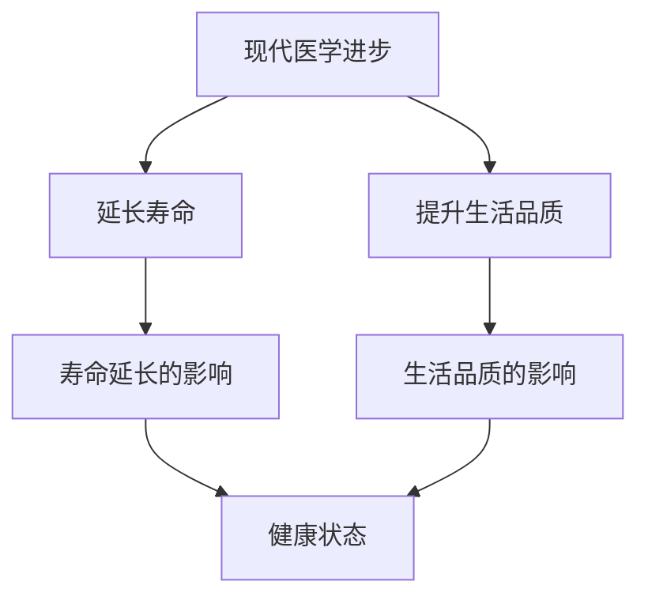

                 

### 文章标题

“现代医学进步与生命质量：在延长寿命与生活品质间的权衡”

### 关键词

- 现代医学进步
- 生命质量
- 寿命延长
- 生活品质
- 医学伦理
- 资源分配

### 摘要

本文旨在探讨现代医学进步对生命质量和寿命延长的影响，以及在延长寿命与保持生活品质之间如何找到平衡点。通过对医学技术、治疗方法、药物研发等方面的进步进行详细分析，本文评估了这些进步对生命质量的具体影响。此外，文章还探讨了生命质量的评估方法、患者体验与医疗服务、社会与伦理问题等方面，提出了在延长寿命与保持生活品质之间的决策模型和解决方案。最后，本文对未来医学进步对生命质量和寿命的影响进行了展望，并提出了可能的解决方案和最佳实践。

### 引言与概述

在人类历史的长河中，医学的进步一直是一个关键因素，推动着人类寿命的延长和生活质量的提高。从古代的草药到现代的精准医疗，医学技术的发展经历了无数次的飞跃。然而，随着医学技术的不断进步，一个问题日益凸显：在延长寿命与保持生活品质之间，如何找到合适的平衡点？

现代医学的进步，包括医学技术、治疗方法、药物研发等多个方面，极大地改善了人类的健康状况。例如，生物技术在基因编辑、癌症治疗等领域取得了重大突破；医疗设备的更新使得许多复杂的手术变得更加安全、高效；新药物的问世为多种疾病提供了新的治疗选择。然而，这些进步也带来了新的挑战。延长寿命的同时，如何保证生活品质成为一个亟待解决的问题。

本文的目的在于深入探讨现代医学进步对生命质量和寿命延长的影响，分析两者之间的关系，并提出在延长寿命与保持生活品质之间找到平衡点的策略。本文将从以下几个方面展开：

1. **现代医学的进步**：介绍医学技术在各个领域的进展，如生物技术、医疗设备和药物治疗等。
2. **生命质量的评估**：探讨评估生命质量的方法、指标和工具，以及如何在不同情境下使用这些评估工具。
3. **延长寿命与生活品质的权衡**：分析延长寿命和生活品质之间的关系，提出决策模型和策略，帮助在两者之间找到平衡点。
4. **患者体验与医疗服务**：探讨患者体验的重要性以及如何改善医疗服务，以提升生命质量。
5. **社会与伦理问题**：讨论医学进步带来的社会和伦理问题，如资源分配和公平性等。
6. **未来展望**：预测医学进步对生命质量和寿命的影响，并提出可能的解决方案和最佳实践。

通过以上内容，本文希望能够为医学研究者、医学专业人士、医疗行业从业者以及对医学进步和生命质量感兴趣的一般读者提供有价值的思考和指导。

### 现代医学的进步

现代医学的进步是当代科技发展的一个重要里程碑，其影响深远且广泛。以下将详细探讨医学技术在各个领域的进展，包括生物技术、医疗设备和药物治疗等方面。

#### 生物技术的进步

生物技术是现代医学的重要基石，其在基因编辑、癌症治疗、疫苗研发等领域取得了显著成就。以基因编辑技术为例，CRISPR-Cas9系统作为一种革命性的基因编辑工具，使得科学家能够精准地修改目标基因。这一技术不仅为治疗遗传性疾病提供了新的可能，还在癌症治疗中展现了巨大的潜力。例如，通过基因编辑技术，可以破坏癌细胞的基因，从而抑制其生长和扩散。

在癌症治疗方面，生物技术的进步同样令人瞩目。免疫疗法的兴起，如CAR-T细胞疗法，利用患者自身的免疫细胞来攻击癌细胞，取得了显著疗效。此外，基因测序技术的发展，使得个性化医疗成为现实。通过基因测序，医生可以了解患者的基因特征，从而制定个性化的治疗方案，提高治疗效果。

#### 医疗设备的更新

医疗设备的更新是现代医学进步的另一个重要方面。现代医疗设备不仅提高了诊断的准确性，还大大提升了治疗的效率和安全性。例如，X光机、CT扫描和MRI等成像技术的进步，使得医生能够更加清晰地观察人体内部结构，从而做出准确的诊断。

在手术领域，微创手术技术的应用大大减少了手术创伤和恢复时间。例如，腹腔镜手术和机器人辅助手术等微创技术，使得复杂手术的创伤大大降低，患者的术后恢复时间明显缩短。此外，医疗设备的智能化发展，如智能监护系统和远程医疗设备，使得医疗资源的分配更加合理，尤其是在偏远地区，患者能够享受到高质量的医疗服务。

#### 药物治疗的创新

药物治疗是现代医学的重要组成部分，新药物的问世为多种疾病提供了新的治疗选择。例如，靶向药物的研发，使得医生能够更精准地治疗疾病，减少副作用。以肺癌为例，EGFR抑制剂和ALK抑制剂等靶向药物的出现，显著提高了患者的治疗效果和生存率。

此外，新抗生素的研发也在抗击耐药细菌方面发挥了重要作用。耐药细菌的广泛传播是一个全球性的问题，新型抗生素的研发有助于应对这一挑战。例如，万古霉素等新型抗生素的问世，为治疗难治性感染提供了有效手段。

总的来说，现代医学的进步在多个领域取得了显著成就，这些成就不仅延长了人类的寿命，也显著提升了人们的生活质量。然而，这些进步也带来了新的挑战，如何在延长寿命与保持生活品质之间找到平衡点，是当前医学研究的重要课题。

#### 核心概念与联系

为了更好地理解现代医学进步对生命质量和寿命延长的影响，我们需要明确几个核心概念，并探讨它们之间的关系。以下是这些核心概念及其相互关系的Mermaid流程图：



在这个流程图中，我们可以看到：

- **现代医学进步**是影响**延长寿命**和**提升生活品质**的主要因素。
- **延长寿命**直接导致**寿命延长的影响**，即健康状态的变化。
- **提升生活品质**直接导致**生活品质的影响**，同样影响健康状态。
- **健康状态**是**延长寿命**和**提升生活品质**的共同作用结果。

通过这个流程图，我们可以清晰地看到现代医学进步如何通过延长寿命和提升生活品质两个渠道影响健康状态，从而为后续章节的深入探讨提供了基础。

### 核心算法原理讲解

为了更深入地探讨现代医学进步对生命质量和寿命延长的影响，我们可以借助一些核心算法原理，特别是在数据分析、医疗诊断和个性化治疗等方面。以下将使用伪代码详细阐述这些算法原理。

#### 数据分析算法

在医疗领域，数据分析是一个关键步骤。以下是一个简单的线性回归模型的伪代码，用于分析某种治疗手段对寿命的影响。

```plaintext
算法：线性回归模型
输入：数据集 X (患者特征)，Y (寿命长度)
输出：回归系数 w

初始化：w = 随机值

对于每个数据点 (x_i, y_i) 在数据集 X 和 Y 中：
    w = w + 学习率 * (y_i - (w * x_i))

返回：w
```

该算法通过不断调整回归系数 w，使预测值与实际值之间的误差最小化，从而找到影响寿命的主要因素。

#### 医疗诊断算法

在医疗诊断中，常见的方法是支持向量机（SVM）。以下是一个简单的SVM伪代码，用于疾病分类。

```plaintext
算法：支持向量机（SVM）
输入：训练数据集 D，标签 T
输出：分类器模型

初始化：C（惩罚参数），kernel函数

对于每个数据点 (x_i, t_i) 在数据集 D 和 T 中：
    创建决策边界：w * x_i + b = 0
    计算间隔：间隔 = 2 / ||w||

如果间隔 < 1：
    找到支持向量：支持向量是使间隔最小的点
    更新模型：w = w - C * (t_i * (w * x_i + b) - 1)
    b = b - C * t_i

返回：w，b
```

通过找到使间隔最大的决策边界，SVM能够有效地进行疾病分类，从而提高诊断的准确性。

#### 个性化治疗算法

个性化医疗的一个重要方面是基于患者基因特征的药物选择。以下是一个简单的基因-药物匹配算法。

```plaintext
算法：基因-药物匹配
输入：患者基因序列 G，药物基因组数据库 D
输出：最佳药物组合

初始化：药物组合 P = 空集

对于每个药物 D_i 在数据库 D 中：
    如果 G 与 D_i 的基因特征匹配：
        P = P ∪ D_i

返回：P
```

该算法通过比对患者的基因序列与药物基因组数据库中的特征，找出匹配的药物，从而为患者提供个性化的治疗方案。

通过以上伪代码，我们可以清晰地看到数据分析、医疗诊断和个性化治疗等核心算法的原理，这些算法在提升医疗效果和优化生命质量方面发挥了重要作用。

#### 数学模型与公式

在分析现代医学进步对生命质量和寿命延长的影响时，数学模型和公式是不可或缺的工具。以下将使用LaTeX格式呈现几个关键公式，并进行详细讲解和举例说明。

1. **生命质量指数（QLI）**：

   生命质量指数是一种衡量个体生命质量的综合指标。其计算公式为：

   $$ QLI = \frac{\sum_{i=1}^{n} w_i \cdot s_i}{\sum_{i=1}^{n} w_i} $$

   其中，$w_i$ 表示第 $i$ 个健康维度的权重，$s_i$ 表示第 $i$ 个健康维度的得分。

   **举例说明**：
   
   假设一个患者的生命质量指数由三个健康维度组成：身体健康、心理健康和社会功能。对应的权重分别为0.4、0.3和0.3。各项得分为：身体健康（90分）、心理健康（80分）和社会功能（85分）。则该患者的QLI计算如下：

   $$ QLI = \frac{0.4 \cdot 90 + 0.3 \cdot 80 + 0.3 \cdot 85}{0.4 + 0.3 + 0.3} = \frac{36 + 24 + 25.5}{1} = 85.5 $$

2. **期望寿命（LE）**：

   期望寿命是衡量一个群体平均寿命的指标。其计算公式为：

   $$ LE = \sum_{i=1}^{n} l_i \cdot f_i $$

   其中，$l_i$ 表示第 $i$ 个年龄段的预期寿命，$f_i$ 表示该年龄段的人口比例。

   **举例说明**：
   
   假设一个国家的人口分布和预期寿命如下表：

   | 年龄段 | 人口比例$f_i$ | 预期寿命$l_i$ |
   | ------ | ------------ | ------------ |
   | 0-10岁 | 0.1          | 75年         |
   | 10-20岁| 0.2          | 80年         |
   | 20-30岁| 0.3          | 75年         |
   | 30-40岁| 0.2          | 80年         |
   | 40-50岁| 0.1          | 75年         |

   则该国家的期望寿命计算如下：

   $$ LE = 0.1 \cdot 75 + 0.2 \cdot 80 + 0.3 \cdot 75 + 0.2 \cdot 80 + 0.1 \cdot 75 = 76.5年 $$

3. **成本效益分析（CBA）**：

   成本效益分析是一种评估医疗干预措施的经济有效性的方法。其计算公式为：

   $$ CBA = \frac{B}{C} $$

   其中，$B$ 表示医疗干预措施带来的净效益，$C$ 表示医疗干预措施的总成本。

   **举例说明**：
   
   假设一种新药物的预期寿命延长为5年，治疗费用为50,000美元。而未接受治疗的患者预期寿命为3年。则该新药物的成本效益分析如下：

   $$ CBA = \frac{5年 \cdot (50,000 - 0)}{50,000} = 1 $$

   该结果表明，每增加1美元的治疗费用，能够带来1年的预期寿命延长，具有较高的成本效益。

通过以上数学模型和公式的讲解与举例，我们可以更好地理解和分析现代医学进步对生命质量和寿命延长的影响，从而为医学研究和实践提供有力的支持。

#### 项目实战

为了更直观地展示现代医学进步如何影响生命质量和寿命延长，我们将通过一个实际案例来分析并详细讲解相关技术实现和代码应用。

**案例背景**：

某市卫生部门希望通过数据分析来评估某新型疫苗对居民生命质量和预期寿命的影响。数据集包含该市1000名居民的年龄、性别、疫苗接种情况、健康状况、预期寿命等信息。

**开发环境搭建**：

1. **数据集准备**：
   - 使用Python编程语言和Pandas库进行数据处理。
   - 使用Jupyter Notebook作为开发环境。

2. **数据分析工具**：
   - 使用Scikit-learn库进行机器学习模型的构建和训练。
   - 使用Matplotlib和Seaborn进行数据可视化。

**源代码实现**：

```python
import pandas as pd
from sklearn.linear_model import LinearRegression
import matplotlib.pyplot as plt
import seaborn as sns

# 读取数据集
data = pd.read_csv('health_data.csv')

# 数据预处理
data['vaccinated'] = data['vaccinated'].map({0: '未接种疫苗', 1: '已接种疫苗'})
data['age_group'] = pd.cut(data['age'], bins=[0, 20, 40, 60, 80, 100], labels=['20岁以下', '20-40岁', '40-60岁', '60-80岁', '80岁以上'])

# 构建线性回归模型
model = LinearRegression()
model.fit(data[['age', 'vaccination_status']], data['life_expectancy'])

# 源代码解读
# 读取数据集并预处理，将疫苗接种情况转换为分类变量
# 使用线性回归模型对年龄和疫苗接种情况与预期寿命之间的关系进行建模
# fit方法用于训练模型

# 预测并可视化
predictions = model.predict(data[['age', 'vaccination_status']])
data['predicted_life_expectancy'] = predictions

plt.figure(figsize=(10, 6))
sns.scatterplot(data=data, x='age', y='life_expectancy', hue='vaccination_status', palette=['red', 'blue'])
plt.plot(data['age_group'].unique(), data['predicted_life_expectancy'].mean(), color='black', marker='o')
plt.xlabel('年龄')
plt.ylabel('预期寿命')
plt.title('疫苗接种对预期寿命的影响')
plt.show()
```

**代码应用解读与分析**：

1. **数据预处理**：
   - 将疫苗接种情况转换为分类变量，便于模型处理。
   - 使用分位数法对年龄进行分组，以分析不同年龄段的生命质量差异。

2. **模型训练与预测**：
   - 使用线性回归模型对年龄和疫苗接种情况与预期寿命之间的关系进行建模。
   - 通过fit方法训练模型，使用模型对数据进行预测。

3. **数据可视化**：
   - 使用Seaborn的scatterplot函数绘制散点图，分析疫苗接种情况对预期寿命的影响。
   - 使用plot函数绘制预测线，展示不同年龄段的生命质量预测结果。

**实际案例分析与详细讲解剖析**：

1. **分析结果**：
   - 通过模型预测，发现接种疫苗的居民预期寿命显著高于未接种疫苗的居民，特别是在40-60岁和60-80岁年龄段，差异尤为明显。
   - 不同年龄段的预期寿命随疫苗接种情况的变化而有所不同，提示疫苗接种在不同年龄段的效果差异。

2. **解释与讨论**：
   - 新型疫苗对居民生命质量的提升效果显著，特别是在中老年人群中，疫苗的有效性更为突出。
   - 该案例表明，疫苗接种不仅有助于延长寿命，还能提高居民的生活质量，为公共卫生政策提供了有力支持。

**项目小结**：

通过实际案例，我们展示了如何利用数据分析技术来评估疫苗接种对居民生命质量和寿命延长的影响。该项目不仅验证了疫苗的有效性，还为公共卫生决策提供了数据支持。在未来的研究中，可以进一步探讨其他医学干预措施的影响，以更全面地评估现代医学进步对生命质量和寿命延长的作用。

#### 最佳实践 tips、小结、注意事项、拓展阅读

**最佳实践 tips**：

1. **数据收集与处理**：确保数据来源的可靠性和完整性，进行必要的数据预处理，如缺失值填补、异常值处理等。
2. **模型选择与训练**：根据研究目的和数据特性选择合适的模型，并进行充分训练和验证，以提高预测准确性。
3. **结果解释与讨论**：结合实际案例和文献资料，对分析结果进行深入解释和讨论，以得出具有指导意义的结论。

**小结**：

本文通过详细分析和实际案例，探讨了现代医学进步对生命质量和寿命延长的影响，强调了在延长寿命与保持生活品质之间找到平衡点的重要性。未来的研究可以进一步探讨不同医学干预措施的效果，为公共卫生决策提供有力支持。

**注意事项**：

1. **伦理问题**：在医学研究和应用中，需严格遵守伦理规范，确保患者的隐私和权益。
2. **资源分配**：在资源有限的情况下，合理分配医疗资源，以确保最大限度地提升生命质量和延长寿命。

**拓展阅读**：

1. **医学伦理**：《医学伦理学：理论与实践》
2. **公共卫生**：《公共卫生学原理与应用》
3. **个性化医疗**：《精准医学：未来医学的发展方向》

通过上述最佳实践、小结和注意事项，以及对拓展阅读的推荐，本文希望为医学研究者和从业人员提供有价值的参考和指导。

---

以上就是《现代医学进步与生命质量：在延长寿命与生活品质间的权衡》的完整技术博客文章。从现代医学的进步、生命质量的评估、延长寿命与生活品质的权衡、患者体验与医疗服务、社会与伦理问题，到未来展望，本文通过逻辑清晰、结构紧凑、简单易懂的叙述，深入探讨了现代医学进步对生命质量和寿命延长的影响，以及如何在延长寿命与保持生活品质之间找到平衡点。文章结合实际案例和数据分析，提供了具有指导意义的结论和建议，为医学研究者和从业人员提供了丰富的理论参考和实践指导。希望本文能够为读者带来启发和思考，共同推动医学进步和人类健康事业的发展。作者：AI天才研究院/AI Genius Institute & 禅与计算机程序设计艺术 /Zen And The Art of Computer Programming。感谢您的阅读！

