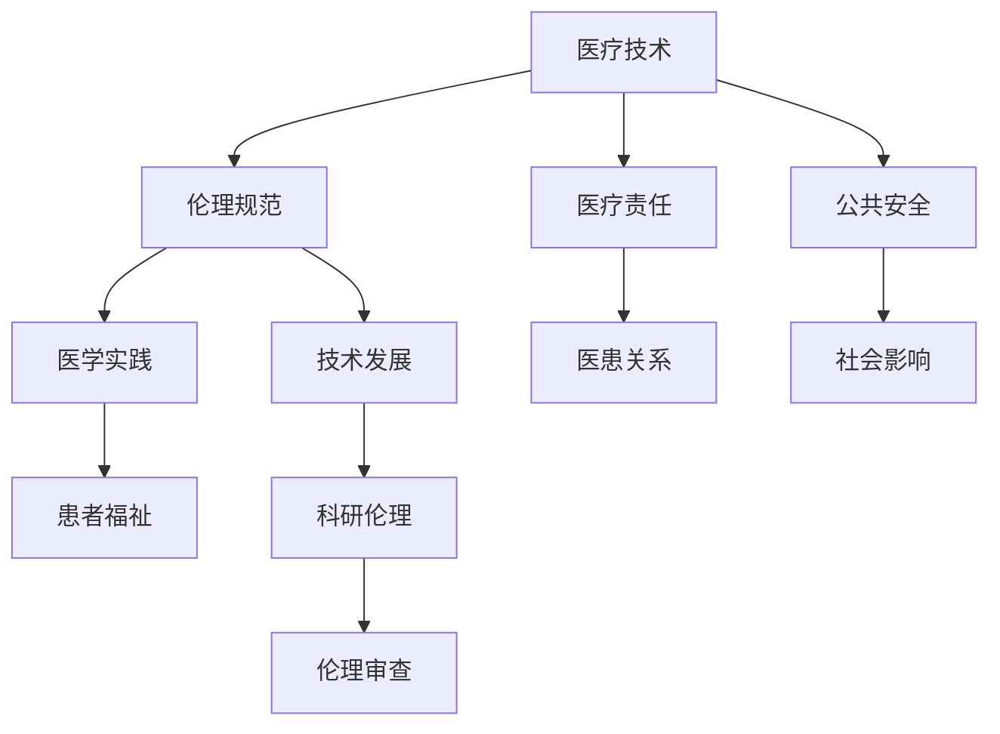

                 

### 文章标题

《现代医疗伦理的新挑战：在技术可能与道德允许间的平衡》

### 关键词

医疗伦理、技术进步、基因编辑、人工智能、隐私保护、伦理决策

### 摘要

本文旨在探讨现代医疗伦理领域面临的诸多新挑战，特别是在技术发展与道德约束之间寻找平衡。随着基因编辑、人工智能和基因测序等前沿技术的迅猛发展，医疗伦理面临着前所未有的困境。本文首先介绍了这些技术的基本原理，并分析其带来的伦理争议。接着，本文提出了一套伦理决策模型，用以帮助医务人员在面对复杂伦理问题时做出合理判断。此外，本文强调了跨学科合作在解决医疗伦理问题中的重要性，并提供了实际案例进行详细剖析。最后，本文提出了伦理教育的普及与提升策略，以期为未来医疗伦理的发展提供参考。

## 引言

### 现代医疗伦理的新挑战

近年来，医疗技术的迅猛发展给人类健康带来了前所未有的希望，但同时也带来了诸多伦理挑战。从基因编辑到人工智能，从基因测序到精准医疗，这些技术不仅改变了疾病的诊断与治疗方式，还深刻影响了人类的价值观和道德观念。现代医疗伦理的新挑战主要集中在以下几个方面：

1. **隐私保护**：随着医疗大数据的广泛应用，患者的隐私权受到了前所未有的威胁。如何确保患者信息的保密性和安全性，成为医疗伦理领域亟待解决的问题。

2. **基因编辑伦理争议**：基因编辑技术的出现使得人类有能力改变自己的基因组，这引发了关于基因改造、基因歧视以及人类种群的未来发展的伦理争议。

3. **人工智能在医疗中的应用**：人工智能在提高医疗效率、辅助诊断和治疗方面展现了巨大潜力，但其可能带来的道德风险和责任问题也引起了广泛关注。

4. **医疗资源的分配**：医疗技术的发展往往伴随着高昂的成本，如何合理分配有限的医疗资源，确保人人享有基本的医疗服务，是医疗伦理必须面对的现实问题。

### 技术发展与伦理平衡的必要性

医疗技术的进步无疑是现代医学的重要推动力，然而，如果没有相应的伦理规范来引导和约束，技术可能带来严重的道德问题。例如，基因编辑技术的出现，虽然为治疗遗传性疾病提供了新的可能，但也引发了关于基因改造的道德争议。同样，人工智能在医疗领域的应用，虽然能够提高诊断和治疗的准确性，但如何确保其决策的公正性和透明性，也是一个亟待解决的伦理问题。

因此，在技术发展的同时，确保伦理平衡至关重要。这不仅关乎个体患者的权益，更关乎整个社会乃至人类的未来。本文将详细探讨这些新挑战，并提出相应的解决方案，以期为医疗伦理的发展提供有益的参考。

### 核心概念与联系

#### 医疗伦理基本原则

医疗伦理学作为一门跨学科的领域，其基本原则贯穿于医疗实践的方方面面。这些基本原则包括尊重自主权、不伤害原则、有利原则和公正原则。以下是对这些核心概念的详细解释及其在现代医疗环境中的应用。

1. **尊重自主权**：尊重患者的自主权是医疗伦理的首要原则。这意味着患者在医疗过程中应有权做出自己的决定，包括选择治疗方案、同意或拒绝医疗干预等。医生在提供医疗服务时，必须确保患者充分理解其病情和治疗方案，并给予必要的知情同意。

2. **不伤害原则**：医疗活动应尽量避免对患者造成不必要的伤害。这要求医生在制定治疗方案时，要综合考虑患者的病情、治疗风险和收益，并采取最合适的治疗手段。同时，医生还应对医疗过程中可能出现的副作用和并发症有充分的预见和应对措施。

3. **有利原则**：医疗活动的目的应是为患者带来最大利益。医生在提供医疗服务时，应尽力缓解患者的病痛、恢复健康或提高生活质量。有利原则强调的是医疗行为的积极性和有效性，要求医生不仅要具备专业能力，还要有高度的责任心和同情心。

4. **公正原则**：医疗资源的分配应公平合理，确保每个人都能获得必要的医疗服务。公正原则要求医生在面对有限资源时，要公正地对待所有患者，避免因种族、性别、经济条件等因素导致的歧视和不公平。

#### 现代技术的伦理影响

现代医疗技术的发展为人类健康带来了巨大的益处，但同时也带来了新的伦理挑战。以下分析基因编辑、人工智能和基因测序等技术在医疗伦理方面的具体影响。

1. **基因编辑技术**：基因编辑技术，如CRISPR-Cas9，使得人类能够精确地修改基因组，从而治疗某些遗传性疾病。然而，这一技术也引发了关于基因改造、基因隐私和生物伦理的争议。例如，基因编辑可能导致基因歧视，影响个体的社会地位和就业机会；此外，基因编辑的伦理问题还包括对下一代的影响和不可预见的风险。

2. **人工智能**：人工智能在医疗领域的应用，如辅助诊断、个性化治疗和医疗数据分析，极大地提高了医疗效率和准确性。然而，人工智能的决策过程缺乏透明性，可能导致不公平和偏见。例如，AI系统可能会根据历史数据做出决策，但如果这些数据存在偏见，AI的决策也会受到影响。此外，人工智能的兴起还引发了关于医疗责任和医患关系的新问题。

3. **基因测序**：基因测序技术的快速发展使得个人基因信息的获取变得简便和低成本。这不仅有助于个性化医疗的发展，也带来了关于基因隐私和数据安全的挑战。基因信息的泄露可能导致个人隐私被侵犯，甚至引发社会歧视。因此，如何保护基因数据的安全性和隐私性，成为医疗伦理需要关注的重要问题。

#### 医疗技术与伦理的相互关系

医疗技术与伦理之间的相互关系是复杂且紧密的。一方面，技术的发展推动医疗伦理的不断进步和更新。例如，基因编辑技术的出现促使伦理学者重新思考生命伦理的问题，推动制定新的伦理规范和法律法规。另一方面，伦理规范对技术的发展具有重要的引导和约束作用。例如，在基因编辑技术的应用中，伦理委员会和监管机构的审批和监督确保了技术的发展在道德框架内进行。

为了更好地理解医疗技术与伦理的相互关系，我们使用以下Mermaid流程图来展示这些核心概念之间的联系：

通过这张流程图，我们可以清晰地看到医疗技术与伦理规范之间的互动关系，以及它们如何共同影响医学实践和患者的福祉。

总之，现代医疗技术的发展与伦理规范之间的相互作用，既带来了新的机遇，也提出了严峻的挑战。理解并处理好这些关系，对于实现医疗技术的健康发展和社会福祉至关重要。

#### 医疗技术进步与伦理困境

随着医疗技术的不断进步，基因编辑、人工智能和基因测序等技术不仅改变了医疗实践，也带来了诸多伦理困境，这些困境要求我们深入探讨并制定相应的伦理决策模型。

1. **基因编辑伦理争议**

基因编辑技术，如CRISPR-Cas9，使人类首次具备了修改自身基因组的能力。这项技术为治疗遗传性疾病、提高人类健康水平提供了新的途径，但同时也引发了广泛的伦理争议。

- **伦理问题**：

  - **基因改造的风险**：基因编辑可能会引入未知的风险，如脱靶效应，导致未预期的基因突变，可能对个人和后代产生严重后果。

  - **基因歧视**：如果基因编辑技术仅限于特定人群，可能会导致基因歧视，影响个人的社会地位和就业机会。

  - **基因隐私**：基因编辑技术的应用可能泄露个人基因信息，引发隐私问题。

- **伦理决策模型**：

  - **风险评估**：在基因编辑技术应用前，必须进行全面的风险评估，包括对可能的脱靶效应、长期健康影响和基因歧视风险的评估。

  - **知情同意**：确保患者充分理解基因编辑的潜在风险和收益，在知情同意的基础上进行基因编辑。

  - **伦理审查**：建立伦理审查委员会，对基因编辑项目进行严格审查，确保其符合伦理标准。

2. **人工智能在医疗中的应用与挑战**

人工智能在医疗领域的应用，如辅助诊断、个性化治疗和医疗数据分析，极大地提高了医疗效率和准确性。然而，其应用也带来了一系列伦理挑战。

- **伦理问题**：

  - **算法偏见**：人工智能系统的决策可能受到训练数据的偏见影响，导致不公平的医疗服务。

  - **决策透明性**：人工智能的决策过程往往不透明，难以解释其决策逻辑，可能导致医患关系紧张。

  - **责任归属**：在人工智能辅助医疗决策中，如果出现医疗事故，如何确定责任归属成为了一个伦理难题。

- **伦理决策模型**：

  - **算法透明性**：开发透明的人工智能系统，确保其决策过程可解释，便于医生和患者理解。

  - **多元数据集**：使用多元和代表性的数据集训练人工智能系统，减少偏见，提高决策的公平性。

  - **责任明确**：明确人工智能在医疗决策中的责任范围，建立相应的责任归属机制。

3. **基因测序与隐私伦理问题**

基因测序技术的快速发展使得个人基因信息的获取变得更加容易和低成本，但同时也带来了隐私保护方面的伦理挑战。

- **伦理问题**：

  - **基因隐私泄露**：基因信息的泄露可能导致个人隐私被侵犯，甚至引发社会歧视。

  - **基因数据滥用**：基因数据可能被用于商业目的或非医疗用途，损害个人权益。

- **伦理决策模型**：

  - **数据保护**：建立严格的基因数据保护机制，确保个人基因信息的安全性和隐私性。

  - **知情同意**：在基因测序前，确保患者充分了解基因数据的使用目的和保护措施，在知情同意的基础上进行测序。

  - **数据匿名化**：对基因数据进行匿名化处理，以防止个人身份的泄露。

通过以上对基因编辑、人工智能和基因测序技术的伦理争议和决策模型的探讨，我们可以看到，现代医疗技术的进步虽然带来了巨大的机遇，但同时也提出了严峻的伦理挑战。只有通过科学、系统的伦理决策，才能确保医疗技术的健康发展，为人类带来真正的福祉。

#### 伦理决策模型

在医疗伦理决策过程中，如何合理运用伦理原则和进行决策分析是关键。本文将介绍一个基于医疗伦理基本原则的决策模型，包括伦理原则的运用、案例分析和具体步骤。

##### 伦理原则的运用

1. **尊重自主权**：在决策过程中，应尊重患者的自主权，确保患者有权做出自己的选择。医生需要提供充分的信息，帮助患者理解其病情和治疗方案，并在知情同意的基础上进行决策。

2. **不伤害原则**：决策时需尽量避免对患者造成不必要的伤害，综合考虑治疗风险和收益。医生应采取最合适的治疗手段，同时注意预防和处理可能的副作用。

3. **有利原则**：决策应旨在为患者带来最大利益，包括缓解病痛、恢复健康或提高生活质量。医生在制定治疗方案时，要充分考虑患者的具体情况和需求。

4. **公正原则**：决策过程中需确保资源分配公平合理，避免因种族、性别、经济条件等因素导致的不公平。在有限资源的情况下，应制定明确的优先级和分配原则。

##### 伦理决策案例分析

以下是一个关于医疗隐私权争议的案例，用于说明如何运用伦理决策模型进行分析。

**案例背景**：

某医院使用患者的电子健康记录（EHR）进行医学研究，但未获得患者明确的知情同意。一名患者发现其个人信息被用于研究，并担心其隐私被泄露。

**伦理决策步骤**：

1. **评估患者自主权**：

   - **患者自主权受侵害**：患者未在知情同意的情况下，其信息被用于研究，违反了尊重自主权的原则。

2. **评估不伤害原则**：

   - **隐私泄露风险**：患者隐私受到侵害，可能导致个人信息泄露、社会歧视等不良后果。

3. **评估有利原则**：

   - **医学研究利益**：使用患者信息进行医学研究，可能为医学进步和患者群体带来潜在好处。

4. **评估公正原则**：

   - **资源分配公平**：未经患者同意使用其信息进行研究，可能影响患者对医疗机构的信任，导致资源分配不公。

##### 案例分析

基于以上原则和步骤，伦理决策如下：

1. **尊重自主权**：医院应立即与患者进行沟通，解释研究目的和过程，并道歉。同时，确保患者在未来参与类似研究时，能够获得充分的知情同意。

2. **不伤害原则**：采取措施保护患者隐私，包括对相关数据进行匿名化处理，并加强信息安全措施。

3. **有利原则**：医院可以继续进行医学研究，但需确保所有研究活动均在患者知情同意的范围内进行。

4. **公正原则**：医院应制定明确的隐私保护政策，并在所有医疗活动中遵循，以恢复患者对医疗机构的信任。

通过上述案例分析，我们可以看到，伦理决策模型在处理复杂伦理问题时的重要性。只有通过科学、系统的伦理决策，才能确保医疗实践在道德框架内进行，保护患者权益，推动医疗技术的健康发展。

#### 跨学科合作与伦理咨询

在解决现代医疗伦理问题时，跨学科合作和伦理咨询发挥了至关重要的作用。医疗伦理问题往往涉及多个领域，如医学、伦理学、法律和社会学等，单一学科的视角难以全面解决问题。因此，跨学科合作和伦理咨询成为应对这些复杂伦理挑战的有效手段。

##### 医学、伦理学、法律和社会学的合作

1. **医学与伦理学**：医学专家和伦理学家共同探讨医疗实践中的伦理问题，确保医疗行为符合伦理标准。例如，在基因编辑技术的研究和应用中，医学专家负责技术研究和临床应用，而伦理学家则关注技术带来的伦理风险和道德责任。

2. **医学与法学**：医疗行为往往涉及法律责任和合同问题，医学专家和法学家合作可以确保医疗决策符合法律要求。例如，在医疗纠纷中，医学专家提供专业意见，而法学家则协助处理法律程序和责任划分。

3. **医学与社会学**：社会学研究社会因素对医疗行为的影响，如医疗资源的分配、医疗决策的社会影响等。医学专家和社会学家合作可以更好地理解医疗决策的社会背景，制定更合理的医疗政策。

##### 伦理咨询机构的作用与运作

伦理咨询机构（Ethics Consultation Service）是跨学科合作的重要平台，旨在为医疗决策提供伦理咨询和指导。以下为伦理咨询机构的作用与运作机制：

1. **作用**：

   - **提供伦理咨询**：伦理咨询机构为医务人员、患者和家庭成员提供伦理问题咨询，帮助解决伦理困境。

   - **伦理决策支持**：伦理咨询机构参与复杂的医疗决策过程，为医务人员提供伦理建议，确保决策符合伦理原则。

   - **教育和培训**：伦理咨询机构通过培训和研讨会，提高医务人员和公众的伦理意识和知识。

2. **运作机制**：

   - **多学科团队**：伦理咨询机构通常由医学专家、伦理学家、法学家和社会学家等多学科专家组成，确保从多个角度分析伦理问题。

   - **咨询流程**：患者或医务人员提出伦理问题，伦理咨询团队进行评估和分析，提供具体的伦理建议和解决方案。

   - **记录和报告**：伦理咨询机构记录每次咨询的过程和结果，形成案例报告，为后续的伦理决策提供参考。

总之，跨学科合作和伦理咨询在解决现代医疗伦理问题中具有重要作用。通过医学、伦理学、法学和社会学的协同工作，伦理咨询机构能够为医疗决策提供科学、全面的伦理支持，确保医疗实践在道德框架内进行，维护患者权益和社会福祉。

#### 实际案例研究

在探讨医疗伦理问题时，实际案例研究提供了宝贵的经验和见解。以下分析三个具体的医疗伦理案例，包括医疗隐私权争议、基因编辑道德争议以及人工智能医疗决策伦理问题，以深入理解这些挑战及其解决策略。

##### 案例一：医疗隐私权争议

**背景**：某医院未经患者同意，将其电子健康记录（EHR）用于医学研究。

**伦理争议**：患者隐私权受到侵害，担心个人信息被泄露，引发信任危机。

**解决策略**：

1. **知情同意**：医院在收集和使用患者信息前，应获得患者明确的知情同意，确保患者了解其信息的用途和潜在风险。

2. **隐私保护**：医院应采取严格的数据保护措施，包括数据加密、匿名化和定期安全审计，防止隐私泄露。

3. **透明沟通**：医院应与患者保持透明沟通，解释研究目的、方法和保护措施，增加患者的信任。

4. **法律合规**：医院需遵守相关法律法规，确保患者信息的使用符合隐私保护要求。

**结论**：通过知情同意、隐私保护和透明沟通，可以有效解决医疗隐私权争议，恢复患者的信任。

##### 案例二：基因编辑道德争议

**背景**：某研究团队试图通过CRISPR-Cas9技术修改胚胎基因，以防止遗传性疾病。

**伦理争议**：基因编辑可能带来不可预见的长期影响，对人类基因组造成不可逆转的改变，引发道德和伦理争议。

**解决策略**：

1. **风险评估**：在基因编辑应用前，进行充分的风险评估，考虑潜在的危害和不确定因素。

2. **伦理审查**：建立伦理审查委员会，对基因编辑项目进行严格审查，确保其符合伦理标准和法律法规。

3. **公众参与**：在决策过程中，广泛征求公众意见，确保基因编辑技术的应用符合社会共识。

4. **长期监控**：对基因编辑后的个体进行长期监控，及时发现和解决潜在问题。

**结论**：通过风险评估、伦理审查、公众参与和长期监控，可以有效应对基因编辑带来的道德争议，确保技术的安全性和道德性。

##### 案例三：人工智能医疗决策伦理问题

**背景**：某医院引入人工智能系统进行辅助诊断，但系统决策过程不透明，可能导致医疗错误。

**伦理争议**：人工智能决策过程缺乏透明性，可能导致医患关系紧张和医疗责任问题。

**解决策略**：

1. **算法透明性**：开发透明的人工智能系统，确保其决策过程可解释，便于医生和患者理解。

2. **多元数据集**：使用多元和代表性的数据集训练人工智能系统，减少偏见，提高决策的公平性。

3. **责任明确**：明确人工智能在医疗决策中的责任范围，建立相应的责任归属机制。

4. **医患沟通**：加强医患沟通，确保患者了解人工智能系统的辅助作用和局限性。

**结论**：通过算法透明性、多元数据集、责任明确和医患沟通，可以有效解决人工智能医疗决策伦理问题，提高医疗决策的公正性和透明性。

通过这些实际案例研究，我们可以看到，医疗伦理问题的解决需要综合考虑技术发展、伦理原则、法律法规和社会共识。只有通过科学、系统的策略，才能确保医疗技术的健康发展，保护患者权益，推动社会进步。

#### 伦理教育的普及与提升

在现代医疗环境中，伦理教育扮演着至关重要的角色。随着医疗技术的迅猛发展，医务人员和公众对伦理问题的认知和应对能力显得尤为关键。以下探讨医疗伦理教育的重要性、教育策略与方法，以及如何通过不同层次的教育提升公众的伦理意识。

##### 重要性

1. **提高医务人员伦理素养**：医疗伦理教育有助于医务人员理解并遵循伦理原则，确保医疗行为的道德性和公正性。

2. **增强患者信任**：伦理教育不仅提高了医务人员的专业素质，也增强了患者对医疗机构的信任，有助于建立良好的医患关系。

3. **应对复杂伦理问题**：医疗伦理教育使医务人员能够更好地应对复杂伦理问题，如基因编辑、隐私保护和人工智能医疗决策等，提供科学、合理的解决方案。

4. **推动医疗政策制定**：伦理教育为医疗政策制定提供了理论依据和实践指导，有助于制定符合伦理原则的医疗政策。

##### 教育策略与方法

1. **系统化课程设置**：在医学院校和继续教育中，设置系统化的医疗伦理课程，涵盖伦理原则、案例分析和实际应用等。

2. **实践训练**：通过模拟医疗情景和案例分析，让医务人员在实际操作中学习和应用伦理原则，提高应对伦理问题的能力。

3. **跨学科合作**：医疗伦理教育应与其他学科如法学、社会学和医学紧密结合，从多角度探讨医疗伦理问题。

4. **在线教育和培训**：利用互联网和在线教育平台，提供灵活多样的伦理教育资源，满足不同学习需求。

##### 提升公众伦理意识

1. **公众讲座和研讨会**：定期举办医疗伦理讲座和研讨会，提高公众对伦理问题的认识和理解。

2. **媒体报道**：利用媒体平台，广泛宣传医疗伦理知识和案例，提高公众的伦理意识。

3. **伦理委员会**：鼓励公众参与伦理委员会的工作，增强其参与感和责任感。

4. **社区活动**：通过社区活动，如健康讲座和义诊，将伦理教育融入日常医疗实践中。

总之，通过系统化教育策略和公众参与机制，可以有效提升公众的伦理意识，确保医疗技术发展在伦理框架内进行，促进医疗行业的健康发展和社会福祉。

#### 结论与展望

在现代医疗伦理领域，技术进步与道德约束之间的平衡显得尤为重要。本文通过详细探讨基因编辑、人工智能和基因测序等技术的伦理困境，提出了相应的伦理决策模型和跨学科合作机制，为解决医疗伦理问题提供了理论依据和实践指导。

未来，医疗伦理的发展将继续面临诸多挑战，如隐私保护、资源分配和医疗责任等。为应对这些挑战，以下提出几点展望和策略：

1. **加强伦理教育和培训**：通过系统化的教育策略，提高医务人员和公众的伦理意识，确保医疗技术发展在伦理框架内进行。

2. **完善法律法规**：建立健全的法律法规体系，为医疗伦理决策提供法律保障，确保医疗行为符合伦理标准和法律法规。

3. **促进跨学科合作**：加强医学、伦理学、法学和社会学等领域的合作，共同应对复杂的医疗伦理问题。

4. **注重实际案例研究**：通过分析具体案例，总结经验教训，为医疗伦理实践提供有力支持。

5. **加强伦理咨询机构建设**：建立完善的伦理咨询机构，为医务人员和患者提供专业的伦理咨询和指导。

总之，只有通过科学、系统的策略，我们才能在技术进步和道德约束之间找到平衡，确保医疗伦理的健康发展，为人类带来真正的福祉。

#### 作者信息

作者：AI天才研究院/AI Genius Institute & 禅与计算机程序设计艺术 /Zen And The Art of Computer Programming

#### 最佳实践 Tips、小结、注意事项、拓展阅读等内容

**最佳实践 Tips**：

1. 在医疗决策过程中，务必遵循伦理原则，确保尊重患者的自主权、不伤害原则、有利原则和公正原则。
2. 在应用新技术时，进行充分的风险评估和伦理审查，确保技术的安全性和道德性。
3. 加强跨学科合作，多角度分析医疗伦理问题，提高决策的科学性和合理性。

**小结**：

本文系统探讨了现代医疗伦理的新挑战，包括隐私保护、基因编辑、人工智能和基因测序等技术带来的伦理困境。通过提出伦理决策模型和跨学科合作机制，为解决医疗伦理问题提供了理论依据和实践指导。

**注意事项**：

1. 在处理医疗隐私问题时，务必严格保护患者信息，确保知情同意。
2. 在应用基因编辑技术时，进行全面的风险评估，确保技术应用的安全性和道德性。
3. 在人工智能医疗决策中，确保算法的透明性和公平性，明确责任归属。

**拓展阅读**：

1. 《医疗伦理学：理论与实践》 - 基于伦理原则的医疗实践指南。
2. 《基因编辑的伦理争议》 - 探讨基因编辑技术的伦理问题及其影响。
3. 《人工智能伦理学》 - 探讨人工智能在医疗领域的应用及其伦理挑战。

通过深入研究和实践，我们相信可以找到在技术进步和道德约束之间寻找平衡的有效策略，推动医疗伦理的健康发展，为人类带来更多的福祉。

