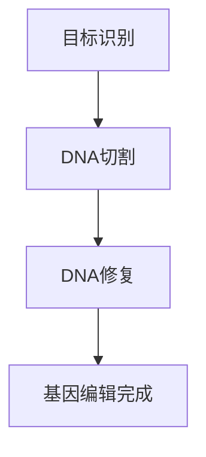

                 


### 引言与背景

#### 1.1 医疗技术的快速发展

医疗技术作为现代科技的重要组成部分，正以前所未有的速度发展。这种快速发展不仅改变了医疗行业的运作方式，还极大地影响了人们的健康和生活质量。从传统的药物治疗到现代的基因编辑技术，从传统的X光检查到高精度的MRI扫描，医疗技术不断突破着人类健康的边界。

首先，技术的进步极大地提升了疾病诊断的准确性。例如，CRISPR-Cas9基因编辑技术的问世，使得科学家能够更精确地修改人类基因，为治疗遗传性疾病提供了新的可能性。此外，精准医疗和个性化治疗的发展，使得医疗更加注重个体差异，从而提高了治疗效果。

其次，医疗信息化和大数据的应用，使得医疗数据的处理和分析变得更加高效。通过收集和分析大量患者的健康数据，医生可以更准确地预测疾病的发展趋势，制定个性化的治疗方案。这不仅提高了医疗的效率，还为医疗研究提供了宝贵的数据支持。

然而，这种技术进步也带来了许多伦理挑战。如何在推进技术发展的同时，确保伦理原则得到尊重和实施，成为了一个亟待解决的问题。

#### 1.2 伦理原则在医疗领域的应用

伦理原则是医疗实践中的重要指导原则，它们确保医疗行为不仅有效，而且符合道德规范。医学伦理的基本原则包括尊重自主权、不伤害原则、有利原则和公正原则。

尊重自主权是指患者有权自主决定自己的医疗行为，包括是否接受治疗、选择治疗方案等。在医疗技术快速发展的背景下，尊重自主权变得更加重要。例如，基因编辑技术的出现，使得患者有更多治疗选择，但同时也带来了自主权行使的新问题。

不伤害原则要求医疗行为不能给患者带来伤害。在技术进步的背景下，如何确保医疗行为不伤害患者，需要更加细致的伦理考量。例如，基因编辑技术可能会带来未知的长期风险，这就需要在伦理审查和临床试验中给予充分考虑。

有利原则要求医疗行为应当对患者有益。在个性化医疗和精准医疗中，这一原则尤为重要。医生需要根据患者的具体情况，选择最合适的治疗方案，以最大化患者的受益。

公正原则要求医疗资源分配应当公平。在医疗资源有限的背景下，如何确保所有人都能获得公平的医疗机会，是一个重要的伦理问题。

#### 1.3 现代医疗技术下的伦理困境

现代医疗技术的发展，既带来了医疗实践的巨大进步，也引发了许多伦理困境。以下是一些关键伦理议题：

- **基因编辑技术的伦理争议**：基因编辑技术的出现，使得人类有能力修改自己的基因。然而，这种技术是否应当用于治疗遗传性疾病，是否应当用于增强人类的能力，以及如何确保这种技术的安全性，都是需要深入探讨的伦理问题。
- **医疗大数据的隐私保护**：医疗大数据的应用，极大地提升了医疗的效率，但也带来了患者隐私保护的挑战。如何在充分利用医疗数据的同时，确保患者的隐私不被侵犯，是一个重要的伦理议题。
- **人工智能在医疗中的应用**：人工智能在医疗诊断、药物研发等领域具有巨大潜力，但也存在伦理问题。例如，AI诊断工具的准确性和可靠性如何保证？AI药物研发中，如何确保药物的安全性？这些都是需要深入探讨的伦理问题。

总之，现代医疗技术的发展，既为医学进步提供了新的机遇，也带来了新的伦理挑战。如何在技术进步和伦理允许之间找到平衡，是医疗行业面临的重大课题。

### 现代医疗技术概述

#### 2.1 生物技术的发展

生物技术是现代医疗技术的重要组成部分，其应用范围广泛，包括基因编辑、精准医疗和个性化治疗等。

**基因编辑技术的原理与应用**

基因编辑技术是一种能够对特定DNA序列进行精确修改的技术。目前最常用的基因编辑技术是CRISPR-Cas9系统。该系统的基本原理是利用一种称为“引导RNA”（guide RNA）的分子，来定位特定的DNA序列，并通过Cas9蛋白切割DNA链，从而实现基因的插入、删除或替换。

**CRISPR-Cas9技术的原理与优势**

CRISPR-Cas9系统的工作流程可以分为三个主要步骤：目标识别、DNA切割和DNA修复。

1. **目标识别**：引导RNA与目标DNA序列结合，形成复合物。
2. **DNA切割**：Cas9蛋白识别并结合到目标DNA序列上，通过切割酶活性，在目标序列上形成双链断裂。
3. **DNA修复**：细胞自身的DNA修复机制会修复切割产生的双链断裂，这一过程可能引入新的DNA序列，从而实现基因编辑。

CRISPR-Cas9技术的优势在于其高效性、准确性和易用性。它可以在几天内完成基因编辑，且编辑效率高，误差率低。

**基因编辑伦理议题分析**

基因编辑技术的快速发展，引发了广泛的伦理争议。以下是一些主要的伦理议题：

1. **尊重自主权与知情同意**：基因编辑技术涉及到对患者基因的修改，因此必须确保患者的自主权得到尊重。患者在决定是否接受基因编辑治疗之前，需要充分了解相关风险和潜在后果。
2. **永续伦理与未来人类影响**：基因编辑技术可能会对未来的世代产生影响。在基因编辑时，需要考虑其长期影响和潜在的风险，确保不会对后代造成不可逆转的伤害。

**精准医疗与个性化治疗**

精准医疗和个性化治疗是基因编辑技术的直接应用。精准医疗旨在根据患者的遗传信息、生活方式和环境因素，提供个性化的治疗方案。个性化治疗则是根据患者的具体病情，选择最适合的治疗方法。

**精准医疗的原理与优势**

精准医疗的原理是利用先进的生物技术和信息手段，对患者的疾病进行详细分析，从而制定个性化的治疗方案。其优势在于：

1. **提高治疗效果**：通过个性化治疗，可以最大程度地提高治疗效果，减少副作用。
2. **降低治疗成本**：精准医疗可以避免不必要的检查和治疗，从而降低医疗成本。

**个性化治疗的伦理考量**

个性化治疗在伦理上面临的主要挑战包括：

1. **公平性问题**：个性化治疗可能会导致资源分配不均，因为某些治疗方法可能只对特定人群有效。
2. **隐私保护**：个性化治疗需要大量的患者数据，这涉及到隐私保护的问题。

#### 2.2 医疗信息化与大数据

医疗信息化和大数据的应用，极大地提升了医疗的效率和质量。医疗信息化是指将计算机技术应用于医疗领域，实现医疗信息的数字化和智能化处理。大数据则是通过收集、存储、分析和利用大量医疗数据，为医疗决策提供支持。

**大数据在医疗领域的应用**

大数据在医疗领域有广泛的应用，主要包括：

1. **疾病预测与治疗**：通过分析大量患者的健康数据，可以预测疾病的发展趋势，制定个性化的治疗方案。
2. **药物研发**：大数据可以帮助科学家发现新的药物靶点和治疗方案。

**医疗信息化的伦理挑战**

医疗信息化带来了许多伦理挑战，主要包括：

1. **医疗数据隐私保护**：医疗数据包含敏感的个人信息，如何保护患者的隐私是一个重要的伦理问题。
2. **数据滥用与伦理责任**：医疗数据的滥用可能会对患者的健康和隐私造成严重损害，如何界定和追究相关责任，是另一个重要的伦理议题。

**医疗数据隐私保护的法律与伦理考量**

医疗数据隐私保护在法律和伦理上都有明确的要求。在法律层面，许多国家和地区都有相关的隐私保护法律，如美国的《健康保险可携性与责任法案》（HIPAA）。在伦理层面，需要考虑以下原则：

1. **尊重自主权**：患者有权控制自己的医疗数据，并决定是否分享这些数据。
2. **最小化数据收集**：只收集必要的医疗数据，避免过度收集。
3. **数据安全**：确保医疗数据的安全存储和传输，防止数据泄露和滥用。

#### 2.3 人工智能在医疗中的应用

人工智能在医疗领域的应用日益广泛，主要包括：

**人工智能技术在医疗诊断中的应用**

人工智能技术在医疗诊断中的应用主要集中在辅助诊断和自动化诊断。通过深度学习和计算机视觉技术，AI可以分析医学图像，提供准确的诊断建议。例如，AI可以辅助医生识别肺结节、乳腺病变等。

**AI诊断工具的原理与优势**

AI诊断工具的原理是基于大量的医学图像和病例数据，通过训练神经网络模型，使其能够识别医学图像中的异常特征。AI诊断工具的优势包括：

1. **高准确性**：AI诊断工具可以处理大量的医学数据，提供更准确的诊断结果。
2. **快速处理**：AI诊断工具可以快速处理医学图像，节省医生的时间。

**AI诊断技术的伦理问题**

AI诊断技术的伦理问题主要包括：

1. **诊断结果的可靠性**：AI诊断工具的准确性和可靠性如何保证？
2. **责任归属**：如果AI诊断工具提供的诊断结果有误，责任应如何归属？

**人工智能在药物研发中的作用**

人工智能在药物研发中的应用主要包括：

1. **药物筛选**：通过计算模型预测化合物的生物活性，从而快速筛选潜在的药物候选物。
2. **药物设计**：利用机器学习技术，设计具有特定活性和低毒性的药物分子。

**AI药物研发的伦理问题**

AI药物研发的伦理问题主要包括：

1. **药物安全**：AI药物研发过程中，如何确保药物的安全性？
2. **数据隐私**：药物研发需要大量的患者数据，如何保护患者的隐私？

通过上述分析，我们可以看到，现代医疗技术的发展为医学进步带来了巨大机遇，但也带来了许多伦理挑战。如何在技术进步和伦理允许之间找到平衡，是医疗行业面临的重要课题。

### 关键伦理议题

#### 3.1 基因编辑技术的伦理争议

基因编辑技术的出现，为治疗遗传性疾病和提升人类健康提供了新的可能性。然而，这种技术也引发了一系列伦理争议。以下将分析几个主要的伦理议题。

**基因编辑技术的伦理原则分析**

基因编辑技术的伦理原则主要包括：

1. **尊重自主权与知情同意**：患者有权自主决定是否接受基因编辑治疗，并需要在充分了解相关风险和潜在后果后做出决定。
2. **不伤害原则**：基因编辑技术不应给患者带来不必要的伤害，尤其是在不确定其长期影响的情况下。
3. **有利原则**：基因编辑技术应当对患者有益，提高治疗效果和生活质量。
4. **公正原则**：基因编辑技术的应用应公平，避免资源分配不均。

**基因编辑技术的监管与规范**

基因编辑技术的监管和规范是确保其伦理原则得到落实的重要手段。以下是几个关键点：

1. **国际基因编辑伦理指南**：许多国际组织和学术机构已经发布了基因编辑伦理指南，如《人类基因组编辑伦理原则》等。这些指南为基因编辑技术的应用提供了基本指导。
2. **我国基因编辑技术的监管框架**：我国对基因编辑技术实施严格监管，包括临床试验审批、伦理审查等。例如，《人类遗传资源管理条例》明确规定了基因编辑技术的研究和应用要求。

#### 基因编辑技术的监管与规范（续）

**国际基因编辑伦理指南**

国际社会对基因编辑技术持有严格的伦理立场，并制定了多项伦理指南。以下是一些具有代表性的国际基因编辑伦理指南：

1. **《人类基因组编辑伦理原则》**：该原则由国际人类基因组编辑峰会制定，明确提出了基因编辑技术的伦理原则，包括尊重自主权、不伤害、公正等。
2. **《国际人类基因编辑峰会共识》**：该共识强调了基因编辑技术应用于人类的研究应谨慎进行，并提出了具体的伦理审查标准。

**我国基因编辑技术的监管框架**

我国对基因编辑技术的监管框架主要包括以下几个方面：

1. **临床试验审批**：基因编辑技术应用于人类的研究必须经过严格的临床试验审批，确保研究的安全性和合规性。
2. **伦理审查**：基因编辑技术的研究和应用需要经过伦理审查，确保研究遵循伦理原则，尊重患者自主权。
3. **法律法规**：我国《人类遗传资源管理条例》等法律法规对基因编辑技术的研究和应用进行了明确规定，确保其合法合规。

**案例分析：基因编辑婴儿事件**

2018年，中国科学家贺建奎宣布成功基因编辑一对双胞胎女孩，引起了全球关注。这一事件引发了广泛的伦理争议，主要涉及以下几个方面：

1. **伦理争议**：基因编辑技术的应用应限于治疗目的，而非增强人类能力。贺建奎的研究引发了关于基因编辑用于增强人类能力的伦理担忧。
2. **监管缺失**：基因编辑婴儿事件暴露出我国在基因编辑技术监管方面存在的不足，引发了关于如何加强监管的讨论。

**伦理争议的反思**

基因编辑技术的快速发展，使得伦理争议更加凸显。以下是对基因编辑技术伦理争议的反思：

1. **尊重自主权与知情同意**：基因编辑技术的应用必须确保患者的自主权得到尊重，患者需要在充分了解风险和潜在后果后做出决定。
2. **不伤害原则**：基因编辑技术应确保患者不受到不必要的伤害，尤其在不确定其长期影响的情况下。
3. **公正原则**：基因编辑技术的应用应公平，避免资源分配不均，确保所有人都能获得公平的医疗机会。
4. **监管与规范**：加强对基因编辑技术的监管和规范，确保其安全、合法、合规地应用。

#### 3.2 医疗大数据的伦理问题

医疗大数据在推动医疗技术进步和提高医疗质量方面具有重要作用。然而，医疗大数据的应用也带来了一系列伦理问题，主要包括隐私保护、数据滥用和伦理责任等方面。

**医疗数据隐私保护的法律与伦理考量**

医疗数据隐私保护在法律和伦理上都有明确的要求。以下是一些关键点：

1. **隐私保护的法律要求**：许多国家和地区都有相关的隐私保护法律，如美国的《健康保险可携性与责任法案》（HIPAA）和欧盟的《通用数据保护条例》（GDPR）。这些法律对医疗数据的收集、存储、使用和共享进行了严格的规定。
2. **伦理考量的原则**：
   - **尊重自主权**：患者有权控制自己的医疗数据，并决定是否分享这些数据。
   - **最小化数据收集**：只收集必要的医疗数据，避免过度收集。
   - **数据安全**：确保医疗数据的安全存储和传输，防止数据泄露和滥用。

**数据滥用与伦理责任**

医疗大数据的滥用可能会对患者的健康和隐私造成严重损害，因此需要界定和追究相关责任。以下是一些数据滥用的案例和伦理责任问题：

1. **数据滥用案例**：
   - **未经授权的数据访问**：某些医疗工作人员未经授权访问患者数据，用于个人用途或商业目的。
   - **数据泄露**：医疗数据在传输或存储过程中发生泄露，导致患者隐私受到侵犯。

2. **伦理责任问题**：
   - **责任归属**：在数据滥用事件中，如何确定责任主体，如医疗机构、数据管理人员或第三方服务提供商？
   - **责任追究**：如何追究数据滥用者的法律责任，如民事赔偿或刑事责任？
   - **伦理审查**：在数据收集和使用过程中，如何进行伦理审查，确保数据处理符合伦理原则？

**隐私保护与数据利用的平衡**

在医疗大数据的应用中，需要在隐私保护和数据利用之间找到平衡。以下是一些建议：

1. **数据匿名化**：通过技术手段对医疗数据进行匿名化处理，确保患者在数据被使用时无法被识别。
2. **严格的数据访问控制**：对医疗数据访问进行严格管理，确保只有授权人员才能访问和处理数据。
3. **透明的数据使用政策**：医疗机构应制定透明的数据使用政策，告知患者其数据将被用于哪些目的，并确保患者同意。
4. **隐私保护法规的完善**：不断完善隐私保护法规，确保医疗数据在收集、存储、使用和共享过程中的合法性。

#### 3.3 人工智能在医疗领域的伦理问题

人工智能（AI）在医疗领域的应用日益广泛，从辅助诊断到药物研发，AI技术的潜力得到了充分发挥。然而，AI在医疗中的应用也引发了一系列伦理问题，主要包括诊断工具的可靠性和责任归属等方面。

**AI诊断工具的伦理问题**

AI诊断工具在医疗中的应用主要集中在辅助诊断和自动化诊断。这些工具通过分析医学图像、病理切片等数据，提供诊断建议。AI诊断工具的伦理问题主要包括：

1. **诊断结果的可靠性**：
   - **准确性**：AI诊断工具的准确性和可靠性如何保证？由于AI系统依赖于大量数据进行训练，其诊断准确性可能会受到数据质量和多样性的影响。
   - **验证与测试**：在将AI诊断工具应用于临床之前，需要进行充分的验证和测试，以确保其诊断结果的可靠性和有效性。

2. **责任归属**：
   - **错误诊断的责任**：如果AI诊断工具提供的诊断结果有误，责任应如何归属？是归咎于AI系统开发者、医疗机构还是使用AI工具的医生？
   - **决策支持的责任**：AI诊断工具提供的诊断建议是否需要医生最终确认？如果医生未遵循AI建议，导致诊断错误，责任又应如何划分？

**案例分析：AI诊断工具的使用争议**

一些AI诊断工具在实际应用中引发了争议。例如，某AI乳腺病变诊断系统在临床试验中表现出较高的准确性，但一旦应用于临床，却出现了诊断错误。这一案例引发了关于AI诊断工具可靠性和责任归属的讨论：

1. **诊断结果不一致**：AI诊断工具的诊断结果与医生的诊断结果不一致，导致医生需要花费额外时间进行复核，影响了医疗效率。
2. **责任归属争议**：如果AI诊断工具的诊断结果有误，责任应如何划分？是AI系统开发者的责任，还是使用AI工具的医生的责任？

**AI诊断工具的伦理解决方案**

为了解决AI诊断工具的伦理问题，可以采取以下措施：

1. **明确责任归属**：在AI诊断工具的应用中，应明确各方的责任，如AI系统开发者、医疗机构和医生。通过合同明确各方在诊断过程中的责任和权利，避免责任归属争议。
2. **加强AI诊断工具的验证与测试**：在AI诊断工具应用于临床前，进行充分的验证和测试，确保其诊断结果的可靠性和有效性。这包括对AI系统的算法、数据集和训练过程进行严格评估。
3. **医生的决策参与**：虽然AI诊断工具可以提供诊断建议，但最终的诊断决策仍应由医生负责。医生应在综合考虑AI诊断结果和其他临床信息的基础上做出决策。

**AI药物研发的伦理问题**

AI在药物研发中的应用也带来了新的伦理问题，主要包括：

1. **药物安全**：
   - **安全性评估**：AI药物研发过程中，如何确保新药物的安全性？由于AI系统依赖于大量数据进行药物筛选和设计，其安全性评估可能存在不足。
   - **临床试验**：AI药物在临床试验中，如何确保患者的安全和权益？

2. **数据隐私**：
   - **患者数据保护**：药物研发需要大量的患者数据，如何保护患者的隐私？这需要在数据收集、存储和使用过程中采取严格的数据隐私保护措施。

**AI药物研发的伦理解决方案**

为了解决AI药物研发的伦理问题，可以采取以下措施：

1. **严格的安全评估**：在AI药物研发过程中，进行严格的安全性评估，确保新药物在临床试验和上市后使用中的安全性。
2. **透明的临床试验**：确保临床试验的透明性和公正性，保护患者的权益。这包括充分告知患者临床试验的目的、过程和潜在风险，并获得他们的知情同意。
3. **加强数据隐私保护**：在药物研发过程中，采取严格的数据隐私保护措施，确保患者数据的安全和隐私。

总之，AI在医疗领域的应用虽然带来了许多机遇，但也带来了新的伦理问题。在推进AI技术发展的同时，需要充分考虑其伦理影响，确保医疗技术的应用符合伦理原则，为患者带来真正的福祉。

### 案例分析

#### 4.1 基因编辑技术的伦理案例分析

基因编辑技术作为一种革命性生物技术，其应用不仅在科学领域引起了广泛关注，还在伦理层面引发了深刻讨论。以下将分析两个典型的基因编辑技术案例，探讨其伦理争议及其影响。

**案例一：基因编辑婴儿事件**

2018年11月，中国科学家贺建奎宣布成功基因编辑一对名为“露露”和“娜娜”的双胞胎女孩。这两名婴儿的基因被编辑以抵御艾滋病。这一消息震惊了全球科学界和伦理界。

1. **伦理争议**：
   - **违反伦理原则**：基因编辑婴儿事件引发了关于尊重自主权和知情同意的争议。大多数伦理学家认为，在未经充分测试和广泛讨论的情况下，将基因编辑技术应用于人类是不负责任的，尤其在没有明确其长期影响的情况下。
   - **滥用技术**：该案例中，基因编辑技术被用于增强人类免疫力，而非治疗遗传性疾病，引发了关于基因编辑用于增强人类能力的伦理担忧。

2. **影响与反思**：
   - **科学界与公众的担忧**：基因编辑婴儿事件引发了全球科学界和公众对基因编辑技术的担忧。许多科学家认为，这种未经充分测试和监管的技术应用可能会带来不可预知的风险。
   - **加强监管**：该事件促使各国政府和科学界加强对基因编辑技术的监管，以确保其安全、合法和负责任地应用。

**案例二：基因为优生优育的基因编辑**

2020年，中国科学家张锋及其团队宣布成功应用CRISPR-Cas9基因编辑技术，将基因编辑应用于治疗遗传性疾病，如地中海贫血。这一案例引发了关于基因编辑用于优生优育的伦理讨论。

1. **伦理争议**：
   - **优生优育的伦理问题**：基因编辑技术可以用于预防某些遗传性疾病，但这也可能引发关于“优生优育”的伦理问题。一些人认为，这可能导致社会分层和不平等，因为只有富裕的家庭才能负担得起这种昂贵的基因编辑服务。
   - **未知的长期影响**：基因编辑技术的长期影响尚不明确，这引发了对未来人类健康的担忧。一些人担心，基因编辑可能导致未知的副作用和遗传问题。

2. **影响与反思**：
   - **医学进步**：基因编辑技术在治疗遗传性疾病方面取得了重要进展，为许多患者带来了希望。
   - **加强监管与伦理审查**：该案例强调了在基因编辑技术应用过程中，加强监管和伦理审查的必要性。确保基因编辑技术的应用符合伦理原则，并最大限度地减少潜在风险。

通过以上案例分析，我们可以看到基因编辑技术在医学进步的同时，也带来了复杂的伦理问题。如何在推进技术发展的同时，确保伦理原则得到尊重和实施，是一个亟待解决的问题。

#### 4.2 医疗大数据的伦理案例分析

随着医疗大数据的应用日益广泛，医疗数据隐私保护的问题也日益突出。以下将分析几个医疗大数据隐私保护的典型案例，探讨其伦理问题及解决方案。

**案例一：美国医疗机构数据泄露事件**

2015年，美国医疗机构Anchorage Community Medical Center发生了数据泄露事件。黑客窃取了超过6万名患者的个人信息，包括姓名、出生日期、社会保障号码和医疗记录。这一事件引发了关于医疗数据隐私保护的广泛关注。

1. **伦理问题**：
   - **隐私泄露**：患者的个人信息被未经授权的第三方获取，严重侵犯了患者的隐私权。
   - **数据滥用**：泄露的数据可能被用于非法目的，如身份盗窃和保险欺诈，对患者的生活造成严重影响。

2. **解决方案**：
   - **加强网络安全**：医疗机构应采取更严格的网络安全措施，如加密传输、访问控制和定期安全审计，以防止数据泄露。
   - **法律和法规**：加强隐私保护法律法规的制定和执行，对数据泄露事件进行严厉处罚，以遏制数据滥用。

**案例二：英国国家医疗服务系统（NHS）数据共享计划**

2018年，英国国家医疗服务系统（NHS）推出了一项名为“泰坦计划”的数据共享计划，旨在通过收集和分析医疗数据，提高医疗服务质量和效率。然而，这一计划引发了关于数据隐私保护的争议。

1. **伦理问题**：
   - **数据透明度**：计划中涉及的数据收集和处理过程缺乏透明度，患者对数据如何被使用并不完全了解。
   - **知情同意**：计划在实施前未充分征求患者的知情同意，导致患者对数据隐私保护的关注。

2. **解决方案**：
   - **提高数据透明度**：医疗机构应向患者充分披露数据收集、处理和使用的目的，确保患者知情并同意。
   - **加强知情同意程序**：在数据收集和使用过程中，确保患者有权拒绝提供数据，并明确数据隐私保护措施。

**案例三：中国医疗大数据平台的安全问题**

近年来，中国医疗大数据平台的发展迅速，但在数据安全和隐私保护方面存在一定问题。多个医疗大数据平台因数据泄露和安全漏洞受到关注。

1. **伦理问题**：
   - **数据安全漏洞**：医疗大数据平台存在安全漏洞，可能导致患者数据泄露和滥用。
   - **数据滥用风险**：医疗数据一旦泄露，可能被用于非法目的，如商业炒作和个人隐私侵犯。

2. **解决方案**：
   - **加强平台安全**：医疗机构和大数据平台提供商应加强安全措施，包括加密技术、访问控制和安全审计，以防止数据泄露。
   - **建立健全的法律和监管机制**：制定和实施严格的数据隐私保护法律法规，加强对医疗大数据平台的安全监管。

通过以上案例分析，我们可以看到医疗大数据在提升医疗效率和质量方面具有巨大潜力，但也面临着隐私保护等方面的挑战。如何在利用大数据的同时，确保患者的隐私不被侵犯，是医疗行业需要持续关注和解决的问题。

### 案例分析

#### 4.3 人工智能在医疗诊断中的伦理案例分析

人工智能（AI）在医疗诊断中的应用日益广泛，其带来的效率和准确性提升受到了医学界的欢迎。然而，AI在医疗诊断中的应用也引发了一系列伦理问题，以下通过两个具体案例进行分析。

**案例一：AI辅助诊断系统的争议**

某医疗机构引入了一款AI辅助诊断系统，用于辅助医生进行肺癌的早期诊断。该系统在初步测试中表现出了较高的准确性，但在实际应用中却遇到了伦理争议。

1. **伦理问题**：
   - **诊断准确性与可靠性**：AI诊断系统的诊断准确性虽然较高，但其长期稳定性和可靠性尚未得到充分验证。一旦出现误诊，可能会对患者的健康和生命造成严重后果。
   - **责任归属**：如果AI诊断系统出现误诊，责任应如何划分？是归咎于AI系统开发者、医疗机构还是使用AI工具的医生？

2. **解决方案**：
   - **加强验证与测试**：医疗机构在引入AI诊断系统前，应进行充分的验证和测试，确保其诊断准确性和可靠性。
   - **明确责任归属**：在引入AI诊断系统时，应明确各方的责任，通过合同等法律文件明确AI系统开发者、医疗机构和医生在诊断过程中的责任和权利。

**案例二：AI诊断工具在新生儿重症监护中的应用**

某新生儿重症监护室引入了一款AI诊断工具，用于辅助医生诊断新生儿败血症。该工具通过对新生儿生命体征数据进行实时分析，提供了诊断建议。然而，该工具的应用也引发了伦理问题。

1. **伦理问题**：
   - **数据隐私**：AI诊断工具需要收集大量新生儿的生命体征数据，这涉及到患者数据隐私保护的问题。如何确保新生儿及其家属的知情同意和数据安全？
   - **诊断建议的依赖性**：医生在临床决策中是否应完全依赖AI诊断工具的建议？如果医生未遵循AI建议，导致诊断错误，责任又应如何划分？

2. **解决方案**：
   - **加强数据隐私保护**：医疗机构在引入AI诊断工具时，应采取严格的数据隐私保护措施，确保患者数据的安全和隐私。包括数据加密、匿名化处理和透明使用政策。
   - **平衡AI与医生的角色**：医生在临床决策中应保持独立思考，不应完全依赖AI诊断工具的建议。医疗机构应提供相关的培训和指导，帮助医生合理利用AI诊断工具，确保临床决策的科学性和可靠性。

通过以上案例分析，我们可以看到AI在医疗诊断中的应用虽然带来了便利和效率，但也面临着伦理挑战。在推进AI技术发展的同时，需要充分考虑其伦理影响，确保医疗技术的应用符合伦理原则，为患者带来真正的福祉。

### 案例分析

#### 4.4 人工智能在药物研发中的应用案例分析

人工智能（AI）在药物研发中的应用已经成为一个热门话题，通过AI技术，研究人员能够加速药物发现过程，提高药物研发的成功率。然而，AI在药物研发中的应用也引发了一系列伦理问题，以下通过两个具体案例进行分析。

**案例一：AI在抗癌药物研发中的应用**

某制药公司利用AI技术进行抗癌药物研发，通过分析大量的临床数据和基因组信息，AI系统预测了潜在的药物靶点和作用机制。然而，这一过程也引发了伦理争议。

1. **伦理问题**：
   - **数据隐私**：AI系统需要处理大量的患者数据，包括临床记录和基因组数据。这些数据的收集和使用是否得到了患者的知情同意？如何确保患者数据的隐私和安全？
   - **药物安全**：AI系统预测的药物靶点和作用机制是否完全可靠？如果AI系统的预测存在错误，可能会对患者的健康和安全造成严重威胁。

2. **解决方案**：
   - **加强数据隐私保护**：制药公司在使用患者数据进行AI分析时，应采取严格的数据隐私保护措施，确保患者数据的隐私和安全。包括数据加密、匿名化处理和透明的数据使用政策。
   - **多层次的药物安全评估**：在AI预测出的药物靶点被用于临床试验前，应进行多层次的药物安全评估，确保药物的安全性和有效性。

**案例二：AI在药物筛选中的应用**

某研究团队利用AI技术进行药物筛选，通过机器学习算法分析大量的化合物结构，快速筛选出具有潜在药物活性的化合物。这一过程也引发了伦理问题。

1. **伦理问题**：
   - **药物筛选的公平性**：AI技术在药物筛选中的应用可能会加剧药物研发中的资源不平等问题。某些公司和研究机构可能拥有更多的资源和数据，从而获得更多的药物发现机会。
   - **伦理审查**：在利用AI进行药物筛选的过程中，是否需要进行伦理审查？如何确保药物筛选过程符合伦理原则？

2. **解决方案**：
   - **推动资源公平分配**：政府和科研机构应采取措施，推动药物研发资源的公平分配，确保所有研究人员都有机会使用AI技术进行药物筛选。
   - **建立健全的伦理审查机制**：在利用AI进行药物筛选和研究前，应进行伦理审查，确保药物筛选和研究过程符合伦理原则，并保护患者和研究参与者的权益。

通过以上案例分析，我们可以看到AI在药物研发中的应用带来了巨大的机遇，同时也引发了伦理挑战。在利用AI技术进行药物研发的过程中，需要充分考虑其伦理影响，确保药物研发的公平性、安全性和伦理合规性。

### 国际比较

在全球范围内，各国在医疗伦理和技术监管方面存在显著差异。以下将分析几个主要国家在医疗伦理和技术监管方面的做法和经验，以期为我国提供借鉴和启示。

**美国**

美国是全球医疗技术发展最为先进的地区之一，其对医疗伦理和技术监管有着较为完善的法律体系和实践。

1. **法律体系**：
   - **《健康保险可携性与责任法案》（HIPAA）**：这是美国主要的医疗数据隐私保护法律，规定了医疗数据的收集、使用和共享规范，保护患者隐私权。
   - **《食品安全现代化法案》（FSMA）**：该法案对药物研发和临床试验进行了详细规定，确保药物安全性和有效性。

2. **监管实践**：
   - **严格的临床试验审批**：美国食品药品监督管理局（FDA）对药物和医疗器械的临床试验进行严格审批，确保临床试验的设计和执行符合伦理和科学标准。
   - **透明的伦理审查**：医疗机构在进行基因编辑、人工智能等前沿技术研究时，需经过伦理委员会的审查，确保研究符合伦理原则。

**欧盟**

欧盟在医疗伦理和技术监管方面同样有较为成熟的法律和实践。

1. **法律体系**：
   - **《通用数据保护条例》（GDPR）**：这是欧盟的主要数据隐私保护法律，对个人数据的收集、处理和使用进行了详细规定，保护个人隐私权。
   - **《医疗技术法规》**：该法规对医疗设备和器械的监管进行了规定，确保医疗产品的安全性和有效性。

2. **监管实践**：
   - **统一的监管框架**：欧盟建立了统一的医疗技术监管框架，确保成员国在医疗技术监管方面的一致性。
   - **强化数据隐私保护**：欧盟在数据隐私保护方面采取了严格措施，对医疗数据的使用和共享进行了严格限制。

**中国**

中国在全球医疗伦理和技术监管方面也有一定的经验和做法。

1. **法律体系**：
   - **《中华人民共和国遗传工程安全管理条例》**：该条例对基因编辑等遗传工程技术的研发和应用进行了规定，确保其安全性和合法性。
   - **《健康医疗大数据发展行动纲要》**：该纲要对医疗大数据的发展和应用进行了规划，明确了医疗数据的安全和隐私保护要求。

2. **监管实践**：
   - **加强伦理审查**：中国对基因编辑、人工智能等前沿医疗技术研究进行了严格的伦理审查，确保研究符合伦理原则。
   - **推动监管法规完善**：中国正在逐步完善医疗技术监管法规，加强对医疗技术和医疗器械的监管。

**借鉴与启示**

通过比较可以看出，各国在医疗伦理和技术监管方面有着不同的做法和经验。以下是一些可以借鉴和启示：

1. **加强数据隐私保护**：各国在医疗数据隐私保护方面都采取了严格措施，我国可以借鉴欧盟的《GDPR》，加强对医疗数据的保护。
2. **完善伦理审查机制**：美国和欧盟的伦理审查机制较为完善，我国可以借鉴其经验，建立健全的伦理审查体系，确保医疗技术研究和应用符合伦理原则。
3. **推动监管法规完善**：中国可以借鉴美国和欧盟的做法，逐步完善医疗技术监管法规，加强对医疗技术和医疗器械的监管。

总之，通过国际比较，我们可以学习借鉴其他国家的经验和做法，为我国医疗伦理和技术监管提供参考和启示，以促进医疗技术的健康发展。

### 未来展望与政策建议

在未来，医疗伦理和技术监管将继续面临挑战和机遇。随着医疗技术的不断进步，如何在技术发展与伦理约束之间找到平衡，成为了一个重要的课题。以下提出一些未来展望和政策建议。

**未来展望**

1. **基因编辑技术的普及与规范**：基因编辑技术在未来有望在更多疾病的治疗中得到应用。为确保其安全性和合规性，需要建立更加完善的监管体系，包括伦理审查、临床试验和安全评估等。

2. **医疗大数据的广泛应用**：随着医疗大数据技术的不断发展，数据隐私保护和数据共享将成为重要议题。未来需要制定更加完善的数据隐私保护法律法规，确保数据的安全性和患者隐私得到有效保护。

3. **人工智能在医疗中的深化应用**：人工智能技术在医疗诊断、药物研发和个性化治疗等方面具有巨大潜力。未来需要加强人工智能技术的研发和应用，同时关注其伦理问题，确保技术的应用符合伦理原则。

**政策建议**

1. **加强伦理审查和监管**：建立更加完善的伦理审查和监管体系，确保医疗技术研究和应用符合伦理原则。在基因编辑、人工智能等领域，制定专门的伦理规范和审查标准，确保技术的安全性和合规性。

2. **完善数据隐私保护法律**：加强医疗数据隐私保护法律的制定和执行，借鉴国际经验，完善数据隐私保护法规。同时，提高公众对数据隐私保护的意识，促进数据隐私保护的社会共识。

3. **推动技术创新与伦理教育**：加强医疗技术领域的伦理教育，提高研究人员和从业者的伦理素养。同时，鼓励技术创新，推动医疗技术在伦理约束下的健康发展。

4. **加强国际合作与交流**：在全球范围内加强医疗伦理和技术监管的国际合作与交流，借鉴国际先进经验，共同应对全球医疗伦理和技术监管的挑战。

通过以上未来展望和政策建议，我们可以为医疗伦理和技术监管的发展提供指导和方向，确保医疗技术的进步既能造福人类，又能遵循伦理原则，实现可持续发展。

### 总结与展望

本文通过对现代医疗伦理的新议题的深入分析，探讨了基因编辑、医疗大数据和人工智能在医疗领域的应用及其带来的伦理挑战。从基因编辑技术的伦理争议、医疗大数据的隐私保护到人工智能在医疗诊断和药物研发中的应用，每一个议题都充满了复杂性和挑战。

**主要结论**：

1. **基因编辑技术的快速发展**：基因编辑技术如CRISPR-Cas9在治疗遗传性疾病方面具有巨大潜力，但同时也带来了关于伦理、安全性和长期影响的深刻争议。

2. **医疗大数据的广泛应用**：医疗大数据在疾病预测、个性化治疗和药物研发中发挥了重要作用，但数据隐私保护和数据滥用风险成为亟待解决的问题。

3. **人工智能的深入应用**：人工智能在医疗诊断和药物研发中的潜力巨大，但其诊断准确性和责任归属问题需要进一步探讨。

**展望未来**：

随着医疗技术的不断进步，未来需要在技术发展与伦理约束之间找到更加平衡的路径。以下是一些关键建议：

1. **加强伦理审查和监管**：建立完善的伦理审查和监管体系，确保医疗技术的应用符合伦理原则，同时保护患者的权益。

2. **完善数据隐私保护法律**：制定更加严格的数据隐私保护法规，确保医疗数据的安全性和患者的隐私得到有效保护。

3. **推动技术创新与伦理教育**：加强医疗技术领域的伦理教育，提高从业者的伦理素养，同时鼓励技术创新，推动医疗技术可持续发展。

4. **加强国际合作与交流**：在全球范围内加强医疗伦理和技术监管的国际合作与交流，共同应对全球医疗伦理和技术监管的挑战。

通过以上措施，我们有望在技术进步与伦理约束之间找到更加平衡的路径，确保医疗技术的健康发展，为人类健康带来更大的福祉。

### 附录

#### 附录一：参考资料

1. **《人类基因组编辑伦理原则》**：国际人类基因组编辑峰会制定，为基因编辑技术的伦理应用提供了基本指导。
2. **《健康保险可携性与责任法案》（HIPAA）**：美国的主要医疗数据隐私保护法律。
3. **《通用数据保护条例》（GDPR）**：欧盟的主要数据隐私保护法律。
4. **《中华人民共和国遗传工程安全管理条例》**：中国对基因编辑等遗传工程技术的监管法规。
5. **《健康医疗大数据发展行动纲要》**：中国对医疗大数据发展的规划。

#### 附录二：相关组织

1. **国际人类基因组编辑峰会**：致力于推动基因编辑技术的伦理研究和应用。
2. **美国食品药品监督管理局（FDA）**：负责药物和医疗器械的审批和监管。
3. **欧洲药品管理局（EMA）**：负责欧洲地区的药物监管。
4. **中国食品药品监督管理局（CFDA）**：负责中国境内的药品和医疗器械监管。

#### 附录三：代码示例

**CRISPR-Cas9基因编辑流程图**



**AI诊断工具的伪代码**

```python
# 输入：医学图像和患者病史
# 输出：诊断结果

def diagnose(image, history):
    # 加载预训练的神经网络模型
    model = load_pretrained_model()
    
    # 对医学图像进行预处理
    preprocessed_image = preprocess_image(image)
    
    # 使用神经网络模型进行诊断
    prediction = model.predict(preprocessed_image)
    
    # 结合病史进行综合诊断
    diagnosis = integrate_prediction_with_history(prediction, history)
    
    # 输出诊断结果
    return diagnosis
```

#### 附录四：相关网站

1. **人类基因组编辑峰会官方网站**：[http://www.humangenomедак.html](http://www.humangenomедак.html)
2. **美国食品药品监督管理局（FDA）官方网站**：[https://www.fda.gov/](https://www.fda.gov/)
3. **欧洲药品管理局（EMA）官方网站**：[https://www.ema.europa.eu/](https://www.ema.europa.eu/)
4. **中国食品药品监督管理局（CFDA）官方网站**：[http://www.cfda.gov.cn/](http://www.cfda.gov.cn/)

通过以上附录，读者可以进一步了解相关文献、组织和网站，以便更深入地研究现代医疗伦理的新议题。

### 文章关键词

- 医疗伦理
- 基因编辑
- 医疗大数据
- 人工智能
- 医疗监管
- 数据隐私

### 摘要

本文从现代医疗技术的发展出发，探讨了基因编辑、医疗大数据和人工智能在医疗领域的应用及其带来的伦理挑战。通过对关键伦理议题的深入分析，如基因编辑技术的伦理争议、医疗大数据的隐私保护、人工智能在医疗诊断和药物研发中的应用，本文揭示了技术进步与伦理约束之间的矛盾。文章提出了加强伦理审查和监管、完善数据隐私保护法律、推动技术创新与伦理教育以及加强国际合作与交流等政策建议，以促进医疗技术的健康发展，为人类健康带来更大的福祉。

