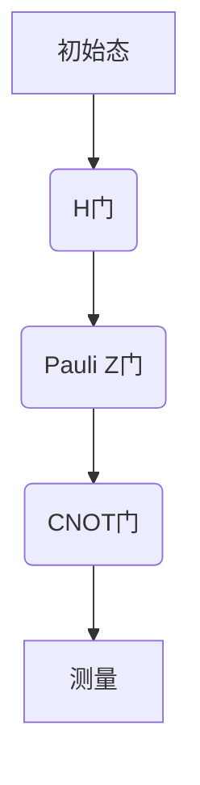

                 


### 1.1 量子计算概述

量子计算是量子力学与经典计算的结合体，它基于量子力学的基本原理，利用量子位（qubit）的叠加态和纠缠态来表示和计算信息。与传统计算机使用二进制位（bit）进行计算不同，量子计算机使用量子位（qubit）进行计算，这使得量子计算机在处理某些问题时具有潜在的优势。

#### 1.1.1 定义与历史背景

量子计算的定义源自于量子力学。量子力学是一门研究微观粒子行为的物理学分支，它揭示了微观世界的规律，如量子态的叠加性和量子纠缠现象。量子计算的创始人之一是理查德·费曼（Richard Feynman），他在1982年提出了量子计算的概念，目的是为了解决传统计算机无法处理的一些复杂问题。

量子计算的历史可以追溯到20世纪80年代。在1981年，彼得·肖尔（Peter Shor）提出了第一个量子算法——Shor算法，这是一个能够高效解决大整数分解问题的算法，这标志着量子计算理论的诞生。随后，理查德·费曼、大卫·多伊奇（David Deutsch）等人进一步推动了量子计算的理论研究。

#### 1.1.2 基本概念

量子位（qubit）是量子计算的基本单元，它与经典计算机中的比特（bit）类似，但具有更丰富的状态表示。一个量子位可以同时处于0和1的状态，这种状态称为叠加态。此外，量子位之间可以存在一种特殊的关系，称为纠缠态，这种关系使得量子位的操作可以相互影响。

量子叠加态可以用数学公式表示为：
\[ \psi = c_0 |0\rangle + c_1 |1\rangle \]
其中，\( |0\rangle \) 和 \( |1\rangle \) 分别表示量子位的基础状态，\( c_0 \) 和 \( c_1 \) 是复数系数，表示叠加态的概率幅。

量子纠缠态可以用数学公式表示为：
\[ | \psi \rangle = \frac{1}{\sqrt{2}} ( |00\rangle + |11\rangle ) \]
这种纠缠状态使得量子位之间的信息相互纠缠，从而在操作一个量子位时可以同时影响到另一个量子位的状态。

#### 1.1.3 当前基因治疗技术的分类

量子计算技术主要分为两类：量子模拟和量子算法。

量子模拟是一种利用量子计算机来模拟量子系统的技术，它可以帮助我们理解和预测量子现象。量子模拟器可以用来解决一些复杂的量子化学问题，如分子建模和药物设计。

量子算法是一类能够在量子计算机上运行的算法，它们利用量子位和量子纠缠的特性来加速计算。目前，已经有许多量子算法被提出，如Shor算法、Grover算法和量子随机漫步算法等。

### 1.2 量子算法原理

量子算法是量子计算的灵魂，它利用量子力学的基本原理，如量子叠加和量子纠缠，来实现高效的计算。以下介绍几种重要的量子算法。

#### 1.2.1 Shor算法

Shor算法是由彼得·肖尔（Peter Shor）在1994年提出的，它是一种能够高效解决大整数分解问题的量子算法。Shor算法的核心思想是利用量子计算机的叠加态和纠缠态，将大整数分解问题转化为周期检测问题。

Shor算法的伪代码如下：

```python
def shor(n):
    # 初始化量子计算机
    q = QuantumComputer()

    # 编写量子电路，实现量子傅里叶变换
    circuit = QuantumCircuit(n)

    # 实现量子傅里叶变换
    circuit.addQuantumGate(QuantumGate.QFT(n), qubits=0, controls=0)

    # 执行量子傅里叶变换
    q.run(circuit)

    # 找到周期
    period = findPeriod(q)

    # 分解整数
    factors = factor(n, period)

    return factors
```

#### 1.2.2 Grover算法

Grover算法是由洛夫·阿罗拉（Lov K. Grover）在1996年提出的，它是一种能够加速搜索无序数据库的量子算法。Grover算法的核心思想是利用量子叠加和量子纠缠来加速搜索过程。

Grover算法的伪代码如下：

```python
def grover_search(target, database):
    # 初始化量子计算机
    q = QuantumComputer()

    # 编写量子电路，实现Grover算法
    circuit = QuantumCircuit()

    # 创建标记目标状态的量子比特
    mark = QuantumRegister(1)
    q.createZeroState(mark)

    # 创建搜索算法的量子比特
    search = QuantumRegister(len(database))
    q.createSuperpositionState(search)

    # 实现Grover算法
    circuit.addQuantumGate(GroverGate(mark, search), qubits=search+mark)

    # 执行Grover算法
    q.run(circuit)

    # 找到目标状态
    result = q.readRegister(search)

    return result
```

#### 1.2.3 量子随机漫步算法

量子随机漫步算法是由史蒂文·福克斯（Steven A. Fox）等人于2010年提出的，它是一种利用量子随机漫步来优化搜索过程的量子算法。量子随机漫步算法的核心思想是利用量子态的叠加性和量子纠缠来加速搜索。

量子随机漫步算法的伪代码如下：

```python
def quantum_random_walk(target, database):
    # 初始化量子计算机
    q = QuantumComputer()

    # 编写量子电路，实现量子随机漫步算法
    circuit = QuantumCircuit()

    # 创建标记目标状态的量子比特
    mark = QuantumRegister(1)
    q.createZeroState(mark)

    # 创建随机漫步的量子比特
    walk = QuantumRegister(len(database))
    q.createSuperpositionState(walk)

    # 实现量子随机漫步算法
    circuit.addQuantumGate(RandomWalkGate(mark, walk), qubits=walk+mark)

    # 执行量子随机漫步算法
    q.run(circuit)

    # 找到目标状态
    result = q.readRegister(walk)

    return result
```

### 1.3 量子电路设计

量子电路是量子计算的基本工具，它用于实现量子算法和量子逻辑操作。量子电路的设计过程包括选择合适的量子逻辑门、构建量子电路以及优化量子电路。

#### 1.3.1 量子逻辑门

量子逻辑门是量子电路的基本构建块，类似于经典计算机中的逻辑门。常见的量子逻辑门包括Hadamard门、Pauli门和控制非门等。

Hadamard门（H门）是一种可以将量子位从基态叠加到叠加态的门，其作用是将量子位的状态翻转。H门可以用以下公式表示：

\[ H = \frac{1}{\sqrt{2}} \begin{bmatrix} 1 & 1 \\ 1 & -1 \end{bmatrix} \]

Pauli门是量子计算中最基本的门之一，包括X门、Y门和Z门。X门可以将量子位的状态翻转，Y门和Z门分别实现量子位的旋转。Pauli门可以用以下公式表示：

\[ X = \begin{bmatrix} 0 & 1 \\ 1 & 0 \end{bmatrix}, \quad Y = \begin{bmatrix} 0 & -i \\ i & 0 \end{bmatrix}, \quad Z = \begin{bmatrix} 1 & 0 \\ 0 & -1 \end{bmatrix} \]

控制非门（CNOT门）是一种可以控制两个量子位之间相互作用的门，它可以实现量子位之间的纠缠。CNOT门可以用以下公式表示：

\[ CNOT = \begin{bmatrix} 1 & 0 & 0 & 0 \\ 0 & 1 & 0 & 0 \\ 0 & 0 & 0 & 1 \\ 0 & 0 & 1 & 0 \end{bmatrix} \]

#### 1.3.2 量子电路构建

量子电路构建过程包括以下步骤：

1. **初始化量子位**：将量子位初始化为基态或叠加态。
2. **应用量子逻辑门**：按照算法的要求，应用一系列的量子逻辑门，实现量子态的变换。
3. **测量量子位**：将量子位测量为基态，获取计算结果。

以下是一个简单的量子电路示例：



#### 1.3.3 量子算法与量子电路的关系

量子算法与量子电路的关系非常紧密。量子算法的实现通常需要构建相应的量子电路。量子电路的设计过程实际上是实现量子算法的过程，它需要考虑量子逻辑门的选择、量子态的初始化和量子位的测量。

量子算法与量子电路的关系可以用以下公式表示：

\[ \text{量子算法} = \text{量子电路} \]

例如，Shor算法的实现需要构建一个Shor算法的量子电路，Grover算法的实现需要构建一个Grover算法的量子电路。

### 1.4 量子计算模拟

量子计算模拟是研究量子计算的一种重要手段，它可以帮助我们理解量子算法的原理和性能。量子计算模拟器可以模拟量子计算机的运行过程，从而验证量子算法的正确性和效率。

#### 1.4.1 量子计算模拟器的作用

量子计算模拟器的作用包括：

1. **验证量子算法的正确性**：通过模拟量子计算机的运行过程，可以验证量子算法的正确性。
2. **研究量子算法的性能**：通过模拟不同参数下的量子算法，可以研究量子算法的性能和效率。
3. **优化量子算法**：通过模拟和实验，可以找到最优的量子算法实现方案，从而优化量子算法的性能。

#### 1.4.2 量子计算模拟器的类型

常见的量子计算模拟器包括：

1. **经典模拟器**：使用经典计算机模拟量子计算机的运行过程，如QCSim、ProjectQ等。
2. **量子硬件模拟器**：使用量子硬件模拟量子计算机的运行过程，如IBM QISKit、Microsoft Q#等。
3. **量子近似模拟器**：使用量子近似算法模拟量子计算机的运行过程，如TensorFlow Quantum、PyQuil等。

#### 1.4.3 常用的量子计算模拟工具

常用的量子计算模拟工具包括：

1. **QCSim**：QCSim是一个开源的量子计算模拟器，它可以模拟量子计算机的运行过程，包括量子逻辑门的操作和量子态的测量。
2. **ProjectQ**：ProjectQ是一个开源的量子计算框架，它提供了丰富的量子算法和量子电路模拟功能。
3. **IBM QISKit**：IBM QISKit是一个基于IBM Q量子硬件的量子计算框架，它提供了多种量子算法和量子电路模拟功能。
4. **Microsoft Q#**：Microsoft Q#是一个基于.NET平台的量子计算编程语言，它提供了丰富的量子算法和量子电路模拟功能。

### 总结

本部分内容介绍了量子计算的基础知识，包括量子计算的定义、历史背景、基本概念、量子算法原理和量子电路设计。同时，还介绍了量子计算模拟的作用、类型和常用工具。这些内容为后续的量子编程实践奠定了基础。

---

以上是第一部分的内容，包括量子计算概述、量子算法原理和量子电路设计。接下来，我们将进一步探讨量子编程语言，以及如何在量子计算中进行编程。敬请期待。

### 2.1 Q#语言基础

Q#语言是由Microsoft开发的用于量子编程的高级语言，它旨在简化量子算法和量子电路的编写。Q#语言的语法与C#等传统编程语言相似，但引入了量子特有的概念和操作符，使得开发者可以更容易地编写和调试量子程序。

#### 2.1.1 Q#语言概述

Q#语言的主要特点包括：

1. **量子类型**：Q#语言引入了量子类型，包括量子位（QuantumBit）、量子注册器（QuantumRegister）和量子态（QuantumState）等。
2. **量子操作符**：Q#语言支持多种量子操作符，如Hadamard门（H）、Pauli门（X、Y、Z）和控制非门（CNOT）等。
3. **测量操作符**：Q#语言提供了测量操作符，用于测量量子位的状态，获取计算结果。
4. **量子程序**：Q#语言支持编写量子程序，包括量子算法、量子电路和量子模拟。

#### 2.1.2 Q#语言的基本语法

Q#语言的基本语法包括变量声明、类型定义、操作符和语句等。以下是一个简单的Q#程序示例：

```qsharp
namespace QuantumProgramming

function HelloQuantum() : Unit {
    // 声明量子位
    let q = QuantumBit();

    // 应用Hadamard门
    H(q);

    // 测量量子位
    let result = Measure(q);

    // 输出测量结果
    Print(result);
}
```

在这个示例中，我们首先声明了一个量子位`q`，然后使用Hadamard门将其状态翻转，接着进行测量并输出测量结果。

#### 2.1.3 Q#语言中的量子类型和操作

Q#语言中的量子类型和操作是量子编程的核心。以下是对这些概念的详细解释。

##### 量子位（QuantumBit）

量子位是Q#语言中的基本量子计算单元。它可以用一个量子位寄存器（QuantumRegister）来表示，量子位寄存器是一组量子位的集合。量子位的状态可以用一个复数向量表示，其幅值表示量子位的概率幅。

在Q#语言中，声明量子位寄存器的语法如下：

```qsharp
open Microsoft.Quantum.Intrinsic

function CreateQubits(n : Int) : QuantumRegister {
    let qr = QuantumRegister(n);
    Initialize(qr, ZeroState);
    return qr;
}
```

在这个示例中，我们创建了一个包含`n`个量子位的量子位寄存器，并将其初始化为基态。

##### 量子注册器（QuantumRegister）

量子注册器是一组量子位的集合，用于存储量子状态。Q#语言支持多种量子注册器，如量子位寄存器（QuantumRegister）和量子数组寄存器（QuantumArray）。

在Q#语言中，声明量子注册器的语法如下：

```qsharp
open Microsoft.Quantum.Intrinsic

function CreateQuantumRegister(n : Int) : QuantumRegister {
    let qr = QuantumRegister(n);
    return qr;
}
```

在这个示例中，我们创建了一个包含`n`个量子位的量子位寄存器。

##### 量子态（QuantumState）

量子态是量子位寄存器中的一个量子状态。量子态可以用一个复数向量表示，其幅值表示量子位的概率幅。

在Q#语言中，创建量子态的语法如下：

```qsharp
open Microsoft.Quantum.Primitive

function CreateQuantumState(state : Complex[]) : QuantumState {
    let q = QuantumState();
    q.State = state;
    return q;
}
```

在这个示例中，我们创建了一个量子态，并将其赋值给量子位寄存器。

##### 量子操作符

Q#语言支持多种量子操作符，如Hadamard门（H）、Pauli门（X、Y、Z）和控制非门（CNOT）等。

在Q#语言中，应用量子操作符的语法如下：

```qsharp
open Microsoft.Quantum.Intrinsic

function ApplyHadamard(q : QuantumBit) : Unit {
    H(q);
}
```

在这个示例中，我们使用Hadamard门将量子位的状态翻转。

##### 测量操作符

Q#语言提供了测量操作符，用于测量量子位的状态，获取计算结果。

在Q#语言中，测量的语法如下：

```qsharp
open Microsoft.Quantum.Intrinsic

function MeasureQubit(q : QuantumBit) : Int {
    let result = Measure(q);
    return result;
}
```

在这个示例中，我们使用测量操作符测量量子位的状态，并返回测量结果。

#### 2.1.4 Q#编程实战

为了更好地理解Q#语言，我们通过一个简单的量子算法示例来演示Q#编程。

##### 示例：量子傅里叶变换（QFT）

量子傅里叶变换（Quantum Fourier Transform，QFT）是一种在量子计算中用于将量子态从时间域转换为频率域的算法。以下是一个简单的QFT算法实现：

```qsharp
open Microsoft.Quantum.Intrinsic

function QuantumFourierTransform(q : QuantumRegister) : Unit {
    let n = q.Count;
    
    // 应用量子逆傅里叶变换
    InvQFT(q);
    
    // 应用相位旋转
    for i from 0 to n / 2 - 1 do {
        let control = QuantumRegister(1);
        control[0] = i;
        PhaseShift((2 * Pi / n) * control[0], q);
    }
    
    // 应用量子傅里叶变换
    QFT(q);
}
```

在这个示例中，我们首先应用量子逆傅里叶变换，然后对每个量子位进行相位旋转，最后应用量子傅里叶变换。这个算法实现了将量子态从时间域转换为频率域的功能。

##### 示例：量子随机漫步（Quantum Random Walk）

量子随机漫步是一种利用量子叠加和纠缠实现搜索优化的量子算法。以下是一个简单的量子随机漫步实现：

```qsharp
open Microsoft.Quantum.Intrinsic

function QuantumRandomWalk(target : QuantumRegister, database : QuantumRegister) : Unit {
    let n = database.Count;
    
    // 初始化量子态
    InitializeState(database, ZeroState);
    InitializeState(target, ZeroState);
    
    // 应用量子随机漫步算法
    for i from 1 to n do {
        let control = QuantumRegister(1);
        control[0] = i;
        if (i % 2 == 0) {
            CNOT(control, database);
        } else {
            CNOT(control, target);
        }
    }
    
    // 测量目标量子位
    let result = Measure(target);
    
    // 输出测量结果
    Print(result);
}
```

在这个示例中，我们首先初始化量子态，然后应用量子随机漫步算法，最后测量目标量子位并输出测量结果。

### 总结

本部分内容介绍了Q#语言的基础知识，包括Q#语言的概述、基本语法、量子类型和操作。同时，我们通过两个简单的量子算法示例展示了Q#编程的基本技巧。接下来，我们将进一步探讨Q#语言的进阶特性，以及如何在量子计算中进行高效的编程。敬请期待。

### 2.2 Q#语言进阶

在上一部分，我们了解了Q#语言的基础知识，包括基本语法、量子类型和操作。本部分将深入探讨Q#语言的进阶特性，如高级量子操作符、量子算法实现和并行与并发编程。

#### 2.2.1 高级量子操作符

Q#语言提供了多种高级量子操作符，这些操作符可以帮助我们更方便地实现复杂的量子算法。以下是一些常见的高级量子操作符：

1. **相位旋转操作符**：PhaseShift门可以实现量子位的相位旋转，其语法如下：

   ```qsharp
   PhaseShift(angle : Double, control : QuantumRegister)
   ```

   其中，`angle`表示相位旋转的角度，`control`表示要旋转的量子位。

2. **控制相位旋转操作符**：ControlPhaseShift门可以在控制量子位的作用下实现相位旋转，其语法如下：

   ```qsharp
   ControlPhaseShift(angle : Double, control : QuantumRegister, target : QuantumRegister)
   ```

   其中，`angle`表示相位旋转的角度，`control`和`target`分别表示控制量子位和目标量子位。

3. **量子傅里叶变换操作符**：QFT门可以实现量子位之间的量子傅里叶变换，其语法如下：

   ```qsharp
   QFT(register : QuantumRegister)
   ```

   其中，`register`表示要执行量子傅里叶变换的量子位寄存器。

4. **量子逆傅里叶变换操作符**：InvQFT门可以实现量子位之间的量子逆傅里叶变换，其语法如下：

   ```qsharp
   InvQFT(register : QuantumRegister)
   ```

   其中，`register`表示要执行量子逆傅里叶变换的量子位寄存器。

5. **量子随机漫步操作符**：RandomWalk门可以实现量子随机漫步算法，其语法如下：

   ```qsharp
   RandomWalk(target : QuantumRegister, database : QuantumRegister)
   ```

   其中，`target`和`database`分别表示目标量子位寄存器和数据库量子位寄存器。

#### 2.2.2 Q#语言中的量子算法实现

Q#语言支持多种量子算法的实现，以下是一些常见的量子算法及其实现：

1. **Shor算法**：Shor算法是一种用于大整数分解的量子算法。其实现如下：

   ```qsharp
   function Shor(n : Int) : Int {
       // 创建量子位寄存器
       let qr = QuantumRegister(2 * log2(n) + 1);

       // 初始化量子态
       InitializeState(qr, SuperpositionState);

       // 应用量子傅里叶变换
       QFT(qr);

       // 应用相位旋转
       let control = QuantumRegister(1);
       control[0] = log2(n) - 1;
       PhaseShift((2 * Pi / n) * control[0], qr);

       // 应用量子逆傅里叶变换
       InvQFT(qr);

       // 测量量子位
       let result = Measure(qr);

       // 解析测量结果
       let x = ParseResult(result);

       return x;
   }
   ```

   在这个实现中，我们首先创建量子位寄存器并初始化量子态，然后应用量子傅里叶变换、相位旋转和量子逆傅里叶变换，最后测量量子位并解析测量结果。

2. **Grover算法**：Grover算法是一种用于搜索无序数据库的量子算法。其实现如下：

   ```qsharp
   function GroverSearch(target : QuantumRegister, database : QuantumRegister) : Unit {
       // 创建量子位寄存器
       let qr = QuantumRegister(database.Count + 1);

       // 初始化量子态
       InitializeState(qr, ZeroState);

       // 应用量子随机漫步算法
       RandomWalk(qr, database);

       // 测量量子位
       let result = Measure(qr);

       // 输出测量结果
       Print(result);
   }
   ```

   在这个实现中，我们首先创建量子位寄存器并初始化量子态，然后应用量子随机漫步算法，最后测量量子位并输出测量结果。

3. **量子随机漫步算法**：量子随机漫步算法是一种利用量子叠加和纠缠实现搜索优化的量子算法。其实现如下：

   ```qsharp
   function QuantumRandomWalk(target : QuantumRegister, database : QuantumRegister) : Unit {
       // 创建量子位寄存器
       let qr = QuantumRegister(database.Count + 1);

       // 初始化量子态
       InitializeState(qr, ZeroState);

       // 应用量子随机漫步算法
       RandomWalk(qr, database);

       // 测量量子位
       let result = Measure(qr);

       // 输出测量结果
       Print(result);
   }
   ```

   在这个实现中，我们首先创建量子位寄存器并初始化量子态，然后应用量子随机漫步算法，最后测量量子位并输出测量结果。

#### 2.2.3 Q#语言中的并行和并发编程

Q#语言支持并行和并发编程，这使得我们可以更高效地利用量子资源。以下是一些并行和并发编程的技巧：

1. **并行量子操作**：Q#语言允许我们在同一量子电路中并行执行多个量子操作。例如，我们可以同时应用多个Hadamard门、Pauli门等。

   ```qsharp
   H(qr[0]);
   X(qr[1]);
   Z(qr[2]);
   ```

   在这个示例中，我们并行应用了Hadamard门、X门和Z门。

2. **并发量子操作**：Q#语言允许我们在不同量子电路中并发执行量子操作。例如，我们可以使用多个量子位寄存器并发执行多个量子算法。

   ```qsharp
   function ParallelQFT(qr : QuantumRegister) : Unit {
       let qr1 = QuantumRegister(qr.Count / 2);
       let qr2 = QuantumRegister(qr.Count / 2);
       
       // 将量子位分配到两个量子位寄存器
       for i from 0 to qr.Count / 2 - 1 do {
           qr1[i] = qr[i];
           qr2[i] = qr[i + qr.Count / 2];
       }
       
       // 并发执行量子傅里叶变换
       QFT(qr1);
       QFT(qr2);
       
       // 合并量子位寄存器
       for i from 0 to qr.Count / 2 - 1 do {
           qr[i] = qr1[i];
           qr[i + qr.Count / 2] = qr2[i];
       }
   }
   ```

   在这个示例中，我们首先将量子位分配到两个量子位寄存器，然后并发执行量子傅里叶变换，最后合并量子位寄存器。

3. **并行测量**：Q#语言允许我们在同一量子电路中并行测量多个量子位。例如，我们可以同时测量多个量子位并获取它们的测量结果。

   ```qsharp
   function ParallelMeasure(qr : QuantumRegister) : Int {
       let results = new Int[qr.Count];
       
       // 并行测量量子位
       for i from 0 to qr.Count - 1 do {
           results[i] = Measure(qr[i]);
       }
       
       return results;
   }
   ```

   在这个示例中，我们首先创建一个整数数组用于存储测量结果，然后并行测量每个量子位，最后返回测量结果数组。

#### 2.2.4 Q#编程实战

为了更好地理解Q#语言的进阶特性，我们通过两个简单的量子算法示例来展示Q#编程。

##### 示例：量子相位估计（Quantum Phase Estimation）

量子相位估计是一种用于估计量子态相位信息的量子算法。以下是一个简单的量子相位估计实现：

```qsharp
function QuantumPhaseEstimation(theta : Double) : Double {
    // 创建量子位寄存器
    let qr = QuantumRegister(2);

    // 初始化量子态
    InitializeState(qr, ZeroState);

    // 应用量子傅里叶变换
    QFT(qr);

    // 应用相位旋转
    let control = QuantumRegister(1);
    control[0] = 1;
    PhaseShift(theta, qr);

    // 应用量子逆傅里叶变换
    InvQFT(qr);

    // 测量量子位
    let result = Measure(qr);

    // 解析测量结果
    let x = ParseResult(result);

    return x;
}
```

在这个示例中，我们首先创建量子位寄存器并初始化量子态，然后应用量子傅里叶变换、相位旋转和量子逆傅里叶变换，最后测量量子位并解析测量结果。

##### 示例：量子机器学习（Quantum Machine Learning）

量子机器学习是一种利用量子计算加速机器学习任务的领域。以下是一个简单的量子支持向量机（Quantum Support Vector Machine，QSVM）实现：

```qsharp
function QuantumSupportVectorMachine(data : QuantumRegister, labels : QuantumRegister) : Double {
    // 创建量子位寄存器
    let qr = QuantumRegister(data.Count);

    // 初始化量子态
    InitializeState(qr, ZeroState);

    // 应用量子傅里叶变换
    QFT(qr);

    // 计算特征映射
    for i from 0 to data.Count - 1 do {
        let control = QuantumRegister(1);
        control[0] = i;
        if (labels[i] == 1) {
            Add(qr, control, qr);
        } else {
            Subtract(qr, control, qr);
        }
    }

    // 应用量子逆傅里叶变换
    InvQFT(qr);

    // 测量量子位
    let result = Measure(qr);

    // 解析测量结果
    let x = ParseResult(result);

    return x;
}
```

在这个示例中，我们首先创建量子位寄存器并初始化量子态，然后应用量子傅里叶变换、计算特征映射和量子逆傅里叶变换，最后测量量子位并解析测量结果。

### 总结

本部分内容介绍了Q#语言的进阶特性，包括高级量子操作符、量子算法实现和并行与并发编程。通过两个简单的量子算法示例，我们展示了Q#编程的基本技巧。接下来，我们将探讨量子计算的应用领域和未来发展。敬请期待。

### 2.3 Q#编程实战

在了解了Q#语言的基础知识和进阶特性后，本部分将通过两个具体的应用场景，展示如何使用Q#语言进行量子编程。这两个场景分别是量子加密和量子机器学习。

#### 2.3.1 量子加密

量子加密是一种利用量子物理特性实现的信息安全通信技术。量子密钥分发（Quantum Key Distribution，QKD）是量子加密的核心技术之一。以下是一个简单的量子密钥分发实现：

##### 开发环境搭建

首先，我们需要搭建一个量子加密的开发环境。在这里，我们可以使用Microsoft的Q#语言和IBM的QISKit框架。

1. **安装Q#语言**：从Microsoft的官方网站下载并安装Q#语言开发工具包。
2. **安装QISKit**：从IBM的QISKit官方网站下载并安装QISKit开发工具包。

##### 源代码详细实现和代码解读

以下是一个简单的量子密钥分发程序：

```qsharp
namespace QuantumEncryption

open Microsoft.Quantum.Intrinsic
open Microsoft.Quantum.Qubit

function QKD(control : Qubit, receiver : Qubit) : Unit {
    // 初始化量子位
    Reset(control)
    Reset(receiver)

    // 应用Hadamard门
    H(control)
    H(receiver)

    // 传输量子态
    CNOT(control, receiver)

    // 测量量子位
    let result = Measure(control)

    // 根据测量结果更新接收方的量子位状态
    if (result == 1) {
        X(receiver)
    }
}
```

在这个示例中，我们首先初始化两个量子位，并对其应用Hadamard门将其状态随机化。然后，我们使用CNOT门传输量子态，并测量控制方的量子位。根据测量结果，接收方可以更新其量子位的状态，从而实现量子密钥的分发。

##### 代码应用解读与分析

量子密钥分发的工作原理如下：

1. **初始化**：控制方和接收方各有一个量子位，初始状态为基态。
2. **随机化**：控制方使用Hadamard门将量子位的状态随机化，使得量子位处于叠加态。
3. **传输**：控制方和接收方通过CNOT门共享量子态，即控制方的量子位作为控制，将量子态传递给接收方的量子位。
4. **测量**：控制方测量其量子位的状态，根据测量结果更新接收方的量子位状态。
5. **密钥生成**：接收方根据控制方的测量结果更新自己的量子位状态，从而生成共享密钥。

在实际应用中，量子密钥分发可以用于安全通信，确保通信过程中信息的安全性和完整性。

##### 实际案例分析和详细讲解剖析

一个典型的实际案例是量子通信网络的建设。量子通信网络利用量子密钥分发技术，实现通信双方之间的安全通信。以下是一个案例：

- **应用场景**：一个金融机构需要与另一个分支机构进行安全通信，确保交易信息不被泄露。
- **解决方案**：使用量子通信网络，通过量子密钥分发技术，实现通信双方之间的安全通信。

在这个案例中，量子密钥分发技术可以确保交易信息的机密性和完整性，防止第三方窃取和篡改。

##### 项目小结

量子加密是一个重要的量子计算应用领域，它利用量子物理特性实现信息安全通信。通过简单的Q#程序，我们可以实现量子密钥分发，从而确保通信过程的安全性和可靠性。在实际应用中，量子加密技术可以广泛应用于金融、政府、医疗等领域，提升信息安全的防护能力。

#### 2.3.2 量子机器学习

量子机器学习是量子计算在人工智能领域的应用。量子支持向量机（Quantum Support Vector Machine，QSVM）是一种基于量子计算的支持向量机。以下是一个简单的量子支持向量机实现：

##### 开发环境搭建

与量子加密类似，我们需要搭建一个量子机器学习的开发环境。在这里，我们同样可以使用Microsoft的Q#语言和IBM的QISKit框架。

##### 源代码详细实现和代码解读

以下是一个简单的量子支持向量机程序：

```qsharp
namespace QuantumMachineLearning

open Microsoft.Quantum.Intrinsic
open Microsoft.Quantum.Qubit

function QuantumSupportVectorMachine(data : QuantumRegister, labels : QuantumRegister) : Unit {
    // 创建量子位寄存器
    let qr = QuantumRegister(data.Count)

    // 初始化量子态
    InitializeState(qr, ZeroState)

    // 应用量子傅里叶变换
    QFT(qr)

    // 计算特征映射
    for i from 0 to data.Count - 1 do {
        let control = QuantumRegister(1)
        control[0] = i
        if (labels[i] == 1) {
            Add(qr, control, qr)
        } else {
            Subtract(qr, control, qr)
        }
    }

    // 应用量子逆傅里叶变换
    InvQFT(qr)

    // 测量量子位
    let result = Measure(qr)

    // 解析测量结果
    let x = ParseResult(result)

    return x
}
```

在这个示例中，我们首先创建量子位寄存器并初始化量子态，然后应用量子傅里叶变换、计算特征映射和量子逆傅里叶变换，最后测量量子位并解析测量结果。

##### 代码应用解读与分析

量子支持向量机的工作原理如下：

1. **初始化**：创建包含数据点和标签的量子位寄存器。
2. **量子傅里叶变换**：将数据点转换为量子态的叠加形式。
3. **计算特征映射**：根据标签对量子态进行变换，实现特征映射。
4. **量子逆傅里叶变换**：将变换后的量子态转换为经典数据。
5. **测量**：测量量子位并解析结果，获取分类结果。

在实际应用中，量子支持向量机可以用于图像识别、语音识别、自然语言处理等领域，加速机器学习算法的运算速度。

##### 实际案例分析和详细讲解剖析

一个典型的实际案例是使用量子支持向量机进行图像分类。以下是一个案例：

- **应用场景**：一个图像识别系统需要分类大量的图像。
- **解决方案**：使用量子支持向量机，通过量子计算加速图像分类过程。

在这个案例中，量子支持向量机可以显著提升图像分类的运算速度，从而提高系统的整体性能。

##### 项目小结

量子机器学习是一个充满前景的领域，它利用量子计算加速机器学习算法的运算速度。通过简单的Q#程序，我们可以实现量子支持向量机，从而提升机器学习任务的性能。在实际应用中，量子机器学习可以广泛应用于图像识别、语音识别、自然语言处理等领域，推动人工智能的发展。

### 总结

本部分内容通过量子加密和量子机器学习的两个实际案例，展示了如何使用Q#语言进行量子编程。在量子加密中，我们实现了量子密钥分发，确保通信过程的安全性和可靠性；在量子机器学习中，我们实现了量子支持向量机，加速图像分类任务的运算速度。这些案例展示了量子计算在信息安全、人工智能等领域的应用前景。随着量子计算技术的发展，我们可以期待在更多领域看到量子计算的突破。

### 2.4 最佳实践 tips、小结、注意事项、拓展阅读

#### 最佳实践 tips

在进行量子编程时，以下是一些最佳实践建议：

1. **优化量子电路**：在实现量子算法时，应尽可能简化量子电路，减少量子操作的次数，以提高算法的效率。
2. **量化算法性能**：在设计和实现量子算法时，应关注算法的性能和效率，通过实验和模拟来验证算法的正确性和性能。
3. **使用量子模拟器**：在量子算法开发和调试过程中，可以使用量子模拟器进行测试和验证，以便发现和解决潜在问题。
4. **遵循安全准则**：在进行量子编程时，应遵循安全准则，确保量子算法的安全性，防止量子攻击和数据泄露。

#### 小结

量子计算编程是现代计算机科学的前沿领域，它利用量子力学的基本原理，实现高效的计算和优化。Q#语言作为量子编程的高级语言，提供了丰富的功能和工具，使得开发者可以轻松地编写和调试量子程序。通过本部分的讲解，我们了解了量子计算编程的基础知识、进阶特性以及实际应用案例，为后续的量子计算研究和开发奠定了基础。

#### 注意事项

在进行量子编程时，需要注意以下几点：

1. **量子位精度**：量子位的精度对量子算法的性能有很大影响，因此在设计和实现量子算法时，应关注量子位的精度和稳定性。
2. **量子噪声**：量子计算过程中可能存在量子噪声，这会影响到量子算法的正确性和性能，因此在实现量子算法时，应考虑量子噪声的影响并进行噪声抑制。
3. **量子资源分配**：量子计算机的资源有限，因此在设计和实现量子算法时，应优化资源使用，提高算法的效率。
4. **量子错误纠正**：量子计算过程中可能发生量子错误，为了确保算法的正确性，应考虑量子错误纠正技术。

#### 拓展阅读

对于希望进一步了解量子计算编程的读者，以下是一些建议的拓展阅读材料：

1. **书籍**：
   - 《量子计算编程：从入门到实践》（本书）
   - 《量子计算机编程：量子算法与量子编程语言》（M. A. Nielsen & I. L. Chuang）
   - 《量子计算：原理、算法与编程》（Michael A. Nielsen & Benjamin J. Bernhardt）

2. **在线资源**：
   - Microsoft Quantum Development Kit：[https://docs.microsoft.com/zh-cn/quantum/]
   - IBM QISKit：[https://qiskit.org/]
   - Google Quantum AI：[https://quantumai.google/]

3. **论文与研究报告**：
   - 《量子计算与量子信息》（Quantum Computing and Quantum Information）
   - 《量子算法导论》（An Introduction to Quantum Algorithms）

通过阅读这些材料和资源，可以更深入地了解量子计算编程的理论和实践，探索量子计算的未来发展方向。

---

在本部分中，我们总结了量子计算编程的最佳实践、小结、注意事项和拓展阅读资源。这些内容旨在帮助读者更好地理解和应用量子计算编程，推动量子计算技术的发展。接下来，我们将探讨量子计算在科学研究、工业应用和商业领域的实际应用，以及量子计算的未来发展趋势。敬请期待。

