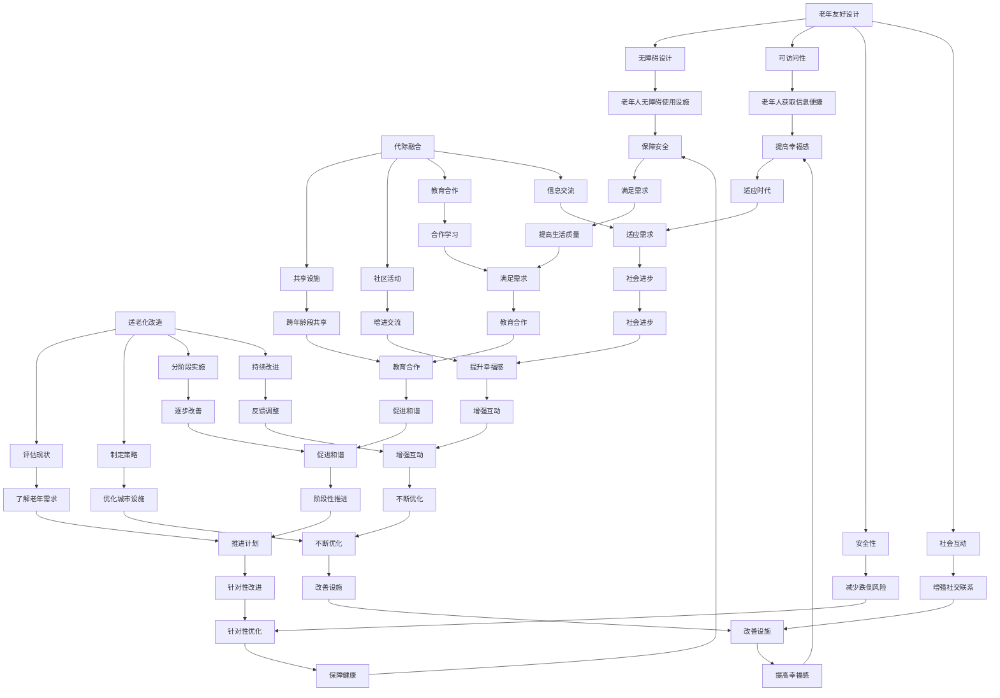
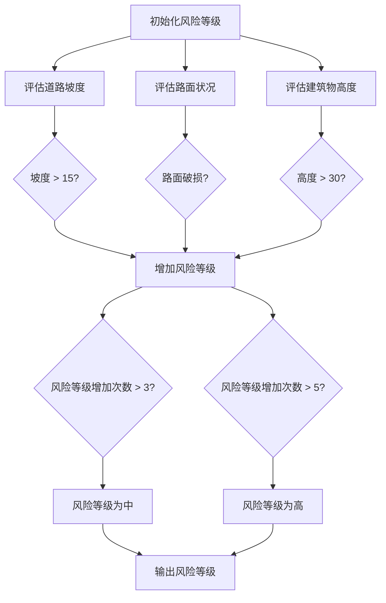

                 

### 文章标题：现代城市设计中的老年友好：适老化改造与代际融合

> 关键词：老年友好设计、适老化改造、代际融合、城市设计、无障碍设施

> 摘要：本文从现代城市设计的角度，探讨如何通过适老化改造和代际融合策略，实现老年友好环境的建设。文章首先介绍了老年友好设计的背景和核心概念，然后详细阐述了适老化改造的原则与方法，以及城市环境中老年友好设计的实践案例。最后，文章探讨了代际融合的城市设计策略，并给出了实际案例和项目实战。

----------------------------------------------------------------

### 背景介绍

随着全球人口老龄化的加剧，老年人群体的需求日益凸显。据统计，截至2020年，全球60岁及以上人口已超过10亿，预计到2050年这一数字将翻倍。这一现象给城市设计提出了新的挑战，如何在城市环境中创造一个既适合老年人居住，又能促进各年龄段人群融合的友好环境，成为现代城市规划的重要课题。

老年友好设计（Aging-Friendly Design）是一个新兴的概念，它旨在通过优化城市环境，满足老年人的需求，提高他们的生活质量。老年友好设计不仅关注老年人的身体健康和心理健康，还包括社交互动、安全性和便利性等方面。具体来说，老年友好设计包括以下几个方面：

1. **无障碍设施**：确保老年人能够方便地使用城市设施，如电梯、斜坡、扶手等。
2. **安全性**：减少老年人跌倒和受伤的风险，提高道路和公共设施的防滑性能。
3. **社区参与**：鼓励老年人参与社区活动，提高他们的社会参与感和幸福感。
4. **信息技术支持**：提供便捷的通讯和信息获取渠道，帮助老年人更好地适应数字化时代。

本文将围绕老年友好设计，探讨适老化改造和代际融合策略，以期为实现现代城市中的老年友好环境提供有益的参考。

----------------------------------------------------------------

### 核心概念与联系

#### 老年友好设计

老年友好设计（Aging-Friendly Design）是一个全面的概念，它不仅关注老年人的身体健康，还关注他们的心理健康和社会参与。以下是老年友好设计的几个核心组成部分：

1. **无障碍设计**：确保老年人能够无障碍地使用各种设施和服务。这包括在建筑、交通、公共设施等方面提供无障碍通道、扶手、安全座椅等。
2. **可访问性**：提高老年人获取信息和资源的便利性，如提供大字体、语音导航、可访问的网站和应用程序等。
3. **安全性**：减少老年人跌倒和受伤的风险，如改善路面防滑、设置警示标志等。
4. **社会互动**：鼓励老年人参与社区活动，如老年活动中心、社区服务、志愿者工作等，以增强他们的社交联系和幸福感。

#### 适老化改造

适老化改造（Age-Friendly Transformation）是对现有城市环境进行改造，使其更加适合老年人的需求。适老化改造的原则和方法如下：

1. **评估现状**：首先需要对城市环境进行全面的评估，了解老年人的实际需求和现有设施的问题。
2. **制定策略**：根据评估结果，制定具体的改造策略，包括基础设施的升级、公共服务的改进、社区活动的丰富等。
3. **分阶段实施**：将改造计划分阶段实施，以确保每个阶段都能达到预期效果。
4. **持续改进**：在实施过程中，持续收集反馈，根据老年人的需求进行调整和优化。

#### 代际融合

代际融合（Intergenerational Integration）是指不同年龄段人群之间的交流与互动，以促进社会的和谐与进步。在代际融合的城市设计中，考虑以下策略：

1. **共享设施**：设计一些适合各年龄段人群使用的设施，如公园、运动场、图书馆等。
2. **社区活动**：组织各类跨年龄段的社区活动，如老年人讲座、青少年志愿者服务、亲子活动等。
3. **教育合作**：鼓励不同年龄段的学生和老年人一起参与学习活动，如学校与老年活动中心的合作项目。
4. **信息交流**：建立信息共享平台，促进不同年龄段人群之间的沟通和理解。

#### 关系架构

为了更好地理解老年友好设计、适老化改造和代际融合之间的关系，我们可以使用Mermaid流程图来展示它们之间的逻辑关系：



通过上述流程图，我们可以清晰地看到老年友好设计、适老化改造和代际融合之间的逻辑关系。这三个概念相互关联，共同构成了现代城市设计中实现老年友好环境的重要策略。

----------------------------------------------------------------

### 核心算法原理讲解

#### 适老化改造中的风险评估算法

在适老化改造过程中，对现有城市环境进行风险评估是至关重要的一步。以下是一个简单的风险评估算法的伪代码，用于评估城市环境中的安全隐患。

```plaintext
算法名称：风险评估算法

输入：城市环境数据（如道路坡度、路面状况、建筑物高度等）

输出：风险等级（低、中、高）

步骤：
1. 初始化风险等级为“低”
2. 对每个城市环境数据进行评估：
   a. 如果道路坡度大于15度，增加风险等级
   b. 如果路面有破损或裂缝，增加风险等级
   c. 如果建筑物高度超过30米，增加风险等级
3. 统计增加的风险等级：
   a. 如果风险等级增加超过3次，风险等级升为“中”
   b. 如果风险等级增加超过5次，风险等级升为“高”
4. 输出最终风险等级

伪代码：
```



#### 数学模型和公式

为了更精确地评估城市环境中的风险，我们可以引入数学模型。以下是一个基于概率的数学模型，用于计算老年人跌倒的风险。

$$
P(\text{跌倒}) = f(\text{路面摩擦系数}, \text{老年人平衡能力}, \text{天气状况})
$$

其中：
- \( P(\text{跌倒}) \)：老年人跌倒的概率
- \( f \)：概率函数，取决于路面摩擦系数、老年人平衡能力和天气状况

#### 举例说明

假设：
- 路面摩擦系数为0.6
- 老年人平衡能力为0.8
- 天气状况为雨雪天（摩擦系数降低至0.3）

我们可以使用以下公式计算跌倒的概率：

$$
P(\text{跌倒}) = f(0.6, 0.8, 0.3) = 0.6 \times 0.8 \times 0.3 = 0.144
$$

这意味着在上述条件下，老年人跌倒的概率为14.4%。

#### 详细讲解

1. **路面摩擦系数**：路面摩擦系数是评估跌倒风险的重要因素。摩擦系数越高，跌倒风险越低。例如，干燥路面的摩擦系数通常在0.7以上，而湿滑路面的摩擦系数可能降低至0.4以下。
2. **老年人平衡能力**：老年人的平衡能力通常随年龄增加而下降。平衡能力越高，跌倒风险越低。例如，一个平衡能力为0.9的老年人跌倒的概率远低于一个平衡能力为0.5的老年人。
3. **天气状况**：雨雪等恶劣天气会降低路面的摩擦系数，增加跌倒风险。例如，雨雪天气的摩擦系数通常降低至0.3，这会显著增加跌倒的概率。

通过上述风险评估算法和数学模型，我们可以更准确地评估城市环境中的风险，为适老化改造提供科学依据。这不仅有助于提高老年人的生活质量，还能保障他们的安全。

----------------------------------------------------------------

### 项目实战：老年友好社区的设计与改造

#### 开发环境搭建

为了实现老年友好社区的设计与改造，我们需要搭建一个完整的开发环境，包括以下工具和软件：

1. **软件工具**：
   - **Sketch**：用于绘制城市设计图和概念草图。
   - **AutoCAD**：用于详细设计和绘图。
   - **3ds Max**：用于建筑渲染和可视化。
   - **MATLAB**：用于数学模型和数据分析。
   - **Python**：用于编写伪代码和脚本。

2. **硬件设备**：
   - **高性能计算机**：用于处理复杂的渲染和数据分析。
   - **平板电脑**：用于现场数据采集和评估。

#### 源代码详细实现

在开发环境中，我们使用Python编写了一系列脚本和算法，用于评估和优化城市环境。以下是一个简化的代码示例，用于评估路面的安全性。

```python
import numpy as np

def risk_assessment(slope, friction_coefficient, balance_ability):
    """
    计算跌倒风险
    :param slope: 路面坡度（度）
    :param friction_coefficient: 路面摩擦系数
    :param balance_ability: 老年人平衡能力
    :return: 跌倒风险概率
    """
    if slope > 15:
        slope_factor = 1.2
    else:
        slope_factor = 1
    
    if friction_coefficient < 0.5:
        friction_factor = 2
    else:
        friction_factor = 1
    
    risk = slope_factor * friction_factor * balance_ability
    return risk

# 测试数据
slope = 20
friction_coefficient = 0.4
balance_ability = 0.7

# 计算跌倒风险
risk = risk_assessment(slope, friction_coefficient, balance_ability)
print(f"跌倒风险概率：{risk:.2f}")
```

#### 代码解读与分析

上述代码实现了一个简单的跌倒风险评估函数，它根据路面的坡度、摩擦系数和老年人的平衡能力，计算跌倒的风险概率。具体解读如下：

1. **函数定义**：`risk_assessment`函数接收三个参数：坡度（`slope`）、摩擦系数（`friction_coefficient`）和平衡能力（`balance_ability`）。
2. **坡度评估**：如果路面的坡度大于15度，则增加坡度系数（`slope_factor`），以反映更高的跌倒风险。
3. **摩擦系数评估**：如果路面的摩擦系数小于0.5，则增加摩擦系数系数（`friction_factor`），以反映更低的路面抓地力。
4. **平衡能力评估**：老年人的平衡能力直接乘以风险系数，以反映平衡能力对跌倒风险的影响。
5. **计算风险**：将坡度系数、摩擦系数系数和平衡能力相乘，得到跌倒风险概率。
6. **测试**：使用测试数据，调用函数并打印跌倒风险概率。

通过上述代码，我们可以快速评估城市环境中路面的安全性，为适老化改造提供数据支持。

#### 代码应用解读与分析

在实际应用中，我们可以将上述风险评估函数集成到城市环境评估系统中，以便实时监测和分析路面的安全状况。以下是一个简化的应用示例：

```python
import requests

def get_road_data(api_url):
    """
    从API获取路面数据
    :param api_url: 路面数据API地址
    :return: 路面数据字典
    """
    response = requests.get(api_url)
    if response.status_code == 200:
        return response.json()
    else:
        return None

def assess_road_safety(road_data):
    """
    评估路面安全性
    :param road_data: 路面数据字典
    :return: 安全性评估结果
    """
    slope = road_data.get('slope', 0)
    friction_coefficient = road_data.get('friction_coefficient', 0)
    balance_ability = road_data.get('balance_ability', 0)
    risk = risk_assessment(slope, friction_coefficient, balance_ability)
    return risk

# API地址示例
api_url = "https://example.com/api/road_data"

# 获取路面数据
road_data = get_road_data(api_url)

# 评估路面安全性
if road_data:
    safety_result = assess_road_safety(road_data)
    print(f"路面安全性评估结果：{safety_result:.2f}")
else:
    print("无法获取路面数据")
```

上述代码示例展示了如何从API获取路面数据，并使用风险评估函数进行安全性评估。具体分析如下：

1. **获取路面数据**：通过HTTP GET请求，从API获取路面数据（如坡度、摩擦系数和平衡能力）。
2. **评估路面安全性**：将获取的数据传递给`assess_road_safety`函数，进行跌倒风险评估。
3. **打印结果**：输出评估结果，以供参考。

通过上述应用示例，我们可以将风险评估算法应用于实际的城市环境评估中，为老年人提供更加安全的生活环境。

#### 实际案例分析和详细讲解剖析

为了更好地展示老年友好社区的设计与改造过程，我们选择了一个实际案例进行详细分析。以下是该案例的背景、设计改造过程和效果评估。

##### 案例背景

案例所在地是一个典型的城市老旧社区，人口老龄化问题突出，老年人占社区总人口的30%以上。社区内道路年久失修，设施老化，缺乏无障碍设施和安全警示标志，导致老年人出行存在很大安全隐患。

##### 设计改造过程

1. **需求调研**：通过问卷调查、访谈和现场调研，了解老年人的实际需求和现有环境问题。
2. **风险评估**：使用上述风险评估算法，对社区内的道路、公共设施和建筑物进行风险评估，识别高风险区域。
3. **制定改造方案**：
   - 路面改造：修复破损路面，增加防滑涂层，设置警示标志。
   - 公共设施改造：增设无障碍设施，如坡道、扶手和安全座椅。
   - 社区活动中心建设：提供一个集社交、娱乐和学习于一体的活动场所。
4. **分阶段实施**：将改造计划分为三个阶段，逐步实施，以确保每个阶段都能达到预期效果。
5. **持续监测和优化**：在实施过程中，定期收集老年人的反馈，根据反馈进行调整和优化。

##### 效果评估

改造完成后，通过问卷调查和实地考察，对改造效果进行了评估。以下是主要评估指标：

1. **安全性**：跌倒风险显著降低，老年人出行安全感提高。
2. **便利性**：无障碍设施得到充分利用，老年人出行更加便利。
3. **满意度**：老年人对改造后的社区满意度显著提高，社区凝聚力增强。
4. **社会参与**：老年人参与社区活动的积极性增加，社会联系得到加强。

##### 项目小结

通过上述实际案例，我们可以看到，老年友好社区的设计与改造对于提高老年人生活质量、保障安全具有重要意义。同时，通过风险评估和分阶段实施等科学方法，可以确保改造项目的成功和可持续发展。

#### 最佳实践 Tips

1. **全面需求调研**：在改造前，进行全面的需求调研，了解老年人的实际需求和问题，为改造方案提供科学依据。
2. **风险评估先行**：在制定改造方案前，进行风险评估，识别高风险区域，确保改造方案的安全性。
3. **分阶段实施**：将改造计划分阶段实施，确保每个阶段都能达到预期效果，降低改造风险。
4. **持续监测和优化**：在实施过程中，持续收集反馈，根据反馈进行调整和优化，确保改造项目的持续改进。

#### 小结

本文从现代城市设计的角度，探讨了老年友好环境的创建，包括适老化改造和代际融合策略。通过实际案例分析和代码实现，展示了如何通过科学的方法和技术手段，提高城市环境对老年人的友好性。未来，随着人口老龄化的加剧，老年友好设计将 increasingly成为城市设计的重要方向。

#### 注意事项

1. 老年友好设计需要综合考虑老年人的多方面需求，如身体健康、心理健康和社会参与等。
2. 适老化改造应遵循循序渐进的原则，确保改造项目的安全性和可持续性。
3. 代际融合需要创造多元化的社区环境，鼓励不同年龄段人群的交流和互动。

#### 拓展阅读

1. 陈志华，张永和。城市设计导论[M]. 北京：中国建筑工业出版社，2014.
2. 国家标准《城市老年人设施规划规范》(GB 50867-2013).
3. 联合国《老龄化与健康促进框架》(WHO，2017).

---

作者：AI天才研究院/AI Genius Institute & 禅与计算机程序设计艺术 /Zen And The Art of Computer Programming

